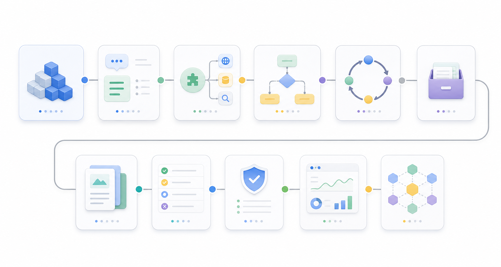

# Agent 学习路径

<p align="center">
  
</p>

> 目标：帮助技术人从 LLM API 使用者，逐步成长为能设计、评测、上线 Agent 系统的开发者。

**前置阅读：** 不确定自己需要 Agent、Workflow、RAG 还是 Fine-tune？先看 [AI 架构决策指南](../ai-architecture-decisions.md)，5 分钟确认方案方向。

Agent 学习不要从“多 Agent 框架”开始。更合理的路线是先理解 LLM 应用基础，再进入工具调用、工作流、记忆、评测、权限和生产化。

**深度专题：** [智能体设计模式](./agent-design-patterns/README.md)（20 篇）—— 从基础工作流到生产级工程化的关键设计模式，覆盖 ReAct、Plan-and-Solve、反思搜索、多 Agent 协作、反模式与评估精炼，每个模式按"解决什么失控点 / 引入什么复杂度 / 何时用"拆解。

## 资料筛选原则

这个专题不追求链接数量。优先收录：

- 官方文档和官方工程实践。
- 能解释架构取舍的文章，而不是只给 demo 的教程。
- 能落到工具调用、评测、权限、安全、生产化的资料。
- 对学习路线某个阶段有明确帮助的资源。

暂不优先收录：

- 只包装概念、不讲工程细节的营销文章。
- 没有更新时间、没有版本边界的教程。
- 只展示“多 Agent 很酷”，但没有评测和权限设计的内容。

## 精选学习资料

### 阶段 0-1：LLM 应用基础与上下文工程

| 资源 | 为什么收录 | 适合阶段 |
| --- | --- | --- |
| [OpenAI: A practical guide to building agents](https://cdn.openai.com/business-guides-and-resources/a-practical-guide-to-building-agents.pdf) | 从业务场景、guardrails、handoff、工具和上线角度讲 agent，比普通 API 教程更接近真实项目。 | 0-9 |
| [Anthropic: Building Effective AI Agents](https://resources.anthropic.com/building-effective-ai-agents) | 最值得先读的 agent 架构文章之一，明确区分 workflow 和 agent，强调简单系统优先。 | 1-4 |
| [OpenAI Agents SDK](https://platform.openai.com/docs/guides/agents-sdk/) | 官方 agent SDK 入口，能理解 agent、tool、handoff、guardrail、trace 这些基础抽象。 | 2-9 |
| [OpenAI Agents SDK: Agents](https://openai.github.io/openai-agents-python/agents/) | 更具体地解释 Agent、Runner、tools、guardrails、handoffs 和 sessions。 | 2-4 |

判断：入门阶段不要先学某个复杂框架。先读 OpenAI 和 Anthropic 的官方材料，建立“workflow 优先、agent 谨慎使用”的判断。

### 阶段 2：工具调用

| 资源 | 为什么收录 | 适合阶段 |
| --- | --- | --- |
| [OpenAI Agents SDK: Guardrails](https://openai.github.io/openai-agents-python/guardrails/) | 工具调用不是只定义 function schema，还要考虑输入、输出和工具级 guardrail。 | 2, 8 |
| [Anthropic Tool Use](https://docs.anthropic.com/en/docs/tool-use) | Claude 官方 tool use 文档，适合对比不同模型供应商的工具调用设计。 | 2 |
| [Model Context Protocol](https://modelcontextprotocol.io/) | MCP 已经成为 agent 接外部工具的重要协议，适合学习工具层标准化。 | 2, 8 |
| [MCP Client Best Practices](https://modelcontextprotocol.io/docs/develop/clients/client-best-practices) | 比普通 MCP 入门更有价值，强调工具注入、权限确认和客户端安全策略。 | 2, 8 |

判断：Tool Calling 阶段要重点学 schema、参数校验、失败处理和权限，而不是只学“怎么让模型调用函数”。

### 阶段 3-4：工作流与 Agent 循环

| 资源 | 为什么收录 | 适合阶段 |
| --- | --- | --- |
| [LangGraph Docs](https://langchain-ai.github.io/langgraph/) | 当前最适合学习状态机式 agent workflow 的框架之一，强调 graph、state、checkpoint、human-in-the-loop。 | 3-4 |
| [LangGraph Academy](https://academy.langchain.com/) | 课程化学习 LangGraph，比直接啃 API 更适合建立 workflow 思维。 | 3-4 |
| [CrewAI Docs](https://docs.crewai.com/) | 适合理解 crew、flow、role-based multi-agent，但要避免过早使用多 Agent。 | 3, 10 |
| [OpenAI Agents SDK: Running agents](https://openai.github.io/openai-agents-python/running_agents/) | 关注 agent 运行、tracing、tool execution、guardrails 和人类审批。 | 4, 9 |

判断：如果任务路径清晰，先用 workflow。只有任务路径开放、需要动态工具选择时，才进入 agent loop。

### 阶段 5-6：记忆与 Agentic RAG

| 资源 | 为什么收录 | 适合阶段 |
| --- | --- | --- |
| [LangChain Deep Agents: Memory](https://docs.langchain.com/oss/python/deepagents/long-term-memory) | 把 memory 当作可读写文件系统，适合理解“记忆不是普通 RAG”。 | 5 |
| [LlamaIndex Agents](https://docs.llamaindex.ai/en/stable/use_cases/agents/) | LlamaIndex 在 RAG 和 agentic RAG 方向资料完整，适合学习知识型 Agent。 | 6 |
| [LangChain: Build a RAG agent](https://docs.langchain.com/oss/python/langchain/rag) | 简洁展示“检索作为工具”的 RAG agent 思路。 | 6 |
| [LlamaIndex Agent Workflows](https://docs.llamaindex.ai/en/stable/module_guides/deploying/agents/) | 适合理解 agent、memory、tools、workflow 如何结合。 | 5-6 |

判断：Memory、RAG、state 是三件不同的事。不要把向量检索当成万能长期记忆。

### 阶段 7：评测

| 资源 | 为什么收录 | 适合阶段 |
| --- | --- | --- |
| [OpenAI Agent Evals](https://platform.openai.com/docs/guides/agent-evals) | 官方 agent eval 入口，强调 trace grading、datasets 和可复现评测。 | 7 |
| [LangChain Agent Evals](https://docs.langchain.com/oss/python/langchain/evals) | 适合学习 trajectory evaluation，关注消息序列和工具调用轨迹。 | 7 |
| [DeepEval Agent Evaluation](https://deepeval.com/docs/getting-started-agents) | 提供 task completion、argument correctness 等 agent eval 指标，适合快速搭评测 harness。 | 7 |
| [Promptfoo](https://www.promptfoo.dev/docs/intro/) | 开源 CLI 评测工具，适合 prompt regression、red teaming 和 CI 集成。 | 7-8 |

判断：Agent 评测不能只看最终答案。必须看工具调用轨迹、失败恢复、成本、延迟和越权行为。

### 阶段 8：安全与权限

| 资源 | 为什么收录 | 适合阶段 |
| --- | --- | --- |
| [OWASP Top 10 for LLM Applications](https://owasp.org/www-project-top-10-for-large-language-model-applications/) | LLM 应用安全基本盘，prompt injection、sensitive data、supply chain 都会影响 Agent。 | 8 |
| [OWASP Agentic Skills Top 10](https://owasp.org/www-project-agentic-skills-top-10/) | 更贴近 agentic skills 和工具链风险，适合 AI coding / agent skill 生态。 | 8 |
| [MCP Security Best Practices](https://modelcontextprotocol.io/specification/2025-06-18/basic/security_best_practices) | MCP 工具层安全必读，涉及 prompt injection、session hijack、tool poisoning 等风险。 | 8 |
| [OpenAI: Understanding prompt injections](https://openai.com/safety/prompt-injections/) | 对间接 prompt injection 的解释清晰，适合安全意识建立。 | 8 |
| [NIST AI Risk Management Framework](https://www.nist.gov/itl/ai-risk-management-framework) | 企业级 AI 风险管理框架，适合生产化和治理视角。 | 8-9 |

判断：Agent 一旦能执行工具，安全边界就不是“提示词写好一点”，而是权限、审计、人工确认和最小授权。

### 阶段 9-10：生产化与多 Agent

| 资源 | 为什么收录 | 适合阶段 |
| --- | --- | --- |
| [OpenAI Agents SDK: Tracing](https://github.com/openai/openai-agents-python/blob/main/docs/tracing.md) | 生产化 agent 必须能 trace、debug、回放；这比“回答看起来对”更重要。 | 9 |
| [LangSmith Evaluation](https://www.langchain.com/langsmith/evaluation) | 适合了解生产级 tracing、trajectory 和持续评测。 | 7, 9 |
| [CrewAI Docs](https://docs.crewai.com/) | 用于学习 multi-agent、crew、flow、memory、observability 的组合。 | 10 |
| [Microsoft AutoGen](https://microsoft.github.io/autogen/) | 多 Agent 框架代表，适合研究对话式多 agent 和工具协作。 | 10 |

判断：Multi-Agent 应该放在最后学。没有单 Agent 评测、权限和观测能力，多 Agent 只会放大混乱。

## 学习路线总览

| 阶段 | 主题 | 目标产出 |
| --- | --- | --- |
| 0 | LLM 应用基础 | 能稳定调用模型并处理结构化输出 |
| 1 | Prompt 与上下文工程 | 能让模型在明确边界内完成任务 |
| 2 | 工具调用 | 能让模型安全调用外部函数和 API |
| 3 | 工作流 | 能把多步骤任务拆成可控流程 |
| 4 | Agent 循环 | 能设计 observe -> plan -> act -> reflect 的执行循环 |
| 5 | Memory | 能区分短期上下文、长期记忆和项目知识 |
| 6 | 面向 Agent 的 RAG | 能让 Agent 使用外部知识而不是凭空回答 |
| 7 | 评测 | 能评测任务完成率、工具调用质量和失败模式 |
| 8 | 安全与权限 | 能控制工具权限、数据边界和高风险操作 |
| 9 | 生产化 | 能上线、观测、回放、降级和持续改进 Agent |
| 10 | 多 Agent | 能判断什么时候需要多个 Agent，什么时候不需要 |

## 阶段 0：LLM 应用基础

先掌握模型调用、消息结构、token、流式输出、错误重试、超时、成本和结构化输出。

你应该能完成：

- 调用一个 LLM API。
- 让模型返回 JSON。
- 处理失败、超时和重试。
- 记录 prompt、response、latency、cost。

不要急着用框架。先理解一次模型调用到底发生了什么。

## 阶段 1：Prompt 与上下文工程

Agent 的稳定性很大程度来自上下文设计，而不是“神奇 prompt”。

重点学习：

- system / developer / user message 的职责
- 任务边界
- 输出格式
- few-shot examples
- 约束条件
- 失败时如何让模型说明原因

产出：

- 一个可复用 prompt 模板。
- 一个失败案例记录表。
- 一个能稳定输出结构化结果的小任务。

## 阶段 2：工具调用

Agent 和普通 Chatbot 的分界点是工具调用。

重点学习：

- Function Calling / Tool Calling
- 工具 schema 设计
- 参数校验
- 工具结果摘要
- 工具失败处理
- 幂等性和副作用

产出：

- 一个能调用 2-3 个工具的小 Agent。
- 工具调用日志。
- 工具失败和重试策略。

建议工具：

- 搜索工具
- 文件读取工具
- 数据查询工具
- HTTP API 工具

## 阶段 3：工作流

很多业务不需要 autonomous agent，只需要 workflow。

重点学习：

- 顺序流程
- 条件分支
- 人工确认
- 重试
- 回滚
- 状态机

判断标准：

- 如果流程清晰、步骤固定，优先用 workflow。
- 如果任务开放、路径不确定，再考虑 agent。

产出：

- 一个审批型 AI workflow。
- 一个带人工确认节点的任务流。

## 阶段 4：Agent 循环

Agent 的核心不是“让模型一直想”，而是一个受控执行循环。

典型循环：

```txt
observe -> plan -> act -> evaluate -> continue / stop
```

重点学习：

- 任务规划
- 工具选择
- 中间状态
- 停止条件
- 自我检查
- 人工接管

产出：

- 一个能完成多步骤任务的 agent loop。
- 明确的最大步数、最大成本和停止条件。

## 阶段 5：记忆

不要一开始就做复杂记忆系统。

先区分：

| 类型 | 作用 | 示例 |
| --- | --- | --- |
| Short-term context | 当前任务上下文 | 当前对话、当前文件、当前步骤 |
| Long-term memory | 长期偏好和历史经验 | 用户偏好、常见决策 |
| Knowledge base | 外部事实和文档 | 产品文档、代码文档、政策 |
| Working state | 当前任务状态 | 已完成步骤、待处理工具结果 |

产出：

- 一个简单 memory schema。
- 一套记忆写入和读取规则。
- 一组“什么不应该写入记忆”的规则。

## 阶段 6：面向 Agent 的 RAG

Agent 需要知识时，不应该只靠模型参数记忆。

重点学习：

- 文档切分
- embedding
- 检索
- rerank
- citation
- 检索失败处理
- 知识更新机制

Agent 场景里的 RAG 重点不是“回答得像”，而是：

- 是否找到正确资料
- 是否知道资料不够
- 是否能引用来源
- 是否能把检索结果转成下一步行动

产出：

- 一个能检索文档并调用工具的 Agent。
- 一套检索质量评测样例。

## 阶段 7：评测

没有评测，Agent 只能停留在 Demo。

重点评测：

| 维度 | 问题 |
| --- | --- |
| Task success | 任务是否完成 |
| Tool accuracy | 工具是否选对、参数是否正确 |
| Grounding | 是否基于资料和工具结果 |
| Cost | token 和工具调用成本是否可接受 |
| Latency | 是否太慢 |
| Robustness | 输入变化后是否稳定 |
| Recovery | 失败后是否能恢复 |
| Safety | 是否越权、泄露、误操作 |

产出：

- 20-50 条评测用例。
- 每次版本变化后的回归评测记录。
- 失败案例分类。

## 阶段 8：安全与权限

Agent 越有用，越需要权限治理。

重点学习：

- 工具权限分级
- 只读和写操作分离
- 高风险操作人工确认
- secret 管理
- prompt injection
- 审计日志
- sandbox
- rate limit

产出：

- 一张工具权限表。
- 一套人工确认规则。
- 一个高风险操作拦截机制。

## 阶段 9：生产化

上线 Agent 的关键不是模型，而是工程系统。

重点学习：

- tracing
- replay
- observability
- cost monitoring
- fallback
- human-in-the-loop
- versioning
- prompt / tool / model 变更管理

产出：

- 一套 trace 日志。
- 一个失败任务 replay 工具。
- 一套降级策略。

## 阶段 10：多 Agent

最后再学 multi-agent。

适合 multi-agent 的情况：

- 任务天然有多个角色
- 需要并行研究和交叉验证
- 不同 agent 需要不同工具权限
- 需要隔离上下文

不适合 multi-agent 的情况：

- 单个 workflow 能解决
- 只是为了看起来高级
- 没有评测和权限控制
- 多 agent 之间互相聊天但没有产出

产出：

- 一个 researcher + implementer + reviewer 的三角色实验。
- 对比单 agent 与 multi-agent 的任务成功率、成本和耗时。

## 推荐学习顺序

1. LLM API
2. Structured Output
3. Prompt / Context Engineering
4. Tool Calling
5. Workflow
6. Agent Loop
7. Memory
8. RAG
9. Evaluation
10. Safety
11. Productionization
12. Multi-Agent

## 推荐第一个项目

做一个 **GitHub Issue Triage Agent**。

它应该能：

- 读取 issue 标题和正文。
- 判断 issue 类型：bug、feature、question、docs。
- 检索项目文档。
- 给出建议标签。
- 判断是否需要人工确认。
- 输出结构化 JSON。
- 记录失败案例。

这个项目足够小，但覆盖了 prompt、结构化输出、工具调用、RAG、评测和权限边界。

## 常见误区

- 一上来就用多 Agent。
- 把 Agent 当成无限循环的 Chatbot。
- 没有评测就谈生产化。
- 工具权限过大。
- RAG 没有引用和失败处理。
- 只看 Demo，不看日志、回放和成本。
- 用 prompt 模板替代工程控制。

## 下一步建设

- Agent 框架对比：LangGraph、OpenAI Agents SDK、AutoGen、CrewAI。
- Agent 工具设计指南。
- Agent 评测模板。
- Agent 安全与权限指南。
- Agent 生产化 checklist。
