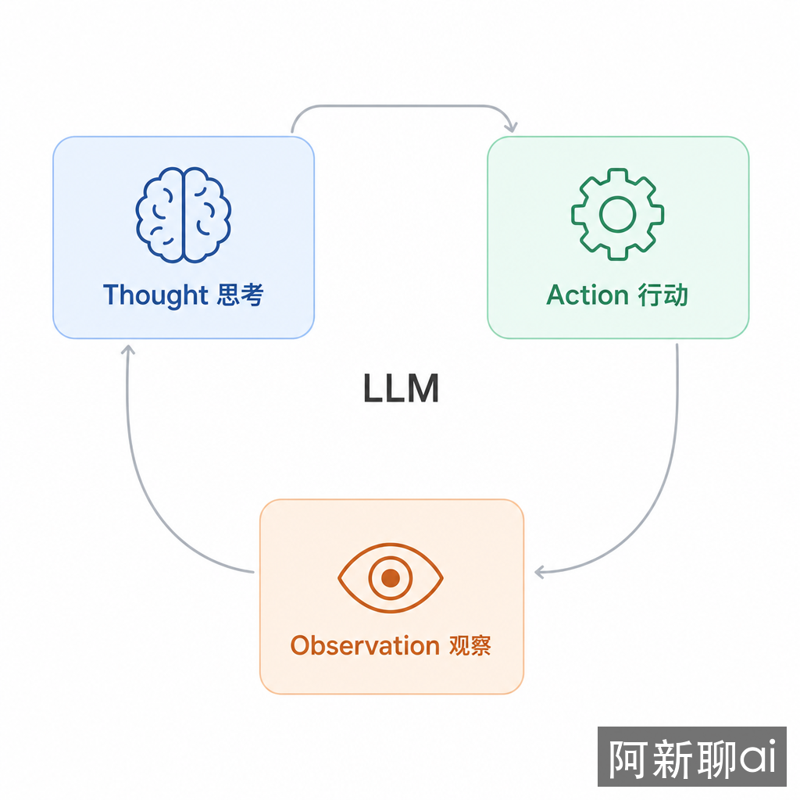

<!-- CONTACT-START -->
<!-- Auto-generated by scripts/inject-contact.sh — 单一真实源: docs/_snippets/contact.html -->
<div align="center">

**「阿新聊 AI」同步更新，欢迎关注**

<br>

<table>
<tr>
<td align="center">📢<br><b>微信公众号</b><br>阿新聊ai</td>
<td align="center">🎵<br><b>抖音</b><br>阿新聊ai</td>
<td align="center">📕<br><b>小红书</b><br>阿新聊ai</td>
<td align="center">💬<br><b>微信</b><br>mindcarver</td>
</tr>
</table>

🌐 AI 社区 · <a href="https://91aihub.com/">91aihub.com</a>

</div>
<!-- CONTACT-END -->

# ReAct：推理与行动的循环

ReAct（Reasoning + Acting）是最经典的智能体设计模式，出自 2022 年的论文 [ReAct: Synergizing Reasoning and Acting in Language Models](https://arxiv.org/abs/2210.03629)（ICLR 2023）。它将推理和行动交织在一个循环里，让模型在"想"和"做"之间交替推进，而不是纯靠推理猜测答案。



**TL;DR**：ReAct 的核心是 Thought→Action→Observation 循环——先想清楚下一步做什么，执行一个动作，观察结果，再想下一步。它在 HotpotQA 上比纯推理的 CoT 提升 +34%（ALFWorld），但每次循环都消耗一次 LLM 调用，5 步任务的成本约 $0.15。适合探索性任务，不适合步骤可预知的确定性任务。

## 它解决什么失控点

Chain-of-Thought（CoT）让 LLM 能"展示推理过程"，但推理完全是内部的——模型只能靠训练数据中的知识来推理，无法获取实时信息、无法验证假设、无法执行操作。ReAct 解决的正是这个"推理与行动脱节"的问题：让模型在推理过程中能够调用外部工具，用真实反馈修正推理方向。

论文中的实验数据清楚地展示了差距：在 ALFWorld（家庭环境任务）上，ReAct 比 Act-only（只做不想）提升 +34%，比 Thought-only（CoT，只想不做）提升 +10%。在 WebShop（在线购物任务）上同样有 +10% 的提升。差距的根源在于——纯推理会"想错"，纯行动会"做偏"，只有推理和行动交织才能互相纠正。

## 核心循环：Thought → Action → Observation

```text
Thought（思考）：模型分析当前状态，决定下一步做什么
Action（行动）：  调用一个工具，传入参数
Observation（观察）：获取工具返回的结果

重复以上循环，直到模型认为已经可以给出最终答案
```

三者形成闭环：推理决定行动，行动产生观察，观察更新推理。这比 CoT 的单向链条多了一个关键维度——外部反馈。

一个完整的 ReAct 交互示例：

```text
Question: 特斯拉的股票当前价格是多少？市值有多少？

Thought: 我需要先查找特斯拉的当前股票价格
Action: search
Action Input: "特斯拉 TSLA 股票当前价格"
Observation: TSLA 当前股价为 $248.50

Thought: 我知道了股价，但还需要总股数来计算市值
Action: search
Action Input: "特斯拉 TSLA 总股数"
Observation: 特斯拉总股数约 31.9 亿股

Thought: 现在我可以计算市值了：$248.50 × 31.9 亿 = 约 $7,927 亿
Final Answer: 特斯拉当前股价为 $248.50，市值约为 $7,927 亿美元。
```

这个例子展示了 ReAct 的核心优势：模型不需要"猜"股价，而是通过工具获取真实数据，再基于真实数据推理。

## 从文本解析到 Function Calling：实现方式的演进

ReAct 论文发表时（2022 年），LLM 还没有原生的工具调用能力。实现方式是**文本解析**——在 prompt 中定义格式模板，让模型输出 `Thought: ... / Action: ... / Observation: ...` 这样的文本，然后用正则表达式解析出动作和参数。

```python
# 早期实现：基于文本模板的 ReAct（LangChain 早期版本）
from langchain.agents import create_react_agent

prompt_template = """
可用工具：{tools}

使用以下格式：
Question: 输入的问题
Thought: 你对该做什么的思考
Action: 要使用的工具（必须是 [{tool_names}] 中的一个）
Action Input: 工具的输入参数
Observation: 工具的执行结果
... (Thought/Action/Action Input/Observation 可以重复)
Thought: 我现在知道最终答案了
Final Answer: 对原始问题的最终回答

Question: {input}
Thought: {agent_scratchpad}
"""
```

这种方式有一个致命弱点：**解析不稳定**。模型可能输出格式错误的文本，导致正则匹配失败。这也是早期 ReAct 实现中大量工程精力的消耗点。

2023 年下半年起，主流 LLM（GPT-4、Claude、Gemini）陆续支持了 **Function Calling**（也叫 Tool Use）。模型不再输出文本格式的动作描述，而是直接返回结构化的 `tool_call` 对象：

```python
# 现代实现：基于 Function Calling 的 ReAct（LangGraph）
from langgraph.prebuilt import create_react_agent

model = ChatOpenAI(model="gpt-4o")

agent = create_react_agent(
    model=model,
    tools=[search_tool, calculator_tool],
)

result = agent.invoke({
    "messages": [{"role": "user", "content": "特斯拉的股票当前价格是多少？市值有多少？"}]
})
```

关键区别：`create_react_agent` 不再需要文本模板，不需要正则解析。模型通过 Function Calling API 原生支持工具调用，框架只需要把工具定义传给模型、把执行结果传回模型。这让 ReAct 的实现从"脆弱的文本解析"变成了"可靠的结构化调用"。

底层状态图依然是 Thought→Action→Observation 循环，但表现形式从文本协议变成了 API 协议：

```python
# LangGraph 底层实现的简化逻辑
from langgraph.graph import StateGraph, MessagesState

def should_continue(state):
    last_message = state["messages"][-1]
    if last_message.tool_calls:
        return "tools"
    return END

graph = StateGraph(MessagesState)
graph.add_node("agent", call_model)
graph.add_node("tools", tool_node)

graph.add_edge(START, "agent")
graph.add_conditional_edges("agent", should_continue)
graph.add_edge("tools", "agent")
```

每个循环中：`agent` 节点调用 LLM（Thought），如果 LLM 返回了 tool_calls 则进入 `tools` 节点执行（Action + Observation），执行完回到 `agent` 节点继续下一轮推理。`recursion_limit`（默认 25）控制最大循环次数，防止无限循环。

## 为什么推理和行动必须交织

一个直觉上的问题是：能不能先做所有推理，再执行所有动作？或者先执行所有动作，再做所有推理？

论文的消融实验回答了这个问题：

- **ReAct > Act-only**：只做不想（没有 Thought 步骤），模型会盲目尝试工具，效率低且容易走偏。ALFWorld 上成功率从 35% 降到 20% 以下。
- **ReAct > Thought-only（CoT）**：只想不做（没有 Action 步骤），模型靠内部知识推理，会"自信地犯错"——比如幻觉出不存在的搜索结果，或者在事实已经变化的情况下用过时信息推理。HotpotQA 上比 ReAct 低约 10%。

推理和行动交织的价值在于**即时纠偏**：每执行一个动作，观察结果就能修正下一步的推理方向。如果模型在第 2 步发现搜索结果与预期不符，可以立即调整策略，而不是基于错误假设继续推理。

## 工程考量

### 停止条件

ReAct 的循环没有自然的终止点——模型可能一直调用工具而不给出最终答案。必须设置：

- **最大迭代次数**：通常 5-10 次。超过后强制终止，返回当前最佳答案。
- **递归深度限制**：LangGraph 的 `recursion_limit`，默认 25。
- **Token 预算**：当累计 Token 消耗超过阈值时终止。参考[资源感知章节](05-engineering-reliability-security-resources-eval.md)中的 Token 预算管理。

### 工具质量

ReAct 的效果很大程度上取决于工具的质量。工具描述必须清晰准确，否则模型会选错工具或传入错误参数。这不是框架能解决的问题——一个描述模糊的工具（"搜索信息"）和一个描述精确的工具（"搜索实时股票价格，输入股票代码，返回当前价格和涨跌幅"）会导致截然不同的效果。参考[工具设计章节](03-external-world-tools-mcp-knowledge-retrieval.md)中的工具设计原则。

### 成本

每次 Thought-Action-Observation 循环都消耗一次 LLM 调用。假设使用 GPT-4o（$5/M input, $15/M output），一个 5 步任务：

- 每步约 500 input tokens + 200 output tokens
- 5 步 = 2,500 input + 1,000 output
- 成本 ≈ $0.012 + $0.015 = **$0.027/次**

看起来不多，但如果每天处理 10,000 个请求，就是 **$270/天**。而且这只是简单估算——实际中 prompt 模板、工具定义、历史 scratchpad 都会增加 input token 数。对比 [Plan and Solve](07-plan-and-solve-plan-then-execute.md) 的成本模型：ReAct 用同一个贵模型做每一步，Plan-and-Solve 可以用贵模型做规划、便宜模型做执行，5 步任务成本约 $0.015（省 45%）。

### 适用场景

**适合**：探索性任务——目标不完全清晰，需要通过工具交互来逐步收集信息。例如：多轮搜索后综合回答、需要验证假设的推理任务、环境状态不确定的决策任务。

**不适合**：目标明确且步骤可预知的任务。例如："把这三个 CSV 文件合并"——步骤清晰，不需要边做边想，[Plan and Solve](07-plan-and-solve-plan-then-execute.md) 更合适。也不适合需要全局视角的任务——ReAct 每步只看当前状态和上一步结果，缺乏对整体任务的结构化理解。

## 与其他模式的关系

ReAct 是智能体设计的基础构件，很多后续模式都在它的基础上演化：

- **Plan and Solve**：在 ReAct 之上加了全局规划层。Planner 先生成完整计划，执行器按计划逐步执行（每步可以用 ReAct），Replanner 根据反馈调整计划。适合需要全局视野的复杂任务。
- **ReWOO / LLMCompiler**：ReAct 的"观察依赖"导致每步必须等上一步完成。并行规划模式通过占位符或 DAG，把可并行的信息获取提前拆出来。详见 [并行规划章节](08-parallel-planning-rewoo-llmcompiler.md)。
- **Basic Reflection / Reflexion / LATS**：在 ReAct 之上加了审查、记忆或树搜索。ReAct 每次沿一条路径执行，反思与搜索模式会比较、修正或保留历史经验。详见 [反思与搜索章节](09-reflection-search-basic-reflexion-lats.md)。
- **CodeAct**：用代码替代自然语言作为动作描述。Python 代码比 `Action: search, Input: "xxx"` 的表达力强得多——可以定义变量、写循环、处理异常。UPAR（Understand-Plan-Act-Reflect）在 GSM8K-Hard 上用 CodeAct 从 22.9% 提升到 58.3%。

社区中 "ReAct is Dead" 的讨论并不是说 ReAct 被淘汰了，而是说 ReAct 从"完整的解决方案"变成了"基础的构建块"——几乎所有现代智能体框架的底层执行循环仍然是 Thought→Action→Observation，只是上层加了规划、反思、并行等机制。

## 进一步阅读

- [ReAct 原始论文](https://arxiv.org/abs/2210.03629) — Yao et al., ICLR 2023，基准数据和消融实验的权威来源
- [LangChain Plan-and-Execute 博文](https://blog.langchain.dev/planning-agents/) — LangChain 团队对 ReAct 与 Plan-and-Execute 的对比，包含成本分析
- [LangGraph ReAct Agent 文档](https://langchain-ai.github.io/langgraph/reference/prebuilt/) — `create_react_agent` 的官方文档和配置选项
- [CodeAct: Code as Actions](https://arxiv.org/abs/2401.03168) — 用代码替代自然语言作为动作描述的 ReAct 变体
- [Self-Discover: Reasoning Strategy Discovery](https://arxiv.org/abs/2402.03668) — 自动选择最佳推理策略的元认知模式，可视为 ReAct 的"元层"扩展
