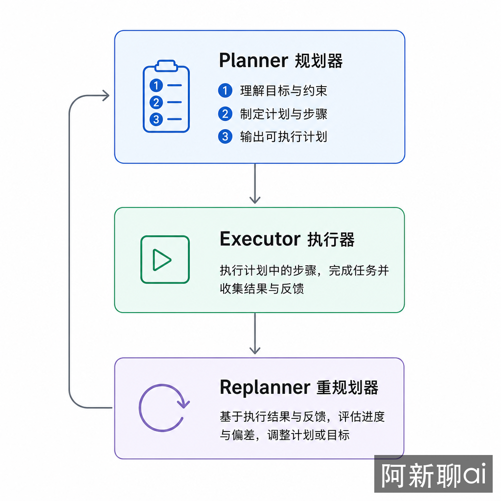

# Plan and Solve：先规划再执行

Plan and Solve 出自论文 [Plan-and-Solve Prompting](https://arxiv.org/abs/2305.04091)（Wang et al., ACL 2023），核心思路是"先想清楚全局，再按计划执行"。相比 [ReAct](06-react-reasoning-action-loop.md) 的"边想边做"，Plan and Solve 更适合目标明确的复杂任务——先有完整的计划，再逐步执行，执行过程中根据反馈动态调整。



**TL;DR**：Plan and Solve 将任务分为规划（Planner）→ 执行（Executor）→ 重规划（Replanner）三个阶段。它最大的优势是全局视野和可审查性——人类可以在执行前审查计划。PS+ 变体比 zero-shot CoT 提升最高 +8%。成本上，5 步任务约 $0.015（用 GPT-4o 做规划 + GPT-4o-mini 做执行），比 ReAct 省 45%。适合目标明确的复杂任务，不适合探索性任务。

## 它解决什么失控点

[ReAct](06-react-reasoning-action-loop.md) 的 Thought→Action→Observation 循环有一个结构性弱点：**缺乏全局视野**。每一步只看当前状态和上一步结果，无法预见后续步骤的依赖关系和潜在冲突。这导致三个问题：

1. **走弯路**：模型在第 3 步才发现第 1 步的方向错了，浪费了两次工具调用
2. **重复劳动**：第 4 步和第 2 步做了相同的事情，因为模型"忘了"之前已经做过
3. **无法审查**：人类无法在执行前知道模型打算做什么，只能在事后看日志

Plan and Solve 通过引入"规划层"来解决这些问题——Planner 先生成完整计划，人类可以审查，Executor 按计划执行，Replanner 在执行偏差时调整计划。

## 三大组件：Planner → Executor → Replanner

```text
Planner（规划器）：   分析任务，生成一个有序的执行步骤列表
Executor（执行器）：  逐步执行计划中的每个步骤
Replanner（重规划器）：每步执行后，评估是否需要调整剩余计划
```

一个关键细节：**Replanner 在每步执行后都会触发**，不是只在出错时才触发。这不是"出错才重规划"，而是"每步都评估"。原因是即使当前步骤执行成功了，后续步骤可能需要根据新信息调整——比如第 2 步的搜索结果改变了第 3 步的查询关键词。

### 规划阶段的 prompt

```python
planner_prompt = """
你是一个任务规划专家。将以下任务分解为可执行的步骤。

任务：{task}

请输出一个有序的步骤列表，每步包含：
- step: 步骤描述
- tool: 使用的工具
- input: 工具输入

注意：
- 步骤之间不要有冗余
- 每步只做一件事
- 考虑步骤之间的依赖关系
"""
```

Planner 通常使用较强的模型（GPT-4o、Claude Sonnet），因为规划需要理解任务的全局结构。

### 重规划阶段的 prompt

```python
replanner_prompt = """
你是一个任务重规划专家。

原始任务：{task}
原计划：{plan}
已完成的步骤：{past_steps}
最新观察：{observation}

请评估：
1. 当前步骤是否按预期完成？
2. 剩余计划是否仍然有效？
3. 是否需要插入新的步骤？

如果计划仍然有效，保持不变。
如果需要修改，输出修改后的完整剩余计划。
"""
```

注意 `{plan}` 包含的是完整原始计划，`{past_steps}` 是已完成的步骤和结果。Replanner 需要看到全局信息才能做出合理的调整。

## 一个完整的执行流程

以"分析竞品 A 和竞品 B 的市场份额差异"为例：

```text
=== 规划阶段 ===
Planner 生成计划：
  Step 1: 搜索竞品 A 的最新市场份额数据
  Step 2: 搜索竞品 B 的最新市场份额数据
  Step 3: 对比两者数据，分析差异原因
  Step 4: 生成分析报告

=== 执行阶段 ===

Executor 执行 Step 1: search("竞品 A 市场份额 2025")
Observation: 竞品 A 市场份额 32%，同比增长 5%

Replanner 评估: 计划仍然有效，继续执行 Step 2

Executor 执行 Step 2: search("竞品 B 市场份额 2025")
Observation: 竞品 B 市场份额 28%，同比下降 3%

Replanner 评估: Step 3 需要补充竞品 B 下降原因的数据
  → 修改计划：在 Step 3 前插入 "搜索竞品 B 下降原因"
  → 新 Step 3: search("竞品 B 业绩下滑原因")
  → 原 Step 3 变为 Step 4，原 Step 4 变为 Step 5

Executor 执行新 Step 3: search("竞品 B 业绩下滑原因")
Observation: 竞品 B 因供应链问题导致出货量下降 15%

... 继续执行直到计划完成
```

这个例子展示了重规划的实际价值：Step 2 的结果揭示了新的信息需求，Replanner 及时插入了新的步骤，避免了"带着不完整的分析出报告"的问题。

## 成本模型：与 ReAct 的关键区别

Plan and Solve 的成本结构与 ReAct 有本质区别：

**ReAct 的成本**：每一步都用同一个模型（通常是比较贵的模型）。

```text
5 步任务 × GPT-4o = 5 次贵模型调用
→ 约 $0.027
```

**Plan and Solve 的成本**：规划和重规划用贵模型，执行用便宜模型。

```text
1 次规划（GPT-4o）+ 5 次执行（GPT-4o-mini）+ 1 次重规划（GPT-4o）
= 2 次贵模型 + 5 次便宜模型
→ 约 $0.015（省 45%）
```

成本差异的根源：规划需要全局理解能力（贵模型擅长），但"搜索 X 的数据"这种单步执行用便宜模型就够了。任务越长、步骤越多，Plan and Solve 的成本优势越明显。

但重规划本身也有成本——每次重规划都是一次额外的 LLM 调用。如果任务高度不确定、每步都需要大幅修改计划，重规划成本会接近甚至超过 ReAct。这也是为什么 Plan and Solve 不适合探索性任务：不确定性高意味着频繁重规划，重规划成本吃掉了"用便宜模型执行"的节省。

## 与 ReAct 的对比

| 维度 | ReAct | Plan and Solve |
|------|-------|----------------|
| 决策时机 | 每步实时决策 | 先全局规划再执行 |
| 灵活性 | 高，随时调整方向 | 中，需要重规划才能调整 |
| 全局视野 | 弱，只见当前步 | 强，能看到完整计划 |
| 适用场景 | 探索性任务 | 目标明确的复杂任务 |
| 中间产物 | 无 | 可审查的执行计划 |
| 成本模型 | N 次贵模型 | 2 次贵模型 + N 次便宜模型 |
| 工具选择 | 每步重新决策 | 计划阶段已确定 |

最重要的区别是**中间产物的可审查性**。Plan and Solve 生成的计划可以被人类审查、修改、批准后再执行。这在生产环境中意义重大——高风险操作（删除数据、发送邮件、修改配置）在执行前有人工确认的环节。这与[工程化章节](05-engineering-reliability-security-resources-eval.md)中讨论的 Human-in-the-Loop 设计一致。

## 混合模式：Plan and Solve + ReAct

实际上，Plan and Solve 和 ReAct 并不是互斥的。一个常见的生产模式是：

```text
Planner 生成计划 → 每步执行用 ReAct 循环 → Replanner 根据结果调整计划
```

Plan and Solve 提供"全局规划 + 可审查性"，ReAct 提供"单步执行的灵活性"。比如"搜索竞品 A 的市场份额"这一步，执行器内部可以用 ReAct 循环——第一次搜索结果不够详细，再搜索一次；发现数据来源不可靠，换个数据源。这种单步探索用 ReAct 很合适，但整体计划由 Planner 控制。

LangChain 的 [Plan-and-Execute Agent](https://blog.langchain.dev/planning-agents/) 就是这种混合模式的标准实现：Planner 生成步骤列表，每个步骤由一个 ReAct agent 执行，Replanner 在步骤完成后评估和调整。

## 工程考量

### 规划的粒度

Planner 生成计划的粒度直接影响效果：

- **太粗**（"分析市场份额"）→ Executor 不知道该调用什么工具
- **太细**（"调用 search API，参数 q='竞品A', limit=5"）→ 规划成本高，且过度约束执行器

合理的粒度是"一个步骤对应一次工具调用"——比如"搜索竞品 A 的最新市场份额数据"而不是"分析市场"。

### 重规划的触发条件

前面提到 Replanner 在每步执行后都会触发。但"每步都重规划"的成本很高。实践中可以设置触发条件：

- **强制重规划**：每 N 步触发一次（比如每 3 步）
- **条件重规划**：只有当执行结果与预期差距超过阈值时才触发（比如搜索返回空结果）
- **混合策略**：前几步强制重规划（任务初期不确定性高），后期条件重规划

### 与提示链的关系

Plan and Solve 可以看作[提示链](02-workflow-skeleton-prompt-chaining-routing-parallel-planning.md)的动态版本。提示链的步骤是预先固定的，Plan and Solve 的步骤是运行时生成的。当任务结构固定、步骤不变时，直接用提示链更简单可控；当任务结构需要根据输入动态调整时，用 Plan and Solve 更灵活。

### 何时用，何时不用

**适合用**：
- 目标明确的复杂任务（"完成季度报告"比"研究一下市场"更适合）
- 需要人工审查执行计划的场景
- 步骤较多（>5 步）且成本敏感的任务
- 需要全局依赖关系的任务（步骤 B 依赖步骤 A 的结果）

**不适合用**：
- 探索性任务（目标不明确，需要边做边发现）
- 简单任务（2-3 步就能完成，规划的开销不划算）
- 高度不确定的环境（重规划成本会吃掉所有节省）

当步骤间依赖较少时，可以结合 [REWOO / LLMCompiler](08-parallel-planning-rewoo-llmcompiler.md) 实现并行执行——Planner 生成步骤后，不相互依赖的步骤可以并行执行，而不是串行等待。

## 进一步阅读

- [Plan-and-Solve 原始论文](https://arxiv.org/abs/2305.04091) — Wang et al., ACL 2023，PS+ 变体的基准数据
- [LangChain Plan-and-Execute 博文](https://blog.langchain.dev/planning-agents/) — 混合模式的实现细节和成本分析
- [ReAct 原始论文](https://arxiv.org/abs/2210.03629) — 理解 Plan and Solve 之前先理解 ReAct
- [HuggingGPT](https://arxiv.org/abs/2303.17580) — Plan and Solve 在多模型协作中的应用：LLM 做规划，专业模型做执行
- [REWOO](https://arxiv.org/abs/2305.18323) — 从 Plan and Solve 进一步演化：用"隐式观察"消除执行中的串行依赖
