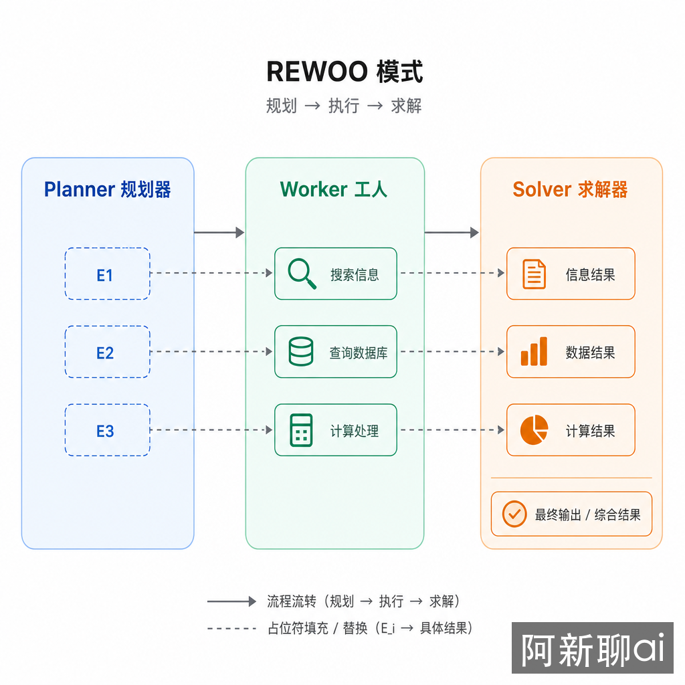
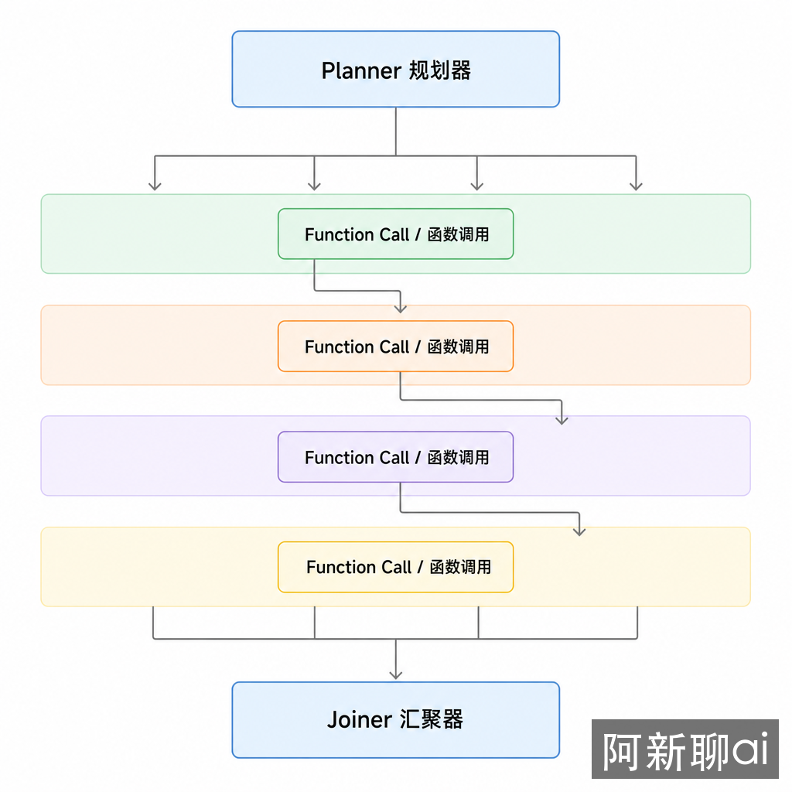

<!-- CONTACT-START -->
<!-- Auto-generated by scripts/inject-contact.sh — 单一真实源: docs/_snippets/contact.html -->
<div align="center">

**「阿新聊 AI」同步更新，欢迎关注**

<br>

<table>
<tr>
<td align="center">📢<br><b>微信公众号</b><br>阿新聊ai</td>
<td align="center">🎵<br><b>抖音</b><br>阿新聊ai</td>
<td align="center">📕<br><b>小红书</b><br>阿新聊ai</td>
<td align="center">💬<br><b>微信</b><br>mindcarver</td>
</tr>
</table>

🌐 AI 社区 · <a href="https://91aihub.com/">91aihub.com</a>

</div>
<!-- CONTACT-END -->

# 并行规划：REWOO 与 LLMCompiler 如何减少等待

**TL;DR：** ReAct 和普通 Plan-and-Solve 的默认执行方式偏串行：先做一步，看到结果，再决定下一步。REWOO 和 LLMCompiler 解决的是同一个工程问题：哪些工具调用其实不必互相等待。区别在于，REWOO 用占位符把观察结果提前预留出来，LLMCompiler 用 DAG 把依赖关系显式建模。

## 问题：Agent 为什么慢

想象你让一个 Agent 写竞品分析。它需要查官网、看价格页、找用户评论、拉一份内部销售数据。如果按照 ReAct 循环，它可能这样做：

```text
想：先查 A 公司官网
做：搜索 A 官网
看：得到结果
想：再查 B 公司官网
做：搜索 B 官网
看：得到结果
想：再查价格页
...
```

这个流程像一个人一次只能打一通电话。很多信息彼此独立，却被强行排队。并行规划的目标不是让模型“更聪明”，而是让系统别把可并行的事情做成串行。

## 两种并行方式

把 Agent 想成一个项目经理。

REWOO 像项目经理先写一张清单：

```text
我需要三份材料：
[E1] A 公司价格
[E2] B 公司价格
[E3] 用户评论摘要

等材料回来后，再统一写结论。
```

它不等 `[E1]` 回来才决定要不要查 `[E2]`，因为这些材料本来就互不依赖。

LLMCompiler 更像项目经理画了一张依赖图：

```text
查 A 价格 ─┐
查 B 价格 ─┼─> 对比价格 ─┐
查评论  ───┘             ├─> 写最终报告
查内部数据 ───────────────┘
```

没有依赖的节点一起做，有依赖的节点等前置完成。它比 REWOO 多做了一件事：明确“谁必须等谁”。

## 两种模式的边界

### REWOO：用占位符拆掉不必要等待

REWOO 来自论文 *Decoupling Reasoning from Observations for Efficient Augmented Language Models*。它的核心流程是三步：



1. Planner 生成完整计划，把需要外部观察的位置标成 `[E1]`、`[E2]`。
2. Worker 并行执行这些观察任务，填充占位符。
3. Solver 读取填好的材料，生成最终答案。

```python
plan = [
    "读取 main.py -> [E1]",
    "搜索 Python 性能反模式 -> [E2]",
    "结合 [E1] 和 [E2] 给出优化建议",
]

observations = parallel_execute({
    "E1": read_file("main.py"),
    "E2": web_search("Python performance anti-patterns"),
})

answer = solve(plan, observations)
```

REWOO 的关键假设是：Planner 能提前判断需要哪些观察。如果计划漏掉关键材料，Solver 后面只能带着缺口写答案。

### LLMCompiler：把计划编译成依赖图

LLMCompiler 来自 *An Empirical Study on LLM Compiler*。它把任务拆成函数调用节点，再用有向无环图表示依赖。



```python
dag = {
    "search_docs": {"depends": [], "tool": "web_search"},
    "query_db": {"depends": [], "tool": "sql_query"},
    "summarize": {"depends": ["search_docs", "query_db"], "tool": "llm"},
    "validate": {"depends": ["summarize"], "tool": "checker"},
}
```

执行器只做一件事：不断找出依赖已经满足的节点，并行运行它们。

```python
def ready_nodes(dag, completed):
    return [
        name for name, node in dag.items()
        if name not in completed
        and all(dep in completed for dep in node["depends"])
    ]
```

LLMCompiler 适合“既有并行，又有局部依赖”的任务。它比 REWOO 重，但能表达更复杂的执行关系。

## 选择规则

| 场景 | 更合适的模式 | 原因 |
|------|--------------|------|
| 多个独立检索任务 | REWOO | 占位符足够表达依赖 |
| 多个任务有交叉依赖 | LLMCompiler | DAG 能表达等待关系 |
| 每一步都依赖上一步观察 | ReAct | 提前规划反而容易错 |
| 任务目标明确但执行步骤串行 | Plan and Solve | 不需要并行调度 |
| 写报告、调研、审计类任务 | REWOO 或 LLMCompiler | 常有多个独立资料源 |

一句话判断：如果你能在执行前列出“要查哪些材料”，REWOO 通常够用；如果你还需要描述“哪些材料回来后才能做下一步”，用 LLMCompiler。

## 工程实现要点

### 依赖必须显式

并行最大的风险是把有依赖的任务误判成独立任务。比如“先读取配置，再根据配置查询数据库”，这两步不能并行。如果 Planner 生成了错误依赖，系统会得到看似完整但逻辑错位的结果。

### 错误策略要按节点设计

并行执行不是“有一个失败就全盘失败”。不同节点需要不同策略：

```text
关键事实缺失：停止，要求补充
次要来源失败：降级，标记缺失
重复来源失败：继续，用其他来源替代
写入节点失败：停止，避免扩散
```

这比简单重试更重要。并行系统里，一个失败节点可能影响多个下游节点。

### 合并阶段决定最终质量

REWOO 的 Solver、LLMCompiler 的 Joiner 都不是简单拼接。它们要处理冲突、来源可信度、重复信息和缺失信息。并行只减少等待时间，不能自动提高判断质量。

## 权衡与局限

并行规划会增加系统复杂度。你需要追踪节点状态、依赖关系、失败传播、超时和部分结果。任务很短时，这些开销大于收益。

它也更依赖计划质量。ReAct 可以边走边改；REWOO 和 LLMCompiler 把更多判断放到执行前。如果前期计划错了，后期会更难补救。因此高不确定任务仍然适合 ReAct 或 Plan-and-Solve + 局部 ReAct。

## 结论

并行规划的价值不在于“更多 Agent 一起跑”，而在于识别不必要的等待。REWOO 是占位符版的并行计划，LLMCompiler 是 DAG 版的并行计划。先用 REWOO 解决独立观察任务，只有当依赖关系真的复杂时，再升级到 LLMCompiler。

## 延伸阅读

- [REWOO: Decoupling Reasoning from Observations](https://arxiv.org/abs/2305.18323)
- [An Empirical Study on LLM Compiler](https://arxiv.org/abs/2312.04511)
- [Building Effective Agents - Anthropic](https://www.anthropic.com/engineering/building-effective-agents)
- [LangChain Planning Agents](https://blog.langchain.dev/planning-agents/)
