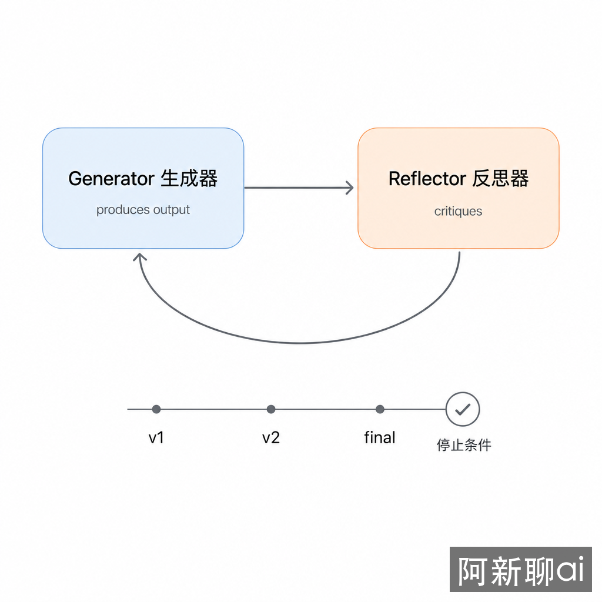
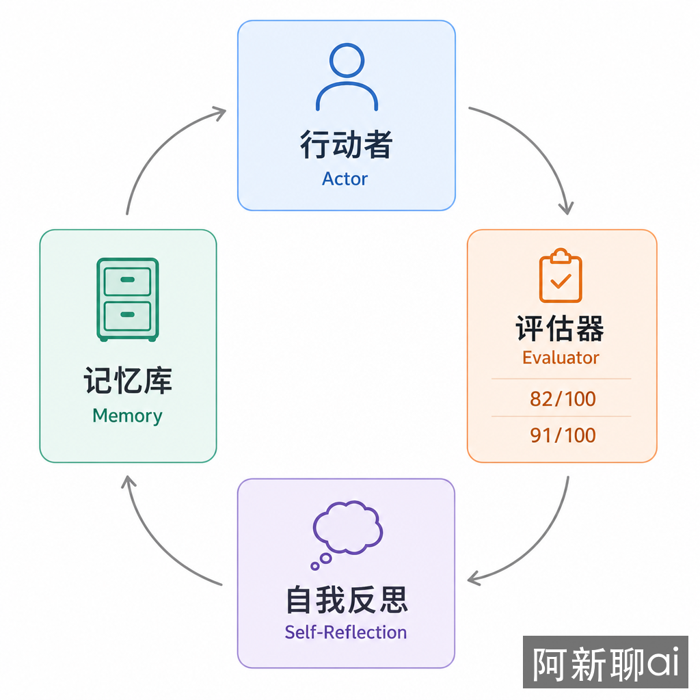
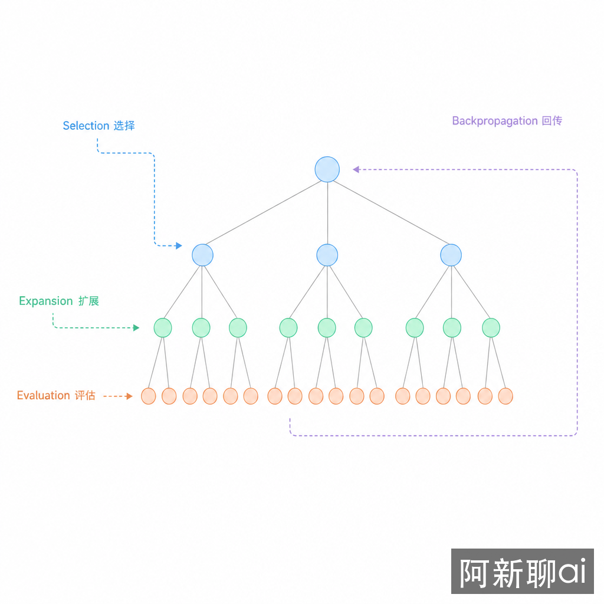

# 反思与搜索：从 Basic Reflection 到 Reflexion、LATS

**TL;DR：** Basic Reflection、Reflexion 和 LATS 都是在解决同一个问题：Agent 第一次做出来的结果经常不够好。Basic Reflection 让模型审查并修改当前输出；Reflexion 把失败经验写入记忆，下次复用；LATS 同时探索多条行动路径，再选择更优路径。它们的成本逐级升高，不能无脑套在所有任务上。

## 问题：一次生成为什么不够

LLM 很擅长给出一个“看起来完整”的答案，但真实工程任务通常需要检查：

- 代码是否能跑；
- 事实是否有来源；
- 方案是否遗漏约束；
- 是否存在更低风险的路径；
- 失败经验下次是否还能复用。

如果系统只生成一次就结束，错误会停留在结果里。反思类模式把“审查”和“改进”变成流程的一部分。

## 学生、错题本和多方案试算

Basic Reflection 像学生写完作业后自己检查一遍，发现错别字、漏步骤，再改一次。

Reflexion 像学生把错题写进错题本。下次遇到相似题，先看错题本，避免犯同样的错。

LATS 像同时尝试几种解题路线：一条路线用公式，一条路线画图，一条路线反推。每条路都打分，再沿着最有希望的路线继续走。

这三个模式不是并列替代品，而是三个成本等级。

## Basic Reflection：生成、批改、修改

Basic Reflection 的结构最简单：



```text
Generator -> Draft
Reflector -> Critique
Generator -> Revised Draft
```

```python
async def reflect_once(task, draft):
    critique = await llm.generate(f"""
    任务：{task}
    当前结果：{draft}

    找出具体问题：
    1. 是否遗漏需求？
    2. 是否有事实或逻辑错误？
    3. 哪些地方需要外部验证？
    """)

    revised = await llm.generate(f"""
    根据反馈修改结果。

    任务：{task}
    当前结果：{draft}
    反馈：{critique}
    """)

    return revised
```

它适合文章、方案、代码草稿这类“有明确质量标准，但第一次容易粗糙”的输出。

Basic Reflection 的主要风险是自嗨式审查。模型自己生成、自己评价，可能把错误说圆。所以反思最好接入外部证据：测试结果、检索来源、lint 输出、人工评审意见。

## Reflexion：把失败写进记忆

Reflexion 来自论文 *Reflexion: Language Agents with Verbal Reinforcement Learning*。它不是只问“这次哪里不好”，而是把失败转成可复用的语言经验：



```text
Actor 执行任务
Evaluator 给出奖励或评分
Self-Reflection 写出失败原因和下次策略
Memory 存储反思，供后续任务读取
```

```python
memory = []

async def execute_with_reflexion(task):
    response = await actor(task, memory[-3:])
    score = await evaluator(task, response)

    if score >= 0.8:
        return response

    lesson = await llm.generate(f"""
    任务：{task}
    输出：{response}
    评分：{score}

    写一条下次可复用的经验：
    - 错在哪里
    - 触发条件是什么
    - 下次应该怎么避免
    """)
    memory.append(lesson)
    return await actor(task, memory[-3:])
```

Reflexion 适合重复出现的任务：反复调试同一类测试失败、反复写同类报告、反复处理相似客户问题。一次性任务用 Reflexion 往往不划算，因为记忆还没来得及复用，成本已经发生。

## LATS：用树搜索比较多条路径

LATS 来自 *Language Agent Tree Search*。它把 Agent 的行动过程看成一棵树：



- 一个节点是一段 Thought-Action-Observation；
- 一条路径是一种解法；
- 每个节点可以被评估和反思；
- 搜索策略决定下一步扩展哪条路径。

```text
根问题
├─ 方案 A -> 观察 A -> 评分 0.6
├─ 方案 B -> 观察 B -> 评分 0.8
└─ 方案 C -> 观察 C -> 评分 0.3

继续扩展 B，而不是平均消耗预算。
```

LATS 借鉴了蒙特卡洛树搜索：在“继续尝试高分路径”和“探索新路径”之间平衡。它适合高价值问题，例如复杂调试、架构决策、数学推理、长链工具任务。

它不适合普通摘要、格式转换、简单查询。树搜索会放大 token、工具调用和验证成本。

## 选择规则

| 任务特征 | 推荐模式 | 原因 |
|----------|----------|------|
| 当前输出需要打磨 | Basic Reflection | 一轮审查修改足够 |
| 同类任务会反复出现 | Reflexion | 失败经验值得沉淀 |
| 存在多条可行路径 | LATS | 需要比较路径质量 |
| 有可靠测试或评分器 | Reflexion / LATS | 外部反馈能校准反思 |
| 没有外部验证信号 | 谨慎使用 | 自评容易自圆其说 |
| 低价值短任务 | 不使用 | 反思成本超过收益 |

## 工程实现要点

### 停止条件比反思 prompt 更重要

反思系统必须有硬边界：

```text
最多 3 轮修改
最多 2 次工具重试
测试通过即停止
评分超过阈值即停止
连续两轮无实质改进即停止
```

没有停止条件，反思会变成无限打磨。

### 记忆必须能被撤销

Reflexion 的记忆不是越多越好。错误反思会污染后续任务。记忆至少要包含来源、时间、适用范围和置信度。低置信度经验只能作为提示，不能作为规则。

### 评分器要尽量外部化

代码任务用测试、类型检查、lint；检索任务用引用覆盖率；写作任务用明确 rubric；安全任务用规则扫描。模型自评可以辅助，但不应成为唯一依据。

## 权衡与局限

反思模式增加了延迟和成本。Basic Reflection 至少多一次 LLM 调用；Reflexion 还要维护记忆；LATS 会成倍增加分支探索成本。

它们也不能替代真实验证。一个没有测试的代码反思循环，最多让模型更会解释自己的错误；它不能证明代码正确。

## 结论

先用 Basic Reflection 修正当前输出；当任务重复出现，再引入 Reflexion 记忆；只有当问题价值高、路径多、且有评分信号时，才使用 LATS。反思不是让模型多想几遍，而是把错误转成可验证、可复用、可停止的改进循环。

## 延伸阅读

- [Reflexion: Language Agents with Verbal Reinforcement Learning](https://arxiv.org/abs/2303.11366)
- [Language Agent Tree Search](https://arxiv.org/abs/2310.04444)
- [ReAct: Synergizing Reasoning and Acting in Language Models](https://arxiv.org/abs/2210.03629)
- [Building Effective Agents - Evaluator-optimizer workflow](https://www.anthropic.com/engineering/building-effective-agents)
