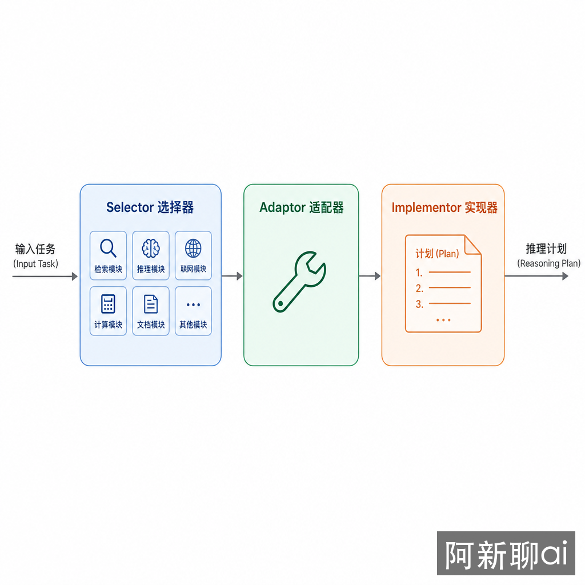
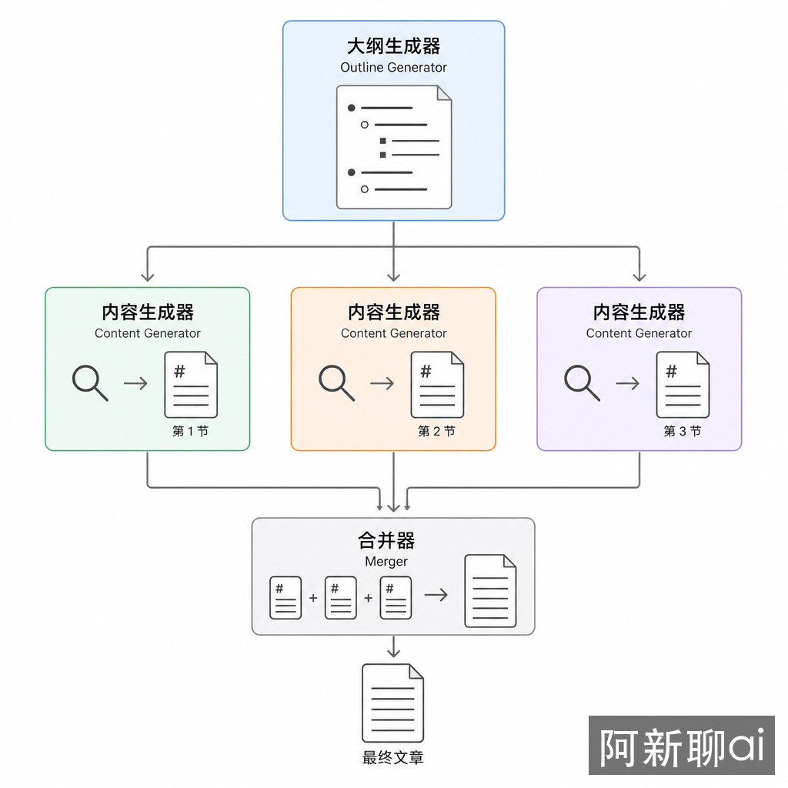

# 元认知：Self-Discover 与 Storm 如何先决定怎么想

**TL;DR：** Self-Discover 和 Storm 都不是普通执行模式。它们先决定“应该怎么组织思考”，再开始产出。Self-Discover 面向推理任务：从推理模块库中选择策略；Storm 面向长文生成：先搭大纲、做资料收集，再分节写作和合并。它们适合结构不明确的复杂任务，不适合短问答。

## 问题：有些任务输在“思考方式”上

ReAct 解决“边想边做”，Plan-and-Solve 解决“先计划再执行”，REWOO 和 LLMCompiler 解决“哪些步骤能并行”。这些模式默认你已经知道该怎么组织推理。

但很多任务一开始连推理方式都不明确：

- 这个问题该比较方案，还是做因果分析？
- 该先列约束，还是先找反例？
- 长文应该按时间线、组件、问题链，还是读者路径组织？

元认知模式处理的就是这个前置问题：先选择思考结构，再执行。

## 先选工具箱，再开始修

假设你要修一个坏掉的机器。普通 Agent 像拿起扳手就开始拧；Self-Discover 先看问题类型，决定要用万用表、螺丝刀还是替换件；Storm 则像写维修手册，先列目录、收集资料、分章节写，再统一校对。

一个关注“怎么推理”，一个关注“怎么组织长内容”。

## Self-Discover：让模型选择推理策略

Self-Discover 来自论文 *Self-Discover: Large Language Models Self-Compose Reasoning Structures*。它分三步：



1. Selector：从推理模块库中选择适合当前任务的模块。
2. Adaptor：把通用模块改写成当前任务可用的步骤。
3. Implementor：按适配后的结构执行推理。

推理模块库可以很朴素：

```python
REASONING_MODULES = {
    "decompose": "把复杂问题拆成子问题",
    "compare": "比较多个方案的优缺点",
    "causal": "分析原因和结果",
    "constraints": "列出约束并筛掉不可行方案",
    "reverse": "从目标倒推必要条件",
}
```

执行时先选策略：

```python
selected = select_modules(
    task="设计一个企业内部知识库 Agent",
    modules=REASONING_MODULES,
)

# 可能得到：
# constraints + decompose + compare
```

然后再把策略变成任务步骤：

```text
1. 列出企业知识库 Agent 的约束：权限、数据来源、更新频率、审计。
2. 拆分系统组件：检索、工具、记忆、评估、人工确认。
3. 比较两种架构：单 Agent + 工具，或多 Agent + 协调器。
```

Self-Discover 的价值是防止模型用单一套路处理所有问题。它的风险是模块库太虚，导致选择结果也很虚。模块描述必须具体，最好带适用条件。

## Storm：把长文生成拆成可控流水线

Storm 来自 *STORM: Writing Wikipedia-like Articles From Scratch with Large Language Models*。它解决的是长文生成的一类老问题：一次性写长文容易结构松散、重复、缺引用、前后风格不一致。



Storm 的流程是：

```text
生成大纲 -> 按章节收集资料 -> 分节写作 -> 合并 -> 精修
```

```python
outline = generate_outline(topic)

sections = []
for section in outline.sections:
    sources = research(section.questions)
    draft = write_section(section, sources)
    sections.append(draft)

article = merge_sections(sections)
final = refine(article)
```

Storm 的关键不是“大纲”两个字，而是把长文变成可检查的中间产物。你可以检查大纲是否覆盖核心问题，检查每节资料是否足够，检查合并后是否重复。

## 它们和前面模式的关系

Self-Discover 可以放在 ReAct、Plan-and-Solve 或 Reflexion 前面，作为“策略选择层”。

Storm 可以吸收前面所有模式：

- 用 REWOO 并行收集不同章节资料；
- 用 Basic Reflection 审查每个章节；
- 用 Reflexion 沉淀写作偏好；
- 用 LLMCompiler 管理章节依赖；
- 用人工评审作为合并前的质量门。

所以 Storm 更像一条内容生产流水线，而不是一个单独的推理技巧。

## 选择规则

| 场景 | 推荐模式 | 原因 |
|------|----------|------|
| 推理方式不明确 | Self-Discover | 先选推理结构 |
| 有固定领域方法论 | 领域模板优先 | 专家模板比模型自选更可靠 |
| 需要写长文、报告、百科条目 | Storm | 分阶段控制结构和资料 |
| 只写短摘要 | 不用 Storm | 流水线成本过高 |
| 高风险决策 | Self-Discover + 人工审查 | 策略选择不能完全交给模型 |

## 工程实现要点

### 模块库要小而清晰

不要给 Self-Discover 一个几十项、互相重叠的模块库。模型会选择听起来高级但不一定有用的模块。更好的做法是 8-12 个高频推理结构，每个模块写清楚适用条件和输出格式。

### 大纲是质量门，不是装饰

Storm 的大纲阶段应该能被拒绝。一个合格大纲至少要标明：目标读者、每节要回答的问题、需要的来源类型、哪些部分需要图或代码。否则后面的分节写作会变成散文拼接。

### 合并阶段要消除重复

并行分节写作会天然重复。Refiner 必须检查重复定义、重复背景、术语不一致、引用缺失和章节顺序。不要把“合并”实现成字符串拼接。

## 权衡与局限

Self-Discover 增加了前置推理成本，而且策略选择本身也可能错。对于已经有明确 SOP 的任务，直接使用固定流程更可靠。

Storm 适合高质量长文，不适合快速内容。它需要资料收集、章节状态、引用管理和最终精修。没有这些工程支撑，Storm 只是“先写大纲再写文章”的普通提示链。

## 结论

元认知模式的核心不是让 Agent 显得更复杂，而是在开始执行前选择合适的思考结构。Self-Discover 适合推理策略不明确的问题，Storm 适合长文和报告生成。只要任务已经有稳定流程，就优先用固定流程；只有结构不确定、质量要求高时，再引入元认知层。

## 延伸阅读

- [Self-Discover: Large Language Models Self-Compose Reasoning Structures](https://arxiv.org/abs/2402.03620)
- [STORM: Writing Wikipedia-like Articles From Scratch with Large Language Models](https://arxiv.org/abs/2402.14207)
- [OpenAI Agents SDK - Tools, Handoffs, Guardrails](https://openai.github.io/openai-agents-python/)
- [Building Effective Agents - Anthropic](https://www.anthropic.com/engineering/building-effective-agents)
