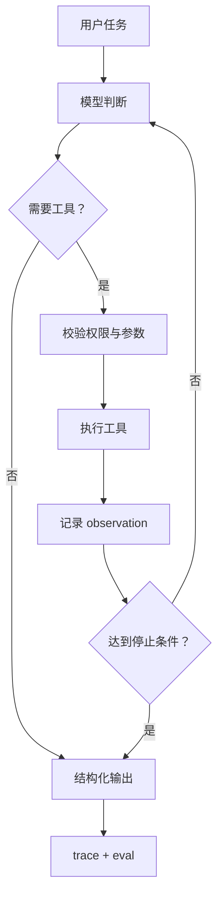

# Agent 地图

Agent 不是“让模型一直思考”。把它拆成工程部件后，学习顺序会清楚很多：

| 层 | 要回答的问题 | 最小产出 |
| --- | --- | --- |
| 场景 | 谁要完成什么任务？什么算完成？ | 任务契约和边界 |
| 模型 | 模型负责判断什么？输出什么结构？ | 一次稳定的结构化调用 |
| 工具 | Agent 能读什么、写什么、调用什么？ | 工具 schema、权限和失败策略 |
| 状态 | 哪些信息只属于当前任务？哪些需要长期保存？ | working state、短期上下文、长期记忆的区分 |
| 循环 | 什么时候继续、重试、暂停或交给人？ | 最大步数、停止条件和人工接管 |
| 证据 | 如何知道它完成了，而不是“看起来完成了”？ | trace、评测用例和失败分类 |
| 运行 | 上线后怎么回放、降级、控成本和审计？ | 观测、回放、版本和权限策略 |

## 一条最小链路

## 什么时候停在 Workflow

满足以下条件时，先用 workflow：

- 步骤固定，分支可以提前列出来。
- 高风险操作需要明确的人工确认点。
- 每一步的输入和输出都能用 schema 表达。
- “自主决定下一步”不会带来额外价值。

只有当路径开放、工具选择依赖上下文、或任务需要动态分解时，才进入 [ReAct 推理—行动循环](../agent-design-patterns/06-react-reasoning-action-loop.md)。如果需要先生成计划再执行，可以看 [Plan-and-Solve](../agent-design-patterns/07-plan-and-solve-plan-then-execute.md)。

## 你需要先学什么

1. [Agent 总览：从概念到生产](../agent-design-patterns/01-agent-overview-concept-to-production.md)：建立全局模型。
2. [外部世界、工具与知识检索](../agent-design-patterns/03-external-world-tools-mcp-knowledge-retrieval.md)：理解 Agent 如何接触外部世界。
3. [工程可靠性、安全、资源与评测](../agent-design-patterns/05-engineering-reliability-security-resources-eval.md)：把 Demo 变成可控系统。
4. [AI / 大模型 / Agent 评测专题](../../evaluation/README.md)：建立完成标准和回归机制。
5. [第一个项目契约](./04-first-project-contract.md)：把知识变成可审查的项目产物。

## 不要一开始做的事

- 不要先搭多 Agent，再寻找任务。
- 不要把最大步数、权限和失败处理藏在 prompt 里。
- 不要只保存最终答案，不保存工具轨迹。
- 不要用一次成功的 Demo 代替固定评测。
- 不要在还没证明单 Agent 不够时增加协作角色。

完整的 0—10 阶段学习顺序仍在 [Agent 学习路径](../README.md)，这张地图只是帮助你决定“下一步补哪一层”。
