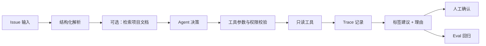

# 第一个 Agent 项目契约

推荐项目：**GitHub Issue Triage Agent**。它只做只读分析和标签建议，不直接修改仓库，足够覆盖结构化输出、工具调用、检索、评测和权限边界。

如果你的业务不同，可以替换场景，但不要删掉契约中的证据要求。

## 1. 场景与非目标

填写：

- 用户是谁：
- 输入来自哪里：
- Agent 要完成什么：
- 什么结果算成功：
- 明确不做什么：
- 哪些情况必须交给人：

一个好的 MVP 只解决一个窄问题，例如：

> 读取 issue 标题和正文，判断类型，检索相关项目文档，建议标签，并输出理由和置信信息；不自动修改 issue。

## 2. 最小架构

最小实现只需要：

- 一个模型调用入口。
- 一个只读工具。
- 一个明确的输出 schema。
- 一个最大步数或超时限制。
- 一个 trace 记录器。
- 一组固定评测用例。

先不要添加多 Agent、自动写入、复杂记忆或无明确收益的 RAG。

## 3. 工具与权限

为每个工具填写 [工具卡模板](../../../examples/agent/tool-card-template.md)：

| 工具 | 读 / 写 | 数据范围 | 最大风险 | 失败后 |
| --- | --- | --- | --- | --- |
| issue reader | 读 | 指定仓库和 issue | 读取不应公开的信息 | 停止并说明 |
| docs search | 读 | 项目文档 | 检索结果不完整 | 返回未确认 |
| label writer | 写 | issue 标签 | 误修改公开协作数据 | 初版禁用，改为人工确认 |

必须有：

- 参数 schema 和校验。
- 最小权限。
- 超时和重试上限。
- 工具失败的结构化返回。
- 高风险写操作的人审开关。

## 4. Trace 与评测

每次运行至少记录：

- run id、时间、版本。
- 输入摘要或脱敏输入。
- 模型和配置。
- 每一步的 action、tool、arguments、observation。
- 停止原因。
- 最终输出。
- 是否通过，以及失败分类。

参考 [trace schema](../../../examples/agent/trace-schema.json) 和 [eval cases](../../../examples/agent/eval-cases.jsonl)。

评测至少包含：

- 正常 issue。
- 缺少正文或上下文的 issue。
- 工具返回空结果。
- 工具超时或错误。
- 要求越权写入的输入。
- 与已有标签冲突的输入。

评测维度参考 [AI / 大模型 / Agent 评测专题](../../evaluation/README.md)，不要只看最终文本是否“像答案”。

## 5. README 交付结构

项目 README 至少包含：

1. 场景、用户和非目标。
2. 运行环境、安装和启动命令。
3. 架构图和工具权限表。
4. 一条成功 trace 和一条失败 trace。
5. eval cases、指标定义和当前结果。
6. 已知限制、风险和人工接管点。
7. 下一步计划，以及为什么暂时不做更复杂的能力。

可以直接复制 [项目 README 模板](../../../examples/agent/project-readme-template.md)。

## 6. 完成门槛

满足以下条件，才把项目标为“可交付”：

- [ ] 干净环境可以按 README 启动。
- [ ] 输入、输出和非目标明确。
- [ ] 工具权限最小化，写操作默认需要确认。
- [ ] 至少保存 3 条成功或失败 trace。
- [ ] eval cases 覆盖正常、边界、失败和越权。
- [ ] 每个指标都有计算方式和样本范围。
- [ ] 至少记录一个当前未解决的问题。
- [ ] 能解释一次失败是模型、工具、状态、数据还是评测设计导致的。

项目工程化细节可继续看 [项目 PRD](../ai-app-tutorials/projects/project-prd.md)、[项目测试与优化](../ai-app-tutorials/projects/project-testing-and-optimization.md) 和 [项目验收与专家包装](../ai-app-tutorials/projects/project-acceptance-and-expert-packaging.md)。
