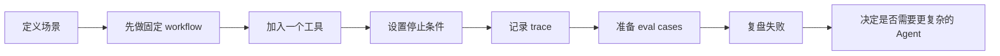

# Agent 快速开始

如果你第一次接触 Agent，不要从框架 API 或多 Agent 开始。先用一个小任务跑通：

```
任务定义 → 模型调用 → 工具调用 → 受控循环 → trace → eval → 复盘
```

这组入口补的是 [Agent 学习路径](../README.md) 之外的“第一公里”：帮你在一周内产出一个能运行、能解释、能评测的最小 Agent。

## 你应该怎么走

| 目标 | 入口 | 交付物 |
| --- | --- | --- |
| 先建立全局认知 | [Agent 地图](./01-agent-map.md) | 一张从模型调用到生产化的能力地图 |
| 7 天内跑出结果 | [7 天行动计划](./02-first-7-days.md) | 一个带工具、停止条件和失败记录的最小 Agent |
| 判断资料值不值得学 | [资源质量清单](./03-resource-quality-checklist.md) | 一份带来源、版本、运行证据的阅读记录 |
| 把项目做成作品 | [第一个项目契约](./04-first-project-contract.md) | README、工具卡、trace、评测用例和复盘结论 |
| 直接拿模板开工 | [Agent 可复用模板](../../../examples/agent/README.md) | 最小循环、trace schema、eval cases 和项目 README 模板 |

## 最小学习闭环



## 完成标准

完成这条快速开始，不等于“掌握 Agent”。它只要求你证明四件事：

1. 你能说明 Agent 的任务边界，以及为什么这个任务不只是一次普通模型调用。
2. 你能限制工具权限、最大步数、成本或超时，并处理工具失败。
3. 你能从 trace 中解释一次成功和一次失败，而不是只展示最终答案。
4. 你能用固定用例比较修改前后，而不是凭感觉宣布“效果变好了”。

更完整的模式、记忆、RAG、评测、安全和生产化内容，回到 [Agent 学习路径](../README.md)；项目拆解可继续看 [项目教程](../ai-app-tutorials/projects/project-prd.md)。

> [!NOTE]
> 如果你的流程固定、分支有限、每一步都能提前写清楚，优先实现 workflow。只有当路径确实依赖开放式判断时，才把它升级成 Agent。
