# 四个 SDK，一个引擎：Agent SDK 到底是什么

> 更新日期：2026/10

**TL;DR：** Claude Agent SDK 是一个把 Claude Code 整个引擎当作库来用的开发包，提供 Python 和 TypeScript 两种语言。它和 Claude Code CLI、Client SDK、Managed Agents 长得像，分工完全不同：CLI 给终端里的人用，Agent SDK 给写程序的人用，Client SDK 只给你模型 API 不给你引擎，Managed Agents 则是把引擎托管到 Anthropic 那边。选错的代价是白写几千行代码，这篇把四条路的边界画清楚。

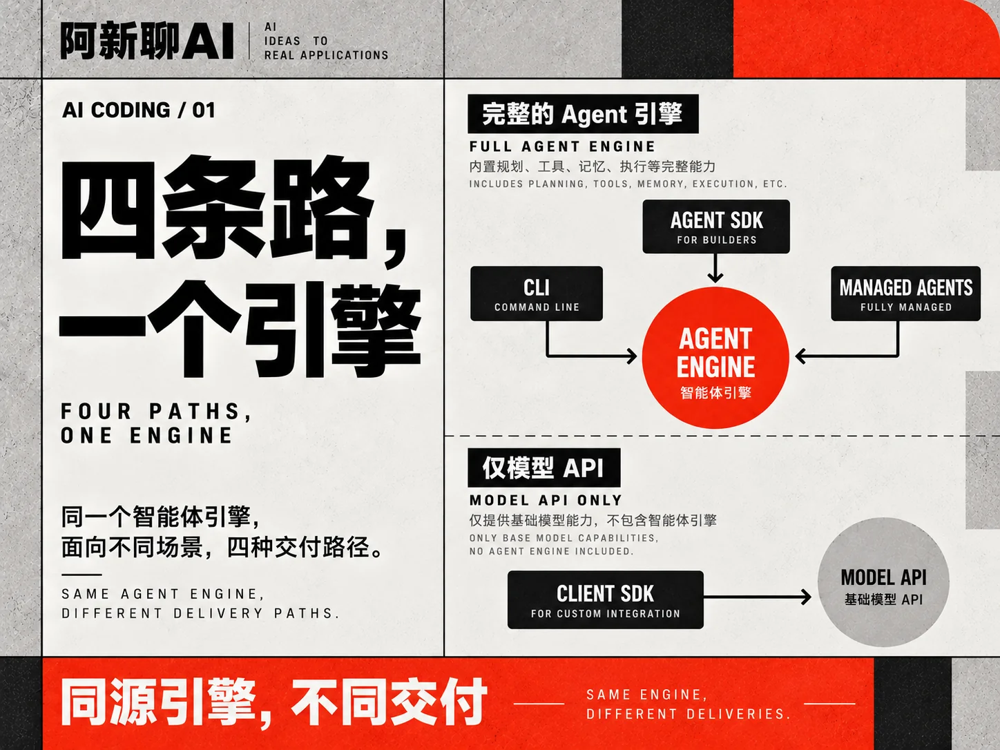

## 从一个真实选型场景开始

假设你要给团队做一个依赖升级机器人：每天晚上扫描仓库里过期的依赖，挑出安全补丁，开分支、改版本号、跑测试、提 PR。这个需求拿去找搜索，会撞出四个名字：Claude Code、Claude Agent SDK、Claude Client SDK、Managed Agents。四个都宣称能做 agent，四个的文档入口长得也差不多。

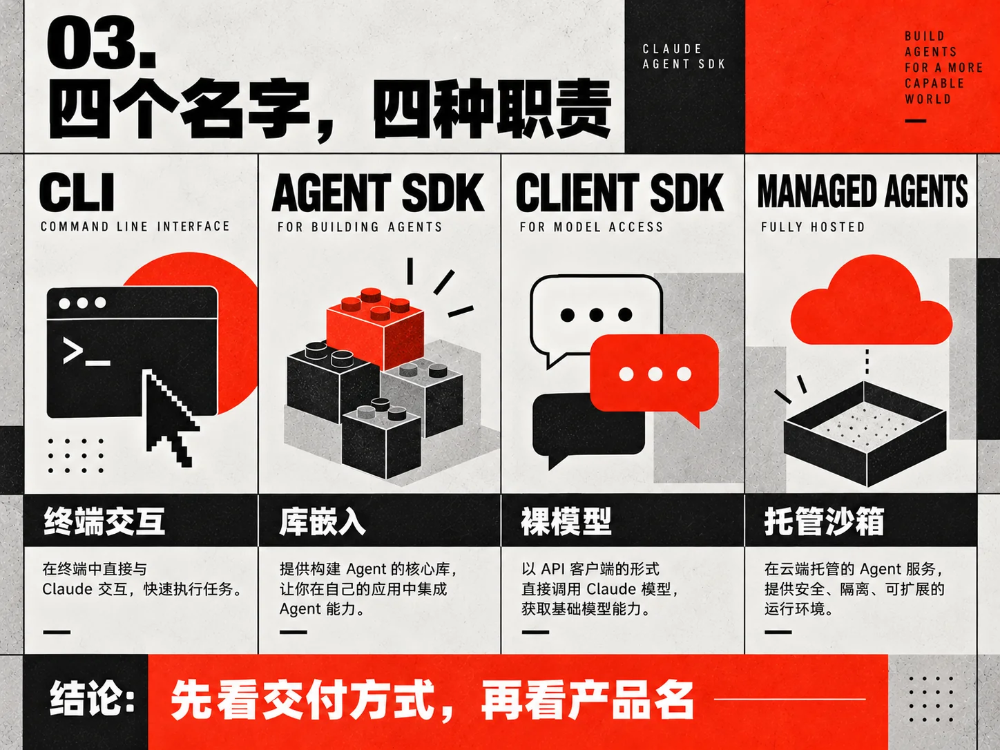

这个场景是理解四者差异的最好载体，全文用它做贯穿案例。先把结论放前面：依赖升级机器人要自己跑在你们的 CI 机器上、要读你们的私有仓库、要在代码改坏时自动回滚，这三件事决定了它需要完整的 agent 引擎而不是裸模型调用，还决定了它必须嵌进你们自己的调度程序，等不了有人在终端里敲命令。答案指向 Agent SDK。下面解释为什么，以及另外三个选项分别错在哪。

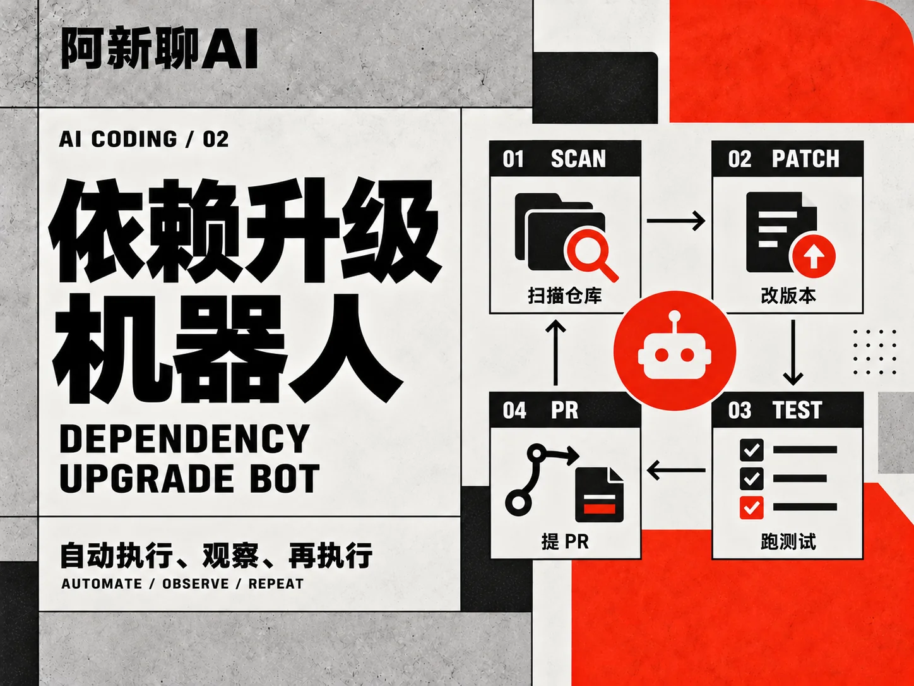

## 四个东西各自是什么

**Claude Code CLI** 是终端里的交互式工具。你打开终端，敲 claude，跟它对话，它读代码改文件跑命令。它的所有能力都为"有一个人坐在屏幕前"设计：权限提示弹给这个人看，进度条画给这个人看，会话历史存在这个人的机器上。依赖升级机器人没有这个人。凌晨三点机器人开始干活时，没有人回答"允许执行 npm install 吗"这个问题。CLI 有非交互模式，也能塞进 cron 里凑合跑，但它的产品重心始终是交互场景，把它当 SDK 用是在借用一个不是为编程使用设计的接口。

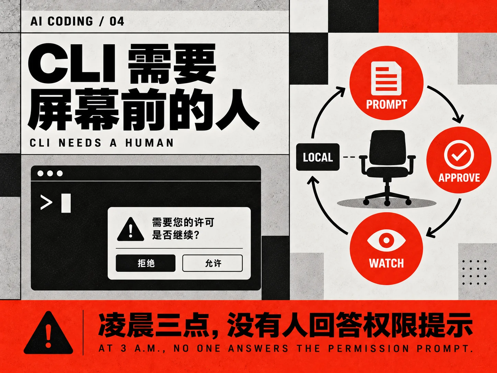

**Client SDK** 是模型 API 的薄封装。你拿到的是发消息、收回复、定义工具、处理工具调用的原语，agent 循环要自己写：调用模型，解析出工具请求，执行工具，把结果拼回去，再调模型，判断何时停止，处理超时和重试，管理上下文窗口。这条循环正是 Claude Code 花了几年打磨的部分，包括权限系统、文件检查点、上下文压缩、子代理调度。用 Client SDK 意味着这些全部自己造。依赖升级机器人需要可靠的"改文件、跑测试、看结果、决定继续还是回滚"循环，自己写一版能跑，写到生产级是另一个量级的工程。

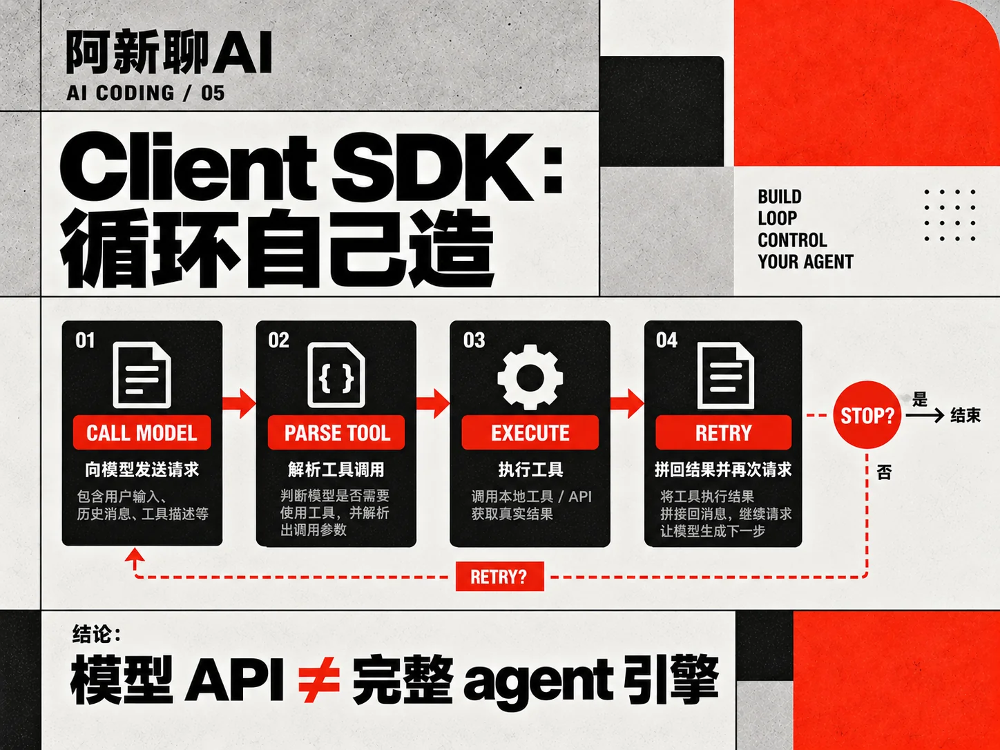

**Claude Agent SDK** 是本文主角。它把 Claude Code 的二进制程序包成一个库：你的 Python 或 TypeScript 程序通过它启动一个 Claude Code 子进程，把任务发给这个子进程，接收它吐回的事件流。引擎里现成的几十个内置工具、权限模式、会话管理、Skills 加载机制，你的程序全部直接继承。同时你获得了完整的编程控制面：什么时候发消息、什么时候打断、工具调用要不要批准、结果怎么结构化，都由你的代码决定。依赖升级机器人要的就是这个：引擎是现成的，调度和审批逻辑长在你们自己的系统里。

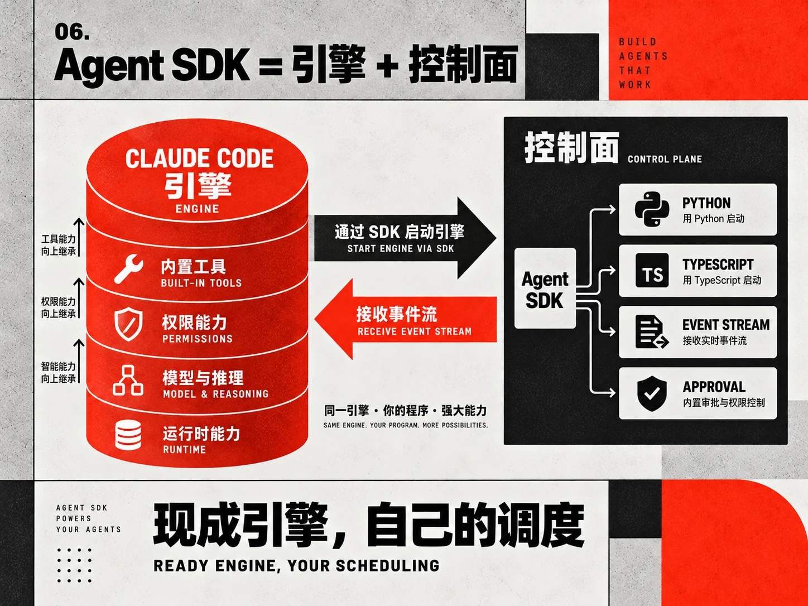

**Managed Agents** 是把 harness 这层也交给 Anthropic 的托管方案。你通过 SDK、ant 命令行或 REST API 描述一个期望的交付结果，agent 在 Anthropic 托管的沙箱（或你自托管的沙箱）里跑到结果达成为止。它适合"我只要结果，不要管过程"的任务形态。依赖升级机器人对过程有硬要求：必须用你们 CI 机器上的缓存，必须走你们的代码审查流程，所以托管式暂时不合用。但形态会变化，这个选项放在后面的决策框架里再谈。

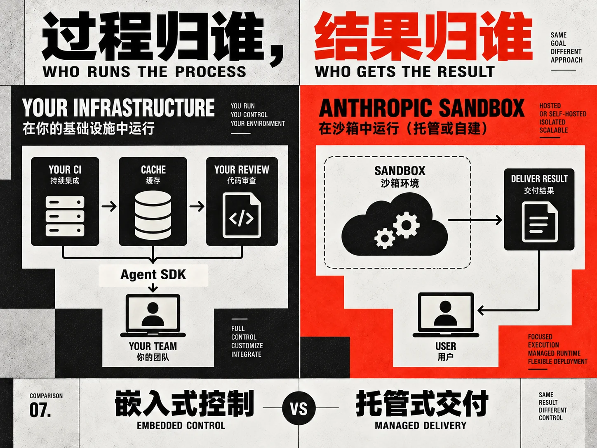

## 一个引擎，四种交付

四个东西的关系可以概括成一张分层图。最底下是同一个 agent 引擎：模型访问、工具执行、上下文管理、权限判断。往上第一层是交付方式：引擎被包成终端程序就是 CLI，被包成库就是 Agent SDK，被拿掉只留模型接口就是 Client SDK，被搬上云端配上托管沙箱就是 Managed Agents。

这个"同源"事实有一个直接推论，也是 Agent SDK 常被低估的原因：**Agent SDK 的能力上限就是 Claude Code 的能力上限**。CLI 每周更新的那些能力，检查点、子代理、Skills、tool search，SDK 同步继承，不需要等 SDK 团队重新实现。你在选择 Agent SDK 时，实际选择的是"Claude Code 的全部行为，加上我自己的程序外壳"。

反过来的推论同样成立：引擎的边界也是 SDK 的边界。比如 SDK 的选项里没有 temperature、top_p、max_tokens 这些采样参数。官方文档明确说，要控制生成风格用 effort 级别，要管花费用预算上限，要精细控制采样就直接调 Messages API。这不算功能缺失，更接近一个产品立场：Agent SDK 卖的是"把一个成品 agent 嵌进你的程序"，不做"让你重新组装一个 agent"的生意。接受这个立场，很多"为什么没有这个选项"的困惑会消失。

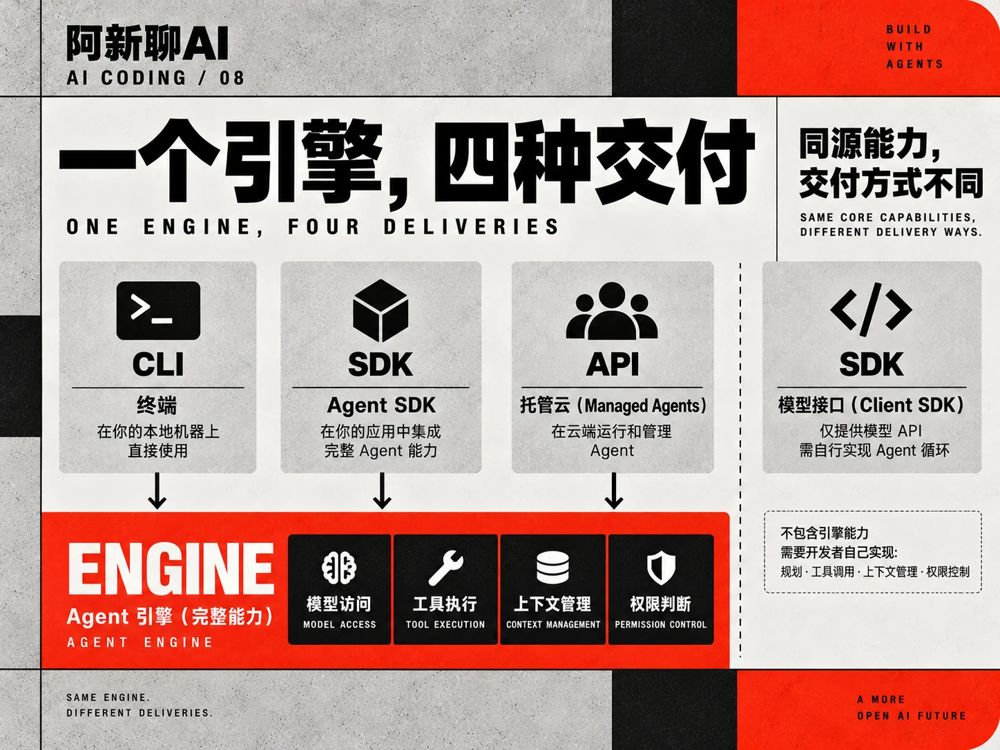

## 技术形态：库包装的二进制

Agent SDK 在技术上的实现方式值得单独讲，因为它解释了后面所有行为的来源。

安装 SDK 时，绝大多数平台会连带装上 Claude Code 的原生二进制。你的程序调用 SDK，SDK 在后台拉起这个二进制作为子进程，两者之间用基于 JSON 的输入输出协议通信：你这边发任务和审批决定，子进程那边回事件流和结果。TS 版装在 npm 依赖里，Python 版装在包里，个别平台（比如某些 Windows ARM 环境）源码包不带二进制，需要你先原生安装 Claude Code，SDK 会从 PATH 找到它。

这个架构带来四个后果，每一个都会在后续工程决策里遇到。第一，你的程序和引擎之间隔着一层进程边界，事件是序列化传输的，调试时要分别看两边。第二，SDK 版本和引擎版本存在绑定关系，某些能力要求引擎达到某个版本以上才能生效，比如预算上限的严格执行要求 Claude Code 2.1.217 以上。第三，每个 agent 会话对应真实的操作系统进程和内存占用，做并发时要按进程而不是按线程规划资源。第四，部署产物里要包含这个二进制，容器镜像、无服务器环境的打包方式都受它影响。

把这四条记下来，"SDK 为什么这样设计"类的问题大半有了答案。

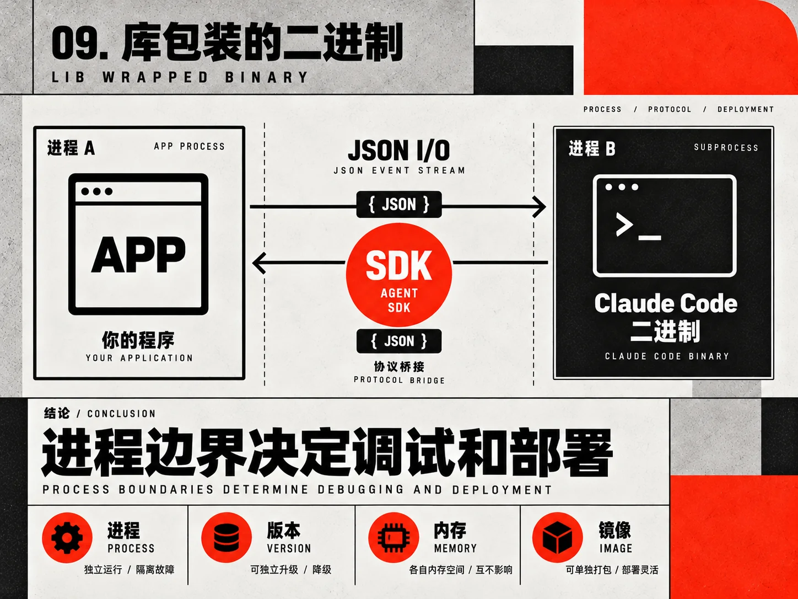

## 认证与商业边界

Agent SDK 的认证规则和 CLI 有一个关键差别：**第三方开发者不能借 claude.ai 登录**。你自己用 SDK，可以走 Anthropic API key；你做的产品给别人用，同样要求用户提供 API key 或走企业通道。官方文档写得直白，第三方产品一般不得提供 claude.ai 登录和它的限额。

企业环境有另外三条路：AWS Bedrock、Claude Platform on AWS、Google Vertex，各自通过环境变量切换。这四种通道覆盖了从个人项目到企业自有云的绝大多数部署形态。

还有一条容易被忽略的商业条款：命名。基于 SDK 构建的产品可以叫"某某 Claude Agent"，不可以叫"某某 Claude Code Agent"。授权遵循 Anthropic 的商业服务条款。做内部工具时这条无所谓，产品要对外发布时它是硬约束。

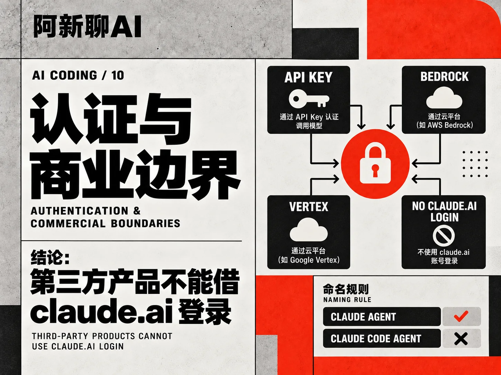

## 决策框架：四个问题

回到贯穿案例，选型可以压缩成四个问题，顺序不能乱。

第一问：你的 agent 需要完整的引擎吗？判断标准是有没有"执行、观察、再执行"的循环。只是调用模型生成一段文本、解析一个结构，Client SDK 加两百行代码就够了。要读文件、跑命令、根据结果决定下一步，就需要引擎。

第二问：循环跑起来时有人看着吗？有人在终端前交互，CLI 本身就是答案，配合它的非交互模式能覆盖大部分自动化。没有人看着、循环嵌在你自己的服务里，就到 SDK。

第三问：过程归你还是结果归你？过程的每一步都要在你的基础设施上发生、受你的系统管控，嵌入式的 Agent SDK 是唯一选择。只要交付结果、能接受沙箱里跑，Managed Agents 省掉整个运维面。

第四问：部署环境装得下引擎吗？无服务器函数、极小的容器，装一个子进程引擎很勉强，这时要么换托管，要么退回 Client SDK 自己写轻量循环。

依赖升级机器人过四问：需要引擎（改文件跑测试的循环）、没人看着（凌晨自动跑）、过程必须归我们（走自己的 CI 和审查）、部署在自有 CI 机器（装得下）。四个答案把选型钉死在 Agent SDK 上。

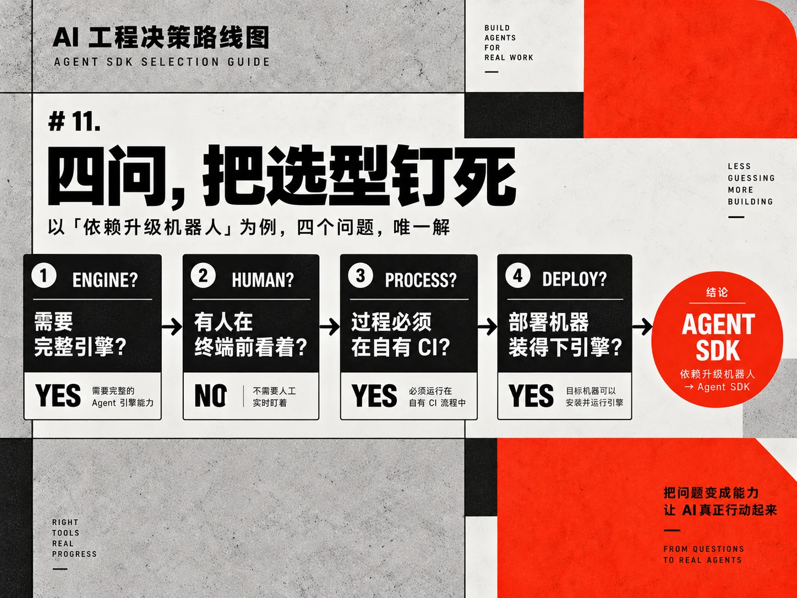

## 代价与权衡

选 Agent SDK 不是免费午餐，这些代价要在选型会上直说。

进程模型的运维成本最明显。多一层子进程意味着多一类故障：子进程崩溃、协议卡死、僵尸进程。SDK 在这些场景的行为（比如中断恢复）有明确设计，但你得学习它，出问题时也得两头查日志。相对地，Client SDK 的故障面就一层 HTTP 请求。

版本耦合是长期成本。引擎每周更新，SDK 跟着发版，你的产品卡在某个 SDK 版本上时，新能力拿不到，已知的引擎 bug 也修不了。合理的做法是把 SDK 版本钉住、升级走独立测试，这和钉住任何重要依赖是同一套纪律。

行为继承是双刃剑。继承引擎的全部能力，意味着也继承它的全部默认行为，包括默认会加载用户目录配置这件事。多租户服务里，某个租户的 ~/.claude 配置泄漏进另一个租户的会话是真实风险，官方文档专门警告默认值不适合多租户隔离，需要显式清空配置来源。这件事单开一篇才能讲透，这里先把警告立住。

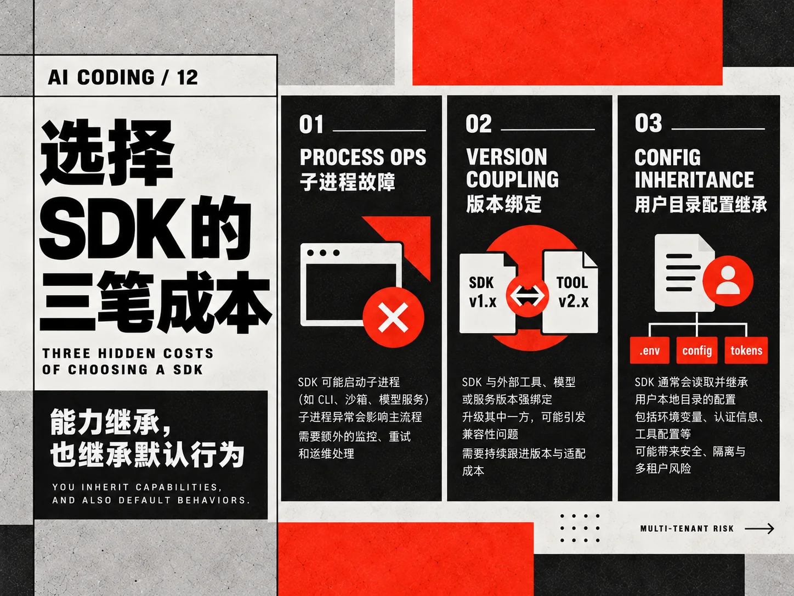

## 四个选项的对照表

把四条路的差异压成一张表，选型会上一页纸用。

| 维度 | CLI | Agent SDK | Client SDK | Managed Agents |
| --- | --- | --- | --- | --- |
| 引擎完整性 | 完整 | 完整 | 无引擎自建 | 完整 |
| 嵌入你的程序 | 否（子进程调用勉强） | 是（库形态） | 是 | 是（远程接口） |
| 语言 | 终端 | Python、TS | 各语言 | 任意（REST） |
| 运维责任 | 用户本机 | 你的基础设施 | 你的基础设施 | Anthropic 托管 |
| 过程控制 | 交互式 | 全部可编程 | 全部自建 | 声明式为主 |
| 典型场景 | 日常开发 | 产品内嵌 agent | 特殊定制循环 | 结果导向任务 |

表里最值得强调的一行是引擎完整性：Agent SDK 和 CLI 是同一个引擎的两种交付，意味着你在 CLI 里验证过的任务模式（哪类任务它擅长、提示怎么写有效）可以直接迁移进 SDK 产品，这个迁移红利是选 Agent SDK 的隐性收益。

选型还有最后一条经验：混合是常态。同一个团队里 CLI 给开发者日常用、Agent SDK 做对内的自动化服务、个别特殊需求用 Client SDK 补，三种并存不冲突。选型别问"团队统一用哪个"，要落到每个具体需求上问"这个用哪个"。

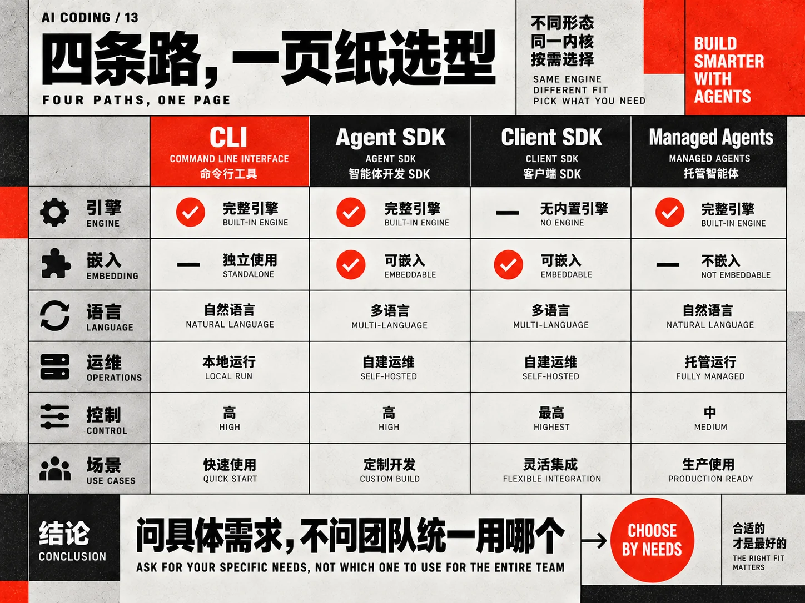

## 四选一之后的常见追问

**已经有一堆 CLI 脚本（cron 里跑的非交互命令），值得迁到 SDK 吗？** 判断标准是脚本的复杂度和稳定性需求。简单的单发任务，CLI 非交互模式完全够用，迁移收益低。脚本长到要解析输出、处理错误分支、管理会话状态时，SDK 的类型化事件流和维护性开始值回票价。

**Agent SDK 能调用别的模型吗？** 走 Bedrock、Vertex 这类云通道时有各自模型目录的范围，但 Agent SDK 的产品定位是驱动 Claude 系引擎（它包装的就是 Claude Code），拿它当多模型编排工具是用错了工具。多模型编排有更合适的框架。

**Managed Agents 和 Agent SDK 会融合吗？** 官方文档把两者并列为不同交付形态，SDK 里也有对接托管方式的入口。截至本文时间线，嵌入式和托管式是两条并列路线，选型按当下能力选，别为可能的融合赌方向。

**学习投入大概什么量级？** 有 agent 概念基础的开发者，跑通第一个程序半天（quickstart 的量），事件流和权限模型摸熟一到两周，生产级部署（存储、观测、隔离）再一到两周。三个台阶分别对应本系列的入门、主干、生产化部分。

**个人学习值得装吗，还是等工作需要再说？** 值得。装好跑通 quickstart 的成本一顿饭时间，而"知道引擎能被这样编程控制"会改变你对 CLI 使用的理解（你更清楚哪些行为是引擎给的、哪些是提示词给的）。学习成本主要花在概念体系上，安装本身不值钱，而这套概念 CLI 和 SDK 共享。

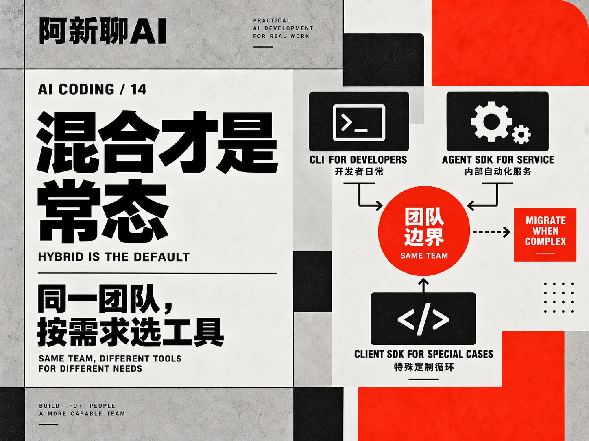

## 关键要点

- 四者同源一个引擎：CLI 是终端交付，Agent SDK 是库交付，Client SDK 只有模型接口，Managed Agents 是托管交付。
- Agent SDK 用库包装 Claude Code 二进制，能力上限与 CLI 相同，边界也相同。
- 认证上第三方产品不能借 claude.ai 登录；命名上可以用 Claude Agent，不能用 Claude Code Agent。
- 选型四问：需要引擎吗、有人看着吗、过程归谁、环境装得下吗。
- 主要代价：进程运维、版本耦合、默认行为继承。

## 延伸阅读

- [Agent SDK Overview（官方）](https://code.claude.com/docs/en/agent-sdk/overview)
- [Agent SDK Quickstart（官方）](https://code.claude.com/docs/en/agent-sdk/quickstart)
- [Claude Code CLI 概览（官方）](https://code.claude.com/docs/en/overview)
- [全部文档索引 llms.txt（官方）](https://code.claude.com/docs/llms.txt)
