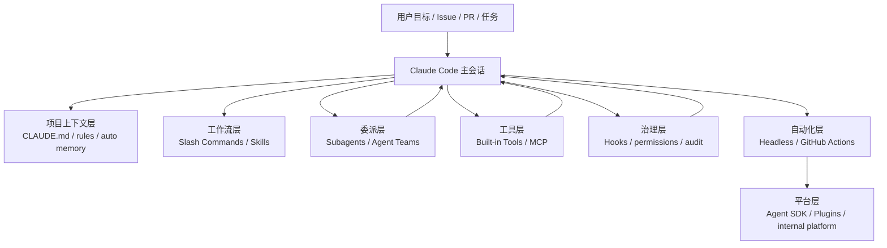

# Claude Code 工程化学习路径：从项目记忆到可治理 Agent 系统

**读者水平：** 中级  
**文章类型：** 深度解析 + 学习路径设计  
**目标平台：** Awesome AI Guide / 个人技术博客  
**更新日期：** 2026-05-25

**TL;DR：** Claude Code 的工程化能力不只来自模型本身，而是来自一套围绕代码库运行的控制系统：项目记忆、命令、Skills、Subagents、Hooks、MCP、Headless、Agent SDK 和 Plugins。学习顺序不要从“多 Agent”开始，应该先把单仓库协作、规则沉淀、权限边界和验证闭环跑通，再进入团队级和平台级自动化。

## 调研来源

本学习路径参考了极客时间《Claude Code 工程化实战》的能力覆盖面，但重新组织成更偏开发者自学和团队落地的结构。主要调研来源：

- [Claude Code: How Claude remembers your project](https://code.claude.com/docs/en/memory)
- [Claude Code: Create custom subagents](https://code.claude.com/docs/en/sub-agents)
- [Claude Code: Hooks reference](https://code.claude.com/docs/en/hooks)
- [Claude Code: Connect Claude Code to tools via MCP](https://code.claude.com/docs/en/mcp)
- [Claude Code: Extend Claude with skills](https://code.claude.com/docs/en/skills)
- [Claude Code: Plugins in the SDK](https://code.claude.com/docs/en/agent-sdk/plugins)
- [Claude Code Advanced Patterns: Subagents, MCP, and Scaling to Real Codebases](https://resources.anthropic.com/hubfs/Claude%20Code%20Advanced%20Patterns_%20Subagents%2C%20MCP%2C%20and%20Scaling%20to%20Real%20Codebases.pdf)
- [Dive into Claude Code: The Design Space of Today's and Future AI Agent Systems](https://arxiv.org/abs/2604.14228)

调研后的结论很直接：Claude Code 工程化的主线不是“让 AI 更会写代码”，而是“让 AI 在真实代码库里受控地工作”。关键变化是把一次性 prompt 变成可复用的项目记忆、工作流、工具连接、权限策略和验证机制。

## 费曼学习记录

### 第一步：简单解释

把 Claude Code 想成一个刚加入团队、动作很快但需要约束的工程师。

你不能只对他说“把系统做好”。你要告诉他项目结构、编码规范、怎么跑测试、哪些目录不能动、遇到失败怎么汇报。然后你还可以给他配工具：让他能看 GitHub issue、查数据库、跑测试、调用内部 API。最后你要装监控和门禁：高风险命令要拦截，修改后要验证，任务完成后要留痕。

日常类比：Claude Code 像厨房里的新厨师。`CLAUDE.md` 是厨房规则，Skills 是固定菜谱，Subagents 是切菜/炒菜/验菜的专门厨师，Hooks 是消防报警器和出餐检查，MCP 是仓库和点单系统，Agent SDK/Plugins 是把这套厨房开成连锁店的方式。

### 第二步：识别缺口

| 缺口 | 我一开始的说法 | 我不确定什么 |
| --- | --- | --- |
| Memory 和 Skills 的边界 | Memory 放长期规则，Skills 放可复用流程 | 规则、流程、示例和脚本到底应该放在哪一层 |
| Subagents 的触发时机 | 复杂任务交给子代理 | 什么时候子代理会增加质量，什么时候只是增加开销 |
| Hooks 的治理能力 | Hooks 可以自动化和拦截 | 哪些事件适合阻断，哪些只适合记录或提示 |
| MCP 与 Skills 的关系 | MCP 接工具，Skills 教流程 | 两者组合时，谁负责能力，谁负责方法 |
| Agent SDK / Plugins 的定位 | SDK 和插件用于平台化 | 什么阶段值得把本地经验封装成 SDK 或插件 |

术语解释：

| 术语 | 简单解释 |
| --- | --- |
| `CLAUDE.md` | 写给 Claude Code 看的项目说明书 |
| Auto memory | Claude Code 根据反复出现的偏好和经验自动记笔记 |
| Slash command | 把常用任务封装成一个命令 |
| Skill | 带触发说明、操作步骤、资源和脚本的可复用能力包 |
| Subagent | 拥有独立上下文和工具权限的专门助手 |
| Hook | 在特定事件发生时自动运行的脚本或 HTTP 回调 |
| MCP | 让 Claude Code 连接外部系统和工具的协议 |
| Headless | 不靠交互式终端，把 Claude Code 放进脚本或 CI 里跑 |
| Plugin | 打包分发 commands、agents、skills、hooks、MCP server 等能力的扩展包 |

### 第三步：填补缺口

#### 缺口 1：Memory 和 Skills 的边界

- **问题：** 团队规则、操作步骤、脚本和案例到底放 `CLAUDE.md` 还是 Skill？
- **研究发现：** 官方 Memory 文档把 `CLAUDE.md` 和 auto memory 定位为跨会话加载的上下文。官方 Skills 文档则强调 `SKILL.md` 的 frontmatter 和说明内容，用于在特定任务触发时加载，并可通过动态上下文注入拿到当前状态。
- **现在我可以这样解释：** `CLAUDE.md` 放“每次都应该知道的规则”，Skill 放“只有做某类任务时才需要的菜谱”。如果内容超过 200 行、带步骤、带脚本、带示例，就更像 Skill。

#### 缺口 2：Subagents 什么时候有价值

- **问题：** 是不是任务一复杂就应该拆 subagent？
- **研究发现：** 官方 Subagents 文档强调独立上下文、工具限制、专门系统提示和模型路由。Advanced Patterns PDF 把 subagents 放在“并行探索、明确角色、只需返回结论”的场景下。论文也把 subagent delegation 看作 Claude Code 系统设计里的独立机制，而不是默认必选项。
- **现在我可以这样解释：** Subagent 适合“让另一个人独立查完再汇报”的任务，比如安全审查、测试失败定位、资料调研。不适合需要频繁共享细节、连续编辑同一批文件的任务。

#### 缺口 3：Hooks 应该阻断什么

- **问题：** Hooks 既能拦截又能自动化，怎样避免变成脆弱脚本堆？
- **研究发现：** 官方 Hooks 文档列出了大量事件，包括 `PreToolUse`、`PostToolUse`、`SubagentStart`、`SubagentStop`、`Stop`、`InstructionsLoaded`、`PreCompact` 等。Advanced Patterns 把 Hooks 定位为确定性自动化，例如自动格式化、日志和通知。
- **现在我可以这样解释：** Hooks 分三类：记录类只写日志，提示类给 Claude 增加上下文，阻断类只用于高风险动作。阻断逻辑必须小、确定、可解释，不要把复杂判断塞进 Hook。

#### 缺口 4：MCP 与 Skills 怎么组合

- **问题：** MCP 已经能接工具，为什么还需要 Skill？
- **研究发现：** MCP 文档把 MCP 定义为连接外部工具、数据库和 API 的方式。Skills 指南把 Skill 解释为可移植的工作流知识。Skill 构建指南明确提到：MCP 给 Claude 访问能力，Skill 教 Claude 怎么按团队流程使用这些能力。
- **现在我可以这样解释：** MCP 是插座，Skill 是操作手册。只装 MCP，Claude 知道有工具；再加 Skill，Claude 才知道团队希望它按什么顺序、用什么参数、遇到失败怎么处理。

#### 缺口 5：什么时候进入 Agent SDK / Plugins

- **问题：** 本地命令、Skills、Hooks 已经够用时，为什么还要 SDK 和 Plugin？
- **研究发现：** Agent SDK 文档把 SDK 定位为把 Claude Code 的 agent loop、hooks、MCP、subagents 等能力嵌入自定义应用。Plugins in SDK 文档说明 plugin 可以打包 commands、agents、skills、hooks、MCP servers，适合跨项目和组织分发。
- **现在我可以这样解释：** 本地使用先用 `CLAUDE.md`、Skills、Hooks。多个项目重复同一套能力时再打包 Plugin。要把 Claude Code 放进内部平台、CI 或业务系统时，再用 Agent SDK。

### 第四步：完善解释

Claude Code 工程化是一套“让 AI 工程师受控工作的系统”。

它从项目记忆开始：让 Claude Code 知道项目结构、命令、风格和安全边界。然后把重复任务沉淀成 Slash Commands 和 Skills。接着用 Subagents 隔离复杂探索和审查，用 MCP 接入外部系统，用 Hooks 做确定性治理。最后，通过 Headless、GitHub Actions、Agent SDK 和 Plugins，把本地经验扩展到团队和平台。

三个关键要点：

1. 先建立规则和验证，再追求自动化。
2. Subagents、Skills、MCP、Hooks 解决的是不同层的问题，不要混用。
3. 真正的工程化不是让 Claude Code “更自主”，而是让它在可审计、可回滚、可验证的边界内工作。

30 秒电梯演讲：

> Claude Code 不是一个更聪明的补全工具，而是一个可配置的工程代理运行时。`CLAUDE.md` 给它项目规则，Skills 给它可复用流程，Subagents 给它独立分工，MCP 给它外部工具，Hooks 给它治理和审计。学 Claude Code 工程化，就是学会把这些机制组合成一个稳定的开发系统。

## 原创课程目录：Claude Code 工程化学习路径

下面是一个不照搬极客时间目录的 32 讲结构。它按“个人可用 -> 项目稳定 -> 团队协作 -> 平台化治理”的顺序组织。

### 开篇：先建立正确问题

| 讲次 | 标题 | 目标 |
| --- | --- | --- |
| 开篇 | Claude Code 不是代码补全，而是工程代理运行时 | 建立从工具使用到系统设计的视角 |
| 00 | 你真正要解决的是上下文搬运、验证缺失和权限失控 | 明确 Claude Code 工程化的核心问题 |

### 第一模块：单人可用

| 讲次 | 标题 | 目标 |
| --- | --- | --- |
| 01 | 安装、登录、权限模式和第一个真实仓库任务 | 跑通基础工作流 |
| 02 | 项目地图：让 Claude Code 读懂目录、命令和边界 | 建立仓库 onboarding 模式 |
| 03 | `CLAUDE.md`：把团队规则写成机器可用上下文 | 写出可维护项目记忆 |
| 04 | `.claude/rules/`：把大规则拆成按路径加载的小规则 | 降低上下文污染 |
| 05 | 常用工作流：解释代码、修 bug、补测试、写文档 | 建立基础任务模板 |

### 第二模块：把重复任务变成能力

| 讲次 | 标题 | 目标 |
| --- | --- | --- |
| 06 | Slash Commands：把一次性提示词变成团队命令 | 固化 `/review`、`/test`、`/release` |
| 07 | Skills 入门：什么时候该从命令升级为 Skill | 判断 Command 与 Skill 边界 |
| 08 | `SKILL.md` 结构：触发描述、步骤、资源和脚本 | 写出第一个可复用 Skill |
| 09 | 渐进式披露：避免 Skill 一次塞爆上下文 | 管理长流程和大资料 |
| 10 | Skill 评测：欠触发、误触发和执行失败怎么修 | 建立迭代方法 |

### 第三模块：复杂任务拆解

| 讲次 | 标题 | 目标 |
| --- | --- | --- |
| 11 | Subagents 的本质：独立上下文里的专家助手 | 理解上下文隔离 |
| 12 | 三类高价值 Subagent：探索、审查、测试 | 设计最小有效子代理 |
| 13 | 工具权限：只读审计代理为什么不能有写权限 | 控制工具面 |
| 14 | 并行探索：让多个代理独立研究再汇总 | 加速大任务前期判断 |
| 15 | 不该用 Subagent 的场景：共享细节和连续编辑 | 避免过度拆分 |

### 第四模块：连接外部世界

| 讲次 | 标题 | 目标 |
| --- | --- | --- |
| 16 | MCP 心智模型：外部系统不是复制粘贴，而是工具接口 | 理解 MCP 的边界 |
| 17 | 第一个 MCP：GitHub issue、PR 和代码上下文 | 接入开发流程 |
| 18 | 数据库、监控和设计系统：高价值 MCP 场景 | 找到真实业务入口 |
| 19 | MCP + Skill：让工具按团队 SOP 被正确使用 | 组合能力和流程 |
| 20 | MCP 风险：token、越权、工具投毒和提示注入 | 建立安全清单 |

### 第五模块：确定性治理

| 讲次 | 标题 | 目标 |
| --- | --- | --- |
| 21 | Hooks 入门：事件驱动的自动化和审计 | 理解 hook 生命周期 |
| 22 | `PreToolUse`：阻断危险命令和高风险文件写入 | 做最小权限门禁 |
| 23 | `PostToolUse` / `Stop`：自动格式化、测试和结果记录 | 建立验证闭环 |
| 24 | Subagent hooks：给子代理注入上下文并收集结果 | 管理多代理任务 |
| 25 | Hook 设计原则：小、确定、可解释、可回滚 | 避免自动化脆弱化 |

### 第六模块：Headless 与 CI/CD

| 讲次 | 标题 | 目标 |
| --- | --- | --- |
| 26 | Headless 模式：把 Claude Code 放进脚本 | 从交互走向自动化 |
| 27 | GitHub Actions：PR review、Issue triage 和简单修复 | 接入协作平台 |
| 28 | CI 里的安全边界：secrets、外部 PR、权限和审批 | 避免供应链事故 |
| 29 | 结构化输出：让 Agent 结果能被机器继续处理 | 支持自动化流水线 |

### 第七模块：平台化和分发

| 讲次 | 标题 | 目标 |
| --- | --- | --- |
| 30 | Agent SDK：把 Claude Code 能力嵌进内部平台 | 从工具到平台 |
| 31 | Plugins：打包 commands、agents、skills、hooks 和 MCP | 跨项目分发能力 |
| 32 | 组织级治理：版本、审计、评测、禁用和升级策略 | 进入团队长期维护 |

## 架构图：Claude Code 工程化分层



## 机制对比：什么时候用哪个

| 机制 | 用它解决什么 | 不适合解决什么 |
| --- | --- | --- |
| `CLAUDE.md` | 项目常识、命令、风格、安全边界 | 大量流程细节和临时任务 |
| `.claude/rules/` | 按目录或文件类型加载规则 | 全局都要读的核心说明 |
| Slash Commands | 高频、短流程、人工触发任务 | 复杂资源包和长知识库 |
| Skills | 可复用 SOP、领域知识、脚本资源 | 永远都要加载的短规则 |
| Subagents | 独立研究、审查、测试、安全分析 | 需要共享完整上下文的连续编辑 |
| MCP | 访问外部系统和私有工具 | 替代业务权限和审计系统 |
| Hooks | 确定性拦截、记录、通知和验证 | 模糊推理和复杂业务决策 |
| Headless | 脚本化、CI、批处理 | 高风险无人审批操作 |
| Agent SDK | 内部平台、自定义 Agent 应用 | 单仓库个人使用 |
| Plugins | 跨项目分发整套能力 | 未审计的第三方默认安装 |

## 最小可落地路线

如果团队只有一周时间，不要从 Subagents 和 MCP 开始。按这个顺序做：

1. 写一个短的 `CLAUDE.md`：项目结构、安装、测试、构建、安全边界。
2. 沉淀 3 个 Slash Commands：`/review`、`/fix-test`、`/update-docs`。
3. 加 1 个只读 code-review subagent：只允许 `Read`、`Grep`、`Glob`。
4. 加 2 个 Hooks：高风险命令拦截、修改后提示跑测试。
5. 接 1 个 MCP：优先 GitHub 或项目管理系统，不要一开始接数据库写权限。
6. 建 20 条评测任务：bug 修复、测试补全、文档更新、PR review。

## 结果应该怎么评估

不要只看“Claude Code 会不会写代码”。至少记录这些指标：

| 维度 | 指标 |
| --- | --- |
| 任务完成 | 完成率、人工返工次数、失败原因 |
| 修改质量 | 测试通过率、review comment 数量、回滚次数 |
| 上下文质量 | Claude 是否重复问相同问题、是否误解项目命令 |
| 权限控制 | 被拦截的危险操作、误拦截次数 |
| 工具使用 | MCP 调用是否必要、参数是否正确 |
| 成本 | 每类任务 token、时长、人工审查时间 |
| 稳定性 | 模型/规则/Skill 变更后的回归情况 |

## 权衡与局限

- `CLAUDE.md` 写太长会吃上下文，也会降低规则遵循质量。
- Skills 能复用流程，但描述写得太宽会误触发，写得太窄会欠触发。
- Subagents 能隔离上下文，也会让调试链路变长。
- MCP 能减少复制粘贴，也会扩大数据和权限风险。
- Hooks 能治理行为，但复杂 Hook 会变成另一个需要维护的系统。
- Headless 和 GitHub Actions 适合低风险自动化，不适合无人审批的生产变更。
- Agent SDK 和 Plugins 只有在多项目复用或平台化时才值得投入。

## 结论

Claude Code 工程化的核心不是把所有事情交给 AI，而是把软件工程里的上下文、流程、工具、权限和验证显式化。

最稳的路径是：

```txt
CLAUDE.md -> Commands -> Skills -> Subagents -> MCP -> Hooks -> Headless -> SDK / Plugins
```

这条路看起来慢，但它避免了最常见的失败：AI 能改代码，却不知道边界；AI 能调用工具，却不知道流程；AI 能自动化，却没有审计和回滚。

## 延伸阅读

- [Claude Code 资料与项目索引](./claude-code.md)
- [Claude Code 官方文档](https://code.claude.com/docs)
- [Claude Code Advanced Patterns](https://resources.anthropic.com/hubfs/Claude%20Code%20Advanced%20Patterns_%20Subagents%2C%20MCP%2C%20and%20Scaling%20to%20Real%20Codebases.pdf)
- [The Complete Guide to Building Skill for Claude](https://resources.anthropic.com/hubfs/The-Complete-Guide-to-Building-Skill-for-Claude.pdf)
- [Dive into Claude Code](https://arxiv.org/abs/2604.14228)
