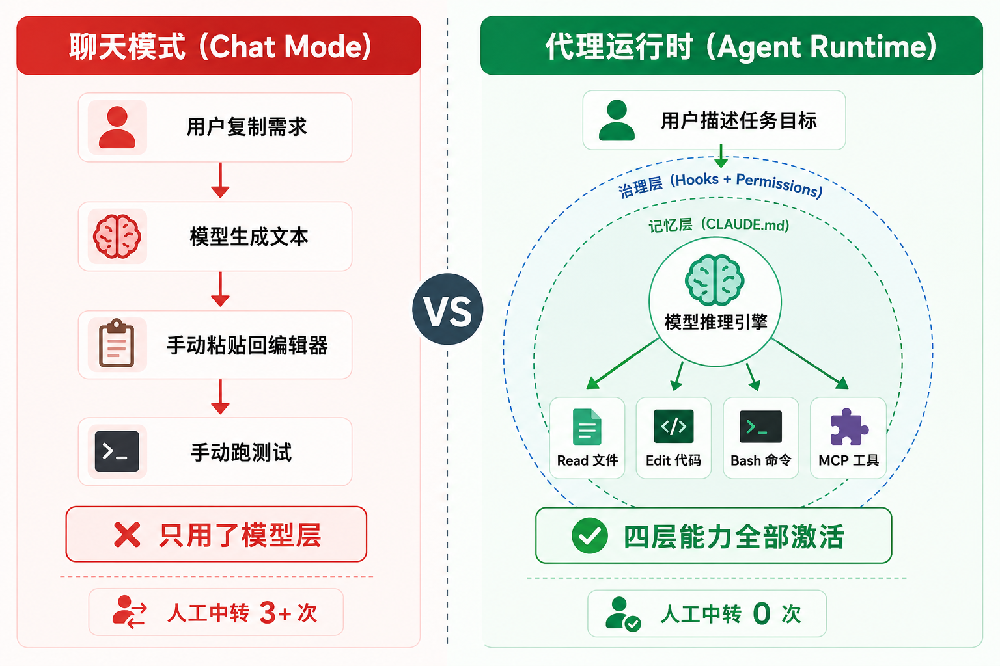
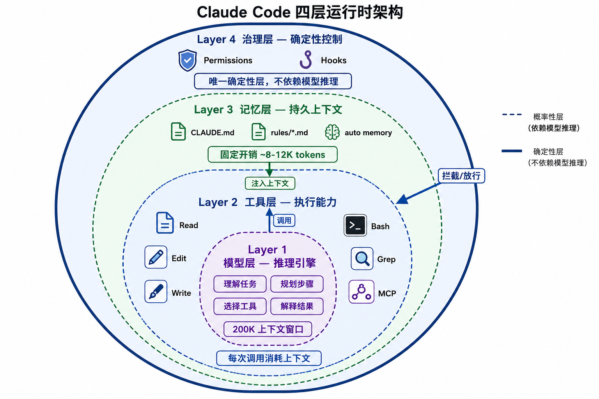
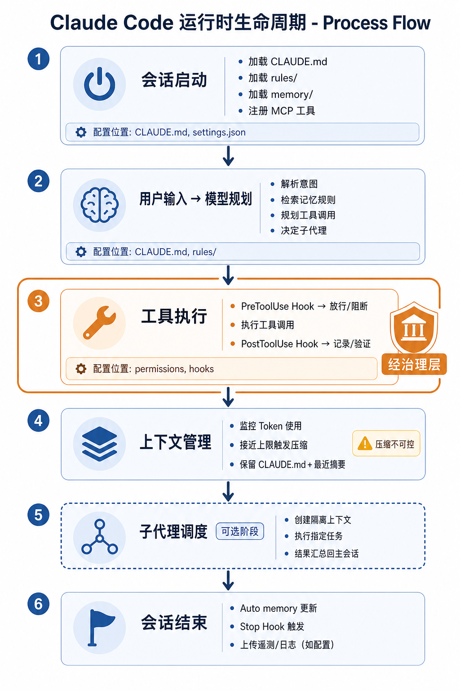
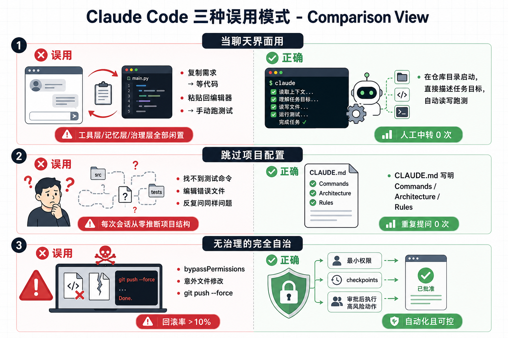

# Claude Code 不是代码补全，而是工程代理运行时

**TL;DR：** Claude Code 的价值不在于"多写几行代码"，而在于把模型放进一个能读仓库、改文件、跑命令、接工具、受权限约束的执行环境。把它当工程代理运行时来配置和治理，而不是 IDE 补全插件来用。

## 定位：为什么"更强的 ChatGPT"是个错误框架



大多数开发者第一次打开 Claude Code，直觉用法是：复制需求 → 等代码生成 → 粘贴回编辑器。这个流程里 Claude Code 只是换了个入口的 ChatGPT。真正的差异完全被浪费了——它已经站在仓库里，能自己读上下文、改文件、跑命令、看结果、继续迭代。

正确的心智模型：**Claude Code 是一个以大模型为推理引擎的工程代理运行时（Agent Runtime）**。模型只负责"想"，运行时负责"做"和"管"。运行时提供了工具调用、持久记忆、权限治理、子代理调度、CI 集成等系统能力。模型的能力决定了它"能不能想清楚"，而运行时的配置决定了它"能不能做对事"。

这意味着三件事：
- 你要配置的不只是提示词，而是整个运行时环境——工具、记忆、权限、Hooks 都在配置范围内。
- 衡量 Claude Code 效果的指标不只是"生成代码质量"，而是"端到端任务完成率"——从接收需求到测试通过，中间有多少环节需要人工介入。
- 团队落地的核心工作不是教人写提示词，而是建立共享的项目记忆（CLAUDE.md）和治理规则（permissions + Hooks），让所有人在同一个运行时环境里工作。

反过来看，如果一个团队把 Claude Code 当"更强的 Copilot"来用——只在编辑器里内联补全、不改文件、不跑命令——那他们实际上只用了模型层，放弃了工具层、记忆层和治理层三层能力。这三层的投资回报率远高于在提示词上反复调优。

## 四层架构深度解析



Claude Code 运行时由四层能力叠加构成。每一层都有独立的配置面、Token 成本和失效模式。理解这四层的交互方式，是后续所有工程化实践的基础。

### 模型层：推理引擎

模型层的职责是理解任务、规划步骤、选择工具、解释结果。它不是知识库，而是推理引擎——真正的知识在工具层（代码仓库）和记忆层（CLAUDE.md）里。

**上下文窗口管理**是模型层的核心约束。以 Claude Sonnet 为例，上下文窗口约 200K tokens。这个预算在四层之间分配：

```
上下文预算分配（典型会话）
├── 系统提示词          ~8-12K tokens（内置 + CLAUDE.md + rules + auto memory）
├── 用户消息            ~0.5-2K tokens（当前轮次）
├── 工具调用 + 结果     ~5-50K tokens（随任务复杂度增长）
│   ├── Read 文件内容
│   ├── Bash 输出
│   ├── Grep/Glob 结果
│   └── MCP 工具返回
├── 历史对话            ~10-100K tokens（随会话长度增长）
└── 剩余可用            → 压缩触发阈值
```

当上下文接近上限时，Claude Code 自动执行压缩（compaction）：保留最近对话摘要、关键工具结果和 CLAUDE.md 内容，丢弃早期对话细节。压缩是不可控的——你无法精确指定哪些内容保留。这就是为什么关键规则必须写在 CLAUDE.md 和 rules 里（它们会被重新注入），而不是指望模型从早期对话中"记住"。

**实践含义**：
- 重要的持久规则写入 CLAUDE.md / rules，不要只靠对话中口头约定。
- 单次会话不要塞太多不相关任务，否则压缩会丢掉关键上下文。
- Token 预算是有限资源，工具调用结果的膨胀速度远超预期。

### 工具层：执行能力

工具层是 Claude Code 区别于纯聊天模型的关键。没有工具，模型只能输出文本；有了工具，模型能在真实环境中执行操作。

**内置工具清单及 Token 成本特征**：

| 工具 | 用途 | Token 消耗特征 |
|------|------|----------------|
| `Read` | 读取文件内容 | 与文件长度成正比，大文件可占数千 tokens |
| `Edit` | 精确替换文件中的字符串 | 低消耗，只传 old_string + new_string |
| `Write` | 完整写入文件 | 与文件长度成正比 |
| `Bash` | 执行 shell 命令 | 输出可能极大，需要截断或过滤 |
| `Grep` | 正则搜索文件内容 | 与匹配结果数量成正比 |
| `Glob` | 按模式匹配文件路径 | 低消耗，只返回路径列表 |
| `WebSearch` | 搜索互联网 | 中等消耗，返回摘要结果 |
| `LS` | 列出目录内容 | 低消耗 |
| `NotebookEdit` | 编辑 Jupyter notebook | 中等消耗 |

**MCP 工具**（Model Context Protocol）是外部工具的接入机制。每个 MCP server 暴露一组工具，Claude Code 通过标准协议调用。MCP 工具的 Token 成本取决于返回数据量——一个返回全表数据的数据库 MCP 会快速吃掉上下文预算。

**一次典型任务的工具调用链**：

```text
用户: "修复 auth/login.ts 里的 token 过期 bug"

模型规划:
1. Read("auth/login.ts")           → 读取目标文件，~800 tokens
2. Grep("token.*expir", "auth/")   → 搜索相关代码，~200 tokens
3. Read("auth/token.ts")           → 读取依赖模块，~600 tokens
4. Grep("test.*login", "tests/")   → 找到测试文件，~150 tokens
5. Edit("auth/login.ts", ...)      → 修改代码，~100 tokens
6. Bash("npm test -- auth/")       → 运行测试，~500-5000 tokens（看输出长度）
7. 如果测试失败 → Read 错误 → 重新 Edit → 重跑测试

总消耗: ~2500-7500 tokens 仅工具调用结果
```

**关键认识**：工具调用不是免费的。每次调用都消耗上下文预算。无效的调用（读了不该读的文件、跑了太宽的搜索）不仅浪费时间，还挤压有效上下文空间。这就是项目地图和 rules 的价值——它们引导模型精确调用，减少无效探索。一个配置良好的 CLAUDE.md 能把"先读十个文件找到入口"的探索成本降到"直接读 CLAUDE.md 里 Architecture 段落"的一次性成本。

### 记忆层：持久上下文

模型层没有跨会话记忆。每次新会话，模型从零开始。记忆层解决"如何让每次会话快速获得项目知识"的问题。

**三层记忆机制**：

```
记忆层架构
├── CLAUDE.md（项目级 + 用户级）
│   ├── <repo>/CLAUDE.md          项目根目录，团队共享
│   ├── <repo>/.claude/CLAUDE.md  .claude 目录下，同上
│   └── ~/.claude/CLAUDE.md       用户主目录，个人偏好
│
├── .claude/rules/
│   ├── <repo>/.claude/rules/*.md       路径作用域规则
│   └── 按文件路径匹配，编辑 src/ 下的文件时加载对应 rule
│
└── Auto Memory
    ├── <repo>/.claude/memory/    会话自动积累的记忆
    └── 每次会话结束可能写入，下次会话自动加载
```

**Token 成本分析**——以一个真实的中等规模项目为例：

```text
系统提示词中记忆层占用估算：
├── 内置系统提示        ~6K tokens
├── CLAUDE.md           ~1.5K tokens（约 120 行中文 + 代码）
├── rules/*.md           ~0.5-2K tokens（按数量和长度）
├── auto memory          ~0.5-3K tokens（随使用积累）
└── 总计                 ~8.5-12.5K tokens

占 200K 上下文窗口的比例: ~4-6%
```

看起来不多，但随着工具调用结果膨胀，有效可用空间会快速缩小。这就是 CLAUDE.md 必须精炼的原因——每多写 100 行无关内容，就多占用约 400 tokens 的永久预算。

**记忆 vs 上下文的区别**：

| 特性 | 记忆层（CLAUDE.md/rules/memory） | 上下文（对话 + 工具结果） |
|------|----------------------------------|--------------------------|
| 跨会话持久 | 是 | 否 |
| 每次加载 | 是 | 仅当前会话 |
| Token 成本 | 固定，每次会话都付 | 随会话长度增长 |
| 压缩影响 | 不受压缩影响 | 压缩时可能丢失 |
| 写入方式 | 人工编辑 + auto memory | 模型自动生成 |

### 治理层：确定性控制

前三层都是概率性的——模型可能选错工具、记忆可能不完整、上下文可能被压缩。治理层是唯一确定性的控制手段。

**权限模式**：

```json
// .claude/settings.json — 权限配置示例
{
  "permissions": {
    "allow": [
      "Read",
      "Grep",
      "Glob",
      "LS",
      "Bash(npm test*)",
      "Bash(npm run lint*)",
      "Bash(npm run typecheck*)",
      "Bash(git status*)",
      "Bash(git diff*)",
      "Bash(git log*)"
    ],
    "deny": [
      "Bash(rm -rf *)",
      "Bash(git push*)",
      "Bash(git reset --hard*)",
      "Bash(curl*|*)",
      "Bash(wget*)",
      "Write(.env*)"
    ]
  }
}
```

四种权限模式的行为差异：

| 模式 | 行为 | 适用场景 |
|------|------|----------|
| `default` | 读写操作需确认，Bash 需确认 | 日常开发，安全基线 |
| `plan` | 只规划不执行，纯分析 | 复杂任务前期调研 |
| `auto` | 自动执行已允许的操作 | CI/CD、可信环境 |
| `bypassPermissions` | 跳过所有权限检查 | 仅限隔离环境，禁止在生产使用 |

**Hooks**是治理层的事件驱动机制，在工具执行的前后插入确定性逻辑：

```json
// .claude/settings.json — Hooks 配置示例
{
  "hooks": {
    "PreToolUse": [
      {
        "matcher": "Bash",
        "hooks": [
          {
            "type": "command",
            "command": "audit-log.sh \"$TOOL_INPUT\""
          }
        ]
      }
    ],
    "PostToolUse": [
      {
        "matcher": "Edit|Write",
        "hooks": [
          {
            "type": "command",
            "command": "format-check.sh \"$FILE_PATH\""
          }
        ]
      }
    ],
    "Stop": [
      {
        "hooks": [
          {
            "type": "command",
            "command": "session-summary.sh"
          }
        ]
      }
    ]
  }
}
```

Hooks 的关键属性：它是确定性代码，不是提示词。无论模型怎么"想"，PreToolUse hook 都会在 Bash 执行前运行。这使得治理层成为整个运行时中最可靠的安全边界。

## 系统对比：架构视角

从架构视角对比主流 AI 编码工具，能更清楚地看到 Claude Code 运行时模型的差异：

| 维度 | Claude Code | GitHub Copilot | Cursor Agent | Aider |
|------|-------------|----------------|--------------|-------|
| 执行环境 | 终端 + 完整仓库 | IDE 内联补全 | IDE + 终端 | 终端 + 仓库 |
| 工具系统 | 内置 + MCP 扩展 | IDE API | 内置 + MCP | 内置 |
| 记忆层 | CLAUDE.md + rules + auto memory | Copilot Instructions | .cursor/rules | 无持久记忆 |
| 治理层 | Hooks + permissions + audit | 无 | 无 | 无 |
| 多代理 | Subagents + 并行调度 | 无 | 多文件编辑 | 无 |
| CI/CD | Headless + GitHub Actions | GitHub Actions | 无 | 无 |
| 可编程性 | Skills + Hooks + Plugins | 无 | 无 | 无 |
| 上下文来源 | 仓库文件 + 对话 + 记忆 + MCP | 当前文件 + 标签页 | 仓库 + 对话 | 仓库 + 对话 |

核心差异不在单点能力，而在于**可配置的深度**。Copilot 和 Cursor 的配置面很薄——你主要靠模型自身的判断。Claude Code 提供了一个可编程的运行时：记忆层决定它知道什么，工具层决定它能做什么，治理层决定它不能做什么。这三层都可以由团队显式配置，而不是依赖模型的隐式推理。

这个差异在团队规模放大时变得至关重要。一个人的项目可以靠模型自己推断，但十个人的团队必须把约定写入系统——否则每个开发者每次会话都要从零建立上下文，错误率和一致性问题会指数级增长。

## 运行时生命周期



一个完整任务从会话启动到结束，经过六个阶段。理解这个生命周期，才能在正确的位置做正确的配置。

```
运行时生命周期
│
├── 1. 会话启动
│   ├── 加载 ~/.claude/CLAUDE.md（用户级记忆）
│   ├── 加载 <repo>/CLAUDE.md（项目级记忆）
│   ├── 加载 .claude/rules/*.md（路径作用域规则）
│   ├── 加载 .claude/memory/（自动积累记忆）
│   └── 初始化工具注册表（内置 + MCP）
│
├── 2. 用户输入 → 模型规划
│   ├── 解析用户意图
│   ├── 检索记忆层中的相关规则
│   ├── 规划工具调用序列
│   └── 决定是否需要子代理
│
├── 3. 工具执行（每个调用经治理层）
│   ├── PreToolUse Hook 检查 → 放行/阻断/注入提示
│   ├── 执行工具调用（Read/Edit/Bash/MCP...）
│   ├── PostToolUse Hook 处理 → 记录/格式化/验证
│   └── 结果返回模型上下文
│
├── 4. 上下文管理
│   ├── 监控 Token 使用量
│   ├── 接近上限时触发压缩
│   ├── 压缩策略：保留 CLAUDE.md + 最近对话摘要
│   └── 压缩后继续执行
│
├── 5. 子代理调度（可选）
│   ├── 创建独立上下文的子会话
│   ├── 子代理执行指定任务
│   ├── SubagentStart/SubagentStop Hook 触发
│   └── 结果汇总回主会话上下文
│
└── 6. 会话结束
    ├── Auto memory 更新（积累经验）
    ├── Stop Hook 触发（记录总结、清理）
    └── 上下文销毁
```

每个阶段都有对应的配置点：

| 阶段 | 可配置项 | 配置位置 |
|------|----------|----------|
| 启动 | 加载哪些记忆、MCP 注册 | CLAUDE.md, .claude/settings.json |
| 规划 | 项目约定、代码风格、架构边界 | CLAUDE.md, rules/ |
| 执行 | 允许/禁止的工具和命令 | permissions, PreToolUse hooks |
| 压缩 | 哪些内容不可丢弃 | CLAUDE.md（始终重注入） |
| 子代理 | 角色定义、工具限制 | agent 定义文件, SubagentStart hooks |
| 结束 | 总结、审计、清理 | Stop hooks, auto memory |

## 常见误用模式与工程成本



### 误用一：当聊天界面用

**症状**：复制需求到终端，等代码生成，手动复制回编辑器，手动运行测试，手动检查结果。

**浪费了什么**：工具层、记忆层、治理层全部闲置。模型能直接读写文件和运行命令，但你把它降级成了纯文本生成器。

**衡量方式**：统计每次任务中的人工中转次数。如果 Claude Code 改一个文件需要你手动复制 3 次以上（需求输入 → 代码输出 → 粘贴回文件 → 手动跑测试），说明运行时没被正确使用。

**修正**：在仓库目录下启动 Claude Code，直接描述任务目标（不是代码片段），让它自己读文件、改文件、跑测试。

### 误用二：跳过项目配置

**症状**：Claude Code 找不到测试命令、编辑错误文件、反复问同样的问题、不了解项目约定。

**根因**：没有 CLAUDE.md 和 rules。模型每次会话从零开始推断项目结构，推断就会出错。

**衡量方式**：计算单次会话中的重复提问次数。如果同一个会话里 Claude Code 问了两次"测试怎么跑"或"用 npm 还是 pnpm"，说明记忆层配置缺失。

**修正**：

```markdown
# CLAUDE.md — 最小有效配置

## Commands
- Install: pnpm install
- Test: pnpm test
- Lint: pnpm lint
- Typecheck: pnpm typecheck
- Build: pnpm build

## Architecture
- src/modules/ 下按业务域分模块
- 每个模块有自己的 routes/, services/, types/
- 共享逻辑放 src/shared/

## Rules
- 用 pnpm，不要用 npm 或 yarn
- 改 API 要更新对应的契约测试
- 不要动 .env 文件
- 生产配置变更需要明确确认
```

### 误用三：无治理的完全自治

**症状**：使用 `bypassPermissions` 模式后，出现意外文件修改、测试大面积失败、敏感文件被读取、甚至 `git push --force` 被执行。

**根因**：跳过治理层，把所有控制权交给概率性的模型推理。模型大多数时候"知道"不该 `rm -rf`，但不是 100%。

**衡量方式**：追踪 `git diff` 回滚率。如果超过 10% 的 Claude Code 修改需要手动回滚，说明权限和 Hooks 配置不足。

**修正**：即使在 CI 环境中，也应该通过 permissions allowlist 和 PreToolUse hooks 建立安全边界，而不是使用 `bypassPermissions: true`。

## 生产级配置示例

以下是一个中等规模 Node.js 项目的完整运行时配置，展示四层如何协同工作。

**项目结构**：

```text
my-project/
├── CLAUDE.md              # 项目记忆（记忆层）
├── .claude/
│   ├── settings.json      # 权限 + Hooks（治理层）
│   └── rules/
│       ├── frontend.md    # 前端编辑规则
│       └── backend.md     # 后端编辑规则
├── src/
├── tests/
└── package.json
```

**CLAUDE.md**：

```markdown
# CLAUDE.md

## 项目概述
B2B SaaS 后台管理系统，技术栈：Next.js 15 + TypeScript + Prisma + PostgreSQL。

## Commands
- Dev: pnpm dev
- Build: pnpm build
- Test: pnpm test
- Test (single): pnpm test -- --grep "test name"
- Lint: pnpm lint
- Typecheck: pnpm typecheck
- DB Migrate: pnpm prisma migrate dev
- DB Generate: pnpm prisma generate

## Architecture
- `src/app/` — Next.js App Router 页面和 API routes
- `src/lib/` — 共享业务逻辑和工具函数
- `src/components/` — React 组件，按功能域分子目录
- `prisma/` — 数据库 schema 和迁移
- `tests/` — 集成测试，按模块组织

## Working Rules
- 组件用 `"use client"` 标记客户端组件，默认是服务端组件
- API route 返回 `NextResponse.json()`，不要直接返回对象
- 数据库变更先写 migration，不要直接改 schema 再 generate
- 新 API endpoint 必须有对应的集成测试
- 错误处理用 `src/lib/errors.ts` 里的标准化错误类
- 不要引入新的 UI 库，项目用 shadcn/ui

## Safety
- 不要编辑 `.env*` 文件
- 不要运行 `prisma migrate reset`
- 数据库迁移必须逐个确认
- 不要执行 `pnpm publish`
- 生产环境配置变更需要人工审批

## Known Issues
- pnpm test 在 Node 18 下有 flaky test，用 Node 20+
- Prisma 的 `@unique` 约束在 SQLite 测试环境不生效，用 PostgreSQL 测试
```

**settings.json**：

```json
{
  "permissions": {
    "allow": [
      "Read",
      "Grep",
      "Glob",
      "LS",
      "NotebookRead",
      "Bash(pnpm test*)",
      "Bash(pnpm lint*)",
      "Bash(pnpm typecheck*)",
      "Bash(pnpm build*)",
      "Bash(pnpm dev*)",
      "Bash(git status*)",
      "Bash(git diff*)",
      "Bash(git log*)",
      "Bash(git add*)",
      "Bash(git branch*)",
      "Bash(node*)"
    ],
    "deny": [
      "Bash(rm -rf *)",
      "Bash(git push*)",
      "Bash(git reset --hard*)",
      "Bash(git clean*)",
      "Bash(curl *)",
      "Bash(wget*)",
      "Bash(pnpm publish*)",
      "Bash(sudo*)",
      "Bash(chmod 777*)",
      "Write(.env*)",
      "Edit(.env*)"
    ]
  },
  "hooks": {
    "PreToolUse": [
      {
        "matcher": "Bash",
        "hooks": [
          {
            "type": "command",
            "command": ".claude/hooks/pre-bash-audit.sh \"$TOOL_INPUT\""
          }
        ]
      }
    ],
    "PostToolUse": [
      {
        "matcher": "Edit|Write",
        "hooks": [
          {
            "type": "command",
            "command": ".claude/hooks/post-edit-lint.sh \"$FILE_PATH\""
          }
        ]
      }
    ],
    "Stop": [
      {
        "hooks": [
          {
            "type": "command",
            "command": ".claude/hooks/session-summary.sh"
          }
        ]
      }
    ]
  }
}
```

**.claude/rules/frontend.md**（编辑 `src/components/` 或 `src/app/` 下的文件时自动加载）：

```markdown
# Frontend Rules

- 使用 shadcn/ui 组件，不要引入新 UI 库
- 客户端组件标记 `"use client"`，保持最小范围
- 样式用 Tailwind CSS class，不要写 inline style
- 表单使用 react-hook-form + zod 校验
- 不要直接操作 DOM，使用 React 状态管理
```

**.claude/rules/backend.md**（编辑 `src/app/api/` 或 `src/lib/` 下的文件时自动加载）：

```markdown
# Backend Rules

- API route 必须有错误处理中间件包装
- 数据库查询使用 Prisma Client，不要写原始 SQL
- 新增 API endpoint 必须在 tests/ 下补集成测试
- 敏感操作（删除、权限变更）必须记录审计日志
- 分页查询统一使用 cursor-based pagination
```

这套配置让 Claude Code 在启动时就"知道"项目的命令、架构、规则和安全边界。治理层的 permissions 和 hooks 确保即使模型推理出错，也不会执行危险操作。

## 团队落地验证清单

建立运行时模型后，用以下清单验证配置是否到位：

**记忆层验证**：
- [ ] CLAUDE.md 包含项目命令（test/lint/build）
- [ ] CLAUDE.md 包含架构边界和修改规则
- [ ] CLAUDE.md 包含安全限制
- [ ] rules/ 按路径域拆分（前端/后端/测试/配置）
- [ ] 新成员启动 Claude Code 后，能正确回答"测试怎么跑"和"用哪个包管理器"

**工具层验证**：
- [ ] MCP 连接已配置且可达（如 GitHub MCP）
- [ ] Claude Code 能正确执行 test/lint/typecheck 命令
- [ ] 工具调用的 Token 消耗在预期范围内（无大文件误读）

**治理层验证**：
- [ ] permissions allowlist 覆盖常用安全操作
- [ ] permissions denylist 覆盖危险操作（rm -rf, git push --force, sudo）
- [ ] PreToolUse hook 对 Bash 调用做审计记录
- [ ] PostToolUse hook 对文件编辑做格式检查
- [ ] Stop hook 记录会话摘要

**端到端验证**：
- [ ] 让 Claude Code 修复一个已知低风险 bug，观察它是否自主完成：读文件 → 定位问题 → 修改 → 跑测试 → 报告结果
- [ ] 统计人工中转次数，目标：0 次（不需要手动复制粘贴任何内容）
- [ ] 统计重复提问次数，目标：0 次（CLAUDE.md 覆盖所有常见问题）

## 相关文章

- [01 — 上下文搬运、验证缺失和权限失控](./01-context-validation-permission.md)：运行时四层要解决的根本问题
- [04 — CLAUDE.md 项目记忆](./04-claude-md-project-memory.md)：记忆层的详细配置方法
- [05 — rules 路径作用域](./05-rules-path-scoped-context.md)：按路径拆分规则的实践
- [22 — Hooks 入门](./22-hooks-introduction.md)：治理层事件驱动机制的完整指南
- [27 — Headless 模式](./27-headless-mode.md)：将运行时放入 CI/CD 的方式
- [33 — 组织级治理](./33-organization-governance.md)：多团队共享运行时配置的策略

## 从运行时视角理解 Claude Code 的边界

Claude Code 的代理运行时有明确的边界条件。理解这些边界有助于判断哪些工程任务适合交给它，哪些需要人工介入或不同的工具链。

**上下文窗口是硬约束**。200K token 的窗口中，系统提示词和 CLAUDE.md 占据固定开销，工具调用和返回值消耗动态空间。一个涉及 50+ 文件的大型重构，上下文消耗会快速逼近窗口上限，导致早期信息被压缩丢失。这就是 Subagent 机制存在的工程动机——通过上下文隔离来绕过单会话的窗口限制。

**工具调用是同步阻塞的**。每次工具调用（读文件、搜索、执行命令）都会产生网络往返，Claude Code 在等待结果期间无法并行处理。并行子代理可以在一定程度上缓解这个问题，但每个子代理自身仍然是同步的。

**治理层是确定性的**。Rules 和 CLAUDE.md 是静态上下文注入，Hooks 是确定性脚本执行。它们不依赖模型的判断力，因此比提示词工程更可靠。工程实践中，能用治理层解决的问题不要用提示词解决——确定性永远优于概率性。

<!-- CONTACT-START -->
<!-- Auto-generated by scripts/inject-contact.sh — 单一真实源: docs/_snippets/contact.html -->
<div align="center">

**「阿新聊 AI」同步更新，欢迎关注**

<br>

<table>
<tr>
<td align="center">📢<br><b>微信公众号</b><br>阿新聊ai</td>
<td align="center">🎵<br><b>抖音</b><br>阿新聊ai</td>
<td align="center">📕<br><b>小红书</b><br>阿新聊ai</td>
<td align="center">💬<br><b>微信</b><br>mindcarver</td>
</tr>
</table>

🌐 AI 社区 · <a href="https://91aihub.com/">91aihub.com</a>

</div>
<!-- CONTACT-END -->
