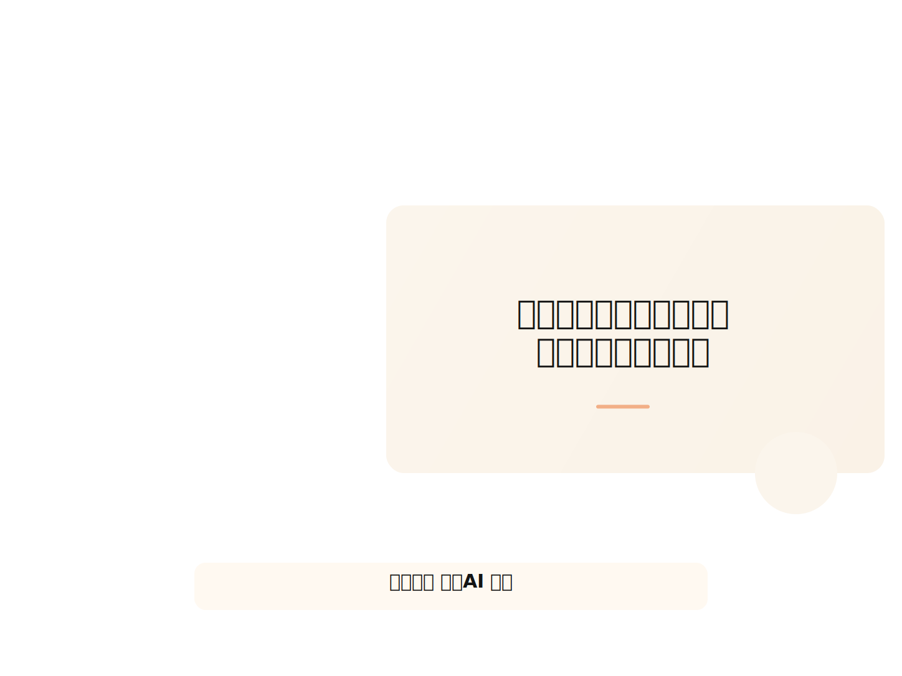
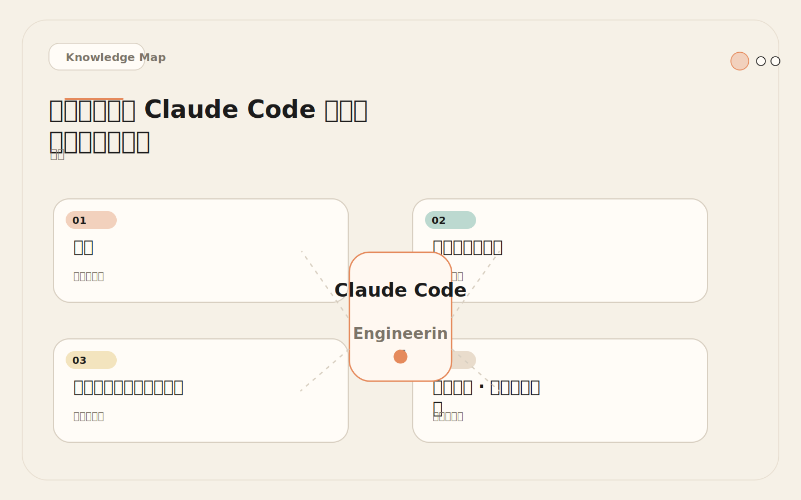
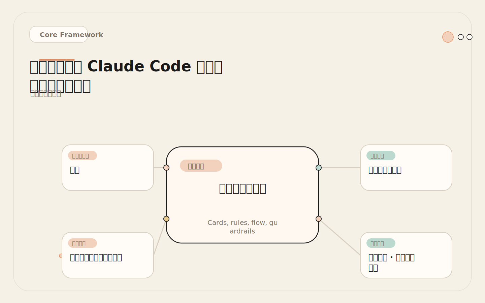
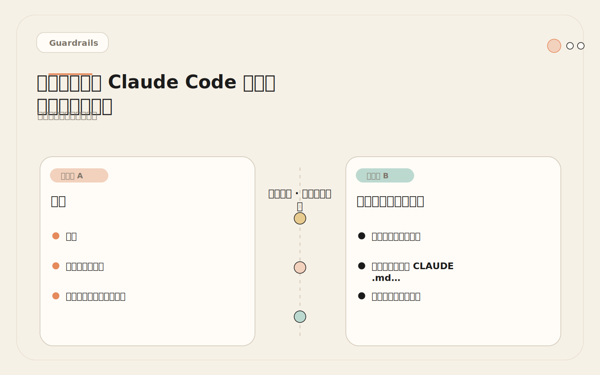
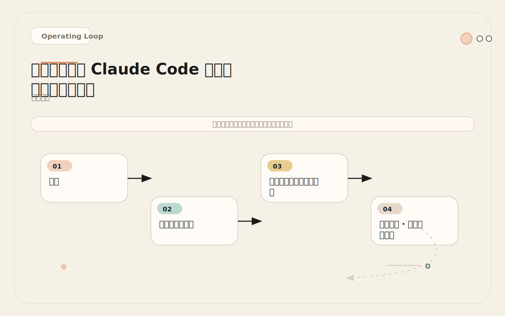

# Claude Code 为什么总不懂你的项目？缺一张「项目地图」

<!-- codex:cover ../../../assets/claude-code-engineering/03-project-map-cover.svg -->

<!-- /codex:cover -->

**TL;DR：** 项目地图不是目录树打印。它是一份结构化声明，告诉 Claude Code 哪些目录存在、各管什么、服务怎么调用、命令怎么跑、哪些东西不能碰。没有地图，Claude Code 靠搜索猜结构——猜错一次就是跨模块耦合的开始。

## 问题

新成员进项目会问四件事：代码在哪、怎么跑、怎么测、什么不能动。Claude Code 也需要这四件事的答案。区别在于人类能从对话和经验里逐步补全，而 Claude Code 每次会话从零开始。如果 `CLAUDE.md` 里没有写清楚项目结构，它会在每次任务开始时执行一轮目录扫描：`ls` 根目录、`cat package.json`、`find` 测试文件——这些操作消耗的 token 本来可以用在实际工作上。

<!-- codex:illustration 03-project-map/01-overview-knowledge-map.svg -->

<!-- /codex:illustration -->

更严重的问题不是 token 浪费，而是边界误判。Claude Code 看到两个 package 都有 `utils` 目录，可能把共享逻辑放进错误的那个。它看到 `api/` 和 `worker/` 都访问数据库，可能直接在 `api/` 里写 SQL 而不是走数据层。这些错误的共同根因是同一件事：项目地图缺失或不够精确。

## 项目地图是什么

项目地图是 `CLAUDE.md` 中的一段结构化描述，回答以下六类问题：

<!-- codex:illustration 03-project-map/02-framework-core-structure.svg -->

<!-- /codex:illustration -->

1. **目录职责**：每个顶层目录和关键子目录负责什么。
2. **服务边界**：哪个服务调用哪个，调用方式是什么（HTTP、消息队列、共享库）。
3. **命令清单**：安装、测试、构建、lint、部署、数据库迁移——每个命令的准确写法。
4. **测试策略**：单元测试用什么框架、集成测试怎么跑、E2E 测试在哪、如何只跑单个文件的测试。
5. **禁区声明**：生成文件、迁移文件、凭据文件、锁文件——哪些东西绝对不能手动修改。
6. **模块依赖规则**：谁可以导入谁，谁不能导入谁。

这六类信息的密度不同。命令清单和禁区声明是高频引用的，必须精确无歧义。目录职责和模块依赖是低频但高影响的——用错一次就是架构污染。

一个常见的误区是把项目地图写成 `tree` 命令的输出。目录树能告诉你文件在哪，但不能告诉你目录之间的关系、调用方向和修改约束。项目地图的价值不在于列出每个文件，而在于声明目录之间的依赖规则和操作边界。好的项目地图让 Claude Code 在动手写代码之前就知道哪些路径可以安全修改、哪些操作需要额外的确认步骤、哪些模块之间不应该产生新的依赖关系。

## 三种项目类型的项目地图

### Monorepo（Turborepo + Next.js + 共享包）

```markdown
## Project Map

### Structure
- apps/web — Next.js 前端（React 18, Tailwind CSS, App Router）
- apps/api — Express API（Node.js 20, Prisma ORM）
- apps/worker — BullMQ 后台任务处理器
- packages/ui — 共享组件库（Storybook 维护）
- packages/config — 共享 ESLint config、TS config、Tailwind preset
- packages/db — Prisma schema 和生成的 client
- packages/shared — 业务类型定义和工具函数

### Commands
- Install: `pnpm install`
- Dev all: `pnpm dev`
- Dev single: `pnpm --filter web dev`
- Test all: `pnpm test`
- Test single: `pnpm --filter api vitest run src/modules/orders/`
- Build: `pnpm build`
- Lint: `pnpm lint`
- Type check: `pnpm typecheck`
- DB migrate: `pnpm --filter db prisma migrate dev --name <描述>`
- DB seed: `pnpm --filter db prisma db seed`
- DB studio: `pnpm --filter db prisma studio`

### Boundaries
- apps/web 可以导入 packages/ui、packages/config、packages/shared
- apps/web 不能直接导入 apps/api 的任何代码
- apps/api 可以导入 packages/db、packages/shared、packages/config
- apps/api 不能导入 apps/web 或 apps/worker 的代码
- packages/db 是 Prisma schema 的唯一归属地
- 不允许在 apps/api 或 apps/web 里直接写 Prisma import，统一通过 packages/db 导出
- 修改 prisma/schema.prisma 后必须运行 migrate，不允许只改 schema 不迁移

### Test Strategy
- Unit: Vitest（packages/* 用 vitest.config.ts）
- Integration: apps/api 测试用真实 SQLite（vitest + beforeAll 建表）
- E2E: Playwright（apps/web/e2e/）
- 只测单个文件: `pnpm --filter <pkg> vitest run path/to/file.test.ts`
- 只测变更相关: `pnpm test -- --changed HEAD~1`

### Off-limits
- packages/db/prisma/migrations/ — 只通过 prisma migrate 生成
- apps/web/.next/ — 构建产物
- packages/db/src/client/ — Prisma 生成代码
- pnpm-lock.yaml — 不手动编辑
- .env* — 任何环境变量文件
```

这份地图的关键不是覆盖每个文件，而是让 Claude Code 在动手之前就知道边界在哪里。`apps/web 不能直接导入 apps/api` 这一行能阻止它在前后端之间创建隐式依赖。

### 微服务（多仓库）

微服务的项目地图和 monorepo 有本质区别：Claude Code 通常一次只在一个仓库里工作，但你需要让它知道上下游依赖。

```markdown
## Project Map

### 本仓库: payment-service
- src/handlers/ — HTTP handler（Fastify routes）
- src/services/ — 业务逻辑层
- src/repositories/ — 数据访问层（Knex.js）
- src/clients/ — 调用其他服务的 HTTP client
- src/workers/ — 消息队列消费者（SQS）
- src/types/ — TypeScript 类型定义
- migrations/ — Knex 迁移文件

### Commands
- Install: `npm install`
- Dev: `npm run dev`（端口 3010）
- Test: `npm test`
- Test single: `npx vitest run src/services/refund.test.ts`
- Test with coverage: `npm run test:coverage`
- Lint: `npm run lint`
- Build: `npm run build`
- Migrate: `npx knex migrate:latest`
- Migrate (make): `npx knex migrate:make <名称>`

### Service Dependencies
- order-service（HTTP，base URL 从 ORDER_SERVICE_URL 读取）— 查询订单状态
- user-service（HTTP，base URL 从 USER_SERVICE_URL 读取）— 查询用户支付偏好
- notification-service（SQS，queue 从 NOTIFICATION_QUEUE_URL 读取）— 发送支付通知
- gateway（API Gateway，本服务注册在 /payments 路径下）

### Boundaries
- handlers 只做参数校验和 HTTP 转换，业务逻辑在 services/
- services/ 可以调用 repositories/ 和 clients/，不能直接用 Knex
- clients/ 里封装所有外部调用，超时设 5 秒，失败走重试策略
- workers/ 调用 services/，不直接操作 repositories/
- 迁移文件只加不改：新增迁移文件，不修改已执行的迁移

### Off-limits
- migrations/ 中已合并的文件 — 只加新文件，不修改旧文件
- dist/ — 构建产物
- knexfile.js — 环境相关配置，不改动
- .env* — 凭据和环境变量
```

微服务场景的重点是 **Service Dependencies** 段。Claude Code 需要知道本服务在系统中的位置——它依赖谁、谁依赖它、通信方式是什么。没有这段信息，它可能在本服务里复制其他服务的逻辑，而不是发 HTTP 请求。

### 单服务（Express / Fastify）

单服务项目结构最简单，但测试策略容易模糊。

```markdown
## Project Map

### Structure
- src/routes/ — 路由定义（Express Router）
- src/controllers/ — 请求处理，调用 services
- src/services/ — 业务逻辑，不依赖 Express
- src/models/ — Mongoose 模型定义
- src/middleware/ — Express 中间件（auth, rate-limit, error-handler）
- src/utils/ — 纯工具函数，无副作用
- src/config/ — 配置加载（环境变量 → 配置对象）
- scripts/ — 一次性运维脚本
- seeds/ — 数据库种子脚本

### Commands
- Install: `npm install`
- Dev: `npm run dev`（nodemon, 端口 3000）
- Test: `npm test`
- Test single: `npx jest src/services/user.test.ts`
- Test watch: `npm run test:watch`
- Lint: `npm run lint`
- Lint fix: `npm run lint:fix`
- Seed: `npm run seed`

### Boundaries
- routes/ 只做路由注册，逻辑在 controllers/
- controllers/ 可以调用 services/ 和 models/，不写业务逻辑
- services/ 不能 import Express（req, res, next）
- models/ 只定义 schema 和静态方法，不含业务逻辑
- middleware/ 可以依赖 services/，但尽量只做轻量校验
- utils/ 是纯函数，不能 import 项目中任何其他模块

### Test Strategy
- Unit: Jest（services/, utils/）
- Integration: Jest + mongodb-memory-server（controllers/ 用 supertest）
- E2E: 手动（本服务无 E2E 框架）
- 只测单个文件: `npx jest <路径> --no-coverage`

### Off-limits
- node_modules/ — 不可修改
- seeds/ — 只在开发环境运行，不随意改生产种子数据
- .env — 凭据文件
- package-lock.json — 不手动编辑
```

单服务地图的重点是 **分层边界**。`services/ 不能 import Express` 这条规则能阻止 Claude Code 把 HTTP 语义（status code、response format）渗透到业务逻辑层。

## 决策矩阵：信息放在哪里

项目地图的信息分布在多个位置。放错位置不会导致错误，但会降低 Claude Code 的使用效率。

<!-- codex:illustration 03-project-map/04-compare-guardrails.svg -->

<!-- /codex:illustration -->

| 信息类型 | 放在哪里 | 为什么 | 加载时机 |
|---------|---------|--------|---------|
| 目录结构和职责 | CLAUDE.md 项目地图段 | 每次任务都需要理解全局 | 每次会话 |
| 服务边界规则 | CLAUDE.md 项目地图段 | 全局约束，违反代价高 | 每次会话 |
| 测试命令 | CLAUDE.md Commands 段 | 高频使用，精确写法避免试错 | 每次会话 |
| 目录特定规则 | `.claude/rules/` 下按路径 | 只在操作该路径时加载，节省上下文 | 按需加载 |
| 架构图（ASCII） | CLAUDE.md 项目地图段 | 全局理解，帮助 Claude Code 定位改动影响 | 每次会话 |
| 风险文件列表 | CLAUDE.md Safety 段 | 安全边界，违反会出事故 | 每次会话 |
| 代码风格偏好 | `.claude/rules/style.md` | 编辑代码时才需要 | 编辑文件时 |
| PR 审查清单 | `.claude/rules/review.md` | 只在 review 时需要 | review 时 |
| 依赖版本约束 | CLAUDE.md 项目地图段 | 防止 Claude Code 建议不兼容的 API | 每次会话 |

核心原则：**全局约束放 CLAUDE.md，路径特定规则放 `.claude/rules/`**。CLAUDE.md 每次会话全量加载，所以只放高频和高影响的内容。低频规则放 `.claude/rules/` 下的文件，Claude Code 只在操作相关路径时读取。这个分工在 [04（CLAUDE.md）](./04-claude-md-project-memory.md) 和 [05（rules）](./05-rules-path-scoped-context.md) 里会展开。

## 质量诊断

写完项目地图后，不要直接信任它。用以下四个测试验证 Claude Code 是否真正理解了你的项目。

<!-- codex:illustration 03-project-map/03-flow-operating-loop.svg -->

<!-- /codex:illustration -->

**测试一：目录复述。** 让 Claude Code 列出所有顶层目录及其职责，和你写的地图对比。

```text
不看项目地图，用你自己的话描述这个项目的目录结构。
每个顶层目录负责什么？目录之间是什么关系？
```

如果它漏掉了 `packages/db` 或把 `apps/worker` 的职责说错了，地图的 Structure 段需要补充。如果它说不出目录之间的关系（比如"packages/ui 被 apps/web 使用"），说明 Structure 段缺少依赖描述。

**测试二：边界识别。** 给它一个跨模块的场景，看它是否知道边界。

```text
我需要在 apps/web 里调用支付功能。应该怎么做？
```

正确回答应该是通过 HTTP 调用 apps/api 的支付端点，或者使用 packages/shared 里的支付 client。如果它建议直接在 web 里写支付逻辑或直接导入 api 的代码，边界规则不够清晰。这个测试的关键是看 Claude Code 是否理解"前端不直接处理后端逻辑"这个架构意图。

**测试三：命令精准度。** 指定一个具体文件，问测试命令。

```text
我只改了 packages/ui/src/Button.tsx，应该跑什么测试命令？
```

正确答案是 `pnpm --filter ui vitest run src/Button.test.tsx` 或类似的精确命令。如果它给出 `pnpm test` 这种全量命令，Commands 段需要更明确的单文件测试说明。命令不精确的后果是每次改动都跑全量测试，浪费时间且容易引入无关的失败噪声。

**测试四：禁区尊重。** 让它做一件会触犯禁区的事。

```text
把 prisma/schema.prisma 里的 User model 加一个 phone 字段。
```

正确行为是：修改 schema 后主动提醒需要运行 `prisma migrate dev`。如果它改完 schema 就停了，Safety 段的约束没有被 Claude Code 内化。更严重的情况是它同时修改了 migrations 目录里已存在的迁移文件——这说明禁区声明完全失效。

四个测试中任何一个失败，都是地图写得不够好的信号。补充对应的信息段，然后重新测试。每次补充后重新运行所有四个测试，确保修改没有引入新的理解偏差。

## 维护策略

项目地图不是写一次就完了。它在两种情况下会过期：结构变更和命令变更。

**结构变更触发更新：**

- 新增或删除顶层目录
- 新增服务或 package
- 改变测试框架（Jest → Vitest）
- 改变包管理器（npm → pnpm）
- 新增或改变 CI 流程

**命令变更触发更新：**

- 测试命令变化（加了 `--coverage` 要求、改了测试脚本名）
- 构建流程变化（加了 esbuild、改了 webpack config）
- 数据库操作变化（新增 seed 命令、改变迁移工具）

**更新原则：谁改结构谁更新地图。** 这不是 Claude Code 的活——结构变更通常是人工决策（新建服务、迁移工具链），变更者在合并 PR 之前更新 `CLAUDE.md` 中的项目地图段。如果跳过这一步，下一个人（或下一次会话）的 Claude Code 就会基于过期信息做决策。可以用 PR template 加一条 checklist 强制执行：

```markdown
## PR Checklist
- [ ] 如果改了目录结构或命令，更新了 CLAUDE.md 的项目地图段
```

**周期性验证。** 每两周或每次 sprint 结束，让 Claude Code 复述项目结构（测试一），看是否和实际一致。不一致的地方就是过期了的地图段。这个验证不需要人工逐条核对，直接让 Claude Code 自己做对比即可。

```text
阅读当前仓库结构，然后对比 CLAUDE.md 中的项目地图段。
列出所有不一致的地方：新出现的目录、消失的目录、职责描述不准的目录。
不要修改文件，只输出对比结果。
```

## 失败案例：支付服务的隐形耦合

一个电商平台用 monorepo 结构，初始只有 `orders` 和 `users` 两个服务。项目地图描述了它们之间的边界：

```markdown
### Boundaries
- orders 可以调用 users（HTTP）
- users 不依赖 orders
```

三个月后业务增长，团队拆分出 `payments` 服务。`apps/payments/` 目录创建了，代码写好了，CI 也跑通了。但没有人更新 `CLAUDE.md` 的项目地图。

接下来两周里，Claude Code 在处理支付相关需求时做了一系列决策：

1. 新需求"订单支付后发送收据"——Claude Code 把收据逻辑写在 `apps/orders/src/services/payment.ts` 里，因为它不知道 `payments` 服务存在。
2. 新需求"退款时更新订单状态"——Claude Code 在 `apps/orders` 里直接写退款逻辑，而不是调用 `apps/payments` 的 API。
3. 新需求"支持多币种"——Claude Code 把币种转换逻辑放在 `apps/orders/src/utils/currency.ts`，因为它认为支付逻辑属于 orders。

结果是 `orders` 和 `payments` 之间形成了紧耦合。`orders` 里出现了大量应该属于 `payments` 的逻辑。等到团队发现时，需要在两个服务之间迁移代码、重写测试、修复调用链。

**根因：** 项目地图没有反映 `payments` 服务的存在和边界。

**修复：**

```markdown
### Boundaries
- orders 可以调用 users（HTTP）和 payments（HTTP）
- payments 可以调用 users（HTTP）和 orders（HTTP，查询订单详情）
- users 不依赖 orders 或 payments
- 所有支付相关逻辑（收费、退款、币种转换）属于 payments 服务
- orders 只负责订单生命周期，支付操作必须通过 payments API
```

**教训：** 项目地图的过期不会报错。Claude Code 不会主动说"我注意到仓库里有一个你没告诉我的目录"。它只会按照已知信息行动，而已知信息不包含新服务时，它的行为看起来完全合理——只是架构上是错的。这就是为什么"谁改结构谁更新地图"必须是一条硬性规则，而不是可选的良好实践。

这个案例也说明了为什么 [02（第一个仓库任务）](./02-setup-permission-first-repo-task.md) 里强调"让 Claude Code 先读懂项目再动手"——如果第一次任务就要求它生成项目地图草稿，这类遗漏有机会在早期被发现。

## 落地清单

写完项目地图后逐项检查：

- [ ] Claude Code 能说出所有顶层目录及其职责
- [ ] Claude Code 知道任意一个文件对应的测试命令
- [ ] Claude Code 不会跨服务边界创建直接依赖
- [ ] Claude Code 知道哪些文件不能手动修改
- [ ] Claude Code 知道模块之间的调用方向（谁调用谁）
- [ ] 项目地图在一到两屏内可读完（超过两屏说明太详细或需要拆分到 rules）
- [ ] 有明确的责任人负责在结构变更后更新地图
- [ ] 定期（每两周或每 sprint）用复述测试验证地图是否过期

## 权衡

项目地图不是架构文档。它不应该解释为什么选择 Express 而不是 Fastify，不需要 UML 图，不需要历史决策记录。它只回答"在哪、怎么跑、什么不能动"三个问题。超过两屏的项目地图通常已经开始变成维护负担——详细的规则应该下沉到 `.claude/rules/` 按路径加载，参考 [05（rules）](./05-rules-path-scoped-context.md)。

项目地图也不是只给 Claude Code 看的。一份好的地图对新成员同样有效。如果新同事读了地图后能正确回答"我在哪里写支付逻辑"，这份地图就是对的。反过来，如果新同事读完地图还是不知道支付逻辑在哪，Claude Code 也大概率不知道——这时候需要回去检查地图的边界段是否足够明确。

最后一点：项目地图是 Claude Code 理解项目的起点，不是终点。地图解决的是"在哪、怎么跑"的问题。更深层的"为什么要这样组织"、"这个模块的设计意图是什么"需要靠 [04（CLAUDE.md）](./04-claude-md-project-memory.md) 中的架构上下文和 [05（rules）](./05-rules-path-scoped-context.md) 中的路径级规则来补充。三者的关系是：项目地图是骨架，CLAUDE.md 是说明书，rules 是操作手册。

## Map 与 CLAUDE.md 其他段的重叠分析

项目地图在 CLAUDE.md 中不是孤立段落。它和 CLAUDE.md 的其他段有明确的职责划分，放错位置会造成信息冗余或加载浪费。

```text
CLAUDE.md 内容分层：

┌─────────────────────────────────────────────────┐
│ 全局指令段（每次会话加载）                         │
│                                                   │
│  ┌─────────────┐  ┌──────────────┐  ┌──────────┐ │
│  │ Project Map │  │ Commands     │  │ Safety   │ │
│  │ 目录+边界    │  │ 测试/构建命令 │  │ 禁区声明 │ │
│  └─────────────┘  └──────────────┘  └──────────┘ │
│                                                   │
│  ┌─────────────┐  ┌──────────────┐               │
│  │ Architecture│  │ Conventions  │               │
│  │ 设计意图     │  │ 命名/风格    │               │
│  └─────────────┘  └──────────────┘               │
└─────────────────────────────────────────────────┘

┌─────────────────────────────────────────────────┐
│ 按需加载段（.claude/rules/ 路径级）               │
│                                                   │
│  ┌─────────────┐  ┌──────────────┐               │
│  │ style.md    │  │ review.md    │               │
│  │ 代码风格细节 │  │ PR 审查清单  │               │
│  └─────────────┘  └──────────────┘               │
└─────────────────────────────────────────────────┘
```

常见的重叠误区和修正：

```text
误区 1：在 Project Map 里写代码风格规则
  错误："services/ 里的函数使用 camelCase 命名"
  正确：风格规则放 .claude/rules/style.md，Map 只说"services/ 负责业务逻辑"

误区 2：在 Architecture 段重复目录结构
  错误：Architecture 段又列了一遍目录树
  正确：Architecture 只解释设计意图（"为什么 handlers 不含业务逻辑"），目录清单在 Map 里

误区 3：在 Safety 段重复 Boundaries 规则
  错误：Safety 段写"不能在 web 里导入 api 代码"
  正确：Safety 只放物理禁区（生成文件、凭据），逻辑边界在 Map 的 Boundaries 段

误区 4：Commands 段省略，依赖 Map 段的描述
  错误：Map 里写"用 vitest 跑测试"，Commands 段为空
  正确：Map 只说测试策略（"Unit: Vitest"），Commands 给出精确命令
```

判断标准：如果同一条信息出现在 CLAUDE.md 的两个段落中，其中一个是多余的。用 Ctrl+F 搜索关键术语（目录名、命令名），检查是否有重复声明。

## Frontmatter 与 Map 的配置协同

CLAUDE.md 的 frontmatter 字段和项目地图段有隐含的协同关系。理解这种关系能避免配置冲突。

```yaml
# CLAUDE.md frontmatter 示例
---
project_name: "payment-platform"
primary_language: "typescript"
package_manager: "pnpm"
framework: "next.js + express"
test_framework: "vitest"
---
```

Frontmatter 声明的是项目元属性，Map 声明的是项目结构细节。两者的分工：

```text
frontmatter（元属性，机器可解析）：
  - 告诉 Claude Code 项目的基本技术栈
  - 决定 Claude Code 默认使用哪些代码模式
  - 一个字段一个值，不允许歧义

Project Map（结构描述，人可读）：
  - 告诉 Claude Code 目录之间的关系和边界
  - 提供精确的命令写法和依赖方向
  - 允许描述性语句，但每条规则必须无歧义
```

关键约束：frontmatter 和 Map 不能矛盾。如果 frontmatter 声明 `test_framework: vitest`，Map 里的 Test Strategy 段不能写 "Unit: Jest"。如果 frontmatter 声明 `package_manager: pnpm`，Map 的 Commands 段不能出现 `npm install`。这种矛盾在 Claude Code 的推理中会产生不可预测的行为——它可能随机选择其中一个，也可能两个都尝试。

## 质量诊断的量化方法

前文描述了四个定性测试。在实际团队中，需要把这些测试转化为可量化的标准，方便做跨项目的横向对比和趋势跟踪。

### 测试评分标准

每个测试按 0-3 分打分，满分 12 分。评分标准：

```text
测试一：目录复述（满分 3 分）
  3 分：所有顶层目录职责描述准确，包含目录间依赖关系
  2 分：所有目录提到，但 1-2 个职责描述模糊或缺少依赖关系
  1 分：遗漏 1 个目录，或 3 个以上职责描述不准确
  0 分：遗漏 2+ 个目录，或职责描述大面积不准确

测试二：边界识别（满分 3 分）
  3 分：正确识别跨模块边界，给出符合架构意图的方案
  2 分：识别了边界但方案不够精确（如通过 HTTP 而非共享库）
  1 分：提到了边界但方案违反了一条边界规则
  0 分：完全无视边界，建议跨模块直接导入或复制逻辑

测试三：命令精准度（满分 3 分）
  3 分：给出精确到单个文件/目录的测试命令
  2 分：给出了包级别的命令（如 pnpm --filter api test）
  1 分：只给出全量命令（如 pnpm test）
  0 分：命令不正确或使用了不存在的脚本名

测试四：禁区尊重（满分 3 分）
  3 分：执行操作后主动提醒必需的后续步骤（如 migrate）
  2 分：执行操作但没有主动提醒后续步骤
  1 分：执行操作且触犯了一条软性禁区
  0 分：修改了明确标记为 off-limits 的文件
```

### 评分与行动对应

```text
10-12 分：项目地图质量合格，可以进入复杂任务
7-9 分：有改进空间，补充对应段落后重测
4-6 分：质量不足，建议重写项目地图而非修补
0-3 分：项目地图严重缺失，从零开始构建
```

### 量化方法的执行频率

```text
首次编写后：连续跑 3 次取平均分（排除随机波动）
结构变更后：跑 1 次确认无退化
每两周/sprint 结束：跑 1 次检查过期
新成员加入时：让新成员对照地图做一次测试一，验证人可读性
```

## 真实生产项目的 CLAUDE.md 地图段

以下是一个真实电商平台后端的 CLAUDE.md 项目地图段（已脱敏），展示完整配置密度：

```markdown
## Project Map

### Structure
apps/
  gateway — API Gateway（Hapi.js，路由注册 + 限流 + auth）
  order-service — 订单服务（Fastify，订单生命周期管理）
  payment-service — 支付服务（Fastify，支付/退款/对账）
  inventory-service — 库存服务（Fastify，库存扣减 + 预占）
  notification-worker — 通知消费者（BullMQ，邮件/短信/Push）
packages/
  db-schema — Prisma schema + generated client（所有服务共用）
  shared-types — TypeScript 类型定义（跨服务 DTO）
  event-bus — 事件发布/订阅封装（RabbitMQ）
  logger — 结构化日志（Pino wrapper）
  testing — 测试工具库（mock helpers, test containers）

### Architecture Diagram
gateway → order-service → payment-service
                       → inventory-service
order-service → event-bus → notification-worker
payment-service → event-bus → notification-worker

All services → packages/db-schema (read-only import)
All services → packages/logger (read-only import)

### Commands
- Install: `pnpm install --frozen-lockfile`
- Dev all: `docker compose up -d && pnpm dev`
- Dev single: `pnpm --filter order-service dev`
- Test all: `pnpm -r test`
- Test single: `pnpm --filter order-service vitest run src/services/`
- Test coverage: `pnpm --filter order-service test:coverage`
- Build: `pnpm -r build`
- Lint: `pnpm -r lint`
- Type check: `pnpm -r typecheck`
- DB reset: `pnpm --filter db-schema prisma migrate reset`
- DB migrate: `pnpm --filter db-schema prisma migrate dev --name <描述>`

### Boundaries
- 每个服务有自己的数据库 schema（Prisma multi-schema），不允许跨服务直接查表
- 服务间通信只走 HTTP（同步）或 event-bus（异步），不允许直接 import 另一个服务的代码
- packages/db-schema 是唯一允许包含 Prisma import 的包
- packages/event-bus 封装了所有消息格式，服务不能直接使用 amqplib
- handlers 层不允许包含业务逻辑（只做参数校验 + 调用 service + 格式化响应）
- services 层不允许 import Fastify/Express 的类型（保持框架无关）

### Test Strategy
- Unit: Vitest（services/, utils/）
- Integration: Vitest + testcontainers（PostgreSQL）
- Contract: Pact（服务间 API 契约测试）
- E2E: Playwright（仅 gateway 暴露的外部 API）
- 单文件: `pnpm --filter <svc> vitest run <path>`

### Off-limits
- packages/db-schema/prisma/migrations/ — 只通过 prisma migrate 生成
- packages/db-schema/src/generated/ — Prisma 生成代码
- apps/*/dist/ — 构建产物
- docker-compose.yml — 基础设施配置，需 DevOps 审查
- pnpm-lock.yaml — 不手动编辑
- .env* — 凭据和环境变量
- apps/*/seeds/ — 生产种子数据，修改需 DBA 审批
```

这份地图约 60 行，覆盖了 6 个问题和 2 个架构要素。它在实际使用中的评分记录是 11/12（测试三偶尔给出包级命令而非文件级命令，扣 1 分）。在 6 个月的维护中，它被更新了 4 次：新增 2 个服务、改变 1 个命令、补充 1 条边界规则。每次更新都由做出结构变更的开发者在同一个 PR 中完成。

## 维护责任的团队实践

前文提到"谁改结构谁更新地图"。在团队中落地这条规则需要具体的执行机制，不能只靠自觉。

### PR Template 强制检查

```markdown
## PR Template（加在团队默认模板中）

### Project Map Updates
- [ ] 本次 PR 是否涉及以下变更（勾选适用项）：
  - [ ] 新增或删除了顶层目录/服务
  - [ ] 修改了测试命令或构建命令
  - [ ] 新增或修改了服务间依赖关系
  - [ ] 新增了需要标记为 off-limits 的文件
- [ ] 如有以上变更，已更新 CLAUDE.md 的 Project Map 段

### Verification
- [ ] 已运行 `pnpm typecheck` 和 `pnpm lint`
- [ ] 已运行相关测试
```

### 自动化验证脚本

在 CI 中加入一个轻量检查，验证 CLAUDE.md 的项目地图段没有明显过期：

```bash
#!/bin/bash
# ci-check-map.sh — 验证项目地图与实际结构的一致性

# 检查 CLAUDE.md 中提到的目录是否都存在
echo "Checking directories mentioned in CLAUDE.md..."
DIRS=$(grep -E '^\s*-\s+`?apps/|packages/' CLAUDE.md | \
        sed 's/.*`\(.*\)`.*/\1/' | sed 's/.*—.*//')

for dir in $DIRS; do
  if [ ! -d "$dir" ]; then
    echo "WARNING: CLAUDE.md mentions $dir but directory does not exist"
  fi
done

# 检查 CLAUDE.md 中提到的命令是否都能执行
echo "Checking commands mentioned in CLAUDE.md..."
CMDS=$(grep -oP '`(pnpm|npm|npx|yarn) [^`]+`' CLAUDE.md | tr -d '`')

for cmd in $CMDS; do
  # 只检查命令是否存在（--help），不实际执行
  if ! $cmd --help &>/dev/null; then
    echo "WARNING: Command '$cmd' in CLAUDE.md may not be valid"
  fi
done
```

这个脚本不验证内容的正确性（那需要语义理解），只做结构层面的"存在性检查"。它能捕获"删了目录但忘了更新 CLAUDE.md"这类最常见的过期场景。

### 地图更新的责任矩阵

```text
变更类型             │ 谁更新         │ 何时更新          │ 验证方式
─────────────────────┼────────────────┼──────────────────┼──────────────
新增/删除目录         │ PR 作者        │ PR 合并前         │ CI check-map
改变测试框架          │ PR 作者        │ PR 合并前         │ 命令精准度测试
新增服务间依赖        │ PR 作者        │ PR 合并前         │ 边界识别测试
修改 CI 流程          │ DevOps         │ 配置变更 PR 中     │ 命令精准度测试
新增 off-limits 文件  │ 发现者         │ 立即（hotfix 级）  │ 禁区尊重测试
更新依赖版本          │ 升级 PR 作者    │ PR 合并前         │ 不影响地图
```

"新增 off-limits 文件"是唯一需要立即更新的类型。因为这类变更通常发生在安全事故或近失误之后——如果某个文件被误修改导致了问题，它应该立刻被标记为 off-limits，等不到下一个 PR。


