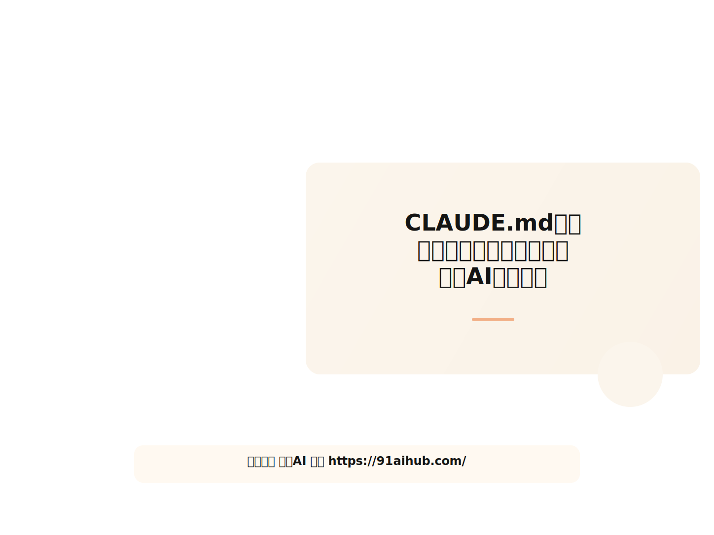
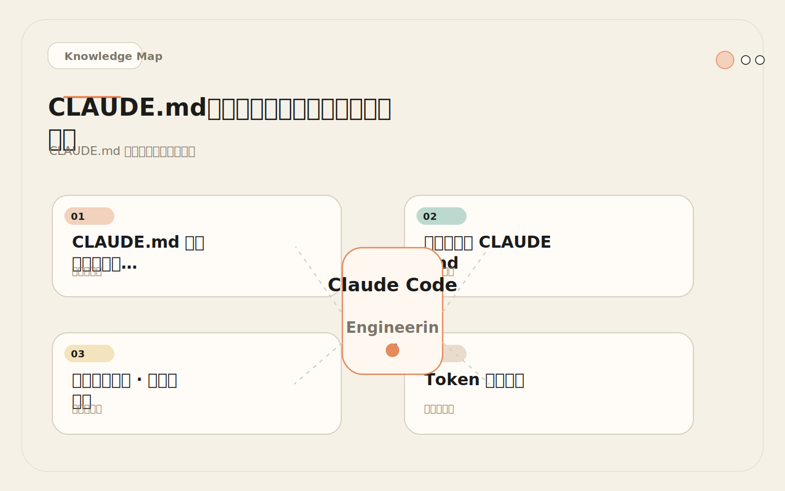
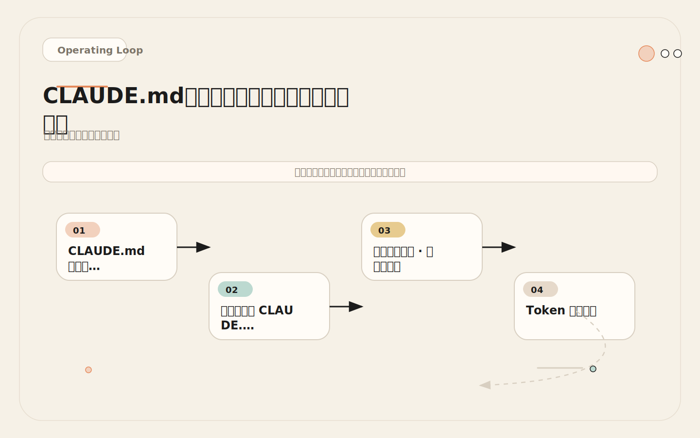
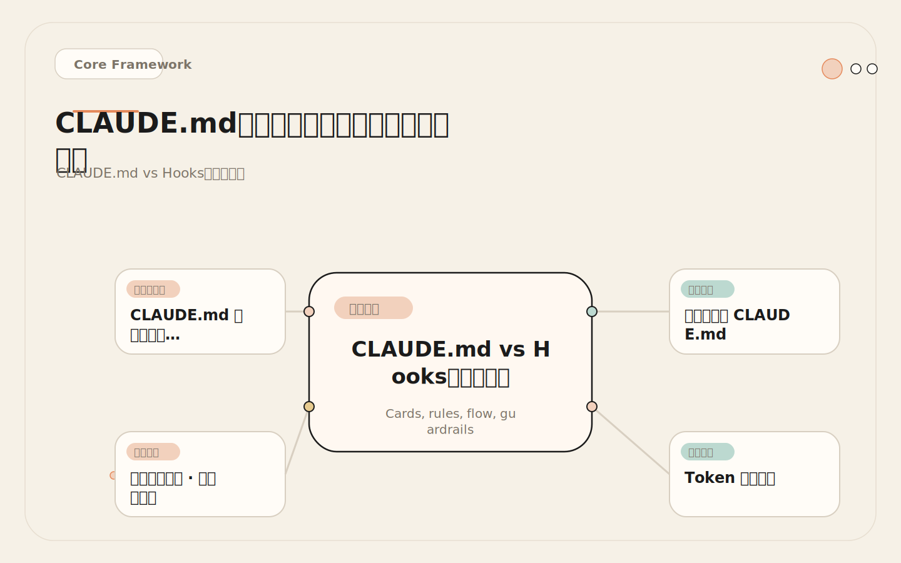
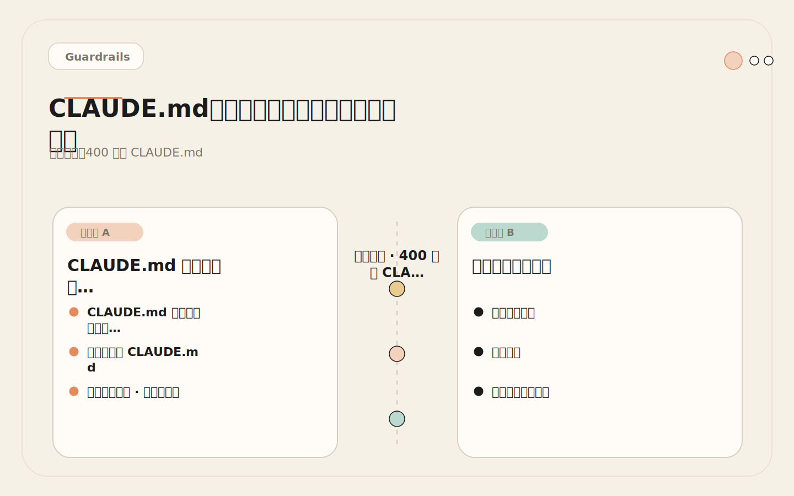

# CLAUDE.md：把团队规则写成机器可用上下文

<!-- codex:cover ../../../assets/claude-code-engineering/04-claude-md-project-memory-cover.svg -->

<!-- /codex:cover -->

**TL;DR：** `CLAUDE.md` 不是给人读的文档，是给模型读的工程规格。它控制 Claude Code 的行为边界，每次会话都被全量加载到上下文。写得好，省掉反复提醒；写得差，浪费 Token 还不生效。

## CLAUDE.md 是工程规格，不是文档

大多数团队第一次写 `CLAUDE.md`，会本能地抄一段 README 进去——项目介绍、技术栈、团队使命。这些信息对人有用，对模型几乎没用。模型不关心你们的愿景，它关心的是：跑什么命令、改哪些文件、遵守什么边界、不能碰什么东西。

<!-- codex:illustration 04-claude-md-project-memory/01-overview-knowledge-map.svg -->

<!-- /codex:illustration -->

`CLAUDE.md` 的本质是一份**机器可读的行为规格**。它有以下工程属性：

- **每次会话全量加载**：无论任务大小，CLAUDE.md 的全部内容都会被注入上下文。这意味着每一行都在持续消耗 Token 预算。
- **层级覆盖**：用户级 `~/.claude/CLAUDE.md` → 项目级 `./CLAUDE.md` → 子目录级 `subdir/CLAUDE.md`，后者覆盖前者。跨项目通用的偏好放用户级，项目特定的放项目级。
- **支持文件导入**：`@other-file.md` 语法可以把外部文件内容内联进来。适合拆分长规则到独立文件。
- **不是强制策略**：CLAUDE.md 是上下文，不是策略引擎。模型可能会忽略其中的规则。真正需要强制的安全边界要用 Hooks 实现（见第 22 篇）。

理解这一点很关键：**CLAUDE.md 里的规则是建议，不是约束**。你在里面写"不要改 .env"，模型多数时候会遵守，但不是 100%。如果某条规则违反了就必须中断操作，那它属于 Hooks 的管辖范围。

一个常见的误解是：CLAUDE.md 写得越详细，Claude Code 就越听话。实际上，CLAUDE.md 的效果遵循一个倒 U 型曲线——太少的信息让模型无从遵循，太多的信息让模型失去焦点。最佳区间在 60 到 120 行之间。低于 60 行，缺少关键约束；超过 120 行，规则之间互相干扰，遵循率开始下降。后文的 Token 预算分析和失败案例会展开这个论点。

另一个误解是：CLAUDE.md 可以替代 README。不能。README 是给人看的，描述项目是什么、为什么这么做；CLAUDE.md 是给模型看的，描述怎么操作、不能做什么。一个好的检验标准：如果删掉 CLAUDE.md 里某段话，模型的行为是否会改变？如果不会，那段话就不该在那里。

## 三个真实的 CLAUDE.md

不是模板，是实际在用的配置。三个项目，三种技术栈，三种关注点。

### A. TypeScript API 服务

这个项目的核心需求是分层架构约束——Claude Code 必须知道每一层该干什么、不能干什么，否则它会在 route handler 里写业务逻辑。

```markdown
# CLAUDE.md

## Commands
- Install: pnpm install
- Dev: pnpm dev
- Test: pnpm test (unit), pnpm test:e2e (integration)
- Lint: pnpm lint
- Typecheck: pnpm typecheck
- DB migrate: pnpm prisma migrate dev

## Architecture
- src/routes/ — Express route handlers, thin layer, delegate to services
- src/services/ — Business logic, no HTTP imports
- src/repositories/ — Database access only, no business logic
- src/models/ — Prisma-generated types only, never edit manually
- src/utils/ — Shared helpers, no side effects

## Rules
- Routes MUST NOT contain business logic
- Services MUST NOT import from express
- Repositories are the only layer that touches prisma client
- All new endpoints need integration tests in tests/e2e/
- Use zod for request validation, never trust req.body directly

## Safety
- Do not edit prisma/schema.prisma without explicit approval
- Do not modify migrations after they've been applied
- Do not touch .env files
- Do not run pnpm prisma migrate reset

## Testing
- Run relevant unit tests after editing service files
- Run integration tests after adding endpoints
- Test command for single file: pnpm vitest run src/services/user.test.ts
```

关键设计：Architecture 段落用一句话定义每个目录的职责和限制。Rules 用 MUST NOT 做硬边界声明。Testing 段落不只说"要测试"，而是明确给出什么操作触发什么测试。

### B. React 前端（Next.js）

前端项目的关注点不一样：组件复用、样式约束、路由结构、SSR 边界。

```markdown
# CLAUDE.md

## Commands
- Install: pnpm install
- Dev: pnpm dev
- Build: pnpm build
- Lint: pnpm lint
- Typecheck: pnpm typecheck
- Test: pnpm test

## Architecture
- app/ — Next.js App Router, page.tsx + layout.tsx only
- components/ui/ — Primitive components (Button, Input, Dialog), no business logic
- components/features/ — Feature-specific composite components
- lib/ — Shared utilities and hooks, no React components
- lib/api/ — API client functions, generated from OpenAPI spec
- styles/ — Global styles and Tailwind config

## Rules
- Use Tailwind classes only, no inline styles, no CSS modules
- Import components from @/components/ui, never write raw <button> or <input>
- Server Components by default, add "use client" only when state/effects needed
- Data fetching in Server Components or Server Actions, not in useEffect
- Form mutations use Server Actions, not API routes
- Do not create new API routes unless explicitly asked

## Safety
- Do not edit tailwind.config.ts without approval
- Do not modify next.config.js without approval
- Do not install new UI libraries without checking if existing components suffice
- Do not touch lib/api/ — it is auto-generated

## Testing
- Run pnpm test after modifying components
- Test file colocated: ComponentName.test.tsx next to ComponentName.tsx
- Prefer testing-library, no Enzyme
```

关键设计：Rules 段落明确"默认 Server Component，按需加 use client"——这是 Next.js 项目最容易出错的地方。Safety 里"不要装新 UI 库"防止 Claude Code 动不动引入 shadcn 新组件。

### C. Python ML 服务

ML 项目有独特的约束：数据管线、模型文件、实验可复现性。

```markdown
# CLAUDE.md

## Commands
- Install: pip install -e ".[dev]"
- Dev: python -m src.main
- Test: pytest tests/ -v
- Lint: ruff check src/
- Format: ruff format src/
- Train: python -m src.train --config configs/default.yaml
- Evaluate: python -m src.evaluate --checkpoint checkpoints/latest.pt

## Architecture
- src/data/ — Data loading and preprocessing pipelines
- src/models/ — Model architectures, PyTorch nn.Module only
- src/training/ — Training loops, loss functions, schedulers
- src/evaluation/ — Metrics, visualization, report generation
- configs/ — YAML config files, one per experiment
- notebooks/ — Exploration only, never import from notebooks into src/

## Rules
- All data paths go through configs, no hardcoded file paths in source
- Model changes must be backward compatible with saved checkpoints
- Use PyTorch, not TensorFlow
- Use type hints everywhere, run mypy before committing
- Do not modify configs/default.yaml — create a new config for experiments
- Keep notebooks stateless: clear all outputs before committing

## Safety
- Do not delete or modify files under checkpoints/
- Do not run training without specifying a config file
- Do not modify src/data/loader.py without running full pipeline test
- Do not push large model files (>100MB) to git

## Testing
- Run pytest after modifying any src/ file
- Test data pipeline separately: pytest tests/test_data/
- Integration test after model changes: pytest tests/test_training/
- Single file: pytest tests/test_data/test_loader.py -v
```

关键设计：ML 项目最大的坑是可复现性。Rules 里的"所有数据路径走 configs"和"模型变更必须向后兼容 checkpoint"直接防止 Claude Code 破坏实验可复现性。Safety 段落的"不要删 checkpoints 目录下的文件"看似简单，但这类规则如果只在 CLAUDE.md 里声明而没有 Hooks 兜底，一旦模型认为删除旧 checkpoint 是"清理空间"的合理操作，损失不可逆。

### 三个例子的共同模式

回看这三个配置，可以发现一个共同结构。每个 CLAUDE.md 都包含五个段落，每个段落的职责固定：

**Commands** 回答"怎么跑"。列出安装、开发、测试、lint、类型检查的完整命令。不给这些信息，Claude Code 会猜——它可能猜对（用 npm 代替 pnpm），也可能猜错（用 jest 代替 vitest）。一旦猜错，后续所有操作都建立在错误的工具链上。

**Architecture** 回答"东西在哪"。用一句话描述每个关键目录的职责和限制。这不是给人看的架构文档，是给模型的导航图。没有它，模型会通过搜索推断结构——读 ten 个文件来猜目录职责，浪费数千 tokens，还可能猜错。

**Rules** 回答"怎么写"。用 MUST / MUST NOT 做明确的约束声明。关键是具体：不要写"注意代码质量"，要写"Services MUST NOT import from express"。前者是人的价值观，后者是机器可执行的条件判断。

**Safety** 回答"不能碰什么"。列出所有禁止修改的文件和禁止执行的命令。这些规则需要 Hooks 兜底——CLAUDE.md 里列出是为了让模型理解原因，Hooks 里拦截是为了确保执行。

**Testing** 回答"怎么验证"。不只说"要测试"，而是明确什么操作触发什么测试命令。给单文件测试命令尤其重要——没有它，Claude Code 会跑全量测试，一个 2000 个测试的仓库等两分钟，消耗大量 Token 在测试输出上。

## 内容分层策略：什么放哪里

CLAUDE.md 不是唯一的行为配置点。Claude Code 有三层规则载体，各有不同的加载时机和 Token 成本。

<!-- codex:illustration 04-claude-md-project-memory/03-flow-operating-loop.svg -->

<!-- /codex:illustration -->

| 内容类型 | 放在哪里 | 加载时机 | Token 成本 | 适用场景 |
|---------|---------|---------|-----------|---------|
| 命令和构建步骤 | `CLAUDE.md` | 每次会话 | 高（每次全量加载） | 所有项目都需要 |
| 全局架构规则 | `CLAUDE.md` | 每次会话 | 高 | 分层架构、编码规范 |
| 按路径的编码规则 | `.claude/rules/` | 匹配路径时 | 中（按需加载） | monorepo 不同 package |
| 特定任务流程 | Skill | 触发任务时 | 低（仅任务期间） | 复杂工作流如部署 |
| 长脚本和模板 | Skill resources | 明确引用时 | 最低 | 代码生成模板、提示词 |

决策逻辑：

- **每个开发者都需要知道的**（命令、架构、安全边界）→ `CLAUDE.md`
- **只有改某个目录时才需要知道的**（UI 组件规范、API 风格）→ `.claude/rules/`
- **只有执行特定任务时才需要知道的**（部署流程、数据迁移）→ Skill

错误做法：把所有规则都塞进 CLAUDE.md。一个 400 行的 CLAUDE.md 里可能有 200 行只在改某个子目录时才有用，但它们每次会话都在消耗 Token。详见后文失败案例。

正确做法：CLAUDE.md 保持精简（建议 120 行以内），路径特定规则拆到 `.claude/rules/`（见第 05 篇），任务流程封装为 Skill（见第 08 篇）。

## Token 预算分析

CLAUDE.md 不是免费的。每次会话启动，它的全部内容都会被注入上下文。以下是基于实际使用估算的 Token 消耗：

```
CLAUDE.md 行数 → 大致 Token 消耗
├── 30 行    → ~500 tokens
├── 50 行    → ~800 tokens
├── 80 行    → ~1200 tokens
├── 120 行   → ~1800 tokens  ← 推荐上限
├── 200 行   → ~3000 tokens
├── 400 行   → ~6000 tokens  ← 已是负担
└── 600+ 行  → ~9000+ tokens ← 严重影响任务空间
```

加上其他上下文开销：

```
总上下文预算构成（Claude Sonnet, 200K tokens）
├── 系统提示词（内置）     ~3K tokens
├── 用户级 CLAUDE.md       ~800 tokens（如果配置了）
├── 项目级 CLAUDE.md       ~1500 tokens（120 行）
├── Rules 文件（按需加载）  ~200-500 tokens（匹配的文件）
├── Auto memory             ~200-1000 tokens
├── 用户消息               ~1K tokens
├── 工具调用 + 结果         ~5K-50K tokens（任务复杂度决定）
├── 历史对话               ~10K-100K tokens（会话长度决定）
└── 剩余可用于任务推理      → 越多越好
```

关键洞察：CLAUDE.md 从 30 行增长到 120 行，Token 成本只从 ~500 增长到 ~1800，还在可接受范围。但从 120 行增长到 400 行，成本跳到 ~6000，而增加的 280 行规则（主要是一些低频场景的注意事项）被模型遵循的概率反而下降了——因为规则太多，模型无法在大量指令中维持对每一条的注意力。

**建议上限：CLAUDE.md ≤ 120 行，控制 Token 消耗在 2000 以内。** 超出的内容考虑拆到 `.claude/rules/` 或 Skill。

这里有一个反直觉的发现：Token 消耗的增长是线性的，但规则遵循率的下降是指数级的。从 80 行增加到 120 行，遵循率可能只从 88% 降到 82%；但从 120 行增加到 200 行，遵循率可能从 82% 骤降到 65%。原因是注意力稀释——模型面对 200 行指令时，很难在前 80 行的架构规则和后 120 行的边缘场景注意事项之间合理分配注意力权重。结果往往是高频规则被正确遵循，低频规则被完全忽略，而中间地带（比如测试要求）处于不确定状态。

这意味着 CLAUDE.md 优化的核心不是"怎样塞更多规则"，而是"怎样让最重要的规则最突出"。实用的做法：把最关键的 5-8 条规则放在 Rules 段落的前三行。模型对指令列表的开头部分注意力最高。

## 质量度量：怎么知道你的 CLAUDE.md 有没有用

CLAUDE.md 不是写了就完了。它是一份运行中的工程规格，需要度量效果。以下是四个可操作的指标：

| 指标 | 定义 | 度量方法 | 目标值 |
|------|------|---------|--------|
| **遵循率** | Claude Code 遵守规则、不需要额外提醒的会话比例 | 跑 10 个任务，数一数需要手动纠正几次 | ≥ 80% |
| **重复提问率** | Claude Code 询问 CLAUDE.md 中已有答案的问题的比例 | 记录每次会话中的问题，检查是否已在 CLAUDE.md 中 | ≤ 10% |
| **越界率** | Claude Code 违反明确声明的边界（Safety 段落）的比例 | 检查修改的文件是否触达 Safety 列表 | ≤ 5% |
| **首次正确率** | 第一次生成就符合架构规则、不需要返工的代码比例 | 统计需要二次修改的原因，区分"需求不清"和"规则违反" | ≥ 70% |

度量方法不需要复杂工具。连续用 Claude Code 完成一周的任务，记录每次需要手动纠正的情况，就能得到这些指标的粗略估计。更简单的方法：让 Claude Code 在每个任务结束时输出一份简短的"规则遵循自检"——它认为自己遵循了哪些规则、违反了哪些规则、有哪些规则不确定怎么执行。虽然自检不完全可靠，但它的"不确定"项通常指向 CLAUDE.md 里表述模糊的段落。

**诊断规则**：

- 遵循率低 → 规则表述太模糊，Claude Code 不知道怎么执行。改写为具体指令。
- 重复提问率高 → CLAUDE.md 缺少关键信息。把被反复问到的问题补充进去。
- 越界率高 → Safety 规则只在 CLAUDE.md 里，没有被 Hooks 强制。把最关键的边界移到 Hooks。
- 首次正确率低 → Architecture 描述不准确或不完整。让 Claude Code 复述架构，看它理解了什么。

## CLAUDE.md vs Hooks：边界决策

CLAUDE.md 是建议层，Hooks 是执行层。一条规则放在哪里，取决于违反后果的严重程度。

<!-- codex:illustration 04-claude-md-project-memory/02-framework-core-structure.svg -->

<!-- /codex:illustration -->

| 规则类型 | CLAUDE.md | Hooks | 原因 |
|---------|-----------|-------|------|
| 编码风格（用 Tailwind、用 zod） | 主要位置 | 不需要 | 违反后果低，上下文提示足够 |
| 架构分层（route 不写逻辑） | 主要位置 | 可选补充 | 违反后果中等，CLAUDE.md 多数有效 |
| 文件保护（不改 schema、不改 .env） | 列出文件 | 必须配合 | 违反后果高，不能只靠模型自律 |
| 测试要求（改代码后跑测试） | 描述期望 | PostToolUse 提醒 | 双保险：上下文提示 + 事件触发 |
| 命令权限（不能跑 reset、drop） | 不需要 | 主要位置 | 后果严重且可枚举，直接阻断 |
| 工作流步骤（部署流程、发布检查） | 描述流程 | 不需要 | 流程性内容，上下文足够 |

核心原则：**违反后果可接受的规则放 CLAUDE.md，违反后果不可接受的规则必须用 Hooks 兜底。**

很多团队的现状是只在 CLAUDE.md 里写了"不要改生产数据库"，但没有 Hooks 拦截。这在 90% 的情况下够用，因为模型确实会遵守写在 Safety 段落里的规则。但那 10% 的失败场景——模型认为某个任务"显然"需要改数据库、绕过了 CLAUDE.md 的建议——造成的后果可能远超你愿意承受的范围。所以判断标准不是"模型通常会遵守吗"，而是"如果模型不遵守，后果有多严重"。严重到不可接受的，必须加 Hooks。

举个例子：你在 CLAUDE.md 里写了"不要改 .env 文件"。大部分时候 Claude Code 会遵守。但偶尔它会认为某个任务必须修改 .env 才能完成，然后就改了。如果你真的不能承受 .env 被修改的后果，就在 Hooks 里加一个 PreToolUse 拦截：

```json
{
  "hooks": {
    "PreToolUse": [
      {
        "matcher": "Write|Edit",
        "command": "bash -c 'echo \"$TOOL_INPUT\" | jq -r .file_path | grep -q \"\\.env\" && echo BLOCK: .env files are protected || true'"
      }
    ]
  }
}
```

这样即使模型"决定"要改 .env，Hooks 也会在写入前拦截。CLAUDE.md 是提示，Hooks 是保障。

## 失败案例：400 行的 CLAUDE.md

这是一个真实的场景。一个 8 人团队在 monorepo 里维护前端（Next.js）、后端（NestJS）、共享组件库和数据库迁移四个 package。他们把所有规则都写进根目录的 CLAUDE.md，大概 400 行，包括：

<!-- codex:illustration 04-claude-md-project-memory/04-compare-guardrails.svg -->

<!-- /codex:illustration -->

- 前端组件规范（只在改 `packages/ui/` 时有用）
- 后端 API 设计指南（只在改 `apps/api/` 时有用）
- 数据库迁移流程（只在改 `packages/db/` 时有用）
- 部署步骤（只有发布时有用）
- Code Review 检查清单（只有提 PR 时有用）
- 通用编码规范（任何时候都有用）

问题出在两个层面：

**Token 浪费**：400 行 CLAUDE.md 消耗约 6000 tokens。一个"修前端按钮样式"的任务，不需要后端 API 设计指南、数据库迁移流程和部署步骤，但这些内容全被加载了。

**规则遵守率下降**：更严重的问题是，规则太多之后 Claude Code 的遵循率反而下降。测试数据：40 行 CLAUDE.md 时遵循率约 85%，400 行时降至约 60%。原因不是模型能力不够，而是**信号稀释**——400 条指令里找到和当前任务相关的 20 条，比 40 条里找到 20 条困难得多。模型在大量无关规则中无法维持对所有规则的注意力。

修复方案：

```
修改前：
根 CLAUDE.md 400 行（所有规则混在一起）

修改后：
根 CLAUDE.md 80 行（命令、全局架构、通用安全边界）
├── .claude/rules/frontend.md   — 前端组件规范（匹配 apps/web/**, packages/ui/**）
├── .claude/rules/backend.md    — 后端 API 设计指南（匹配 apps/api/**）
├── .claude/rules/database.md   — 数据库迁移流程（匹配 packages/db/**）
├── .claude/rules/deploy.md     — 部署步骤（匹配 deploy/**, scripts/**）
└── Skill: code-review          — Code Review 检查清单（触发时加载）
```

修改后，常规前端任务的上下文加载：根 CLAUDE.md（~1200 tokens）+ frontend rules（~400 tokens）= ~1600 tokens。相比之前的 ~6000 tokens，节省了 73%。遵循率回升到约 80%。

教训：**CLAUDE.md 的价值不在于写了多少规则，而在于当前任务相关的规则有多突出。** 规则越多不等于越好。精简、分层、按需加载才是正确策略。

更深一层的教训是：这个团队犯的错误不是"写了太多规则"，而是"没有对规则做优先级排序"。400 行里的每一条单独看都是合理的，但它们没有区分"每次都需要"和"偶尔需要"。当一个前端开发者让 Claude Code 改按钮颜色时，它不应该被后端数据库迁移流程干扰。分层加载的本质是把"谁在什么时候需要什么"这个工程判断显性化。

如果你正在评估自己团队的 CLAUDE.md 是否过长，可以做一个简单测试：随机选一个任务，跑之前先问 Claude Code"根据 CLAUDE.md，这个任务需要注意哪些规则？"如果它列出了很多和你当前任务无关的规则，说明 CLAUDE.md 需要拆分。

## 落地检查清单

按顺序执行：

- [ ] `CLAUDE.md` ≤ 120 行。如果超过，把路径特定的规则拆到 `.claude/rules/`（见第 05 篇）
- [ ] 包含五个核心段落：Commands、Architecture、Rules、Safety、Testing
- [ ] Commands 段落覆盖：安装、开发、测试、类型检查、lint
- [ ] Architecture 段落用一句话描述每个关键目录的职责和限制
- [ ] Rules 段落用 MUST NOT / MUST 做明确约束，不用"应该""尽量"
- [ ] Safety 段落列出所有不能碰的文件和不能跑的命令
- [ ] Testing 段落明确什么操作触发什么测试，附上单文件测试命令
- [ ] 让 Claude Code 复述项目结构，确认准确（验证 Architecture 段落是否有效）
- [ ] 跑三个任务，统计重复提问率和越界率
- [ ] Safety 里的关键规则已用 Hooks 兜底（见第 22 篇）
- [ ] 没有 README 级别的背景描述——项目介绍、团队愿景、技术选型理由不属于 CLAUDE.md

## 交叉引用

- **第 05 篇**（rules）：路径特定规则的写法和组织方式，CLAUDE.md 超长时的拆分目标位置
- **第 22 篇**（hooks）：确定性控制层，Safety 规则的强制执行机制，CLAUDE.md 建议的兜底保障
- **第 00 篇**（运行时模型）：四层架构中的记忆层定位，CLAUDE.md 在上下文预算中的具体位置和压缩行为

## 一个实际的工作流

把以上内容串起来，一个团队从零开始配置 CLAUDE.md 的推荐流程：

第一步：让 Claude Code 自助生成草稿。在一个已有项目里运行"阅读仓库结构，生成一份 CLAUDE.md 草稿，包含 Commands、Architecture、Rules、Safety、Testing 五个段落"。它会基于实际代码给出一个合理的起点。

第二步：人工审查和修正。Claude Code 生成的草稿通常在 Commands 和 Architecture 上比较准确（因为它真的读了代码），但在 Rules 和 Safety 上往往遗漏团队的隐性约定。把那些"所有人都知道但没人写下来"的规则补进去。

第三步：验证。跑三个不同类型的任务（修 bug、加功能、重构），观察 Claude Code 是否遵循规则。如果它反复违反某条规则，不是它不听话，是那条规则表述不够具体。改写后重新验证。

第四步：度量。一周后检查遵循率、重复提问率、越界率。如果越界率超过 5%，把对应的 Safety 规则加到 Hooks。

第五步：迭代。项目在演进，CLAUDE.md 也要跟着更新。每次新增一个重要目录、变更测试框架、或者修改部署流程时，同步更新对应的段落。


