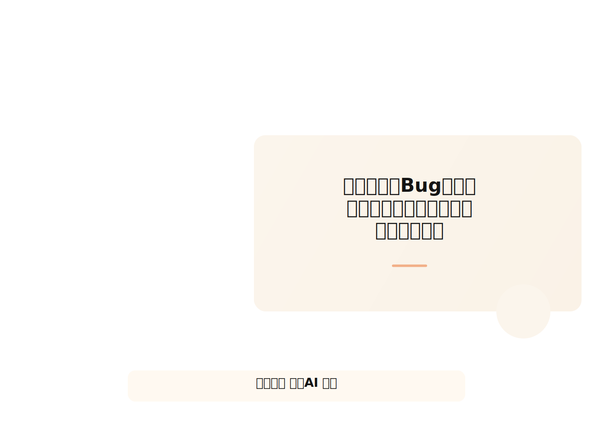
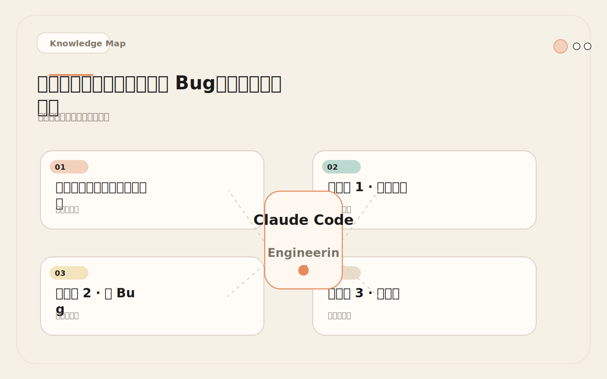
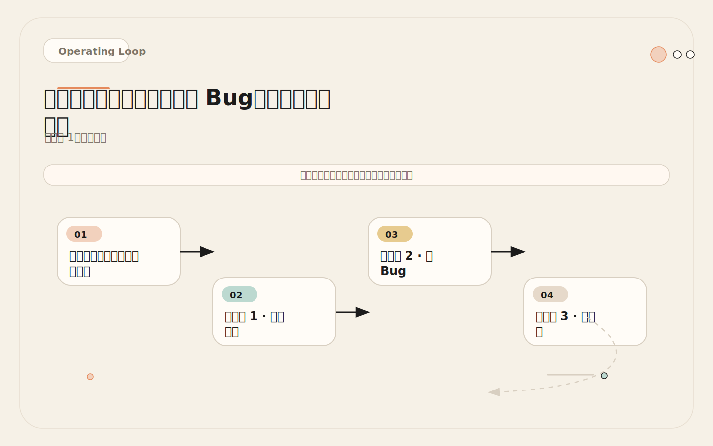
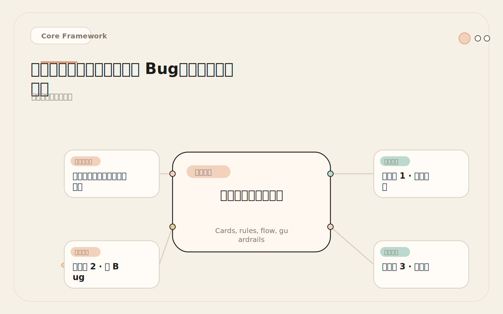
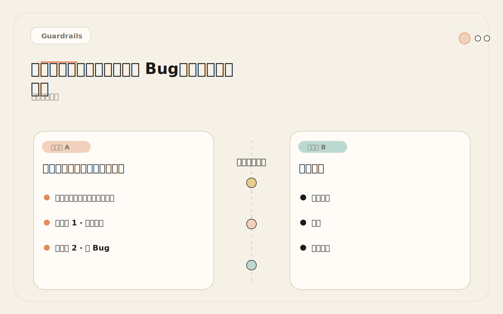

# 读代码、修 Bug、补测试、写文档：四套拿来即用的工作流模板

<!-- codex:cover ../../../assets/claude-code-engineering/06-common-workflows-cover.svg -->

<!-- /codex:cover -->

**TL;DR：** 解释代码、修 Bug、补测试、更新文档——四个高频低风险工作流。跑通这四个，等于验证了 CLAUDE.md、测试闭环和模块边界。跑不通就别做复杂任务。

## 为什么要从这四个工作流开始

团队引入 Claude Code 后最常见的错误：直接甩一个大需求过去，结果改了一堆不该改的文件、没跑测试、引入回归，然后得出结论"AI 不靠谱"。

<!-- codex:illustration 06-common-workflows/01-overview-knowledge-map.svg -->

<!-- /codex:illustration -->

问题不在 AI。问题在于你没有先验证基础设施。

这四个工作流的共同特征：**高频、低风险、可快速验证**。它们不是目的，是诊断工具。每个工作流都会暴露一类配置缺陷：

| 工作流 | 诊断什么 | 暴露的问题 |
|--------|---------|-----------|
| 解释代码 | 项目地图是否完整 | CLAUDE.md 缺少架构描述 |
| 修 Bug | 模块边界是否清晰 | Claude Code 改了不该改的文件 |
| 补测试 | 测试命令是否正确 | CLAUDE.md 的 Commands 段有误 |
| 写文档 | 文档规则是否明确 | Claude Code 不知道文档放哪里 |

如果这四个工作流都跑不顺，说明你的 CLAUDE.md、Hooks 和权限配置还不支持复杂任务。先把基础诊断能力校准好。

## 工作流 1：解释代码

### 目的

<!-- codex:illustration 06-common-workflows/03-flow-operating-loop.svg -->

<!-- /codex:illustration -->

新人 onboarding、Code review 前准备、理解不熟悉的模块。解释代码不需要 Claude Code 修改任何文件，是纯只读操作，零风险。

### 提示词模式

```text
解释 src/services/payment/ 目录的架构。
列出每个文件的职责、导出的函数、和调用它的模块。
标注哪些函数有测试覆盖，哪些没有。
```

关键约束：**只读，不修改**。如果 Claude Code 在解释过程中顺手改了代码，说明你的权限或规则配置有问题。

### 验证方式

人工确认 Claude Code 的解释和实际代码一致。重点检查：

- 文件职责描述是否准确（不是泛泛而谈）
- 函数列表是否完整（没有遗漏导出函数）
- 调用关系是否正确（确实是被那些模块调用）
- 测试覆盖标注是否和实际测试文件对应

### 暴露的配置问题

如果 Claude Code 解释不准确，原因通常是：

1. **CLAUDE.md 缺少项目地图** —— Claude Code 不知道模块之间的依赖关系，只能靠文件名猜。
2. **路径规则缺失** —— monorepo 中，Claude Code 把不同 package 的职责搞混。
3. **CLAUDE.md 中的架构描述过期** —— 写的时候是对的，重构后没更新。

### 验证清单

```text
解释代码验证清单：
[ ] 文件职责描述与代码注释一致
[ ] 导出函数列表完整（手动 spot check 3 个文件）
[ ] 调用关系与 grep 结果匹配
[ ] 测试覆盖标注与实际 test 文件对应
[ ] Claude Code 没有修改任何文件（纯只读）
```

如果五个都通过，说明项目地图配置有效。如果第二个和第五个失败，优先修 CLAUDE.md 的架构描述段。

## 工作流 2：修 Bug

### 目的

小范围行为修复。关键词是"小范围"——一个 bug 最多涉及 2 个文件。超过 2 个文件的修改已经不算简单 bug fix 了。

### 完整提示词模式

```text
Bug: 用户注册后欢迎邮件没有发送。

1. 先定位相关代码：注册逻辑在哪个文件，邮件发送在哪个文件
2. 解释当前行为和预期行为的差异
3. 提出最小修改方案（只改必要的代码）
4. 修改后运行最小相关测试
5. 总结：改了什么、为什么、测试结果、剩余风险
```

这个提示词强制 Claude Code 走一条结构化路径：定位 → 诊断 → 方案 → 执行 → 验证。不是让它自由发挥，而是每一步都有可检查的产出。

### 质量指标

| 指标 | 标准 | 不达标时的含义 |
|------|------|--------------|
| 修改文件数 | ≤ 2 | 超过说明模块边界不清或诊断有误 |
| 测试通过 | 最小相关测试全部通过 | 要么测试没跑，要么改坏了 |
| 无关变更 | 0 | Claude Code 在"顺手优化"，需要加强规则 |
| 诊断准确 | root cause 和实际一致 | 上下文不足，需要补 CLAUDE.md |

### 失败诊断树

```
Bug 修失败了，按这个顺序排查：

1. Bug 没修好？
   → 诊断错误（Claude Code 定位到了错误的代码）
   → 上下文不足（Claude Code 不知道关键的调用链）
   → 修复：补 CLAUDE.md 的架构描述和模块依赖

2. 改了太多文件？
   → 范围蔓延（Claude Code 觉得"顺便重构一下"）
   → 边界规则缺失（CLAUDE.md 没有明确哪些模块不能动）
   → 修复：补 CLAUDE.md 的 Working Rules 和模块边界

3. 测试没跑？
   → 没有验证习惯（Claude Code 改完就结束了）
   → CLAUDE.md 没有要求修改后必须运行测试
   → 修复：加 PostToolUse Hook 或在 CLAUDE.md Commands 段强调测试

4. 引入了回归？
   → 没有覆盖原始行为的测试
   → 修改影响了其他调用方
   → 修复：先补回归测试，再修 bug
```

### 实战检查

修完 bug 后，对照这个 diff 检查清单：

```text
Bug Fix 验证清单：
[ ] 修改文件数 ≤ 2
[ ] 每个 hunk 都和 bug 直接相关（无"顺手"改动）
[ ] 最小相关测试已运行且通过
[ ] Claude Code 解释了 root cause
[ ] Claude Code 列出了剩余风险
[ ] 没有引入新的 typecheck 或 lint 错误
```

## 工作流 3：补测试

### 目的

提高回归保护。补测试和修 Bug 互为镜像：修 Bug 是"测试告诉你行为错了"，补测试是"先写好网，以后改坏了能知道"。

### 提示词模式

```text
为 src/services/payment/processRefund.ts 补测试。
要求：
1. 先读源文件，列出所有导出函数和分支
2. 列出需要覆盖的场景（正常、边界、异常）
3. 写测试，每个测试只验证一个行为
4. 确认测试先失败再通过（验证测试本身有效）
5. 报告覆盖率
```

第五步"报告覆盖率"容易被忽略，但它是判断测试质量的关键。如果 Claude Code 报告覆盖率从 40% 提升到 65%，你至少知道测试确实在测代码。如果覆盖率没变，说明测试可能测的是无关路径。

### 质量标准

什么样的测试是有效的：

```typescript
// 无效测试：测的是 mock 本身，不是业务逻辑
it('should work', () => {
  mockDb.query.mockResolvedValue({ rows: [] });
  const result = processRefund('order-123');
  expect(result).toBeDefined(); // 永远通过
});

// 有效测试：测的是具体行为
it('拒绝已退款的订单二次退款', async () => {
  mockDb.query.mockResolvedValue({
    rows: [{ status: 'refunded' }]
  });
  await expect(processRefund('order-123'))
    .rejects.toThrow('ORDER_ALREADY_REFUNDED');
});
```

有效测试的判断标准：
- **测试名字描述具体行为**，不是 "should work" 或 "test case 1"
- **断言具体值**，不是 `toBeDefined()` 这种永远通过的断言
- **每个测试只验证一个行为**，一个 it 块里不要测三件事
- **先失败再通过**，确保测试真的能捕获 bug

### 暴露的配置问题

如果 Claude Code 补的测试跑不起来，通常只有一个原因：**CLAUDE.md 里的测试命令是错的**。

```text
常见错误：
- CLAUDE.md 写的是 npm test，项目实际用的是 pnpm test
- CLAUDE.md 写的是 pnpm test，但单测命令是 pnpm test:unit
- 测试需要环境变量，CLAUDE.md 没提
- 测试框架用的是 vitest，CLAUDE.md 写的是 jest
```

这类问题修一次就好——更新 CLAUDE.md 的 Commands 段。

### 验证清单

```text
补测试验证清单：
[ ] Claude Code 列出了所有导出函数和分支
[ ] 场景覆盖了正常路径、边界值和异常情况
[ ] 每个测试只验证一个行为
[ ] 测试先失败再通过（不是天生就通过）
[ ] 覆盖率有提升
[ ] 测试命令和 CLAUDE.md 一致
```

## 工作流 4：更新文档

### 目的

文档和代码同步。这是最容易被跳过的工作流，但它的诊断价值不低——如果 Claude Code 不知道文档在哪、用什么格式、遵循什么规范，说明 CLAUDE.md 缺少文档规则。

### 提示词模式

```text
src/services/payment/processRefund.ts 刚修改了退款策略：
- 超过 30 天的订单不再支持退款
- 新增部分退款逻辑

更新所有受影响的文档：
1. 找到引用旧退款策略的文档
2. 用现有文档风格更新内容
3. 更新 API 示例中的请求和响应
4. 确认文档内的链接仍然有效
```

### 验证方式

文档验证比代码验证更难自动化，需要人工检查：

- **位置正确**：文档放在项目约定的位置，不是随便找个地方新建
- **格式一致**：和现有文档的 markdown 风格、标题层级、代码块格式一致
- **内容准确**：示例命令能跑、API 参数和实际代码一致
- **链接有效**：文档内引用的其他文档路径仍然可访问

### 暴露的配置问题

```text
常见问题：
- 文档放在 /docs 而不是 /wiki
- 用的是中文文档，Claude Code 写了英文
- API 文档用 OpenAPI 格式，Claude Code 写了纯 markdown
- CHANGELOG 更新规范没写进 CLAUDE.md
```

## 工作流质量诊断矩阵

四个工作流跑完后，用这个矩阵判断项目配置的健康度：

<!-- codex:illustration 06-common-workflows/02-framework-core-structure.svg -->

<!-- /codex:illustration -->

| 工作流 | 暴露的配置问题 | 失败指标 | 修复方法 |
|--------|-------------|---------|---------|
| 解释代码 | 项目地图缺失 | 结构描述不准确、调用关系错误 | 补 CLAUDE.md 架构描述 |
| 修 Bug | 模块边界不清 | 改了不该改的文件、无关变更 > 0 | 补 CLAUDE.md Working Rules 和边界说明 |
| 补测试 | 测试命令错误 | 测试跑不起来、命令不匹配 | 修正 CLAUDE.md Commands 段 |
| 写文档 | 文档规则缺失 | 写错位置、格式不统一 | 补 CLAUDE.md 文档规则段 |

诊断方法：每个工作流跑两轮。第一轮暴露问题，修复配置后跑第二轮验证。如果第二轮全部通过，基础配置合格。

## 真实失败案例

### 背景

<!-- codex:illustration 06-common-workflows/04-compare-guardrails.svg -->

<!-- /codex:illustration -->

一个 6 人团队在支付系统仓库里引入 Claude Code。仓库没有 CLAUDE.md，没有 Hooks，权限完全开放。第一天，后端工程师让 Claude Code 修一个"简单"的 bug：用户登录后偶尔出现 session 过期的提示。

### 事件经过

Claude Code 的操作：

```text
1. 定位到 auth middleware 中的 session 校验逻辑
2. 修改了 auth-middleware.ts —— 修改了 session 过期判断
3. 修改了 session-store.ts —— "优化"了 session 刷新逻辑
4. 修改了 user-service.ts —— 调整了用户信息查询的缓存策略
5. 修改了 logout-handler.ts —— "顺便"统一了错误处理
6. 修改了 api-gateway.ts —— 调整了路由匹配顺序
```

5 个文件被修改，原始 bug 只涉及 1 个文件。Claude Code "顺手"做了一些"优化"。

### 后果

```text
- logout 流程被破坏（用户无法正常退出）
- session store 的刷新逻辑和 Redis 配置不兼容（生产环境 session 全部失效）
- 没有运行任何测试
- 部署后 15 分钟内收到 200+ 用户反馈
```

### 根因分析

```text
三个配置缺失导致的连锁失败：

1. 没有 CLAUDE.md
   → Claude Code 不知道 session-store.ts 是共享基础设施，不能随便改
   → Claude Code 不知道 logout-handler.ts 的错误处理是刻意设计的

2. 没有 PostToolUse Hook
   → 修改文件后没有自动提醒运行测试
   → Claude Code 改完就认为任务完成了

3. 没有模块边界规则
   → Claude Code 的"顺手优化"没有被任何规则约束
   → 没有告知哪些文件属于共享层、不能在 bug fix 中修改
```

### 成本

```text
时间成本：
- 4 小时紧急排查和修复
- 1 小时回滚部署
- 2 小时事后复盘和补写 CLAUDE.md

信任成本：
- 团队对 Claude Code 的信心从"期待"降到"怀疑"
- 两周没人愿意再用 Claude Code
```

### 修复措施

事后团队做了三件事：

```text
1. 创建 CLAUDE.md，包含：
   - 模块边界说明（共享层 vs 业务层）
   - 修改规则（bug fix 最多改 2 个文件）
   - 测试命令和验证要求

2. 添加 PostToolUse Hook：
   - 修改 src/ 下文件后，自动运行最小相关测试
   - 测试失败时提醒 Claude Code 回退修改

3. 配置 .claude/rules/ 路径规则：
   - 共享模块（session-store, cache）需要确认才能修改
   - 修改 API 网关需要安全审查
```

如果团队先跑通四个基础工作流，这个失败不会发生。修 Bug 工作流会立刻暴露"改了太多文件"的问题。补测试工作流会暴露"测试没跑"的问题。解释代码工作流会暴露"没有项目地图"的问题。

## 何时超越基础工作流

四个基础工作流能覆盖日常 60-70% 的任务。但有些任务超出了它们的范围。

### 复杂度判断矩阵

| 信号 | 说明 | 基础工作流还能用吗 | 下一步 |
|------|------|-----------------|--------|
| 可能改动 > 3 个文件 | 超出简单 bug 范围 | 不适合 | 用 plan 模式先拆分任务 |
| 需要先研究影响范围 | 不确定改了会怎样 | 解释代码可以，修 Bug 不行 | 用 Explorer subagent 调研 |
| 跨模块影响 | 改动涉及多个服务 | 不适合 | 用 parallel exploration 并行调研 |
| 安全敏感 | 涉及认证、权限、数据 | 不适合直接改 | 用 security-reviewer subagent 审查 |
| 需要设计决策 | 多种实现方案 | 不适合 | 先讨论方案，再拆成小任务 |

判断标准很简单：**如果你自己也不确定怎么改，就不要让 Claude Code 直接改**。先让它调研、解释、列方案，你确认方案后再执行。

### 从基础到复杂的过渡路径

```text
Level 1: 四个基础工作流（本篇）
         解释代码 → 修 Bug → 补测试 → 写文档

Level 2: 有结构的复杂任务
         先 plan → 拆成多个 Level 1 任务 → 逐个执行验证

Level 3: 需要专项角色
         调研用 Explorer、安全用 Reviewer、测试用 QA subagent

Level 4: 多角色协作
         多个 subagent 并行 + 主会话整合结果
```

不要跳级。Level 1 没跑通就去 Level 3，只会得到更混乱的结果。

## 进阶提示词工程模式

四个基础工作流的提示词模板可以进一步系统化。以下是每种工作流在不同复杂度下的提示词变体，以及为什么这些变体能引导 Claude Code 产生更好的输出。

### 解释代码的分层提示词

```text
Level 1 — 快速概览（适合陌生模块首次接触）：
  列出 src/services/auth/ 下的所有文件。
  每个文件用一句话描述职责。

Level 2 — 结构分析（适合理解模块间关系）：
  解释 src/services/auth/ 的架构。
  列出每个文件的职责、导出的函数、和调用它的模块。
  用箭头标注文件之间的调用方向（A → B 表示 A 调用 B）。

Level 3 — 深度审计（适合 code review 前准备）：
  对 src/services/auth/ 做完整的代码审计准备：
  1. 列出每个导出函数的签名、参数类型和返回类型
  2. 标注每个函数的测试覆盖状态（有测试/无测试/部分覆盖）
  3. 标注错误处理路径（哪些异常被 catch，哪些没有）
  4. 标注外部依赖（调用了哪些其他模块、第三方库、API）
  5. 列出你注意到的潜在问题（不修改代码，只列出观察）
```

分层的原因：Level 1 消耗约 2000 token 的输出，Level 3 消耗约 8000 token。如果你只需要知道一个模块大概做什么，Level 3 的输出反而增加了审查负担。反过来，如果要做代码审查前的准备，Level 1 的信息不够用。

### 修 Bug 的结构化提示词变体

基础版适合简单 bug。以下变体处理更复杂的场景：

```text
变体 A — 不确定 bug 所在位置：
  Bug 报告：[现象描述]
  
  1. 先用 Grep 搜索相关关键词，定位可能出错的代码区域
  2. 列出你找到的所有可疑位置，标注可能性（高/中/低）
  3. 解释每个位置为什么可疑
  4. 等我确认后，再提出修改方案
  
  约束：只做诊断，不做任何修改。

变体 B — Bug 涉及多个模块：
  Bug 报告：[现象描述]
  
  1. 定位 bug 涉及的所有文件
  2. 画出调用链：从入口到出错位置，经过哪些文件和函数
  3. 在调用链上标注每一步的数据流（输入什么、输出什么、在哪一步出错）
  4. 提出最小修改方案，解释为什么改动这些文件就足够
  5. 列出调用链上其他可能受影响的调用方
  6. 修改后运行所有相关测试，不只是出错的那个文件的测试
  
  约束：修改前先画调用链，确认我同意后再改代码。

变体 C — 间歇性 bug（难以稳定复现）：
  Bug 报告：[间歇性现象描述，复现条件不明确]
  
  1. 搜索代码中所有和该现象相关的代码路径
  2. 识别可能导致间歇性行为的代码模式：
     - 竞态条件（并发访问共享状态）
     - 时序依赖（setTimeout、事件顺序）
     - 外部状态（缓存、数据库、第三方 API）
     - 条件分支中未处理的边界情况
  3. 对每个可疑模式，解释为什么它可能导致间歇性行为
  4. 建议添加哪些日志或断言来帮助缩小范围
  5. 不要修改代码，只输出诊断报告
```

变体 A 增加了一个交互检查点（"等我确认后"），避免 Claude Code 在错误的位置做修改。变体 B 强制画出调用链，这在多文件 bug 中能暴露真正的 root cause。变体 C 的重点是诊断而非修复——间歇性 bug 在没有充分信息时贸然修改，往往引入新问题。

### 补测试的提示词工程

```text
进阶版 — 带覆盖率分析的测试补充：

为 src/services/payment/processRefund.ts 补测试。

执行步骤：
1. 读源文件，列出所有导出函数
2. 对每个函数，列出所有分支（if/else, switch, try/catch, ?. , ??）
3. 标注已有测试覆盖的分支（读取现有测试文件对比）
4. 只为未覆盖的分支写测试
5. 每个测试用 describe/it 结构组织，it 描述具体行为
6. 运行测试前报告：新增了几个测试、覆盖了哪些分支
7. 运行测试，报告通过率和覆盖率变化

输出格式要求：
- 测试文件路径：[和源文件对应的测试路径]
- 新增测试数量：[N]
- 覆盖分支列表：[列出]
- 运行命令：[精确命令]
- 覆盖率变化：[从 X% 到 Y%]
```

这个变体的关键是步骤 3——"标注已有测试覆盖的分支"。没有这一步，Claude Code 可能重复写已有的测试场景，浪费 token 且不增加覆盖率。

### 写文档的提示词工程

```text
进阶版 — 变更影响分析驱动的文档更新：

刚完成了以下变更：
[列出变更内容]

请更新所有受影响的文档：

1. 搜索阶段
   - Grep 搜索所有 .md 文件中引用变更内容的文档
   - 列出搜索结果，标注哪些文档确实需要更新

2. 更新阶段
   - 按现有文档风格更新内容（保持标题层级、代码块格式一致）
   - 如果涉及 API 变更，更新请求/响应示例
   - 如果涉及配置变更，更新环境变量表

3. 验证阶段
   - 确认文档内链接仍然有效（Grep 检查引用路径是否存在）
   - 确认示例命令能运行（如果是 shell 命令，验证命令格式正确）
   - 列出你更新了哪些文件的哪些段落

4. 遗漏检查
   - 列出可能还需要的文档更新但你不确定的（标注"需要确认"）
```

步骤 4 "遗漏检查" 是这个变体的关键创新。Claude Code 可能无法确定某些文档是否需要更新（比如 CHANGELOG、内部的架构决策记录），让它列出不确定项比让它自己做决定更安全。

## 工作流失败诊断树（完整版）

前文给出了修 Bug 的失败诊断树。以下是所有四个工作流的完整诊断流程：

```
┌─ 解释代码失败？
│  ├─ 结构描述不准确 → CLAUDE.md 缺少 Structure 段
│  │                    → 补充：每个顶层目录加一句话描述
│  ├─ 调用关系错误 → CLAUDE.md 缺少依赖方向声明
│  │                  → 补充：Boundaries 段加"谁可以调用谁"
│  ├─ 遗漏目录 → CLAUDE.md 的 Structure 段过期
│  │              → 触发条件：新增了目录但没更新 CLAUDE.md
│  └─ 对生成文件做了描述 → CLAUDE.md 缺少 Off-limits 段
│                         → 补充：列出所有不应手动修改的路径
│
├─ 修 Bug 失败？
│  ├─ 改了太多文件
│  │   ├─ Claude Code "顺手优化" → CLAUDE.md 加 "No unrelated changes" 规则
│  │   ├─ 诊断定位错误 → 项目地图不够精确，Claude Code 找错了位置
│  │   └─ 模块边界不清 → Boundaries 段需要更明确的约束
│  ├─ 测试没跑
│  │   ├─ CLAUDE.md 没有要求 → Commands 段补充测试命令
│  │   ├─ Hook 缺失 → 添加 PostToolUse Hook 自动运行测试
│  │   └─ 测试命令错误 → 修正 Commands 段中的命令写法
│  ├─ Bug 没修好
│  │   ├─ Root cause 判断错误 → CLAUDE.md 补充调用链和依赖关系
│  │   ├─ 只修了表面症状 → 提示词增加"解释 root cause"步骤
│  │   └─ 遗漏了相关分支 → 提示词增加"列出所有影响范围"
│  └─ 引入回归
│      ├─ 没有覆盖原始行为的测试 → 先补回归测试，再修 bug
│      ├─ 修改影响了其他调用方 → Boundaries 段补充调用方信息
│      └─ 没有跑全量相关测试 → Commands 段补充"影响范围测试"命令
│
├─ 补测试失败？
│  ├─ 测试跑不起来
│  │   ├─ 命令不存在 → CLAUDE.md Commands 段的测试命令是错的
│  │   │              → 修正：验证命令在终端能跑通再写进 CLAUDE.md
│  │   ├─ 环境变量缺失 → CLAUDE.md 补充测试前置条件
│  │   └─ 测试框架不匹配 → 修正 Commands 段中的框架名称
│  ├─ 测试天生就通过（无效测试）
│  │   ├─ 提示词没有要求"先失败再通过" → 加上"确认测试先失败再通过"步骤
│  │   ├─ 断言太弱 → 提示词增加"断言具体值，不用 toBeDefined()"要求
│  │   └─ Mock 拦截了真实逻辑 → 提示词增加"测试真实行为，不测 mock"
│  └─ 覆盖率没提升
│      ├─ 测试测的是无关路径 → 提示词增加"列出源文件所有分支"步骤
│      └─ 重复已有测试 → 提示词增加"标注已有测试覆盖的分支"步骤
│
└─ 写文档失败？
   ├─ 位置错误 → CLAUDE.md 补充文档目录结构说明
   │            → 说明：/docs 放用户文档，/wiki 放内部文档，根目录放 README
   ├─ 格式不一致 → CLAUDE.md 补充文档格式规范
   │              → 或创建 .claude/rules/docs.md 做路径级加载
   ├─ 内容不准确 → 提示词增加"验证示例命令能运行"步骤
   └─ 遗漏相关文档 → 提示词增加"搜索所有引用旧内容的文档"步骤
```

## 更多真实工作流案例

### 案例二：API 版本迁移工作流

场景：后端服务需要把 `/api/v1/orders` 迁移到 `/api/v2/orders`，v2 改变了部分响应字段的结构。这是一个跨文件、需要协调前后端的任务，但可以拆成多个基础工作流来执行。

```text
Phase 1 — 解释代码（只读，摸清影响范围）：
  列出所有引用 /api/v1/orders 的文件。
  区分：前端调用方、后端 handler、测试文件、文档。
  标注每个引用的上下文（是请求 URL、测试 fixture、还是文档示例）。

Phase 2 — 补测试（先加保护网）：
  为 v1 的现有 handler 补充测试（如果覆盖率不足）。
  要求：测试必须验证当前 v1 的响应格式。
  目的：确保迁移后 v1 的行为不变（向后兼容期）。

Phase 3 — 修 Bug（这里是"迁移"而非修 bug，但用同样的约束）：
  实现 v2 handler，每个变更控制在 2 个文件以内。
  v2 handler 写在独立文件中（不修改 v1 handler）。
  路由注册在 routes/index.ts 中添加（这个文件会改，但只加路由，不改现有路由）。

Phase 4 — 写文档（更新 API 文档）：
  更新 API 文档中的 v2 端点说明。
  添加迁移指南（v1 到 v2 的字段映射）。
  标注 v1 的废弃时间表。
```

这个案例的关键是按顺序执行四个基础工作流，而不是一次性让 Claude Code "把 v1 迁移到 v2"。顺序执行的好处是每个 phase 都有独立的验证点：Phase 1 的输出是影响范围清单，Phase 2 的输出是测试通过报告，Phase 3 的输出是 diff 和测试结果，Phase 4 的输出是文档更新清单。任何一个 phase 不通过，不会影响前面的成果。

### 案例三：依赖升级工作流

场景：将项目从 React 17 升级到 React 18。这种任务看起来复杂，但拆成基础工作流后，每一步都是可控的。

```text
Phase 1 — 解释代码（评估影响）：
  列出 package.json 中所有 React 相关依赖的当前版本。
  Grep 搜索代码中使用 React 17 特有 API 的位置：
    - ReactDOM.render（React 18 用 createRoot）
    - componentWillMount 等 deprecated 生命周期
    - 依赖 react-scripts 的配置
  列出第三方依赖中可能不兼容 React 18 的包。

Phase 2 — 补测试（升级前的安全网）：
  确认所有现有测试在 React 17 下通过。
  如果有组件没有测试，为核心渲染组件补充快照测试。
  快照测试的目的是捕获升级后的渲染输出变化。

Phase 3 — 修 Bug（分步升级）：
  步骤 1：更新 package.json 中的 react 和 react-dom 版本
  步骤 2：运行 pnpm install，检查是否有 peer dependency 冲突
  步骤 3：修改 ReactDOM.render → createRoot（Grep 逐个修改）
  步骤 4：运行测试，确认通过。失败则逐个修复。
  约束：每个步骤只做一件事，做完跑测试再进入下一步。

Phase 4 — 写文档：
  更新项目 README 中的 React 版本说明。
  更新 CLAUDE.md 的 frontmatter（如果有 framework 版本声明）。
  记录升级过程中遇到的 breaking changes 和解决方案。
```

这个案例的特殊之处在于 Phase 3 被进一步拆分成了多个子步骤。依赖升级的每一小步都可能引入不同的问题，"一次改完"几乎必然导致不可调试的失败。

### 渐进复杂度决策矩阵

当你拿到一个任务时，用这个矩阵判断应该用哪个级别的提示词：

```text
任务特征                         │ 提示词级别   │ 预期交互轮次
─────────────────────────────────┼─────────────┼─────────────
单文件，行为明确                  │ 基础版       │ 1 轮
单文件，需要先定位                │ 变体 A       │ 2 轮（诊断 + 执行）
多文件，调用链清晰                │ 变体 B       │ 2-3 轮
多文件，影响范围不确定            │ 先解释代码    │ 3-4 轮
                                 │ 再修 Bug     │
间歇性/难以复现                  │ 变体 C       │ 2 轮（纯诊断）
跨服务/API 变更                  │ 拆成多阶段   │ 4-6 轮
依赖升级                         │ 拆成多阶段   │ 4-6 轮
```

判断的核心逻辑：**任务的不确定度越高，提示词中"诊断"部分的权重应该越大，"执行"部分应该越靠后。** 如果你在任务描述中用了"可能"、"大概"、"不确定"这类词，说明你应该先用解释代码工作流做诊断，而不是直接让 Claude Code 动手修改。

## 工作流质量验证检查清单（综合版）

四个工作流全部跑完后，不仅要验证每个工作流的结果，还要验证它们之间的协同是否正常：

```text
单工作流验证：
[ ] 解释代码：输出准确，无修改文件
[ ] 修 Bug：修改 ≤ 2 文件，无无关变更，测试通过
[ ] 补测试：测试先失败再通过，覆盖率提升
[ ] 写文档：位置正确，格式一致，链接有效

跨工作流验证：
[ ] 解释代码识别的问题在修 Bug 中被正确处理
[ ] 修 Bug 后的代码在补测试中获得了覆盖
[ ] 补测试新增的测试在写文档中被引用（如有必要）
[ ] 四个工作流使用的命令全部来自 CLAUDE.md Commands 段

基础设施验证：
[ ] PostToolUse Hook 正确触发（修改文件后自动跑测试）
[ ] .claude/rules/ 中的路径规则被遵守
[ ] CLAUDE.md 的项目地图在四个工作流中都没有暴露过期信息
[ ] Claude Code 的每个输出都包含 diff、验证结果和剩余风险
```

"跨工作流验证"这个维度容易被忽略。如果解释代码工作流正确识别了模块 A 和模块 B 之间的调用关系，但修 Bug 时 Claude Code 仍然在模块 A 里写了属于模块 B 的逻辑，说明项目地图的 Boundaries 段写对了但 Claude Code 没有遵守——这可能需要在 .claude/rules/ 中加一条路径级的强制规则。

## 落地清单

四个工作流全部跑通后才算基础配置合格：

```text
基础工作流验证清单：
[ ] 解释代码：Claude Code 能准确描述模块结构和调用关系
[ ] 修 Bug：每次 bug fix 修改 ≤ 2 个文件，无无关变更
[ ] 补测试：测试能跑、先失败再通过、覆盖率有提升
[ ] 写文档：文档位置、格式、内容都正确
[ ] 修改后自动运行最小相关测试（PostToolUse Hook 或 CLAUDE.md 规则）
[ ] Claude Code 每次都报告 diff、验证结果和剩余风险
```

全通过：项目配置有效，可以开始更复杂的任务。有失败：先修配置，再重来。

## 权衡

这四个工作流看起来不炫，但它们解决的是最实际的问题：你的项目配置到底有没有效。跑通这四个，后面用 subagent、parallel exploration、Hooks 才有基础。跑不通，复杂工作流只会放大混乱。

## 交叉参考

- [02 - 安装、登录、权限和第一个任务](02-setup-permission-first-repo-task.md)：第一次进入仓库时验证环境
- [04 - CLAUDE.md 项目记忆](04-claude-md-project-memory.md)：工作流暴露的所有问题最终都修到这里
- [12 - Subagents 基础概念](12-subagents-mental-model.md)：基础工作流跑通后再接触专项角色
- [24 - PostToolUse 自动验证](24-posttooluse-stop-verification.md)：修改后自动跑测试的 Hook 配置


