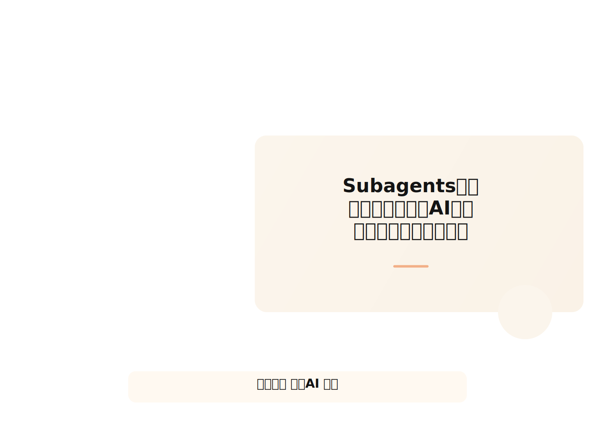
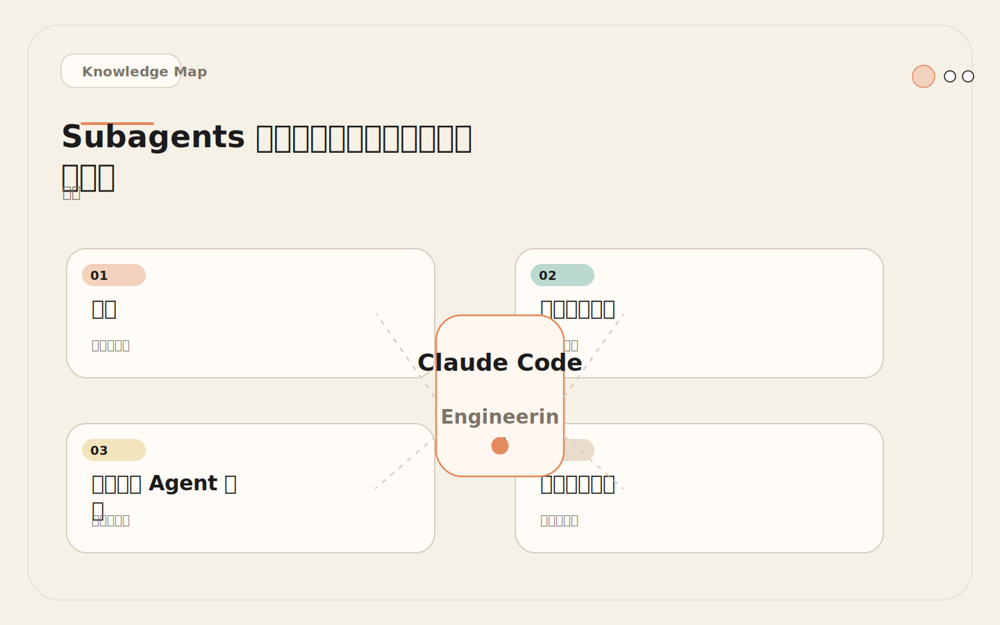
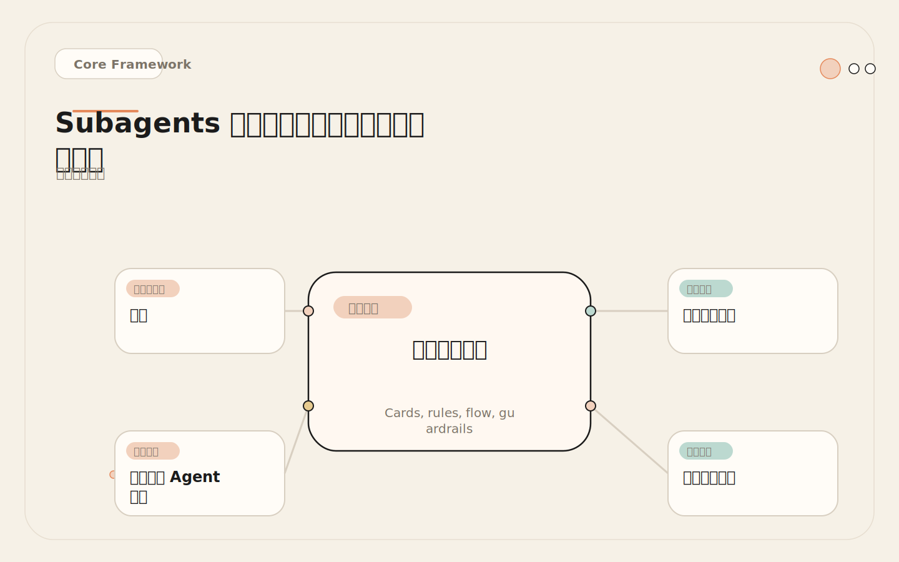
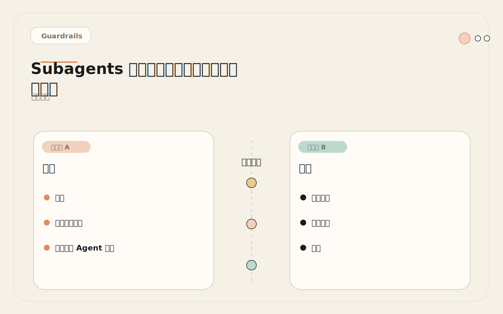
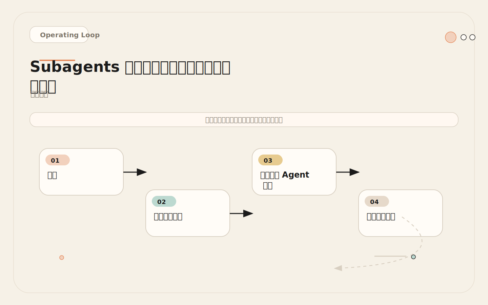

# Subagents 的本质：不是多了一个 AI，而是开了一个独立上下文

<!-- codex:cover ../../../assets/claude-code-engineering/12-subagents-mental-model-cover.svg -->

<!-- /codex:cover -->

**TL;DR：** Subagent 不是"更聪明的 Claude"。它是一块隔离的执行沙箱：独立上下文窗口、独立系统提示词、独立工具白名单。用来做"完成后汇报"的专门任务，而不是替代主会话做持续编辑。

## 问题

主会话在处理复杂项目时面临三重压力：

<!-- codex:illustration 12-subagents-mental-model/01-overview-knowledge-map.svg -->

<!-- /codex:illustration -->

1. **上下文膨胀**。安全审查要读 50 个文件，测试定位要看几百行日志，架构调研要搜遍十几个目录。这些中间产物堆积在主会话里，后续实现阶段的指令精度直线下降。
2. **角色冲突**。同一个会话里既做实现又做审查，审查视角会被实现视角污染——你不太容易批判自己五分钟前写的代码。
3. **工具泄漏**。主会话有完整的文件写入、命令执行权限，但"只读审查"和"安全诊断"这类任务根本不需要写权限。权限不隔离，行为边界就不可控。

Subagent 解决的核心问题不是"让 AI 更聪明"，而是"让 AI 在受限环境里做一件专门的事，然后把结论带回来"。

## 系统设计视角

Subagent 的架构可以用四个隔离维度来描述。理解这四个维度是正确使用 subagent 的前提，因为每一个维度都对应一个具体的工程决策。

<!-- codex:illustration 12-subagents-mental-model/02-framework-core-structure.svg -->

<!-- /codex:illustration -->

```
┌─────────────────────────────────────────────────┐
│                   主会话                          │
│  ┌─────────────────────────────────────────────┐ │
│  │  系统提示 = CLAUDE.md + rules + session hist │ │
│  │  工具集 = 全部可用工具                        │ │
│  │  上下文 = 所有累积对话 + 文件内容             │ │
│  └─────────────┬───────────────────────────────┘ ││                │ 派发任务                          │
│                ▼                                  │
│  ┌─────────────────────────────────────────────┐ │
│  │            Subagent 执行沙箱                  │ │
│  │                                             │ │
│  │  系统提示 = agent .md 文件中的角色指令        │ │
│  │  工具集 = tools 字段声明的白名单              │ │
│  │  上下文 = 空白起步，只读任务相关的文件        │ │
│  │  模型   = 可独立指定（轻量任务用快模型）       │ │
│  │                                             │ │
│  └─────────────┬───────────────────────────────┘ │
│                │ 结构化结果返回                     │
│                ▼                                  │
│         主会话继续后续工作                         │
└─────────────────────────────────────────────────┘
```

**上下文隔离**是 subagent 最重要的属性。Subagent 从空白上下文开始运行，它看不到主会话中已经发生的对话、已经读取的文件内容、已经做出的决策。反过来，主会话也不会自动获得 subagent 运行过程中产生的中间产物——读取的文件、搜索的结果、推理的中间步骤。双方之间的唯一通信通道是 subagent 完成任务后返回的那一条结构化消息。这种隔离的设计意图不是"保密"，而是"隔离噪音"。安全审查过程中读过的四十个文件不需要留在主会话的上下文里继续占用空间。

**角色绑定**意味着每个 subagent 的系统提示词就是它的完整身份定义。提示词里写了什么，它就知道什么。安全审查员不知道项目的部署流程、测试命令或分支策略，因为它的提示词里没有这些信息。测试运行器不需要关心代码风格规则，因为它的角色定义里没有风格检查的职责。这种"只知道自己该知道的"设计，减少了角色混淆导致的越界行为。

**工具白名单**通过 `tools` 字段实现。配置中显式列出的工具是 subagent 唯一可以调用的工具，不在列表里的工具对它来说不存在。这是行为约束的最底层防线——即使角色指令写得不够明确，工具权限也能硬性阻止越界操作。一个只有 Read、Grep、Glob 的 subagent 物理上无法修改文件，无论它的提示词怎么写。

**模型路由**允许不同 subagent 使用不同的底层模型。对精度要求高的安全审计可以指定更强的模型，对速度要求高的代码探索可以指定更快的模型。这个维度在成本敏感的生产环境中尤其重要。

## 三个真实 Agent 配置

### 示例 A：security-reviewer——只读安全审计

```yaml
# .claude/agents/security-reviewer.md
---
name: security-reviewer
description: >
  审查代码变更中的安全漏洞。
  在认证、权限、数据处理的改动后使用。
tools: Read, Grep, Glob
---

## 角色
你是安全审计员。你的任务是发现代码中的安全风险，不是修复它们。

## 检查范围
- 认证绕过：session 校验缺失、token 验证跳过
- 注入攻击：SQL 拼接、命令注入、XSS 模板拼接
- 敏感数据暴露：日志中的密钥、API 响应中的内部 ID、硬编码凭据
- 不安全默认值：缺失的权限校验、宽松的 CORS、未设过期时间的 token

## 输出格式
对每个发现，输出：
1. 严重级别（critical / high / medium / low）
2. 文件路径和行号
3. 问题描述（一行）
4. 影响范围（一句话）
5. 修复建议（具体到操作，不要泛泛而谈）

## 禁止事项
- 不要修改任何文件
- 不要输出完整的修复代码，只输出建议
- 不要对没有文件证据的风险做推测性判断
```

这个配置的核心约束在 `tools: Read, Grep, Glob`。三个工具全部是只读操作：Read 读取文件内容，Grep 搜索文件内容中的模式，Glob 按文件名模式查找文件。没有 Edit、Write 或 Bash，审计员发现问题的能力和它修复问题的能力被硬性分离。这种分离不是限制，而是精确匹配——安全审计的交付物是发现列表，不是修复补丁。

### 示例 B：test-runner——测试执行与失败分析

````yaml
# .claude/agents/test-runner.md
---
name: test-runner
description: >
  运行测试并分析失败原因。
  在实现完成后验证，或 CI 失败后定位问题。
tools: Read, Grep, Glob, Bash
---

## 角色
你是测试工程师。运行测试、归纳失败、定位根因。

## 工作流程
1. 先读 CLAUDE.md 获取项目测试命令
2. 运行测试，等待结果
3. 对每个失败用例：
   a. 读失败的测试文件和对应源文件
   b. 分析是断言错误、环境问题还是代码 bug
   c. 定位最小可复现路径
4. 归纳失败模式（同类失败合并，不要逐条罗列）

## 输出格式
```
## 测试结果概要
- 通过: X / 总计: Y
- 失败模式: [列表]

## 失败分析
### 模式 1: [名称]
- 涉及测试: [列表]
- 根因: [描述]
- 涉及文件: [路径列表]
- 最小复现: [具体命令或步骤]

<!-- codex:illustration 12-subagents-mental-model/04-compare-guardrails.svg -->

<!-- /codex:illustration -->

## 未覆盖风险
- [列出跑不通或跳过的测试]
```

## Bash 使用限制
- 只允许运行测试相关命令（test, jest, vitest, pytest 等）
- 不允许运行安装、构建、部署命令
- 不允许修改任何文件
````

与 security-reviewer 的区别在于 `tools` 里多了 `Bash`，因为测试分析需要实际执行测试命令来获取运行结果。但 Bash 是一个高权限工具——理论上可以执行任意命令——所以角色指令里对 Bash 的使用范围做了明确约束：只允许运行测试相关命令，不允许运行安装、构建或部署命令，更不允许用它来修改文件。这种"给权限但约束范围"的做法比完全不给权限更合理，因为测试分析的核心价值就在于实际运行测试并解读输出，只读代码文件无法替代真实的测试执行结果。

### 示例 C：api-explorer——API 契约与集成分析

````yaml
# .claude/agents/api-explorer.md
---
name: api-explorer
description: >
  分析 API 契约和集成关系。
  在接口变更、新增端点或排查集成问题时使用。
tools: Read, Grep, Glob
---

## 角色
你是 API 架构分析师。分析接口定义、调用关系和契约一致性。

## 检查范围
1. 找到所有 API 端点定义（路由文件、controller、handler）
2. 对每个端点提取：HTTP 方法、路径、请求参数、响应结构
3. 找到所有调用方（前端调用、其他服务调用）
4. 检查契约一致性：参数类型是否匹配、必填项是否对齐、错误处理是否覆盖

## 输出格式
```
## API 地图
| 端点 | 方法 | 路径 | 调用方 | 契约状态 |
|------|------|------|--------|---------|

## 契约不一致
- [端点A]: [具体不一致描述]
- [端点B]: [具体不一致描述]

## 未覆盖的集成点
- [列表]
```

## 约束
- 只读分析，不修改文件
- 不做性能评估，只做契约一致性检查
- 如果项目没有明确的 API 层，说明情况后停止
````

这三个配置有共同结构：角色定义 → 检查范围 → 输出格式 → 约束。这个结构不是僵硬的模板，而是角色有效性的最低要求。没有明确检查范围的角色会输出泛泛建议——比如一个没有写明"只查认证漏洞"的安全审查员可能把代码风格、性能、可读性全部评论一遍，淹没了真正重要的安全问题。没有输出格式的角色会返回不可操作的大段自然语言文字，主会话难以从中提取可执行信息。没有约束的角色会越界——这在后面的失败案例中会详细说明。

共同结构的另一个好处是可维护性。当团队有十几个 subagent 配置时，统一的结构让新成员能快速理解每个角色的职责边界，也便于在 code review 中检查配置是否完整。

## 主会话 vs Subagent 决策矩阵

| 维度 | 留在主会话 | 派发给 Subagent |
|------|-----------|----------------|
| **任务范围** | 单模块、少量文件 | 多模块、大量文件 |
| **上下文污染风险** | 低（读几个文件） | 高（需要遍历几十个文件） |
| **角色专业化** | 通用实现任务 | 专门角色（安全、测试、API） |
| **工具需求** | 与主会话一致 | 需要限制工具集 |
| **结果类型** | 直接执行动作 | 返回报告/建议 |
| **是否需要并行** | 单线程即可 | 多方向并行探索 |
| **上下文依赖** | 依赖当前会话状态 | 可以独立完成 |
| **交互频率** | 需要频繁人工确认 | 完成后一次性汇报 |
| **错误成本** | 低（容易回退） | 低（subagent 不改文件时零风险） |

实际使用中的判断逻辑：

```
任务来了
  │
  ├─ 需要改文件吗？
  │    ├─ 否 → 考虑 subagent（审查、分析、探索）
  │    └─ 是 → 需要改很多文件吗？
  │         ├─ 1-3 个 → 主会话直接做
  │         └─ 10+ 个 → 拆成探索（subagent）+ 实现（主会话）
  │
  ├─ 需要读很多文件但只返回结论吗？
  │    ├─ 是 → subagent
  │    └─ 否 → 主会话
  │
  └─ 需要并行做多方向调研吗？
       ├─ 是 → 多个 subagent
       └─ 否 → 主会话
```

## 上下文隔离的量化分析

主会话的上下文窗口是有限资源。以下是一个真实的 token 消耗对比：

**场景：安全审查一次涉及 40 个文件的认证模块重构**

```
主会话直做：
┌──────────────────────────────────────────────┐
│ 基础上下文（CLAUDE.md + rules + 对话历史）      │  ~25K tokens
│ 审查过程（读取 40 个文件的内容）                 │  ~80K tokens
│ 审查结论                                       │  ~3K tokens
│ ─────────────────────────────────────         │
│ 合计                                           │  ~108K tokens
│ 后续实现可用的上下文空间                         │  ~92K tokens（假设 200K 窗口）
│                                                │
│ 问题：审查过程的 80K tokens 会持续占据上下文，   │
│ 即使后续实现只需要其中 5K 的结论部分。           │
└──────────────────────────────────────────────┘

Subagent 方案：
┌──────────────────────────────────────────────┐
│ 主会话：                                       │
│   基础上下文                                    │  ~25K tokens
│   审查结论（subagent 返回的摘要）                │  ~3K tokens
│ ─────────────────────────────────────         │
│ 合计                                           │  ~28K tokens
│ 后续实现可用的上下文空间                         │  ~172K tokens
│                                                │
│ Subagent 内部（用完即弃）：                      │
│   角色指令                                      │  ~1K tokens
│   读取的文件内容                                 │  ~80K tokens
│   中间分析过程                                   │  ~20K tokens
│                                                │
│ 净效果：主会话省下 ~80K tokens 的上下文空间       │
└──────────────────────────────────────────────┘
```

关键数字：subagent 的 80K tokens 中间产物不会进入主会话。主会话只接收 3K tokens 的结构化结论。这在大型项目中是决定"能做"还是"做不了"的差异。

## 通信协议

Subagent 到主会话的通信是单向的。Subagent 完成任务后返回一条消息，这条消息成为主会话的输入。协议设计要点：

**Subagent 输出模板**（嵌入 agent 配置的"输出格式"部分）：

```
## 任务结果

### 摘要
[一段话总结核心发现]

### 详细发现
| # | 类型 | 严重级别 | 文件 | 描述 |
|---|------|---------|------|------|
| 1 | ... | ... | ... | ... |

### 建议
1. [具体操作建议]
2. [具体操作建议]

### 未确认项
- [无法确认但可疑的点]
```

**主会话如何使用返回结果**：

```markdown
<!-- 主会话收到 subagent 返回后的处理流程 -->

1. 检查摘要是否回答了原始问题
2. 如果发现项有 critical/high 级别 → 优先处理
3. 如果建议可直接执行 → 按建议修改
4. 如果未确认项影响决策 → 追加调查或人工确认
5. 不要把 subagent 的建议当真理，需要根据当前上下文判断优先级
```

**失败情况的处理**：subagent 执行超时、工具调用失败或无法完成任务时，返回的是错误信息而不是结构化报告。主会话需要处理这两种情况：

```
成功返回 → 解析结构化报告 → 继续工作
失败返回 → 判断是否重试 / 切换方案 / 留给人工
```

## 失败案例：工具权限未限制

**场景**。团队创建了一个 `code-reviewer` subagent，配置如下：

```yaml
# 原始配置（有问题）
---
name: code-reviewer
description: Review code changes for bugs and style issues.
# 注意：没有 tools 字段
---

Review the current diff for bugs, style violations, and missing tests.
Return findings with severity and file references.
```

**发生了什么**。团队在 PR 审查流程中使用这个 subagent，期望它输出审查报告。但运行后发现：

1. Reviewer 读完了 diff 后，直接开始编辑文件来"修复"它发现的问题。
2. 修改了 3 个源文件，引入了新的 import 依赖，但没有更新测试。
3. 主会话收到的是"已修复 5 个问题"的报告，而不是"发现 5 个问题"的审查结果。
4. CI 在修改后失败了——reviewer 引入了一个类型错误。

**根因**。配置中没有 `tools` 字段。Subagent 继承了主会话的全部工具权限，包括 Edit、Write 和 Bash。角色指令里说"Return findings"，但工具权限没有强制约束这个行为。LLM 面对可以编辑文件的能力时，倾向于直接修复而不是只报告。

**修复**：

```yaml
# 修复后的配置
---
name: code-reviewer
description: Review code changes for bugs and style issues.
tools: Read, Grep, Glob  # 显式限制为只读
---

Review the current diff for bugs, style violations, and missing tests.
Return findings with severity and file references.

## 禁止事项
- 不要修改任何文件
- 不要输出修复代码，只输出发现和建议
```

**教训**。角色指令是"建议"，工具权限是"约束"。两者必须配合使用。当两者发生冲突时——提示词说"只报告"，但工具权限允许编辑——LLM 会倾向于使用它能使用的工具，因为"能修就直接修"看起来比"发现问题但不修"更有效率。这是一个典型的"能力与职责不匹配"问题。只读角色的 `tools` 字段必须显式排除 Edit、Write 和 Bash 等写操作工具，不能依赖提示词里的"不要修改文件"来约束行为。

这个问题在团队中反复出现的变体包括：探索型 subagent 因为有 Bash 权限而开始运行构建命令，审查型 subagent 因为有 Edit 权限而直接修改代码风格。解决方案都一样：在 `tools` 字段里只声明完成任务所需的最小工具集。

## 资源竞争分析

Subagent 与主会话共享 API 速率限制和账户 token 预算。并行调度多个 subagent 时，如果不考虑资源竞争，会导致主会话的请求被限流，甚至整个工作流因为 429 错误而中断。资源竞争不是理论问题，而是在实际使用中频繁遇到的工程约束。

**速率限制竞争**：

```
假设 API 限制: 60 requests/min

主会话正常使用: ~20 requests/min
Subagent A (安全审查): ~15 requests/min
Subagent B (测试运行): ~10 requests/min
Subagent C (API 分析): ~12 requests/min

并行运行: 20 + 15 + 10 + 12 = 57 requests/min
→ 接近限制，主会话可能出现 429 错误
```

**管理策略**：

| 策略 | 做法 | 适用场景 |
|------|------|---------|
| 串行调度 | 一个 subagent 完成后再启动下一个 | 速率限制严格时 |
| 有限并行 | 最多 2-3 个 subagent 同时运行 | 常规场景 |
| 优先级队列 | 高优先级 subagent 先执行，低优先级等结果 | 有明确优先级的任务 |
| 结果缓存 | 相似任务的 subagent 结果复用 | 重复性审查 |

**Token 预算竞争**：

每个 subagent 的执行都消耗 token。三个并行 subagent 各消耗 30K tokens，总计 90K tokens。这笔消耗不会从主会话的上下文窗口中扣除（因为上下文是隔离的），但会从账户的 API 预算中扣除。在设计工作流时需要根据任务价值来评估 token 投入是否合理。一个影响全局安全性的审计任务值得投入 30K tokens，但一个格式检查任务可能不值得单独启动一个 subagent。

**实际建议**：

1. 不要同时启动超过 3 个 subagent。除了速率限制问题，过多的并行结果会让主会话的整合负担过重。
2. 对高价值任务（安全审查、关键路径测试）优先使用 subagent。对低价值任务（格式检查、注释补全）留在主会话。
3. 监控 subagent 的 token 消耗。如果单个 subagent 超过 50K tokens，检查是否读了过多无关文件。

## 落地清单

开始使用 subagent 前，按以下顺序确认：

<!-- codex:illustration 12-subagents-mental-model/03-flow-operating-loop.svg -->

<!-- /codex:illustration -->

- [ ] **角色定义**。每个 subagent 有明确的一句话职责描述。如果说不清它只做什么，说明角色太宽。
- [ ] **工具白名单**。每个 subagent 的 `tools` 字段显式声明。只读角色排除 Edit、Write、Bash。
- [ ] **输出格式**。subagent 返回结构化结果，不是自然语言段落。主会话需要能解析结论。
- [ ] **触发条件**。`description` 字段写清楚什么时候该用这个 subagent。这是主会话的路由依据。
- [ ] **失败处理**。subagent 超时或失败时，主会话知道该怎么继续（重试 / 切换 / 人工）。
- [ ] **资源预算**。并行 subagent 不超过 3 个。单次任务的总 token 预算有上限。
- [ ] **验证**。第一次使用新 subagent 时，检查它是否遵守了工具限制和输出格式。不要假设配置生效。

## 延伸阅读

- [13 - 三类高价值 Subagent](./13-high-value-subagents.md)：最值得先做的三种 subagent——explorer、reviewer、test-runner——的设计模式和配置
- [14 - 工具权限](./14-subagent-tool-permissions.md)：只读审计代理为什么不能有写权限，权限分级和最小权限原则
- [15 - 并行探索](./15-parallel-exploration.md)：多个 subagent 并行研究不同方向的编排策略和结果汇总方法
- [25 - Subagent Hooks](./25-subagent-hooks.md)：启动时注入规则、结束时收集结果的 Hook 配置

## 权衡

Subagent 的核心价值是上下文隔离和角色专业化，但它也引入了调度成本和结果整合成本。任务越模糊，subagent 越容易输出泛泛建议。角色必须窄——一个只查认证漏洞的安全审查员比一个"什么都查"的安全专家更有效。

不要为了使用 subagent 而拆分任务。判断标准不是"这个任务够不够复杂"，而是"隔离上下文和限制工具能不能让结果更可控"。如果答案是否定的，留在主会话更稳妥。


