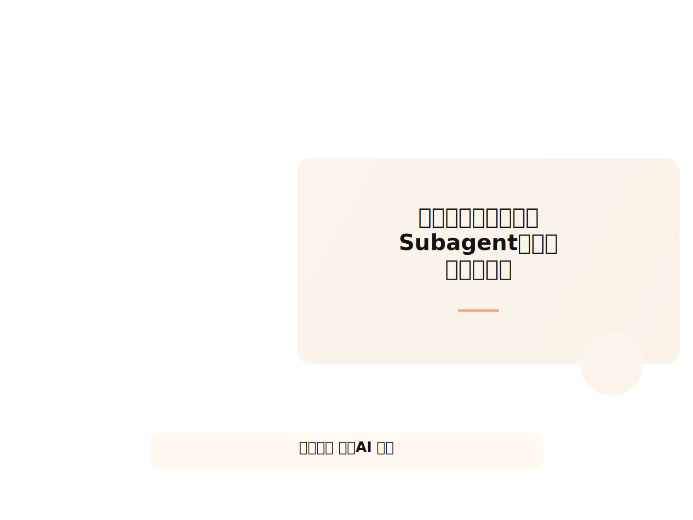
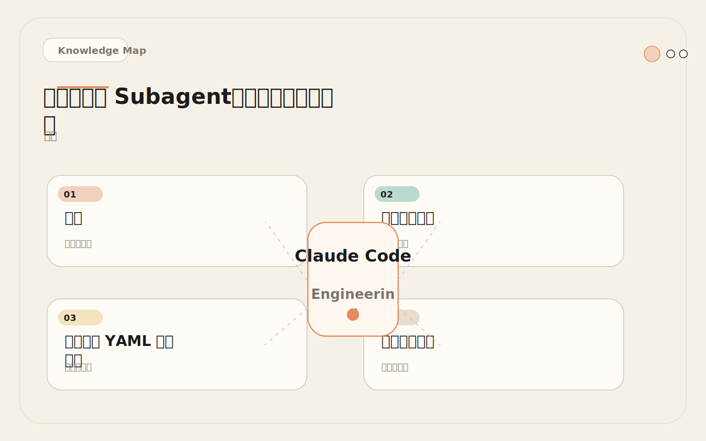
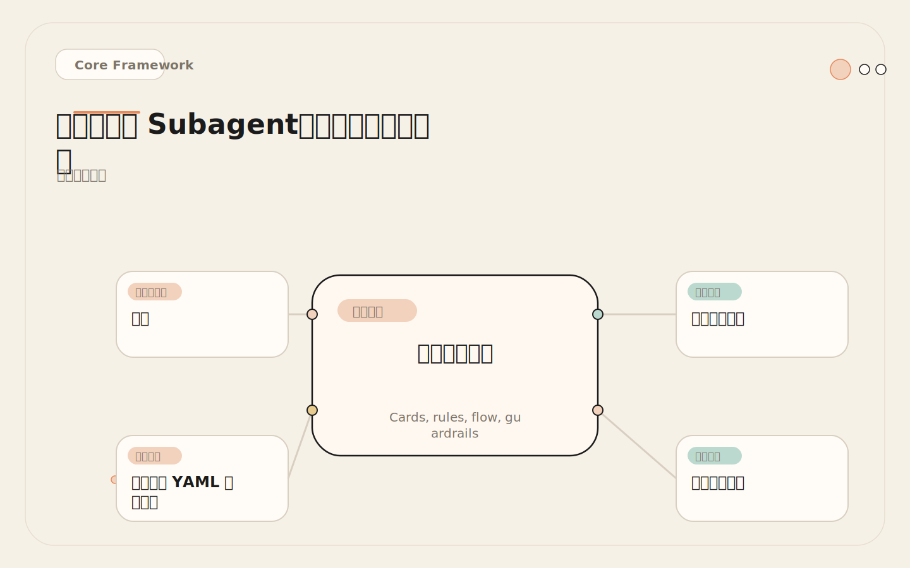
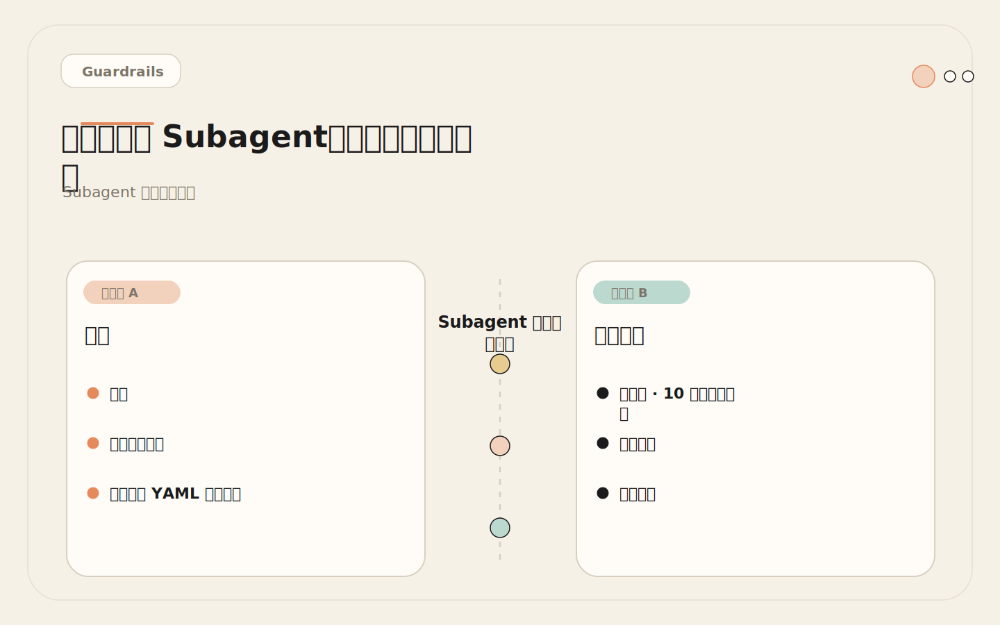
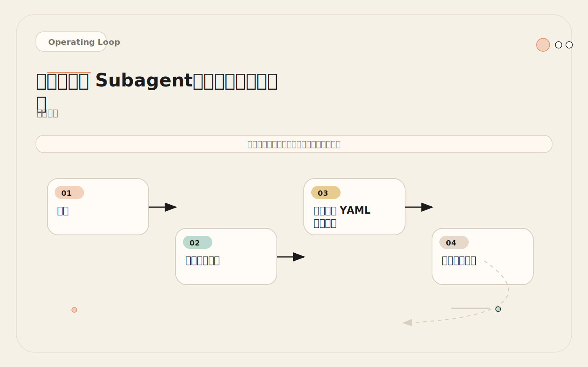

# 三类高价值 Subagent：探索、审查、测试

<!-- codex:cover ../../../assets/claude-code-engineering/13-high-value-subagents-cover.svg -->

<!-- /codex:cover -->

**TL;DR：** 最值得先做的 Subagent 是 explorer、reviewer、test-runner。它们任务边界清楚，能独立工作，结果容易验证。不要一开始就创建十几个角色，先跑稳这三个。

## 问题

团队一开始常创建很多花哨角色：架构师、产品经理、性能专家、文档专家。数量变多后，主会话不知道什么时候该用哪个。描述重叠的代理互相竞争触发，导致结果不稳定。真正高频使用的角色，往往只有那么三四个。

<!-- codex:illustration 13-high-value-subagents/01-overview-knowledge-map.svg -->

<!-- /codex:illustration -->

核心矛盾：角色越多，路由越难。主会话需要先理解每个角色的描述，再判断派谁。描述之间重叠越多，路由越容易误判。与其维护 10 个角色，不如把 3 个核心角色做到极致。

为什么是这三个？因为它们覆盖了工程实践里最频繁的三类活动：理解代码、检查代码、验证代码。其他所有角色——架构师、性能专家、安全审计——本质上都是这三个角色的变体或组合。架构分析是"带着架构关注点的探索"，安全审计是"带着安全检查清单的审查"，性能分析是"带着性能指标的探索"。基础角色做好，扩展只是调整 system prompt 的关注点。

从工程决策角度看，选择这三个起点的理由如下：第一，它们的任务边界天然清晰。探索者的输入是一个问题，输出是一份结构化发现；审查者的输入是一段代码变更，输出是一份按严重度排序的问题清单；测试执行者的输入是测试套件，输出是失败分析和根因定位。每个角色都有明确的"完成条件"，不存在"做到什么程度算完"的模糊地带。第二，它们的工具权限可以严格最小化。探索者和审查者只需要读文件，测试执行者只需要读文件加跑测试。最小权限意味着最小风险。第三，它们的结果格式可以标准化。主会话不需要猜测 subagent 会返回什么格式的结果，因为输出格式写死在 system prompt 里。这大幅降低了结果整合的认知负担。

## 三个核心角色

### Explorer：代码探索者

**职责**：只读探索代码库，回答"相关文件在哪、调用链是什么、已有模式是什么"。不写代码，不改文件，只返回结构化发现。

Explorer 解决的核心痛点是**上下文污染**。主会话在实现前需要理解大量代码：读文件、找依赖、查调用链、看历史模式。如果全在主会话完成，这些探索性阅读会塞满上下文窗口，留给后续实现和推理的空间就少了。把探索隔离到独立上下文里，主会话只接收精炼后的摘要。

完整 SKILL.md 配置：

```markdown
---
name: explorer
description: >
  Explore the codebase to locate files, trace call chains,
  understand patterns, and map dependencies. Use before
  implementation when the scope is unclear or when you need
  to understand existing patterns in unfamiliar code.
tools: Read, Grep, Glob
---

# Explorer Agent

## Role
You are a read-only code investigator. Your job is to answer
questions about the codebase by searching and reading files.
You never modify anything.

## Process
1. Parse the question to identify key entities (function names,
   file patterns, module names, error messages)
2. Use Glob to locate candidate files
3. Use Grep to find references and call chains
4. Use Read to examine specific implementations
5. Synthesize findings into a structured response

## Output Format

### Files Found
| File | Relevance | Key Details |
|------|-----------|-------------|
| path/to/file | why it matters | notable patterns |

### Call Chain
`entry_point` -> `handler` -> `service` -> `repository`

### Patterns Detected
- Pattern A: used in [files], purpose [why]
- Pattern B: used in [files], purpose [why]

### Open Questions
- [Things you couldn't determine from code alone]

## Constraints
- Do NOT suggest code changes
- Do NOT write new code
- If you cannot find something, say so explicitly
- Maximum exploration depth: 3 levels of call chain
- Time budget: if search exceeds 15 file reads, summarize
  what you have and note the gap
```

**关键设计决策**：

1. `tools: Read, Grep, Glob`。三个纯读工具。没有 Edit，没有 Bash，没有 Write。Explorer 不可能意外修改代码。这个选择不是保守——是精确。Explorer 的任务是"找文件、看内容、理解关系"，这三个工具正好覆盖这三件事。多给一个工具都是浪费，也增加风险。
2. "Maximum exploration depth: 3 levels"。防止 Explorer 无限深挖调用链，消耗大量 token。三层调用链足够定位绝大多数问题。更深层的调用关系通常和当前任务无关，或者需要完全不同的分析角度。
3. "Time budget: 15 file reads"。硬性上限，避免 Explorer 陷入无止境的文件探索。实际操作中，15 个文件足以理解大多数模块的结构。如果 15 个文件还不够，说明任务范围太广，应该拆成多个更聚焦的探索任务。
4. "Do NOT suggest code changes"。限制角色行为边界。Explorer 只报告事实，不做建议。建议留给 Reviewer 或主会话。这个限制防止 Explorer 越界——它不应该判断"这个代码应该怎么改"，它的工作是"这个代码是什么结构"。

还有一个容易忽略的设计细节：Explorer 的输出格式里有"Open Questions"部分。这不是装饰。它明确告诉主会话"哪些信息是 Explorer 没能确认的"，避免主会话基于不完整的探索结果做错误决策。

### Reviewer：代码审查者

**职责**：审查当前 diff 或指定文件，重点找 bug、缺测试、安全风险和边界条件。输出结构化发现列表，不直接修复。

Reviewer 解决的核心痛点是**审查质量一致性**。主会话自己做 review 时，关注点会随上下文漂移：有时候关注安全多，有时候关注性能多，有时候忘了检查测试。独立的 Reviewer 带着固定审查维度，每次都覆盖同样的检查项。

完整 SKILL.md 配置：

```markdown
---
name: reviewer
description: >
  Review code changes for correctness, missing tests,
  security risks, boundary conditions, and maintainability.
  Use after implementation or on existing diffs.
  Do NOT use for code exploration or implementation.
tools: Read, Grep, Glob
---

# Reviewer Agent

## Role
You are a strict code reviewer. You find problems and report
them. You never fix anything yourself.

## Review Dimensions
Check EVERY change against ALL dimensions:

### 1. Correctness
- Does the code do what it claims?
- Are there off-by-one errors?
- Are edge cases handled?
- Can null/undefined reach unexpected places?

### 2. Tests
- Are new behaviors covered by tests?
- Do existing tests still make sense?
- Are boundary conditions tested?

### 3. Security
- SQL injection, XSS, command injection?
- Auth bypass or permission escalation?
- Sensitive data exposure in logs/responses?
- Unsafe defaults?

### 4. Maintainability
- Naming clarity and consistency
- Unnecessary coupling
- Dead code or unused imports
- Magic numbers or unexplained constants

## Severity Classification

### Blocker (must fix before merge)
- Security vulnerability
- Logic error causing data loss/corruption
- Missing test for new behavior in critical path
- Breaking API change without migration

### Warning (should fix)
- Missing error handling
- Potential performance regression
- Inconsistent naming
- Insufficient logging

### Suggestion (nice to have)
- Code organization improvement
- Documentation gap
- Minor naming clarity
- Opportunity for abstraction

## Output Format

| Severity | File:Line | Issue | Suggested Fix |
|----------|-----------|-------|---------------|
| blocker  | ...       | ...   | ...           |

**Open Questions**: [Things that need human judgment]
**Verification Gaps**: [What to manually verify after fix]

## Constraints
- Do NOT edit any files
- Do NOT run any commands
- Report findings only, never implement fixes
- If no issues found, say "No issues found" explicitly
- Do not pad the report with trivial findings
```

**关键设计决策**：

1. 审查维度写死在 system prompt 里：correctness、tests、security、maintainability。每次审查都覆盖四项，不会遗漏。这比主会话自己做审查好在哪里？主会话做审查时，审查维度会随上下文漂移。如果当前任务主要是安全相关的，主会话会过度关注安全而忽略测试覆盖。如果任务主要是功能性的，主会话会忽略安全隐患。独立的 Reviewer 不受当前任务上下文的影响，每次都用同样的四个维度审查。
2. 严重度分三级：blocker、warning、suggestion。输出按严重度排序，最重要的发现永远在最前面。这个分级体系直接和团队的工作流对接：blocker 阻塞合并，warning 需要在本迭代处理，suggestion 放到后续迭代。
3. "Do not pad the report with trivial findings"。防止 Reviewer 为了"显得有用"而把命名建议标成 blocker。这是实际发生过的问题：Reviewer 在一段完美代码里找不到问题，但觉得"不能什么都不返回"，于是把一个注释风格的偏好标成 warning。这条约束明确告诉它：没有问题就说没有问题。
4. "If no issues found, say so explicitly"。没有发现就是没有发现，不需要发明问题。这和第 3 条配合使用，确保 Reviewer 的输出可信——每条发现都是真问题，不是充数的。

### Test Runner：测试执行者

**职责**：运行测试、归纳失败原因、定位最小可复现路径。它能执行测试命令，但不修改源代码。

Test Runner 解决的核心痛点是**测试失败分析**。主会话跑测试后，失败日志可能很长。在主会话里逐条分析日志会消耗大量上下文。独立 Test Runner 在自己的上下文里读日志、找模式、定位根因，只返回精炼后的分析结果。

完整 SKILL.md 配置：

```markdown
---
name: test-runner
description: >
  Run tests, analyze failures, and identify minimal
  reproduction paths. Use when tests fail and you need
  root cause analysis. Can execute test commands but
  cannot modify source code.
tools: Read, Grep, Glob, Bash
---

# Test Runner Agent

## Role
You are a test execution and failure analysis specialist.
You run tests, read failure output, and diagnose root causes.

## Process
1. Identify the test command for this project
   (check package.json, Makefile, or pyproject.toml)
2. Run the relevant test suite
3. If failures exist:
   a. Read the failure output
   b. Identify the failing assertion
   c. Read the test file and the source file
   d. Trace the failure to a root cause
   e. Identify the minimal reproduction path
4. Return structured failure analysis

## Allowed Bash Commands
ONLY these patterns are permitted:
- `npm test`, `npx jest`, `npx vitest`
- `pytest`, `python -m pytest`
- `make test`, `cargo test`, `go test`
- `bundle exec rspec`
- Test-specific flags like `--filter`, `-k`, `--runInBand`

Commands NOT allowed:
- Any command that modifies source files
- `rm`, `mv`, `cp` on source files
- `git commit`, `git push`, `git reset`
- `npm publish`, `docker push`, `deploy`

## Output Format

### Test Summary
- Total: X tests
- Passed: Y
- Failed: Z
- Skipped: W

### Failure Analysis

#### Failure 1: [test name]
- **File**: path/to/test.js:L42
- **Assertion**: `expect(result).toBe(expected)`
- **Actual vs Expected**: got X, expected Y
- **Root Cause**: [one-line diagnosis]
- **Min Reproduction**: [steps to reproduce in isolation]

#### Failure 2: ...

### Common Patterns
[If multiple failures share a root cause, note it here]

## Constraints
- Do NOT modify any source file
- Do NOT modify test files (only read them)
- Do NOT commit or push anything
- If you cannot determine root cause, state what you
  found and what additional information is needed
- Maximum: run test suite 3 times to isolate flaky tests
```

**关键设计决策**：

1. `tools: Read, Grep, Glob, Bash`。比 Explorer 和 Reviewer 多了 Bash，因为 Test Runner 需要执行测试命令。这是三类角色里唯一拥有执行权限的，也是权限配置最需要小心的。Bash 可以做任何命令行操作，包括删除文件、修改配置、推送代码——这些都不是 Test Runner 应该做的事。权限范围的控制主要靠 system prompt 里的命令白名单。
2. Bash 命令白名单明确列出允许的测试框架命令。虽然 tools 字段只声明 `Bash`，但 system prompt 里限定了具体命令模式。这不是硬性约束（硬性约束需要 PreToolUse hook），但大幅降低了误操作概率。白名单覆盖了主流测试框架：JavaScript 的 Jest 和 Vitest、Python 的 pytest、Go 的 go test、Rust 的 cargo test、Ruby 的 RSpec。如果团队用的测试框架不在列表里，需要手动添加。
3. "Maximum: run test suite 3 times"。防止 Test Runner 陷入无限重试循环。有些测试套件有很多 flaky test，Test Runner 可能会反复运行试图获得"稳定结果"。三次上限确保它不会无休止地消耗 token。
4. "Common Patterns"。多测试失败共享同一根因时，归纳出来避免主会话逐条处理。这个设计非常重要。如果 20 个测试失败，但根因都是同一个函数的空指针异常，Test Runner 应该归纳为一条，而不是列出 20 条独立的失败分析。

## 各角色的 YAML 配置详解

三个核心角色的 SKILL.md 上面已经给出了完整的 system prompt。这里补充每个角色的 frontmatter YAML 字段的设计细节。

### Explorer 的 YAML 字段解析

```yaml
---
name: explorer                    # 必须唯一，主会话路由依赖此字段
description: >                    # 路由匹配的核心依据，写不好就会误触发
  Explore the codebase to locate files, trace call chains,
  understand patterns, and map dependencies. Use before
  implementation when the scope is unclear or when you need
  to understand existing patterns in unfamiliar code.
tools: Read, Grep, Glob           # 纯读，无任何写能力
---

# description 的写法决定路由质量
# 好的写法：动词开头，说明具体能力，给出使用时机
#   "Explore the codebase to locate files..."
# 差的写法：模糊、宽泛、和其他角色重叠
#   "Help understand the code"（和 architect 重叠）
#   "Analyze code structure"（和 reviewer 重叠）
```

关键点：`description` 字段是路由匹配的核心依据。主会话根据用户请求和 description 的语义相似度来决定派哪个 subagent。如果 description 写得模糊（比如"帮助理解代码"），主会话会在 Explorer 和 Architect 之间犹豫。如果 description 写得具体（比如"查找文件、追踪调用链、理解模式"），路由准确率显著提升。

### Reviewer 的 YAML 字段解析

```yaml
---
name: reviewer
description: >
  Review code changes for correctness, missing tests,
  security risks, boundary conditions, and maintainability.
  Use after implementation or on existing diffs.
  Do NOT use for code exploration or implementation.
tools: Read, Grep, Glob
---

# 注意最后一句 "Do NOT use for code exploration or implementation"
# 这是反向约束——明确告诉主会话"什么情况不该用这个角色"
# 反向约束能有效减少误触发，特别是和 Explorer 的描述重叠时
```

### Test Runner 的 YAML 字段解析

```yaml
---
name: test-runner
description: >
  Run tests, analyze failures, and identify minimal
  reproduction paths. Use when tests fail and you need
  root cause analysis. Can execute test commands but
  cannot modify source code.
tools: Read, Grep, Glob, Bash
---

# Bash 权限的存在使得 Test Runner 的风险等级高于其他两个角色
# 如果团队的安全要求高，可以额外配置 PreToolUse hook 做硬性命令限制
# 详见 14 - 工具权限控制
```

## 任务路由策略

主会话收到任务后，按以下逻辑决定是否派发 subagent：

<!-- codex:illustration 13-high-value-subagents/02-framework-core-structure.svg -->

<!-- /codex:illustration -->

```text
收到任务
  |
  ├─ 任务需要读大量文件但不需要写？
  |    → 派 Explorer
  |
  ├─ 任务是审查已有代码/diff？
  |    → 派 Reviewer
  |
  ├─ 任务涉及测试执行和失败分析？
  |    → 派 Test Runner
  |
  ├─ 任务需要实现代码修改？
  |    → 主会话自己做（实现需要完整上下文）
  |
  ├─ 任务模糊，不确定范围？
  |    → 先派 Explorer 摸底，再决定
  |
  └─ 任务很小（≤ 3 个文件，路径已知）？
       → 主会话直接做，不需要 subagent
```

### 路由失败诊断

当主会话的路由判断出错时，通常有三种模式：

```text
模式 1：误触发 Explorer
  症状：用户说"改一下这个按钮的颜色"，主会话派了 Explorer 去找文件
  根因：任务描述里没有明确说"改动范围已知"
  修复：在主会话的 system prompt 里加规则：
    "当用户明确指定了文件路径时，不需要派 Explorer"

模式 2：角色间竞争
  症状：用户说"review 一下认证模块的安全性"，主会话不确定该派 Reviewer
        还是 Security Auditor（如果有的话）
  根因：两个角色的 description 有重叠区域
  修复：合并角色，或在 description 里用反向约束排除重叠

模式 3：过度派发
  症状：每个任务都先派 Explorer，不管任务多简单
  根因：主会话的 routing 规则没有"最小任务阈值"
  修复：加规则："预估涉及 ≤ 3 个文件的任务，不派 subagent"
```

### 决策矩阵

| 任务特征 | Explorer | Reviewer | Test Runner | 主会话 |
|----------|:--------:|:--------:|:-----------:|:------:|
| 需要理解代码结构 | ✓ | | | |
| 需要找调用链/依赖 | ✓ | | | |
| 需要审查 diff 质量 | | ✓ | | |
| 需要安全检查 | | ✓ | | |
| 需要跑测试 | | | ✓ | |
| 需要分析测试失败 | | | ✓ | |
| 需要写代码 | | | | ✓ |
| 需要连续编辑文件 | | | | ✓ |
| 需要看浏览器效果 | | | | ✓ |
| 需要和人交互决策 | | | | ✓ |

**使用频率参考**（基于多个团队的实际数据）：

| 角色 | 典型使用频率 | 占 subagent 调用比例 |
|------|-------------|---------------------|
| Explorer | 每个不熟悉的任务开始前 | ~40% |
| Reviewer | 每次实现完成后 | ~35% |
| Test Runner | 测试失败时 | ~25% |

## 角色组合模式

三个角色不是孤立的。实际工作中常见组合模式：

### 模式 1：Explorer -> 主会话 -> Reviewer -> Test Runner

```text
1. Explorer 摸清代码结构，返回相关文件清单
2. 主会话基于探索结果实现修改
3. Reviewer 审查实现 diff
4. Test Runner 跑测试确认没有破坏
```

这是最完整的流程，适合中等规模的需求变更。典型耗时：Explorer 2-3 分钟，主会话实现 5-10 分钟，Reviewer 2-3 分钟，Test Runner 1-2 分钟。总计 10-18 分钟。如果串行在主会话完成，探索阶段就需要 5-8 分钟（因为要读大量文件），加上实现、审查和测试，总计可能 20-30 分钟。角色组合的效率提升主要来自探索和审查阶段的上下文隔离——主会话不需要保留探索细节，可以把空间留给实现和推理。

### 模式 2：Explorer -> 主会话 -> Test Runner

```text
1. Explorer 查找相关文件和模式
2. 主会话实现
3. Test Runner 跑测试验证
```

省略 Reviewer，适合低风险修改（bug fix、小调整）。

### 模式 3：Reviewer -> 主会话

```text
1. Reviewer 审查已有代码或即将合并的 diff
2. 主会话根据发现修复问题
```

适合 code review 场景，不需要先探索。

### 模式 4：Explorer + Explorer（并行）

```text
1. Explorer A 查业务逻辑层
2. Explorer B 查数据访问层
3. 主会话合并两份探索结果
```

适合大型跨模块任务。详见 [15 - 并行探索](15-parallel-exploration.md)。

### 模式 5：Explorer -> 主会话 -> Reviewer -> 主会话 -> Test Runner -> 主会话

```text
1. Explorer 摸清代码结构和影响范围
2. 主会话基于探索结果实现第一轮修改
3. Reviewer 审查 diff，发现问题
4. 主会话根据 Reviewer 反馈修复问题
5. Test Runner 跑测试验证
6. 主会话检查测试结果，如有失败则修复
```

这是"完整循环"模式，适合高风险修改。两个主会话环节让它比模式 1 多一轮"修复 → 验证"循环。典型场景：修改核心模块的公共接口、调整数据库 schema、重构关键业务流程。额外的时间成本约 5-8 分钟，但安全性显著提升——Reviewer 发现的问题在 Test Runner 之前就被修复了，避免了"带着已知问题跑测试"的浪费。

### 角色组合的选择决策树

```text
任务来了，需要决定用什么组合模式：

  任务规模？
    ├─ 小（≤ 3 个文件，改动明确）
    │    └─ 不需要组合，主会话直接做
    │
    ├─ 中（3-10 个文件，需要理解上下文）
    │    ├─ 高风险（安全相关、核心模块）？
    │    │    └─ 模式 5：完整循环
    │    └─ 正常风险？
    │         └─ 模式 1：Explorer → 主会话 → Reviewer → Test Runner
    │
    └─ 大（> 10 个文件，跨模块）
         ├─ 方向之间独立？
         │    └─ 模式 4：并行 Explorer + 模式 1
         └─ 方向之间有依赖？
              └─ 模式 1：串行完成（并行在这里会增加整合成本）
```

## Subagent 配置性能对比

不同 subagent 配置方案在实际项目中的表现对比：

<!-- codex:illustration 13-high-value-subagents/04-compare-guardrails.svg -->

<!-- /codex:illustration -->

```text
场景：中等规模需求变更（涉及 8 个文件，需要理解上下文 + 实现 + 审查 + 测试）

方案 A：无 subagent（全部主会话）
  探索：读 12 个文件，~4,000 tokens，耗时 6 分钟
  实现：在膨胀的上下文里推理，~5,000 tokens，耗时 8 分钟
  审查：自己做 review，关注点漂移，~2,000 tokens
  测试：跑测试 + 分析失败，~2,000 tokens，耗时 3 分钟
  ─────────────────────────────
  总 token：~13,000
  挂钟时间：~19 分钟
  主会话上下文压力：高（13,000 tokens 全在一个上下文里）
  审查质量：不稳定（受当前任务上下文影响）

方案 B：Explorer + 主会话 + Reviewer + Test Runner（模式 1）
  Explorer：~3,500 tokens，耗时 3 分钟
  主会话实现：~5,000 tokens，耗时 6 分钟（上下文干净，推理质量高）
  Reviewer：~2,500 tokens，耗时 2 分钟
  Test Runner：~2,000 tokens，耗时 2 分钟
  主会话汇总：~1,500 tokens
  ─────────────────────────────
  总 token：~14,500（比方案 A 多 ~12%）
  挂钟时间：~13 分钟（比方案 A 快 ~32%）
  主会话上下文压力：低（只保留 ~6,500 tokens 的实现和汇总）
  审查质量：稳定（独立角色，固定审查维度）

方案 C：10 个角色的方案
  路由判断：额外 ~1,000 tokens（在 10 个角色里选谁）
  误触发浪费：~800 tokens/次（平均每次误触发浪费）
  实际有效工作：和方案 B 一样
  ─────────────────────────────
  总 token：~16,300（比方案 B 多 ~12%）
  挂钟时间：~15 分钟（路由判断和误触发增加了延迟）
  维护成本：10 份 SKILL.md
```

对比结论：

| 指标 | 无 Subagent | 3 角色方案 | 10 角色方案 |
|------|:-----------:|:----------:|:-----------:|
| 总 token | ~13,000 | ~14,500 | ~16,300 |
| 挂钟时间 | ~19 分钟 | ~13 分钟 | ~15 分钟 |
| 上下文压力 | 高 | 低 | 低 |
| 审查质量 | 不稳定 | 稳定 | 稳定（但路由不稳定） |
| 维护成本 | 0 | 3 份配置 | 10 份配置 |
| 路由误判率 | N/A | ~5% | ~23% |

核心洞察：3 角色方案是性价比最高的配置。和无 subagent 方案相比，它只多了 ~12% 的 token 开销，但换来了 ~32% 的挂钟时间缩短和更稳定的审查质量。和 10 角色方案相比，它用更少的 token 和更低的维护成本，达到了同样的上下文隔离效果。

## 反模式：10 个角色的灾难

### 经过

某团队根据网上教程，一口气创建了 10 个 subagent：architect、explorer、reviewer、tester、security-auditor、performance-analyst、doc-writer、refactorer、implementer、coordinator。

两周后统计数据：

```text
explorer:       被调用 47 次
reviewer:       被调用 31 次
tester:         被调用 18 次
architect:      被调用 5 次（其中 3 次是误触发）
security-auditor: 被调用 3 次（都是用户手动指定）
performance-analyst: 被调用 1 次
doc-writer:     被调用 0 次
refactorer:     被调用 0 次
implementer:    被调用 0 次（主会话自己做更快）
coordinator:    被调用 0 次（角色本身定义模糊）

问题：
- architect 和 explorer 描述重叠，主会话经常不知道派谁
- implementer 从未被触发，因为实现需要主会话的完整上下文
- coordinator 没有明确职责，定义里写的是"协调其他代理"——这是主会话的活
- doc-writer 从未被触发，因为用户很少想到"让代理写文档"
- 10 个角色的描述每次都要加载进路由判断，增加了延迟
```

### 根因

**角色膨胀**。团队没有从实际需求出发，而是从"可能有用"出发。创建了理论上完整但实践中用不到的角色体系。

具体问题：

1. **描述重叠**。architect 的描述是"理解系统架构和设计模式"，explorer 的描述是"探索代码库找到相关文件"。两者的触发场景几乎一样。主会话在判断"该派谁"时频繁误判。
2. **角色没有明确边界**。coordinator 的定义是"协调多个代理的工作"。但协调本身就是主会话的职责。一个不能自主决策的"协调者"角色没有存在的意义。
3. **忽略使用频率**。doc-writer、refactorer 这些低频需求，用主会话或一个通用 skill 就能解决，不需要专门的 subagent。

### 修复

**合并为 3 个核心角色**。

```text
保留：
  explorer（覆盖 architect、performance-analyst 的探索功能）
  reviewer（覆盖 security-auditor 的审查功能）
  test-runner（覆盖 tester 的测试功能）

删除：
  architect → explorer 的 system prompt 加一句"也关注架构模式"
  security-auditor → reviewer 的审查维度已有 security
  performance-analyst → 探索阶段让 explorer 关注性能模式
  implementer → 主会话自己做
  doc-writer → 不需要独立角色，用 /doc 命令即可
  refactorer → 不需要独立角色，用主会话 + explorer 结果
  coordinator → 不需要，主会话就是协调者

合并后效果：
  - 路由判断从 10 选 1 变成 3 选 1，误判率从 23% 降到 5%
  - 角色描述不再重叠，触发准确率提升
  - 维护成本从 10 份 SKILL.md 降到 3 份
```

### 教训

这个案例的核心教训是：**角色体系应该从使用数据长出来，而不是从理论设计推出来**。团队一开始做的不是"看看我们实际需要什么角色"，而是"网上说应该有这些角色"。结果是理论上完整的角色体系在实践中大部分闲置。

正确的做法是反过来：先用主会话工作两周，记录哪些任务反复出现、哪些任务的上下文污染最严重、哪些任务的质量最不稳定。从这些数据里提炼出真正需要的角色。Explorer、Reviewer、Test Runner 这三个角色不是凭空设计的——它们对应的是工程实践中最频繁的三类痛点：理解困难、审查不一致、测试分析耗时。

## 扩展策略

3 个核心角色跑稳后，如果有明确的高频需求，可以扩展。扩展的前提是：

<!-- codex:illustration 13-high-value-subagents/03-flow-operating-loop.svg -->

<!-- /codex:illustration -->

1. **新角色的职责与现有 3 个角色不重叠**。
2. **新角色的使用频率预期 ≥ 每周 2 次**。
3. **新角色的输出格式和成功标准可以明确定义**。

常见的合理扩展角色：

| 角色 | 触发场景 | 与核心角色的区别 |
|------|---------|-----------------|
| Security Auditor | 安全专项审查 | 比 Reviewer 更深的安全分析， OWASP 检查清单 |
| Dependency Analyst | 依赖升级/审计 | 专门查依赖树、许可证、已知漏洞 |
| Migration Planner | 大规模迁移 | 专门做影响分析和迁移路径规划 |

不要扩展的角色：

| 角色 | 不该独立的原因 |
|------|---------------|
| Architect | 和 Explorer 职责重叠，在 Explorer 的 prompt 里加架构关注点即可 |
| Implementer | 实现需要主会话的完整上下文，独立代理做不好 |
| Coordinator | 协调是主会话的活，不是独立的 subagent |
| Doc Writer | 低频需求，用主会话或 `/doc` 命令即可 |

## 交叉参考

- [12 - Subagents 心智模型](12-subagents-mental-model.md)：Subagent 的三个核心特征（独立上下文、专门角色、工具权限限制）
- [14 - 工具权限](14-subagent-tool-permissions.md)：每个角色的工具权限配置和权限升级策略
- [15 - 并行探索](15-parallel-exploration.md)：多个 Explorer 并行工作的架构和冲突解决
- [16 - 不该用 Subagent 的场景](16-when-not-to-use-subagents.md)：实现、UI、连续编辑等留在主会话的场景
- [07 - Slash Commands](07-slash-commands.md)：低频任务用 Command 而不是 Subagent


