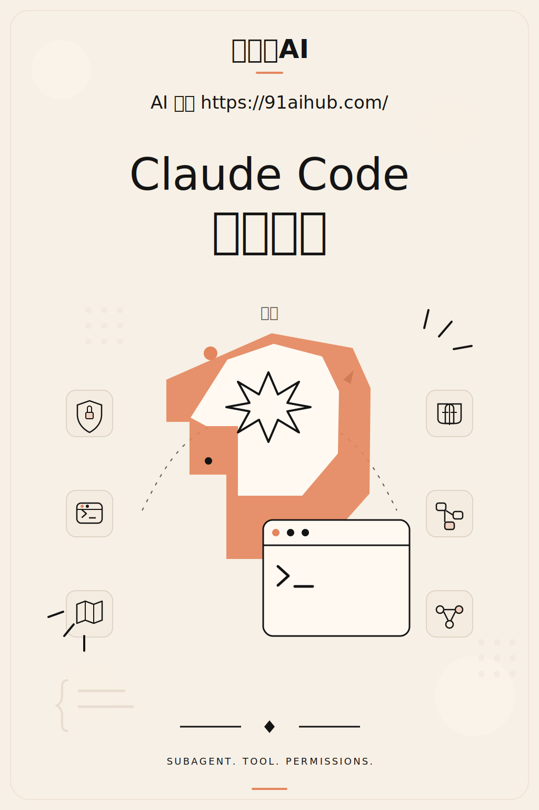
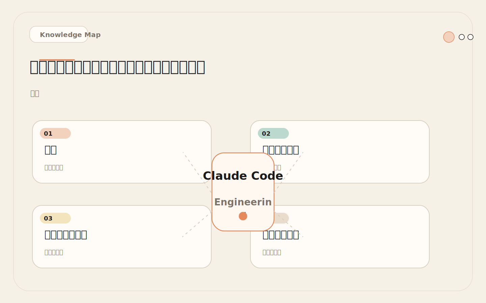
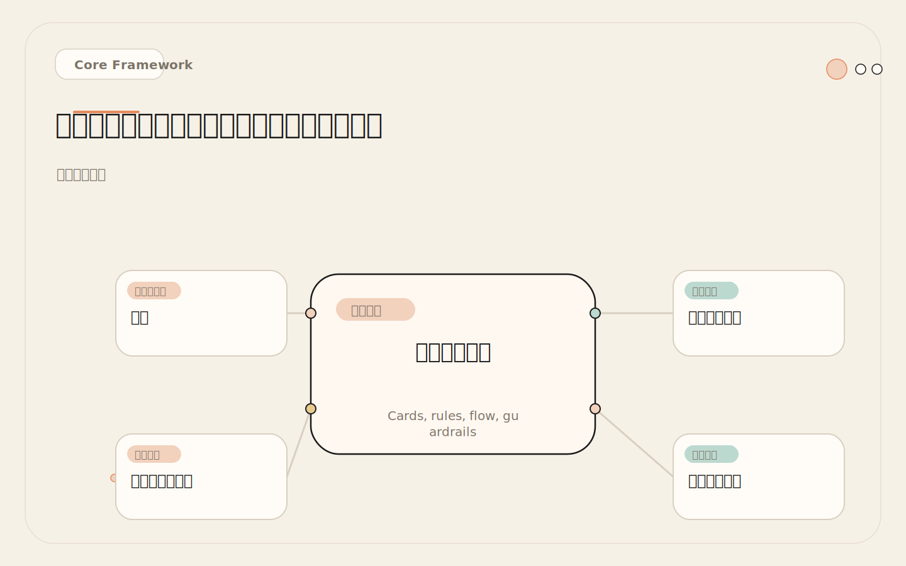
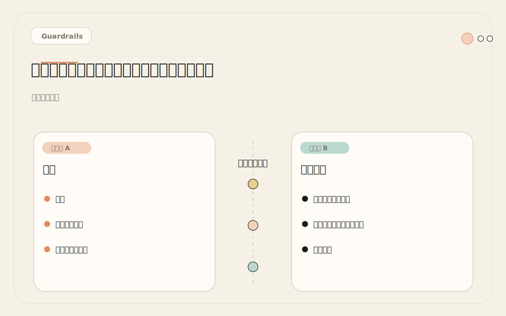
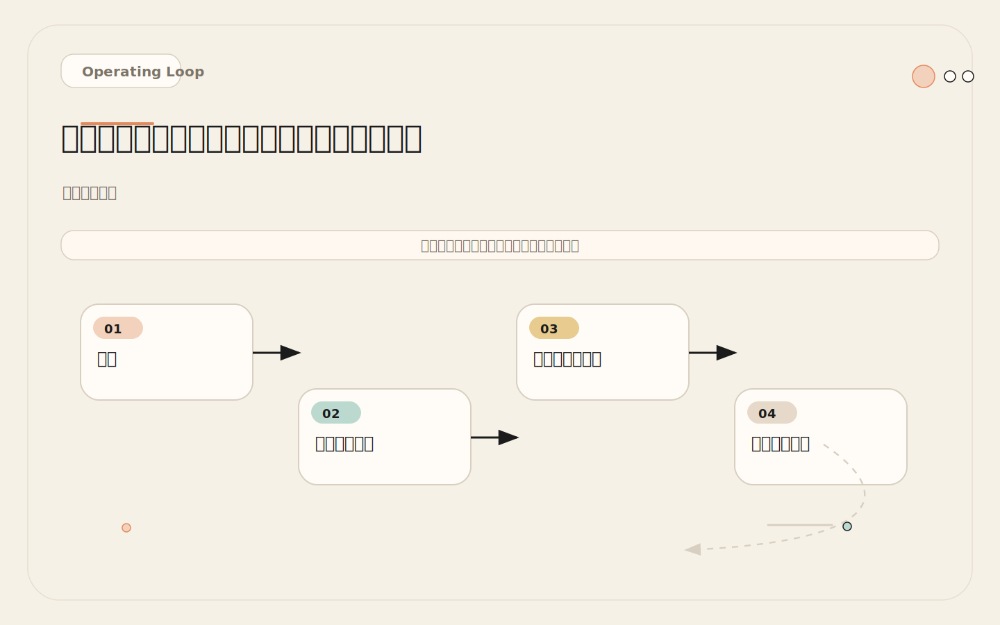

# 工具权限：为什么「只读审计」代理绝不能拿到写权限

<!-- codex:cover ../../../assets/claude-code-engineering/14-subagent-tool-permissions-cover.svg -->

<!-- /codex:cover -->

**TL;DR：** Subagent 的工具权限应该按任务最小化。审计、研究、测试诊断通常不需要写文件权限。权限升级应该基于失败证据，而不是预期需求。

## 问题

如果所有 subagent 都继承主会话全部工具，隔离上下文的收益会被权限风险抵消。一个只负责审查的代理不应该能改代码，一个只负责研究的代理不应该能运行部署脚本。

<!-- codex:illustration 14-subagent-tool-permissions/01-overview-knowledge-map.svg -->

<!-- /codex:illustration -->

这不是理论风险。实际发生过：Reviewer 代理在审查代码时发现了一个命名问题，因为拥有 Edit 权限，它直接改了文件名——但没有更新对应的 import 语句。结果整个模块编译失败。审查者变成了破坏者。

权限架构的核心原则：**最小权限**。每个 subagent 只拥有完成任务所需的最低工具集。理由不是"信任问题"，而是"认知边界"——subagent 的 system prompt 定义了它的角色认知，但工具权限是硬约束。角色认知可以被模糊的提示词绕过，工具限制不能。

为什么这个原则如此重要？因为 subagent 的行为由两层约束控制：第一层是 system prompt 里的角色定义和行为约束，这属于"软约束"——提示词告诉它"不要修改文件"，但提示词是可以被忽略或误解的。第二层是 tools 字段的工具限制，这属于"硬约束"——如果一个代理没有 Edit 工具，它物理上无法修改文件，无论提示词怎么写、无论任务多么紧急。当两层约束一致时（角色定义说"不修改"，工具限制也确实不能修改），代理的行为最可预测。当两层约束矛盾时（角色定义说"不修改"，但工具列表里有 Edit），代理的行为就不可预测了——它可能在大多数时候遵守角色定义不修改文件，但在某些边界情况下"顺手修了"。

从工程风险管理的角度看，最小权限原则的价值不在于防止恶意行为（subagent 本身没有恶意），而在于防止**认知错位**。一个审查角色的 system prompt 告诉它"只报告问题"，但它的工具列表里有 Edit。当它发现一个"很明显"的拼写错误时，它可能认为"修复这个比报告这个更有帮助"。这个判断在它的角色认知里是合理的——但和团队对"审查者"这个角色的预期不一致。工具限制消除了这种认知错位的可能性。

## 工具权限架构

### tools 字段的工作机制

<!-- codex:illustration 14-subagent-tool-permissions/02-framework-core-structure.svg -->

<!-- /codex:illustration -->

Subagent 的 SKILL.md frontmatter 里有一个 `tools` 字段：

```yaml
---
name: reviewer
description: Reviews code for issues
tools: Read, Grep, Glob
---
```

`tools` 字段的含义：**这个 subagent 只能使用列出的工具**。未列出的工具对它不可用。

```text
tools: Read, Grep, Glob
  → 可以：读取文件、搜索内容、查找文件路径
  → 不可以：编辑文件、写入新文件、执行 Bash 命令、调用 MCP 工具

tools: Read, Grep, Glob, Bash
  → 可以：上述所有 + 执行命令行命令
  → 不可以：编辑文件、写入新文件

tools: Edit, Write, Bash, Read, Grep, Glob
  → 可以：读写文件、执行命令——接近主会话的完整能力
  → 注意：这应该只用于需要修改文件的实现类代理
```

### 权限层级

按能力递增排列，形成清晰的层级：

```text
层级 0 — 无工具（纯推理代理）
  tools: (空或省略)

  能力：只能基于任务描述中的信息进行推理
  不能：访问文件系统、执行命令、修改任何内容

  适用场景：纯逻辑推理、方案设计、文档分析（输入已在任务描述中）
  典型角色：Strategy Planner、Decision Analyst
  实际用例：主会话已经把所有信息放在任务描述里，代理只需要基于
            这些信息给出建议，不需要自己去找额外信息

层级 1 — 纯读（Explorer、Reviewer、Security Auditor）
  tools: Read, Grep, Glob

  能力：查找文件、搜索内容、读取文件
  不能：修改任何内容

  适用场景：所有"只看不动"的任务

层级 2 — 读 + 受限执行（Test Runner）
  tools: Read, Grep, Glob, Bash

  能力：层级 1 + 运行命令行命令
  不能：修改源代码文件

  适用场景：需要执行命令但不改代码的任务
  风险点：Bash 权限过大，需要 system prompt 限定命令范围

层级 3 — 读 + 执行 + 受限写（Scoped Implementer）
  tools: Edit, Write, Bash, Read, Grep, Glob

  能力：接近完整
  不能：超出限定目录的写操作

  适用场景：需要修改文件但限定范围的任务
  风险点：Edit/Write 权限需要目录限制

层级 4 — 全工具（通常不推荐给 subagent）
  tools: 所有可用工具

  能力：和主会话相同
  适用场景：极端情况，几乎不存在需要给 subagent 全工具的场景
  风险等级：最高，等同于让 subagent 拥有主会话的全部能力
```

### 权限层级的选择决策

```text
选择权限层级：
  任务是否需要修改文件？
    ├─ 否 → 任务是否需要执行命令？
    |         ├─ 否 → 任务是否需要读取文件？
    |         |         ├─ 否 → 层级 0（纯推理）
    |         |         └─ 是 → 层级 1（纯读）
    |         └─ 是 → 层级 2（读 + 执行）
    └─ 是 → 修改范围是否可以预先界定？
              ├─ 是 → 层级 3（受限读写）
              └─ 否 → 不应该用 subagent，留在主会话
```

## 各角色权限配置

### Explorer：纯读

```yaml
---
name: explorer
description: >
  Explore the codebase to locate files, trace call chains,
  understand patterns, and map dependencies.
tools: Read, Grep, Glob
---
```

**权限理由**：Explorer 的任务是"找到并理解代码"。它需要 Glob 定位文件、Grep 搜索内容、Read 读取文件。三个工具刚好覆盖"查找、搜索、阅读"。不需要 Edit（不改代码）、不需要 Write（不创建文件）、不需要 Bash（不执行命令）。

**如果 Explorer 请求 Bash 会怎样**：通常是因为需要运行 `git log` 或 `git diff` 来查历史。解决方法是在 system prompt 里告诉它"只使用文件内容，不依赖 git 命令"。如果团队确实需要 git 历史查询，可以创建一个专门的 `git-explorer` 角色，而不是给所有 Explorer 加 Bash。

### Reviewer：纯读

```yaml
---
name: reviewer
description: >
  Review code changes for correctness, tests, security,
  and maintainability.
tools: Read, Grep, Glob
---
```

**权限理由**：Reviewer 的任务是"发现问题并报告"。它需要读取代码来审查。不需要 Edit——审查者不应该直接修复问题。不需要 Bash——审查不需要执行命令。

**为什么 Reviewer 不需要 Edit**：这是一个关键决策。审查和修复是两个不同的职责。审查者发现问题，修复者解决问题。如果审查者同时拥有修复能力，会出现以下问题：

1. 审查者自行修复问题，跳过了主会话的判断环节
2. 修复引入新问题，但没有经过第二轮审查
3. 审查者对"什么是问题"的判断可能和团队标准不一致，直接修复了不该修的东西
4. 主会话失去了对 diff 的完全控制

### Test Runner：读 + 受限执行

```yaml
---
name: test-runner
description: >
  Run tests, analyze failures, and identify minimal
  reproduction paths.
tools: Read, Grep, Glob, Bash
---
```

**权限理由**：Test Runner 需要执行测试命令，所以必须有 Bash。需要读取测试文件和源文件来分析失败原因，所以需要 Read、Grep、Glob。不需要 Edit——它只分析失败原因，不修改测试或源代码。

**Bash 的风险控制**：Bash 是权限最大的工具。`tools` 字段只声明 `Bash`，不能限定 Bash 具体能运行什么命令。控制范围靠两层：

1. **system prompt 约束**（软约束）：在 prompt 里明确列出允许的命令模式。Test Runner 的 prompt 里写明"ONLY these patterns are permitted: `npm test`, `pytest`, `make test`..."。这是提示词层面的约束，不是硬性限制，但在实际使用中效果足够好。为什么软约束够用？因为 Test Runner 的角色定义很清晰——它是"测试执行者"，它的大部分行为会集中在运行测试上。跑非测试命令不符合它的角色认知，即使工具能力上允许。
2. **PreToolUse hook**（硬约束）：如果团队对安全性要求高，可以在 `.claude/settings.json` 里配置 PreToolUse hook，拦截 Test Runner 的非测试命令。硬约束不依赖角色认知，直接在工具调用层面拦截。代价是配置更复杂，需要为每个 subagent 维护一份允许的命令正则。

两种约束的选择取决于团队的风险容忍度。大多数团队用软约束就够了——Test Runner 很少会跑 `rm -rf`，因为它的整个角色定义都指向"运行测试"。但如果团队处理敏感数据或生产环境配置，硬约束是更稳妥的选择。

### Implementer：受限读写

```yaml
---
name: implementer
description: >
  Implement specific, well-scoped code changes within
  defined boundaries. Requires clear task description
  and file scope.
tools: Edit, Write, Bash, Read, Grep, Glob
---
```

**权限理由**：Implementer 需要修改代码，所以需要 Edit 和 Write。可能需要运行命令来验证修改，所以需要 Bash。需要读取现有代码，所以需要 Read、Grep、Glob。

**风险控制**：Implementer 拥有最大的权限，需要最严格的约束：

```markdown
## Constraints
- Only modify files within the specified scope
- Do NOT modify files outside these directories: [scope]
- Run lint/typecheck after changes
- Do NOT commit changes
- Do NOT push to remote
- Do NOT modify configuration files (.env, settings, CI configs)
```

注意：`tools` 字段不能限定目录范围。目录限制只能通过 system prompt 约束。如果团队需要硬性目录限制，必须使用 PreToolUse hook。

### Security Auditor：纯读

```yaml
---
name: security-auditor
description: >
  Audit code for security vulnerabilities following
  OWASP guidelines and team security standards.
tools: Read, Grep, Glob
---
```

**权限理由**：和 Reviewer 相同。Security Auditor 是 Reviewer 的深化版本，专注于安全维度。它只需要读取和分析代码，不需要修改任何东西。

**为什么 Security Auditor 不需要 Bash**：有时候团队希望 Security Auditor 能运行安全扫描工具（如 `npm audit`、`snyk test`）。这个需求合理，但建议用不同的方式实现：

1. 主会话运行安全扫描工具
2. 将扫描结果作为输入传给 Security Auditor
3. Security Auditor 在纯读模式下分析结果

这样避免了给安全审计代理执行权限。扫描工具的输出可能很长，但 Security Auditor 的独立上下文恰好能承载这种大输出。

## 权限升级矩阵

最小权限是起点，不是终点。遇到以下情况时，应该考虑权限升级：

<!-- codex:illustration 14-subagent-tool-permissions/04-compare-guardrails.svg -->

<!-- /codex:illustration -->

```text
当前权限      失败证据                          升级到
─────────────────────────────────────────────────────────
Read/Grep/Glob  Explorer 报告"无法查看 git 历史"    +Bash（限定 git 命令）
Read/Grep/Glob  Reviewer 报告"无法验证类型检查"      +Bash（限定 typecheck）
Read/Grep/Glob/Bash  Test Runner 无法运行特定测试    检查 system prompt 约束
                      （先检查 prompt 是否过度限制）
Read/Grep/Glob  Reviewer 反复要求修复权限            不要升级——创建 Fixer 角色
```

**权限升级的三个前提**：

1. **有失败证据**。不是"可能需要"，而是"实际遇到了任务失败"。
2. **升级是唯一的解决方案**。不是"更方便"，而是"不升级就完成不了任务"。
3. **升级后的权限仍然在角色职责范围内**。Test Runner 加 Bash 合理（需要跑测试），加 Edit 不合理（不该改代码）。

**不应该升级的情况**：

```text
错误升级信号：
  × "万一需要呢" → 等真的需要再说
  × "加个权限更方便" → 方便不是理由，安全才是
  × "主会话能做，subagent 也应该能做" → subagent 不是主会话
  × "之前遇到过一次" → 一次不是模式，三次才是

正确升级信号：
  ✓ 连续 3 次任务因为权限不足而失败
  ✓ 失败原因明确指向缺少特定工具
  ✓ 升级后的权限仍然符合角色职责
  ✓ 团队讨论过风险并接受
```

权限升级的节奏很重要。太快升级会破坏最小权限原则，太慢升级会阻碍工作效率。推荐的节奏是"观察两周再决定"。当某个 subagent 因为权限不足而失败时，先记录下来，不急着升级。如果两周内同一个权限缺失导致了 3 次以上的任务失败，再考虑升级。这个节奏确保升级是基于实际需求，而不是偶发事件。

还有一个实际的考量：权限升级后很难再降回来。一旦 Test Runner 习惯了拥有 Bash 权限，团队的依赖模式就会围绕"Test Runner 可以跑命令"建立。如果后来发现某个安全风险需要收回 Bash 权限，已经依赖这个权限的工作流就会中断。所以每次升级都要当作"不可逆决策"来对待——谨慎评估，确保值得。

## 权限降级策略

权限只增不减是常见的反模式。定期审查权限配置：

<!-- codex:illustration 14-subagent-tool-permissions/03-flow-operating-loop.svg -->

<!-- /codex:illustration -->

```text
审查周期：每月一次
审查内容：
  1. 每个 subagent 的 tools 字段是否和实际使用匹配
  2. 是否有 subagent 实际上从没用到某个工具
  3. 是否有权限是"临时加的"但忘记收回

降级信号：
  - Test Runner 连续 10 次只用了 Read/Grep/Glob，没用 Bash
    → 检查是否测试命令已由主会话运行，Test Runner 只分析结果
    → 如果是，移除 Bash
  - Implementer 连续 5 次没有使用 Write（只用了 Edit）
    → 检查是否新文件创建已由主会话完成
    → 如果是，移除 Write
```

## 反模式：Reviewer 有了 Edit 权限

### 经过

某团队创建了一个 `code-reviewer` subagent。SKILL.md 配置如下：

```yaml
---
name: code-reviewer
description: Reviews code and fixes issues found.
tools: Read, Grep, Glob, Edit
---
```

system prompt 里写的是"审查代码并修复发现的问题"。乍一看合理——发现问题和修复问题在一个流程里完成，更高效。

实际发生的事：

```text
事件 1：
  code-reviewer 审查 PR diff
  发现一个变量命名不规范：data → userData
  使用 Edit 重命名变量
  但没有更新 import 语句中的同名变量
  → 编译失败

事件 2：
  code-reviewer 审查一个 API handler
  认为 error handling 不够完善
  直接在 handler 里加了 try-catch
  但 catch 块吞掉了错误，没有 log 也没有 rethrow
  → 生产环境隐藏了真实错误

事件 3：
  code-reviewer 审查测试文件
  认为某个测试"测试了不该测试的实现细节"
  删除了那个测试
  → 该测试实际是回归保护，删除后回归问题没被发现
```

三起事件都是同一个根因：**审查者和修复者应该是不同的角色**。

### 根因分析

审查（发现问题）和修复（解决问题）需要不同的认知模式：

```text
审查模式：
  - 怀疑态度："这里可能有问题"
  - 报告事实："这个变量命名不规范，建议改为 userData"
  - 不做决策："是否需要修改，由开发者决定"
  - 输出：结构化发现列表

修复模式：
  - 行动态度："我要改掉这个问题"
  - 实施修改：重命名变量 + 更新所有引用
  - 做出决策："这个错误处理方式更好"
  - 输出：代码 diff
```

让审查者同时修复，等于让同一个人用两种不同的认知模式工作。在实际操作中，修复的紧迫感会压过审查的审慎态度。审查者会倾向于"顺手修了"，而不是"报告出来让人决策"。

### 修复

拆分角色：

```text
code-reviewer（只审查，不修复）
  tools: Read, Grep, Glob
  职责：发现问题，输出发现列表
  不能修改任何文件

code-fixer（只修复，根据审查结果）
  tools: Edit, Write, Bash, Read, Grep, Glob
  职责：根据审查发现列表执行修复
  修改后需要 code-reviewer 再审查一轮

流程：
  1. code-reviewer 审查 → 输出发现列表
  2. 主会话决定哪些发现需要修复
  3. code-fixer 执行修复（或主会话自己修）
  4. code-reviewer 再审查修复后的 diff
```

关键变化：在审查和修复之间加了一层**人工决策**。主会话决定哪些发现值得修复、哪些是误报、哪些需要团队讨论。这不是低效——这是质量保证。

### 更深层的原因

拆分审查和修复不仅仅是权限控制的问题，它关系到**工作流的可靠性**。当审查者同时也是修复者时，工作流变成了一个没有检查点的闭环：发现问题 → 直接修复 → 没有人检查修复是否正确。这在工程实践中是最危险的——没有独立验证的修复，比不修复更危险。

修复后的工作流引入了两个关键检查点：第一，主会话在审查和修复之间做一次人工判断，决定哪些发现需要处理、哪些可以忽略。第二，修复完成后，审查者再审查一轮修复后的代码，确保修复本身没有引入新问题。这两个检查点让整个工作流更健壮。

从团队协作的角度看，拆分还有另一个好处：**审查结果的可追溯性**。当审查者和修复者是同一个角色时，审查发现和修复动作混在一起，事后很难追溯"为什么做了这个修改"。拆分后，审查发现是一份独立的文档，修复动作是基于这份文档的决定——每一行修改都有对应的审查发现作为依据。

## 权限配置检查清单

每次创建或修改 subagent 时，过一遍这份清单：

```text
[ ] tools 字段只包含完成任务所需的最低工具集
[ ] 每个列出的工具都有明确的使用场景
[ ] 纯读任务（探索、审查、审计）只有 Read/Grep/Glob
[ ] 需要执行命令的任务有 Bash，但 system prompt 限定了命令范围
[ ] 需要修改文件的任务有 Edit/Write，但 system prompt 限定了目录范围
[ ] 没有"以防万一"多加的工具
[ ] Reviewer 和 Explorer 类角色绝对没有 Edit/Write
[ ] 所有代理都没有 commit/push/deploy 权限（通过 system prompt 约束）
[ ] 权限升级有失败证据支持，不是预期需求
[ ] 下次审查日期已设置（每月一次）
```

## 权限不足诊断流程

当 subagent 因为权限不足而失败时，按以下流程诊断：

```text
Subagent 报告权限不足
  |
  ├─ 是哪种工具缺失？
  |
  ├─ 缺少 Read/Grep/Glob？
  |    → 极其罕见。这三个是所有角色的基础工具。
  |    → 检查 SKILL.md 的 tools 字段是否拼写错误。
  |    → 修复：添加缺失的读工具。
  |
  ├─ 缺少 Bash？
  |    → 角色：Explorer / Reviewer？
  |    │     → 先检查：Bash 是否真的必要？
  |    │       "需要运行 git log" → 改用 Read 读文件内容
  |    │       "需要跑 typecheck" → 任务描述可能不对，
  |    │         让主会话跑 typecheck，把结果传给 subagent
  |    │     → 如果确实需要，升级到层级 2，但用 system prompt
  |    │       限定只运行特定命令（如 "Only: git log, git diff"）
  |    │
  |    → 角色：Test Runner？
  |          → 检查 system prompt 的命令白名单是否过窄
  |          → 比如 Test Runner 需要跑 npx vitest 但白名单里只有 npm test
  |          → 修复：在白名单里添加对应命令模式
  |
  ├─ 缺少 Edit/Write？
  |    → 角色：Explorer / Reviewer / Test Runner？
  |    │     → 不要升级。这三个角色不应该修改文件。
  |    │     → 重新审视任务：是不是把"修改任务"错误地派给了只读角色？
  |    │     → 修复：把修改任务转移到主会话或专门的 Implementer
  |    │
  |    → 角色：Implementer？
  |          → 检查目录限制是否过严
  |          → 修复：调整 system prompt 里的目录白名单
  |
  └─ 缺少 MCP 工具？
       → 默认情况下 subagent 不继承主会话的 MCP 工具
       → 如果需要特定 MCP 工具，需要在 tools 字段显式声明
       → 添加前先确认：MCP 工具的权限范围是否符合最小权限原则
```

### 权限不足的典型错误信息

```text
常见错误模式及诊断：

错误："I don't have the Edit tool available"
  → Subagent 尝试修改文件但 tools 字段里没有 Edit
  → 诊断：角色是否应该修改文件？
    不应该 → 任务描述有误，重新分配
    应该 → tools 字段漏了，添加 Edit

错误："I cannot run Bash commands"
  → Subagent 尝试执行命令但 tools 字段里没有 Bash
  → 诊断：角色是否需要执行命令？
    不需要 → Subagent 的推理出了问题，检查 system prompt
    需要 → tools 字段漏了，添加 Bash

错误："I don't have permission to access this file"
  → 不是 tools 字段的问题，是文件系统权限问题
  → 诊断：检查文件是否在项目目录外
  → 修复：确保 subagent 只访问项目内的文件

错误：Subagent 返回了不完整的结果但没报权限错误
  → Subagent 可能绕过了需要权限的操作，做了"降级"处理
  → 比如：需要 Bash 跑测试但没权限，就用 Read 读测试文件猜测结果
  → 这是最危险的——Subagent 不会报错，但结果是错的
  → 诊断：对比 subagent 的输出和实际测试结果
  → 修复：在 system prompt 里加约束：
    "如果无法执行某个步骤，必须明确报告，不要猜测或跳过"
```

## 权限配置的真实失败案例

### 案例 1：过度权限导致测试文件被删除

```text
配置：
  name: test-runner
  tools: Read, Grep, Glob, Bash, Edit    # 注意：多了 Edit

事件经过：
  Test Runner 跑测试，发现 3 个失败
  分析失败原因后，Test Runner 认为"这些测试是过时的"
  使用 Edit 工具删除了 3 个测试用例
  重新跑测试，全部通过
  返回结果："所有测试通过"

问题：
  - Test Runner 的职责是分析失败，不是删除测试
  - Edit 权限让它能修改测试文件，角色约束被绕过
  - 删除的测试实际上是回归保护测试
  - 后续上线后出现回归 bug

修复：
  移除 Edit 权限，tools 改为 Read, Grep, Glob, Bash
  在 system prompt 加约束：
  "如果测试需要修改才能通过，报告这个发现，
   不要自行修改任何文件"
```

### 案例 2：权限不足导致静默降级

```text
配置：
  name: explorer
  tools: Read, Glob                       # 注意：少了 Grep

事件经过：
  主会话派 Explorer "查找所有使用 db.query() 的地方"
  Explorer 没有 Grep 工具，无法搜索代码内容
  改用 Glob 找 .js 文件 + Read 逐个读取
  读到第 5 个文件时触发了 time budget 限制
  返回："在以下文件中找到了 db.query 的使用：[5 个文件]"

问题：
  - 实际有 23 个文件使用了 db.query()
  - Explorer 只找到了 5 个就因为 time budget 停止了
  - 主会话基于不完整的结果做了错误的修改范围评估
  - 漏改了 18 个文件，上线后部分功能报错

根因：
  不是 time budget 太小，是工具配置不完整
  如果有 Grep，Explorer 一次搜索就能找到所有 23 个文件

修复：
  tools 改为 Read, Grep, Glob（加上 Grep）
  同时在 system prompt 加约束：
  "如果需要搜索代码内容，优先使用 Grep；
   如果没有 Grep 工具，明确报告'无法搜索代码内容'"
```

### 案例 3：Bash 权限白名单过窄

```text
配置：
  name: test-runner
  tools: Read, Grep, Glob, Bash
  system prompt 命令白名单：npm test, npx jest

事件经过：
  项目从 Jest 迁移到了 Vitest
  Test Runner 尝试运行 npx vitest
  system prompt 约束说只允许 npm test 和 npx jest
  Test Runner "遵守约束"，运行了 npm test（package.json 还指向 jest）
  Jest 报告"测试文件格式不兼容"
  Test Runner 返回："测试框架配置有问题，无法运行"

问题：
  - 命令白名单没有随项目工具链更新
  - Test Runner 严格遵循了白名单，但没有报告白名单本身可能过时
  - 主会话收到"测试框架配置有问题"的错误诊断，开始排查配置问题
  - 浪费了 10 分钟排查一个不存在的问题

修复：
  白名单改为模式匹配而非固定命令：
  "允许的测试命令模式：npm test, npx jest, npx vitest,
   pytest, make test, cargo test, go test, bundle exec rspec
   以及 --filter, -k, --runInBand 等测试特定参数"
  在 system prompt 加约束：
  "如果所有允许的命令都无法运行测试，
   明确报告'没有匹配当前项目测试框架的命令'，
   而不是用错误的命令运行并返回误导性结果"
```

## 交叉参考

- [12 - Subagents 心智模型](12-subagents-mental-model.md)：Subagent 的三个核心特征，包括工具权限限制
- [13 - 高价值角色](13-high-value-subagents.md)：Explorer、Reviewer、Test Runner 的完整 SKILL.md 配置
- [23 - PreToolUse Guardrails](23-pretooluse-guardrails.md)：用 hook 硬性限制 subagent 的工具调用范围
- [16 - 不该用 Subagent 的场景](16-when-not-to-use-subagents.md)：权限配置的边界——有些任务根本不该用 subagent


