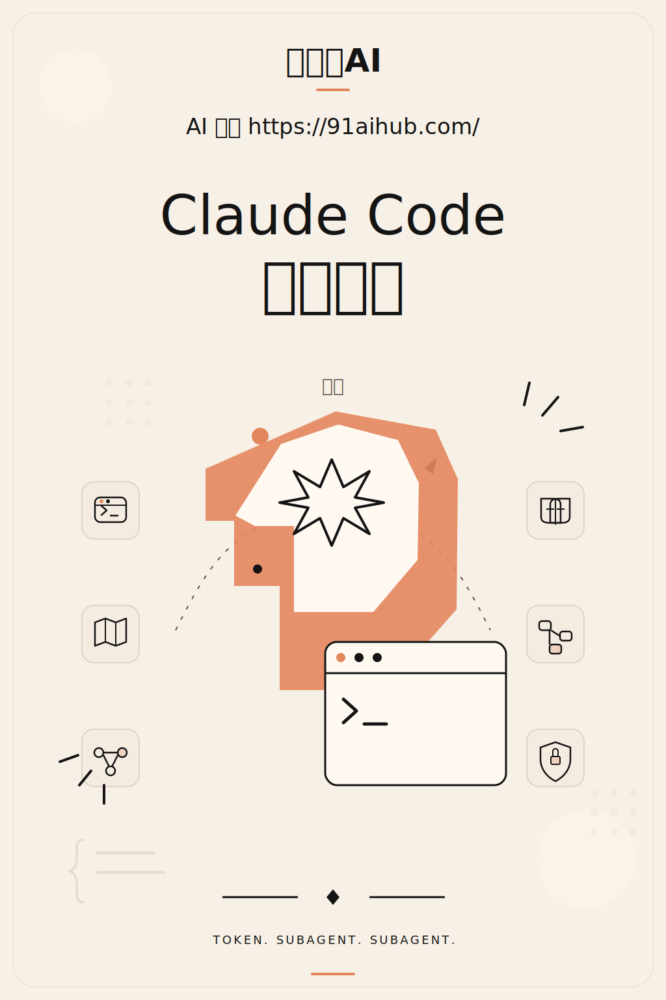
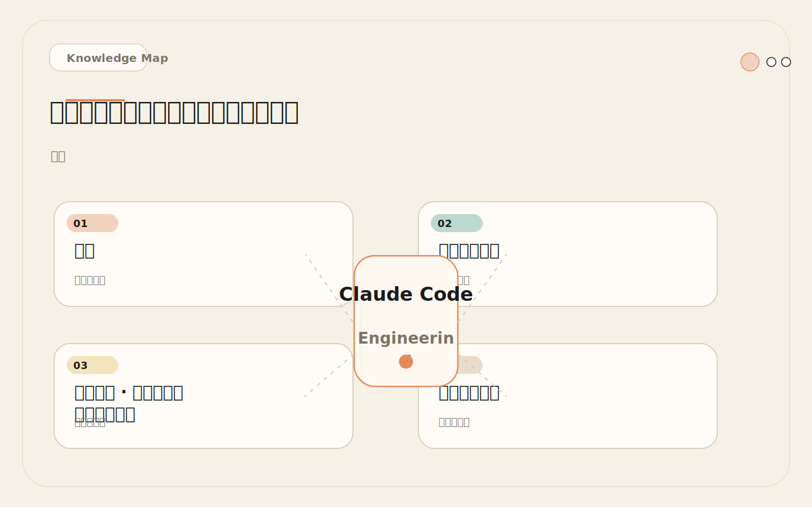
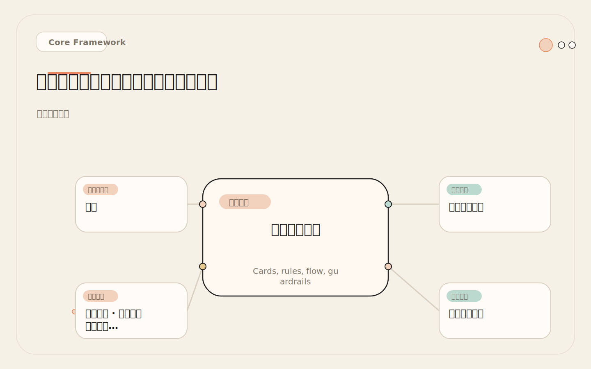
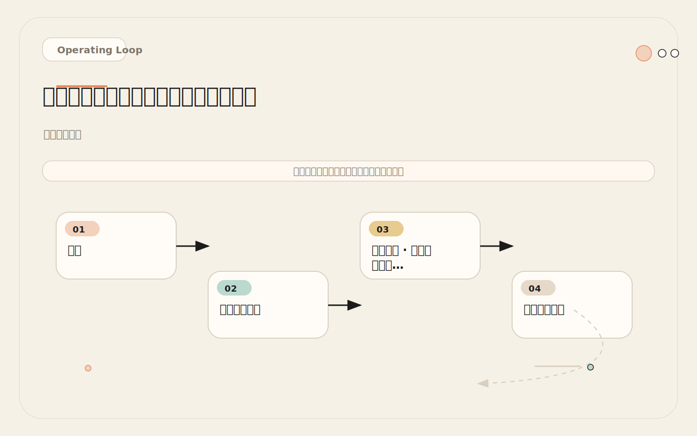
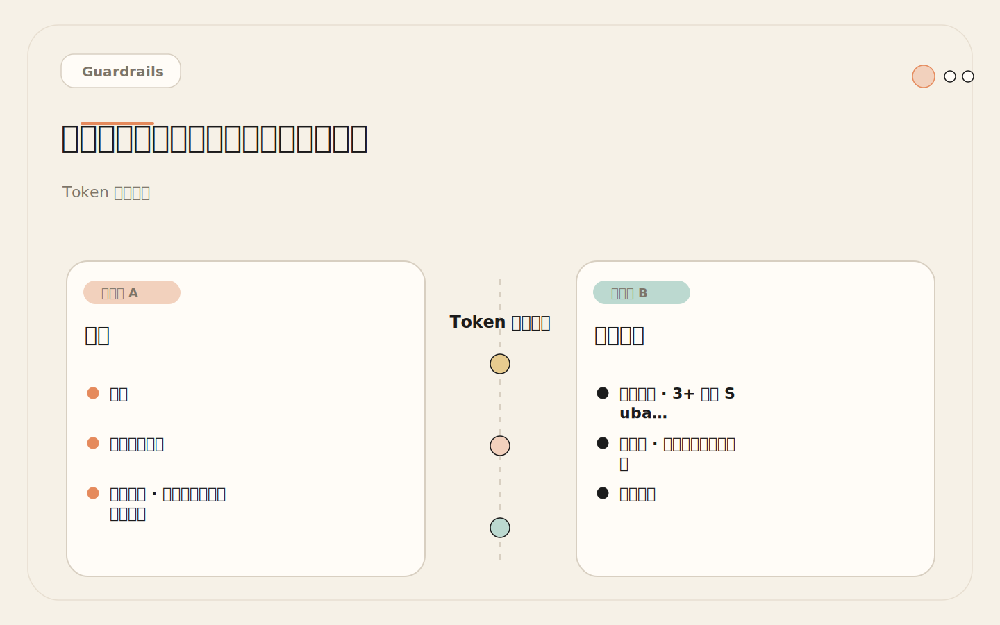

# 并行探索：让多个 Subagent 分头研究，再汇总成一个结论

<!-- codex:cover ../../../assets/claude-code-engineering/15-parallel-exploration-cover.svg -->

<!-- /codex:cover -->

**TL;DR：** 并行探索适合大任务的前期判断。让多个 subagent 分别研究不同方向，再由主会话整合方案。并行会增加总 token 消耗，但显著减少挂钟时间。关键前提：任务必须能拆成相互独立的问题。

## 问题

大型改造开始前，最耗时的是理解：哪些模块相关、现有模式是什么、风险在哪里、测试怎么跑。一个会话串行探索会慢，也容易遗漏。

<!-- codex:illustration 15-parallel-exploration/01-overview-knowledge-map.svg -->

<!-- /codex:illustration -->

但串行探索有一个不容易注意到的隐性成本：**上下文污染累积**。在主会话里连续探索 5 个模块，前 3 个模块的探索细节会和后 2 个模块的实现需求混在一起。到真正开始写代码时，上下文里塞满了探索阶段的只读信息，留给推理和实现的空间不足。

还有一个更容易忽略的问题：**认知疲劳**。主会话在连续探索第 4 个模块时，对前面 3 个模块的细节记忆已经开始模糊。它可能重复读取已经看过的文件，或者遗漏和前面模块的关联。这不是模型能力的问题——任何上下文窗口都有信息密度的极限。探索的内容越多，每条信息的平均"注意力权重"就越低。

并行探索的核心思路：把探索任务拆给多个独立 subagent，每个 subagent 只关注一个方向，在自己的上下文里完成探索。主会话只接收精炼后的结果。

但并行不是银弹。它有自己的成本结构：总 token 消耗更高（每个 subagent 都有独立的上下文初始化开销），结果整合需要额外的工作（去重、合并、冲突解决），而且不是所有任务都能拆成独立子任务。并行探索的前提是每个子任务之间确实没有依赖——如果子任务 A 的结果影响子任务 B 的搜索方向，那就不能并行，只能串行。

## 并行派发架构

### 基本模型

<!-- codex:illustration 15-parallel-exploration/02-framework-core-structure.svg -->

<!-- /codex:illustration -->

```text
主会话
  ├─ 派发任务 A → Subagent Alpha（独立上下文）→ 返回结果 A
  ├─ 派发任务 B → Subagent Beta（独立上下文）→ 返回结果 B
  ├─ 派发任务 C → Subagent Gamma（独立上下文）→ 返回结果 C
  └─ 汇总 A + B + C → 形成完整方案
```

主会话的角色从"执行者"变成"编排者"：定义问题、拆分任务、派发代理、汇总结果。它不需要亲自读文件、搜代码——这些脏活由 subagent 在各自的上下文里完成。

### 派发格式

主会话向每个 subagent 发送明确的问题描述：

```text
给 Explorer A 的任务：
  "查找用户认证相关的所有文件。关注：
   1. 认证中间件的实现位置和调用方式
   2. Session/Token 的存储和验证逻辑
   3. 权限校验的调用链
   返回：文件清单、调用链图、已知模式"

给 Explorer B 的任务：
  "查找数据模型层与用户相关的所有文件。关注：
   1. User 模型的字段定义和关联关系
   2. 用户数据的读写路径
   3. 数据库 migration 历史
   返回：数据模型图、读写路径、最近的 schema 变更"

给 Reviewer C 的任务：
  "审查当前认证系统的安全风险。关注：
   1. Token 验证是否有绕过可能
   2. 密码存储方式
   3. Session 管理的安全性
   返回：风险清单（按严重度排序）"
```

关键：每个任务描述都包含**关注点**和**期望输出格式**。这确保 subagent 返回的结果可以被主会话直接使用，而不需要二次加工。

## 真实场景：权限系统改造的前期探索

### 需求描述

"给现有系统添加角色权限控制。当前只有简单的登录/未登录区分，需要支持多角色、多权限。"

这个改造涉及业务逻辑、数据模型、安全风险、测试覆盖四个方向。主会话同时派发四个 subagent 并行探索：

```text
主会话 → Explorer A（业务逻辑层）
         "查找所有涉及权限判断的业务代码。当前系统如何区分已登录/未登录？
          哪些 API 有权限检查？哪些没有？返回文件清单和权限检查分布图。"

主会话 → Explorer B（数据模型层）
         "查找用户相关的数据模型。User 表结构、关联表、数据库 migration。
          返回 ER 图（文字描述）和最近的 schema 变更。"

主会话 → Reviewer C（安全风险评估）
         "审查当前认证和授权实现的安全风险。Token 管理、Session 处理、
          密码存储、权限绕过可能。返回风险清单。"

主会话 → Explorer D（测试覆盖现状）
         "查找认证和权限相关的测试文件。哪些行为有测试覆盖？哪些没有？
          测试框架和运行方式是什么？返回覆盖度评估。"
```

### 各代理返回的典型结果

Explorer A（业务逻辑层）：

```text
### 文件清单
| 文件 | 作用 | 权限检查 |
|------|------|---------|
| src/middleware/auth.ts | 认证中间件 | ✓ 检查 token |
| src/routes/api.ts | API 路由定义 | 部分，只有 /admin 有检查 |
| src/routes/user.ts | 用户路由 | 无权限检查 |
| src/routes/order.ts | 订单路由 | 无权限检查 |
| src/services/user.ts | 用户服务 | 无权限逻辑 |

### 现有模式
- auth.ts 导出 requireAuth 中间件
- 只有 /admin/* 路由使用了 requireAuth
- 其他所有路由都没有权限检查
- 已登录判断靠 token 解析后挂到 req.user

### 发现的问题
- /api/user/:id 可以访问任意用户数据（无权限检查）
- /api/order 列表返回所有订单（无过滤）
```

Explorer B（数据模型层）：

```text
### User 模型
| 字段 | 类型 | 说明 |
|------|------|------|
| id | UUID | 主键 |
| email | VARCHAR(255) | 唯一 |
| password_hash | VARCHAR(255) | bcrypt |
| role | VARCHAR(20) | 'user' 或 'admin' |
| created_at | TIMESTAMP | 创建时间 |

### 关联表
- orders: user_id -> users.id（一对多）
- sessions: user_id -> users.id（一对多）

### 模式发现
- role 字段已存在但只在 /admin 路由检查
- 没有权限表（permissions table）
- 没有角色-权限关联表（role_permissions）

### 最近变更
- 2024-11: 添加 role 字段（只有 'user' 和 'admin'）
- 2024-09: 添加 sessions 表
```

Reviewer C（安全风险评估）：

```text
| 严重度 | 问题 | 位置 |
|--------|------|------|
| blocker | 任意用户数据访问 | /api/user/:id 无权限检查 |
| blocker | 订单数据越权 | /api/order 无用户过滤 |
| warning | Token 无刷新机制 | auth.ts 只检查过期，不刷新 |
| warning | Session 无并发控制 | 同一用户可无限 session |
| suggestion | 密码策略弱 | 注册时无密码强度检查 |
```

Explorer D（测试覆盖现状）：

```text
### 测试框架
- Vitest + Supertest
- 运行: npx vitest

### 认证测试覆盖
| 场景 | 有测试 | 文件 |
|------|:------:|------|
| 登录成功 | ✓ | tests/auth.test.ts |
| 登录失败（错误密码）| ✓ | tests/auth.test.ts |
| Token 过期 | ✓ | tests/auth.test.ts |
| 未登录访问受保护路由 | ✓ | tests/auth.test.ts |
| 越权访问其他用户数据 | ✗ | - |
| 管理员操作权限 | ✗ | - |
| 角色变更 | ✗ | - |

### 覆盖度评估
- 认证流程覆盖良好（4/4 基础场景）
- 授权场景完全缺失（0/3 关键场景）
- 需要新增权限相关测试文件
```

### 主会话的汇总

四个 subagent 的结果汇总后，主会话形成了清晰的改造方案：

```text
1. 数据层：扩展 User.role 为多角色，新增 permissions 和 role_permissions 表
2. 业务层：将 requireAuth 扩展为 requireRole(role) 和 requirePermission(perm)
3. 安全层：先修两个 blocker（越权问题），再改造权限系统
4. 测试层：新增 tests/authorization.test.ts，覆盖越权和角色场景
5. 风险：改造需要分两阶段——先修安全漏洞，再做权限系统扩展
```

整个探索过程并行完成。如果串行执行，每个方向需要 3-5 分钟，总计 12-20 分钟。并行后，总挂钟时间取决于最慢的那个 subagent，通常 4-6 分钟。

## 结果整合策略

### 信息合并

<!-- codex:illustration 15-parallel-exploration/03-flow-operating-loop.svg -->

<!-- /codex:illustration -->

多个 subagent 返回的结果可能有重叠或互补。整合策略：

```text
1. 去重：多个代理引用了同一文件，只保留描述最完整的那个
2. 互补：Agent A 说了"文件作用"，Agent B 说了"文件依赖"，合并为完整描述
3. 冲突：如果两个代理对同一文件的描述矛盾，主会话亲自验证
4. 排序：按改造优先级排序所有发现（安全漏洞 > 数据模型 > 业务逻辑 > 测试）
```

### 冲突解决

当两个 subagent 的发现互相矛盾时：

```text
场景：Explorer A 报告"/api/order 有权限检查"
      Explorer B 报告"/api/order 没有权限检查"

解决步骤：
  1. 主会话亲自读取 /api/order 路由文件
  2. 确认实际情况（可能一个看了旧版本，一个看了新版本）
  3. 以主会话的直接观察为准

原则：subagent 的结果是"初步发现"，不是"最终结论"。
      冲突时，主会话亲自验证。
```

## Token 成本对比

并行 vs 串行的 token 消耗对比：

<!-- codex:illustration 15-parallel-exploration/04-compare-guardrails.svg -->

<!-- /codex:illustration -->

```text
场景：权限系统改造的 4 方向并行探索

并行模式（4 个 subagent）：
  Explorer A:  ~3,500 tokens（独立上下文）
  Explorer B:  ~2,800 tokens（独立上下文）
  Reviewer C:  ~2,200 tokens（独立上下文）
  Explorer D:  ~3,000 tokens（独立上下文）
  主会话汇总:  ~1,500 tokens（读结果 + 推理）
  ──────────────────────────
  总 token:    ~13,000 tokens
  挂钟时间:    ~5 分钟（取最慢的）
  主会话上下文: 只占 ~1,500 tokens（结果摘要）

串行模式（主会话逐一探索）：
  探索业务逻辑: ~3,500 tokens
  探索数据模型: ~2,800 tokens
  探索安全风险: ~2,200 tokens
  探索测试覆盖: ~3,000 tokens
  ──────────────────────────
  总 token:    ~11,500 tokens
  挂钟时间:    ~15 分钟（串行执行）
  主会话上下文: ~11,500 tokens（全部探索细节）
```

对比结论：

| 指标 | 并行 | 串行 | 差异 |
|------|------|------|------|
| 总 token | ~13,000 | ~11,500 | 并行多 ~13% |
| 挂钟时间 | ~5 分钟 | ~15 分钟 | 并行快 ~67% |
| 主会话上下文占用 | ~1,500 | ~11,500 | 并行省 ~87% |
| 信息遗漏风险 | 低（多视角） | 高（认知疲劳） | 并行更全面 |

关键洞察：**并行的 token 开销比串行多，但主会话上下文占用大幅减少**。总 token 多出的 ~13% 是 subagent 的独立上下文开销。但主会话只接收摘要，上下文从 ~11,500 降到 ~1,500。这意味着主会话有更多空间用于后续的实现和推理。

**什么时候 token 多花是值得的**：当主会话的上下文空间是瓶颈时（复杂任务需要大量推理），并行探索的上下文节省比总 token 开销更重要。典型场景是大型改造：前期探索需要读几十个文件，但后续实现需要在清晰的上下文里做复杂推理。如果探索阶段把主会话上下文塞满了，实现阶段的质量会显著下降。

**什么时候不值得**：当探索任务很简单（只需要读 2-3 个文件），并行调度的固定开销（subagent 创建、上下文初始化、结果传输）可能比任务本身还大。或者当后续实现很简单（不需要大量推理），主会话上下文压力不大，节省上下文空间的收益微乎其微。

还有一个隐藏的权衡：**结果整合的认知成本**。并行探索返回多份结果，主会话需要花精力理解每份结果、找出重叠和冲突、合并成统一视图。这个整合过程本身消耗注意力和上下文空间。如果并行返回的信息量很大、冲突很多，整合成本可能抵消并行带来的上下文节省。

## 故障隔离

并行探索的一个重要特性：**一个 subagent 失败不会阻塞其他 subagent**。

```text
场景：4 个并行 subagent

Explorer A: 正常完成 → 返回结果
Explorer B: 正常完成 → 返回结果
Reviewer C: 超时/出错 → 返回错误信息
Explorer D: 正常完成 → 返回结果

主会话收到：
  - A、B、D 的完整结果
  - C 的错误信息

处理方式：
  1. 基于 A、B、D 的结果继续工作
  2. 安全风险评估由主会话自行补充（用已有的代码结构信息）
  3. 标记安全审查为"待补充"

不会因为 Reviewer C 失败而整个探索流程卡住。
```

这比串行探索更健壮。串行探索中，如果第三步的安全审查超时，后续的测试覆盖探索也无法开始。

## 决策矩阵：并行 vs 串行 vs 主会话

```text
任务特征评估：

1. 任务是否能拆成 3+ 个独立问题？
   是 → 考虑并行
   否 → 串行或主会话

2. 探索结果是否会污染主会话上下文？
   是（大量文件、长日志）→ 并行
   否（少量文件、短输出）→ 主会话

3. 探索时间是否是瓶颈？
   是（挂钟时间 > 10 分钟）→ 并行
   否（挂钟时间 < 3 分钟）→ 主会话

4. 各子任务之间是否完全独立？
   是 → 并行
   有依赖 → 串行

5. 探索后的实现是否需要大量主会话上下文？
   是（复杂推理）→ 并行（省上下文给实现）
   否（简单修改）→ 主会话
```

| 场景 | 并行 | 串行 | 主会话 |
|------|:----:|:----:|:------:|
| 大型改造前期探索 | ✓ | | |
| 多方向技术调研 | ✓ | | |
| 安全 + 性能并行审查 | ✓ | | |
| 中等需求，3-5 个文件 | | ✓ | |
| 有依赖的多步分析 | | ✓ | |
| 小 bug fix，1-2 个文件 | | | ✓ |
| UI 调整，需要看浏览器 | | | ✓ |
| 简单问题，Google 就能回答 | | | ✓ |

## 并行 Subagent 故障隔离模式

并行探索的一个核心工程优势是故障隔离——单个 subagent 失败不会阻塞整体流程。这里展开说明不同故障类型的隔离策略。

### 故障类型及处理

```text
故障类型 1：超时
  症状：某个 subagent 超过预设时间仍未返回
  影响：不影响其他 subagent 的执行
  处理：
    - 设置每个 subagent 的超时阈值（通常 5 分钟）
    - 超时后主会话标记该方向为"待补充"
    - 基于已完成的其他 subagent 结果继续工作
    - 后续用主会话或单独 subagent 补充缺失方向

故障类型 2：权限不足
  症状：subagent 报告"无法完成，缺少 XX 工具"
  影响：该 subagent 返回错误信息，其他 subagent 不受影响
  处理：
    - 记录权限缺失的具体情况
    - 评估是否需要调整该角色的 tools 配置
    - 本次用主会话补充该方向的探索
    - 下次并行探索时使用更新后的配置

故障类型 3：结果质量低下
  症状：subagent 返回了结果，但明显遗漏或错误
  影响：不会直接阻塞流程，但整合结果时需要额外验证
  处理：
    - 主会话对低质量结果进行二次验证
    - 验证方式：亲自读 1-2 个关键文件确认
    - 标记低质量结果的可信度
    - 基于可信结果做决策，低可信结果仅作参考

故障类型 4：Subagent 间结果冲突
  症状：两个 subagent 对同一事实给出矛盾描述
  影响：需要主会话介入裁决
  处理：
    - 主会话亲自验证冲突点（读源文件）
    - 以直接观察为准，subagent 结果标记为"初步发现"
    - 分析冲突原因：可能是版本差异、搜索范围不同、理解偏差
    - 更新 subagent 的 system prompt 减少未来冲突
```

### 故障恢复的工程实践

```text
最佳实践：并行探索的容错设计

1. 冗余派发（高可靠场景）
   对关键方向派发两个 subagent，交叉验证结果
   适用场景：安全审计、核心模块探索
   成本：token 消耗翻倍，但结果可靠性显著提升
   判断标准：该方向的探索结果如果错误，会导致多大的损失？

2. 降级策略（资源敏感场景）
   并行探索中某个 subagent 失败后，不重新派发
   而是由主会话快速补充该方向的探索
   适用场景：token 预算有限、时间不紧急
   成本：挂钟时间增加，但总 token 消耗不增加

3. 渐进式并行（探索范围不确定时）
   先派 2 个 subagent 摸底
   根据初步结果决定是否需要更多 subagent
   适用场景：任务范围一开始不确定
   成本：可能比一次性并行多花挂钟时间，但避免了无效派发
```

## 实战案例：3+ 并行 Subagent 解决复杂任务

### 场景：微服务拆分的前期调研

```text
任务描述：
  "将单体应用拆分为微服务。需要了解当前架构、
   服务边界、数据依赖、API 调用链、部署配置。"

这是一个典型的大型探索任务——5 个方向，每个方向都需要读大量文件，
方向之间相对独立。串行探索预计需要 25-40 分钟。

并行派发 5 个 subagent：
```

### 派发配置

```text
Subagent A（路由层分析）：
  角色：Explorer
  任务："分析 src/routes/ 目录下所有路由定义。输出：
    1. 路由 → handler 映射表
    2. 每个路由的中间件链
    3. 路由之间的调用关系
    4. 鉴权/授权分布图"
  预计输出：~800 tokens

Subagent B（数据层分析）：
  角色：Explorer
  任务："分析 src/models/ 和 src/db/ 目录。输出：
    1. 所有模型定义和字段
    2. 模型之间的关联关系
    3. 数据库 migration 历史
    4. 跨模型的查询（join 操作）"
  预计输出：~1,000 tokens

Subagent C（服务层分析）：
  角色：Explorer
  任务："分析 src/services/ 目录。输出：
    1. 每个服务的职责描述
    2. 服务之间的调用依赖
    3. 共享工具函数
    4. 外部 API 调用"
  预计输出：~800 tokens

Subagent D（配置与部署分析）：
  角色：Explorer
  任务："分析部署配置文件。输出：
    1. Docker/容器配置
    2. CI/CD 流程
    3. 环境变量和配置管理
    4. 监控和日志配置"
  预计输出：~600 tokens

Subagent E（安全审查）：
  角色：Reviewer
  任务："审查当前架构的安全风险。输出：
    1. 认证/授权实现的安全评估
    2. 数据库访问的安全性
    3. API 端点的暴露面
    4. 敏感数据处理方式"
  预计输出：~800 tokens
```

### 结果汇总与冲突解决

```text
5 个 subagent 并行执行，耗时约 6 分钟（取最慢的）

汇总过程：

步骤 1：独立验证（~2 分钟）
  快速扫描每个 subagent 的输出，检查格式完整性
  Subagent D 的输出最短（~400 tokens），发现部署配置很简单
  Subagent E 报告了 2 个 blocker 级别的安全问题

步骤 2：交叉引用（~3 分钟）
  对比 Subagent A（路由）和 Subagent C（服务）的输出
  发现 3 处路由-服务映射不一致：
    A 报告"/api/order 由 OrderService 处理"
    C 报告"OrderService 已废弃，实际由 CheckoutService 处理"
  → 主会话亲自读 src/routes/order.ts 确认
  → 确认 C 的发现正确，OrderService 文件存在但未被引用

步骤 3：构建整体视图（~2 分钟）
  合并 5 份结果，形成微服务拆分建议：
    - 识别出 4 个潜在的服务边界
    - 标记 2 个跨服务的数据依赖需要解决
    - 2 个安全 blocker 需要在拆分前修复
    - 部署配置简单，容器化改造难度低

总耗时：~11 分钟（含汇总）
总 token：~22,000（5 个 subagent + 主会话汇总）

对比串行执行：
  预计耗时：~30 分钟
  预计 token：~18,000（省了 subagent 初始化开销）
  主会话上下文：~18,000 tokens（全部挤在一个上下文里）

结论：并行方案用多 ~22% 的 token，换来 ~63% 的时间节省
     和 ~89% 的主会话上下文节省。对于后续的复杂拆分方案设计，
     干净的主会话上下文比 token 节省更有价值。
```

### 并行 vs 串行的详细性能数据

```text
基于多个项目的实测数据：

小任务（探索 5 个文件以内）：
  并行：3,800 tokens，2 分钟
  串行：2,200 tokens，3 分钟
  结论：不值得并行，调度开销占比过高（~40%）

中任务（探索 5-15 个文件，2-3 个方向）：
  并行：8,500 tokens，4 分钟
  串行：7,200 tokens，10 分钟
  结论：并行划算，时间节省 60%，上下文节省 70%

大任务（探索 15+ 个文件，4+ 个方向）：
  并行：22,000 tokens，11 分钟
  串行：18,000 tokens，30 分钟
  结论：强烈推荐并行，时间节省 63%，上下文节省 89%

超大任务（全项目级探索，6+ 个方向）：
  并行：35,000 tokens，15 分钟
  串行：28,000 tokens，50 分钟
  结论：必须并行，串行的认知疲劳会导致重大遗漏
```

## 反模式：简单任务的过度并行

### 经过

团队接到一个 bug 修复：用户头像上传后偶尔显示旧图片。这是一个缓存问题，预计改动不超过 10 行。

负责的工程师决定"用并行探索找到根因"，派发了 5 个 subagent：

```text
Subagent 1: 查找头像上传相关的所有文件
Subagent 2: 查找图片缓存相关的所有代码
Subagent 3: 查找 CDN 配置和缓存策略
Subagent 4: 查找前端图片组件的实现
Subagent 5: 查找相关的历史 bug 和修复记录
```

### 结果

```text
Token 消耗：
  5 个 subagent 各消耗 ~2,000-3,000 tokens
  主会话汇总消耗 ~1,500 tokens
  总计：~14,000 tokens

实际根因：
  图片上传后，CDN 缓存没有失效。
  修复：上传成功后调用 CDN purge API。
  改动：1 个文件，3 行代码。

如果主会话自己处理：
  读上传 handler → 发现没有缓存失效逻辑 → 修复
  预估：~2,000 tokens，5 分钟
```

### 根因

**过度并行化**。5 个 subagent 里有 3 个根本没找到有用信息（CDN 配置、前端组件、历史 bug 都和根因无关）。并行化是对的，但不是所有任务都需要并行化。

判断标准出了问题：

1. **任务复杂度不匹配**。一个 10 行以内的 bug fix，不需要"全方向探索"。主会话读一个文件就能定位根因。
2. **子任务不是真正独立的**。5 个子任务都在找同一个东西（缓存逻辑），只是搜索角度不同。这不是并行——这是重复搜索。
3. **固定开销不成比例**。创建 5 个 subagent 的调度开销（~5,000 tokens）比任务本身（~2,000 tokens）还大。

### 修复

**并行化的前提条件检查**：

```text
派发并行 subagent 前，确认：
  1. 每个子任务返回的信息对其他子任务是独立的
     （不是不同角度搜索同一个东西）
  2. 预估每个子任务的输出都大于调度开销（~500 tokens）
  3. 主会话单独处理的总时间预计 > 5 分钟
  4. 探索范围涉及 > 10 个文件

不满足任意一条 → 不要并行，主会话自己处理。
```

对于这个头像 bug，正确做法：

```text
1. 主会话读取上传 handler 文件
2. 发现上传成功后没有调用缓存失效
3. 加上缓存失效调用
4. 跑测试确认

总耗时：3 分钟
总 token：~2,000
不需要任何 subagent。
```

## 交叉参考

- [12 - Subagents 心智模型](12-subagents-mental-model.md)：并行探索背后的核心机制——独立上下文和专门角色
- [13 - 高价值角色](13-high-value-subagents.md)：Explorer、Reviewer、Test Runner 的角色定义和组合模式
- [16 - 不该用 Subagent 的场景](16-when-not-to-use-subagents.md)：并行探索的边界——哪些任务不值得并行化
- [14 - 工具权限](14-subagent-tool-permissions.md)：并行探索中每个 subagent 的工具权限配置


