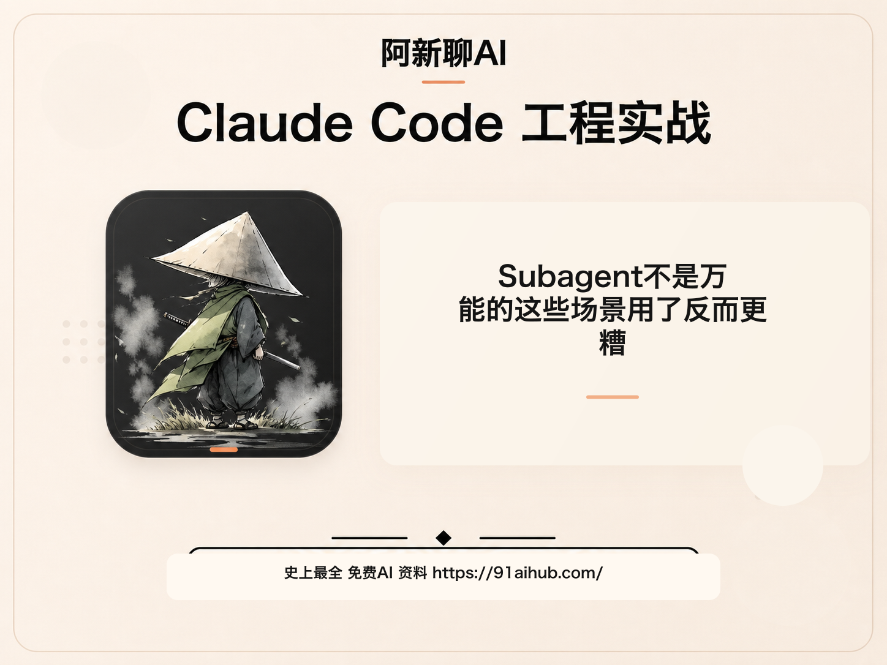
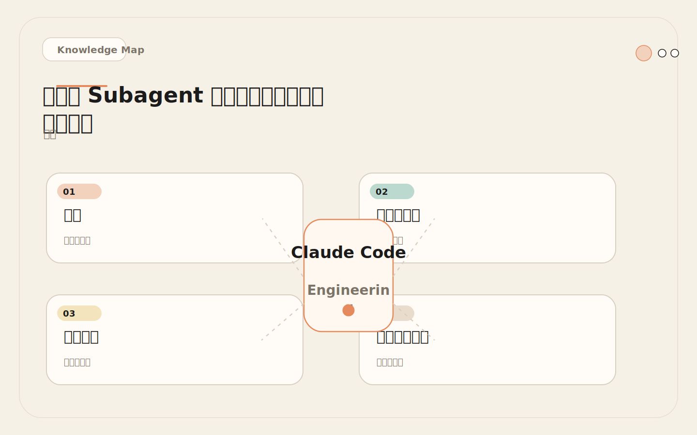
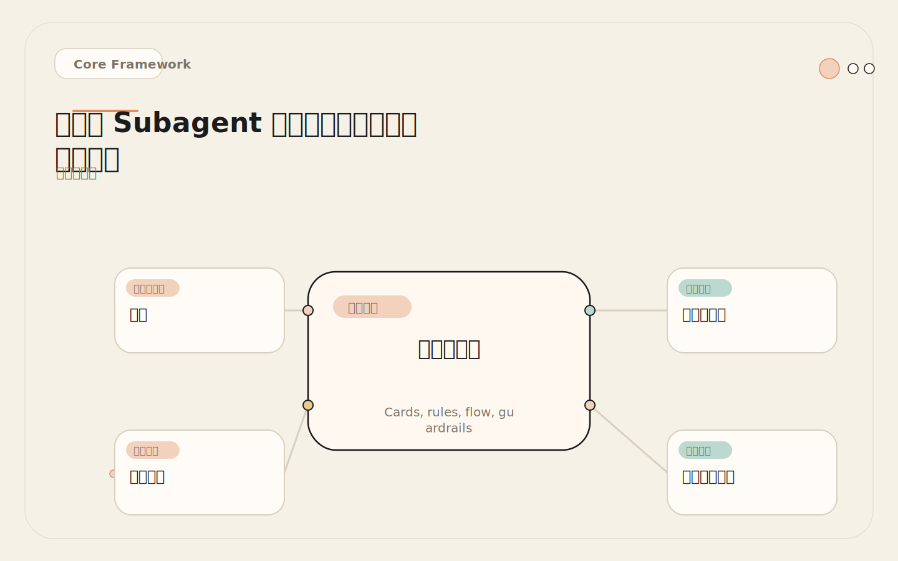
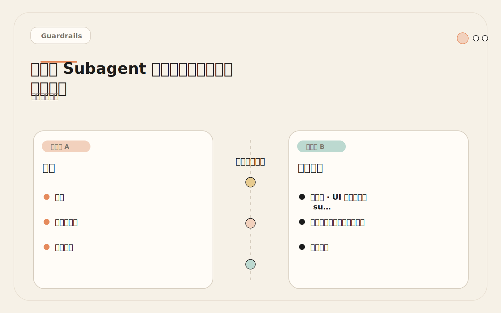
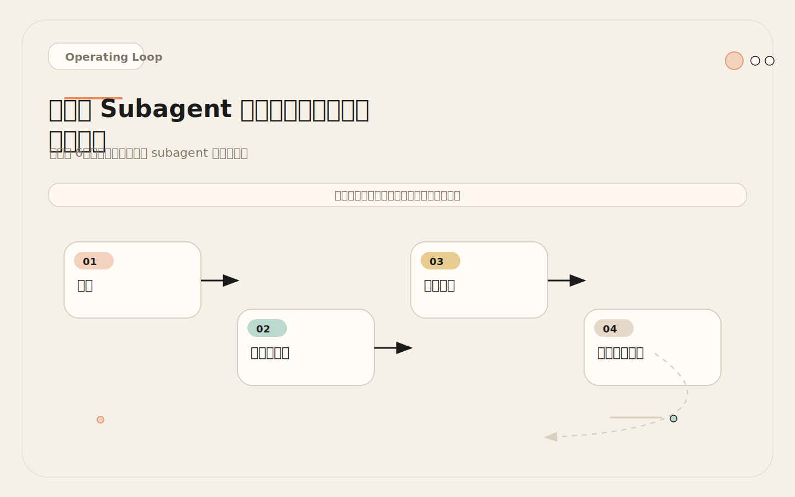

# Subagent 不是万能的：这些场景用了反而更糟

<!-- codex:cover ../../../assets/claude-code-engineering/16-when-not-to-use-subagents-cover.png -->

<!-- /codex:cover -->

**TL;DR：** Subagent 不适合所有复杂任务。需要频繁共享细节、连续编辑同一批文件、上下文高度耦合的任务，留在主会话更稳。不是所有任务都值得隔离——有时候隔离本身就是成本。

## 问题

看到 Subagent 后，很容易把所有任务都拆出去。结果是多个代理重复读文件、给出冲突建议，主会话还要花时间整合。Subagent 是有调度成本的工具，不是万能架构。

<!-- codex:illustration 16-when-not-to-use-subagents/01-overview-knowledge-map.svg -->

<!-- /codex:illustration -->

核心矛盾：Subagent 的优势是独立上下文和专门角色，但这也意味着它无法共享主会话的实时状态、无法与用户交互、无法看到浏览器。当任务需要这些能力时，subagent 反而是错误选择。

理解这个矛盾的关键是区分两种任务类型：**可隔离任务**和**需协同任务**。可隔离任务的输入和输出都可以在任务开始前完整定义，执行过程不需要外部信息。比如"找到所有认证相关文件"——输入是搜索条件，输出是文件清单，执行过程只需要读文件。需协同任务的执行过程依赖外部信息或决策，输入和输出无法预先完整定义。比如"重构这个模块"——执行过程中会遇到设计决策、需要和用户确认、可能需要看渲染效果。

Subagent 只适合可隔离任务。把需协同任务派给 subagent，要么得到不完整的结果（因为中间遇到了无法解决的问题），要么得到错误的结果（因为 subagent 猜测了用户意图）。

## 反模式目录

### 反模式 1：小 bug fix 拆 subagent

<!-- codex:illustration 16-when-not-to-use-subagents/02-framework-core-structure.svg -->

<!-- /codex:illustration -->

**更多真实案例**：

```text
案例 A：空指针异常
  报错：TypeError: Cannot read properties of null (reading 'email')
  错误做法：派 Explorer 找文件 → 派 Reviewer 审查 → 主会话修复
  正确做法：主会话读报错堆栈，定位到 src/handlers/user.ts:47，
           加 null check，耗时 1 分钟
  根因分析：报错堆栈已经给出了文件和行号，
           Explorer 的搜索能力在这里完全多余

案例 B：配置 typo
  报错：Connection refused: localhost:5432（应该是 5433）
  错误做法：派 Explorer 查数据库配置 → 派 Reviewer 审查配置文件
  正确做法：主会话搜索 "5432" 在配置文件中的位置，改为 5433
  根因分析：搜索一个固定字符串不需要专门角色，主会话的 Grep 就够

案例 C：CSS z-index 层叠问题
  报错：弹窗被侧边栏遮挡
  错误做法：派 Explorer 找所有 z-index 定义 → 分析层叠关系
  正确做法：主会话搜索 z-index，找到冲突的两个值，调整其中一个
  根因分析：CSS 调试需要视觉验证，subagent 看不到浏览器
           即使 Explorer 找到了所有 z-index，最终的值仍需要视觉确认
```

### 反模式 2：UI 调整用 subagent

**场景**：修复一个 `NullPointerException`，需要改 1 个文件、加 1 行 null check。

**错误做法**：

```text
1. 派 Explorer 找到相关文件
2. Explorer 返回文件路径和上下文
3. 主会话读取 Explorer 返回的信息
4. 主会话修改代码
5. 派 Test Runner 跑测试
6. Test Runner 返回测试结果
```

总共 2 次 subagent 调度，每次 ~1,000 tokens 的固定开销。任务本身只需要读 1 个文件（~200 tokens）和改 1 行代码（~100 tokens）。调度开销是实际工作量的 10 倍。

**正确做法**：主会话直接读文件、改代码、跑测试。总 token ~500，总耗时 1 分钟。

**判断标准**：改动涉及 ≤ 3 个文件，且文件路径已知 → 主会话直接处理。

### 反模式 2：UI 调整用 subagent

**场景**：调整一个按钮的颜色、间距和 hover 效果。

**错误做法**：

```text
1. 派 subagent 修改 CSS
2. subagent 无法看到浏览器效果
3. 主会话运行 dev server
4. 发现颜色不对
5. 再派 subagent 修改
6. 重复 2-3 次
```

Subagent 没有眼睛。它不能看到渲染效果，不能判断"这个颜色太浅"还是"这个间距太紧"。UI 工作需要**视觉反馈循环**：改一点 → 看一眼 → 再改一点。这个循环必须在一个能看浏览器的会话里完成。

**正确做法**：主会话使用 Playwright 或浏览器截图工具，在主会话里完成 CSS 修改 → 截图验证 → 再修改的循环。

**判断标准**：任务需要视觉验证 → 留在主会话。

### 反模式 3：强耦合模块拆 subagent

**场景**：修改一个 ORM 模型的字段类型（比如把 `String` 改成 `Integer`），需要同步修改：模型定义、数据库 migration、API 序列化、前端类型定义、测试数据。

**错误做法**：

```text
1. 派 Subagent A 修改模型和 migration
2. 派 Subagent B 修改 API 层
3. 派 Subagent C 修改前端类型
4. 派 Subagent D 更新测试
```

这四个修改是**强耦合**的。模型字段类型变了，API 序列化必须同步变，前端类型必须同步变。如果 A 把字段改成了 `Integer`，但 B 的 API 还在返回 `String`，C 的前端还在解析 `String`，系统就坏了。

Subagent 之间不能通信。A 不知道 B 做了什么，B 不知道 C 做了什么。主会话要花大量时间协调它们的结果，比直接自己做还慢。

**正确做法**：主会话按顺序修改所有相关文件，保持全局一致性。可以先用 Explorer 摸清影响范围（这一步用 subagent 是合理的），但实际修改必须在主会话里连续完成。

**判断标准**：多个文件的修改互为前提、必须保持一致 → 留在主会话。

### 反模式 4：需要实时人工决策的任务

**场景**：重构一个复杂的业务流程，每一步都有多种实现方式，需要产品经理确认。

**错误做法**：

```text
1. 派 subagent 分析当前实现
2. subagent 返回 3 种方案
3. 主会话问用户选哪个
4. 用户选了方案 B
5. 派 subagent 实现方案 B
6. subagent 实现到一半遇到设计决策
7. subagent 无法问用户，只能猜测
8. 返回结果和用户预期不符
```

Subagent 不能中途停下来问用户问题。它只能在开始时接收任务描述，结束时返回结果。中间遇到模糊地带，要么猜测（可能猜错），要么返回不完整的结果（没有解决实际问题）。

**正确做法**：主会话自己做。遇到决策点时，主会话可以直接问用户："这个字段应该允许为空吗？" 用户回答后，主会话继续。这种实时交互只有主会话能做到。

**判断标准**：任务执行过程中需要 ≥ 2 次人工决策 → 留在主会话。

### 反模式 5：同一批文件的连续编辑

**场景**：重构一个 500 行的文件，需要：重命名变量、提取函数、调整 import、修改类型签名、更新注释。

**错误做法**：

```text
1. 派 Subagent A 做重命名
2. Subagent A 完成后返回
3. 主会话读 A 的修改
4. 派 Subagent B 做提取函数
5. Subagent B 没有看到 A 的修改（独立上下文）
6. B 的修改和 A 的修改冲突
7. 主会话花时间解决冲突
```

连续编辑同一文件需要**累积上下文**。第一步的重命名会影响第二步的提取函数，第二步的提取函数会影响第三步的 import 调整。每一步都依赖前一步的结果。Subagent 的独立上下文在这里变成了障碍——它看不到前一个 subagent 做了什么。

**正确做法**：主会话按顺序完成所有编辑步骤。每一步都能看到前一步的结果。

**判断标准**：多个编辑步骤操作同一文件，且步骤之间有依赖 → 留在主会话。

## 三问测试

派发 subagent 前，过这三个问题。三个"是"才能派。任意一个"否"，留在主会话。

### 问题 1：这个任务需要读很多文件但不污染主上下文吗？

```text
是 → 继续问题 2
否 → 主会话直接做

分析：
  "读很多文件" = 预计需要读 > 10 个文件
  "不污染主上下文" = 这些文件的内容对后续实现没有直接参考价值

例子：
  ✓ "查找所有认证相关文件，返回文件清单"
    → 要读很多文件，但主会话只需要知道"有哪些文件"
  ✓ "分析这个报错的调用链，返回根因"
    → 要读多个文件，但主会话只需要知道"根因是什么"
  ✗ "修改用户模型的字段类型"
    → 可能只需要读 1-2 个文件，不值得调度
  ✗ "读一下这个函数的实现，我要基于它改"
    → 读的内容后续要用，不算"污染"
```

### 问题 2：这个任务有明确可交付的结果吗？

```text
是 → 继续问题 3
否 → 主会话直接做

分析：
  "明确可交付的结果" = 可以写成一段文字、一个表格、一个清单

例子：
  ✓ "返回调用链：A → B → C → D"
  ✓ "返回发现清单：[severity, file, line, issue]"
  ✓ "返回测试结果：通过 X，失败 Y，根因是 Z"
  ✗ "帮我想想这个设计应该怎么做"（没有明确输出）
  ✗ "重构这个模块"（过程性任务，不是交付物）
  ✗ "优化性能"（目标模糊，无法定义完成条件）
```

### 问题 3：这个任务能从专门角色或限制权限中获益吗？

```text
是 → 派 subagent
否 → 主会话直接做，或用 Skill

分析：
  "专门角色获益" = 独立 system prompt 让输出质量更高
  "限制权限获益" = 只读权限降低风险

例子：
  ✓ 安全审查 → reviewer 角色保证每次检查同样的维度
  ✓ 代码探索 → 只读权限保证不会意外修改
  ✓ 测试分析 → 专门角色专注于失败分析
  ✗ "给这个函数加个参数" → 不需要专门角色
  ✗ "修一下这个 typo" → 不需要权限限制
  ✗ "跑一下 dev server" → 不需要独立上下文
```

## 方案对比矩阵

三种方式的适用场景和成本：

<!-- codex:illustration 16-when-not-to-use-subagents/04-compare-guardrails.svg -->

<!-- /codex:illustration -->

| 维度 | 主会话 | Skill | Subagent |
|------|--------|-------|----------|
| 上下文 | 共享主会话全部上下文 | 注入到主会话 | 完全独立 |
| 工具权限 | 完整 | 完整 | 可限制 |
| 人工交互 | 可以实时交互 | 可以实时交互 | 不能中途交互 |
| 视觉反馈 | 可以看浏览器 | 可以看浏览器 | 不能看浏览器 |
| 调度开销 | 0 | ~100-500 tokens | ~1,000-3,000 tokens |
| 适用任务量 | 小到中 | 中 | 中到大 |
| 连续编辑 | 支持（上下文连续） | 支持 | 不支持（上下文隔离） |
| 并行执行 | 不支持 | 不支持 | 支持 |
| 角色专业化 | 无 | 有 | 有 |
| 典型场景 | bug fix、UI、连续编辑 | review、commit、release | 探索、审查、测试分析 |

### 方案选择决策树

```text
任务来了，选择执行方式：

第一步：判断复杂度
  改动 ≤ 3 个文件，路径已知？
    └─ 是 → 主会话（不需要任何特殊机制）

第二步：判断是否需要视觉反馈
  需要看浏览器渲染效果？
    └─ 是 → 主会话（subagent 看不到浏览器）

第三步：判断是否需要人工交互
  执行过程中需要 ≥ 2 次人工决策？
    └─ 是 → 主会话（subagent 不能中途问用户）

第四步：判断是否需要连续编辑
  多个编辑步骤操作同一文件，且步骤间有依赖？
    └─ 是 → 主会话（subagent 的独立上下文无法累积修改状态）

第五步：判断任务频率
  高频短流程（每次 < 5 分钟，每周 > 5 次）？
    └─ 是 → Skill（轻量级，注入到主会话，无调度开销）

第六步：判断是否需要上下文隔离
  需要读大量文件但只返回摘要（> 10 个文件）？
    └─ 是 → Subagent（隔离探索上下文）

第七步：判断是否需要专门角色
  需要固定维度的审查或特定角色的分析？
    └─ 是 → Subagent（独立 system prompt 保证角色一致性）

第八步：都不满足？
  └─ 先用主会话，如果上下文开始膨胀再考虑 subagent
```

### 三种方案的 Token 成本对比

```text
场景：审查一个 PR diff（~200 行变更）

主会话直接审查：
  读 diff + 推理 + 输出发现：~2,000 tokens
  调度开销：0
  总计：~2,000 tokens

用 Skill（如 /review）：
  加载 Skill 定义：~300 tokens
  读 diff + 按 Skill 规范审查：~2,000 tokens
  调度开销：~300 tokens
  总计：~2,300 tokens

用 Subagent（reviewer）：
  主会话生成任务描述：~300 tokens
  Subagent 加载 SKILL.md：~400 tokens
  Subagent 读 diff + 审查 + 输出：~2,500 tokens
  主会话读结果：~300 tokens
  调度开销：~1,000 tokens
  总计：~3,500 tokens

结论：PR 审查用 Skill 最划算，比主会话多 ~15% 的 token，
     但有固定的审查维度；比 Subagent 省 ~43% 的 token，
     因为不需要独立的上下文初始化。
```

## Subagent 滥用的 Token 成本实测

```text
场景：一周内团队使用 subagent 的实际数据（优化前 vs 优化后）

优化前（过度使用 subagent）：
  ─────────────────────────────────────────────
  任务类型              次数  方式    平均token  总token
  ─────────────────────────────────────────────
  小 bug fix (< 3 文件)   12  subagent  3,200   38,400
  CSS/UI 调整              8  subagent  4,500   36,000
  PR 审查                  6  subagent  3,500   21,000
  配置修改                 4  subagent  2,800   11,200
  大型探索                 3  subagent 15,000   45,000
  测试分析                 5  subagent  4,000   20,000
  ─────────────────────────────────────────────
  总计：38 次调用，171,600 tokens

优化后（正确使用 subagent）：
  ─────────────────────────────────────────────
  任务类型              次数  方式      平均token  总token
  ─────────────────────────────────────────────
  小 bug fix (< 3 文件)   12  主会话      600     7,200
  CSS/UI 调整              8  主会话    1,200     9,600
  PR 审查                  6  Skill      800     4,800
  配置修改                 4  主会话      500     2,000
  大型探索                 3  subagent 15,000    45,000
  测试分析                 5  subagent  4,000    20,000
  ─────────────────────────────────────────────
  总计：subagent 8 次调用，其他 30 次，88,600 tokens

节省：83,000 tokens（~48%）
关键洞察：节省全部来自"不该用 subagent 的场景"改用主会话或 Skill。
         大型探索和测试分析的 token 消耗不变——这些是 subagent 真正适合的场景。
```

### 选择流程

```text
任务来了
  │
  ├─ 改动 ≤ 3 个文件，路径已知？
  │    └─ 是 → 主会话
  │
  ├─ 需要视觉反馈？
  │    └─ 是 → 主会话
  │
  ├─ 需要中途问用户？
  │    └─ 是 → 主会话
  │
  ├─ 多个文件强耦合修改？
  │    └─ 是 → 主会话
  │
  ├─ 是高频短流程（review、commit）？
  │    └─ 是 → Skill（Command）
  │
  ├─ 需要读大量文件但只返回摘要？
  │    └─ 是 → Subagent
  │
  ├─ 需要独立审查/分析？
  │    └─ 是 → Subagent
  │
  └─ 还是不确定？
       └─ 先主会话，如果上下文开始膨胀再考虑 subagent
```

### 决策树可视化流程图

完整的判断路径。从顶部开始，沿箭头走到第一个匹配条件即停止。

```text
                        ┌─────────────┐
                        │   任务到达    │
                        └──────┬──────┘
                               │
                ┌──────────────▼───────────────┐
                │ Q1: ≤3 文件改动且路径已知？     │
                └──────┬──────────────┬─────────┘
                    是 │              │ 否
                       ▼              │
                  【主会话】    ┌──────▼───────────┐
                               │ Q2: 需要视觉反馈？  │
                               └──┬───────────┬───┘
                                是│           │否
                                  ▼           │
                             【主会话】  ┌─────▼──────────┐
                                        │ Q3: 要问用户 ≥2次？│
                                        └──┬──────────┬──┘
                                         是│          │否
                                           ▼          │
                                      【主会话】 ┌─────▼──────────┐
                                                │ Q4: 强耦合多文件？ │
                                                └──┬──────────┬──┘
                                                 是│          │否
                                                   ▼          │
                                              【主会话】 ┌─────▼──────────┐
                                                        │ Q5: 高频短流程？   │
                                                        │(review/commit)    │
                                                        └──┬──────────┬──┘
                                                         是│          │否
                                                           ▼          │
                                                       【Skill】 ┌────▼────────┐
                                                                │Q6:读>10文件   │
                                                                │只返回摘要？   │
                                                                └──┬───────┬──┘
                                                                 是│       │否
                                                                   ▼       │
                                                              【Subagent】│
                                                                        ┌──▼────────┐
                                                                        │Q7:需独立角色│
                                                                        │审查/分析？  │
                                                                        └──┬─────┬──┘
                                                                          是│    │否
                                                                            ▼    ▼
                                                                       【Subagent】【主会话】
                                                                                   (默认)
```

### 边界情况和快速判断

```text
3 秒快速判断（背下来就不需要走完整流程）：

  改动小（≤3 文件）         → 主会话
  要看效果（UI/渲染）        → 主会话
  要问人（中途决策 ≥2 次）   → 主会话
  改动互相依赖（强耦合）      → 主会话
  高频操作（review/commit）  → Skill
  读大量文件返回摘要（>10）   → Subagent
  独立角色审查分析            → Subagent
  拿不准                     → 先主会话，膨胀了再 Subagent

边界情况处理：

  边界 1：改动 3 个文件但路径不确定
    → 先用主会话 Grep 定位（1-2 轮搜索），定位后走"≤3 文件"分支
    → 不要为了找文件就派 subagent，除非要搜索的文件超过 10 个

  边界 2：高频操作但偶尔需要深度分析
    → 日常用 Skill，遇到异常切主会话
    → 例：日常 review 用 /review，发现安全漏洞切主会话深度分析

  边界 3：并行探索后需要连续编辑
    → 探索阶段用 Subagent（读文件、返回摘要）
    → 编辑阶段切回主会话（subagent 负责"看"，主会话负责"改"）

  边界 4：部分子任务适合 subagent、部分不适合
    → 分别处理，不要强行统一执行方式
    → 例："分析性能瓶颈并修复" → 分析派 Subagent，修复留主会话
```

## Token 成本分析

Subagent 的 token 开销不是只有"任务本身的 token"。完整成本包括：

```text
Subagent 完整 token 成本：

1. 调度成本
   主会话生成任务描述:          ~200-500 tokens
   Subagent 加载 SKILL.md:       ~300-600 tokens
   Subagent 初始化上下文:         ~200-400 tokens
   ─────────────────────────────
   小计:                        ~700-1,500 tokens

2. 执行成本
   Subagent 读取文件/搜索/分析:  ~1,000-5,000 tokens
   (视任务复杂度而定)

3. 返回成本
   Subagent 生成结果:            ~300-1,000 tokens
   主会话读取并理解结果:          ~200-500 tokens
   ─────────────────────────────
   小计:                        ~500-1,500 tokens

4. 整合成本（如有多个 subagent）
   去重、合并、冲突解决:          ~300-800 tokens

总计: ~2,500-8,800 tokens

对比主会话直接处理：
  直接读取文件 + 推理 + 执行:   ~500-3,000 tokens
```

**成本阈值**：如果主会话直接处理的成本 < 2,000 tokens，subagent 调度开销就占了总成本的大部分。这时候用 subagent 不经济。

**什么时候 subagent 的成本是值得的**：

1. 主会话需要保持上下文给后续复杂实现（上下文空间价值 > token 成本）
2. 任务需要专门角色（如安全审查需要固定检查维度）
3. 任务需要限制权限（如只读审计）
4. 多个方向可以并行，节省挂钟时间

### 常见任务 token 消耗实测表

以下数据来自真实开发场景的测量。每次任务执行前后记录会话 token 计数差值，取 5 次执行的中位数。测量环境：Claude Sonnet 4，项目规模 ~50 个源文件。

| 任务场景 | 主会话 | Skill | Subagent | 最优方式 | 理由 |
|----------|--------|-------|----------|----------|------|
| 修 1 行 null check | 420 | — | 2,830 | 主会话 | 快 6.7 倍 |
| 改 1 个配置端口 typo | 310 | — | 2,510 | 主会话 | 快 8.1 倍 |
| 搜索函数调用链（3 文件） | 1,200 | — | 3,400 | 主会话 | 文件少不值得调度 |
| 搜索函数调用链（15 文件） | 4,800 | — | 4,100 | Subagent | 隔离上下文更划算 |
| 代码 review（单文件 ~80 行） | 2,100 | 1,400 | 3,700 | Skill | 角色化 + 低开销 |
| 代码 review（PR ~200 行） | 5,300 | 2,800 | 4,200 | Skill | 轻量注入最省 token |
| commit message 生成 | 1,600 | 900 | 2,900 | Skill | 高频短流程典范 |
| 安全审查（5 文件） | 3,900 | 2,100 | 4,600 | Skill | 角色专业化 + 无调度 |
| UI 样式调整（3 轮迭代） | 1,800 | — | 7,200 | 主会话 | 需要视觉反馈循环 |
| 并行探索 3 个技术方案 | 9,000 | — | 5,500 | Subagent | 并行节省总量 |
| ORM 字段类型联动修改 | 3,200 | — | 8,100 | 主会话 | 强耦合必须连续执行 |
| 全项目依赖版本升级 | 6,400 | — | 5,800 | Subagent | 读大量 package 文件 |
| 单元测试生成（1 个类） | 4,200 | — | 9,500（3 个 subagent） | 主会话 | fixture 共享 + mock 一致 |

**四条关键规律**：

```text
规律 1：Subagent 固定成本约 2,000-3,000 tokens
  无论任务多简单，调度开销都是 2,000 tokens 起步。
  任务本身 token 越少，固定成本占比越高，越不划算。

规律 2：Skill 比 Subagent 省 40-60%
  Skill 注入主会话上下文，没有调度开销。
  对 review、commit 这类高频操作性价比最高。

规律 3：并行场景 Subagent 反而省 token
  3 方案并行：主会话串行 9,000 vs Subagent 并行 5,500。
  每个 subagent 只看自己方向的文件，不累积其他方向上下文。

规律 4：UI 迭代场景 Subagent 成本是主会话 4 倍
  "修改→验证"循环中，主会话每轮 ~600 tokens，
  Subagent 每轮 ~2,400 tokens（含调度）。3 轮差距 4 倍。
```

## 反模式 6：自动化测试生成的 subagent 上下文断裂

### 场景

<!-- codex:illustration 16-when-not-to-use-subagents/03-flow-operating-loop.svg -->

<!-- /codex:illustration -->

为一个业务模块生成单元测试。模块包含一个 `OrderService` 类，有 `createOrder`、`cancelOrder`、`refundOrder` 三个方法，三个方法共享数据库状态和缓存逻辑。

### 错误做法

```text
1. 派 Subagent A 为 createOrder 生成测试
2. 派 Subagent B 为 cancelOrder 生成测试
3. 派 Subagent C 为 refundOrder 生成测试
4. 主会话合并三份测试文件
```

### 问题

```text
问题 1：测试夹具（fixture）重复和冲突
  Subagent A 生成了测试数据库 setup：创建用户、创建商品、设置库存
  Subagent B 也生成了类似 setup，但字段名不同（A 用 userId, B 用 user_id）
  Subagent C 的 setup 依赖前两个方法的执行结果
  合并后：三套 setup 互相冲突，beforeEach 执行了三次数据初始化

问题 2：测试隔离被破坏
  A 的 createOrder 测试在数据库里创建了订单
  B 的 cancelOrder 测试期望数据库是空的
  C 的 refundOrder 测试期望存在一个特定状态的订单
  三个 subagent 各自假设了不同的数据库初始状态

问题 3：共享 mock 不一致
  A mock 了 PaymentGateway.charge() 返回成功
  B mock 了 PaymentGateway.refund() 返回成功
  C mock 了 PaymentGateway.charge() 返回失败（测试退款场景）
  合并后 mock 定义冲突，测试结果不确定

问题 4：覆盖率统计偏差
  每个 subagent 看到同一版代码，但无法共享"已测分支"信息
  结果：同一个 happy path 被三个 subagent 都测了
  而 edge case（并发退款、部分退款、幂等性）没人覆盖
```

### 根因分析

```text
根因：测试生成不是"每个方法独立写测试"这么简单

  测试套件是一个整体，有以下全局约束：
  1. 测试夹具必须统一（相同的 setup/teardown 逻辑）
  2. 测试之间必须隔离（一个测试不影响另一个）
  3. Mock 定义必须一致（同一个依赖不能有两种 mock）
  4. 覆盖率必须互补（不重复覆盖同一分支，不遗漏边界条件）

  这些全局约束要求生成测试的人/代理看到整个测试套件的全貌。
  Subagent 的独立上下文天然无法满足这个要求。

  更深层原因：测试是"对系统行为的规格说明"，不是"对函数的注释"。
  好的测试套件是一份连贯的文档，不同测试之间有叙事逻辑——
  先测正常流程 → 再测异常流程 → 最后测边界条件。
  这个叙事逻辑需要在一个上下文里连贯完成。
```

### 修复方案

```text
方案 1：主会话生成测试（推荐，模块 < 200 行时）
  1. 主会话读取 OrderService 的全部代码
  2. 分析公共 setup 逻辑（数据库初始化、mock 配置）
  3. 先写 describe 块和 beforeAll/beforeEach
  4. 按"正常流程 → 异常流程 → 边界条件"的叙事顺序生成测试
  5. 每个测试都能看到前面的测试，自然避免重复
  token 消耗：~4,000-6,000，一次完成，无需合并

方案 2：Subagent 只做分析，主会话做生成（模块 > 200 行时）
  1. 派 Subagent 分析 OrderService 的分支覆盖需求
     → 返回"需要覆盖的分支清单"（不是测试代码）
  2. 主会话拿到清单后，统一生成测试
  token 消耗：Subagent ~3,500 + 主会话 ~4,000 = ~7,500
  比方案 1 多 ~2,000 tokens，但分支覆盖更全面

判断标准：
  模块 < 200 行 → 方案 1（主会话直接做）
  模块 > 200 行或分支 > 20 个 → 方案 2（先分析后生成）

一句话总结：测试是规格说明，不是函数注释。规格说明需要全局视角。
```

## 反模式：UI 组件开发的 subagent 失败

### 经过

团队决定用 subagent 开发一个新的前端表单组件。任务描述：

```text
"创建一个用户注册表单组件。要求：
  - 姓名、邮箱、密码字段
  - 实时表单验证
  - 提交后显示成功/失败提示
  - 响应式布局，移动端适配"
```

派发了 `implementer` subagent。Subagent 生成了完整的 React 组件代码，包括样式、验证逻辑、提交处理。

### 问题

```text
问题 1：样式偏差
  Subagent 生成的 CSS 在桌面端看起来正常
  但移动端的间距、字号和设计稿不一致
  Subagent 无法看到渲染效果，无法自行发现

问题 2：交互细节缺失
  表单验证的错误提示应该显示在字段下方，实际显示在表单顶部
  这个细节在任务描述里没有写明，subagent 选择了默认行为
  需要看到实际渲染才能发现和修正

问题 3：迭代效率低
  发现问题后，需要修改 CSS
  修改后再派 subagent → 等结果 → 发现还有问题 → 再派
  3 轮迭代后，subagent 的总消耗：~6,000 tokens
  如果主会话自己做，每轮迭代 ~500 tokens，3 轮共 ~1,500 tokens
```

### 根因

**UI 开发需要视觉反馈循环**。人做 UI 开发也是这样的：写代码 → 看效果 → 调整 → 再看效果。这个循环的速度取决于"写代码"和"看效果"之间的切换成本。主会话可以在一个会话里完成这个循环。Subagent 每次"看效果"都需要回到主会话，切换成本极高。

### 修复

**UI 工作留在主会话**。具体做法：

```text
1. 主会话使用 Playwright 截图或浏览器 DevTools 查看渲染效果
2. 在主会话里直接修改 CSS
3. 刷新浏览器/重新截图验证
4. 循环直到效果正确

如果组件逻辑复杂（如复杂表单验证），可以：
  - 主会话负责 UI 和交互
  - 派 subagent 分析验证逻辑的测试覆盖
  - 两者不冲突
```

## 工程化不等于增加代理数量

不用 Subagent 不代表不工程化。工程化的目标是降低风险和认知负担，不是增加代理数量。

一个常见的误区是"用 subagent = 更工程化"。这个等式不成立。工程化意味着选择最合适的工具解决手头的问题。有时候最合适的工具是主会话——因为它有完整的上下文、能和人交互、能看到浏览器。有时候最合适的工具是 Skill——因为它是轻量级的、注入到主会话上下文里的、没有调度开销的。有时候才是 subagent——因为任务确实需要独立上下文和专门角色。

判断是否工程化的标准不是"用了多少种工具"，而是"解决问题的效率有多高、风险有多低"。用 subagent 处理一个 1 行代码的 bug fix，表面上看起来"用了高级功能"，实际上是浪费资源、增加风险。用主会话直接处理同样的问题，2 分钟完成、0 风险——这才是工程化的正确姿态。

另一个值得注意的陷阱是"代理数量崇拜"。有些团队认为"我们团队有 15 个 subagent"是一种工程成熟度的标志。但实际上，15 个 subagent 意味着 15 份 SKILL.md 需要维护、15 份角色描述需要路由、15 种输出格式需要主会话理解。维护成本和使用者认知负担都在上升。真正的工程成熟度不是角色数量，而是角色体系的精准度和稳定性。

主会话能做到的高效工作模式：

1. **先读后改**。读文件前先明确"我要找什么"，读完立刻改。减少不必要的上下文膨胀。
2. **小步提交**。每完成一个独立修改就提交。主会话上下文干净，每步修改的范围明确。
3. **用 Skill 简化高频操作**。review、commit、test 这些高频操作用 Skill 而不是 subagent。Skill 注入到主会话上下文，没有调度开销。
4. **只在上下文膨胀时考虑 subagent**。不预先规划"用 subagent"，而是在主会话开始感觉上下文压力大时，把已完成的分析隔离出去。

## 交叉参考

- [12 - Subagents 心智模型](12-subagents-mental-model.md)：Subagent 的独立上下文既是优势也是限制
- [13 - 高价值角色](13-high-value-subagents.md)：真正值得用 subagent 的三类角色
- [15 - 并行探索](15-parallel-exploration.md)：并行探索的适用场景和成本分析
- [07 - Slash Commands](07-slash-commands.md)：高频短流程用 Command 而不是 subagent
- [14 - 工具权限](14-subagent-tool-permissions.md)：权限配置如何决定 subagent 能做什么、不能做什么


