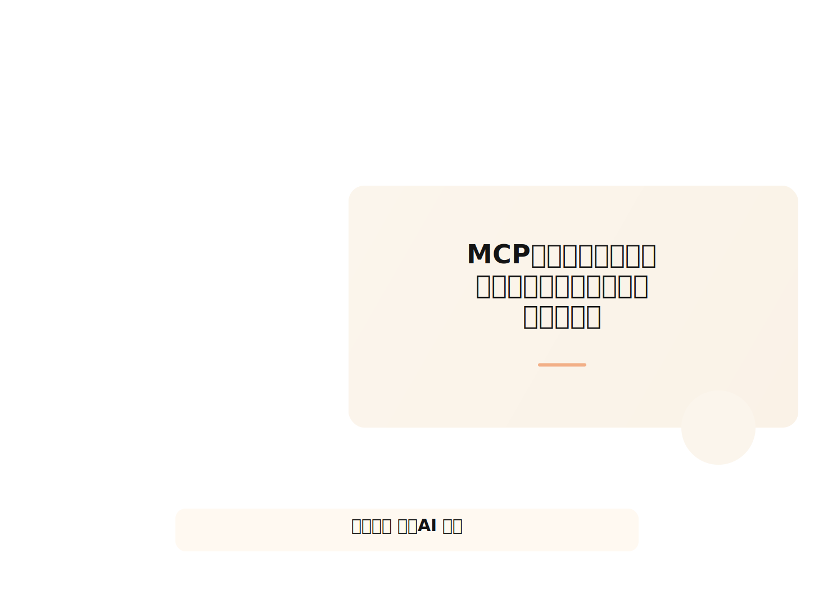
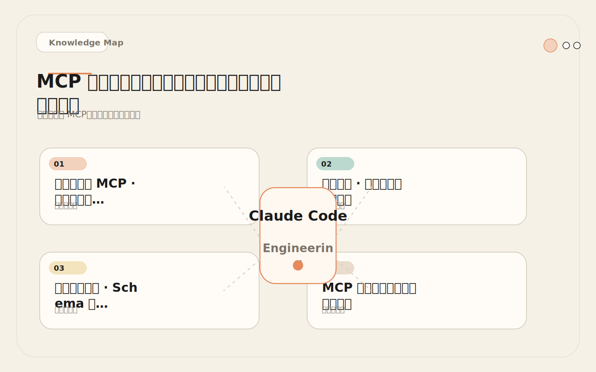
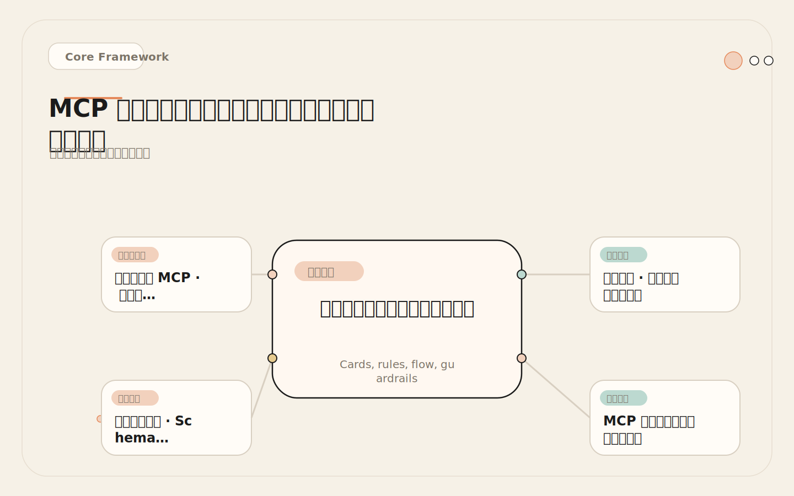
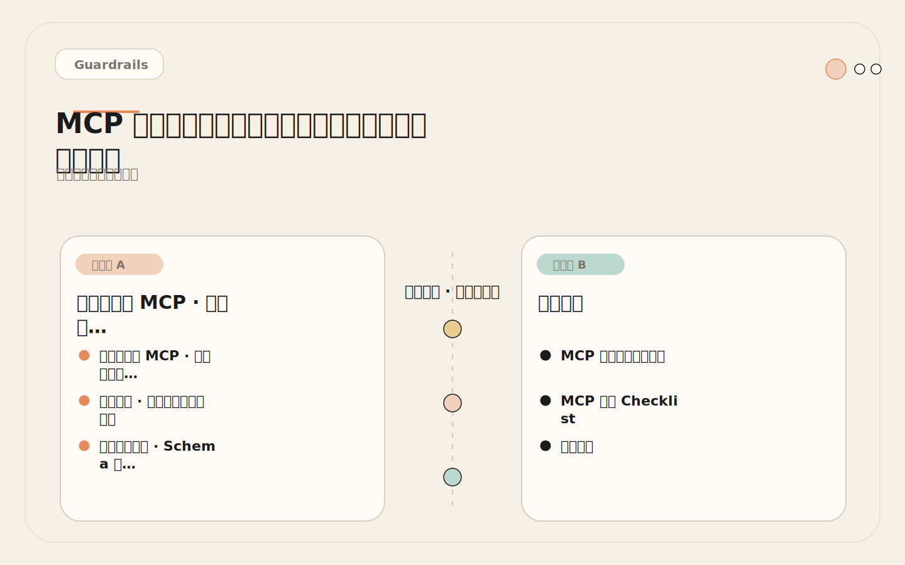
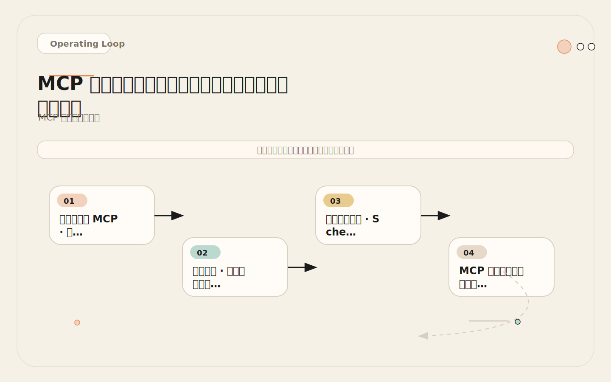

# MCP 心智模型：外部系统不是复制粘贴，而是工具接口

<!-- codex:cover ../../../assets/claude-code-engineering/17-mcp-mental-model-cover.svg -->

<!-- /codex:cover -->

**TL;DR：** MCP 让 Claude Code 把外部系统当作结构化工具来调用，而不是让人类做中间搬运工。但 MCP 不是万能胶水——理解它的协议边界、工具定义模型和风险特征，才能判断什么该接、什么不该接。

## 为什么需要 MCP：复制粘贴的工程代价

没有 MCP 时，开发者用 AI 辅助工程的典型工作流是：打开 GitHub issue 页面 → 复制标题和正文 → 粘贴到 Claude Code 聊天窗口 → 再去 Sentry 复制错误日志 → 再去数据库客户端复制查询结果 → 最后让 AI 分析。这个过程有三个工程问题：

<!-- codex:illustration 17-mcp-mental-model/01-overview-knowledge-map.svg -->

<!-- /codex:illustration -->

1. **信息截断。** Issue 评论区可能有 20 条讨论，你只会复制最新一条。PR 里的 review comment 和 CI 日志可能散布在多个 tab 中，手动选择必然遗漏。
2. **格式丢失。** GitHub Markdown 渲染后的内容，粘贴到聊天会丢失结构化信息。Sentry 的 stack trace 经过富文本编辑器粘贴后，换行和缩进常常错乱。数据库查询结果从表格变成无格式的文本。
3. **单向传输。** 你只能把外部信息搬进 AI，但 AI 无法回到原系统做进一步操作。AI 说"请给我这个 issue 的关联 PR"，你又要手动去搜索、复制、粘贴。

这不是"不方便"的问题，而是工程效率的系统性瓶颈。每次复制粘贴都引入信息衰减，每次手动选择都可能遗漏关键上下文，而单向传输让 AI 永远只能基于不完整的信息做判断。

MCP（Model Context Protocol）解决的是"让 AI 以结构化方式访问外部系统"的问题。它不是 API 网关，不是数据管道，而是一套让 Claude Code 把外部系统当作工具来调用的协议规范。

## 协议架构：三个角色的职责边界

MCP 协议涉及三个角色：

<!-- codex:illustration 17-mcp-mental-model/02-framework-core-structure.svg -->

<!-- /codex:illustration -->

```text
┌─────────────────┐     ┌─────────────────┐     ┌─────────────────┐
│   Claude Code   │     │    Transport     │     │   MCP Server    │
│   (MCP Client)  │────→│  (stdio/SSE)     │────→│  (External Svc) │
│                 │←────│                  │←────│                 │
└─────────────────┘     └─────────────────┘     └─────────────────┘
     调用方                 传输通道                 服务提供方
```

**MCP Client（Claude Code）** 是工具调用发起方。它解析用户意图、匹配可用的 MCP 工具、构造调用参数、处理返回结果。Claude Code 不直接连接外部系统，而是通过 MCP 协议与 server 通信。

**Transport（传输层）** 负责在 client 和 server 之间传递消息。MCP 支持两种传输方式：

| 传输方式 | 适用场景 | 特征 |
|---------|---------|------|
| `stdio` | 本地运行的 MCP server | Claude Code 启动 server 子进程，通过标准输入/输出通信。Server 进程生命周期由 Claude Code 管理 |
| `SSE` | 远程运行的 MCP server | 通过 HTTP + Server-Sent Events 通信。Server 可以部署在任意位置 |

大多数场景使用 `stdio`。Claude Code 启动时根据 `settings.json` 中的配置，spawn 对应的 server 进程。如果 server 进程崩溃，Claude Code 会尝试重启它。

**MCP Server** 是外部系统的适配层。它的职责是把外部系统的能力暴露为 MCP 工具。一个 GitHub MCP server 会把 GitHub API 封装成 `list_issues`、`get_pr_diff`、`search_code` 等工具，每个工具有明确的输入输出 schema。

关键理解：MCP server 不是外部系统本身，而是外部系统的适配器。你不需要给外部系统安装任何东西，只需要运行一个 server 进程，它负责和外部系统通信。

## 工具定义模型：Schema 驱动的契约

MCP 工具的定义包含四个要素：

```json
{
  "name": "search_issues",
  "description": "Search GitHub issues in a repository with filters for state, labels, and assignees.",
  "inputSchema": {
    "type": "object",
    "properties": {
      "owner": { "type": "string", "description": "Repository owner" },
      "repo": { "type": "string", "description": "Repository name" },
      "state": { "type": "string", "enum": ["open", "closed", "all"], "default": "open" },
      "labels": { "type": "array", "items": { "type": "string" } }
    },
    "required": ["owner", "repo"]
  }
}
```

- **name**：工具标识符。Claude Code 根据这个名称匹配用户意图到具体工具。
- **description**：自然语言描述。Claude Code 读这个描述来理解工具的用途和适用场景。这段描述的质量直接影响工具被正确调用的概率。
- **inputSchema**：JSON Schema 格式的参数定义。它约束了 Claude Code 传给工具的参数类型和结构。这不是建议，而是强制校验——参数类型不匹配会被 server 拒绝。
- **输出**：工具的返回值。MCP 规范支持文本、图片和嵌入式资源。Claude Code 接收返回值后，将其作为工具调用结果展示给用户并用于后续推理。

这个模型的关键含义：Claude Code 不需要"知道"GitHub API 怎么用，它只需要理解工具的 name、description 和 inputSchema。MCP server 负责处理所有 API 细节——认证、分页、错误处理、速率限制。

## MCP 工具和内置工具的本质区别

Claude Code 有两类工具：内置工具和 MCP 工具。

```text
内置工具（Built-in Tools）：
  - Read、Edit、Write、Bash、Grep、Glob 等
  - 由 Claude Code 自身提供，不需要配置
  - 功能和行为由 Anthropic 定义
  - 权限由 Claude Code 的 permission system 控制

MCP 工具（External Tools）：
  - 由第三方 MCP server 提供，需要显式配置
  - 功能和行为由 server 实现决定
  - 权限由 MCP token + Claude Code permission 双重控制
  - 可用性依赖 server 进程运行状态
```

差异的核心在于**可控性**。内置工具的行为是确定性的——Read 读文件、Edit 替换字符串，Claude Code 完全理解它们的语义。MCP 工具的行为由 server 实现，Claude Code 只能依赖 description 来推断行为。如果 description 写得不好或者有意误导，Claude Code 可能误用工具。

这个差异直接影响信任模型：内置工具可以默认信任（虽然仍需权限控制），MCP 工具需要经过验证才能信任。

## 真实配置：settings.json 中的 MCP 声明

以下是一个真实的 `settings.json` MCP 配置，包含两个 MCP server：

```json
{
  "mcpServers": {
    "github": {
      "command": "npx",
      "args": ["-y", "@modelcontextprotocol/server-github"],
      "env": {
        "GITHUB_PERSONAL_ACCESS_TOKEN": "${GITHUB_MCP_TOKEN}"
      }
    },
    "sentry": {
      "command": "npx",
      "args": ["-y", "@modelcontextprotocol/server-sentry"],
      "env": {
        "SENTRY_AUTH_TOKEN": "${SENTRY_MCP_TOKEN}",
        "SENTRY_ORG": "my-org",
        "SENTRY_PROJECT": "backend"
      }
    }
  }
}
```

配置解读：

- **command**：启动 server 的命令。`npx -y` 表示使用 npx 运行包，`-y` 自动确认安装。
- **args**：命令参数。第一个参数是 MCP server 的 npm 包名。
- **env**：传递给 server 的环境变量。Token 通过环境变量注入，而不是硬编码在配置文件中。`${GITHUB_MCP_TOKEN}` 引用 shell 环境变量，实际值存储在 `.env` 或 secret manager 中。

Claude Code 启动时会为每个 server 配置 spawn 一个子进程。如果 server 启动失败（包未安装、token 缺失），对应的工具在该会话中不可用。

## 什么系统值得接 MCP

不是所有外部系统都适合接 MCP。判断标准是：**这个系统的状态是否影响 AI 的工程判断？人工搬运它的信息是否是日常瓶颈？**

### 适合接 MCP 的系统

| 系统 | 为什么适合 | 推荐起始权限 |
|------|-----------|------------|
| GitHub | AI 编码的核心上下文源：issue 定义任务、PR 承载修改、CI 给出反馈 | 只读（read:repo, read:org） |
| Sentry / Datadog | 线上错误和性能数据是 bug 分析的关键输入 | 只读（read:project, read:issue） |
| Linear / Jira | 需求描述、验收标准、优先级影响实现决策 | 只读（read:project, read:issue） |
| Figma | 设计规范、组件 token、页面结构影响 UI 实现 | 只读（read:file） |
| 数据库（read-only replica） | Schema 理解和查询分析是后端开发的基础 | 只读元数据 + SELECT 权限 |
| Notion / Confluence | 技术方案、架构决策记录、API 文档 | 只读（read:page, read:database） |

这些系统的共同特征：

1. **读多写少。** 日常使用以获取信息为主，写入是低频操作。
2. **结构化数据。** API 返回 JSON，可以映射为清晰的 inputSchema。
3. **已有成熟的 API。** MCP server 不需要从零实现，只是 API 的适配层。
4. **人工搬运成本高。** 信息量大、格式复杂、需要频繁切换上下文。

### 不适合接 MCP 的系统

| 系统 | 为什么不适合 | 替代方案 |
|------|-----------|---------|
| 生产数据库（写权限） | 单次误操作可能导致数据丢失或表锁 | 只读 replica + 人工执行写入 |
| Secrets manager | MCP server 进程和日志可能暴露密钥 | 通过 PreToolUse Hook 管控，不接 MCP |
| 认证系统 | 权限变更影响全局安全 | 完全由人工操作 |
| 生产部署系统 | 部署操作不可逆，AI 不应自动执行 | CI/CD 流水线，人工触发 |
| 支付系统 | 涉及资金流转，任何误操作都有直接经济损失 | API 层做严格限流和审计 |

这些系统的共同特征：写操作的后果不可逆或代价极高，AI 的误判会直接转化为生产事故。MCP 的价值在于信息获取和轻量交互，不在于替代人类做高风险决策。

## 决策矩阵：接还是不接

```text
判断流程：

1. AI 做这个任务需要外部系统的实时状态吗？
   → 不需要：不需要 MCP
   → 需要：继续

2. 这个状态能通过简单文件/API 获取吗？
   → 能，且频率 < 1 次/天：手动获取即可
   → 不能，或频率 ≥ 3 次/天：继续

3. 接入后的写操作后果可逆吗？
   → 可逆（如创建草稿、添加标签）：适合接
   → 不可逆（如删除数据、合并主分支、部署生产）：不适合接，或严格只读

4. MCP server 有可信来源吗？（官方或社区高星项目）
   → 有：继续
   → 没有：自建 server 或不接

5. Token 权限可以精确控制到只读吗？
   → 可以：适合接
   → 不可以（如只有全局 admin token）：先解决权限问题
```

量化版本：

<!-- codex:illustration 17-mcp-mental-model/04-compare-guardrails.svg -->

<!-- /codex:illustration -->

| 条件 | 分数 |
|------|------|
| AI 每天需要访问该系统 ≥ 3 次 | +2 |
| 人工搬运该系统信息的耗时 ≥ 5 分钟/次 | +2 |
| 系统数据结构化（有 API、返回 JSON） | +1 |
| 该系统已有成熟的 MCP server | +1 |
| 该系统支持精确的只读权限 | +1 |
| 该系统有不可逆的写操作 | -3 |
| 该系统涉及敏感数据（密钥、用户数据、资金） | -2 |
| 该系统没有官方或高信任的 MCP server | -1 |

**决策：总分 ≥ 3 时考虑接入。总分 ≤ 0 时不要接入。** 介于两者之间的，先从只读开始试验。

## MCP vs 复制粘贴：量化对比

以"分析一个 Sentry 错误并定位代码"为例：

```text
复制粘贴模式：
  1. 打开 Sentry → 找到错误 → 复制错误消息和 stack trace
  2. 打开 Claude Code → 粘贴错误信息
  3. AI 分析后说"请给我最近的部署记录"
  4. 打开 GitHub → 复制最近 commits
  5. 粘贴回 Claude Code
  6. AI 说"请查看这个文件的最近变更"
  7. 打开 GitHub → 复制 diff
  8. 粘贴回 Claude Code
  总计：4 次上下文切换，3 次手动复制，信息截断风险 3 处
  预计耗时：15-20 分钟

MCP 模式：
  1. 在 Claude Code 中说"分析最近一个 Sentry 错误"
  2. AI 通过 Sentry MCP 获取错误详情
  3. AI 通过 GitHub MCP 查询最近部署和 diff
  4. AI 综合分析并给出修复方案
  总计：0 次上下文切换，0 次手动复制，信息截断风险 0
  预计耗时：2-3 分钟
```

MCP 的效率优势不仅是"省了几次复制粘贴"。它消除了信息截断——AI 可以获取完整上下文而不是人类选择后的片段。它还消除了往返等待——AI 可以在单次推理链中连续查询多个系统，而不需要等人类做中间搬运。

## 失败案例：生产数据库写权限导致表锁

### 经过

一个 6 人后端团队将生产数据库接入了 MCP，方便 Claude Code 理解数据模型和查询数据。配置时使用了数据库管理员账号，拥有完整读写权限。

某次会话中，开发者让 Claude Code "分析用户表的数据分布"。Claude Code 通过 MCP 执行了以下查询：

```sql
SELECT COUNT(*), status, DATE(created_at) as day
FROM users
GROUP BY status, day
ORDER BY day DESC;
```

这张 `users` 表有 200 万行数据。在没有合适索引的情况下，这个 GROUP BY 查询触发了全表扫描和临时表排序。查询执行期间，`users` 表被锁定（取决于数据库引擎和隔离级别），所有写入请求被阻塞。

持续 45 秒后，生产环境的用户注册和登录接口开始超时。监控报警触发。

### 根因

1. **使用生产数据库而非只读副本。** MCP 直连生产主库，查询直接在生产负载上执行。
2. **Token 拥有写权限。** 虽然这次只执行了 SELECT，但权限模型没有区分读和写——token 能做任何事。
3. **没有查询复杂度限制。** MCP server 没有对查询的执行时间或扫描行数做限制。
4. **没有 PreToolUse Hook 做审计。** MCP 工具调用直接执行，没有经过人工确认。

### 修复

```text
1. 立即：将 MCP 数据库连接从生产主库切换到只读副本
2. 短期：
   - 创建专用 MCP 数据库用户，只授予 SELECT 权限
   - 在 MCP server 配置中添加查询超时限制（如 5 秒）
   - 添加 PreToolUse Hook，要求所有数据库 MCP 调用经过确认
3. 长期：
   - 数据库 MCP server 只暴露 schema 元数据和样例数据查询
   - 复杂分析查询走独立的 OLAP 系统，不走 OLTP 生产库
```

修复后的数据库 MCP 配置：

```json
{
  "mcpServers": {
    "database": {
      "command": "npx",
      "args": ["-y", "@modelcontextprotocol/server-postgres"],
      "env": {
        "DATABASE_URL": "${DB_READ_REPLICA_URL}",
        "QUERY_TIMEOUT_MS": "5000",
        "MAX_ROWS": "100",
        "ALLOWED_OPERATIONS": "SELECT,EXPLAIN"
      }
    }
  }
}
```

## MCP 接入的工程纪律

从失败案例中提取的通用纪律：

<!-- codex:illustration 17-mcp-mental-model/03-flow-operating-loop.svg -->

<!-- /codex:illustration -->

1. **只读优先。** 任何新接入的 MCP server，前两周只允许只读权限。只有在只读不足以完成真实任务时，才逐个工具开放写入。很多团队急于让 AI "全自动"，第一天就给写权限。结果是第一天就出事。只读阶段的价值不仅是安全——它让团队熟悉 MCP 的调用模式、token 消耗和输出格式，为后续开放写入打下认知基础。
2. **最小权限 token。** MCP token 的权限应该精确到"这个 server 需要的最小权限集"。不要复用 admin token 或全局 token。每个 MCP server 应该有独立的 token，权限范围精确到操作级别。如果创建精确权限的 token 需要 10 分钟，这 10 分钟是值得投入的——它可能避免了数小时的故障排查和生产恢复。
3. **环境隔离。** 数据库接只读副本，不要接主库。API 接 staging 环境，不要接生产。环境隔离的成本很低（一个只读副本的运维成本远低于一次生产事故的损失），但防护效果非常直接——即使 AI 判断完全错误，影响范围也被限制在非生产环境中。
4. **审计日志。** 所有 MCP 调用应该有可追溯的日志。PreToolUse Hook 可以记录每次调用的工具名、参数和调用者。审计日志不是"出了事再查"的被动工具，而是"预防下一次事故"的主动机制。当团队回顾一周的 MCP 使用模式时，经常能发现权限过大的证据——比如 AI 在只应该搜索 issue 的时候调用了创建分支的工具。
5. **输出限制。** MCP server 应该限制单次返回的数据量。无限制的输出会撑爆 Claude Code 的上下文窗口。建议的默认上限是 10000 tokens 或 1000 行，超出时截断并提示用户用更精确的查询缩小范围。

## MCP 和内置工具的协作模式

理解了 MCP 工具和内置工具的区别后，关键问题是：在一个任务中，如何分配 MCP 工具和内置工具的职责？

答案是按操作对象的属性分工：

```text
操作对象 = 本地文件系统 → 使用内置工具（Read、Edit、Write、Grep、Glob）
操作对象 = 外部系统    → 使用 MCP 工具（GitHub、Sentry、数据库等）

混合场景：
  任务："修复 Sentry 上的登录错误"

  Step 1: MCP（Sentry）→ 获取错误详情
  Step 2: MCP（GitHub）→ 搜索相关代码
  Step 3: 内置（Read）→ 读取本地代码文件
  Step 4: 内置（Edit）→ 修改代码
  Step 5: 内置（Bash）→ 运行测试
  Step 6: MCP（GitHub）→ 创建修复 PR（需要确认）

  外部系统用 MCP，本地操作用内置工具，各司其职。
```

不应该出现的反模式：

```text
反模式：用 MCP 获取本地也能获取的信息
  → 比如通过 GitHub MCP 的 get_file_contents 读取本地已有文件
  → 应该直接用内置 Read 工具，更快、更可靠、不消耗 API 额度

反模式：把 MCP 当文件系统用
  → 比如通过数据库 MCP 存储中间状态
  → MCP 不是数据库，每次调用都是网络请求，应该用本地文件

反模式：MCP 链式调用过长
  → A MCP → B MCP → C MCP → D MCP
  → 超过 3 个 MCP 的串行调用链，延迟和失败率都会急剧上升
  → 拆分为多个步骤，每步不超过 2 个 MCP
```

## MCP 不适合解决的问题

理解 MCP 的边界和了解它的能力一样重要。以下问题不应该用 MCP 解决：

**用 MCP 替代 API 集成。** MCP 是 AI 的工具接口，不是应用的服务网格。如果你的目标是让两个系统自动同步数据，应该用消息队列或 ETL 管道，不应该让 AI 在中间做搬运工。AI 适合做"需要判断的决策"，不适合做"规则确定的数据同步"。

**用 MCP 实现实时监控。** MCP 是请求-响应模型，不是事件订阅模型。你不能让 MCP server "在新错误出现时主动通知 AI"。监控报警应该走传统的告警通道（Slack、PagerDuty），AI 只在收到人工请求后通过 MCP 获取详情。

**用 MCP 做批量数据迁移。** MCP 的单次调用有 token 和时间限制，不适合处理大批量数据。如果需要迁移 10000 条用户数据，写一个脚本比让 AI 通过 MCP 一条条操作高效得多。

**用 MCP 替代 CI/CD。** 部署、回滚、灰度发布这些操作需要确定性保证，不应该经过 AI 的推理链路。CI/CD 流水线的每一步都应该可预测、可重复、可审计，把 AI 的不确定性引入这个链路只会增加故障风险。

## MCP 接入 Checklist

在决定接入任何 MCP server 之前，完成以下检查。每一条都是前人踩过的坑：

```text
接入前检查：
  [ ] 确认该系统的信息是 AI 日常工作中需要的高频输入
  [ ] 确认手动搬运信息的成本 ≥ 5 分钟/次
  [ ] 确认该系统有成熟的 MCP server（官方或社区高星项目）
  [ ] 确认该系统支持精确的只读权限
  [ ] 确认该系统的写操作后果可逆（或不需要写权限）
  [ ] 确认 token 可以存储在安全位置（非明文配置文件）
  [ ] 确认有 PreToolUse Hook 机制做审计

配置时检查：
  [ ] Token 权限是当前阶段的最小必需集
  [ ] 数据库连接指向只读副本
  [ ] API 连接指向非生产环境
  [ ] MCP server 版本已锁定
  [ ] 输出大小有限制

运行时检查（每周）：
  [ ] 审查 MCP 调用日志
  [ ] 检查是否有非预期的写操作
  [ ] 确认 token 没有过期
  [ ] 评估 token 消耗趋势
```

## 交叉参考

- [18 GitHub MCP](./18-github-mcp.md)：第一个 MCP 的完整接入指南，包含权限分级和真实工作流
- [19 高价值 MCP 场景](./19-high-value-mcp-scenarios.md)：数据库、监控、设计系统等场景的深入分析和权限矩阵
- [20 MCP + Skill](./20-mcp-plus-skills.md)：如何让 MCP 工具按团队 SOP 被正确使用
- [21 MCP 风险](./21-mcp-risks.md)：Token、越权、工具投毒和提示注入的威胁模型和防护策略
- [23 PreToolUse 防护](./23-pretooluse-guardrails.md)：用 Hook 拦截和审计 MCP 调用的工程实现


