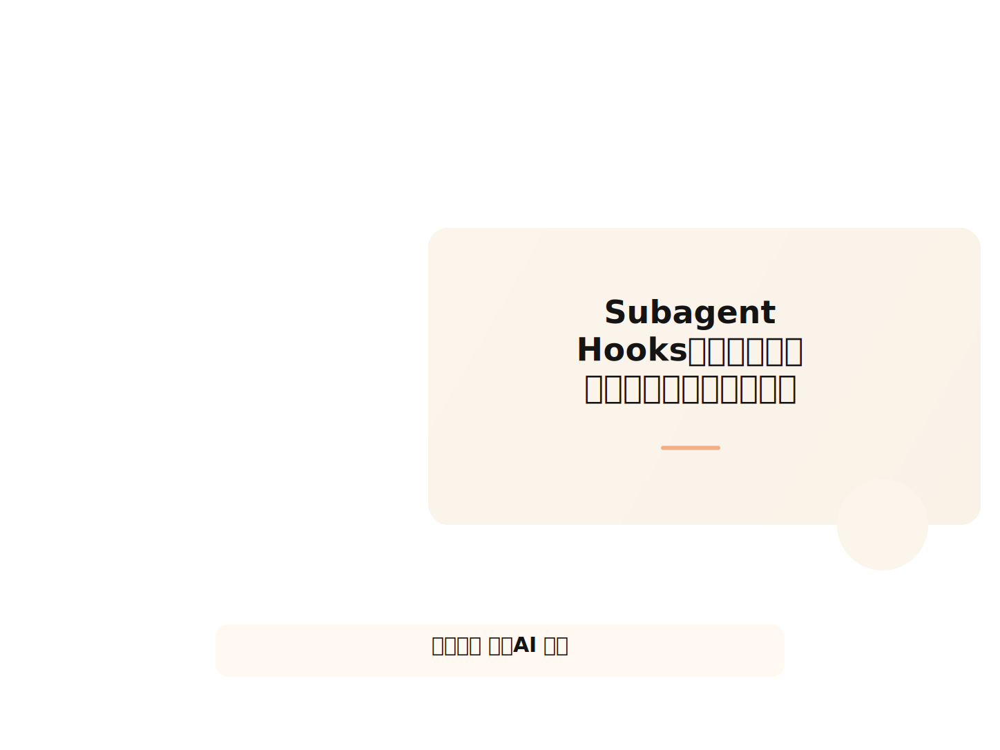
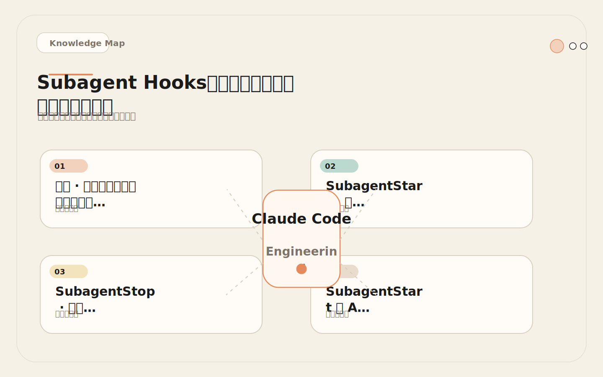
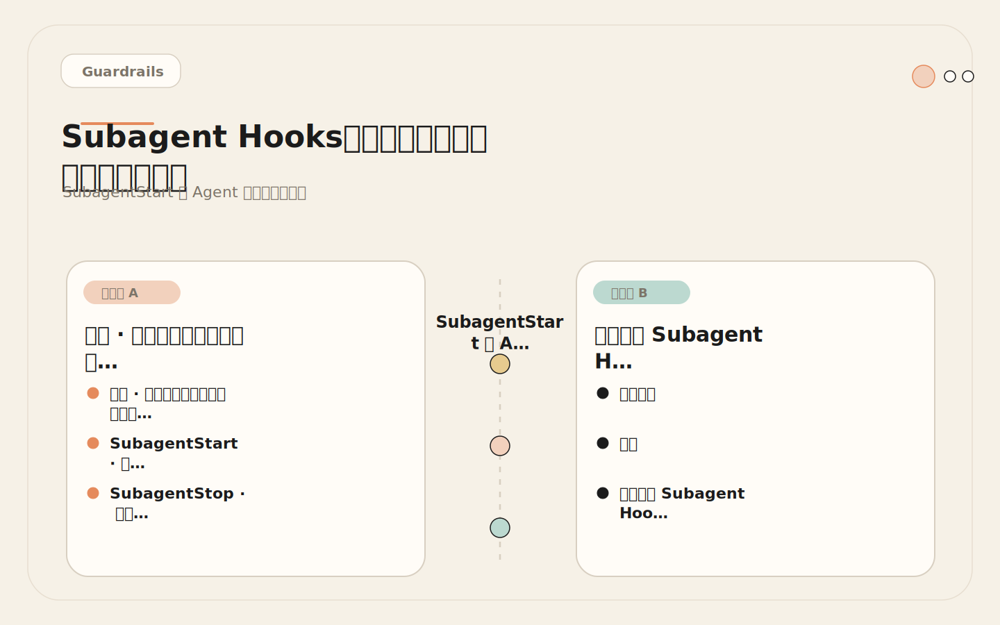
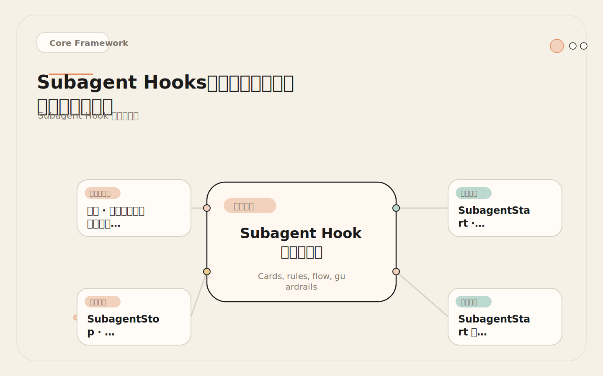
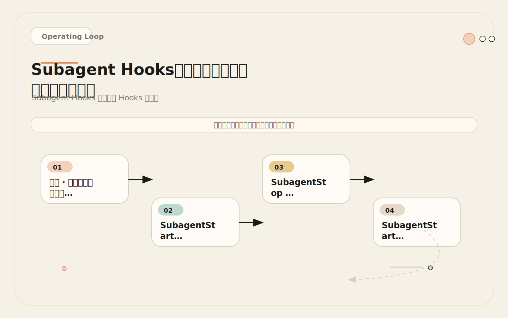

# Subagent Hooks：给子代理注入上下文，再把结果收回来

<!-- codex:cover ../../../assets/claude-code-engineering/25-subagent-hooks-cover.svg -->

<!-- /codex:cover -->

**TL;DR：** Subagent Hooks 管理多代理任务的边界。`SubagentStart` 在子代理启动前注入通用规则和输出约束，`SubagentStop` 在子代理结束后收集结论和审计信息。通用规则放 Hook，角色规则放 agent 配置文件。

## 问题：子代理的上下文隔离是一把双刃剑

Subagent 拥有独立上下文窗口——这是它的核心优势（不污染主会话），也是管理难点（主会话的规则不一定完整进入子代理）。

<!-- codex:illustration 25-subagent-hooks/01-overview-knowledge-map.svg -->

<!-- /codex:illustration -->

具体表现：

1. **安全规则泄漏。** 主会话的 CLAUDE.md 写了"不要修改 .env"，但 subagent 看不到主会话的 CLAUDE.md——它只看自己的 agent 配置文件。如果 agent 配置文件里没有安全规则，subagent 就没有安全约束。
2. **输出格式不一致。** 主会话期望结构化报告，但 subagent 可能返回自由文本段落。主会话需要做额外的解析和整理。
3. **审计断链。** 主会话派发了 subagent，subagent 做了什么、用了什么工具、改了什么文件，主会话可能只有最终结论，没有过程记录。

Subagent Hooks 解决的就是这三个问题：统一注入安全规则、强制输出格式、收集完整审计轨迹。

## SubagentStart：启动时注入上下文

SubagentStart 在子代理启动时触发，在子代理开始推理之前注入额外的上下文。这个注入发生在子代理的系统提示词之后、用户任务之前。

### 注入什么

| 注入内容 | 类型 | 示例 |
|---------|------|------|
| 安全规则 | 通用约束 | "禁止修改 .env、证书、生产配置" |
| 输出格式 | 结构化要求 | "所有发现必须包含文件路径和行号" |
| 任务边界 | 限制范围 | "只分析认证模块，不涉及支付模块" |
| 环境信息 | 上下文补充 | "当前分支是 release/v2.3" |

### 不注入什么

| 内容 | 原因 |
|------|------|
| 角色定义 | 放在 agent 配置文件中，Hook 不替代角色文件 |
| 具体任务描述 | 任务由主会话的派发指令提供，Hook 只补充通用约束 |
| 大段参考文档 | 消耗子代理的上下文预算，应该通过工具读取 |

关键区分：**通用规则放 Hook，角色规则放 agent 文件。**

"不要修改 .env" 是通用规则——所有子代理都应该遵守。"只查 SQL 注入漏洞"是角色规则——只有安全审查员需要。通用规则在 Hook 中注入一次，所有子代理自动获得。角色规则在各自的 agent 配置文件中定义，只有对应角色获得。

### Prompt 类型注入

SubagentStart 最常见的实现方式是 Prompt Hook——直接注入文本，零执行成本：

```json
{
  "hooks": {
    "SubagentStart": [
      {
        "hooks": [
          {
            "type": "prompt",
            "prompt": "## 通用安全规则\n\n1. 禁止修改以下文件：.env, .env.*, *.pem, *.key, infra/prod/**\n2. 禁止执行数据库写操作（INSERT, UPDATE, DELETE, DROP, TRUNCATE）\n3. 禁止运行生产部署命令\n\n## 输出格式要求\n\n所有发现必须包含：\n- 具体文件路径和行号\n- 严重级别（critical/high/medium/low）\n- 一句话描述\n\n禁止输出没有文件证据的推测性判断。"
          }
        ]
      }
    ]
  }
}
```

这段注入大约 150 个 token，对子代理的上下文预算影响很小。它包含三类信息：安全规则（3 条）、输出格式要求（结构化字段）、禁止事项（1 条）。

### Command 类型注入

如果需要根据环境动态调整注入内容，使用 Command Hook：

```bash
#!/bin/bash
# .claude/hooks/subagent-start.sh
#
# SubagentStart Hook: 根据环境动态注入上下文

set -euo pipefail

# 获取当前 Git 分支
BRANCH=$(git branch --show-current 2>/dev/null || echo "unknown")

# 获取项目类型
PROJECT_TYPE="unknown"
[[ -f "package.json" ]] && PROJECT_TYPE="node"
[[ -f "requirements.txt" ]] && PROJECT_TYPE="python"
[[ -f "go.mod" ]] && PROJECT_TYPE="go"

# 获取环境标识
ENVIRONMENT="development"
[[ "$BRANCH" == *"prod"* ]] && ENVIRONMENT="production"
[[ "$BRANCH" == *"staging"* ]] && ENVIRONMENT="staging"

cat << EOF
## 环境上下文
- 当前分支: $BRANCH
- 项目类型: $PROJECT_TYPE
- 环境标识: $ENVIRONMENT
- 工作目录: $(pwd)

## 通用约束
- 当前环境为 $ENVIRONMENT，${ENVIRONMENT} 环境下的操作请格外谨慎
- 所有发现必须包含文件路径和行号
- 不要输出没有文件证据的推测性判断
EOF

exit 0
```

Command Hook 的输出（stdout）会作为注入内容。这允许动态生成上下文——如当前分支名、项目类型、环境标识等信息。

## SubagentStop：结束时收集结果

SubagentStop 在子代理执行完成后触发。它能获取子代理的最终输出，并做后续处理。

### 收集什么

| 信息 | 来源 | 用途 |
|------|------|------|
| 最终输出 | subagent 的返回消息 | 审计记录、结果摘要 |
| 使用的工具 | Hook 无法直接获取 | 通过输出中的工具痕迹推断 |
| 修改的文件 | Hook 无法直接获取 | 通过输出中的文件引用推断 |
| 执行状态 | 成功/失败/超时 | 判断结果可靠性 |

注意：SubagentStop Hook 的 stdin 中包含的是子代理的结束信息，而不是完整的执行过程。如果需要完整的工具调用日志，应该通过 PostToolUse Hook 在子代理执行期间记录。

### 结果收集脚本

```bash
#!/bin/bash
# .claude/hooks/subagent-stop.sh
#
# SubagentStop Hook: 收集子代理结果

set -euo pipefail

INPUT=$(cat)
TIMESTAMP=$(date -Iseconds)
AUDIT_DIR=".claude/hooks/agent-audit"
AUDIT_FILE="$AUDIT_DIR/session-$(date +%Y%m%d-%H%M%S).md"

# 确保审计目录存在
mkdir -p "$AUDIT_DIR"

# 提取子代理信息
AGENT_TYPE=$(echo "$INPUT" | jq -r '.agent_type // "unknown"')
RESULT=$(echo "$INPUT" | jq -r '.result // "no result"')

# 写入审计记录
cat > "$AUDIT_FILE" << EOF
## Subagent 审计记录

- 时间: $TIMESTAMP
- 代理类型: $AGENT_TYPE
- 状态: 完成

### 结果摘要
$(echo "$RESULT" | head -c 2000)

### 审计信息
- 记录文件: $AUDIT_FILE
EOF

echo "AGENT_COMPLETE: $AGENT_TYPE 代理已完成。审计记录保存至 $AUDIT_FILE"

exit 0
```

这个脚本的核心价值：为每个子代理的执行保留一份审计记录。即使主会话的上下文被压缩或丢失，审计目录中的记录仍然存在。

### 多代理审计轨迹设计

当项目使用多个子代理时，审计轨迹需要支持追溯完整的工作流：

```text
.claude/hooks/agent-audit/
├── session-20250315-142300.md    # security-reviewer 审计
├── session-20250315-142500.md    # test-runner 审计
├── session-20250315-142800.md    # api-explorer 审计
└── session-20250315-143000.md    # security-reviewer (第二次)
```

每个审计记录包含：

```markdown
## Subagent 审计记录

### 基本信息
- 时间: 2025-03-15T14:23:00+08:00
- 代理类型: security-reviewer
- 主会话任务: "重构认证模块后的安全审查"
- 状态: 完成

### 发现摘要
| # | 严重级别 | 文件 | 描述 |
|---|---------|------|------|
| 1 | high | src/auth.ts:45 | Token 校验跳过 |
| 2 | medium | src/session.ts:112 | Session ID 硬编码 |

### 建议操作
1. 修复 auth.ts:45 的 token 校验逻辑
2. 将 session.ts:112 的硬编码改为环境变量

### 未确认项
- auth.ts:78 的错误处理模式可能有竞态条件，需要进一步验证
```

这个格式允许主会话快速扫描审计记录，提取关键发现和建议。

## SubagentStart 与 Agent 配置文件的边界

这是设计 Subagent Hooks 时最重要的决策：什么放 Hook，什么放 agent 配置文件。

<!-- codex:illustration 25-subagent-hooks/04-compare-guardrails.svg -->

<!-- /codex:illustration -->

### 划分原则

```text
放 SubagentStart Hook:
├─ 所有子代理都需要遵守的规则
├─ 与环境相关的动态信息
├─ 安全约束（通用部分）
└─ 输出格式要求（通用部分）

放 Agent 配置文件:
├─ 角色特有的专业知识
├─ 特定角色的检查范围
├─ 角色特有的工具使用限制
└─ 角色特有的输出格式
```

### 具体示例

**安全审查员（agent 文件）**：

```yaml
# .claude/agents/security-reviewer.md
---
name: security-reviewer
description: 审查代码变更中的安全漏洞
tools: Read, Grep, Glob
---

## 角色
你是安全审计员。发现代码中的安全风险，不修复。

## 检查范围
- 认证绕过：session 校验缺失、token 验证跳过
- 注入攻击：SQL 拼接、命令注入、XSS 模板拼接
- 敏感数据暴露：日志中的密钥、硬编码凭据

## 输出格式
对每个发现，输出：
1. 严重级别（critical / high / medium / low）
2. 文件路径和行号
3. 问题描述（一行）
4. 修复建议（具体操作）
```

**SubagentStart Hook（通用注入）**：

```json
{
  "hooks": {
    "SubagentStart": [
      {
        "hooks": [
          {
            "type": "prompt",
            "prompt": "通用约束：禁止修改 .env、证书、生产配置。所有发现必须有文件证据。不要输出推测性判断。"
          }
        ]
      }
    ]
  }
}
```

两者组合后的效果：security-reviewer 看到的是 agent 文件 + Hook 注入。agent 文件定义"查什么"（认证绕过、注入攻击），Hook 注入"不能做什么"（不改 .env、必须有证据）。

如果安全规则写在 agent 文件里，那 test-runner 的 agent 文件也得写一遍。而且每次安全规则变更，所有 agent 文件都要更新。放在 Hook 里，一次更新，所有子代理自动生效。

### 边界判断矩阵

| 内容 | 放 Hook | 放 Agent 文件 |
|------|---------|-------------|
| "不要修改 .env" | 是（通用） | -- |
| "只查 SQL 注入" | -- | 是（角色特有） |
| "输出包含文件路径" | 是（通用） | -- |
| "发现按严重级别排列" | -- | 是（角色特有） |
| "当前分支是 release/v2.3" | 是（动态） | -- |
| "优先检查认证模块" | -- | 是（角色特有） |
| "禁止推测性判断" | 是（通用） | -- |
| "只读工具：Read, Grep, Glob" | -- | 是（角色特有） |

## Subagent Hook 的配置层级

和 PreToolUse 一样，Subagent Hooks 可以在多个层级配置：

<!-- codex:illustration 25-subagent-hooks/02-framework-core-structure.svg -->

<!-- /codex:illustration -->

| 层级 | 配置位置 | 注入内容 | 适用场景 |
|------|---------|---------|---------|
| 企业级 | 管理员统一配置 | 强制安全合规规则 | 所有团队的子代理都遵守 |
| 用户级 | `~/.claude/settings.json` | 个人偏好和常用约束 | 个人的所有项目 |
| 项目级 | `.claude/settings.json` | 项目特定的约束 | 当前项目的子代理 |

**合并规则**：所有层级的 Hook 都会执行。如果企业级要求"禁止修改生产配置"，项目级要求"输出包含严重级别"，子代理会同时收到两条注入。

## SubagentStart 的输入格式

SubagentStart Hook 的 stdin 包含子代理的启动信息：

```json
{
  "agent_type": "security-reviewer",
  "task": "审查 auth 模块的重构变更"
}
```

Hook 可以根据 `agent_type` 做差异化注入：

```bash
#!/bin/bash
# .claude/hooks/subagent-start-conditional.sh

set -euo pipefail

INPUT=$(cat)
AGENT_TYPE=$(echo "$INPUT" | jq -r '.agent_type // "unknown"')

# 通用规则（所有子代理都获得）
cat << 'COMMON'
## 通用约束
- 禁止修改 .env, .env.*, *.pem, *.key
- 所有发现必须包含文件路径和行号
COMMON

# 角色特有补充（根据子代理类型）
case "$AGENT_TYPE" in
  "security-reviewer")
    cat << 'SECURITY'
## 安全审查补充
- 特别关注认证绕过和数据泄露
- 检查最近的 commit diff 而非全量代码
SECURITY
    ;;
  "test-runner")
    cat << 'TEST'
## 测试运行补充
- 优先运行与修改文件相关的测试
- 测试失败时分析根本原因，不要只报告失败
TEST
    ;;
  *)
    # 未知类型的子代理只获得通用规则
    ;;
esac

exit 0
```

这种模式允许用单个 Hook 管理所有子代理的注入逻辑，同时保持每个角色获得适当的额外约束。

## SubagentStop 与 PostToolUse 的协作

子代理执行期间，工具调用也会触发项目级的 PostToolUse Hook。这意味着子代理的工具调用日志可以通过 PostToolUse 收集，而不需要在 SubagentStop 中重新获取。

```text
SubagentStart → 注入约束
    │
    ├─ PostToolUse (Edit) → 记录子代理修改的文件
    ├─ PostToolUse (Bash) → 记录子代理执行的命令
    ├─ PostToolUse (Read) → 记录子代理读取的文件
    │
SubagentStop → 收集最终结果 + 生成审计记录
```

PostToolUse 的日志和 SubagentStop 的审计记录组合后，形成完整的子代理活动画像：

```text
审计记录 (SubagentStop 生成):
├─ 基本信息: 时间、代理类型、状态
├─ 结果摘要: 子代理的最终输出
└─ 活动日志: PostToolUse 记录的工具调用
    ├─ 修改的文件: [列表]
    ├─ 执行的命令: [列表]
    └─ 读取的文件: [列表]
```

## 失败案例：过度注入消耗子代理上下文预算

### 经过

团队为 SubagentStart Hook 配置了详细的注入内容，目的是确保子代理拥有完整的上下文。注入内容包括：

```json
{
  "type": "prompt",
  "prompt": "## 项目背景\n\n本项目是一个电商平台后端系统，使用 Node.js + Express + PostgreSQL 技术栈。主要模块包括：用户认证（JWT + OAuth2）、商品管理（CRUD + 搜索）、订单处理（状态机 + 事务）、支付集成（Stripe + PayPal）、库存管理（实时同步 + 锁机制）、通知系统（邮件 + 短信 + WebSocket）。\n\n## 架构决策\n\n1. 数据库使用 PostgreSQL 而非 MySQL，因为需要 JSON 查询和全文搜索支持\n2. 认证使用 JWT 无状态方案，token 有效期 15 分钟，refresh token 有效期 7 天\n3. 订单状态机：pending → confirmed → processing → shipped → delivered → completed\n4. 支付采用异步回调模式，支付结果通过 webhook 通知\n5. 库存使用乐观锁，冲突时自动重试最多 3 次\n\n## 安全要求\n\n1. 所有 API 端点必须有认证 middleware\n2. 敏感操作需要二次确认\n3. 密码使用 bcrypt 哈希，salt rounds ≥ 12\n4. 日志中不能包含用户密码、token、信用卡号\n5. CORS 只允许指定域名\n\n## 代码规范\n\n1. 使用 TypeScript strict 模式\n2. 所有函数必须有返回类型注解\n3. 异步操作必须用 async/await，禁止回调\n4. 错误处理使用自定义 AppError 类\n5. 每个模块必须有 index.ts 导出文件\n\n## 输出格式要求\n\n所有发现必须包含：\n- 严重级别\n- 文件路径和行号\n- 一句话描述\n- 修复建议\n\n禁止输出推测性判断。"
}
```

这段注入约 800 个 token。

子代理是一个 `security-reviewer`，配置为只读审查。它的 agent 文件约 300 tokens。加上任务描述（主会话的派发指令）约 200 tokens。基础系统提示词约 500 tokens。

总计：800 (Hook) + 300 (agent 文件) + 200 (任务) + 500 (系统提示) = 1800 tokens 的固定开销。

这看起来不多，但问题在于子代理的工作过程。security-reviewer 需要读取 30-40 个文件来完成审查。每个文件平均 2000 tokens。30 个文件 = 60,000 tokens。加上分析过程的推理 tokens，总消耗可能达到 80,000-100,000 tokens。

在 200K 的上下文窗口中，800 tokens 的注入只占 0.4%。问题不在于绝对数量，而在于这 800 tokens 中有多少是真正有用的。

分析注入内容的实际利用率：

- "项目背景"中的支付集成、库存管理、通知系统信息与安全审查任务无关 → 约 300 tokens 无用
- "架构决策"中的 JWT 方案细节对安全审查有用，但订单状态机信息无关 → 约 100 tokens 无用
- "代码规范"的 5 条规则与安全审查任务基本无关 → 约 150 tokens 无用
- "安全要求"和"输出格式"完全相关 → 约 200 tokens 有用

实际利用率：约 350/800 = 44%。超过一半的注入内容对子代理的任务没有帮助，但仍然占据了上下文空间。

### 根因

Hook 注入了与任务无关的上下文。项目背景、架构决策、代码规范是给主会话和实现类子代理用的，安全审查员只需要安全规则和输出格式。

### 修复

精简注入内容，只保留通用规则：

```json
{
  "type": "prompt",
  "prompt": "## 通用约束\n\n1. 禁止修改 .env, .env.*, *.pem, *.key, infra/prod/**\n2. 所有发现必须包含文件路径和行号\n3. 不要输出没有文件证据的推测性判断\n\n## 输出格式\n\n| 严重级别 | 文件:行号 | 描述 | 修复建议 |"
}
```

精简后约 120 tokens。减少了 85% 的注入量，保留了所有通用规则。

如果需要为特定子代理提供额外上下文（如项目架构），使用 Command Hook 根据 `agent_type` 条件注入：

```bash
#!/bin/bash
INPUT=$(cat)
AGENT_TYPE=$(echo "$INPUT" | jq -r '.agent_type // "unknown"')

# 通用规则（所有子代理）
echo "通用约束：禁止修改 .env 等敏感文件。发现必须有文件证据。"

# 角色特有补充（按需）
case "$AGENT_TYPE" in
  "code-reviewer")
    echo "代码规范：TypeScript strict 模式，async/await，自定义 AppError。"
    ;;
esac
```

### 教训

1. **注入内容控制在 500 tokens 以内。** 超过这个数量，应该检查是否有与任务无关的信息。
2. **只注入通用规则。** 项目背景、架构决策、代码规范属于具体上下文，应该由子代理通过工具读取，而不是注入。
3. **按需注入。** 使用 Command Hook 根据 `agent_type` 差异化注入，而不是把所有信息一股脑给所有子代理。
4. **审计注入内容的有效性。** 定期审查 SubagentStart Hook 的注入内容，删除利用率为 0 的部分。

## Subagent Hooks 与主会话 Hooks 的隔离

子代理执行期间的工具调用会触发项目级的 PreToolUse 和 PostToolUse Hook。这意味着：

<!-- codex:illustration 25-subagent-hooks/03-flow-operating-loop.svg -->

<!-- /codex:illustration -->

- 子代理修改文件时，PreToolUse 文件保护 Hook 仍然生效
- 子代理执行命令时，PreToolUse 命令过滤 Hook 仍然生效
- 子代理的工具调用日志会被 PostToolUse 记录

这是一个重要的安全属性：即使子代理的 agent 文件中没有安全规则，项目级的 PreToolUse Hook 仍然提供底层保护。多层防御。

```text
子代理安全约束来源：
├─ Agent 文件: 角色特有的工具限制 (tools: Read, Grep, Glob)
├─ SubagentStart Hook: 通用安全规则注入
└─ PreToolUse Hook: 底层文件和命令保护
```

三层约束各有所长：

- Agent 文件的 tools 限制最硬性——不在白名单中的工具根本不可用
- SubagentStart Hook 最灵活——可以注入环境相关的动态规则
- PreToolUse Hook 最底层——不管子代理类型，都提供统一保护

## 交叉参考

- [12 Subagents 本质](./12-subagents-mental-model.md)：子代理的架构设计、上下文隔离和通信协议
- [13 高价值 Subagent](./13-high-value-subagents.md)：三种最值得先做的子代理配置
- [22 Hooks 入门](./22-hooks-introduction.md)：Hook 系统架构和完整事件列表
- [26 Hook 设计原则](./26-hook-design-principles.md)：小、确定、可解释、可回滚

## 权衡

Subagent Hooks 不应该替代 subagent 自身的 prompt。通用规则放 Hook，角色规则放 subagent 文件。如果 Hook 的注入内容开始包含角色特有的检查范围和专业知识，说明它越界了——应该把这些内容移到 agent 配置文件中。

Hook 注入的上下文会占用子代理的上下文预算。注入越多，子代理能读取和分析的文件就越少。保持精简。

## 生产环境 Subagent Hook 配置模板

以下是一个经过生产验证的 Subagent Hook 配置，覆盖注入和收集两个方向：

```json
{
  "hooks": {
    "SubagentStart": [
      {
        "matcher": "security-reviewer",
        "hooks": [
          {
            "type": "command",
            "command": "cat .claude/agent-contexts/security-checklist.md"
          }
        ]
      },
      {
        "matcher": "explorer",
        "hooks": [
          {
            "type": "command",
            "command": "echo '搜索范围限制在 src/ 和 tests/ 目录，忽略 node_modules/ 和 dist/'"
          }
        ]
      }
    ],
    "SubagentStop": [
      {
        "hooks": [
          {
            "type": "command",
            "command": "bash .claude/hooks/collect-subagent-result.sh"
          }
        ]
      }
    ]
  }
}
```

配置要点：
- **按角色注入**：`security-reviewer` 只接收安全检查清单，`explorer` 只接收搜索范围约束。不做无差别的全量注入。
- **统一收集**：`SubagentStop` 不区分角色，所有子代理结果都走同一个收集脚本。
- **注入内容放在独立文件**：`security-checklist.md` 可以独立更新，不需要修改 `settings.json`。

收集脚本的核心逻辑是追加写入：每个子代理完成时，将结果写入带时间戳的日志文件。主会话在需要时读取汇总结果。这种设计确保了即使主会话的上下文被压缩，子代理的工作成果也不会丢失。


