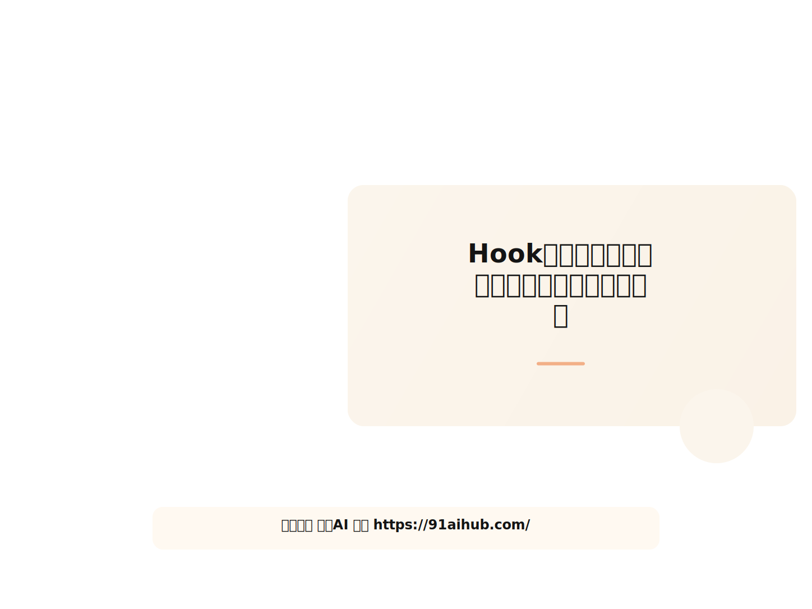
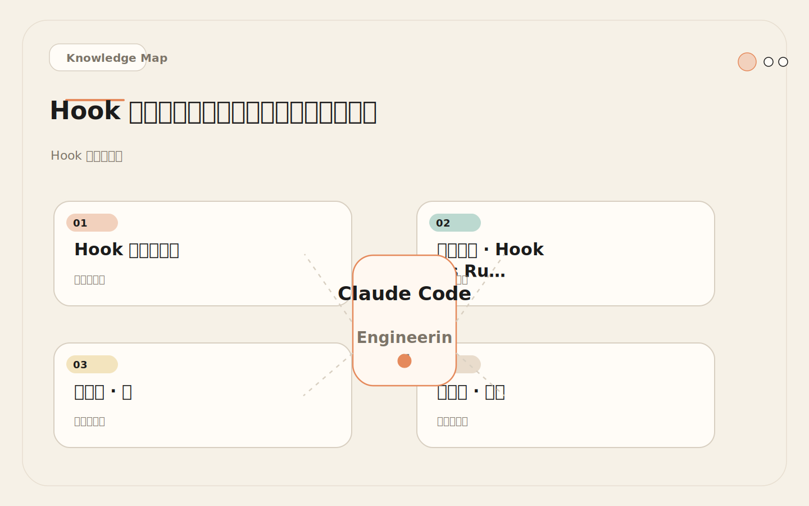
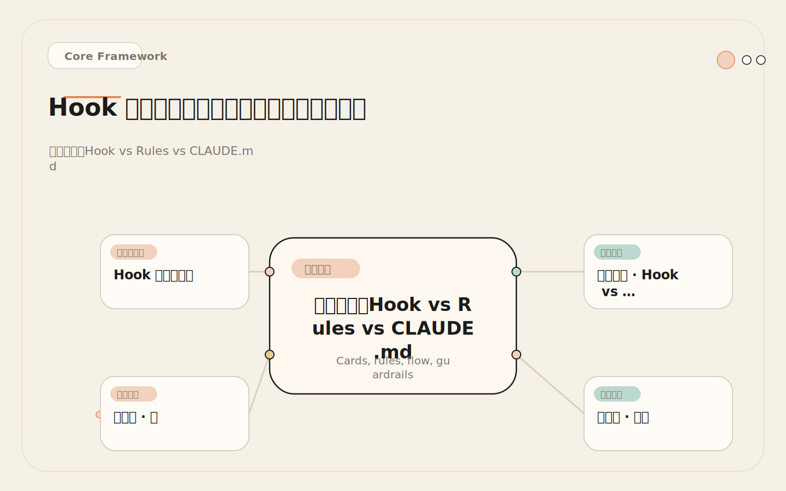
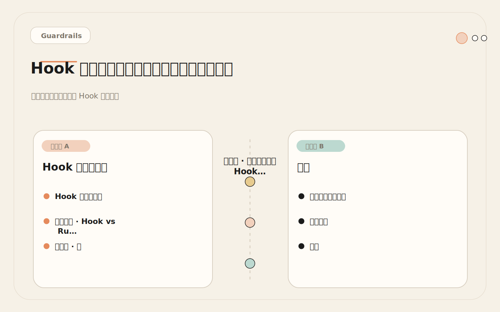
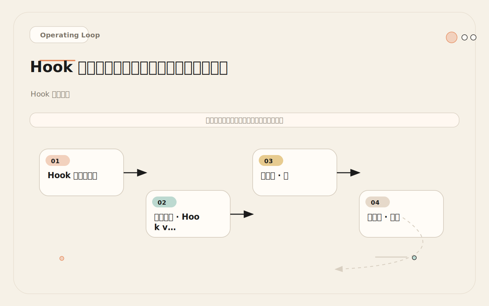

# Hook 怎么写才不翻车：小、确定、可解释、可回滚

<!-- codex:cover ../../../assets/claude-code-engineering/26-hook-design-principles-cover.svg -->

<!-- /codex:cover -->

**TL;DR：** Hook 是确定性治理层，不是第二个 Agent。四条硬性约束：小（代码 ≤ 50 行，复杂度评分 ≤ 20）、确定（同样 stdin → 同样退出码）、可解释（每个 exit 2 必须带规则编号和替代方案）、可回滚（可单独禁用，禁用即时生效）。违反任一条，上线前重写。

## Hook 的治理定位

Hook 系统在 Claude Code 工程体系中占据特定位置：它是介于 CLAUDE.md 的非确定性约束和 Permission System 的粗粒度控制之间的确定性脚本层。三层治理机制各有边界：

<!-- codex:illustration 26-hook-design-principles/01-overview-knowledge-map.svg -->

<!-- /codex:illustration -->

```text
治理层        机制            确定性   粒度     可审计
─────────────────────────────────────────────────────
CLAUDE.md    提示词指令       低      自由文本  无
Rules        路径作用域指令   低      目录级    无
Hooks        脚本            高      调用级    有退出码+输出
Permission   权限系统         高      工具级    有
```

Hook 不是万能的。它无法做语义判断（"这段代码安不安全"），无法理解上下文（"这次修改是否符合当前任务"）。它只能做模式匹配——路径模式、命令模式、文件名模式。试图让 Hook 超越模式匹配，就是在构建第二个 AI，而第二个 AI 没有推理能力。

## 决策矩阵：Hook vs Rules vs CLAUDE.md

选择治理机制时，依据以下矩阵：

<!-- codex:illustration 26-hook-design-principles/02-framework-core-structure.svg -->

<!-- /codex:illustration -->

```text
需求特征                          CLAUDE.md   Rules   Hook    Permission
─────────────────────────────────────────────────────────────────────────
"不要修改 .env 文件"              次选        --      首选     --
"修改 src/auth/ 后要跑测试"       次选        次选    首选     --
"代码风格遵循 ESLint"             首选        --      --       --
"这个项目使用 React 18"           首选        次选    --       --
"禁止使用 rm -rf"                 --          --      首选     --
"Bash 工具需要授权"               --          --      --       首选
"生成的测试放在 tests/ 目录"      首选        次选    --       --
"PR 描述必须包含变更范围"         次选        --      首选     --
"子代理必须输出 JSON 格式"        次选        --      首选     --
"禁止安装新依赖"                  次选        --      首选     --
```

选择逻辑：

```text
判断路径：
├─ 是否需要阻断工具调用？
│   └─ 是 → Hook (PreToolUse) 或 Permission
│       ├─ 阻断条件可以用模式匹配表达 → Hook
│       └─ 阻断条件是工具级别的 → Permission
│
├─ 是否需要路径作用域的上下文？
│   └─ 是 → Rules
│
├─ 是否是项目级别的行为偏好？
│   └─ 是 → CLAUDE.md
│
└─ 是否需要在事件触发时自动执行操作？
    └─ 是 → Hook (PostToolUse / Stop)
```

关键原则：**能用 CLAUDE.md 解决的不用 Hook，能用 Hook 解决的不依赖提示词。** CLAUDE.md 的优势是灵活、零执行成本、可迭代。Hook 的优势是确定性、可审计、零上下文消耗。当约束的违反代价高（密钥泄露、生产故障）时，必须用 Hook 兜底，不能只靠提示词。

## 原则一：小

### 工程定义

一个 Hook 只做一件事。量化指标：

| 指标 | 硬性上限 | 超限后果 | 检测方法 |
|------|---------|---------|---------|
| 有效代码行数 | ≤ 50 行 | 审计成本指数增长 | `wc -l`（去掉注释和空行） |
| 条件分支 | ≤ 5 个 if | 测试组合爆炸，覆盖率不足 | `grep -c 'if\|case'` |
| 正则表达式 | ≤ 3 个 | 维护困难，误判风险高 | `grep -cE '[^#]*[[:space:]]*\[.*\]'` |
| 外部命令调用 | 0 个 | 执行时间不可控，确定性丧失 | `grep -cE 'curl|wget|git|npm|python|node'` |
| 环境依赖 | ≤ 2 个 | 移植性差 | 检查 `command -v` |
| 执行时间 | ≤ 500ms | 每次工具调用增加延迟 | `time echo '{}' \| bash hook.sh` |

### 复杂度评分公式

```text
复杂度 = (代码行数 / 10) + (分支数 × 2) + (正则数 × 3) + (外部命令数 × 5)

合格阈值: ≤ 20
警告阈值: 20 ~ 30
拒绝阈值: > 30

示例评分：
┌──────────────────────────────────────────────────────────────┐
│  30 行, 3 分支, 2 正则, 0 外部命令                           │
│  = 3 + 6 + 6 + 0 = 15  ✓ 合格                               │
│                                                              │
│  80 行, 8 分支, 5 正则, 2 外部命令                           │
│  = 8 + 16 + 15 + 10 = 49  ✗ 必须拆分                        │
│                                                              │
│  45 行, 4 分支, 3 正则, 0 外部命令                           │
│  = 4.5 + 8 + 9 + 0 = 21.5  ⚠ 临近阈值，审查后决定           │
└──────────────────────────────────────────────────────────────┘
```

### 复杂度超标的拆分策略

当一个 Hook 的复杂度评分超过 20，按职责边界拆分。每个拆分后的 Hook 覆盖一个独立的判定维度：

```text
拆分前（复杂度 49）:
block-sensitive-files.sh (80 行)
├─ 文件路径模式检查 (30 行)
├─ 文件内容密钥扫描 (30 行)
└─ 白名单豁免逻辑 (20 行)

拆分后（三个独立 Hook）:
├─ block-sensitive-paths.sh   (25 行, 复杂度 8)  → matcher: Edit|Write
├─ scan-secret-patterns.sh    (28 行, 复杂度 10) → matcher: Edit|Write
└─ check-file-whitelist.sh    (18 行, 复杂度 5)  → matcher: Edit|Write
```

拆分后的 Hook 在 `settings.json` 中配置为同一 matcher 下的独立条目，Claude Code 按顺序执行。任何一个 Hook 返回 exit 2 即阻断，不继续执行后续 Hook。

拆分带来的工程收益：
- 每个 Hook 独立测试、独立部署、独立禁用
- 任何一个 Hook 出问题，只影响对应的检查维度
- 团队可以并行维护不同 Hook，不产生合并冲突
- 新增检查维度时添加新 Hook，不修改已有 Hook

## 原则二：确定

### 工程定义

同样的 stdin JSON 输入，永远产生同样的退出码和 stdout 输出。排除所有非确定性来源：

| 非确定性来源 | 典型代码模式 | 后果 | 替代方案 |
|-------------|------------|------|---------|
| 网络调用 | `curl`, `wget` | 超时/失败时行为不一致 | 本地模式匹配 |
| 时间依赖 | `date` 用于条件分支 | 不同时间行为不同 | 移除时间条件 |
| 文件系统状态 | `test -f`, `ls` | 状态变化导致行为变化 | 只读 stdin 输入 |
| 随机数 | `$RANDOM`, `shuf` | 同一调用结果不同 | 全量检查或模式匹配 |
| 外部进程 | `git status`, `npm ls` | 权限/网络问题导致失败 | 静态配置 |
| 环境变量 | `$ENV_VAR` | 不同机器配置不同 | 硬编码常量 |

### 确定性审查检查清单

```text
审查每个 Hook 脚本中的每条命令：
├─ curl / wget / nc → 移除。API 超时=系统阻塞。
├─ date 用于条件判断 → 移除。时间规则放 Stop Hook 做提醒。
├─ test -f / ls / stat → 移除。Hook 只处理 stdin。
├─ $RANDOM / shuf / awk 'rand()' → 移除。检查逻辑不应有随机性。
├─ git / npm / docker → 移除。外部进程的输出不可控。
├─ env 变量（非 PATH/jq）→ 改为硬编码。环境差异会导致不一致。
└─ jq / grep / sed → 允许。纯文本处理，输入确定则输出确定。
```

### 可接受的有限例外

两个场景允许有限的不确定性，但不得影响 PreToolUse 的阻断决策：

1. **工具可用性检查。** `command -v jq` 检查运行环境。如果 jq 不存在，Hook 必须 exit 0（放行），不能 exit 2（阻断）。可用性检查影响的是"能否执行检查"，不是"检查结果是什么"。

2. **PostToolUse 中的格式化工具。** 运行 prettier/black 是格式化操作，不涉及阻断决策。格式化失败时 Hook 必须 exit 0，不能因格式化问题阻断后续流程。

## 原则三：可解释

### 工程定义

每个 exit 2（阻断）路径的 stdout 输出必须包含四个字段。缺任何一个字段的阻断消息都是不合格的。

```text
BLOCK: [操作描述] — 一句话说明被拦截了什么
原因: [触发条件] — 具体哪个模式被匹配
规则: [规则标识] — 规则编号或名称，可追溯到文档
建议: [替代操作] — Claude 可以执行的替代方案
```

可解释性之所以关键，因为 Claude 会读取 Hook 的 stdout 输出来调整后续行为。消息质量直接决定 Claude 的纠错效率：

```text
低质量阻断消息：
  "BLOCK"
  → Claude 不知道问题所在，反复尝试相同操作，消耗 token

中等质量阻断消息：
  "BLOCK: 不能修改 .env 文件"
  → Claude 知道 .env 被保护，但不知道为什么，不知道替代方案

高质量阻断消息：
  "BLOCK: 尝试修改 .env.production
   原因: 文件路径匹配模式 [.env.]
   规则: SEC-003 环境变量文件保护
   建议: 使用 vault CLI 或 AWS SSM 更新生产环境变量"
  → Claude 理解规则、知道原因、有明确的替代路径
```

### 阻断消息质量度量

| 度量维度 | 合格标准 | 检查方法 |
|---------|---------|---------|
| exit 2 路径包含操作描述 | 100% | 检查每个 exit 2 前的 echo 语句 |
| exit 2 路径包含规则标识 | 100% | grep 检查 "规则:" 字段 |
| exit 2 路径包含替代方案 | ≥ 80% | grep 检查 "建议:" 字段 |
| 消息长度 ≤ 4 行 | ≥ 90% | 过长消息降低 Claude 处理效率 |
| exit 0 路径有 stdout 输出 | 0% | exit 0 不应产生任何输出 |

## 原则四：可回滚

### 工程定义

每个 Hook 必须满足三个回滚性条件：

1. **可单独禁用。** 禁用一个 Hook 不影响其他 Hook 和 Claude Code 的正常运行。
2. **即时生效。** 禁用操作不需要重启 Claude Code 或重新加载配置。
3. **可逆操作。** 禁用后的恢复操作与禁用操作对称且同样简单。

### 禁用机制

**机制 1：配置移除（首选）**

从 `settings.json` 中移除 Hook 配置项。效果即时：

```json
{
  "hooks": {
    "PreToolUse": [
      {
        "matcher": "Edit|Write",
        "hooks": [
          {
            "type": "command",
            "command": "bash .claude/hooks/scan-secret-patterns.sh"
          }
        ]
      },
      {
        "matcher": "Bash",
        "hooks": [
          {
            "type": "command",
            "command": "bash .claude/hooks/block-dangerous-commands.sh"
          }
        ]
      }
    ]
  }
}
```

临时禁用 scan-secret-patterns：移除第一个 hooks 数组中的条目，保留 block-dangerous-commands 不受影响。

**机制 2：脚本级 feature flag**

在脚本入口处添加快速退出逻辑，通过文件存在性控制：

```bash
#!/bin/bash
# 紧急禁用：创建 .claude/hooks/disabled-scan-secret 即可禁用此 Hook
DISABLED_FLAG=".claude/hooks/disabled-$(basename "$0" .sh)"
[[ -f "$DISABLED_FLAG" ]] && exit 0

# ... 正常 Hook 逻辑 ...
```

一个 `touch` 命令即可禁用，一个 `rm` 即可恢复。

**机制 3：规则级 feature flag**

按规则编号控制，适用于包含多条规则的 Hook：

```bash
#!/bin/bash
DISABLED_RULES=".claude/hooks/disabled-rules"
INPUT=$(cat)
FILE_PATH=$(echo "$INPUT" | jq -r '.tool_input.file_path // empty')

is_disabled() {
  grep -q "^$1$" "$DISABLED_RULES" 2>/dev/null
}

# SEC-001: .env 文件保护
if [[ "$FILE_PATH" == *".env"* ]]; then
  is_disabled "SEC-001" && exit 0
  echo "BLOCK: .env 文件受 SEC-001 保护"
  echo "建议: 使用环境变量管理工具更新"
  exit 2
fi

# SEC-002: 证书文件保护
if [[ "$FILE_PATH" == *.pem || "$FILE_PATH" == *.key ]]; then
  is_disabled "SEC-002" && exit 0
  echo "BLOCK: 证书文件受 SEC-002 保护"
  echo "建议: 通过证书管理流程更新"
  exit 2
fi

exit 0
```

```text
# .claude/hooks/disabled-rules
# 每行一个规则编号，# 开头为注释
# SEC-001
SEC-002
```

### 回滚性验证清单

```text
每个 Hook 上线前必须通过以下测试：
├─ [ ] 从 settings.json 移除 Hook 配置 → Claude Code 正常运行
├─ [ ] Hook 脚本文件不存在 → Claude Code 不报错（fail-open）
├─ [ ] Hook 脚本有语法错误 → Claude Code 不报错（fail-open）
├─ [ ] Hook 执行超时 → Claude Code 超时后继续（fail-open）
├─ [ ] 禁用 Hook A → Hook B 正常执行
└─ [ ] 恢复 Hook A → Hook A 恢复正常执行
```

## 完整的 settings.json 配置示例

以下是一个经过生产验证的完整 Hook 配置，覆盖四个事件类型：

```json
{
  "hooks": {
    "PreToolUse": [
      {
        "matcher": "Edit|Write",
        "hooks": [
          {
            "type": "command",
            "command": "bash .claude/hooks/block-sensitive-paths.sh"
          },
          {
            "type": "command",
            "command": "bash .claude/hooks/scan-secret-patterns.sh"
          }
        ]
      },
      {
        "matcher": "Bash",
        "hooks": [
          {
            "type": "command",
            "command": "bash .claude/hooks/block-dangerous-commands.sh"
          }
        ]
      }
    ],
    "PostToolUse": [
      {
        "matcher": "Edit|Write",
        "hooks": [
          {
            "type": "command",
            "command": "bash .claude/hooks/auto-format.sh"
          }
        ]
      }
    ],
    "Stop": [
      {
        "matcher": "",
        "hooks": [
          {
            "type": "command",
            "command": "bash .claude/hooks/session-summary.sh"
          }
        ]
      }
    ]
  }
}
```

配置要点：
- PreToolUse 的 Edit|Write matcher 下挂两个 Hook，按顺序执行。第一个返回 exit 2 则整体阻断，不执行第二个。
- PreToolUse 的 Bash matcher 只挂一个命令检查 Hook。
- PostToolUse 只做格式化，不做阻断（PostToolUse 的 exit 2 无阻断语义）。
- Stop 事件使用空 matcher 匹配所有事件，生成会话摘要。

## 反模式：生产环境中的 Hook 失败模式

### 反模式 1：外部 API 调用导致全局阻塞

<!-- codex:illustration 26-hook-design-principles/04-compare-guardrails.svg -->

<!-- /codex:illustration -->

**场景。** 团队需要一个 Hook 检测文件内容中的密钥和凭证。文件名模式匹配不够用，于是调用内部分类 API。

**有问题的实现：**

```bash
#!/bin/bash
# .claude/hooks/classify-file.sh — 反模式：依赖外部 API
INPUT=$(cat)
CONTENT=$(echo "$INPUT" | jq -r '.tool_input.new_string // .tool_input.content // empty')

RESPONSE=$(curl -s -X POST https://internal-api.company.com/classify \
  -H "Content-Type: application/json" \
  -d "{\"content\": $(echo "$CONTENT" | jq -Rs .)}" \
  --max-time 10)

CLASSIFICATION=$(echo "$RESPONSE" | jq -r '.classification // "unknown"')

if [[ "$CLASSIFICATION" == "sensitive" ]]; then
  echo "BLOCK: 内容被标记为敏感"
  exit 2
fi
exit 0
```

**故障序列。** API 服务器部署新版本重启 → 所有 curl 请求超时 10 秒 → Claude Code 每次文件修改等 10 秒 → 一次会话修改 15 个文件 = 150 秒额外等待 → 团队禁用 Hook。更严重：API 偶尔返回 500 时，`classification` 解析为 "unknown"，Hook 放行，安全检查被完全绕过。

**根因分析：**
- Hook 依赖外部服务，可用性不受控制
- 10 秒超时对高频调用的 Hook 不可接受
- 错误路径默认放行，等于 API 故障时检查失效
- 同样内容，API 正常时阻断，API 故障时放行——违反确定性原则

**修复：** 移除 API 调用，改用本地正则模式匹配：

```bash
#!/bin/bash
# .claude/hooks/scan-secret-patterns.sh — 修复版
set -euo pipefail
INPUT=$(cat)
FILE_PATH=$(echo "$INPUT" | jq -r '.tool_input.file_path // empty')
CONTENT=$(echo "$INPUT" | jq -r '.tool_input.new_string // .tool_input.content // empty')

# 路径模式（确定性）
for pattern in ".env" ".pem" ".key" "secret" "credential"; do
  if [[ "$FILE_PATH" == *"$pattern"* ]]; then
    echo "BLOCK: 路径包含敏感关键词 [$pattern]"
    echo "规则: SEC-004 敏感文件路径保护"
    echo "建议: 使用密钥管理服务更新"
    exit 2
  fi
done

# 内容模式（确定性）
if [[ -n "$CONTENT" ]]; then
  if echo "$CONTENT" | grep -qE 'AKIA[0-9A-Z]{16}'; then
    echo "BLOCK: 内容包含 AWS Access Key 格式"
    echo "规则: SEC-005 密钥格式检测"
    echo "建议: 使用 AWS IAM 角色替代硬编码密钥"
    exit 2
  fi
  if echo "$CONTENT" | grep -qE '-----BEGIN (RSA |EC )?PRIVATE KEY-----'; then
    echo "BLOCK: 内容包含私钥标记"
    echo "规则: SEC-006 私钥注入检测"
    echo "建议: 从密钥管理服务加载私钥"
    exit 2
  fi
fi
exit 0
```

改动对比：

| 维度 | 反模式版本 | 修复版本 |
|------|-----------|---------|
| 外部依赖 | curl + API 服务 | jq + grep（标准工具） |
| 最坏执行时间 | 10 秒（超时） | < 100ms |
| 确定性 | 依赖 API 响应 | 纯模式匹配 |
| 错误处理 | API 故障→放行 | 无外部调用，无此问题 |
| 复杂度评分 | 8+6+3+5 = 22 | 25/10+4×2+2×3+0 = 11.5 |

### 反模式 2：过宽的 Matcher 导致所有操作被扫描

**场景。** 一个团队在 PreToolUse 上配置了不区分工具类型的全局 Hook：

```json
{
  "hooks": {
    "PreToolUse": [
      {
        "matcher": "",
        "hooks": [
          {
            "type": "command",
            "command": "bash .claude/hooks/check-everything.sh"
          }
        ]
      }
    ]
  }
}
```

空 matcher 匹配所有工具调用。如果 `check-everything.sh` 执行耗时 200ms（不算多），一次会话 80 次工具调用 = 16 秒额外延迟。而且每次调用都触发完整检查逻辑，即使工具调用是 `Read`（只读操作，不存在安全风险）。

**修复：** 精确设置 matcher，只为有风险的工具类型配置 Hook：

```json
{
  "hooks": {
    "PreToolUse": [
      {
        "matcher": "Edit|Write",
        "hooks": [
          {
            "type": "command",
            "command": "bash .claude/hooks/block-sensitive-paths.sh"
          }
        ]
      },
      {
        "matcher": "Bash",
        "hooks": [
          {
            "type": "command",
            "command": "bash .claude/hooks/block-dangerous-commands.sh"
          }
        ]
      }
    ]
  }
}
```

Read、Glob、Grep 等只读工具不触发任何 Hook，零额外延迟。

### 反模式 3：Hook 内部状态管理

**场景。** Hook 维护一个"已提醒次数"计数器，超过 3 次后从提醒升级为阻断：

```bash
#!/bin/bash
# 反模式：Hook 内部维护状态
COUNTER_FILE=".claude/hooks/.remind-counter"
COUNT=$(cat "$COUNTER_FILE" 2>/dev/null || echo "0")
COUNT=$((COUNT + 1))
echo "$COUNT" > "$COUNTER_FILE"

if [[ "$COUNT" -gt 3 ]]; then
  echo "BLOCK: 已提醒 3 次，现在阻断"
  exit 2
fi
echo "提醒: 请运行测试（第 $COUNT 次提醒）"
exit 0
```

问题：计数器在不同会话间累积，某次手动清理后行为突变。文件权限问题导致写入失败时计数器归零。并发执行时计数器竞态条件。所有这些都是非确定性的来源。

**修复：** Hook 不维护状态。提醒型 Hook 每次都提醒，阻断型 Hook 每次都阻断。状态管理是 CLAUDE.md 或 Rules 的职责，不是 Hook 的职责。

### 反模式 4：阻断合法操作导致工作流中断

**场景。** 一个 Hook 阻断所有对 `package.json` 的修改：

```bash
#!/bin/bash
# 反模式：规则过宽，阻断合法操作
INPUT=$(cat)
FILE_PATH=$(echo "$INPUT" | jq -r '.tool_input.file_path // empty')

if [[ "$FILE_PATH" == *"package.json"* ]]; then
  echo "BLOCK: package.json 受保护，禁止修改"
  exit 2
fi
exit 0
```

结果：Claude 无法安装依赖、无法更新版本号、无法修复 vulnerability。开发者不得不频繁禁用 Hook，最终 Hook 形同虚设。

**修复：** 降级为提醒型 Hook，不做阻断。或者在 PreToolUse 中只对高风险字段做提醒，在 Stop Hook 中做全局检查：

```bash
#!/bin/bash
# 修复版：提醒而非阻断
INPUT=$(cat)
FILE_PATH=$(echo "$INPUT" | jq -r '.tool_input.file_path // empty')

if [[ "$FILE_PATH" == *"package.json"* ]]; then
  echo "提醒: 正在修改 package.json"
  echo "建议: 修改后运行 npm audit 检查依赖安全性"
  # exit 0 — 不阻断，只提醒
fi
exit 0
```

## Hook 测试策略

### 单元测试：固定输入验证退出码

<!-- codex:illustration 26-hook-design-principles/03-flow-operating-loop.svg -->

<!-- /codex:illustration -->

每个 Hook 必须有独立的单元测试脚本。测试框架无需复杂——bash 函数即可：

```bash
#!/bin/bash
# tests/hooks/test-block-sensitive-paths.sh
set -e

HOOK=".claude/hooks/block-sensitive-paths.sh"
PASS=0
FAIL=0

assert_block() {
  local desc="$1" input="$2"
  result=$(echo "$input" | bash "$HOOK" 2>&1)
  code=$?
  if [[ $code -eq 2 ]]; then
    echo "  PASS: $desc (blocked)"
    ((PASS++))
  else
    echo "  FAIL: $desc (expected block, got exit $code)"
    ((FAIL++))
  fi
}

assert_pass() {
  local desc="$1" input="$2"
  result=$(echo "$input" | bash "$HOOK" 2>&1)
  code=$?
  if [[ $code -eq 0 && -z "$result" ]]; then
    echo "  PASS: $desc (passed, no output)"
    ((PASS++))
  else
    echo "  FAIL: $desc (expected pass with no output, got exit $code output='$result')"
    ((FAIL++))
  fi
}

# 正向测试：应该阻断
assert_block ".env 文件" \
  '{"tool_name":"Edit","tool_input":{"file_path":"/src/.env"}}'

assert_block ".env.production 文件" \
  '{"tool_name":"Edit","tool_input":{"file_path":"/src/.env.production"}}'

assert_block ".pem 证书文件" \
  '{"tool_name":"Write","tool_input":{"file_path":"/certs/server.pem"}}'

assert_block "生产配置目录" \
  '{"tool_name":"Edit","tool_input":{"file_path":"infra/prod/kubernetes.yml"}}'

# 反向测试：应该放行
assert_pass "普通源文件" \
  '{"tool_name":"Edit","tool_input":{"file_path":"/src/auth.ts"}}'

assert_pass "测试文件" \
  '{"tool_name":"Edit","tool_input":{"file_path":"/tests/auth.test.ts"}}'

assert_pass "无文件路径的调用" \
  '{"tool_name":"Bash","tool_input":{"command":"git status"}}'

# 边界测试
assert_pass "空 JSON" '{}'

assert_pass "null file_path" \
  '{"tool_name":"Edit","tool_input":{"file_path":null}}'

assert_pass "空 file_path" \
  '{"tool_name":"Edit","tool_input":{"file_path":""}}'

# 汇总
echo ""
echo "Results: $PASS passed, $FAIL failed"
[[ $FAIL -eq 0 ]] || exit 1
```

### 测试覆盖矩阵

每个 Hook 的测试用例必须覆盖三个维度：

| 维度 | 覆盖要求 | 最少用例数 |
|------|---------|-----------|
| 正向（应该阻断） | 每个匹配模式至少 1 个 | ≥ 2 |
| 反向（应该放行） | 相似但不匹配的输入至少 1 个 | ≥ 2 |
| 边界（异常输入） | 空输入、null、缺失字段 | ≥ 1 |

### 集成测试：与 Claude Code 的端到端验证

单元测试验证 Hook 逻辑的正确性。集成测试验证 Hook 在 Claude Code 运行时中的实际行为。

集成测试步骤：

```text
集成测试清单（手动执行）：

1. 阻断验证
   ├─ 启动 Claude Code
   ├─ 要求 Claude 修改 .env 文件
   ├─ 确认 Claude 收到 BLOCK 消息
   ├─ 确认 Claude 没有修改 .env 文件
   └─ 确认 Claude 选择了替代方案或停止操作

2. 放行验证
   ├─ 启动 Claude Code
   ├─ 要求 Claude 修改普通源文件
   ├─ 确认文件正常修改
   └─ 确认没有额外延迟（Hook 执行时间 < 500ms）

3. 故障降级验证
   ├─ 故意制造 Hook 脚本语法错误
   ├─ 启动 Claude Code
   ├─ 确认 Claude Code 正常运行（fail-open）
   └─ 恢复 Hook 脚本

4. 禁用验证
   ├─ 从 settings.json 移除 Hook 配置
   ├─ 确认 Claude Code 正常运行
   ├─ 要求 Claude 修改原本被阻断的文件
   ├─ 确认修改成功执行
   └─ 恢复 settings.json 配置
```

### CI 中的 Hook 测试

将 Hook 单元测试集成到 CI pipeline：

```yaml
# .github/workflows/hook-tests.yml
name: Hook Tests
on: [push, pull_request]

jobs:
  hook-tests:
    runs-on: ubuntu-latest
    steps:
      - uses: actions/checkout@v4
      - name: Install jq
        run: sudo apt-get install -y jq
      - name: Run hook unit tests
        run: |
          for test in tests/hooks/test-*.sh; do
            echo "Running $test"
            bash "$test" || exit 1
          done
```

每次推送或 PR 时自动验证所有 Hook 的行为一致性。

## Hook 故障模式与降级

### 故障分类

| 故障类型 | 表现 | 频率 | Claude Code 行为 | 影响 |
|---------|------|------|-----------------|------|
| 语法错误 | Hook 无法启动 | 低 | fail-open（放行） | 检查失效 |
| 运行时崩溃 | set -e 触发，中途中断 | 中 | fail-open（放行） | 检查失效 |
| 执行超时 | Hook 挂起无响应 | 低 | 超时后放行 | 延迟 + 检查失效 |
| 逻辑错误 | 正常执行但判断错误 | 高 | 按错误结果执行 | 误阻断或误放行 |
| 依赖缺失 | jq 等工具不可用 | 中 | Hook 报错，放行 | 检查失效 |

### 降级层级

```text
正常运行：
├─ PreToolUse: 模式检查 → 阻断或放行
├─ PostToolUse: 增量验证 → 记录或提醒
└─ Stop: 全局检查 → 生成报告

Hook 故障（降级模式）：
├─ PreToolUse: fail-open → 放行所有调用
│   └─ 兜底: Permission System（工具级权限仍在）
├─ PostToolUse: 跳过 → 不记录不提醒
│   └─ 兜底: CI/CD pipeline（事后验证）
└─ Stop: 跳过 → 不生成报告
    └─ 兜底: git diff + 人工 review

设计决策: fail-open 而非 fail-closed。
Hook 是附加控制层，不是核心依赖。故障时回退到无 Hook 状态，
而非锁定所有操作。
```

### 逻辑错误的监测

语法错误和运行时错误会导致 fail-open，影响可控。逻辑错误（Hook 正常执行但判断错误）更危险。

监测策略：

1. **日志记录所有决策。** 每个 Hook 在 stderr 中记录匹配结果：
   ```bash
   echo "[SEC-001] path=$FILE_PATH action=block" >&2
   echo "[SEC-001] path=$FILE_PATH action=pass" >&2
   ```

2. **定期审查阻断率。** 阻断率 > 10% → 规则可能过宽。阻断率 = 0% → Hook 可能不工作。阻断率突变 → 近期变更可能引入问题。

3. **误判记录。** 每次误阻断或误放行都记录到审计文档，作为规则调整的依据。

## Hook 复杂度评估模板

每个 Hook 上线前的标准评估流程：

```text
## Hook 上线评估

### 基本信息
- 名称: block-sensitive-paths.sh
- 事件: PreToolUse
- Matcher: Edit|Write
- 类型: command
- 行为: 阻断

### 复杂度评分
- 代码行数: 25 → 2.5 分
- 条件分支: 2 → 4 分
- 正则表达式: 0 → 0 分
- 外部命令: 0 → 0 分
- 总分: 6.5 / 20  ✓ 合格

### 确定性审查
- [x] 无网络调用
- [x] 无时间依赖
- [x] 无文件系统状态依赖
- [x] 无随机数
- [x] 无外部进程

### 可解释性审查
- [x] 每个 exit 2 包含操作描述
- [x] 每个 exit 2 包含规则标识
- [x] 每个 exit 2 包含替代方案
- [x] exit 0 路径无 stdout 输出

### 可回滚性审查
- [x] 可通过移除配置禁用
- [x] 禁用后其他 Hook 不受影响
- [x] 脚本出错时 fail-open

### 性能审查
- [x] 执行时间 < 500ms（实测: 45ms）
- [x] matcher 设置精确（不匹配只读工具）

### 测试状态
- 单元测试: 通过（8 用例）
- 集成测试: 通过
- CI 集成: 已配置

### 结论: ✓ 可以上线
```

## Hook 审计模板

```text
## Hook 审计记录

### 基本信息
- 名称: [文件名]
- 事件: [PreToolUse / PostToolUse / Stop / SubagentStart / SubagentStop]
- Matcher: [正则或空]
- 类型: [command / prompt]
- 行为: [阻断 / 提醒 / 记录]
- 规则编号: [如 SEC-001]
- 作者: [姓名]
- 上线日期: [日期]
- 上次审查: [日期]

### 输入
- 格式: JSON (stdin)
- 关键字段: [列表]

### 输出
- exit 0: [放行条件]
- exit 2: [阻断条件，仅 PreToolUse]
- stdout: [阻断消息格式]
- stderr: [日志格式]

### 匹配规则
[列出所有模式和对应行为]

### 禁用方法
[具体操作步骤]

### 变更历史
| 日期 | 变更 | 原因 |
|------|------|------|
| ... | ... | ... |

### 误判记录
| 日期 | 误判文件/命令 | 类型 | 原因 | 修复 |
|------|-------------|------|------|------|
| ... | ... | 误阻断/误放行 | ... | ... |
```

## 部署分层策略

Hook 的部署应该从低风险到高风险逐步升级，不跳层：

```text
第一层：记录型
├─ 事件: PostToolUse
├─ 行为: 记录工具调用到日志文件
├─ 风险: 零（不影响执行流程）
├─ 部署时机: 项目开始使用 Claude Code 时
└─ 目的: 建立行为基线，为后续规则制定提供数据

第二层：提醒型
├─ 事件: PostToolUse, Stop
├─ 行为: 输出提示信息，不改变行为
├─ 风险: 低（只在 stdout 输出文本）
├─ 部署时机: 记录型运行 2~4 周后
└─ 目的: 改善 Claude 的工作习惯，验证规则准确性

第三层：窄规则阻断型
├─ 事件: PreToolUse
├─ 行为: exit 2 阻断特定操作
├─ 风险: 中（可能误阻断）
├─ 规则范围: 只覆盖明确的危险操作（.env, rm -rf, --force）
├─ 部署时机: 提醒型验证无误后
└─ 目的: 保护不可逆操作

第四层：宽规则阻断型
├─ 事件: PreToolUse
├─ 行为: exit 2 阻断大范围操作
├─ 风险: 高（误阻断概率高）
├─ 规则范围: 覆盖整个目录、整个工具类别
├─ 部署时机: 窄规则稳定运行 3 个月后
└─ 目的: 全面安全合规
```

跳层的后果：直接部署第三层（阻断型）而没有经过第一二层（记录+提醒），规则中的误判会直接阻断合法操作，团队对 Hook 体系的信任受损。

## Hook 与 CI/CD 的边界

Hook 和 CI/CD 是互补的两层防护，不重叠不替代：

| 维度 | Hook | CI/CD |
|------|------|-------|
| 执行时机 | 工具调用前后（事前） | 代码推送后（事后） |
| 反馈速度 | 毫秒级 | 分钟级 |
| 覆盖范围 | 单次工具调用 | 完整代码变更 |
| 检查深度 | 模式匹配 | 任意深度 |
| 执行环境 | 开发者本地 | CI 服务器 |
| 可靠性 | 依赖脚本质量 | 依赖 CI 配置 |

分工原则：
- Hook 做不了深度检查（静态分析、安全扫描） → 交给 CI
- CI 做不了实时拦截（阻止当前操作） → 交给 Hook
- Hook 检测"改了不该改的文件" → 模式匹配，毫秒级
- CI 检测"代码有没有安全问题" → 语义分析，分钟级

## 季度治理检查清单

```text
## 季度 Hook 治理

### 有效性
├─ [ ] 阻断率是否合理？（> 10% 过宽，= 0% 可能不工作）
├─ [ ] 误判率是否可控？（误阻断 ≤ 5 次/月）
└─ [ ] 是否有新增的需保护的操作？

### 复杂度
├─ [ ] 是否有 Hook 超过 50 行？
├─ [ ] 是否有 Hook 复杂度评分超过 20？
├─ [ ] 是否有 Hook 新增了外部依赖？
└─ [ ] 是否有 Hook 正则超过 3 个？

### 文档
├─ [ ] 每个 Hook 是否有审计记录？
├─ [ ] 上次审查日期是否在 3 个月内？
└─ [ ] 禁用方法是否仍然有效？

### 测试
├─ [ ] 单元测试是否通过？
├─ [ ] 是否覆盖了近期的规则变更？
└─ [ ] CI pipeline 是否包含 Hook 测试？
```

## 交叉参考

- [22 Hooks 入门](./22-hooks-introduction.md)：Hook 系统架构、事件列表和执行流程
- [23 PreToolUse 防护](./23-pretooluse-guardrails.md)：PreToolUse Hook 的完整实现和阻断模式
- [24 PostToolUse / Stop 验证](./24-posttooluse-stop-verification.md)：工具执行后的自动验证和会话摘要
- [25 Subagent Hooks](./25-subagent-hooks.md)：子代理上下文注入和结果收集
- [33 组织治理](./33-organization-governance.md)：团队级别的 Claude Code 治理框架

## 权衡

Hook 太少，治理不足；Hook 太多，系统脆弱。一个只保护 .env 的 15 行 Hook，比一个试图分类所有文件的 300 行 Hook 更有价值。

四条原则互相强化：小的 Hook 更容易确定，确定的 Hook 更容易解释，可解释的 Hook 更容易回滚。反过来说，复杂的 Hook 引入不确定性，不确定的行为难以解释，无法解释的 Hook 不敢回滚。保持小，其他三条原则自然跟上。


