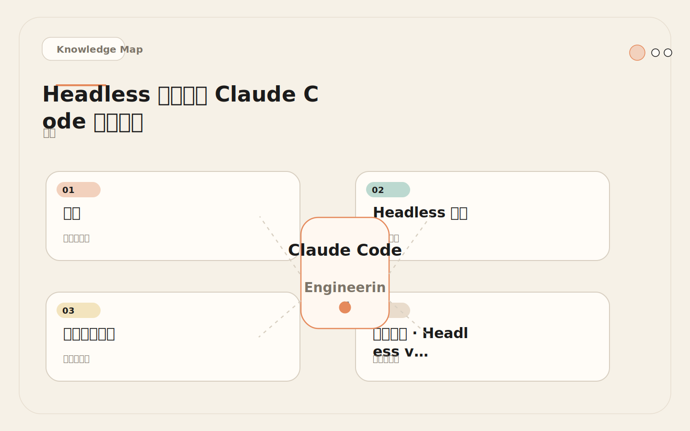
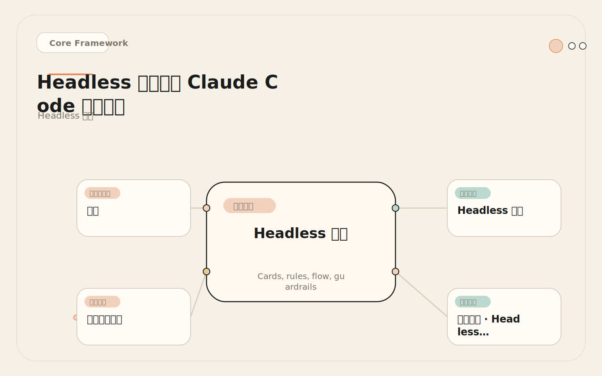
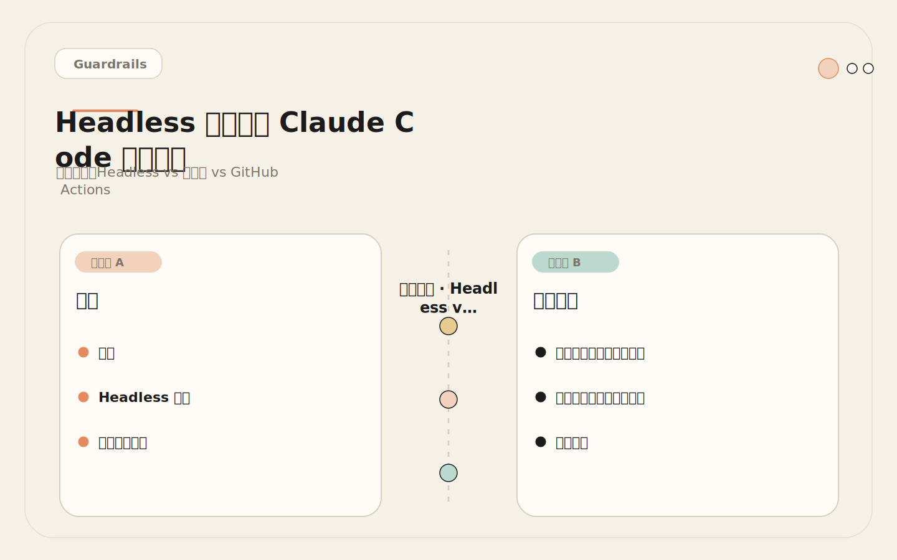
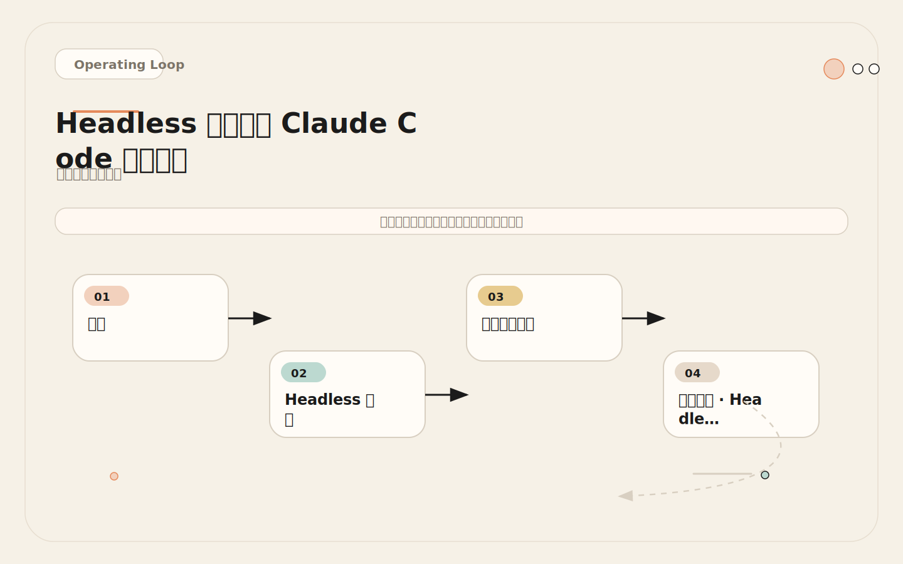

# Headless 模式：把 Claude Code 装进脚本里跑

<!-- codex:cover ../../../assets/claude-code-engineering/27-headless-mode-cover.svg -->

<!-- /codex:cover -->

**TL;DR：** Headless 模式用 `-p` 参数把 Claude Code 从交互式终端工具变成可编排的自动化组件。适合批处理、CI/CD 集成、定期巡检和低风险只读任务。关键是控制提示词作用域、设定 `--max-turns` 上限、用 `--output-format` 约束输出格式。

## 问题

交互式 Claude Code 适合人机协作——人在终端里观察、纠偏、补充上下文。但很多重复性任务不需要实时人在环中：

<!-- codex:illustration 27-headless-mode/01-overview-knowledge-map.svg -->

<!-- /codex:illustration -->

- 每天检查依赖是否有安全漏洞。
- 每个 PR 自动生成摘要。
- 每次 CI 失败自动归因。
- 每周同步 changelog。
- 大量 issue 需要按类型分类。

这些任务的特征是：输入明确、输出可格式化、中间过程不需要人工判断。Headless 模式就是为这类任务设计的——把 Claude Code 当作脚本管道中的一个处理节点，而不是一个需要盯着看的终端会话。

## Headless 架构

Headless 模式的核心机制是 `claude -p`（即 `--prompt`）。它跳过交互式终端，直接接收一条提示词，执行后退出。整个调用模型是：

<!-- codex:illustration 27-headless-mode/02-framework-core-structure.svg -->

<!-- /codex:illustration -->

```text
输入管道          Claude Code            输出管道
┌──────────┐    ┌──────────────┐    ┌──────────────┐
│ stdin    │───▶│  模型推理     │───▶│ stdout       │
│ 文件     │    │  工具调用     │    │ json/text    │
│ 环境变量 │    │  多轮执行     │    │ stderr 日志  │
└──────────┘    └──────────────┘    └──────────────┘
                     ↑  ↓
               权限治理层
               (permissions + hooks)
```

关键参数：

| 参数 | 作用 | 默认值 | 推荐设置 |
|------|------|--------|----------|
| `-p` / `--prompt` | 非交互式提示词 | 无 | 必填，精确描述任务边界 |
| `--output-format` | 输出格式 | text | json/stream-json/text |
| `--max-turns` | 最大执行轮数 | 无限制 | 建议设 3-10 |
| `--allowedTools` | 允许的工具列表 | 所有 | 按任务最小化 |
| `--disallowedTools` | 禁止的工具列表 | 无 | 禁止写入和 Bash |
| `--model` | 模型选择 | 默认 | 只读任务可用 Haiku 降低成本 |

## 真实调用示例

### Issue 分类

```bash
# 读取 GitHub issue，输出结构化分类
claude -p "Classify this GitHub issue into one of: bug, feature, docs, question, infrastructure.
Issue title: $ISSUE_TITLE
Issue body: $ISSUE_BODY

Output ONLY a JSON object: {\"category\": \"...\", \"confidence\": 0.0-1.0, \"reasoning\": \"...\"}" \
  --output-format json \
  --max-turns 1 \
  --disallowedTools "Edit,Write,Bash"
```

设计要点：`--max-turns 1` 防止模型去读仓库文件做额外分析。`--disallowedTools` 确保只读操作。输出格式严格约束为 JSON，便于下游脚本解析。

### 批量 Changelog 生成

```bash
# 从 git log 生成结构化 changelog
COMMITS=$(git log --oneline v1.2.0..HEAD)
claude -p "Generate a changelog from these commits. Group by: breaking, features, fixes, other.
Commits:
$COMMITS

Output markdown with no extra commentary." \
  --output-format text \
  --max-turns 2 \
  --allowedTools "Read,Grep"
```

设计要点：`--allowedTools "Read,Grep"` 让模型能读 package.json 或源文件来理解变更含义，但不能写文件。`--max-turns 2` 给它一轮读文件、一轮输出的空间。

### CI 失败分析

```bash
# 分析 CI 日志，输出修复建议
claude -p "Analyze this CI failure log and suggest fixes.
CI Log:
$(cat ci-log.txt)

Output JSON: {\"root_cause\": \"...\", \"confidence\": 0.0-1.0, \"suggested_fix\": \"...\", \"files_to_check\": [\"...\"]}" \
  --output-format json \
  --max-turns 3 \
  --allowedTools "Read,Grep,Glob"
```

设计要点：允许读文件让模型可以查看相关源码来验证根因假设。但禁止写入确保它不会"顺手修一下"。

### 文档链接检查

```bash
# 检查 markdown 文件中的失效链接
claude -p "Check all markdown files in docs/ for broken internal links.
For each broken link, report: file path, line number, link target, status.

Output JSON array of findings." \
  --output-format json \
  --max-turns 10 \
  --allowedTools "Read,Grep,Glob,Bash" \
  --max-turns 5
```

设计要点：链接检查可能需要多轮，`--max-turns` 设为 5 足够覆盖一个中等规模 docs 目录。允许 Bash 是因为需要用 `test -f` 检查文件是否存在。

## 决策矩阵：Headless vs 交互式 vs GitHub Actions

| 维度 | Headless (`claude -p`) | 交互式终端 | GitHub Actions |
|------|----------------------|------------|----------------|
| 触发方式 | 脚本/cron/CI pipeline | 人工启动 | PR/push/schedule 事件 |
| 人工监督 | 无 | 实时 | 事后审查 |
| 执行环境 | 本地或 CI runner | 本地终端 | GitHub runner |
| 权限控制 | CLI 参数 + settings | 交互确认 | workflow permissions |
| 输出格式 | 强制 json/text | 自然语言 | 评论/状态检查 |
| 成本控制 | --max-turns 限制 | 人工中断 | --max-turns + 超时 |
| 适用任务 | 只读分析、批处理、格式转换 | 复杂实现、调试、重构 | PR review、issue triage |
| 错误处理 | 退出码 + stderr | 人工观察 | 日志 + 通知 |
| 状态修改 | 不建议（无人监督） | 实时确认 | 严格限制 |

<!-- codex:illustration 27-headless-mode/04-compare-guardrails.svg -->

<!-- /codex:illustration -->

选择原则：

1. 需要修改仓库状态 → 交互式或 GitHub Actions（带人工审批）。
2. 只读分析 + 需要定期执行 → Headless 脚本 + cron。
3. 需要响应 PR/issue 事件 → GitHub Actions。
4. 一次性批处理任务 → Headless 脚本。

## 输入输出管道设计

### 输入策略

<!-- codex:illustration 27-headless-mode/03-flow-operating-loop.svg -->

<!-- /codex:illustration -->

Headless 模式的输入质量直接决定输出质量。三种输入方式及其适用场景：

**环境变量嵌入**：适合结构化、长度可控的输入。

```bash
export PR_TITLE="Fix auth token refresh"
export PR_DIFF=$(git diff main...feature/auth-fix)
claude -p "Review this PR. Title: $PR_TITLE. Diff: $PR_DIFF" --output-format json
```

**文件通过 stdin 管道**：适合大块文本输入。

```bash
cat ci-log.txt | claude -p "Analyze this CI failure log from stdin" --output-format json
```

**工具调用读取**：让模型自己用 Read/Grep 获取输入，适合需要模型自己判断该看哪些文件的场景。

```bash
claude -p "Read the failing test file tests/auth.test.ts and the source file src/auth.ts. Identify why the test is failing." \
  --allowedTools "Read,Grep" \
  --max-turns 5
```

### 输出处理

`--output-format` 三种模式的适用场景：

| 格式 | 适用场景 | 解析方式 |
|------|----------|----------|
| `json` | 下游脚本处理、CI 判断、数据库写入 | `jq` 或语言原生 JSON 解析 |
| `stream-json` | 长时间运行任务的实时监控 | 逐行 JSON 解析 |
| `text` | 人类阅读、changelog、文档生成 | 直接输出到文件 |

输出验证管道示例：

```bash
# 运行 headless 任务并验证输出
RESULT=$(claude -p "..." --output-format json --max-turns 3)

# 验证 JSON 有效性
echo "$RESULT" | jq empty 2>/dev/null || {
  echo "ERROR: Invalid JSON output"
  exit 1
}

# 验证必要字段存在
echo "$RESULT" | jq -e '.status' > /dev/null || {
  echo "ERROR: Missing required field 'status'"
  exit 1
}

# 按结果决定后续动作
STATUS=$(echo "$RESULT" | jq -r '.status')
if [ "$STATUS" = "approved" ]; then
  echo "PR review passed"
elif [ "$STATUS" = "changes_requested" ]; then
  echo "Changes requested:"
  echo "$RESULT" | jq -r '.findings[] | "[\(.severity)] \(.file):\(.line) - \(.summary)"'
  exit 1
fi
```

## 成本和延迟分析

Headless 任务的成本由三个因素决定：模型选择、提示词长度、执行轮数。

**典型任务的成本估算**（基于 Claude Sonnet 定价）：

| 任务 | 输入 tokens | 输出 tokens | 轮数 | 延迟 | 成本 |
|------|------------|------------|------|------|------|
| Issue 分类 | ~1K | ~0.2K | 1 | 2-5s | < $0.01 |
| Changelog 生成 | ~3K | ~1K | 1-2 | 5-15s | ~$0.02 |
| CI 失败分析 | ~5K | ~0.5K | 2-3 | 10-30s | ~$0.03 |
| PR Review | ~10K | ~1.5K | 3-5 | 30-60s | ~$0.08 |
| 文档链接检查 | ~8K | ~2K | 5-8 | 60-120s | ~$0.10 |

**成本控制策略**：

1. 只读任务用 Haiku 模型：`--model claude-haiku-4-0`，成本降低 80%+。
2. 严格限制 `--max-turns`：每多一轮意味着至少一次额外的模型调用。
3. 精确的提示词减少无效探索：避免"全面分析"这类开放性描述。
4. 缓存结果：相同输入不重复调用。

## 失败案例：无界探索导致 $50 的单次任务

**场景**：团队配置了一个 headless 任务，目的是分析仓库的代码质量并输出改进建议。

**原始提示词**：

```bash
claude -p "Analyze the entire codebase for quality issues and suggest improvements" \
  --output-format text
```

**结果**：任务运行了 45 分钟，消耗约 $50 的 tokens。输出是一份 3000 字的泛泛报告，没有可操作性。

**根因分析**：

1. **提示词无边界**："entire codebase" 让模型试图读遍所有文件。
2. **无轮数限制**：没有 `--max-turns`，模型无限执行。
3. **输出格式不约束**：text 模式下模型可以输出任意长度的"建议"。
4. **模型级别过高**：全仓库分析用了 Sonnet，实际分类工作 Haiku 就够。

**修正后的配置**：

```bash
claude -p "Analyze ONLY src/auth/ and src/api/ directories.
Focus on: error handling, type safety, test coverage.
For each issue, output: file path, line number, severity (high/medium/low), one-line description.
Output JSON array of findings, max 20 items." \
  --output-format json \
  --max-turns 8 \
  --allowedTools "Read,Grep,Glob" \
  --model claude-haiku-4-0
```

修正后：执行时间 30 秒，成本 < $0.05，输出 15 条具体可操作的发现。

**教训**：Headless 提示词不是越开放越好。恰恰相反，headless 提示词必须比交互式更精确，因为没有人实时纠偏。每个 headless 提示词都应该包含三要素：**输入边界**（看什么）、**输出格式**（怎么输出）、**执行限制**（多少轮）。

## 提示词工程：Headless 的核心技能

Headless 提示词和交互式提示词有本质区别。交互式场景中，模糊的提示词可以通过多轮对话逐步澄清。但 headless 场景只有一次机会——提示词的质量直接决定输出质量，没有纠偏窗口。

### 提示词三要素

每个 headless 提示词必须包含三个要素。缺少任何一个都会导致不可控的结果。

**输入边界**：明确告诉模型能看什么、不能看什么。不要用"分析仓库"这种模糊描述，而是用"只读 src/auth/ 目录下的 .ts 文件"。输入边界越精确，模型的注意力越集中，无效工具调用越少。

**输出格式**：指定输出的结构、字段、枚举值。不要用"列出所有问题"，而是用"输出 JSON 数组，每个元素包含 severity（high/medium/low）、file（相对路径）、line（整数）、summary（一句话）"。格式越严格，下游解析越可靠。

**执行限制**：通过 `--max-turns` 和 `--allowedTools` 约束执行空间。即使提示词写得不够精确，硬限制也能兜底。

### 提示词模板

以下是经过实际验证的提示词模板，可以直接复用。

**分类任务模板**：

```bash
claude -p "将以下内容分类到预定义类别中。

类别列表：[类别A, 类别B, 类别C, 类别D]

输入内容：
$INPUT

输出要求：
1. 只输出 JSON 对象，不要输出任何其他文本
2. 格式：{\"category\": \"类别名\", \"confidence\": 0.0-1.0, \"reasoning\": \"分类理由\"}
3. confidence 低于 0.6 时选择最接近的类别并在 reasoning 中说明不确定原因" \
  --output-format json \
  --max-turns 1 \
  --disallowedTools "Edit,Write,Bash"
```

**分析任务模板**：

```bash
claude -p "分析以下内容，提取关键信息。

分析范围：
$CONTENT

分析维度：
1. [维度一]
2. [维度二]
3. [维度三]

输出要求：
1. 只输出 JSON 对象
2. 每个维度给出结论和置信度
3. 如果信息不足以判断，明确标注 information_insufficient: true
4. 不要推测或编造信息" \
  --output-format json \
  --max-turns 3 \
  --allowedTools "Read,Grep,Glob"
```

**生成任务模板**：

```bash
claude -p "根据以下输入生成结构化输出。

输入来源：
$INPUT

输出格式要求：
$FORMAT_DESCRIPTION

质量要求：
1. 基于输入事实，不要添加输入中没有的信息
2. 如果输入不足以生成完整输出，标注缺失部分
3. 输出必须严格符合指定格式" \
  --output-format text \
  --max-turns 2
```

### 提示词反模式

**反模式一：开放性分析**

```bash
# 错误：没有边界
claude -p "分析这个仓库的代码质量"

# 正确：精确范围
claude -p "检查 src/api/ 目录下所有 .ts 文件的错误处理。对于每个缺少 try-catch 的 async 函数，输出文件名、函数名和行号。最多报告 20 个问题。"
```

**反模式二：缺少输出格式**

```bash
# 错误：输出不可解析
claude -p "这个 PR 有什么问题？"

# 正确：结构化输出
claude -p "审查这个 PR diff。输出 JSON：{\"findings\": [{\"severity\": \"high|medium|low\", \"file\": \"路径\", \"line\": 行号, \"issue\": \"描述\"}]}"
```

**反模式三：无轮数限制**

```bash
# 错误：可能无限执行
claude -p "找到并修复所有测试失败" --output-format json

# 正确：限制执行空间
claude -p "分析测试失败的原因（不修复）。输出 JSON 根因分析。" --max-turns 5 --disallowedTools "Edit,Write"
```

## 适合场景详细分析

### 高可靠场景

这些场景的特征是输入确定性强、输出可格式化、失败影响可控。

**Issue 分类**：输入是 issue 标题和正文，输出是一个分类标签。即使分类错误，最坏情况是人工重新分类。这是最适合 headless 的入门场景——单轮执行、输出简单、失败成本极低。建议从这类场景开始积累 headless 配置经验。

**PR 摘要**：输入是 git diff，输出是摘要文本。摘要不准确不会破坏任何东西。关键设计：限制 diff 长度（超过 500 行的 diff 应该截断或分段处理），否则模型可能被大量变更淹没而遗漏关键信息。

**Changelog 生成**：输入是 commit 历史，输出是 markdown 文本。生成后总有人工审核环节。关键设计：提供版本号范围（`v1.2.0..HEAD`），避免模型处理整个 git 历史。同时要求模型按变更类型分组（breaking/features/fixes），而不是按时间线排列。

**CI 失败归因**：输入是日志文件，输出是根因分析。分析结果只作为参考，修复动作由人执行。关键设计：截断日志到最近 200 行（CI 日志可能上万行），否则会快速消耗上下文预算。同时明确告诉模型"只分析，不修复"。

**文档检查**：输入是文件路径，输出是检查结果。检查错误最多浪费一点人工复核时间。关键设计：限制扫描目录范围（`docs/` 而非整个仓库），设置 findings 上限（最多 30 个），避免在大型文档站上失控。

### 需要谨慎的场景

这些场景有一定价值，但需要额外防护。

**自动生成测试**：输出是代码，需要人工审查后才能提交。可以在 headless 中生成草稿，但不应该直接提交。关键风险：生成的测试可能有逻辑错误、测试了错误的行为、或引入了依赖问题。防护措施：输出到独立分支、必须经过 CI 和人工 review。

**代码重构建议**：分析结果可能涉及架构变更，不应该由 headless 任务直接执行。关键风险：headless 模式缺少对全局架构的理解，建议可能局部合理但全局有害。防护措施：只输出建议，不执行变更，建议必须经过架构师审查。

**依赖升级**：可以分析哪些依赖需要升级，但不应该自动执行 `npm update`。关键风险：依赖升级可能引入破坏性变更，在无人监督的环境下执行风险很高。防护措施：只输出升级建议和兼容性分析，升级操作由人执行。

### 绝对不适合的场景

这些场景的共同特征是：失败成本高、需要实时判断、或者影响不可逆。

**生产部署**：无人监督的生产变更，风险不可接受。部署失误可能导致服务中断、数据丢失或安全事故。即使变更内容看起来正确，部署顺序、回滚策略、灰度策略等环节都需要人工判断。

**大规模重构**：跨多文件的重构需要实时观察和纠偏。重构过程中经常发现意料之外的依赖关系，需要即时调整策略。headless 模式无法处理这种需要动态决策的场景。

**安全敏感变更**：修改认证、权限、加密等代码必须有人审查每一步。安全代码的错误往往是隐性的——测试通过了但安全边界被破坏。这类变更需要安全专家逐行审查。

**数据库迁移**：schema 变更影响生产数据，不能由脚本驱动。迁移脚本必须经过数据库专家审查，在测试环境验证后才能应用到生产。任何自动化工具都不应该直接操作生产数据库。

## 运维实践：监控和告警

Headless 任务投入生产后，需要建立监控体系。以下是关键指标和告警阈值。

### 关键指标

**执行成功率**：成功完成（退出码 0）的调用占总调用次数的比例。目标 > 95%。低于 90% 说明提示词或环境配置有问题。

**输出合规率**：输出符合预期格式（有效 JSON + 字段完整）的比例。目标 > 95%。低于 90% 说明提示词的格式约束不够强。

**平均延迟**：从调用到返回结果的平均时间。需要按任务类型分别统计——issue 分类应在 5 秒内，PR review 应在 60 秒内。延迟突增通常意味着提示词范围扩大或工具调用增加。

**平均成本**：每次调用的 token 成本。需要按任务类型分别统计。成本突增通常是 `--max-turns` 不够或模型在无效探索。

**假阴性率**：任务输出"无问题"但实际存在问题的比例。这个指标最难衡量，需要定期人工抽检。在安全相关场景中，假阴性率应该 < 5%。

### 告警配置

```bash
# 示例：监控 headless 任务执行情况的脚本
# 放在 cron 中每 5 分钟运行一次

METRICS_FILE="/var/log/claude-headless-metrics.json"

# 记录每次执行
record_execution() {
  local task_type="$1"
  local status="$2"        # success/failure/timeout
  local duration_ms="$3"
  local cost_usd="$4"
  local output_valid="$5"  # true/false

  jq -n \
    --arg type "$task_type" \
    --arg status "$status" \
    --arg duration "$duration_ms" \
    --arg cost "$cost_usd" \
    --arg valid "$output_valid" \
    --arg ts "$(date -u +%Y-%m-%dT%H:%M:%SZ)" \
    '{type: $type, status: $status, duration_ms: $duration | tonumber, cost_usd: $cost | tonumber, output_valid: $valid, timestamp: $ts}' \
    >> "$METRICS_FILE"
}

# 检查最近 1 小时的成功率
check_success_rate() {
  ONE_HOUR_AGO=$(date -u -v-1H +%Y-%m-%dT%H:%M:%SZ 2>/dev/null || date -u -d '1 hour ago' +%Y-%m-%dT%H:%M:%SZ)
  TOTAL=$(jq "select(.timestamp > \"$ONE_HOUR_AGO\") | .status" "$METRICS_FILE" | wc -l)
  FAILURES=$(jq "select(.timestamp > \"$ONE_HOUR_AGO\") | select(.status == \"failure\") | .status" "$METRICS_FILE" | wc -l)

  if [ "$TOTAL" -gt 0 ]; then
    RATE=$(echo "scale=2; ($TOTAL - $FAILURES) * 100 / $TOTAL" | bc)
    if (( $(echo "$RATE < 90" | bc -l) )); then
      echo "ALERT: Headless success rate dropped to ${RATE}% (last hour)"
      # 发送告警
    fi
  fi
}
```

### 日志规范

每次 headless 执行应该记录以下信息：

```json
{
  "timestamp": "2026-05-26T10:30:00Z",
  "task_type": "issue_classification",
  "prompt_hash": "sha256:abc123",
  "model": "claude-haiku-4-0",
  "max_turns": 1,
  "actual_turns": 1,
  "duration_ms": 3200,
  "input_tokens": 850,
  "output_tokens": 120,
  "cost_usd": 0.003,
  "exit_code": 0,
  "output_valid": true,
  "output_schema_compliant": true
}
```

`prompt_hash` 用于追踪提示词变更对输出质量的影响。当成功率突降时，首先检查是否有人修改了提示词。

## 落地练习

选择一个只读任务做 headless 化：

```bash
# 第一步：在交互模式下手动完成任务，记录精确步骤
# 例如：分析最近 10 个 GitHub issue

# 第二步：把步骤转化为精确的 headless 提示词
claude -p "Read the last 10 open issues using GitHub MCP.
For each issue, output: title, category (bug/feature/docs/question), priority (high/medium/low), suggested assignee.

Output JSON array. Do NOT modify any remote state." \
  --output-format json \
  --max-turns 5 \
  --allowedTools "Read,Grep,Glob" \
  --disallowedTools "Edit,Write,Bash"

# 第三步：验证输出格式和内容质量
# 第四步：加入 cron 或 CI pipeline
```

关键原则：**先只读，后写入**。先验证输出质量，再考虑是否允许修改操作。永远不要在 headless 任务中给写权限，除非你已经用只读模式验证了至少 50 次输出质量。

## 权衡

Headless 模式降低了人工成本，也减少了实时纠偏能力。自动化程度越高，以下三个维度越需要投入：

1. **结构化输出**：headless 的结果必须能被机器解析和验证（见 [30 — 结构化输出](./30-structured-output.md)）。
2. **权限限制**：用 `--allowedTools` 和 `--disallowedTools` 建立工具边界，不要依赖提示词中的"不要做 X"。
3. **日志和审计**：每次 headless 执行的输入、输出、token 消耗、执行时间都应该被记录。

从只读任务开始，逐步扩展到低风险修改任务。永远不要跳过"先只读验证 50 次"这个步骤。

## 从手动到自动的迁移路径

Headless 化不是一步到位的。正确的迁移路径是：先手动 → 再脚本化 → 最后自动化。

**阶段一：手动探索（1-2 周）**

在交互式终端中完成任务，记录每一步的操作。统计：模型需要读取哪些文件、调用了哪些工具、输出了什么内容、哪些步骤是必要的、哪些是无效探索。这个阶段的输出物是一份精确的任务描述和执行步骤文档。

**阶段二：脚本化（1 周）**

把手动探索的结果转化为 headless 提示词。先在本地用 `claude -p` 手动触发，验证输出质量。运行 20-30 次，统计输出合规率和信息准确率。这个阶段的输出物是一个稳定的 headless 命令和输出验证脚本。

**阶段三：自动化（持续）**

把 headless 命令接入 cron 或 CI pipeline。初始阶段只记录不动作——headless 的输出只写入日志，不触发任何自动化动作。运行一周后，评估输出质量的稳定性。如果质量稳定且误报率可接受，逐步让输出影响下游动作。

每个阶段的退出条件是量化的：阶段二需要输出合规率 > 95%，阶段三需要连续 7 天无异常。不满足条件就停留在当前阶段继续优化。

## 与其他自动化工具的对比

Headless Claude Code 不是唯一的自动化选择。理解它和其他工具的边界，才能选对方案。

**vs 传统脚本（shell/Python）**：传统脚本适合逻辑确定、输入格式固定、输出格式可预测的任务。Headless Claude Code 适合需要理解自然语言或代码语义的任务。如果任务可以用正则表达式完成，就用脚本——更快、更便宜、更确定。只有当任务需要"理解"时（比如判断一段代码是否有 bug），才值得用 Claude Code。

**vs GitHub Copilot Autofix**：Copilot Autofix 是 GitHub 原生的代码修复功能，深度集成在 GitHub 生态中。优点是不需要额外配置、权限管理简单。缺点是定制性差——你无法控制它的分析逻辑、输出格式和工具权限。如果你只需要标准的漏洞修复，Copilot Autofix 更简单。如果你需要自定义 review 逻辑、输出格式和下游集成，Headless Claude Code 更灵活。

**vs 自建 LLM 管道**：自建管道（用 LangChain、LlamaIndex 等）提供最大的灵活性，但也需要最大的工程投入。你需要自己处理模型调用、上下文管理、工具调用、错误处理、日志记录。Claude Code 的 headless 模式已经内置了这些能力——工具调用、权限治理、多轮执行。除非你需要 Claude Code 不支持的自定义能力，否则不需要自建管道。

选择原则：能用脚本就不用 AI，能用成品服务就不用自建。Headless Claude Code 填补的是"需要理解能力但不需要交互式监督"这个空白地带。

## 相关文章

- [00 — Agent 运行时模型](./00-claude-code-as-agent-runtime.md)：Headless 是运行时在无交互环境中的部署方式
- [28 — GitHub Actions](./28-github-actions.md)：Headless 在 CI 中的具体集成方式
- [29 — CI 安全边界](./29-ci-security-boundaries.md)：Headless 任务在 CI 中的权限设计
- [30 — 结构化输出](./30-structured-output.md)：Headless 输出的格式化和验证方法
- [31 — Agent SDK](./31-agent-sdk.md)：比 Headless 更深度的程序化集成方式


