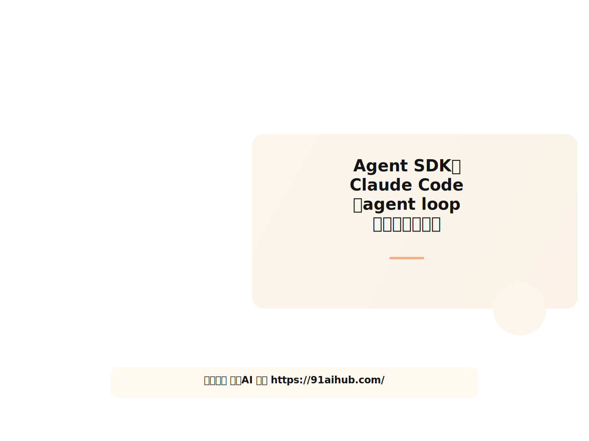
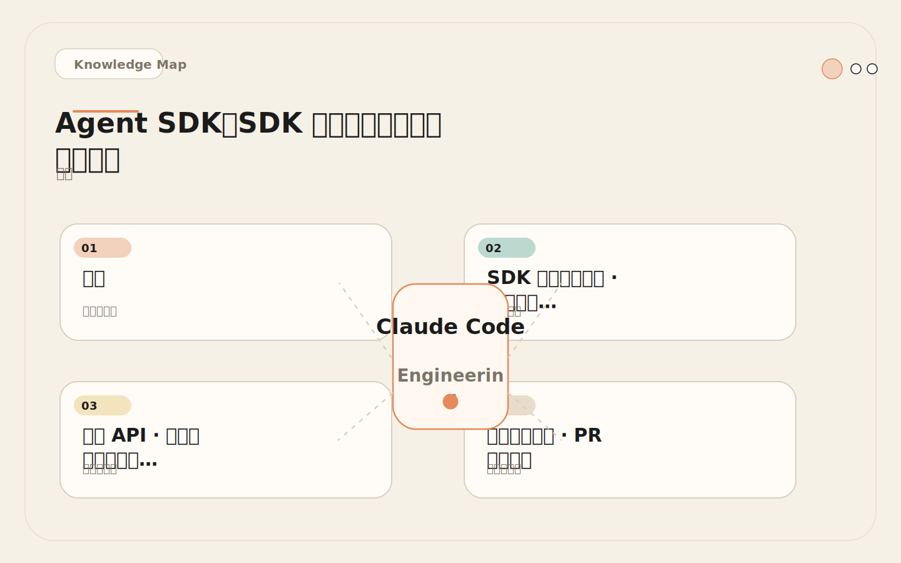
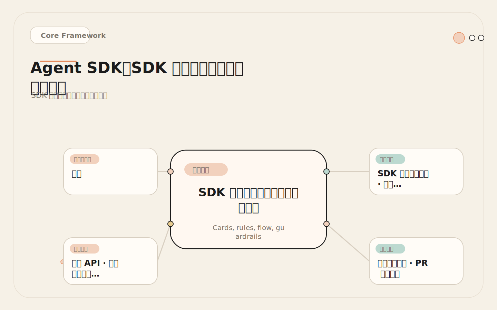
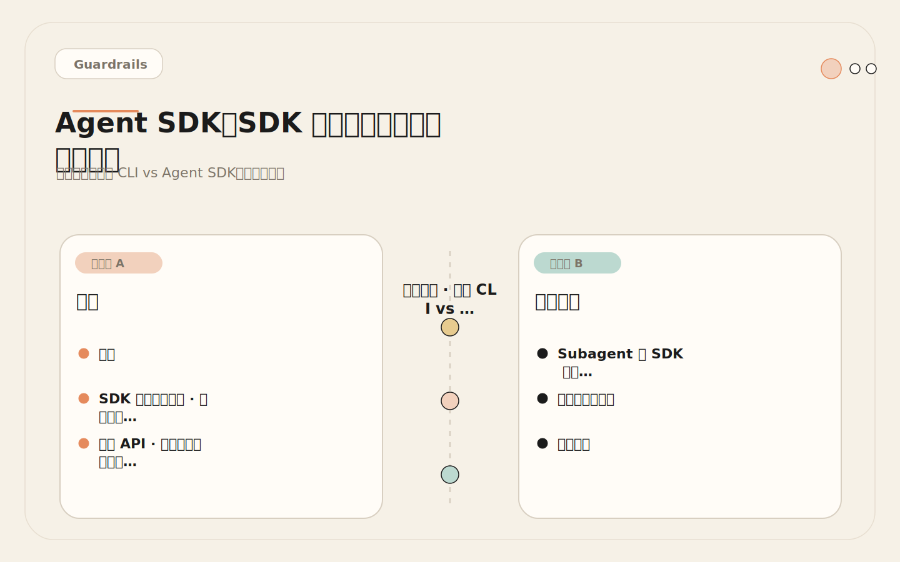
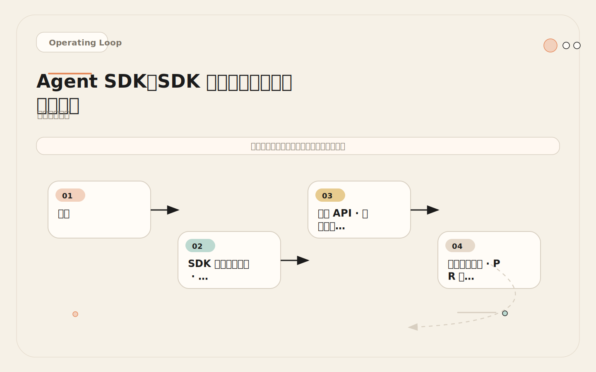

# Agent SDK：把 Claude Code 的 agent loop 嵌进自己的平台

<!-- codex:cover ../../../assets/claude-code-engineering/31-agent-sdk-cover.svg -->

<!-- /codex:cover -->

**TL;DR：** Agent SDK 把 Claude Code 的 agent loop、工具系统、Hooks 和 MCP 从交互式终端搬到程序化接口。核心 API 围绕 Agent、Tool、Session 三个原语构建，通过 event stream 实现状态同步。适合把能力接入内部平台、工单系统或自动化流水线。不要在单仓库个人使用阶段过早上 SDK——先在本地 CLI 验证工作流，再决定是否平台化。如果 CLI 和 Headless 模式已经满足需求，SDK 就是过度工程。

## 问题

本地 Claude Code 适合个人和小团队交互式使用。但以下场景它覆盖不了：

<!-- codex:illustration 31-agent-sdk/01-overview-knowledge-map.svg -->

<!-- /codex:illustration -->

- 内部代码门户需要嵌入 PR review 能力，开发者通过 Web UI 触发分析。
- 工单系统希望自动分析 Issue，提取关键信息并分类。
- 平台团队要跑批量仓库迁移，逐个仓库手动执行不现实。
- 安全团队要求所有 AI 工具调用留痕，本地会话的审计不够。
- 组织需要统一模型版本、工具权限和成本控制，个人本地配置无法保证一致性。

这些场景的共同特征：**需要程序化控制 Claude Code 的生命周期、输入输出、工具权限和审计日志**。Agent SDK 就是这个程序化接口。

## SDK 架构深度剖析：三个核心原语

Agent SDK 的编程模型围绕三个核心原语构建：**Agent**（推理 + 决策）、**Tool**（能力边界）、**Session**（状态容器）。理解这三个原语的职责边界和交互方式，是正确使用 SDK 的前提。

<!-- codex:illustration 31-agent-sdk/02-framework-core-structure.svg -->

<!-- /codex:illustration -->

### Agent：推理和决策单元

Agent 封装了 Claude Code 的 agent loop——接收输入、模型推理、决定是否调用工具、处理工具结果、继续推理或输出最终结果。一个 Agent 实例对应一次完整的任务执行上下文。

```typescript
// Agent 的核心生命周期
// Agent 不是单例，每次任务创建新的实例
import { Agent } from '@anthropic-ai/claude-code-sdk';

const agent = new Agent({
  model: 'claude-sonnet-4-6',
  systemPrompt: '你是一个代码审查专家...',
  // Agent 的行为边界由 tools 和 permissions 定义
  tools: ['Read', 'Grep', 'Glob'],
  // 最大推理轮次：防止无限循环
  maxTurns: 15,
  // 预算硬顶：USD
  maxBudgetUsd: 0.50,
});
```

Agent 的关键设计决策：
- **无状态**。Agent 实例不跨任务复用状态。每次 `execute()` 都是独立的推理过程。
- **不可变配置**。创建后 tools、model、maxTurns 不可修改。需要不同配置就创建新实例。
- **一次性执行**。一个 Agent 实例完成一次 `execute()` 后进入终态，不能重复使用。

### Tool：能力边界定义

Tool 定义了 Agent 可以执行的操作。SDK 中 Tool 的配置方式直接对应 Claude Code CLI 的工具权限系统。

```typescript
// Tool 白名单模式：显式声明允许的工具
const readOnlyTools = ['Read', 'Grep', 'Glob', 'LS'];

// Tool 粒度控制：Bash 命令级别的白名单
const restrictedTools = [
  'Read',
  'Grep',
  'Glob',
  'Bash(git log:*)',     // 只允许 git log
  'Bash(npm test:*)',    // 只允许 npm test
];

// 自定义 Tool：通过 MCP server 扩展
const customTools = {
  mcpServers: {
    internalApi: {
      command: 'node',
      args: ['mcp-servers/internal-api.js'],
      env: { API_KEY: process.env.INTERNAL_API_KEY },
    },
  },
};
```

Tool 配置的三条原则：
1. **最小权限**。只给任务需要的工具。PR 审查不需要 Edit 和 Write。
2. **Bash 命令级白名单**。`Bash(git log:*)` 比 `Bash` 安全一个数量级。
3. **MCP 作为扩展点**。需要内部系统集成时，用 MCP server 而不是在应用层 hack。

### Session：状态容器和生命周期管理

Session 是 SDK 中最关键的原语。它管理 Agent 实例的完整生命周期：创建 → 执行 → 清理。Session 泄漏是 SDK 集成中最常见的生产事故（见后文失败案例）。

```typescript
// Session 的完整生命周期管理
async function executeWithSession<T>(
  config: SessionConfig,
  task: (session: Session) => Promise<T>
): Promise<T> {
  const session = await ClaudeCode.createSession(config);
  const startTime = Date.now();

  try {
    const result = await task(session);
    return result;
  } finally {
    // 无论成功、失败、超时——必须清理
    try {
      await session.destroy();
    } catch (cleanupErr) {
      // 清理失败不能影响主流程，但要记录
      console.error('Session cleanup failed:', cleanupErr);
      metrics.increment('session.cleanup_failed');
    }
    const duration = Date.now() - startTime;
    metrics.histogram('session.lifetime_ms', duration);
  }
}
```

### Event System：状态同步和流式处理

SDK 通过 event stream 暴露 Agent 的内部状态变化。这对构建实时 UI、进度追踪和审计日志至关重要。

```typescript
// 事件流订阅
const session = await ClaudeCode.createSession(config);

// 流式获取 Agent 的中间状态
const eventStream = session.execute(prompt, { stream: true });

for await (const event of eventStream) {
  switch (event.type) {
    case 'assistant_message':
      // 模型输出的文本片段
      process.stdout.write(event.content);
      break;

    case 'tool_call':
      // 工具调用开始
      auditLog.record({
        sessionId: session.id,
        tool: event.tool,
        input: event.input,
        timestamp: event.timestamp,
      });
      break;

    case 'tool_result':
      // 工具调用完成
      metrics.histogram('tool.duration_ms', event.duration);
      break;

    case 'error':
      // 推理过程中的错误
      errorTracker.capture(event.error, { sessionId: session.id });
      break;

    case 'complete':
      // 任务完成，包含最终结果和统计
      costTracker.record(event.tokenUsage);
      break;
  }
}
```

事件系统的设计特点：
- **有序性**。事件严格按照发生顺序推送，不需要手动排序。
- **完整性**。每次工具调用都有成对的 `tool_call` 和 `tool_result` 事件。
- **可中断**。通过 `AbortController.signal` 可以在任何事件点取消执行。

### State Management：跨调用的状态保持

虽然单个 Agent 实例是无状态的，但 SDK 支持 conversation continuation——在同一个 Session 中追加对话轮次，保持上下文连续性。

```typescript
// 多轮对话：在同一个 Session 中保持上下文
const session = await ClaudeCode.createSession(config);

try {
  // 第一轮：理解代码结构
  const overview = await session.execute('分析这个项目的目录结构和架构模式');

  // 第二轮：基于上轮结论深入分析（共享上下文）
  const risks = await session.execute(
    `基于你刚才的分析，指出 ${overview.output.mainModule} 中的安全风险`
  );

  // 第三轮：生成修复建议（仍然共享上下文）
  const fixes = await session.execute('为每个风险生成具体的修复方案');
} finally {
  await session.destroy();
}
```

注意：多轮对话会累积 token 消耗。每轮的输入包含之前所有轮次的上下文。设置 `maxTurns` 是对总轮次的全局限制，不是每轮的限制。

### SDK 架构全景

```text
┌──────────────────────────────────────────────────────────────┐
│                      你的应用（Node.js）                       │
│                                                              │
│  ┌──────────┐   ┌──────────────┐   ┌──────────────────────┐  │
│  │  API 层   │──→│  会话管理器   │──→│  Claude Code SDK     │  │
│  │          │   │              │   │                      │  │
│  │ PR Webhook│   │ session pool │   │  ┌────────────────┐  │  │
│  │ Issue API │   │ cleanup      │   │  │  Agent Loop     │  │  │
│  │ Slack Bot │   │ timeout      │   │  │  ┌──────────┐  │  │  │
│  └──────────┘   └──────────────┘   │  │  │ 模型推理   │  │  │  │
│                                     │  │  └──────────┘  │  │  │
│  ┌──────────┐   ┌──────────────┐   │  │  ┌──────────┐  │  │  │
│  │ 审计日志  │←──│  结果处理器   │←──│  │  │ 工具调用   │  │  │  │
│  │          │   │              │   │  │  └──────────┘  │  │  │
│  │ 调用记录  │   │ 格式化       │   │  │  ┌──────────┐  │  │  │
│  │ 成本追踪  │   │ 结构化输出   │   │  │  │ Hooks     │  │  │  │
│  └──────────┘   └──────────────┘   │  │  └──────────┘  │  │  │
│                                     │  └────────────────┘  │  │
│  ┌──────────┐                       │                      │  │
│  │ 配置中心  │                       │  工具：Read, Grep...  │  │
│  │          │                       │  MCP：GitHub, Sentry  │  │
│  │ 权限模板  │                       └──────────────────────┘  │
│  │ 模型选择  │                                                 │
│  └──────────┘                                                 │
└──────────────────────────────────────────────────────────────┘
```

SDK 不改变 Claude Code 的核心能力，而是把它从"终端里的交互式工具"变成代码中的可编程组件。启动参数、权限、工具集、会话生命周期、输出格式——全部可编程。

```text
┌──────────────────────────────────────────────────────────────┐
│                      你的应用（Node.js）                       │
│                                                              │
│  ┌──────────┐   ┌──────────────┐   ┌──────────────────────┐  │
│  │  API 层   │──→│  会话管理器   │──→│  Claude Code SDK     │  │
│  │          │   │              │   │                      │  │
│  │ PR Webhook│   │ session pool │   │  ┌────────────────┐  │  │
│  │ Issue API │   │ cleanup      │   │  │  Agent Loop     │  │  │
│  │ Slack Bot │   │ timeout      │   │  │  ┌──────────┐  │  │  │
│  └──────────┘   └──────────────┘   │  │  │ 模型推理   │  │  │  │
│                                     │  │  └──────────┘  │  │  │
│  ┌──────────┐   ┌──────────────┐   │  │  ┌──────────┐  │  │  │
│  │ 审计日志  │←──│  结果处理器   │←──│  │  │ 工具调用   │  │  │  │
│  │          │   │              │   │  │  └──────────┘  │  │  │
│  │ 调用记录  │   │ 格式化       │   │  │  ┌──────────┐  │  │  │
│  │ 成本追踪  │   │ 结构化输出   │   │  │  │ Hooks     │  │  │  │
│  └──────────┘   └──────────────┘   │  │  └──────────┘  │  │  │
│                                     │  └────────────────┘  │  │
│  ┌──────────┐                       │                      │  │
│  │ 配置中心  │                       │  工具：Read, Grep...  │  │
│  │          │                       │  MCP：GitHub, Sentry  │  │
│  │ 权限模板  │                       └──────────────────────┘  │
│  │ 模型选择  │                                                 │
│  └──────────┘                                                 │
└──────────────────────────────────────────────────────────────┘
```

SDK 不改变 Claude Code 的核心能力，而是把它从"终端里的交互式工具"变成代码中的可编程组件。启动参数、运行时权限、工具集合、会话生命周期、输出格式——全部可编程控制。

## 核心 API：会话管理、工具配置、Hook 集成和 MCP 支持

### 会话创建和生命周期管理

```javascript
// 创建一个受限的只读会话
import { ClaudeCode } from '@anthropic-ai/claude-code-sdk';

const session = await ClaudeCode.createSession({
  // 模型选择：根据任务复杂度和成本预算选择
  model: 'claude-sonnet-4-6',

  // 工具白名单：只允许需要的工具
  tools: ['Read', 'Grep', 'Glob', 'LS'],

  // 工作目录：限制在目标仓库
  workingDirectory: '/repos/target-repo',

  // 最大轮次：防止无限循环消耗 API credits
  maxTurns: 15,

  // 超时：硬性截止，防止长时间运行
  timeout: 300000, // 5 分钟

  // Hooks：和本地 Claude Code 一样的 Hook 机制
  hooks: {
    PreToolUse: [
      {
        matcher: 'Read',
        hooks: [{
          type: 'command',
          command: 'audit-log.sh "$TOOL_INPUT"'
        }]
      }
    ],
    Stop: [
      {
        hooks: [{
          type: 'command',
          command: 'session-cleanup.sh "$SESSION_ID"'
        }]
      }
    ]
  },

  // MCP servers：按需接入外部系统
  mcpServers: {
    github: {
      command: 'npx',
      args: ['-y', '@modelcontextprotocol/server-github'],
      env: {
        GITHUB_PERSONAL_ACCESS_TOKEN: process.env.GITHUB_MCP_TOKEN
      }
    }
  }
});
```

### 执行任务和获取结果

```javascript
// 执行分析任务
const result = await session.execute(
  `Review this PR for correctness, security, and test coverage.
   Focus on: logic errors, injection risks, missing tests for new paths.
   Output findings as structured JSON.`,
  {
    outputFormat: 'json',
    // 允许中途取消
    signal: abortController.signal
  }
);

// result 结构
// {
//   status: 'completed' | 'error' | 'timeout' | 'cancelled',
//   output: { ... },          // 结构化输出
//   toolCalls: [ ... ],       // 工具调用记录
//   tokenUsage: { ... },      // token 消耗统计
//   duration: 45000,          // 执行时间（毫秒）
//   sessionId: 'sess_xxx'     // 会话 ID
// }
```

### 会话清理（关键！）

```javascript
// 始终确保会话被正确关闭
try {
  const result = await session.execute(prompt, options);
  return result;
} finally {
  // 无论成功还是失败，都要销毁会话
  await session.destroy();
}
```

## 真实集成案例：PR 分析服务

以下是一个完整的内部 PR 分析服务的设计和实现。这是推荐的第一个 SDK 项目——只读、低风险、价值明确。

### 服务架构

```text
PR Webhook (GitHub)
    │
    ▼
┌─────────────────────────────────┐
│   PR Analysis Service (Node.js) │
│                                 │
│  1. 接收 Webhook                │
│  2. 提取 PR diff                │
│  3. 创建受限 SDK 会话           │
│  4. 执行分析                    │
│  5. 结构化输出                  │
│  6. 销毁会话                    │
│  7. 存储结果 + 审计日志         │
└─────────────────────────────────┘
    │
    ▼
  审计数据库 / Slack 通知 / PR 评论
```

### 核心实现

```javascript
// pr-analysis-service.js
import { ClaudeCode } from '@anthropic-ai/claude-code-sdk';

// 权限模板：只读分析专用
const READ_ONLY_ANALYSIS_PROFILE = {
  model: 'claude-sonnet-4-6',
  tools: ['Read', 'Grep', 'Glob', 'LS'],
  maxTurns: 12,
  timeout: 180000, // 3 分钟硬性截止
  hooks: {
    PreToolUse: [{
      matcher: '*',
      hooks: [{
        type: 'command',
        command: 'log-tool-call.sh "$SESSION_ID" "$TOOL_NAME" "$TOOL_INPUT"'
      }]
    }]
  }
};

async function analyzePR(prUrl, diff) {
  const session = await ClaudeCode.createSession(READ_ONLY_ANALYSIS_PROFILE);

  try {
    const result = await session.execute(
      `Analyze this pull request diff.

PR URL: ${prUrl}

Diff:
${diff}

Return a JSON object with:
{
  "summary": "one-line summary",
  "risk_level": "low|medium|high",
  "findings": [
    {
      "severity": "blocker|warning|info",
      "category": "correctness|security|testing|maintainability",
      "file": "path/to/file",
      "line_range": [start, end],
      "description": "what's wrong",
      "suggestion": "how to fix"
    }
  ],
  "test_coverage_assessment": "adequate|partial|missing",
  "verified_checks": ["list of things checked"]
}`,
      { outputFormat: 'json' }
    );

    // 记录审计日志
    await auditLog.record({
      sessionId: result.sessionId,
      prUrl,
      tokenUsage: result.tokenUsage,
      duration: result.duration,
      toolCallCount: result.toolCalls.length,
      timestamp: new Date().toISOString()
    });

    return result.output;
  } finally {
    await session.destroy(); // 关键：始终清理
  }
}
```

### 部署配置

```yaml
# docker-compose.yml
version: '3.8'
services:
  pr-analysis:
    build: .
    ports:
      - "3000:3000"
    environment:
      - ANTHROPIC_API_KEY=${ANTHROPIC_API_KEY}
      - GITHUB_MCP_TOKEN=${GITHUB_MCP_TOKEN}
      - GITHUB_WEBHOOK_SECRET=${GITHUB_WEBHOOK_SECRET}
    volumes:
      - ./repos:/repos:ro        # 仓库挂载（只读）
      - ./audit-logs:/app/logs    # 审计日志
    deploy:
      resources:
        limits:
          memory: 2G              # 限制内存
          cpus: '2.0'
    healthcheck:
      test: ["CMD", "curl", "-f", "http://localhost:3000/health"]
      interval: 30s
      timeout: 10s
      retries: 3
```

## 决策矩阵：本地 CLI vs Agent SDK（快速参考）

不是所有场景都值得上 SDK。过早平台化是工程组织最常见的浪费之一。完整的三层对比（CLI / Headless / SDK）见后文。

<!-- codex:illustration 31-agent-sdk/04-compare-guardrails.svg -->

<!-- /codex:illustration -->

| 因素 | 本地 CLI | Agent SDK |
|------|----------|-----------|
| 用户数量 | 1-5 人 | 5+ 人或非技术人员 |
| 需要集成外部系统 | 不需要（手动搬运可接受） | 需要（工单、Slack、看板） |
| 需要自定义 UI | 不需要 | 需要（Web 门户、仪表盘） |
| 批量处理 | 手动逐个执行 | 自动化调度 |
| 成本控制 | 手动监控 | 程序化预算和限额 |
| 审计要求 | 本地日志足够 | 集中审计、合规要求 |
| 维护成本 | 低（配置文件） | 高（服务、基础设施、监控） |
| 上手门槛 | 开发者直接用终端 | 需要平台工程能力 |
| 会话管理 | 人工开关 | 必须程序化（池化、超时、清理） |

### 决策流程（精简版）

```text
本地 CLI 能满足需求吗？
├── 是 → CLI
└── 否 → Headless 模式能满足吗？
    ├── 是 → Headless
    └── 否 → Agent SDK

详细的三层递进决策流程见后文。
```

## 成本和运营分析

### API 成本模型

```text
单次 PR 分析成本估算（中型 PR，~300 行变更）：

模型调用：
  输入 tokens: ~15K（系统提示 + diff + 上下文）
  输出 tokens: ~2K（分析结果）
  单次成本（Sonnet 4.6）: ~$0.05-0.08

工具调用（平均 5-8 次）：
  Read: 3 次 × ~800 tokens = 2.4K
  Grep: 2 次 × ~400 tokens = 0.8K
  工具结果总计: ~3-5K tokens → 计入输入成本

单次总成本: $0.08-0.15
日均 50 次: $4-7.5/天
月均: $120-225/月
```

### 基础设施成本

```text
轻量部署（单实例）：
  容器: 2 CPU / 2GB RAM
  云服务: ~$30-50/月

中等规模（高可用）：
  容器: 2 实例 × 2 CPU / 4GB RAM
  负载均衡 + 自动伸缩
  审计数据库: ~$20/月
  云服务: ~$100-150/月

监控和运维人力: ~0.1-0.2 FTE
```

### 成本控制机制

```javascript
// 成本控制器
const costController = {
  // 单次任务预算上限
  maxTokensPerSession: 50000,

  // 日预算上限
  dailyBudgetLimit: 50.00, // USD

  // 当前消耗追踪
  dailyUsage: 0,

  // 检查是否超预算
  canExecute() {
    return this.dailyUsage < this.dailyBudgetLimit;
  },

  // 任务完成后记录
  recordUsage(tokenUsage, costEstimate) {
    this.dailyUsage += costEstimate;
    if (this.dailyUsage > this.dailyBudgetLimit * 0.8) {
      alertOps('PR analysis service approaching daily budget limit');
    }
  }
};
```

## 会话池化管理

当并发需求超过单会话能力时，需要会话池：

```javascript
class SessionPool {
  constructor(config) {
    this.maxSessions = config.maxSessions || 5;
    this.sessionTimeout = config.sessionTimeout || 300000;
    this.activeSessions = new Map();
    this.waitQueue = [];
  }

  async acquire(taskConfig) {
    // 等待可用槽位
    if (this.activeSessions.size >= this.maxSessions) {
      await this.waitForSlot();
    }

    const session = await ClaudeCode.createSession(taskConfig);
    const entry = {
      session,
      createdAt: Date.now(),
      timeout: setTimeout(() => this.forceRelease(session.id), this.sessionTimeout)
    };

    this.activeSessions.set(session.id, entry);
    return session;
  }

  async release(sessionId) {
    const entry = this.activeSessions.get(sessionId);
    if (entry) {
      clearTimeout(entry.timeout);
      await entry.session.destroy();
      this.activeSessions.delete(sessionId);
      this.processWaitQueue();
    }
  }

  async forceRelease(sessionId) {
    console.warn(`Force releasing session ${sessionId} due to timeout`);
    await this.release(sessionId);
  }

  async waitForSlot() {
    return new Promise(resolve => this.waitQueue.push(resolve));
  }

  processWaitQueue() {
    if (this.waitQueue.length > 0 && this.activeSessions.size < this.maxSessions) {
      const next = this.waitQueue.shift();
      next();
    }
  }
}
```

## 监控和告警

```javascript
// 监控指标
const metrics = {
  // 执行指标
  sessions_created: 'counter',
  sessions_completed: 'counter',
  sessions_timeout: 'counter',
  sessions_error: 'counter',

  // 性能指标
  execution_duration: 'histogram',
  tool_calls_per_session: 'histogram',
  tokens_per_session: 'histogram',

  // 成本指标
  cost_per_session: 'histogram',
  daily_total_cost: 'gauge',

  // 队列指标
  pool_utilization: 'gauge',
  wait_queue_length: 'gauge'
};

// 告警规则
const alerts = [
  {
    name: 'high_error_rate',
    condition: 'sessions_error / sessions_created > 0.1',
    action: 'page on-call'
  },
  {
    name: 'budget_threshold',
    condition: 'daily_total_cost > daily_budget * 0.8',
    action: 'notify team lead'
  },
  {
    name: 'session_leak',
    condition: 'active_sessions > max_sessions * 0.9 for 10min',
    action: 'page on-call, check cleanup logic'
  },
  {
    name: 'slow_execution',
    condition: 'p95_execution_duration > 120s',
    action: 'investigate timeout settings and model choice'
  }
];
```

## 失败案例：会话泄漏烧掉 $2K API Credits

### 经过

一个平台团队构建了基于 SDK 的代码审查服务，部署后运行了两周。第 12 天凌晨收到 Anthropic API 账单告警：单日消耗 $2K，是正常水平的 15 倍。

排查发现：

```text
问题链路：
1. PR Webhook 触发分析请求
2. 创建 SDK 会话
3. 执行分析
4. 分析完成，返回结果
5. 未调用 session.destroy() ← Bug
6. 会话继续存活，保持 API 连接
7. 模型在等待进一步输入时，后台仍然消耗 keep-alive tokens
8. 并发 5 个 PR 同时触发 → 5 个泄漏会话
9. 每个泄漏会话每小时消耗 ~$15
10. 8 小时无人发现（凌晨到早上）→ 5 × 8 × $15 = $600
11. 白天又有新的 PR 触发，旧会话仍然没清理
12. 累积到 $2K 触发账单告警

根因代码：
  try {
    const result = await session.execute(prompt);
    return result;
    // 没有 finally 块，异常路径不清理
    // 即使正常路径也没有 destroy()
  } catch (err) {
    // 吞掉错误，不清理会话
    console.error(err);
  }
```

### 根因

1. **没有 finally 块**。正常路径和异常路径都没有调用 `session.destroy()`。
2. **没有超时机制**。SDK 会话没有设置 `maxTurns` 和 `timeout`，空闲会话不会自动终止。
3. **没有会话泄漏检测**。监控只跟踪了"分析完成"的成功指标，没有跟踪"活跃会话数"。
4. **没有成本告警**。直到 Anthropic 账单触发告警才发现问题，中间隔了 12 小时。

### 修复

```javascript
// 修复后的会话管理
async function safeAnalysis(prUrl, diff) {
  const session = await ClaudeCode.createSession({
    ...READ_ONLY_PROFILE,
    maxTurns: 12,        // 硬性限制
    timeout: 180000,     // 3 分钟硬性截止
  });

  try {
    const result = await session.execute(prompt, options);
    return result;
  } finally {
    // 无论成功、失败、超时，都清理会话
    await session.destroy();
  }
}

// 全局泄漏检测：每 5 分钟扫描一次
setInterval(() => {
  const activeCount = sessionPool.activeSessions.size;
  if (activeCount > sessionPool.maxSessions * 0.5) {
    alertOps(`Potential session leak: ${activeCount} active sessions`);
    // 自动清理超时会话
    sessionPool.cleanupStale();
  }
}, 300000);

// 成本告警：每小时检查
setInterval(() => {
  const hourlyCost = costTracker.getHourlyTotal();
  if (hourlyCost > HOURLY_BUDGET) {
    alertOps(`Hourly cost ${hourlyCost} exceeds budget ${HOURLY_BUDGET}`);
    // 可选：自动暂停服务
    // service.pause();
  }
}, 3600000);
```

## 第一个推荐项目：只读 PR 分析服务

不要第一个项目就做复杂的自动修复平台。从只读分析开始：

**为什么选 PR 分析**：

1. **只读**。不需要写权限，出问题也不影响代码。
2. **价值明确**。每个 PR 都能产出分析结果，团队立刻感知到价值。
3. **输入输出清晰**。输入是 diff，输出是 findings 列表。
4. **成本可控**。单次成本 $0.05-0.15，可以精确预算。
5. **验证完整**。成功后验证了 SDK 集成、会话管理、成本控制、审计日志四个核心能力。

**第一步不要做**：

- 自动修复并提交代码（写权限，风险高）
- 自动合并 PR（不可逆操作）
- 批量仓库迁移（复杂度太高）
- 多模型路由（过早优化）

## 权衡

SDK 增加了工程复杂度。你需要管理会话生命周期、API 成本、基础设施、监控告警和故障恢复。只有当本地 CLI 工作流已经验证有效，且多个团队或非技术人员需要复用同一能力时，才值得投入平台化。

过早 SDK 化的信号：

- 只有一个团队使用，且都是开发者。
- 手动触发就够了，不需要自动调度。
- 本地 CLI + Headless 脚本已经解决问题。
- 没有专职平台工程师来运维服务。

这些情况下，优先投入在 CLAUDE.md、Skills、Hooks 的本地配置上，等需求自然生长再考虑 SDK。

## 完整集成示例：Python 自定义 Agent 服务

以下是一个生产级的 Python SDK 集成示例，展示从配置到部署的完整链路。Python 适合数据团队和 ML 工程师，他们更熟悉 Python 生态。

```python
# agents/code_review_agent.py
import asyncio
import json
import logging
import os
from dataclasses import dataclass, field
from datetime import datetime, timezone
from typing import Optional
from anthropic import Anthropic

logger = logging.getLogger(__name__)

@dataclass
class AgentConfig:
    """Agent 配置，对应组织治理中的权限模板"""
    model: str = "claude-sonnet-4-6"
    max_tokens: int = 8192
    max_turns: int = 12
    timeout_seconds: int = 180
    max_budget_usd: float = 0.50
    allowed_tools: list[str] = field(
        default_factory=lambda: ["Read", "Grep", "Glob", "LS"]
    )

@dataclass
class ReviewResult:
    """结构化输出，下游系统消费"""
    session_id: str
    summary: str
    risk_level: str  # low | medium | high
    findings: list[dict]
    token_usage: dict
    duration_ms: int
    cost_usd: float
    timestamp: str

class CodeReviewAgent:
    """
    只读代码审查 Agent。
    设计原则：
    1. 只读——不传 Edit/Write 工具
    2. 预算硬顶——max_budget_usd 兜底
    3. 结构化输出——下游可解析
    4. 审计日志——每次调用留痕
    """

    def __init__(self, config: Optional[AgentConfig] = None):
        self.config = config or AgentConfig()
        self.client = Anthropic(api_key=os.environ["ANTHROPIC_API_KEY"])
        self._session_counter = 0

    async def review_diff(
        self,
        diff: str,
        repo_path: str = ".",
        review_focus: str = "correctness, security, test coverage",
    ) -> ReviewResult:
        """审查单个 PR diff，返回结构化结果"""
        session_id = f"review_{datetime.now(timezone.utc).strftime('%Y%m%d_%H%M%S')}_{self._session_counter}"
        self._session_counter += 1
        start_time = datetime.now(timezone.utc)

        # 构造审查 prompt，要求 JSON 输出
        prompt = f"""Review the following code diff for {review_focus}.

## Diff
```
{diff}
```

Return a JSON object:
{{
  "summary": "one-line summary of changes",
  "risk_level": "low|medium|high",
  "findings": [
    {{
      "severity": "blocker|warning|info",
      "category": "correctness|security|testing|maintainability",
      "file": "path/to/file",
      "description": "what's wrong",
      "suggestion": "how to fix"
    }}
  ]
}}"""

        try:
            response = await asyncio.wait_for(
                self._call_model(prompt, session_id),
                timeout=self.config.timeout_seconds,
            )

            # 解析结构化输出
            output = self._parse_json_response(response)
            duration = (datetime.now(timezone.utc) - start_time).total_seconds() * 1000

            # 成本估算（Sonnet 4.6 定价）
            input_tokens = response.usage.input_tokens
            output_tokens = response.usage.output_tokens
            cost_usd = (input_tokens / 1_000_000) * 3.0 + (output_tokens / 1_000_000) * 15.0

            result = ReviewResult(
                session_id=session_id,
                summary=output.get("summary", ""),
                risk_level=output.get("risk_level", "unknown"),
                findings=output.get("findings", []),
                token_usage={
                    "input": input_tokens,
                    "output": output_tokens,
                },
                duration_ms=int(duration),
                cost_usd=cost_usd,
                timestamp=datetime.now(timezone.utc).isoformat(),
            )

            # 审计日志（对应第 33 篇组织级治理的审计维度）
            logger.info(
                "code_review_completed",
                extra={
                    "session_id": session_id,
                    "risk_level": result.risk_level,
                    "findings_count": len(result.findings),
                    "cost_usd": cost_usd,
                    "duration_ms": result.duration_ms,
                },
            )

            return result

        except asyncio.TimeoutError:
            logger.error(f"Session {session_id} timed out after {self.config.timeout_seconds}s")
            raise
        except Exception as e:
            logger.error(f"Session {session_id} failed: {e}")
            raise

    async def _call_model(self, prompt: str, session_id: str):
        """调用 Anthropic API，带重试逻辑"""
        max_retries = 3
        for attempt in range(max_retries):
            try:
                return self.client.messages.create(
                    model=self.config.model,
                    max_tokens=self.config.max_tokens,
                    messages=[{"role": "user", "content": prompt}],
                )
            except Exception as e:
                if attempt < max_retries - 1:
                    wait = 2 ** attempt  # 指数退避：1s, 2s, 4s
                    logger.warning(f"Retry {attempt + 1}/{max_retries} for {session_id}: {e}, waiting {wait}s")
                    await asyncio.sleep(wait)
                else:
                    raise

    @staticmethod
    def _parse_json_response(response) -> dict:
        """从模型响应中提取 JSON"""
        text = response.content[0].text
        # 尝试直接解析
        try:
            return json.loads(text)
        except json.JSONDecodeError:
            # 尝试提取 JSON 块
            import re
            match = re.search(r'\{[\s\S]*\}', text)
            if match:
                return json.loads(match.group())
            return {"summary": text, "risk_level": "unknown", "findings": []}

# 使用示例
async def main():
    agent = CodeReviewAgent(AgentConfig(max_budget_usd=0.30))

    # 模拟 PR diff
    diff = """
    @@ -15,6 +15,10 @@ function authenticate(req) {
    +  const user = db.query(`SELECT * FROM users WHERE id = ${req.params.id}`);
    +  if (user) {
    +    return user.password === req.body.password;
    +  }
    """

    result = await agent.review_diff(diff)
    print(f"Risk: {result.risk_level}, Findings: {len(result.findings)}, Cost: ${result.cost_usd:.4f}")

if __name__ == "__main__":
    asyncio.run(main())
```

## 决策矩阵：CLI vs Headless vs Agent SDK

三层方案的完整对比。不要跳级——只有前一层无法满足需求时才考虑下一层。

| 维度 | 本地 CLI | Headless 模式 | Agent SDK |
|------|----------|---------------|-----------|
| 用户数量 | 1-5 人 | 1-5 人，自动化 | 5+ 人或非技术人员 |
| 集成外部系统 | 手动搬运可接受 | 脚本驱动，半自动 | 全自动集成 |
| 自定义 UI | 不需要 | 不需要 | 需要（Web 门户、仪表盘） |
| 批量处理 | 手动逐个执行 | 脚本批量 | 自动化调度 + 队列 |
| 成本控制 | 手动监控 | 脚本级预算 | 程序化预算、限额、告警 |
| 审计要求 | 本地日志够用 | 脚本输出可归档 | 集中审计、合规要求 |
| 维护成本 | 低（配置文件） | 低（脚本文件） | 高（服务、基础设施、监控） |
| 上手门槛 | 开发者直接用终端 | 写 bash/python 脚本 | 需要平台工程能力 |
| 会话管理 | 人工开关 | 脚本生命周期 | 必须程序化（池化、超时、清理） |
| 延迟控制 | 人工感知 | 脚本超时 | 程序化超时 + 重试 |
| 错误恢复 | 人工介入 | 脚本重跑 | 自动重试 + 降级 |
| 并发能力 | 单会话 | 串行执行 | 会话池 + 并行 |
| 定制化程度 | CLAUDE.md + Hooks | Headless flags | 完全可编程 |
| 状态持久化 | 无 | 无 | 数据库 + 审计 |
| Token 效率 | 最高（人工优化） | 高（脚本预定义 prompt） | 中（框架开销） |
| 部署复杂度 | 零 | 零 | Docker/Serverless/K8s |

### 三层递进决策流程

```text
需要 Claude Code 能力？
├── 只有技术人员使用？
│   ├── 是 → 本地 CLI
│   └── 否 → Agent SDK
├── 需要集成其他系统（工单、Slack、内部工具）？
│   ├── 否 → 本地 CLI + Headless 脚本可能够用
│   └── 是 → 继续
├── 批量处理 > 10 次/天？
│   ├── 否 → Headless 模式先试（见第 27 篇）
│   └── 是 → 继续
├── 需要并发执行 > 3 个任务？
│   ├── 否 → Headless + 队列脚本
│   └── 是 → Agent SDK
├── 有平台工程能力（部署、监控、运维）？
│   ├── 否 → 先在本地 CLI 验证工作流，再考虑 SDK
│   └── 是 → Agent SDK
└── 总判断：只有当 CLI 和 Headless 都无法满足需求时，才上 SDK
```

## Token 成本与运营分析：SDK vs CLI

### 单次调用的 Token 消耗对比

```text
场景：审查一个中型 PR（~300 行变更）

CLI 模式（交互式）：
  系统提示 + CLAUDE.md:     ~5K tokens（一次性）
  用户输入 + diff:          ~15K tokens
  模型推理（含中间思考）:    ~3K tokens
  工具调用（Read/Grep）:     ~5K tokens（往返）
  最终输出:                  ~2K tokens
  总计: ~30K tokens → $0.06-0.10

SDK 模式（程序化）：
  系统提示 + 配置注入:       ~3K tokens（更精简）
  结构化 prompt + diff:      ~15K tokens
  模型推理:                  ~3K tokens
  工具调用:                  ~5K tokens
  结构化输出:                ~2K tokens
  SDK 框架开销:              ~2K tokens（序列化、事件等）
  总计: ~30K tokens → $0.08-0.13（框架开销多 ~15-20%）

Headless 模式（折中方案）：
  系统提示:                  ~4K tokens
  Prompt + diff:             ~15K tokens
  推理 + 工具:               ~8K tokens
  输出:                      ~2K tokens
  总计: ~29K tokens → $0.06-0.10

关键差异：SDK 多出 ~2K 框架开销 tokens，
但换来了结构化输出、事件流和程序化控制。
```

### 月度运营成本模型

```text
假设：日均 50 次 PR 审查，每月 22 个工作日

模式 A：CLI（人工驱动）
  API 成本: 50 × 22 × $0.08 = $88/月
  工程师时间: 每次触发 ~2min × 50次/天 = 100min/天
  人力成本: ~100min × $1/min × 22天 = $2,200/月
  总计: ~$2,288/月（人力占 96%）

模式 B：Headless（CI 脚本）
  API 成本: 50 × 22 × $0.08 = $88/月
  CI 运行成本: ~$20/月
  工程师时间: 维护脚本 ~30min/周 = $120/月
  总计: ~$228/月（90% 节省）

模式 C：SDK 服务（平台化）
  API 成本: 50 × 22 × $0.10 = $110/月（框架开销）
  基础设施: ~$50/月（容器 + 数据库）
  监控运维: ~$30/月（工具 + 0.05 FTE）
  工程师时间: 平台维护 ~4h/周 = $640/月
  总计: ~$830/月

  但：服务化后可以给非技术人员用（产品经理、QA），
  用户数从 5 扩展到 50，边际成本接近零。
```

### 成本控制的工程实践

```python
# 成本控制器（Python 版本，适合数据团队）
import threading
from datetime import datetime, timezone
from collections import defaultdict

class CostController:
    """组织级成本控制，对应第 33 篇的治理维度"""

    def __init__(
        self,
        daily_budget_usd: float = 50.0,
        per_task_budget_usd: float = 0.50,
        alert_threshold_pct: float = 0.80,
    ):
        self.daily_budget = daily_budget_usd
        self.per_task_budget = per_task_budget_usd
        self.alert_threshold = alert_threshold_pct
        self._usage_by_date: dict[str, float] = defaultdict(float)
        self._lock = threading.Lock()

    def can_execute(self) -> bool:
        """检查是否还在预算内"""
        today = datetime.now(timezone.utc).strftime("%Y-%m-%d")
        with self._lock:
            return self._usage_by_date[today] < self.daily_budget

    def record(self, session_id: str, cost_usd: float, team: str = "default"):
        """记录一次消耗，检查告警阈值"""
        today = datetime.now(timezone.utc).strftime("%Y-%m-%d")
        with self._lock:
            self._usage_by_date[today] += cost_usd
            current = self._usage_by_date[today]

        if current > self.daily_budget * self.alert_threshold:
            self._alert(f"Daily cost at ${current:.2f} ({current/self.daily_budget:.0%})")

        if cost_usd > self.per_task_budget:
            self._alert(
                f"Session {session_id} cost ${cost_usd:.2f} "
                f"exceeds per-task budget ${self.per_task_budget}"
            )

    def _alert(self, message: str):
        """告警通道——集成 PagerDuty / Slack"""
        # 生产环境：集成组织告警系统
        print(f"[COST ALERT] {message}")
```

## 生产部署模式

### 模式 A：Docker 单实例（推荐起步）

<!-- codex:illustration 31-agent-sdk/03-flow-operating-loop.svg -->

<!-- /codex:illustration -->

适合日处理量 <200 次的场景。

```dockerfile
# Dockerfile
FROM node:20-slim

WORKDIR /app

# 安装 Claude Code CLI（SDK 依赖）
RUN npm install -g @anthropic-ai/claude-code

COPY package*.json ./
RUN npm ci --production

COPY . .

# 健康检查
HEALTHCHECK --interval=30s --timeout=10s --retries=3 \
  CMD curl -f http://localhost:3000/health || exit 1

# 非 root 运行
USER node

EXPOSE 3000
CMD ["node", "server.js"]
```

```yaml
# docker-compose.yml
version: '3.8'
services:
  pr-analysis:
    build: .
    ports:
      - "3000:3000"
    environment:
      - ANTHROPIC_API_KEY=${ANTHROPIC_API_KEY}
      - GITHUB_MCP_TOKEN=${GITHUB_MCP_TOKEN}
      - DAILY_BUDGET_USD=50
    volumes:
      - ./repos:/repos:ro        # 仓库挂载（只读）
      - ./audit-logs:/app/logs    # 审计日志持久化
    deploy:
      resources:
        limits:
          memory: 2G
          cpus: '2.0'
    healthcheck:
      test: ["CMD", "curl", "-f", "http://localhost:3000/health"]
      interval: 30s
      timeout: 10s
      retries: 3
    restart: unless-stopped
```

### 模式 B：Serverless（低频 / 事件驱动）

适合 PR Webhook、定时任务等触发频率不高的场景。

```typescript
// AWS Lambda handler
import { APIGatewayProxyHandler } from 'aws-lambda';
import { ClaudeCode } from '@anthropic-ai/claude-code-sdk';

// Lambda 外部初始化（冷启动复用）
let sessionPool: SessionPool | null = null;

export const handler: APIGatewayProxyHandler = async (event) => {
  const body = JSON.parse(event.body || '{}');
  const { prUrl, diff, repository } = body;

  // 冷启动时初始化
  if (!sessionPool) {
    sessionPool = new SessionPool({ maxSessions: 3, sessionTimeout: 120000 });
  }

  const session = await sessionPool.acquire({
    model: 'claude-sonnet-4-6',
    tools: ['Read', 'Grep', 'Glob'],
    maxTurns: 10,
    timeout: 120000,
  });

  try {
    const result = await session.execute(
      `Review this diff for security and correctness:\n${diff}`,
      { outputFormat: 'json' }
    );

    return {
      statusCode: 200,
      body: JSON.stringify({
        prUrl,
        findings: result.output,
        cost: result.tokenUsage,
      }),
    };
  } catch (err) {
    return {
      statusCode: 500,
      body: JSON.stringify({ error: 'Analysis failed', prUrl }),
    };
  } finally {
    await sessionPool.release(session.id);
  }
};
```

Serverless 的注意点：
- **冷启动**。首次调用需要初始化 SDK 连接，增加 ~2-5s 延迟。
- **执行时长限制**。Lambda 最长 15 分钟。复杂任务可能超限。
- **并发限制**。默认 1000 并发，但 API rate limit 可能先到。
- **成本**。低频使用非常便宜（$0.20/百万请求 + 计算时间）。高频使用反而比容器贵。

### 模式 C：长运行 Agent（后台任务处理器）

适合批量仓库迁移、大规模代码审查等长时间运行的任务。

```typescript
// long-running-agent.ts
// 设计模式：任务队列 + 工作进程
import { ClaudeCode } from '@anthropic-ai/claude-code-sdk';

interface Task {
  id: string;
  type: 'batch_review' | 'migration' | 'security_scan';
  payload: unknown;
  priority: number;
  retryCount: number;
}

class LongRunningAgent {
  private queue: Task[] = [];
  private processing = false;
  private maxRetries = 3;

  async enqueue(task: Task): Promise<string> {
    this.queue.push({ ...task, retryCount: 0 });
    this.queue.sort((a, b) => b.priority - a.priority);

    if (!this.processing) {
      this.processNext(); // fire-and-forget
    }

    return task.id;
  }

  private async processNext(): Promise<void> {
    if (this.queue.length === 0) {
      this.processing = false;
      return;
    }

    this.processing = true;
    const task = this.queue.shift()!;

    const session = await ClaudeCode.createSession({
      model: 'claude-sonnet-4-6',
      tools: ['Read', 'Grep', 'Glob', 'LS'],
      maxTurns: 20,
      timeout: 600000, // 10 分钟
    });

    try {
      const result = await session.execute(
        this.buildPrompt(task),
        { outputFormat: 'json' }
      );

      await this.saveResult(task.id, result);
    } catch (err) {
      if (task.retryCount < this.maxRetries) {
        // 指数退避重试
        const delay = Math.pow(2, task.retryCount) * 1000;
        await new Promise(r => setTimeout(r, delay));

        this.queue.unshift({ ...task, retryCount: task.retryCount + 1 });
      } else {
        await this.markFailed(task.id, err);
      }
    } finally {
      await session.destroy();
      this.processNext(); // 处理下一个任务
    }
  }

  private buildPrompt(task: Task): string {
    // 根据任务类型构造不同的 prompt
    const templates = {
      batch_review: '审查以下仓库的所有文件...',
      migration: '将以下代码从 Vue 2 迁移到 Vue 3...',
      security_scan: '扫描以下代码中的安全漏洞...',
    };
    return templates[task.type] + JSON.stringify(task.payload);
  }

  private async saveResult(taskId: string, result: unknown): Promise<void> {
    // 持久化到数据库
  }

  private async markFailed(taskId: string, err: unknown): Promise<void> {
    // 记录失败，触发告警
  }
}
```

### 部署模式选择

```text
日处理量 < 50 次？
├── 是 → Docker 单实例（模式 A）
└── 否 → 继续

任务 < 3 分钟，触发式？
├── 是 → Serverless（模式 B）
└── 否 → 继续

批量任务，单次 > 5 分钟？
├── 是 → 长运行 Agent（模式 C）
└── 否 → Docker 多实例 + 负载均衡
```

## 错误处理与重试策略

SDK 集成中的错误分为四类，每类的处理策略不同：

```text
错误分类：
├── 瞬态错误（Transient）
│   API rate limit (429) → 指数退避重试
│   网络超时 → 重试，降低并发
│   服务端 5xx → 重试，告警
│
├── 输入错误（Input）
│   Prompt 超长 → 截断或分块
│   工具权限不足 → 降级到更少工具
│   JSON 解析失败 → 降级到纯文本输出
│
├── 预算错误（Budget）
│   单任务超预算 → 终止，记录，告警
│   日预算耗尽 → 暂停服务，通知
│   Token 限流 → 排队等待
│
└── 系统错误（System）
    ├── 会话泄漏 → 强制清理 + 告警
    ├── 内存溢出 → 重启容器
    └── 依赖服务不可用 → 降级或熔断
```

### 重试策略实现

```typescript
// retry-strategies.ts
interface RetryConfig {
  maxRetries: number;
  baseDelayMs: number;    // 基础延迟
  maxDelayMs: number;     // 最大延迟
  jitterFactor: number;   // 随机抖动因子（防止惊群）
}

const DEFAULT_RETRY: RetryConfig = {
  maxRetries: 3,
  baseDelayMs: 1000,
  maxDelayMs: 30000,
  jitterFactor: 0.2,
};

async function withRetry<T>(
  fn: () => Promise<T>,
  config: RetryConfig = DEFAULT_RETRY,
  isRetryable: (err: unknown) => boolean = isTransientError
): Promise<T> {
  let lastError: unknown;

  for (let attempt = 0; attempt <= config.maxRetries; attempt++) {
    try {
      return await fn();
    } catch (err) {
      lastError = err;

      // 不可重试的错误直接抛出
      if (!isRetryable(err)) throw err;

      // 最后一次不等待
      if (attempt === config.maxRetries) break;

      // 指数退避 + 随机抖动
      const baseDelay = config.baseDelayMs * Math.pow(2, attempt);
      const jitter = baseDelay * config.jitterFactor * Math.random();
      const delay = Math.min(baseDelay + jitter, config.maxDelayMs);

      console.warn(
        `Attempt ${attempt + 1}/${config.maxRetries} failed, ` +
        `retrying in ${Math.round(delay)}ms: ${err}`
      );

      await new Promise(resolve => setTimeout(resolve, delay));
    }
  }

  throw lastError;
}

function isTransientError(err: any): boolean {
  // API rate limit
  if (err?.status === 429) return true;
  // 服务端错误
  if (err?.status >= 500 && err?.status < 600) return true;
  // 网络错误
  if (err?.code === 'ECONNRESET' || err?.code === 'ETIMEDOUT') return true;
  // 其他一律不重试
  return false;
}

// 使用
const result = await withRetry(
  () => session.execute(prompt, { outputFormat: 'json' }),
  { maxRetries: 3, baseDelayMs: 2000 },
  // 自定义可重试判断：只重试瞬态错误
);
```

### 降级策略

当重试耗尽或成本超限时，需要降级而不是直接失败：

```typescript
// degradation-strategies.ts
async function executeWithDegradation(
  prompt: string,
  config: SessionConfig
): Promise<ReviewResult> {
  // 策略 1：完整模式（原始配置）
  try {
    return await executeWithRetry(prompt, config);
  } catch (err) {
    if (!isTransientError(err)) {
      // 非瞬态错误，尝试降级
    } else {
      throw err; // 瞬态错误重试耗尽，直接失败
    }
  }

  // 策略 2：降级到更少的工具（去掉工具调用开销）
  try {
    return await executeWithRetry(prompt, {
      ...config,
      tools: [],  // 纯推理，不调用工具
      maxTurns: 1,
    });
  } catch {
    // 继续
  }

  // 策略 3：降级到更便宜的模型
  try {
    return await executeWithRetry(prompt, {
      ...config,
      model: 'claude-haiku-4-5',  // 更快更便宜
      maxTurns: 1,
      tools: [],
    });
  } catch {
    // 最终降级：返回默认结果
    return {
      summary: 'Analysis unavailable due to service degradation',
      risk_level: 'unknown',
      findings: [],
      degraded: true,
    };
  }
}
```

## Subagent 在 SDK 中的编排

SDK 集成中，subagent 模式（见第 12 篇）特别有价值。多个专业化的 Agent 实例协同工作，每个实例有独立的工具权限和上下文窗口。

```typescript
// agent-orchestration.ts
// 多 Agent 编排：主 Agent 派发子任务给专业 Agent

interface AgentRole {
  name: string;
  tools: string[];
  systemPrompt: string;
  maxTurns: number;
}

// 定义专业化的 Agent 角色（对应第 12 篇的 subagent 心智模型）
const ROLES: Record<string, AgentRole> = {
  reviewer: {
    name: 'code-reviewer',
    tools: ['Read', 'Grep', 'Glob'],
    systemPrompt: '你是代码审查专家。关注正确性、安全性和可维护性。',
    maxTurns: 10,
  },
  security: {
    name: 'security-scanner',
    tools: ['Read', 'Grep'],  // 最小工具集
    systemPrompt: '你是安全审计专家。只关注安全漏洞：注入、认证、授权。',
    maxTurns: 8,
  },
  tester: {
    name: 'test-analyzer',
    tools: ['Read', 'Grep', 'Glob'],
    systemPrompt: '你是测试覆盖分析专家。评估测试是否覆盖了关键路径。',
    maxTurns: 8,
  },
};

async function orchestratReview(diff: string): Promise<AggregatedReview> {
  // 并行派发给三个专业 Agent
  const [reviewResult, securityResult, testResult] = await Promise.all([
    executeAgent(ROLES.reviewer, `审查以下代码变更：\n${diff}`),
    executeAgent(ROLES.security, `安全扫描以下代码变更：\n${diff}`),
    executeAgent(ROLES.tester, `评估测试覆盖：\n${diff}`),
  ]);

  // 聚合结果
  return {
    codeQuality: reviewResult,
    security: securityResult,
    testCoverage: testResult,
    // 取最高风险等级
    overallRisk: [reviewResult, securityResult, testResult]
      .map(r => r.risk_level)
      .reduce((max, cur) => (cur === 'high' ? 'high' : max === 'high' ? 'high' : cur), 'low'),
  };
}
```

这种编排模式的核心优势（对应第 12 篇的四维隔离）：
- **上下文隔离**。每个 Agent 有独立的上下文窗口，不互相污染。
- **权限隔离**。安全扫描 Agent 只需要 Read 和 Grep，不需要更多工具。
- **角色隔离**。审查视角和测试视角分开，避免认知偏差。
- **成本隔离**。每个 Agent 有独立的 maxTurns 和 budget，不会一个任务吃掉所有预算。

## 组织级治理集成

SDK 部署后，必须纳入组织的治理框架（见第 33 篇）。以下是关键的治理集成点：

```text
SDK 服务 × 治理维度（第 33 篇）

版本管理：
  SDK 版本锁定（package.json）
  模型版本锁定（config.model）
  工具白名单版本化（config.tools）

审计追踪：
  每次 SDK 调用记录 session_id, token_usage, cost
  工具调用记录（PreToolUse Hook）
  输出结果归档（结构化 JSON）

权限控制：
  工具白名单 = 最小权限
  MCP token 权限范围
  仓库访问范围（workingDirectory）

评测验证：
  SDK 升级前跑回归测试集
  模型切换后对比输出质量
  金丝雀发布：新版本先跑 10% 流量

禁用能力：
  成本超限 → 自动暂停服务
  错误率飙升 → 熔断
  安全事件 → Kill switch
```

## 交叉参考

- [00 - Agent 运行时](00-claude-code-as-agent-runtime.md)：SDK 嵌入的 agent loop 就是运行时中描述的四层架构，理解运行时有助理解 SDK 的三个核心原语
- [12 - Subagents 心智模型](12-subagents-mental-model.md)：多 Agent 编排模式复用了 subagent 的四维隔离设计——上下文、权限、角色、成本
- [27 - Headless 模式](27-headless-mode.md)：SDK 之前先用 Headless 验证自动化场景的可行性，Headless 是 CLI 和 SDK 之间的折中方案
- [28 - GitHub Actions](28-github-actions.md)：CI 集成是轻量替代方案，不需要自建服务
- [30 - 结构化输出](30-structured-output.md)：SDK 的输出必须是结构化的，才能被下游系统处理
- [32 - Plugins](32-plugins.md)：SDK 服务中的能力可以用 Plugin 打包分发
- [33 - 组织级治理](33-organization-governance.md)：SDK 服务的版本管理、审计追踪、权限控制、成本预算是组织治理在平台层的具体落地


