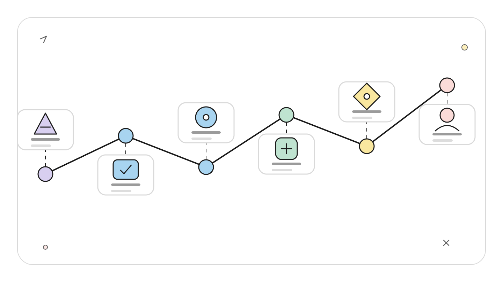
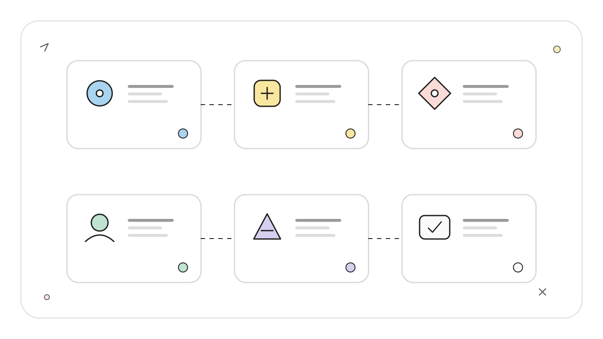
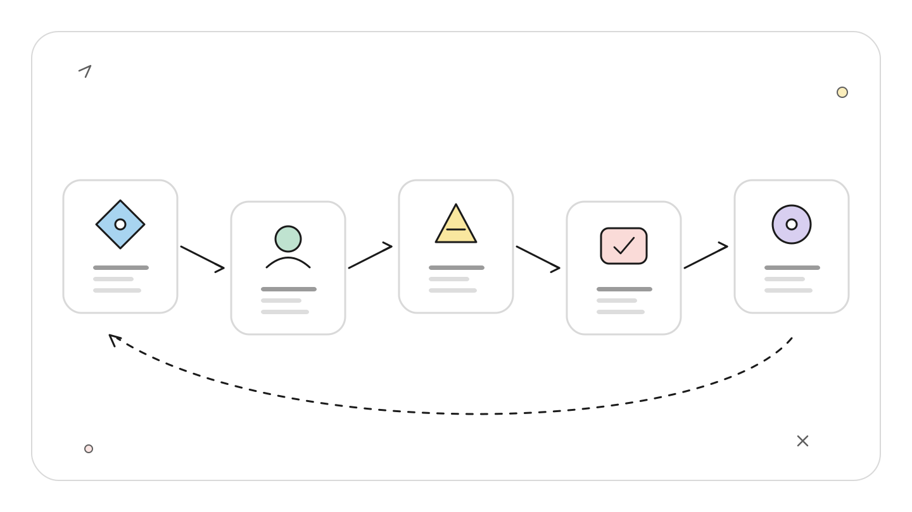
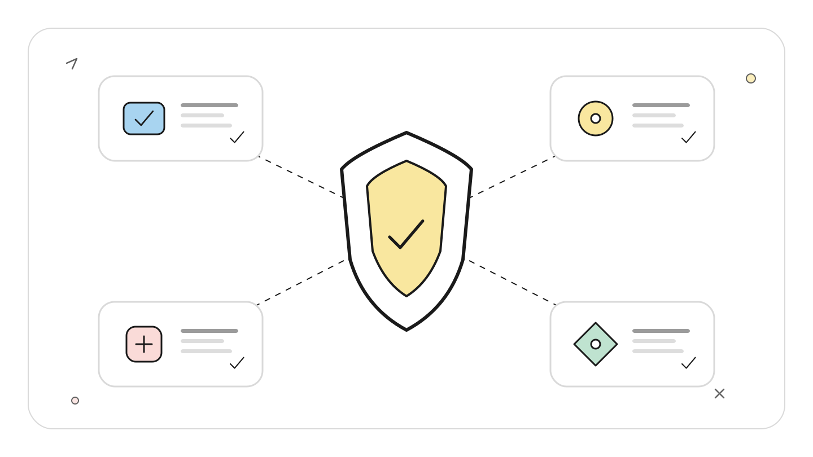
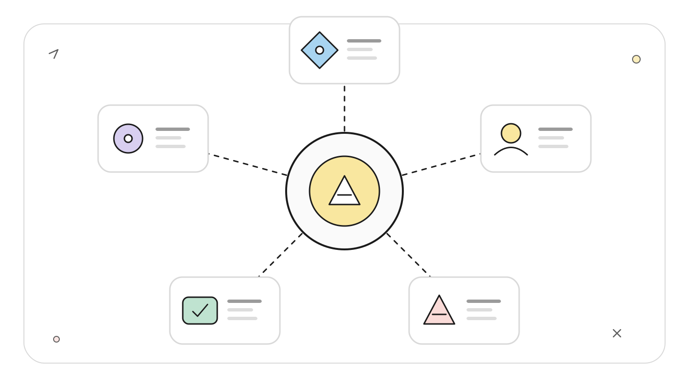
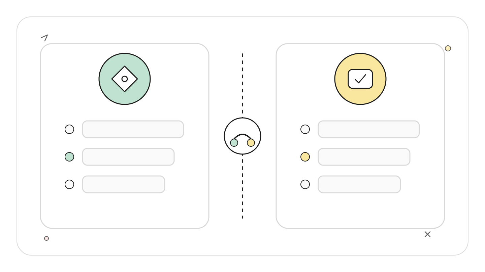

# Claude Code 后台 Agent 控制面：派发、接管、通知与恢复

**TL;DR：** `claude agents` 管理的是脱离终端运行的完整 Claude Code 会话，不是当前对话里的 Subagent 列表。把长任务交给后台后，可以用 `peek`、`logs` 低成本观察，用 `attach` 进入原会话处理权限或方向问题，再把它放回后台。Agent View 在资料基线 2026-07-22 仍是 Research Preview，关机不会让进程继续运行，但保存的会话可以在重启后接着处理。

**读者定位：** 熟悉 Claude Code 交互模式，希望并行处理多个仓库任务或把测试、排障交给后台的中级开发者。

> 资料与验证边界：本文依据 Anthropic 官方 Agent View、会话、Remote Control、Hooks 文档和官方 changelog 整理，资料基线为 2026-07-22。命令语义来自官方文档，未在本仓库启动后台服务、制造关机或移动端推送条件，因此不把恢复和通知流程描述为本地实测。

## 先分清三种「后台」

Claude Code 里有三种容易混在一起的机制。

<!-- wos:illustration claude-code-engineering/35-background-agents-control-plane/01-timeline-lifecycle-timeline.svg -->

<!-- /wos:illustration -->

`claude agents` 打开 Agent View。这里的每一行都是完整会话，由本机每用户一个 supervisor 进程托管。会话可以脱离终端继续工作，也能重新附着到任意终端。该功能要求 Claude Code v2.1.139 或更高版本，官方标记为 Research Preview。

当前会话里的后台任务是另一层。Bash 命令或 Subagent 可以在当前会话内并发运行，使用 `/tasks` 查看。它们依附于这段会话的调度关系，不会自动成为 Agent View 里的独立工作会话。

Remote Control 也不是后台执行器。它把本机正在运行的会话暴露给 claude.ai 或 Claude 移动端，模型和工具仍在本机执行。移动端接管、长任务完成推送和 Agent View 的多会话看板可以组合使用，但职责不同。

可以把它们想成一间维修中心。Agent View 是派工台，每张工单有自己的技师和工作台；`/tasks` 是某位技师手里的待办夹；Remote Control 是让负责人从手机接入这张工单的远程电话。

## 控制面的真实组成

```text
终端 A                              终端 B 或移动端
  |                                      |
  | claude agents                        | claude attach <id>
  v                                      v
+--------------------+          +--------------------+
| Agent View         |          | 原会话的交互界面   |
| 派发、筛选、观察   |          | 回答、审批、改方向 |
+----------+---------+          +----------+---------+
           |                               |
           +---------------+---------------+
                           v
                +----------------------+
                | 本机 supervisor      |
                | 会话进程与状态索引   |
                +----------+-----------+
                           |
               +-----------+-----------+
               |                       |
        后台会话 7c5dcf5d         后台会话 a812be90
        独立上下文与工作树          独立上下文与工作树
```

<!-- wos:illustration claude-code-engineering/35-background-agents-control-plane/02-infographic-concept-map.svg -->

<!-- /wos:illustration -->

supervisor 与 Agent View 界面分离。关闭看板不会停止会话。状态默认保存在 `~/.claude/daemon/` 和 `~/.claude/jobs/<id>/`，可以用 `claude daemon status` 查看 supervisor 是否可达、版本和存活 worker 数量。

后台会话开始编辑 Git 仓库前，会迁入 `.claude/worktrees/` 下的隔离工作树。它并不等于彻底沙箱化：工作树仍共享仓库的 Git 元数据和已保存权限；非 Git 目录若没有自定义 `WorktreeCreate` Hook，则可能直接编辑原目录。

## 一套可验证的派发与接管流程

先确认版本，再派发一个有明确完成条件的任务：

<!-- wos:illustration claude-code-engineering/35-background-agents-control-plane/03-flowchart-operating-flow.svg -->

<!-- /wos:illustration -->

```bash
claude --version
claude --bg --name "flaky-test-fix" \
  "定位 SettingsChangeDetector 的不稳定测试，提交最小修复，并运行相关测试。不要推送。"
```

`--bg` 的参数是交互会话的初始提示，不能和 `-p` 或 `--print` 组合。命令会返回短 ID。后续操作都围绕该 ID：

```bash
claude agents
claude agents --json
claude logs 7c5dcf5d
claude attach 7c5dcf5d
claude stop 7c5dcf5d
claude respawn 7c5dcf5d
```

观察时有三个档位。Agent View 行状态适合判断 `working`、`blocked`、`done`、`failed` 或 `stopped`；`Space` 打开的 peek 面板适合读最近上下文并回复；`attach` 会把终端接到同一段对话，适合处理权限提示、重写计划或人工检查 diff。接管不是复制一份新会话，原上下文和会话 ID 不变。

正在交互的会话也能转入后台：

```text
/bg 继续运行测试，失败时停下来等我处理
```

如果会话中存在无法搬迁的工作，例如某些 monitor，Claude Code 会先显示对话框，列出将停止和将保留的任务。此时先看 `/tasks`，不要把「会话已后台化」误解为「所有内部任务都无损迁移」。

## 通知应报告「需要人」，不应制造噪声

本机桌面通知适合权限请求和输入等待。以下 macOS 配置来自官方 Hooks 指南，加入 `~/.claude/settings.json` 后可用 `/hooks` 检查是否加载：

<!-- wos:illustration claude-code-engineering/35-background-agents-control-plane/04-infographic-verification-guardrails.svg -->

<!-- /wos:illustration -->

```json
{
  "hooks": {
    "Notification": [
      {
        "matcher": "",
        "hooks": [
          {
            "type": "command",
            "command": "osascript -e 'display notification \"Claude Code needs your attention\" with title \"Claude Code\"'"
          }
        ]
      }
    ]
  }
}
```

Remote Control 的移动推送适合离开电脑后的长任务。运行 `/remote-control` 或 `claude --remote-control "My Project"` 后，在 `/config` 启用移动推送。官方说明中，Claude 通常会在任务完成或需要决策时推送，也可以在提示里写 `notify me when the tests finish`。移动推送要求 v2.1.110 或更高版本，且没有按事件细分的规则。

通知只表示「回来看看」。它不是完成证明。后台会话标为 done 后，仍应读取 diff、测试输出和工作树状态。

## 长任务恢复到底恢复什么

睡眠期间，会话进程保留，机器唤醒后 supervisor 会重连。系统关机或重启会终止进程，Agent View 中的行会显示失败；对该行执行 attach、peek 或 reply 时，Claude Code 会从已保存对话重启处理。这里恢复的是会话记录和可达状态，不是把中断瞬间的进程、内存或正在执行的命令原样冻结后继续。

<!-- wos:illustration claude-code-engineering/35-background-agents-control-plane/05-framework-system-framework.svg -->

<!-- /wos:illustration -->

普通交互会话还可以通过名称或会话 ID 恢复：

```bash
claude --resume flaky-test-fix
claude --resume <session-id>
claude --continue
```

后台会话的短 ID 用于 `attach`、`logs`、`stop`；完整 `sessionId` 可用于 `--resume`。`claude agents --json` 同时暴露这些字段，适合写一个只读状态脚本。不要直接修改 `roster.json` 或各任务的 `state.json`。

## 权衡与局限

后台会话提高了吞吐量，也把注意力从单个终端转成调度问题。并发数越高，订阅额度、令牌和本机内存消耗越快。多个任务有文件交集时，即使自动工作树挡住了直接覆盖，最终合并仍会产生语义冲突。

<!-- wos:illustration claude-code-engineering/35-background-agents-control-plane/06-comparison-boundary-comparison.svg -->

<!-- /wos:illustration -->

Research Preview 意味着界面和快捷键可能变化。macOS 后台会话还有系统沙箱边界，例如不能读取 Desktop、Documents、Downloads，也不能访问本地网络主机。需要这些资源的任务应先验证环境，不要等跑了半小时才发现权限边界。

删除 Agent View 会话时，Claude Code 可能一并删除它创建的工作树。要保留的改动应先合并、提交或推送。`claude rm <id>` 会从看板移除会话，但本地 transcript 仍可由 `claude --resume` 找到，这与「删除所有历史」不是一回事。

一份合格的长任务交接信息至少要写清目录、完成条件、禁止动作和验证命令。控制面能让任务持续运行，不能替代任务定义。

## 延伸阅读

- [Manage multiple agents with agent view](https://code.claude.com/docs/en/agent-view)
- [Manage sessions](https://code.claude.com/docs/en/sessions)
- [Continue local sessions with Remote Control](https://code.claude.com/docs/en/remote-control)
- [Automate actions with hooks](https://code.claude.com/docs/en/hooks-guide)
- [Claude Code changelog](https://code.claude.com/docs/en/changelog)
