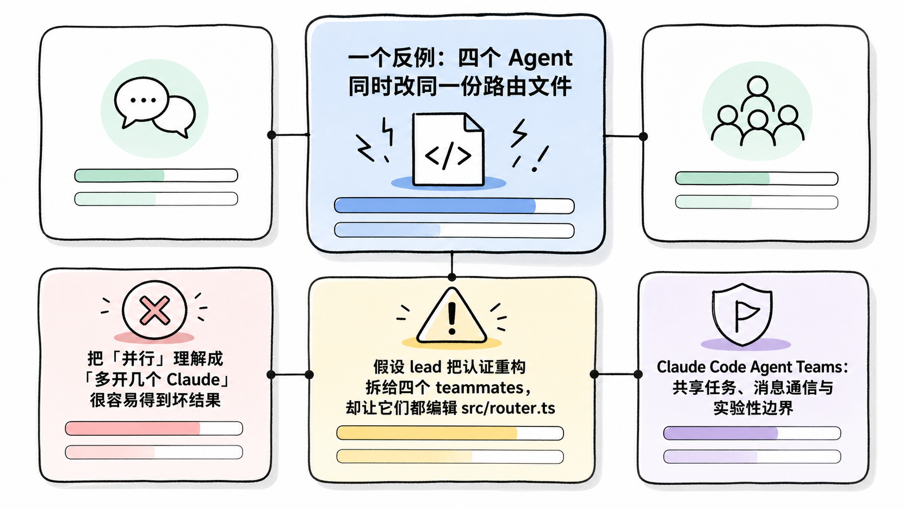
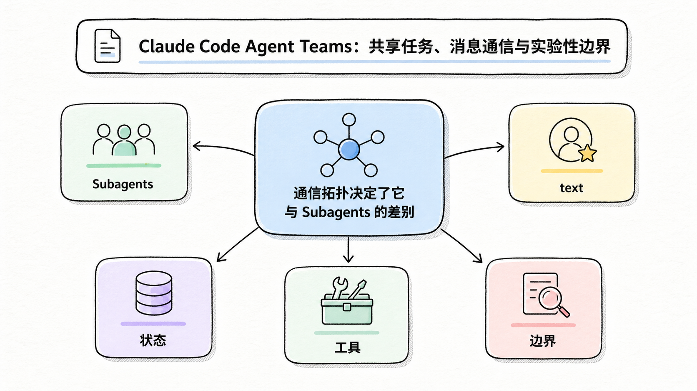
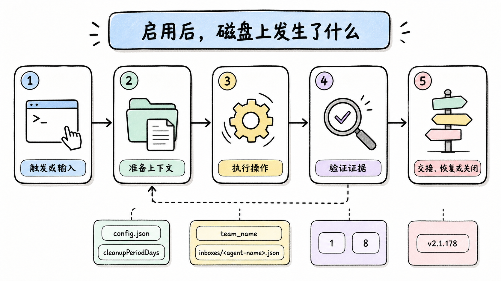
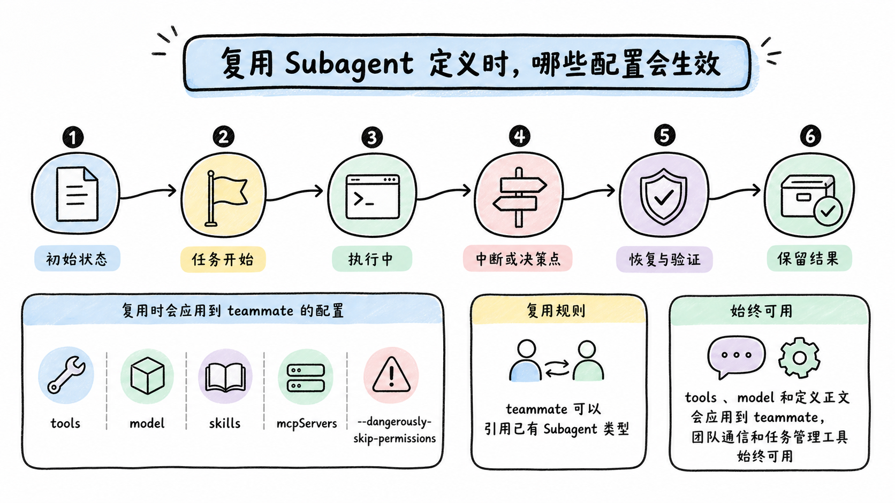
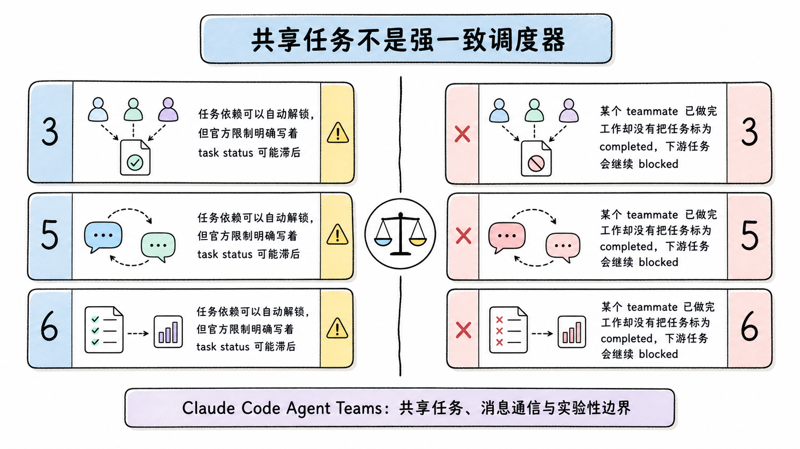
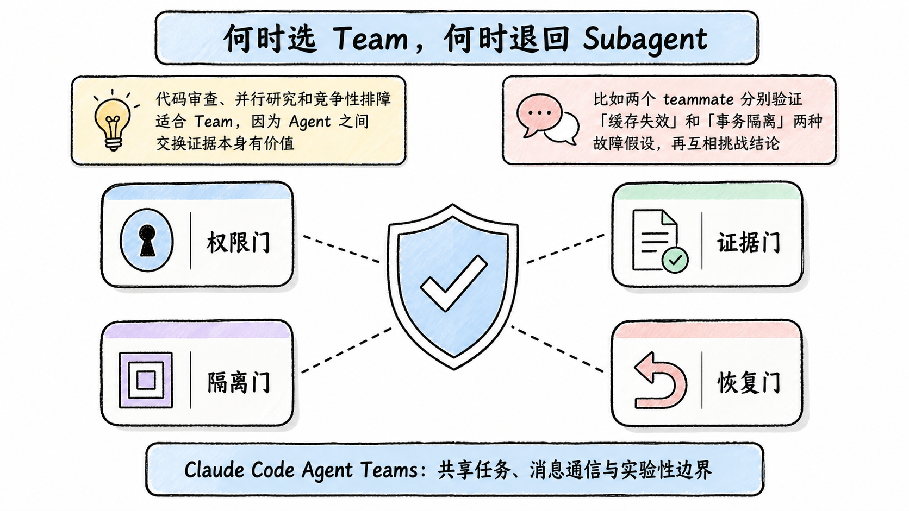

# Claude Code Agent Teams：共享任务、消息通信与实验性边界

**TL;DR：** Agent Teams 让一个 lead 协调多个独立 Claude Code 实例。teammates 有各自的上下文，通过共享任务列表认领工作，并用 mailbox 直接互发消息。它适合需要相互质疑和同步发现的并行工作；只要结果回到主会话的短任务，用 Subagents 更省令牌，也更少协调成本。Agent Teams 在 2026-07-22 仍是 Experimental，默认关闭。

**读者定位：** 已使用 Subagents，希望判断何时值得引入多 Agent 协作的中级开发者。

本文只复述和推导官方文档公开的运行机制，没有在当前仓库启动团队或测量令牌消耗。资料基线为 2026-07-22。版本行为变化较快，尤其是 v2.1.178 之后团队创建和清理方式已经调整，旧教程中的 `TeamCreate`、`TeamDelete` 不再适用。

## 一个反例：四个 Agent 同时改同一份路由文件

把「并行」理解成「多开几个 Claude」很容易得到坏结果。假设 lead 把认证重构拆给四个 teammates，却让它们都编辑 `src/router.ts`。每个实例看到的是自己的上下文，Agent Teams 又不会自动给 teammates 创建独立 worktree。后写入的内容可能覆盖先写入的内容，任务列表显示完成也不能证明合并正确。

<!-- wos:illustration claude-code-engineering/36-agent-teams/01-infographic-concept-map.png -->

<!-- /wos:illustration -->

适合团队的拆法是让边界跟文件所有权一致：一个 teammate 研究权限模型，一个修改服务层，一个补测试，一个只做审查。它们可以把发现发给彼此，但不要同时占有同一份文件。

这个反例揭示了 Agent Teams 的角色：它协调工作，不隔离文件。

## 通信拓扑决定了它与 Subagents 的差别

```text
Subagents

             +----------------+
             | 主会话         |
             +---+--------+---+
                 |        |
            委派 |        | 委派
                 v        v
             Subagent A  Subagent B
                 |        |
                 +---结果-+

Agent Teams

             +----------------+
             | Team lead      |
             +---+--------+---+
                 |        |
              task list + mailbox
                 |        |
                 v        v
             Teammate A <--> Teammate B
```

<!-- wos:illustration claude-code-engineering/36-agent-teams/02-framework-system-framework.png -->

<!-- /wos:illustration -->

Subagent 像被调用的专用函数。它拿到委派提示，在独立上下文里工作，把结果交回调用者。两个 Subagents 不会直接互相发消息，主会话承担全部串联。

Team 更像一个小型协作组。lead 仍负责拆解和汇总，但 teammates 能读取共享任务列表、认领未分配任务、声明依赖，也能按名字互发消息。每个 teammate 都是独立 Claude Code 实例，有独立上下文窗口。用户还可以绕过 lead，直接进入某个 teammate 的会话。

需要澄清的术语只有四个：

- lead 是当前主会话，团队生命周期内不能转让领导权。
- teammate 是独立实例，不继承 lead 的对话历史，只接收项目上下文和 spawn prompt。
- task list 是共享工作状态，依赖任务完成后可以解锁被阻塞任务。
- mailbox 是本地消息文件，消息会自动送达目标 Agent。

## 启用后，磁盘上发生了什么

Agent Teams 默认关闭。可以在 shell 中临时启用：

<!-- wos:illustration claude-code-engineering/36-agent-teams/03-flowchart-operating-flow.png -->

<!-- /wos:illustration -->

```bash
export CLAUDE_CODE_EXPERIMENTAL_AGENT_TEAMS=1
claude
```

也可以写入 Claude Code 的 settings：

```json
{
  "env": {
    "CLAUDE_CODE_EXPERIMENTAL_AGENT_TEAMS": "1"
  },
  "teammateDefaultModel": "sonnet"
}
```

进入会话后，用自然语言指定任务边界和命名，例如：

```text
创建一个 Agent Team。让 api-reviewer 检查接口兼容性，让 test-reviewer
检查现有测试覆盖。两者先独立工作，再互相交换发现。只做审查，不改文件。
```

团队形成后，Claude Code 在本机维护两类状态：

```text
~/.claude/teams/session-<session-id前8位>/config.json
~/.claude/tasks/session-<session-id前8位>/
```

`config.json` 是运行态，不应手工预创建或修改。团队配置目录随会话结束清理，任务目录会保留，保留时间受 `cleanupPeriodDays` 控制。v2.1.178 之前需要显式创建和删除命名团队；当前团队名由 session 派生，Agent 工具上的 `team_name` 输入已被忽略。

mailbox 位于团队目录的 `inboxes/<agent-name>.json`。Claude Code 会校验消息格式。官方文档还记录了一个历史边界：v2.1.207 之前，单条格式错误的消息可能持续阻塞整个 mailbox；当前版本会删除坏条目并继续投递有效消息。这类 changelog 事实比「Agent 会自动协作好」更有用，因为它说明协调层本身也会失败。

## 复用 Subagent 定义时，哪些配置会生效

teammate 可以引用已有 Subagent 类型。`tools`、`model` 和定义正文会应用到 teammate，团队通信和任务管理工具始终可用。`skills` 与 `mcpServers` frontmatter 不会按 Subagent 定义注入；teammate 像普通会话一样，从项目和用户设置加载 Skills 与 MCP。

<!-- wos:illustration claude-code-engineering/36-agent-teams/04-timeline-lifecycle-timeline.png -->

<!-- /wos:illustration -->

权限也不是逐成员出生时定制。teammates 以 lead 的权限模式启动，创建后才能分别调整。若 lead 使用 `--dangerously-skip-permissions`，成员也会继承这个模式。并行执行放大了错误权限的影响范围，因此更适合预先配置精确 allowlist，而不是图省事跳过审批。

## 共享任务不是强一致调度器

任务依赖可以自动解锁，但官方限制明确写着 task status 可能滞后。某个 teammate 已做完工作却没有把任务标为 completed，下游任务会继续 blocked。处理方法是检查实际产物，再手工更新任务或让 lead 提醒成员。

<!-- wos:illustration claude-code-engineering/36-agent-teams/05-comparison-boundary-comparison.png -->

<!-- /wos:illustration -->

lead 也可能在 teammates 完成前开始自己实现，甚至提前判断团队已经结束。给 lead 的提示应包含一条具体约束：等待所有依赖任务完成，读取每个成员的结果，再开始集成。这个约束减少竞态，不能保证消除竞态。

合理的粒度不是越小越好。官方建议多数工作从 3 至 5 个 teammates 起步，每个 teammate 保持约 5 至 6 个可交付任务。这里是产品指南，不是性能基准；实际数量仍受任务耦合和额度限制。

## 何时选 Team，何时退回 Subagent

代码审查、并行研究和竞争性排障适合 Team，因为 Agent 之间交换证据本身有价值。比如两个 teammate 分别验证「缓存失效」和「事务隔离」两种故障假设，再互相挑战结论。

<!-- wos:illustration claude-code-engineering/36-agent-teams/06-infographic-verification-guardrails.png -->

<!-- /wos:illustration -->

日志搜索、单模块审查、生成测试清单更适合 Subagent。主会话只需要结果，不需要 workers 讨论。顺序依赖明显、多人会改同一文件、每一步都要用户确认的任务，单会话通常更稳。

Agent View 解决的是另一类需求：用户亲自派发多个相互独立的后台会话。Agent Teams 由 lead 做协调；Agent View 中的会话只向用户报告，不共享 task list，也不会彼此通信。

## 实验性限制清单

启用前应接受这些边界：

- `/resume` 和 `/rewind` 不会恢复 in-process teammates。恢复后的 lead 可能尝试联系已经不存在的成员，只能重新 spawn。
- 关闭可能变慢，因为 teammate 会先完成当前请求或工具调用。
- 每个会话只能有一个 team，不支持嵌套 team，也不能更换 lead。
- in-process teammate 不能启动后台 Subagent，它自己的 Subagents 只能前台运行。
- split-pane 模式依赖 tmux 或 iTerm2；VS Code 集成终端、Windows Terminal 和 Ghostty 不支持该显示模式。
- Agent Teams 不为成员提供 worktree 隔离。同文件编辑必须靠任务切分规避，或改用手工并行 worktree 会话。

这些限制决定了一个务实起点：先用只读研究或审查验证通信质量。等任务所有权和质量门稳定后，再允许 teammates 写代码。

## 延伸阅读

- [Orchestrate teams of Claude Code sessions](https://code.claude.com/docs/en/agent-teams)
- [Run agents in parallel](https://code.claude.com/docs/en/agents)
- [Create custom subagents](https://code.claude.com/docs/en/sub-agents)
- [Manage costs effectively](https://code.claude.com/docs/en/costs)
- [Claude Code changelog](https://code.claude.com/docs/en/changelog)
