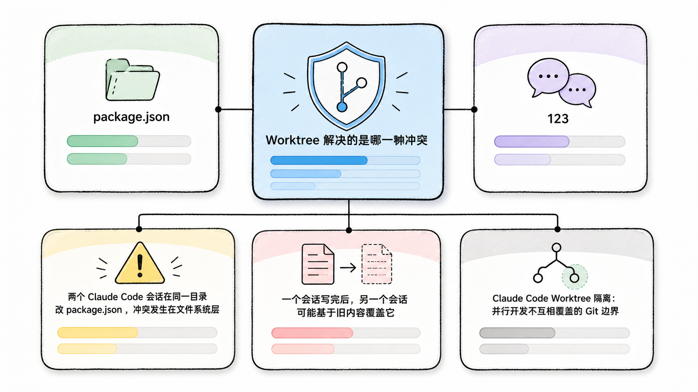
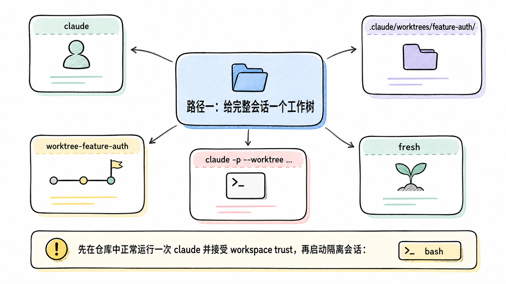
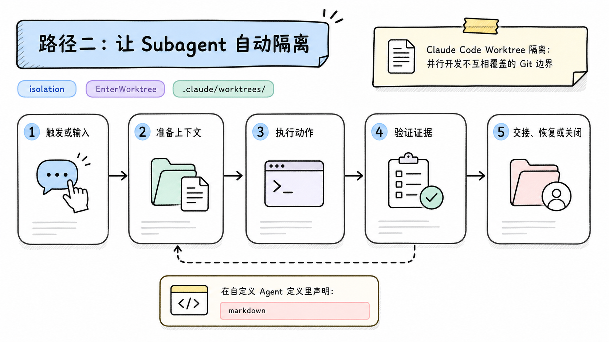
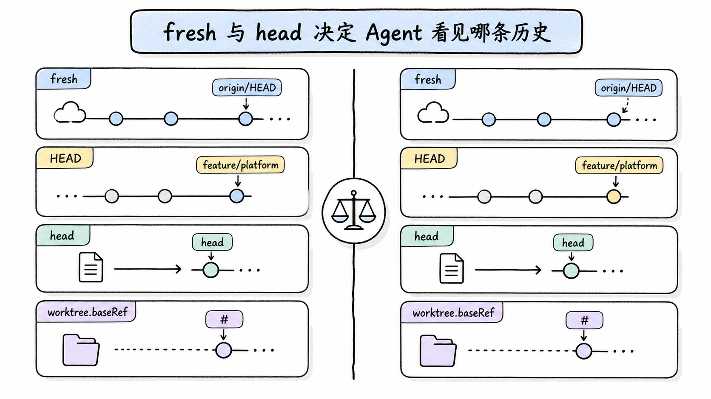
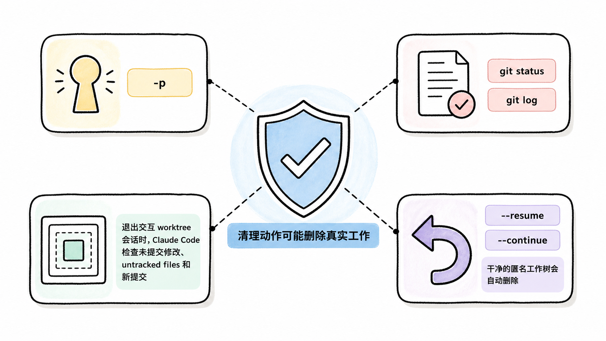
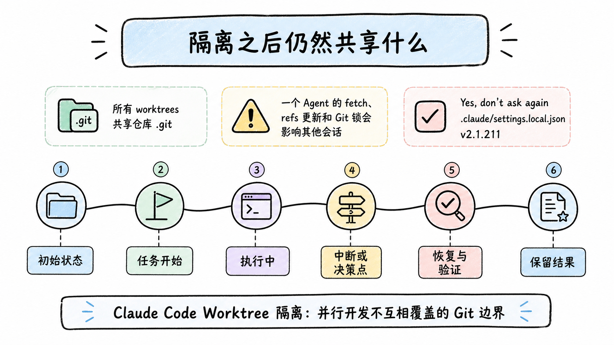

# Claude Code Worktree 隔离：并行开发不互相覆盖的 Git 边界

**TL;DR：** `claude --worktree <name>` 为会话创建单独目录和分支，`isolation: worktree` 为 Subagent 创建临时工作树。默认 `worktree.baseRef` 是 `fresh`，从远端默认分支起步；需要看到本地未推送提交时才改成 `head`。隔离的是工作目录和分支，不是 `.git`、权限批准、依赖缓存或最终合并风险。

**读者定位：** 已掌握 Git 分支和 Claude Code Subagents，准备并行修改同一仓库的中级开发者。

本文的命令和配置按 Anthropic 官方 worktree 文档、settings 参考及 Git 官方手册核对，时间截点为 2026-07-22。当前仓库未执行这些命令，也没有创建或删除工作树；文中「会发生什么」表示官方定义的行为，不代表一次本机复现记录。

## Worktree 解决的是哪一种冲突

两个 Claude Code 会话在同一目录改 `package.json`，冲突发生在文件系统层。一个会话写完后，另一个会话可能基于旧内容覆盖它。Git 分支本身挡不住这个问题，因为两个进程仍在写同一份工作区文件。

<!-- wos:illustration claude-code-engineering/37-worktree-isolation/01-infographic-concept-map.png -->

<!-- /wos:illustration -->

Git worktree 给每个任务一套独立文件和独立分支，同时复用仓库对象库。它像一栋仓库的两个装配间：零件目录和装配台分开，中央库存记录仍是共享的。Claude Code 在这个 Git 机制上补了创建、进入、恢复和清理流程。

```text
repo/
├── 主工作区                   branch: feature/platform
└── .claude/worktrees/
    ├── feature-auth/          branch: worktree-feature-auth
    └── bugfix-123/            branch: worktree-bugfix-123

共享：Git 对象与 refs、项目级插件、保存的权限批准
分离：工作区文件、索引、HEAD、分支提交线
```

## 路径一：给完整会话一个工作树

先在仓库中正常运行一次 `claude` 并接受 workspace trust，再启动隔离会话：

<!-- wos:illustration claude-code-engineering/37-worktree-isolation/02-framework-system-framework.png -->

<!-- /wos:illustration -->

```bash
claude --worktree feature-auth
```

短参数等价：

```bash
claude -w feature-auth
```

默认目录是 `.claude/worktrees/feature-auth/`，默认分支名是 `worktree-feature-auth`。省略名称时，Claude Code 会生成名称。建议把内部目录加入忽略规则：

```gitignore
.claude/worktrees/
```

交互模式首次使用会检查 workspace trust。`claude -p --worktree ...` 的非交互模式跳过该检查，但这不代表命令获得了额外文件权限。

同名工作树已存在时，Claude Code 会尝试复用。对干净且没有独有提交的 `fresh` 工作树，当前版本可能把它重置到最新默认分支；存在未提交文件、独有提交或无法确认状态时，会保留旧 tip。不要把「名称相同」当成「上下文和代码一定停在上次位置」，恢复前先检查：

```bash
git worktree list
git -C .claude/worktrees/feature-auth status --short --branch
```

## 路径二：让 Subagent 自动隔离

在自定义 Agent 定义里声明：

<!-- wos:illustration claude-code-engineering/37-worktree-isolation/03-flowchart-operating-flow.png -->

<!-- /wos:illustration -->

```markdown
---
name: auth-implementer
description: Implement isolated authentication changes
isolation: worktree
tools: Read, Edit, Write, Bash
---

Only edit authentication-owned files. Run the focused test suite before returning.
```

当该 Subagent 启动时，Claude Code 为它创建临时工作树。若结束时没有改动，工作树会自动删除。存在改动时，主会话需要处理其结果和合并关系。这里的 `isolation` 避免 Subagent 直接踩主工作区，不会自动解决两个 Subagents 对同一逻辑做出不兼容修改。

当前会话也能让 Claude 调用 `EnterWorktree`。进入仓库 `.claude/worktrees/` 之外的路径会单独请求批准，因为 cwd、写权限和加载的项目配置都会随路径改变。

## `fresh` 与 `head` 决定 Agent 看见哪条历史

默认配置相当于：

<!-- wos:illustration claude-code-engineering/37-worktree-isolation/04-comparison-boundary-comparison.png -->

<!-- /wos:illustration -->

```json
{
  "worktree": {
    "baseRef": "fresh"
  }
}
```

`fresh` 从远端默认分支 `origin/HEAD` 起步。若仓库超过 24 小时没有 fetch，Claude Code 会尝试更新默认分支，最长等待 5 秒；失败时使用本地缓存。没有 remote，或 `origin/HEAD` 不可用时，才回退到当前本地 `HEAD`。

假设主工作区在 `feature/platform`，上面有两个未推送提交。新 Subagent 必须建立在这两个提交之上，就应显式选择：

```json
{
  "worktree": {
    "baseRef": "head"
  }
}
```

`head` 从当前本地 `HEAD` 建分支，会带上未推送提交和 feature branch 状态。在一个 worktree 内再创建 worktree 时，`head` 指那个 worktree 的 `HEAD`，不是最初主目录的 `HEAD`。

`worktree.baseRef` 只接受 `fresh` 或 `head`，不能填任意分支名。要从指定分支开始，直接使用 Git：

```bash
git worktree add ../project-bugfix bugfix-123
cd ../project-bugfix
claude
```

要从 GitHub PR 开始，可以给参数加引号，避免 shell 把 `#` 当注释：

```bash
claude --worktree "#1234"
```

## 新工作树为什么经常「跑不起来」

worktree 只检出 tracked files。主目录里的 `.env`、本地证书、SQLite 数据库、虚拟环境和 `node_modules` 通常不会出现。代码隔离成功，运行环境却缺了一半，这是最常见的落差。

`.worktreeinclude` 可以复制同时满足「被 Git 忽略」和「匹配规则」的文件：

```gitignore
.env
.env.local
config/secrets.json
```

它使用 `.gitignore` 语法，适用于 `--worktree`、Subagent worktree 和 Claude Code 创建的其他 Git worktrees。它不会复制 tracked files。若用 `WorktreeCreate` Hook 替换默认创建逻辑，`.worktreeinclude` 不再处理，复制动作要写进 Hook。

复制 secrets 会扩大落盘副本数量。能通过测试凭据、临时令牌或启动脚本生成的内容，不要因为方便就加入 `.worktreeinclude`。依赖目录也更适合在各工作树安装或使用包管理器缓存，而不是整目录复制。

## 清理动作可能删除真实工作

退出交互 worktree 会话时，Claude Code 检查未提交修改、untracked files 和新提交。干净的匿名工作树会自动删除；命名会话会先询问。工作树有改动时，选择 remove 会连同目录、分支、未提交文件和独有提交一起移除。

<!-- wos:illustration claude-code-engineering/37-worktree-isolation/05-infographic-verification-guardrails.png -->

<!-- /wos:illustration -->

非交互 `-p` 没有退出提示，因此不会自动清理：

```bash
git worktree list
git worktree remove .claude/worktrees/feature-auth
git worktree prune
```

执行 remove 前应先运行 `git status` 和 `git log`。本文没有执行删除命令；上面的命令是维护入口，不是建议无检查批量清理。

会话恢复时，如果原 worktree 仍存在，`--resume` 或 `--continue` 会返回该目录。目录已被删除时，会话改在启动 Claude 的目录恢复。对依赖旧路径的命令和相对文件引用，这个差异会改变行为。

## 隔离之后仍然共享什么

所有 worktrees 共享仓库 `.git`。一个 Agent 的 fetch、refs 更新和 Git 锁会影响其他会话。项目级插件也共享。v2.1.211 起，在任一 worktree 选择 `Yes, don't ask again` 保存的 Bash 权限会写回主 checkout 的 `.claude/settings.local.json`，因此对其他 worktrees 也生效。

<!-- wos:illustration claude-code-engineering/37-worktree-isolation/06-timeline-lifecycle-timeline.png -->

<!-- /wos:illustration -->

这带来一个重要结论：worktree 是改动隔离，不是权限隔离。高风险并行任务还要限制 tools、命令和凭据。最终合并也必须做正常的代码审查和测试，独立目录不会证明设计彼此兼容。

## 延伸阅读

- [Run parallel sessions with worktrees](https://code.claude.com/docs/en/worktrees)
- [Claude Code settings](https://code.claude.com/docs/en/settings)
- [Create custom subagents](https://code.claude.com/docs/en/sub-agents)
- [Git worktree documentation](https://git-scm.com/docs/git-worktree)
- [Claude Code changelog](https://code.claude.com/docs/en/changelog)
