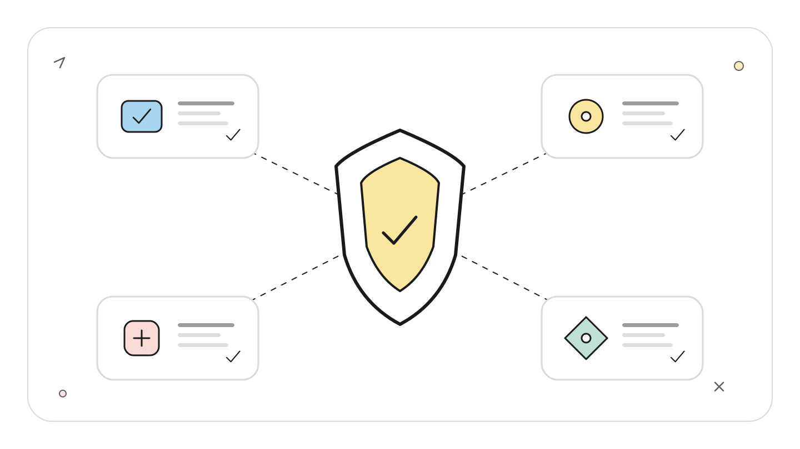
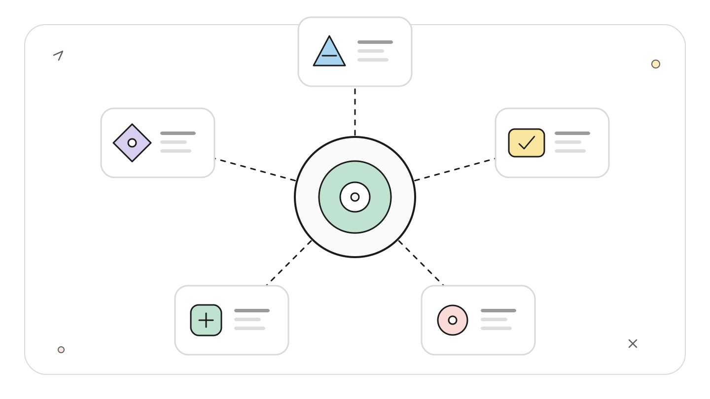
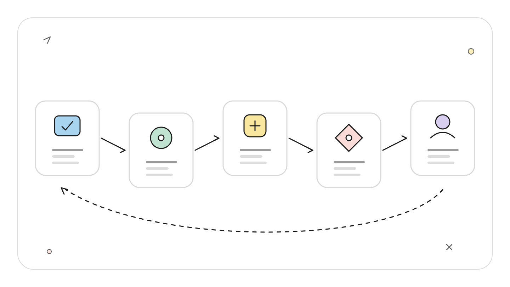
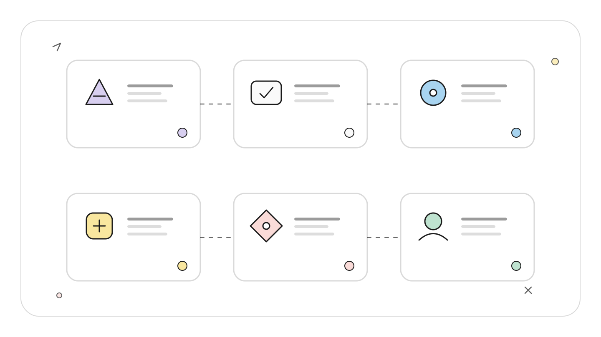
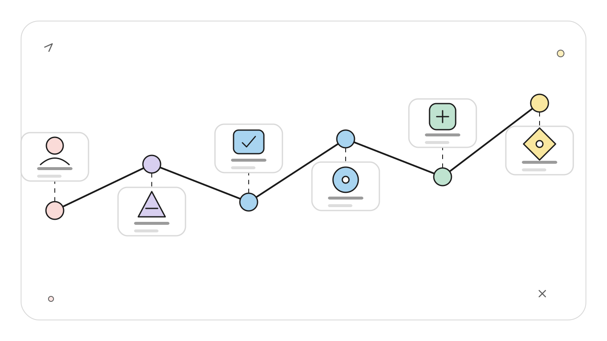
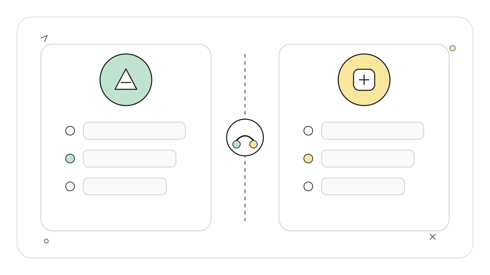

# Claude Code 记忆与强制规则：CLAUDE.md、Auto Memory、Subagent Memory 和 Hooks 如何分层

**TL;DR：** CLAUDE.md 是人写的长期指令，Auto Memory 是 Claude 自己积累的仓库经验，Subagent Memory 给某个角色单独保存知识。三者都会影响模型判断，却都不是强制控制。必须阻止的命令交给权限和 `PreToolUse` Hook，必须完成的验收交给 `Stop` 或 `SubagentStop` Hook。

**读者定位：** 已会配置 CLAUDE.md 和 Hooks，正在设计团队级 Claude Code 规则体系的中级开发者。

资料基线是 2026-07-22。本文依据 Anthropic 官方 memory、subagents、hooks 文档以及公开 issue 核对边界。配置片段是可执行示例，但本次只创建文档，没有把 Hook 安装进当前仓库，也没有触发危险命令验证阻断结果。

## 先做一次失败分析

规则写在 CLAUDE.md：

<!-- wos:illustration claude-code-engineering/38-memory-and-enforcement/01-infographic-verification-guardrails.svg -->

<!-- /wos:illustration -->

```markdown
- Never run `git push --force`.
- Run unit tests before finishing.
```

某次长会话里，模型仍可能选错命令，或在上下文冲突时弱化这条指令。CLAUDE.md 已经加载，问题在于它的产品语义只是上下文。官方文档明确说明，CLAUDE.md 作为 system prompt 之后的 user message 注入，模型会尝试遵循，但不保证严格执行。

如果组织把禁止强推只写进 CLAUDE.md，它得到的是高概率行为引导，不是安全边界。设计时要把「知道什么」和「允许做什么」拆开。

## 四层策略栈

```text
第 4 层  Hooks 与权限
          在生命周期事件上执行，能够阻止工具调用或阻止结束

第 3 层  Subagent Memory
          某个角色跨会话积累的专属经验

第 2 层  Auto Memory
          Claude 为当前仓库自动记录的发现和偏好

第 1 层  CLAUDE.md 与 .claude/rules/
          人和团队声明的项目事实、命令、约定
```

<!-- wos:illustration claude-code-engineering/38-memory-and-enforcement/02-framework-system-framework.svg -->

<!-- /wos:illustration -->

层级越高，不代表内容更「聪明」。第 1 至 3 层给模型材料，第 4 层在确定时间点运行控制逻辑。策略要按失败后果分配，不要把所有内容塞进一个大文件。

## CLAUDE.md：人负责维护的公开约定

CLAUDE.md 适合放团队希望每次会话都看见的事实：构建命令、目录边界、代码约定、审查流程。项目根文件在启动时加载，嵌套 CLAUDE.md 会在 Claude 读取对应子树文件时延迟加载。`@path` 导入有助于组织内容，但导入文件仍会进入上下文，不会节省令牌。

<!-- wos:illustration claude-code-engineering/38-memory-and-enforcement/03-flowchart-operating-flow.svg -->

<!-- /wos:illustration -->

一份克制的项目文件可以是：

```markdown
# Repository instructions

## Verification

- Run `pnpm test` after changing TypeScript source.
- Run `pnpm lint` after editing configuration.

## Boundaries

- Do not edit generated files under `dist/`.
- Do not push branches unless the user asks.

## Architecture

- HTTP handlers call application services. They do not access the database directly.
```

运行 `/context` 可以检查本次会话实际加载了哪些 memory files；`/memory` 用于打开这些文件并管理 Auto Memory。项目根 CLAUDE.md 在 `/compact` 后会重新注入，嵌套文件要等再次读取对应目录才重新加载。

文件太长会降低规则命中率，也增加上下文成本。官方建议在超过约 200 行时检查是否能把路径相关规则移到 `.claude/rules/`。CLAUDE.md 本身会完整加载，200 行或 25KB 的截断规则只针对 Auto Memory 的 `MEMORY.md`。

## Auto Memory：机器本地的经验索引

Auto Memory 从 v2.1.59 起可用，默认开启。Claude 自行判断哪些构建命令、排障发现和偏好值得跨会话保存。每个 Git 仓库的默认目录是：

<!-- wos:illustration claude-code-engineering/38-memory-and-enforcement/04-infographic-concept-map.svg -->

<!-- /wos:illustration -->

```text
~/.claude/projects/<project>/memory/
├── MEMORY.md
├── debugging.md
└── api-conventions.md
```

同一仓库的 worktrees 和子目录共享这份 Auto Memory。它不会自动同步到另一台机器或云环境。启动时只加载 `MEMORY.md` 前 200 行或 25KB，先达到哪个限制就用哪个；主题文件按需读取。

禁用配置可写成：

```json
{
  "autoMemoryEnabled": false
}
```

也可以设置 `CLAUDE_CODE_DISABLE_AUTO_MEMORY=1`。自定义 `autoMemoryDirectory` 只能来自 policy、user settings 或 `--settings`，不能由项目 settings 重定向。这个限制防止克隆来的仓库把记忆写入敏感路径。

Auto Memory 的内容可读、可改、可删。它适合记录「这个仓库的 API 测试需要本地 Redis」，不适合保存 secrets，也不适合承载必须执行的合规规则。

## Subagent Memory：给角色一块独立笔记本

主会话 Auto Memory 不会自动加载给普通 Subagent。fork 是例外，因为它继承父上下文。需要让 `code-reviewer` 长期积累审查模式时，在 Agent frontmatter 里声明：

<!-- wos:illustration claude-code-engineering/38-memory-and-enforcement/05-timeline-lifecycle-timeline.svg -->

<!-- /wos:illustration -->

```markdown
---
name: code-reviewer
description: Review code for repository-specific defects
memory: project
tools: Read, Grep, Glob
---

Read your memory before reviewing. Record recurring defects with file paths and
the reason they matter. Do not store credentials or copied production data.
```

三种 scope 的含义不同：

| scope | 路径 | 适用边界 |
|---|---|---|
| `user` | `~/.claude/agent-memory/<agent>/` | 跨所有项目的个人角色经验 |
| `project` | `.claude/agent-memory/<agent>/` | 仓库专属，可进入版本控制 |
| `local` | `.claude/agent-memory-local/<agent>/` | 仓库专属，不应提交 |

启用后，Claude Code 会给该 Subagent 自动开放 Read、Write、Edit 以维护记忆，并加载其 `MEMORY.md` 前 200 行或 25KB。这会改变原本的最小工具集。只读审查 Agent 一旦启用 memory，也能写自己的 memory 目录；安全评估应把这项写能力算进去。

## Hooks：把文字规则变成执行门

以下脚本阻止两个明确命令模式。保存为 `.claude/hooks/block-risky.sh` 并赋予执行权限：

```bash
#!/usr/bin/env bash
set -euo pipefail

input=$(cat)
command=$(jq -r '.tool_input.command // ""' <<<"$input")

if [[ "$command" =~ (^|[[:space:];])(rm[[:space:]]+-rf|git[[:space:]]+push[[:space:]]+--force)([[:space:]]|$) ]]; then
  echo "Blocked by project policy: destructive command" >&2
  exit 2
fi

exit 0
```

项目 settings 注册 `PreToolUse`：

```json
{
  "hooks": {
    "PreToolUse": [
      {
        "matcher": "Bash",
        "hooks": [
          {
            "type": "command",
            "command": "\"$CLAUDE_PROJECT_DIR\"/.claude/hooks/block-risky.sh"
          }
        ]
      }
    ]
  }
}
```

Hook 从 stdin 收到 JSON。对 `PreToolUse`，退出码 2 会阻止工具调用，并把 stderr 作为反馈交给 Claude。多个 Hook 同时命中时都会运行，最后按最严格决策合并；一个 deny 不会阻止同级日志 Hook 先产生副作用。

可用两个输入验证脚本，不需要真的执行危险命令：

```bash
printf '%s\n' '{"tool_input":{"command":"git status"}}' \
  | .claude/hooks/block-risky.sh

printf '%s\n' '{"tool_input":{"command":"git push --force origin main"}}' \
  | .claude/hooks/block-risky.sh
```

预期第一条退出码为 0，第二条为 2 并输出阻断原因。安装后再用 `/hooks` 确认 matcher 和来源文件。

`Stop` 能在验收未通过时阻止主 Agent 结束，`SubagentStop` 对 Subagent 做同类检查。含判断的 gate 可以使用 prompt 或 agent Hook，确定性规则优先使用 command Hook。LLM gate 仍有概率误判，不能包装成确定性安全控制。

## 组合时最容易踩的边界

同一句规则不要在 CLAUDE.md、Auto Memory 和多个 Agent Memory 中复制。副本会漂移，也会浪费上下文。团队约定留在 CLAUDE.md；自动发现留在 Auto Memory；角色经验留在对应 Subagent Memory；不可违反的动作写成权限或 Hook。

<!-- wos:illustration claude-code-engineering/38-memory-and-enforcement/06-comparison-boundary-comparison.svg -->

<!-- /wos:illustration -->

公开 issue 记录过 Subagent 工具调用没有触发父会话 Hook 的版本问题，例如 issue #34692 报告的是 Claude Code v2.1.76。当前官方文档支持在自定义 Subagent frontmatter 内声明 `hooks:`。安全要求不能依赖「应该继承」，应在目标版本用 `/hooks`、无害测试输入和真实 Agent 调用路径验证覆盖率。这里引用 issue 是为了说明版本与作用域风险，不把它当成当前版本必然存在的事实。

记忆可以让 Agent 少犯重复错误。强制门负责让某类错误没有执行机会。两者放在一起才是一套可审计策略。

## 延伸阅读

- [How Claude remembers your project](https://code.claude.com/docs/en/memory)
- [Create custom subagents](https://code.claude.com/docs/en/sub-agents)
- [Automate actions with hooks](https://code.claude.com/docs/en/hooks-guide)
- [Hooks reference](https://code.claude.com/docs/en/hooks)
- [Subagent Hook propagation report, issue #34692](https://github.com/anthropics/claude-code/issues/34692)
