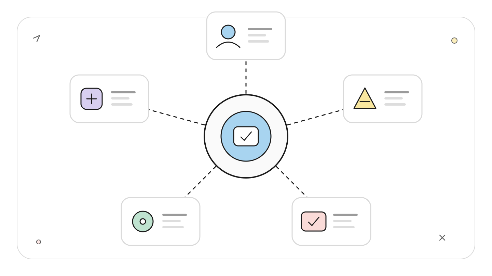
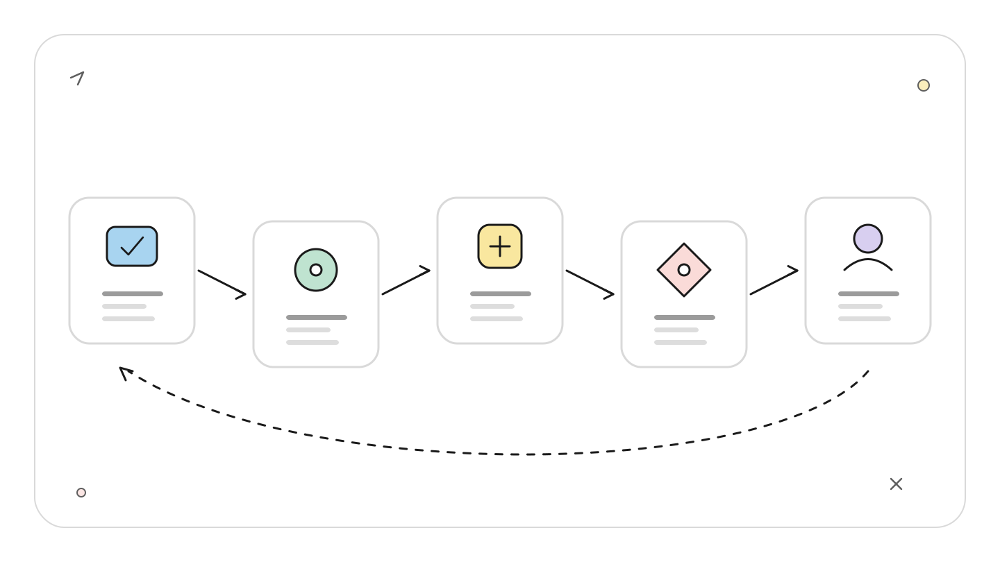
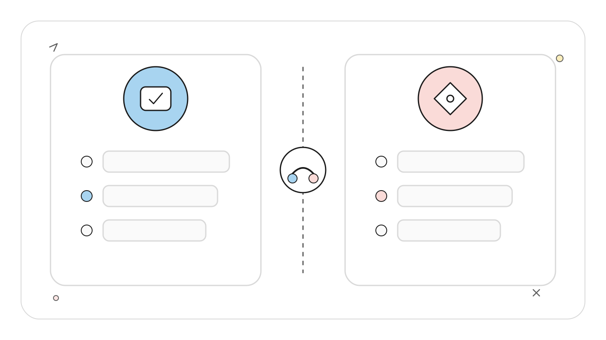
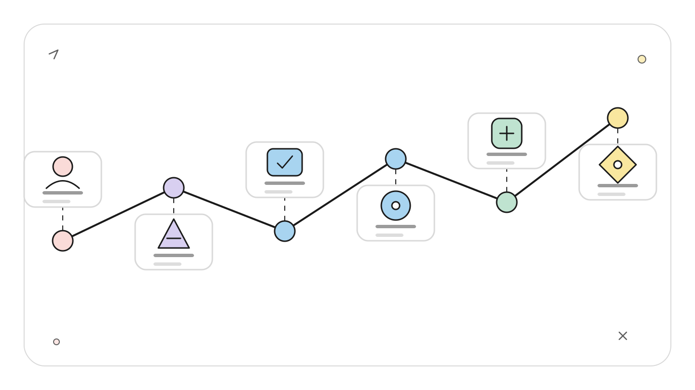
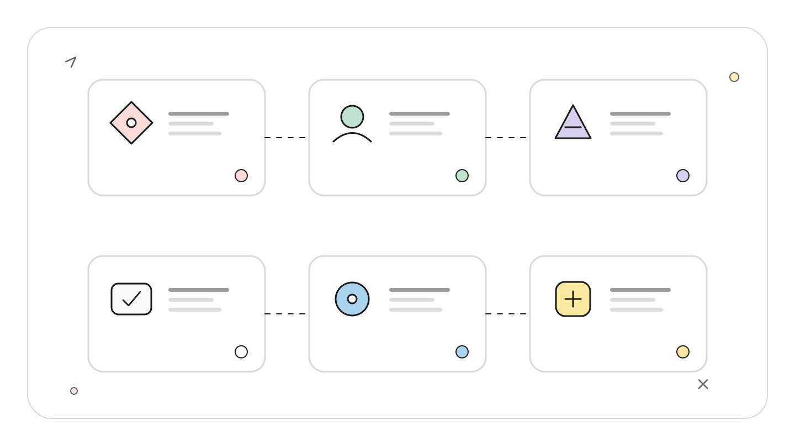
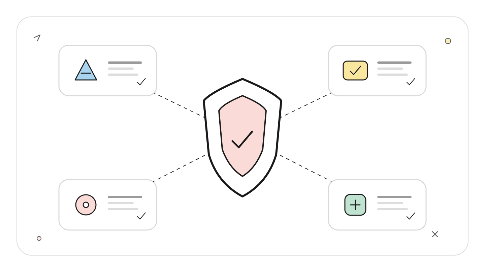

# Claude Code Chrome 视觉验证：从页面操作到可复核证据链

**TL;DR：** Chrome 集成把页面读取、点击、输入、控制台、网络请求和截图接进 Claude Code。一次可靠的前端验收不能只看截图，应同时验证可见状态、交互结果和运行时信号，并保存必要证据。站点权限由浏览器扩展控制，登录态会直接暴露给自动化会话；用专门测试账号和最小站点授权更安全。

**读者定位：** 会启动本地 Web 应用，希望让 Claude Code 完成端到端 UI 检查的中级前端或全栈开发者。

本篇依据 2026-07-22 可见的 Anthropic 官方 Chrome 集成、权限与 changelog 资料。当前仓库没有可运行的 Web 应用，也没有连接浏览器扩展，因此下面给出的是可复核验证协议和命令，不声称已经执行登录、截图或视觉回归。

**功能状态：** Claude in Chrome 扩展在 2026-07-17 更新的 Chrome Web Store 页面仍标为 Beta。CLI 文档没有给 Chrome 集成单独标 Experimental 或 Preview，本文不替官方扩大标签范围。

## 截图为什么经常给出假信心

一张登录页截图只能证明某个时刻画面存在。它不能回答按钮是否可点、错误文案是否由真实校验触发、请求是否返回 401、控制台是否抛异常，也不能证明键盘焦点和跳转路径正确。

<!-- wos:illustration claude-code-engineering/39-chrome-visual-verification/01-framework-system-framework.svg -->

<!-- /wos:illustration -->

视觉验证至少要形成四类证据中的多项组合：

1. 页面状态：URL、标题、关键 DOM 文本、元素可见性。
2. 用户动作：点击、输入、提交、返回或刷新。
3. 运行时信号：控制台错误、网络请求状态、DOM 变化。
4. 视觉快照：截图或 GIF，供人复核布局和过程。

不是每个检查都需要四项全开。纯文案修改可以用 DOM 文本加截图；登录流程应加入网络和跳转；动画或多步操作更适合 GIF。证据种类由失败模式决定。

## 连接层：CLI、Native Messaging 和扩展

Claude Code 通过 Claude in Chrome 扩展控制可见的 Chromium 浏览器窗口。浏览器动作实时发生，并共享当前浏览器登录态。2026-07-22 的官方文档要求直接 Anthropic 方案，并通过 `/login` 登录；API key、`claude setup-token` 长期令牌以及 Bedrock、Google Cloud、Microsoft Foundry 等第三方 provider 不能直接启用这套集成。

<!-- wos:illustration claude-code-engineering/39-chrome-visual-verification/02-flowchart-operating-flow.svg -->

<!-- /wos:illustration -->

浏览器支持范围存在官方资料冲突。Claude Code 文档写明支持 Chrome、Edge，并能检测 Brave、Arc、Vivaldi、Opera 等 Chromium 浏览器；2026-07-17 更新的官方 Chrome Web Store 页面却写着其他 Chromium 浏览器不受支持。公开资料无法解释这项差异，生产验收应保守使用 Chrome 或 Edge，把其他浏览器视为未确认。WSL 不受支持。

启动入口：

```bash
claude --chrome
```

已有会话中使用：

```text
/chrome
```

`/chrome` 可检查连接、安装扩展、重连，也能设为默认启用。默认加载会让浏览器工具每次进入上下文，增加上下文占用；只在 UI 任务中传 `--chrome` 更可控。

连接由 Native Messaging host 桥接。macOS Chrome 的配置文件默认在：

```text
~/Library/Application Support/Google/Chrome/NativeMessagingHosts/
com.anthropic.claude_code_browser_extension.json
```

扩展检测失败时，依次确认扩展已启用、Chrome 正在运行、Claude Code 已更新，再从 `/chrome` 选择 Reconnect extension。长时间空闲后 service worker 可能休眠，报错 `Receiving end does not exist` 时也使用重连。页面存在 JavaScript alert、confirm、prompt 时，模态框会阻塞浏览器事件，需要人工先关闭。

## 权限层：读取与改变状态要分开

站点级权限继承自 Chrome 扩展设置。扩展决定 Claude 可以在哪些站点浏览、点击和输入。Claude Code 的项目权限不能替代浏览器站点权限。

<!-- wos:illustration claude-code-engineering/39-chrome-visual-verification/03-comparison-boundary-comparison.svg -->

<!-- /wos:illustration -->

Plan mode 下，官方当前分类如下：

| 行为 | 示例 | Plan mode |
|---|---|---|
| 读取 | `read_page`、`get_page_text`、查找元素、读 console 或 network、截图 | 不提示 |
| 改变状态 | 点击、输入、导航、管理标签页、录制 GIF | 请求批准 |

读取工具如果带了改变状态的参数，也会请求批准。例如 screenshot 的 `save_to_disk` 会写文件，console reader 的 `clear` 会清状态。`browser_batch` 只有在内部每个动作都只读时才免提示。

浏览器复用真实登录态既方便也危险。验证生产管理台时，一个错误点击可能创建、删除或发送真实数据。更稳的边界是测试账号、测试环境、受限站点 allowlist，以及在提示中明确禁止提交、支付、发送和删除。

## 一份端到端验收合同

以 `localhost:3000/login` 的表单校验为例，先把验收条件写成观察项，不要只说「看看页面是否正常」：

<!-- wos:illustration claude-code-engineering/39-chrome-visual-verification/04-timeline-lifecycle-timeline.svg -->

<!-- /wos:illustration -->

```text
打开 http://localhost:3000/login，执行以下验证：

1. 记录初始 URL、页面标题和登录按钮是否可见。
2. 输入格式错误的邮箱并提交，记录实际错误文案。
3. 确认 URL 没有跳转，检查 console 是否出现 error。
4. 检查这次提交是否发出登录请求；若发出，记录路径和状态码。
5. 保存错误状态截图到磁盘。
6. 不使用真实账号，不尝试绕过权限，不改动任何站外数据。

最后按「观察到的事实、未通过项、证据文件路径、未验证项」返回。
```

这段提示有两个作用。它把「正常」拆成可观察事实，也要求模型区分没发生、没看到和没验证。若应用规范规定无效邮箱应在客户端阻断请求，第 4 项就能区分 UI 文案正确但仍错误调用后端的实现。

验证有效账号流程时，应使用专门测试账号，并把成功条件写到目标页面和网络响应：

```text
使用测试账号完成登录。验证最终 URL 是 /dashboard，页面出现测试账号名称，
登录请求返回 2xx，console 没有 error。保存 dashboard 截图。若遇到 MFA、验证码
或权限确认，停止并请求人工接管。
```

Claude 可以操作已登录网站，并不表示它应自动处理 MFA 或验证码。把这些节点留给人工，是认证边界的一部分。

## 视觉比较要控制变量

设计验收的输入应明确 viewport、主题、页面状态和参考图。否则两张截图可能因为窗口尺寸或动态数据不同而无法比较。

```text
把浏览器 viewport 设为 1440x900，打开 /settings/profile。
等待页面稳定后检查：主标题与左侧导航顶部对齐；保存按钮在首屏可见；
表单标签没有截断。分别保存默认状态和 email 校验错误状态截图。
不要修改资料，不点击保存。
```

截图是人工复核材料，不是像素级回归引擎。官方 Chrome 文档没有承诺像素 diff、阈值管理或跨浏览器一致性。需要稳定视觉回归时，仍应让 Playwright、Chromatic 或现有截图测试框架生成基线和差异，再让 Claude 阅读失败证据并定位代码。

动态页面还要固定测试数据、动画和时间。无法固定时，应在报告中列出变化来源，不要把肉眼相近写成通过。

## 保存什么，才能让别人复核

一次 UI 验收的最小证据包可以包含：

<!-- wos:illustration claude-code-engineering/39-chrome-visual-verification/05-infographic-concept-map.svg -->

<!-- /wos:illustration -->

```text
artifacts/ui-check/
├── invalid-email.png
├── dashboard.png
├── console-errors.txt
├── network-summary.json
└── observations.md
```

Chrome 工具可以把 screenshot 保存到磁盘并返回路径。官方 changelog 说明 v2.1.211 之前 `save_to_disk` 曾有不写文件的问题，所以自动化脚本应检查文件确实存在，而不是只相信工具返回。录制 GIF 会捕获浏览器中所有可见内容，包括已登录页面的账号信息，分享前必须人工检查并脱敏。

文章中的目录只是建议结构，本次没有创建这些证据文件。真实项目还应把含 token、用户信息或内部 URL 的产物排除出版本控制。

## 失败时按层排查

扩展未连接，先处理连接层；页面打不开，再检查本地服务和 URL；元素找不到，记录当前 URL、DOM 文本和截图，确认是不是跳到了登录页；点击无响应，检查模态框、disabled 状态和 console；流程结束但结果不对，回到 network 和最终 DOM，不要继续盲点。

<!-- wos:illustration claude-code-engineering/39-chrome-visual-verification/06-infographic-verification-guardrails.svg -->

<!-- /wos:illustration -->

站点权限拒绝与 Claude Code 工具权限拒绝是两套错误来源。前者去扩展设置检查域名授权，后者检查会话 permission mode 和 settings。把两套权限都放开不是排障捷径，最小化授权才能让失败原因可解释。

Chrome 集成适合把实现和真实浏览器反馈连成一轮短循环。它目前不替代自动化测试框架，也不替代人对截图、账号权限和生产副作用的最终判断。

## 延伸阅读

- [Use Claude Code with Chrome](https://code.claude.com/docs/en/chrome)
- [Claude Code permissions](https://code.claude.com/docs/en/permissions)
- [Claude Code data usage](https://code.claude.com/docs/en/data-usage)
- [Claude Code changelog](https://code.claude.com/docs/en/changelog)
- [Claude in Chrome extension](https://chromewebstore.google.com/detail/claude/fcoeoabgfenejglbffodgkkbkcdhcgfn)
