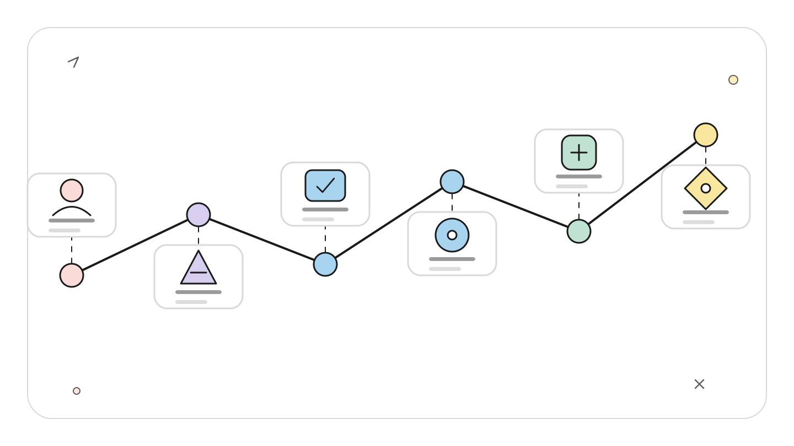
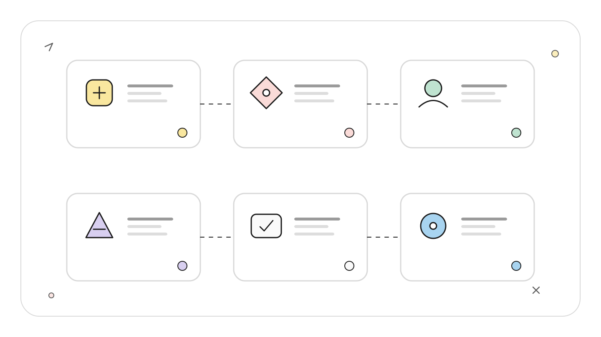
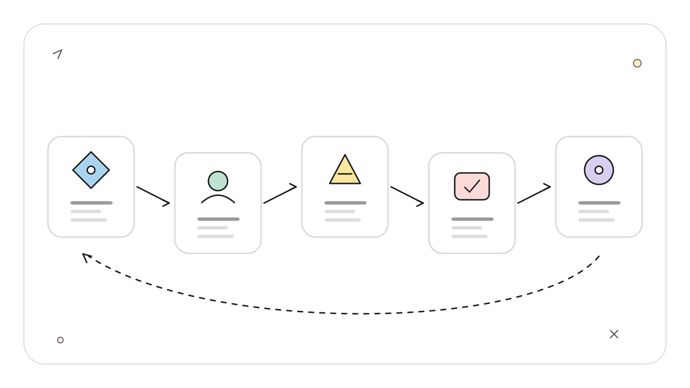
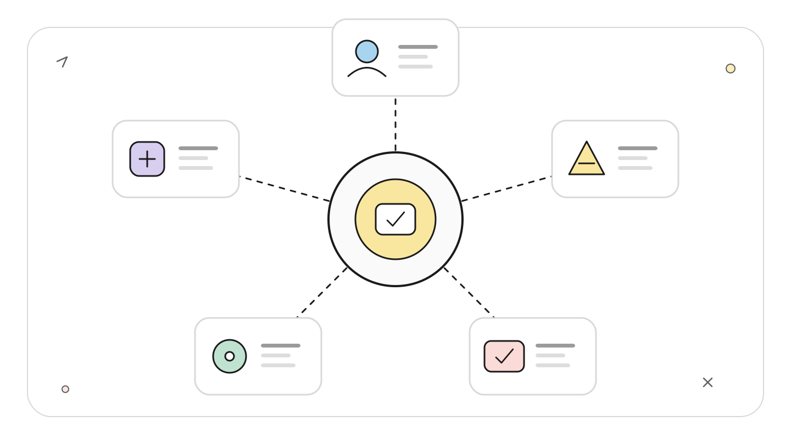
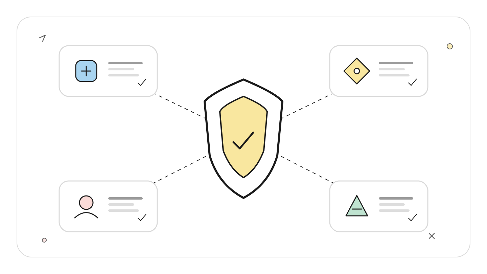
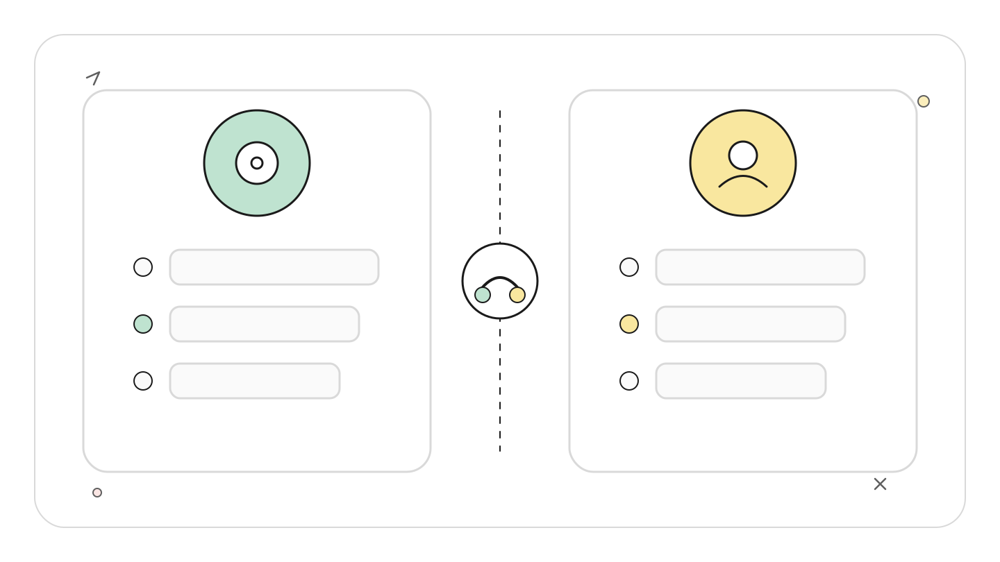

# Claude Code Channels：把外部事件送进正在运行的 Agent

> 资料基线：2026-07-22。Channels 仍是 Research Preview。本文以 Claude Code 官方文档、官方插件仓库和官方 changelog 为准。文中的 Telegram、Webhook 与自定义 Channel 命令来自官方资料，未在本仓库连接真实聊天账号或公网 Webhook 做端到端复现。

## TL;DR

Channels 不是任务队列，也不是托管在云端的常驻 Agent。它是一条 MCP 通知通道：本机 Channel 服务器接收聊天消息、Webhook 或其他事件，再把事件推入一个已经启动且启用了该 Channel 的 Claude Code 会话。

<!-- wos:illustration claude-code-engineering/40-channels-external-events/01-timeline-lifecycle-timeline.svg -->

<!-- /wos:illustration -->

适合它的场景是“让当前 Agent 对外部变化立即反应”，例如构建失败后继续排查、在 Telegram 中补充上下文、由内部告警触发诊断。若需求是关机后仍执行、失败后自动重试、严格保证每个事件只处理一次，应在 Channel 外再放持久队列、幂等状态和执行器。

## 读者定位

本文面向已经使用 Claude Code、MCP 和 Webhook，准备把外部系统接入编码会话的中级开发者。文章只讨论事件入口、丢失条件和权限收口，不展开聊天机器人界面设计。

## 一条事件到底经过什么

```text
外部系统
  -> Telegram 轮询或本地 HTTP Webhook
  -> Channel MCP 服务器
  -> notifications/claude/channel
  -> 已启用 Channel 的 Claude Code 会话
  -> 模型判断、工具调用、可选回复工具
```

<!-- wos:illustration claude-code-engineering/40-channels-external-events/02-infographic-concept-map.svg -->

<!-- /wos:illustration -->

Channel 服务器由 Claude Code 在同一台机器上通过 stdio 启动。它在 MCP 初始化结果中声明实验能力：

```json
{
  "capabilities": {
    "experimental": {
      "claude/channel": {}
    }
  }
}
```

收到外部事件后，服务器发送 `notifications/claude/channel`。通知中的 `content` 才是交给会话的消息；`meta` 用于展示发送者、平台或会话等标识。官方参考说明，`meta` 的键只能使用标识符形式，带连字符的键会被静默丢弃。

这里有一个容易误解的机制：桥接层可以轮询上游，但 Channel 到 Claude Code 的最后一跳是 MCP 通知。官方 Telegram 插件通过 Telegram Bot API 获取新消息，官方 Webhook 示例则监听本地 HTTP 端口。两者的上游接入方式不同，进入会话的协议相同。

## 最短可验证路径

先确认当前 CLI 是否暴露预览参数：

<!-- wos:illustration claude-code-engineering/40-channels-external-events/03-flowchart-operating-flow.svg -->

<!-- /wos:illustration -->

```sh
claude --version
claude --help | rg 'channels|dangerously-load-development-channels'
```

本稿基线环境的 `claude --version` 为 `2.1.185`，其帮助文本没有显示 `--channels`。该环境没有完成后续流程的端到端验证。官方文档仍把以下命令列为 Research Preview 用法，实际启用还受账号类型、组织策略和 CLI 分发状态约束。

官方 Telegram 插件的启动流程是：

```text
/plugin install telegram@claude-plugins-official
/reload-plugins
/telegram:configure <bot-token>
```

随后从终端启动带 Channel 的会话：

```sh
claude --channels plugin:telegram@claude-plugins-official
```

首次私聊会得到配对码。在 Claude Code 会话中确认并收紧策略：

```text
/telegram:access pair <code>
/telegram:access policy allowlist
```

自建 Webhook 可以先放入项目级 `.mcp.json`：

```json
{
  "mcpServers": {
    "webhook": {
      "command": "bun",
      "args": ["./webhook.ts"]
    }
  }
}
```

自定义 Channel 当前需要危险开发开关，官方示例的启动方式是：

```sh
claude --dangerously-load-development-channels server:webhook
```

若本地监听 `8788` 端口，可用普通 HTTP 请求检查入口是否收到事件：

```sh
curl -X POST http://localhost:8788 \
  -H 'content-type: text/plain' \
  --data 'build failed on main: inspect the latest CI log'
```

这只能验证 HTTP 到 Channel 服务器的入口。要确认 Claude 已处理事件，还必须查看会话输出或实现回执工具。

## 通知协议没有完成回执

Channel 通知没有协议级确认。官方参考明确说明，服务端等待 `mcp.notification()` 完成，只能证明数据写入传输层，不能证明 Claude Code 接收、模型处理或任务完成。会话没有以 Channel 模式启动、访问策略拒绝发送者、进程已退出时，事件都可能无法进入有效执行链。

<!-- wos:illustration claude-code-engineering/40-channels-external-events/04-framework-system-framework.svg -->

<!-- /wos:illustration -->

生产桥接应自己保存事件状态：

1. 为每个事件生成稳定 `event_id`。
2. 先持久化 `received`，再向 Channel 发送通知。
3. 给 Agent 提供 `ack_event(event_id, status)` 工具。
4. 只有回执写入后才标记 `handled`。
5. 重发时以 `event_id` 幂等，避免重复修复或重复发消息。

这套状态机不属于 Channels 内建能力。它是外部系统为可靠投递补上的工程层。

## 信任边界

外部消息是非可信输入，不应因为它来自团队聊天就自动获得命令权限。桥接层应分别控制身份入口、内容入口和工具出口：

<!-- wos:illustration claude-code-engineering/40-channels-external-events/05-infographic-verification-guardrails.svg -->

<!-- /wos:illustration -->

- 身份入口：使用配对或发送者 allowlist，拒绝未知账号。
- 内容入口：把消息当作数据，防止其中的“忽略规则并执行命令”变成高权限指令。
- 工具出口：写文件、推送代码、访问生产环境仍由 Claude Code 权限和人工确认控制。

Channels 还提供实验性的权限转发能力，但远程批准会扩大风险面。更稳妥的做法是让聊天端只触发诊断、生成草案或请求人工回到受控终端批准。官方 changelog 也持续收紧跨会话消息与权限转发，说明这部分协议仍在快速演进。

## 权衡与局限

- 会话必须保持运行。笔记本休眠、终端关闭或进程退出都会切断反应能力。
- Research Preview 协议和命令可能变化，不适合把关键业务 SLA 直接押在它上面。
- 官方 Telegram 插件只看到机器人接入后到达的消息，不提供完整历史搜索。
- 官方预览插件依赖 Bun，部署环境要把运行时和进程守护纳入运维。
- Anthropic 身份验证可用，Bedrock、Google Cloud Agent Platform 和 Microsoft Foundry 当前不支持 Channels。
- Team 与 Enterprise 组织需要管理员显式启用。

<!-- wos:illustration claude-code-engineering/40-channels-external-events/06-comparison-boundary-comparison.svg -->

<!-- /wos:illustration -->

结论很窄：Channels 解决“把事件送进当前会话”，不负责可靠排队、长期托管和完成判定。把这三个职责拆开，架构才不会被聊天桥接的便利性误导。

## 官方延伸阅读

- [Channels 官方指南](https://code.claude.com/docs/en/channels)
- [Channels 协议参考](https://code.claude.com/docs/en/channels-reference)
- [官方 Telegram Channel 插件](https://github.com/anthropics/claude-plugins-official/tree/main/external_plugins/telegram)
- [官方 FakeChat Channel 示例](https://github.com/anthropics/claude-plugins-official/tree/main/external_plugins/fakechat)
- [Claude Code changelog](https://github.com/anthropics/claude-code/blob/main/CHANGELOG.md)
