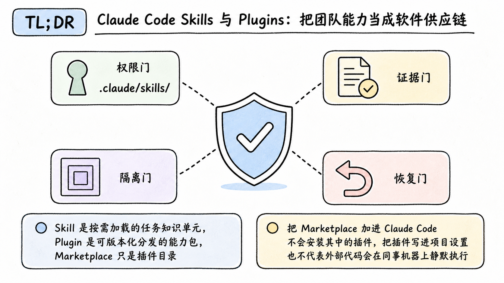
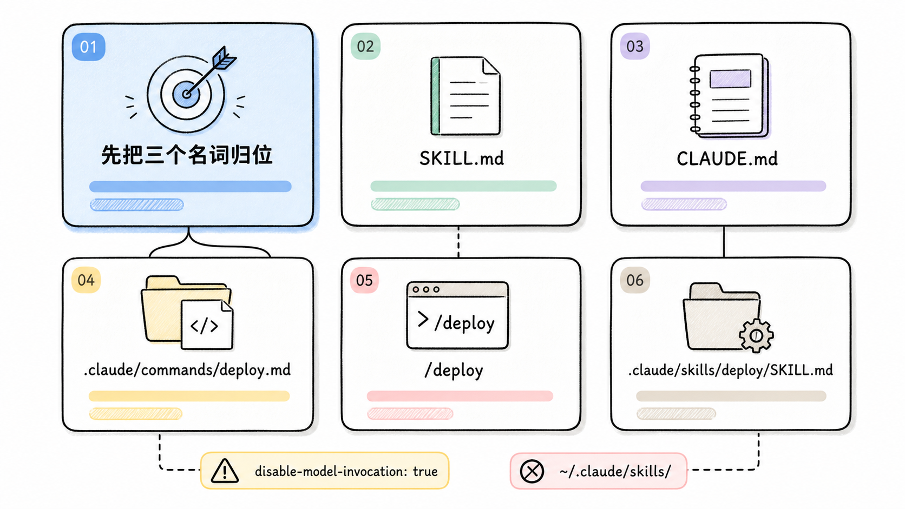
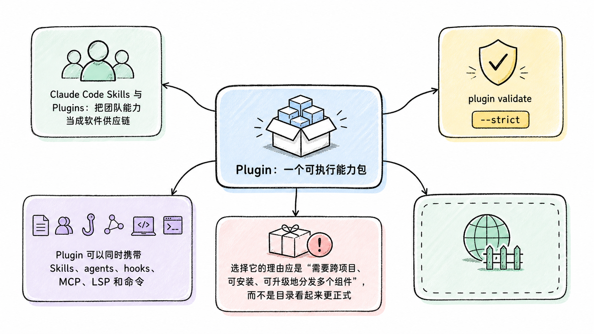
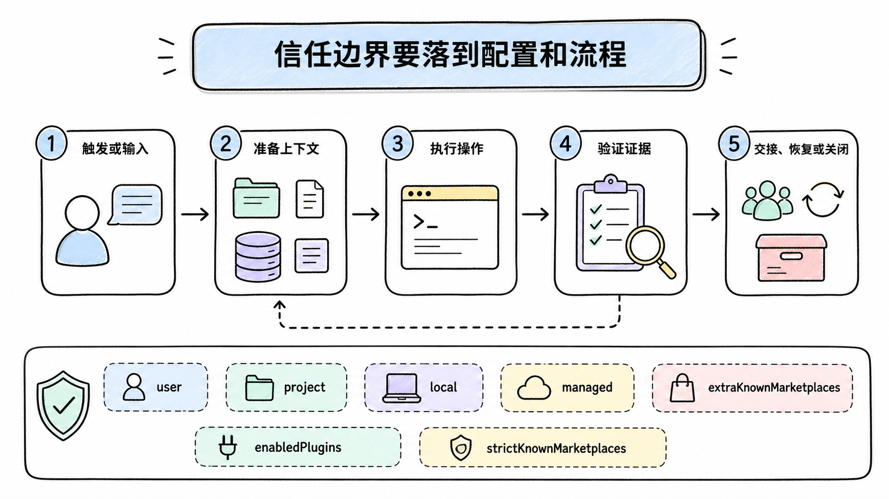
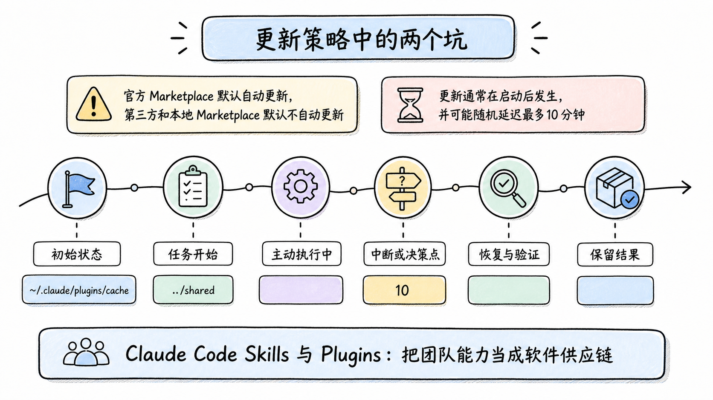
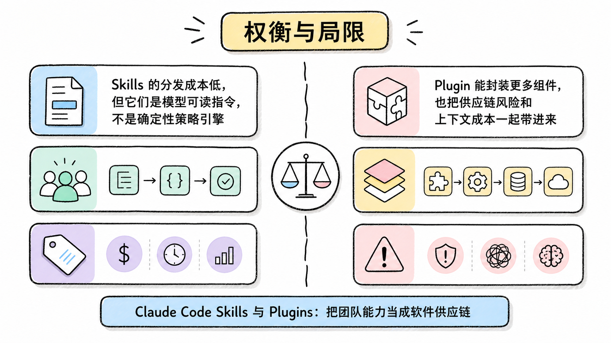

# Claude Code Skills 与 Plugins：把团队能力当成软件供应链

> 资料基线：2026-07-22。本文描述当前 Claude Code Skills、Plugins 和 Marketplace 语义。嵌套 Skills、安装同意流程等细节来自较新的官方文档与 changelog；本稿环境的 CLI 为 2.1.185，因此对高于该版本的行为只做来源转述，不声称本地复现。

## TL;DR

Skill 是按需加载的任务知识单元，Plugin 是可版本化分发的能力包，Marketplace 只是插件目录。把 Marketplace 加进 Claude Code 不会安装其中的插件，把插件写进项目设置也不代表外部代码会在同事机器上静默执行。

<!-- wos:illustration claude-code-engineering/42-skills-plugins-distribution/01-infographic-verification-guardrails.png -->

<!-- /wos:illustration -->

单仓库约定优先使用 `.claude/skills/`。需要跨仓库发布 Skills、agents、hooks、MCP 或 LSP 时再打成 Plugin。团队分发必须同时设计来源、版本、安装同意、权限和更新策略。

## 读者定位

本文面向维护过 `CLAUDE.md`、自定义命令或 MCP 配置，准备把个人经验整理为团队能力的中级开发者。文章围绕加载者、加载时机和代码权限展开。

## 先把三个名词归位

### Skill：按任务加载的上下文

<!-- wos:illustration claude-code-engineering/42-skills-plugins-distribution/02-infographic-concept-map.png -->

<!-- /wos:illustration -->

一个 Skill 至少包含 `SKILL.md`。Claude 先看到名称和描述，匹配到任务或用户显式调用时才加载正文。它与 `CLAUDE.md` 的差别很直接：`CLAUDE.md` 通常进入启动上下文，Skill 正文只在使用时进入，并在加载后继续占用该会话的上下文。

当前自定义命令已并入 Skills 语义。旧的 `.claude/commands/deploy.md` 仍可生成 `/deploy`，推荐的新位置是 `.claude/skills/deploy/SKILL.md`，因为后者可以附带脚本、模板和参考文件。

一个最小 Skill 可以是：

```yaml
---
name: verify-change
description: Run repository checks and summarize failures before handoff
disable-model-invocation: true
allowed-tools: Bash, Read
---

Run the repository's documented lint and test commands.
Report the exact failing command and first actionable error.
Do not edit files.
```

`disable-model-invocation: true` 表示只能由用户显式调用。官方 changelog 还说明，自 2.1.196 起，这类 Skill 也不能被计划任务自动调用。它适合发布、部署等高影响操作。

Skill 的常见位置有三层：

- 企业策略提供的 Skills，优先级最高。
- 用户级 `~/.claude/skills/`，只适合个人机器。
- 项目级 `.claude/skills/`，随仓库版本控制。

Plugin 中的 Skill 会带命名空间，例如 `/release-tools:verify`，用于避免多个插件发生重名。

### Plugin：一个可执行能力包

Plugin 可以同时携带 Skills、agents、hooks、MCP、LSP 和命令。选择它的理由应是“需要跨项目、可安装、可升级地分发多个组件”，而不是目录看起来更正式。

<!-- wos:illustration claude-code-engineering/42-skills-plugins-distribution/03-framework-system-framework.png -->

<!-- /wos:illustration -->

先在插件根目录验证结构：

```sh
claude plugin validate . --strict
```

本稿环境已从 CLI 帮助确认 `plugin validate` 和 `--strict` 存在，但没有安装示例插件。结构校验只能发现清单与目录问题，不能证明插件代码安全。

### Marketplace：目录，不是安装器的同义词

Marketplace 保存可发现的插件清单。添加目录与安装插件是两个动作：

```sh
claude plugin marketplace add anthropics/claude-plugins-official
claude plugin install github@claude-plugins-official --scope project
```

官方 Marketplace 在交互式启动后通常自动可用；以 headless 为主的环境可能仍需显式添加。安装后，正在运行的会话可用 `/reload-plugins` 重载组件。

## 从个人 Skill 到团队分发

能力演进可以停在最小足够层级：

1. 只有一个仓库需要时，提交 `.claude/skills/<name>/SKILL.md`。
2. Skill 需要脚本或模板时，把文件放在同一 Skill 目录并按需引用。
3. 多个仓库都需要，或同时包含 hook、MCP、agent 时，创建 Plugin。
4. 多个 Plugin 需要统一发现、版本和组织策略时，再建立 Marketplace。

这条路径能避免过早打包。Skill 正文应短，把大段参考材料拆到支持文件中，因为正文一旦加载就持续消耗上下文；支持文件可以在需要时再读取。

还有一个常见部署断层：Claude Code 云端与 Cowork 不读取开发者本机的 `~/.claude/skills/`。云端会话能使用账号启用的 Skills、仓库提交的 `.claude/skills/`，以及仓库声明并获准安装的插件。个人机器上“可用”不能证明团队云端“可用”。

## 信任边界要落到配置和流程

Plugin 与 Marketplace 都可能让代码以当前用户身份运行。hooks 能在生命周期节点执行命令，MCP 能连接外部服务，LSP 能启动进程。审核重点至少包括：

<!-- wos:illustration claude-code-engineering/42-skills-plugins-distribution/04-flowchart-operating-flow.png -->

<!-- /wos:illustration -->

- 来源是否由组织控制，Git 仓库是否固定到完整 40 位提交 SHA。
- 插件清单中的版本是否随内容更新。显式版本不变时，新的提交可能仍被解析为旧版本并掩盖更新。
- hooks、MCP 和脚本执行了什么命令，访问哪些文件与网络地址。
- 安装范围是 `user`、`project`、`local` 还是 `managed`。
- 更新由谁批准，当前会话何时切换到新版本。

组织设置里，`extraKnownMarketplaces` 用于登记或推荐目录，`enabledPlugins` 用于启用插件，`strictKnownMarketplaces` 用于限制允许的 Marketplace。若要阻止临时旁加载，还需配合 `disableSideloadFlags`。把 `strictKnownMarketplaces` 设为空数组可以形成 Marketplace 锁定，但应先确认不会阻断现有团队工作。

外部来源插件仍需要用户同意安装。官方在 2.1.195 的变更中明确收紧为所有插件加载路径都要同意。项目配置可以推荐能力，不能把“同事拉取仓库”变成无提示执行第三方代码。

## 更新策略中的两个坑

官方 Marketplace 默认自动更新，第三方和本地 Marketplace 默认不自动更新。更新通常在启动后发生，并可能随机延迟最多 10 分钟；已经加载的会话继续使用旧版本，直到重启或重载。

<!-- wos:illustration claude-code-engineering/42-skills-plugins-distribution/05-timeline-lifecycle-timeline.png -->

<!-- /wos:illustration -->

另一个坑是缓存。插件会复制到 `~/.claude/plugins/cache`，运行时不能依赖插件目录之外的相对文件。开发目录里通过 `../shared` 能读到的文件，安装后可能不存在。发布前应在干净环境从 Marketplace 安装一次，再验证所有引用。

## 权衡与局限

Skills 的分发成本低，但它们是模型可读指令，不是确定性策略引擎。Plugin 能封装更多组件，也把供应链风险和上下文成本一起带进来。Marketplace 便于发现和治理，却不会替你完成代码审计、权限隔离与版本回滚。

<!-- wos:illustration claude-code-engineering/42-skills-plugins-distribution/06-comparison-boundary-comparison.png -->

<!-- /wos:illustration -->

更可靠的团队方案是：知识用 Skill，确定性门禁放 CI 或仓库规则，高权限动作要求显式调用，跨仓库组件用固定来源的 Plugin，组织策略只允许审过的 Marketplace。

## 官方延伸阅读

- [Skills 官方文档](https://code.claude.com/docs/en/slash-commands)
- [Plugins 官方文档](https://code.claude.com/docs/en/plugins)
- [Plugin Marketplaces 官方文档](https://code.claude.com/docs/en/plugin-marketplaces)
- [发现与安装 Plugins](https://code.claude.com/docs/en/discover-plugins)
- [Anthropic 官方插件仓库](https://github.com/anthropics/claude-plugins-official)
