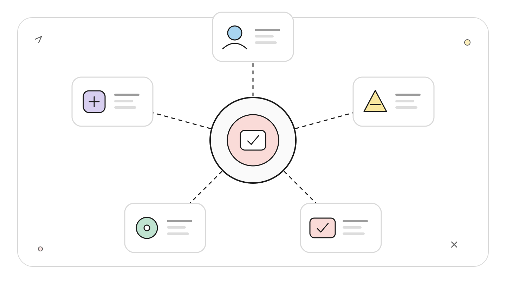
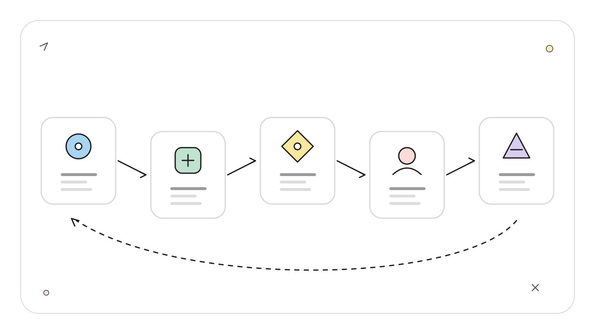
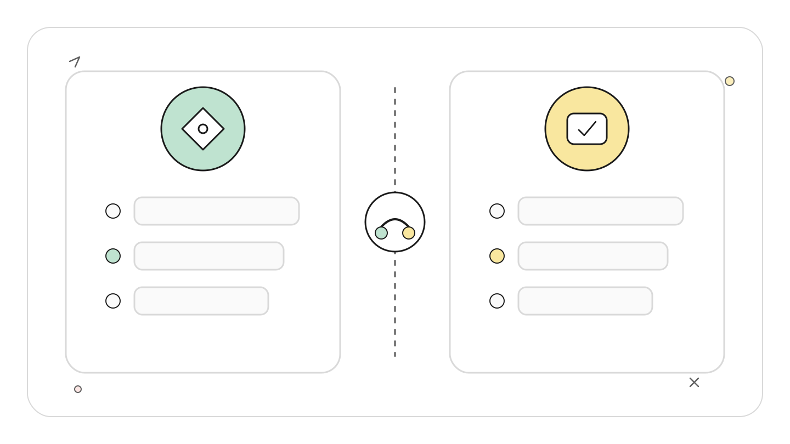
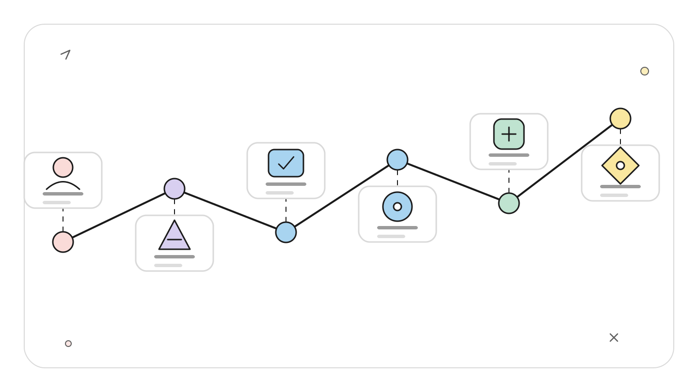
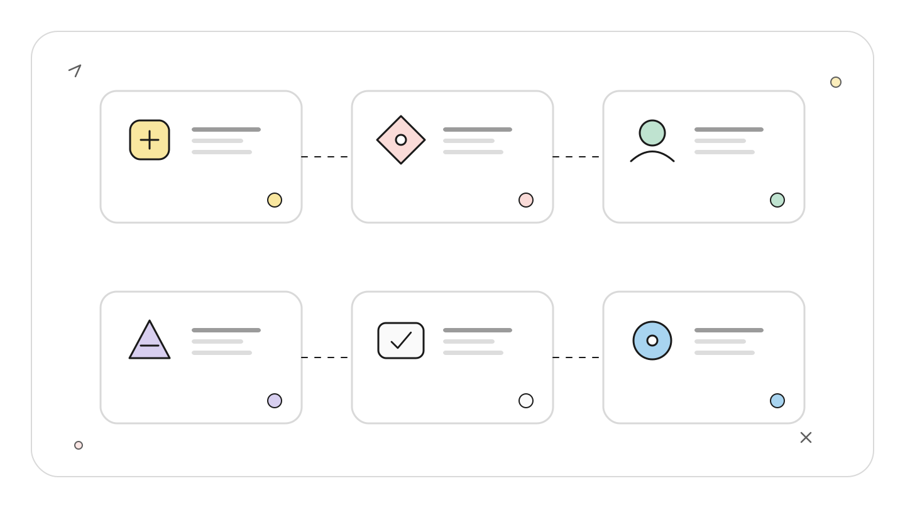
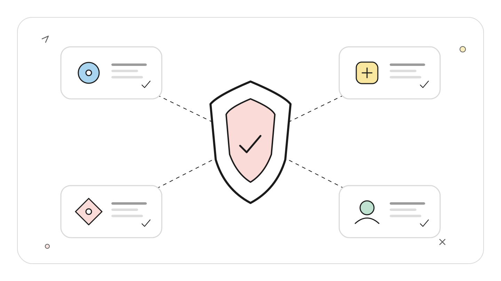

# Claude Code Headless 与 Agent SDK：从确定输入到可观测执行

> 资料基线：2026-07-22。本文以 Claude Code 2.1.185 的本地帮助文本核对基础参数，并用官方文档与 changelog 补充较新行为。`--json-schema` 的严格失败语义建议使用 2.1.205 或更高版本。增强 OpenTelemetry traces 仍是 Beta。本文未发起付费模型调用，也未把示例遥测发送到真实 Collector。

## TL;DR

可维护的 Headless Agent 至少要拆成四层：

<!-- wos:illustration claude-code-engineering/43-headless-sdk-observability/01-framework-system-framework.svg -->

<!-- /wos:illustration -->

1. 启动层用 `--bare` 减少机器上的隐式配置。
2. 输出层用 `--output-format` 和 `--json-schema` 建立机器契约。
3. 控制层显式限制工具、权限、预算和超时。
4. 观测层用 OpenTelemetry 记录指标、日志与调用链。

`--bare` 不等于安全模式，JSON 输出也不等于结构化业务结果。Agent SDK 启动的是 Claude Code 子进程，OpenTelemetry 由这个 CLI 子进程发出。弄错这三点，流水线很容易“能跑但不可控”。

## 读者定位

本文面向正在把 Claude Code 接入 CI、内部平台或 Node.js/Python 服务的中级开发者。假定读者了解环境变量、JSON Schema、进程模型和基础 OpenTelemetry 概念。

## 第一层：让启动上下文可解释

最小非交互调用是：

<!-- wos:illustration claude-code-engineering/43-headless-sdk-observability/02-flowchart-operating-flow.svg -->

<!-- /wos:illustration -->

```sh
claude -p "Summarize the current git diff"
```

普通调用可能自动发现 `CLAUDE.md`、hooks、Skills、plugins、MCP、自动记忆和其他本机配置。脚本在开发机成功、换到 CI 失败，根因常常是隐式上下文不同。

`--bare` 会跳过这些自动发现与后台预取，并限制 Anthropic 身份验证为 API key 或 `apiKeyHelper`。需要的上下文必须通过明确参数补回：

```sh
claude --bare -p "Review the supplied diff for correctness" \
  --tools Read,Grep \
  --output-format json
```

官方文档把 `--bare` 推荐给脚本和 SDK，并说明未来可能成为 `-p` 默认行为。本稿环境的 `claude --help` 已确认该参数存在。

这里不能把“少加载配置”误读成“没有危险工具”。Bash、读写文件等能力是否可用，仍由 `--tools`、`--allowedTools`、`--disallowedTools`、权限模式和运行环境决定。`--bare` 解决可复现性，不替代沙箱。

## 第二层：区分输出信封与业务数据

`--output-format json` 返回执行信封，其中可包含最终文本、会话 ID、成本和错误信息。它并不保证最终回答符合你的字段定义。

<!-- wos:illustration claude-code-engineering/43-headless-sdk-observability/03-comparison-boundary-comparison.svg -->

<!-- /wos:illustration -->

业务契约要用 `--json-schema`：

```sh
claude --bare -p "Classify the change risk from the provided context" \
  --output-format json \
  --json-schema '{
    "type": "object",
    "properties": {
      "risk": {"type": "string", "enum": ["low", "medium", "high"]},
      "reason": {"type": "string"}
    },
    "required": ["risk", "reason"],
    "additionalProperties": false
  }'
```

符合 Schema 的值位于返回信封的 `structured_output`。调用方应解析该字段，同时检查进程退出码和顶层错误，不要从 `result` 文本里二次猜 JSON。

版本边界必须写进部署要求。官方 changelog 说明，2.1.205 修复了无效 Schema 可能静默退回非结构化输出的问题，并调整了 `format` 注解处理。严格依赖 Schema 的流水线应先验证：

```sh
claude --version
claude --help | rg 'bare|json-schema|output-format'
```

本稿环境 2.1.185 能看到这些参数，但低于上述修复版本，不能据此证明严格失败语义已经具备。

流式任务可使用 `--output-format stream-json --verbose`。标准输入上限、子 Agent 等待时间和后台 Bash 收尾行为都曾在 changelog 中调整，调用方要设置自己的进程超时，并保存原始事件流用于故障定位。

## 第三层：理解 SDK 的进程边界

官方 TypeScript 包是 `@anthropic-ai/claude-agent-sdk`，Python 包是 `claude-agent-sdk`。SDK 提供会话、工具和流式消息接口，但底层仍启动 Claude Code CLI 子进程，通过本地管道通信。

<!-- wos:illustration claude-code-engineering/43-headless-sdk-observability/04-timeline-lifecycle-timeline.svg -->

<!-- /wos:illustration -->

这个架构会同时影响版本管理、输出通道和环境变量：

- CLI 版本属于运行时依赖，升级 SDK 不代表 CLI 行为同步升级。
- stdout 是 SDK 消息通道，不能把 OpenTelemetry `console` exporter 混进去。
- 子进程环境变量决定 CLI 的认证、网络和遥测配置。

TypeScript SDK 的 `options.env` 会替换继承环境，不是增量合并。正确形态是保留原环境再覆盖遥测变量：

```ts
const env = {
  ...process.env,
  CLAUDE_CODE_ENABLE_TELEMETRY: "1",
  OTEL_METRICS_EXPORTER: "otlp",
  OTEL_LOGS_EXPORTER: "otlp",
  OTEL_EXPORTER_OTLP_PROTOCOL: "http/protobuf",
  OTEL_EXPORTER_OTLP_ENDPOINT: "http://otel-collector:4318",
};
```

这段代码只展示环境合并机制，没有在本仓库安装 SDK 或连接 Collector。Python SDK 会合并 `env`，两种语言不能套用同一假设。

## 第四层：让短任务也留下遥测

启用基础 OpenTelemetry：

```sh
export CLAUDE_CODE_ENABLE_TELEMETRY=1
export OTEL_METRICS_EXPORTER=otlp
export OTEL_LOGS_EXPORTER=otlp
export OTEL_EXPORTER_OTLP_PROTOCOL=http/protobuf
export OTEL_EXPORTER_OTLP_ENDPOINT=http://localhost:4318

claude --bare -p "Inspect the supplied build log" --output-format json
```

增强 traces 目前是 Beta，需要单独开关：

```sh
export CLAUDE_CODE_ENHANCED_TELEMETRY_BETA=1
export OTEL_TRACES_EXPORTER=otlp
```

官方观测文档给出的调用链大致是 interaction span 包含 LLM request、tool 与 hook spans。SDK 和 `-p` 可接收 `TRACEPARENT`、`TRACESTATE` 以接入上游链路；交互模式忽略传入的 trace 上下文。

短进程最容易出现“任务有结果，面板没有数据”。默认指标批量间隔约 60 秒，日志和 traces 约 5 秒，进程太快退出时批次可能来不及发送。可以降低导出间隔，或让采集器与进程生命周期协同。指标中的成本是估算值，计费系统才是账单事实来源。

另一个边界是子命令环境。Claude Code 不会把 `OTEL_*` 变量传给它通过 Bash 启动的业务程序，因此 Agent 的遥测端点不会意外污染被测应用。开启 tracing 后，Claude Code 可以把 `TRACEPARENT` 传给 Bash 或 PowerShell，供应用主动接入同一调用链。

## 隐私与故障定位

用户提示、工具参数、工具内容和原始 API body 默认不会全部进入遥测。开启下列选项会明显扩大敏感数据面：

<!-- wos:illustration claude-code-engineering/43-headless-sdk-observability/05-infographic-concept-map.svg -->

<!-- /wos:illustration -->

```sh
export OTEL_LOG_USER_PROMPTS=1
export OTEL_LOG_TOOL_DETAILS=1
export OTEL_LOG_TOOL_CONTENT=1
export OTEL_LOG_RAW_API_BODIES=1
```

生产环境不应一次全开。`OTEL_LOG_TOOL_CONTENT` 依赖 tracing；`OTEL_LOG_RAW_API_BODIES=1` 会携带完整会话历史，官方只对扩展思考内容做脱敏说明。先定义问题需要哪一类证据，再选择最小字段，并在 Collector 端设置脱敏、访问控制和保留期。调试 CLI 本身可使用 `--debug` 或 `--debug-file`，它与 OTel 的团队级指标和链路用途不同。

## 权衡与局限

Headless 模式提高了自动化能力，也移除了交互确认的天然摩擦。Schema 能限制输出形状，不能证明内容正确。OpenTelemetry 能解释耗时与调用路径，不能替代业务验收。Agent SDK 省去协议编排，却多了一层 CLI 子进程版本和环境管理。

<!-- wos:illustration claude-code-engineering/43-headless-sdk-observability/06-infographic-verification-guardrails.svg -->

<!-- /wos:illustration -->

一套可控配置是：固定 CLI 与 SDK 版本，使用 `--bare`，显式列工具，Schema 失败即失败，把验证命令结果作为独立门禁，再用低敏感度遥测观察成本、延迟和错误。

## 官方延伸阅读

- [Headless mode 官方文档](https://code.claude.com/docs/en/headless)
- [Agent SDK observability](https://code.claude.com/docs/en/agent-sdk/observability)
- [Claude Code usage monitoring](https://code.claude.com/docs/en/monitoring-usage)
- [TypeScript Agent SDK 官方仓库](https://github.com/anthropics/claude-agent-sdk-typescript)
- [Claude Code changelog](https://github.com/anthropics/claude-code/blob/main/CHANGELOG.md)
