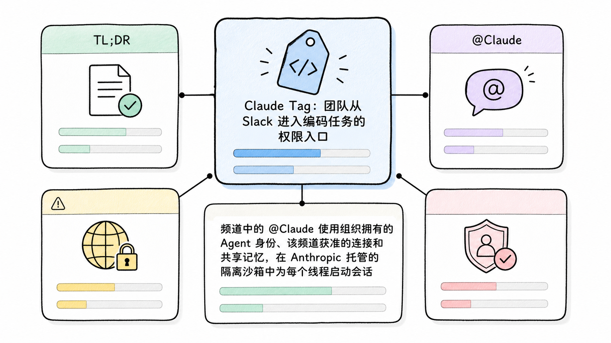
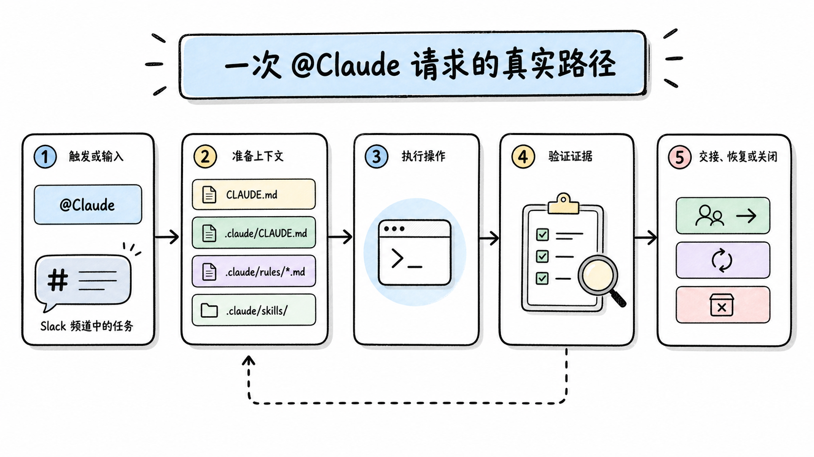
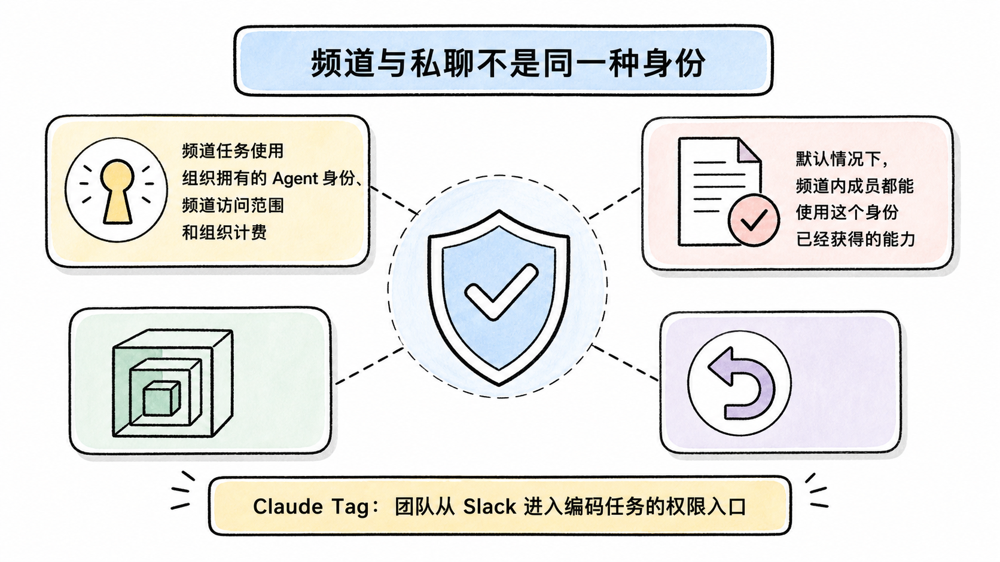
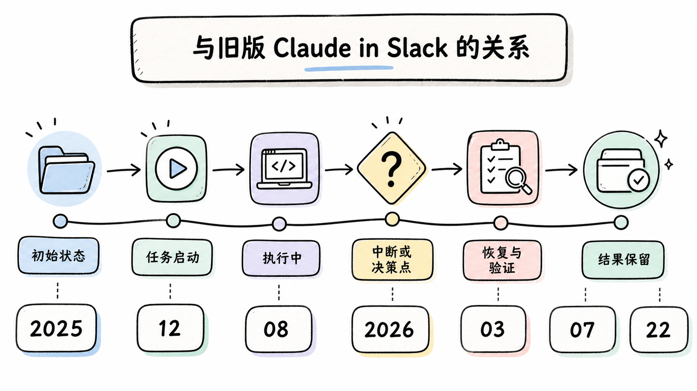
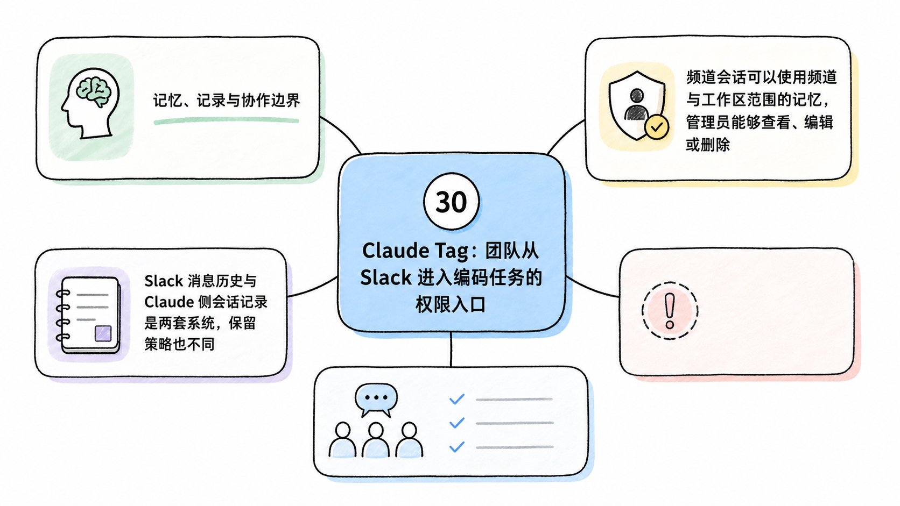
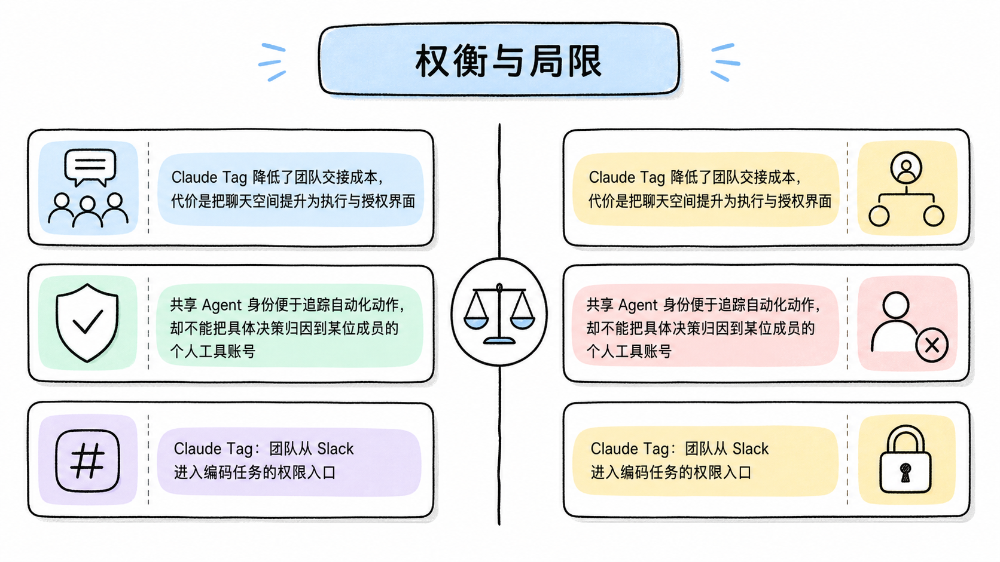

# Claude Tag：团队从 Slack 进入编码任务的权限入口

> 资料基线：2026-07-22。Claude Tag 当前是 Team 与 Enterprise 套餐中的 Beta 功能，并先在 Slack 提供。Anthropic 已宣布旧版 Claude in Slack 于 2026-08-03 切换到 Claude Tag；在本文基线日期，这次迁移尚未发生。本文基于 Claude Tag 官方文档、支持公告和 Anthropic 博客，没有连接真实 Slack 工作区或 GitHub 仓库做复现。

## TL;DR

Claude Tag 不是“在 Slack 里远程控制某位开发者的本地 Claude Code”。频道中的 `@Claude` 使用组织拥有的 Agent 身份、该频道获准的连接和共享记忆，在 Anthropic 托管的隔离沙箱中为每个线程启动会话。它可以读取获准仓库、调查代码、创建草案 PR，并把进度与结果回到原线程。

<!-- wos:illustration claude-code-engineering/44-claude-tag-team-entrypoint/01-infographic-concept-map.png -->

<!-- /wos:illustration -->

最关键的架构判断是：Slack 频道本身成为授权组。频道里任何可调用 Claude 的成员，默认共享该频道授予 Agent 的能力。接入 GitHub 前应先设计频道边界、仓库范围、服务账号、花费上限和审计责任。

## 读者定位

本文面向负责开发平台、AI 工具治理或团队协作流程的中级开发者。重点是 Claude Tag 如何把聊天请求变成编码会话，以及它与 2025 年发布的旧 Slack 集成有什么关系。

## 一次 `@Claude` 请求的真实路径

```text
Slack 频道中的任务
  -> 频道身份、记忆和访问包
  -> 每个线程一个 Anthropic 云端隔离沙箱
  -> Agent Proxy 在工具边界注入凭据
  -> GitHub App 或组织服务账号执行动作
  -> Slack 线程更新、只读会话记录、草案 PR
```

<!-- wos:illustration claude-code-engineering/44-claude-tag-team-entrypoint/02-flowchart-operating-flow.png -->

<!-- /wos:illustration -->

用户在频道消息中写 `@Claude` 并描述任务，会为该线程启动工作会话。线程里的其他成员可以继续补充或改向，不必再次提及 Claude。两个 Slack 线程对应两个独立会话和两个沙箱。

仓库不会预先出现在沙箱里。请求应在首条消息中点名仓库，Claude 才会克隆管理员授权给该频道的仓库。仓库中的 `CLAUDE.md`、`.claude/CLAUDE.md`、`.claude/rules/*.md` 和 `.claude/skills/` 会进入相应会话，但 `CLAUDE.md` 只是指导，不是安全门禁。强制标签、分支保护和 CI 要留在 GitHub 规则中。

Claude Tag 不把工具凭据放进沙箱或模型上下文。官方的 Agent Proxy 会在请求匹配允许的主机与规则时，于边界注入凭据。GitHub 的提交和 PR 由 Claude GitHub App 身份创建，并链接回 Slack 线程。非 GitHub 工具应使用组织提供的专用服务账号。

## 频道与私聊不是同一种身份

频道任务使用组织拥有的 Agent 身份、频道访问范围和组织计费。默认情况下，频道内成员都能使用这个身份已经获得的能力。个人是否拥有同一套工具账号，不会改变频道中的共享权限。

<!-- wos:illustration claude-code-engineering/44-claude-tag-team-entrypoint/03-infographic-verification-guardrails.png -->

<!-- /wos:illustration -->

私聊与 Slack AI assistant 面板更接近个人入口，使用成员自己的 claude.ai 账号、个人连接和个人侧计费。它们适合不应暴露给整个频道的个人上下文，但不能借用频道的共享 Agent 权限。

因此，“把 Claude 加进一个大频道，再给它生产只读权限”仍然等于把生产只读能力授给该频道的可调用成员。频道成员管理属于权限治理，不只是协作习惯。

## 与旧版 Claude in Slack 的关系

Anthropic 在 2025-12-08 发布的旧 Slack 集成，会把编码请求路由到新的 Claude Code Web 会话，完成后在 Slack 线程更新并返回 PR 链接。Claude Tag 是这条路线的后继产品，加入了独立 Agent 身份、按频道授权、频道记忆、持续跟进和集中治理。

<!-- wos:illustration claude-code-engineering/44-claude-tag-team-entrypoint/04-timeline-lifecycle-timeline.png -->

<!-- /wos:illustration -->

官方支持公告写明，旧版体验计划在 2026-08-03 切换到 Claude Tag。基线日期为 2026-07-22，所以不能写成“旧集成已经下线”。现阶段的准确表述是：新部署应按 Claude Tag 设计，旧部署仍处于迁移窗口，管理员需检查身份、连接和频道权限是否能迁移到新模型。

## 管理员落地顺序

Claude Tag 的初始设置要求 Team 或 Enterprise 组织，且由 Primary Owner 或 Owner 操作，普通 Admin 不具备完整设置权限。还需要 Slack 工作区管理员配合，并准备可用 credits。官方说明 Zero Data Retention 组织当前不支持 Claude Tag。

建议按下列顺序缩小爆炸半径：

1. 先用专用试点频道配对 Slack 工作区。配对码有效期为 15 分钟。
2. 为 Claude 配置独立 GitHub App 与最小仓库集合，不复用员工令牌。
3. 默认组织访问包只放低风险工具，把敏感仓库限定到私有频道。
4. 设置组织级与频道级花费上限，并配置 75% 和 95% 告警。
5. 用审计视图检查一次性任务、计划任务和网络调用。
6. 通过草案 PR、分支保护、CODEOWNERS 和 CI 保留人工合并门禁。

频道内可直接查询当前能力边界：

```text
@Claude what can you access from this channel?
```

编码任务应给出仓库、交付物、完成定义和失败分支：

```text
@Claude in acme/data-pipeline, reproduce the bug described in this thread.
If reproducible, fix it and open a draft PR. Done means CI is green and the PR
links back here. If it is not reproducible, reply with the commands tried and
the first missing piece of evidence.
```

这是官方文档所示提示模式的改写，不代表示例仓库或执行结果真实存在。

## 记忆、记录与协作边界

频道会话可以使用频道与工作区范围的记忆，管理员能够查看、编辑或删除。Slack 消息历史与 Claude 侧会话记录是两套系统，保留策略也不同。断开连接后，Claude 侧对话按官方说明在 30 天内删除，Slack 侧仍按工作区自己的保留规则处理。

<!-- wos:illustration claude-code-engineering/44-claude-tag-team-entrypoint/05-framework-system-framework.png -->

<!-- /wos:illustration -->

每次交付都带有“Open session in Claude”链接，频道成员可查看包含工具调用的只读记录，后续指令仍应回到 Slack 线程。把链接可见性、频道成员和仓库访问放在同一权限评审里，才能避免“看不到仓库，但能看到 Agent 执行细节”的意外暴露。

## 权衡与局限

Claude Tag 降低了团队交接成本，代价是把聊天空间提升为执行与授权界面。共享 Agent 身份便于追踪自动化动作，却不能把具体决策归因到某位成员的个人工具账号。云端沙箱与 Agent Proxy 降低凭据直接暴露风险，仍需要限制可访问主机、仓库和动作。

<!-- wos:illustration claude-code-engineering/44-claude-tag-team-entrypoint/06-comparison-boundary-comparison.png -->

<!-- /wos:illustration -->

Beta 状态意味着能力、迁移节奏和管理界面仍可能变化。它适合从低风险、可回滚、以草案 PR 为终点的任务开始，不适合把生产发布权限直接交给宽成员频道。

## 官方延伸阅读

- [Claude Tag 产品与可用性说明](https://support.claude.com/en/articles/15594475-what-is-claude-tag)
- [Claude Tag 工作机制](https://claude.com/docs/claude-tag/concepts/how-it-works)
- [Agent identity 与访问模型](https://claude.com/docs/claude-tag/concepts/agent-identity)
- [Claude Tag 管理员设置概览](https://claude.com/docs/claude-tag/admins/setup-overview)
- [旧版 Slack 集成发布说明](https://claude.com/blog/claude-code-and-slack)
