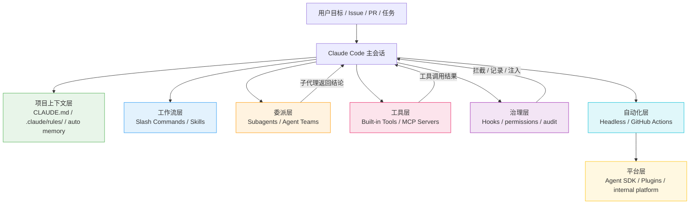

# Claude Code 工程化实战系列

> 工程实践参考，不是教程。
> 34 篇文章覆盖从项目记忆到可治理 Agent 系统的完整路径。

本系列面向在真实项目中使用 Claude Code 的工程师和技术负责人。目标读者已经具备基本的 Claude Code 使用经验，需要解决的核心问题是：如何把一次性的 prompt 交互变成可复用、可验证、可治理的工程系统。

系列配套学习路径参见 [Claude Code 工程化学习路径](../claude-code-engineering-learning-path.md)。建议先通读学习路径建立全景认知，再按需查阅以下各篇。

---

## 系列定位

Claude Code 工程化的核心命题不是"让 AI 更会写代码"，而是"让 AI 在真实代码库里受控地工作"。这涉及三组相互关联的工程问题：

**上下文搬运**——人类开发者通过长期协作积累了对项目结构、编码风格、命令习惯和安全边界的隐性认知。Claude Code 每次会话从零开始，需要通过 `CLAUDE.md`、rules 和 auto memory 显式获得这些认知。上下文写得不好，AI 行为就不稳定；写得太多，又会挤占有效上下文窗口。

**验证缺失**——代码生成之后，谁来确认结果是正确的？靠人肉 review 效率低，靠 AI 自我评价不可靠。工程化的做法是把测试、lint、类型检查、格式化等验证手段嵌入 AI 工作流，让每一步修改都有自动化的质量信号。

**权限失控**——一个能读代码、改文件、跑命令、连数据库的 agent，如果缺少权限边界和审计机制，就是安全事故的隐患。工程化要求在高风险操作上加拦截、在关键路径上加验证、在所有行为上留审计记录。

本系列按"单人可用 → 任务沉淀 → 复杂拆解 → 外部连接 → 确定性治理 → CI/CD 自动化 → 平台化分发"的顺序组织，每篇文章聚焦一个具体机制，包含问题分析、核心机制解释、配置示例和权衡讨论。文章之间有递进关系，但也可按需独立查阅。

---

## 系列目录

### 开篇：先建立正确问题

建立从"工具使用"到"系统设计"的视角转换。Claude Code 工程化的第一步不是学功能，而是理解自己到底要解决什么问题。

| # | 标题 | 核心议题 |
|---|------|----------|
| 00 | [Claude Code 不是补全工具，而是一套工程代理运行时](./00-claude-code-as-agent-runtime.md) | 模型层、工具层、记忆层、治理层四层架构；受控执行系统定位 |
| 01 | [上下文、验证、权限：Claude Code 工程化绕不开的三道坎](./01-context-validation-permission.md) | 工程化三组核心问题的识别和拆解 |

### 第一模块：单人可用

让一个工程师在单个真实仓库里高效使用 Claude Code。核心是把项目知识写成机器可消费的上下文，建立基本的权限意识和常用工作流模板。

| # | 标题 | 核心议题 |
|---|------|----------|
| 02 | [从安装到第一个真实任务：Claude Code 的权限模式怎么选](./02-setup-permission-first-repo-task.md) | 权限模式选择（default/plan/auto）；首次任务验证 |
| 03 | [Claude Code 为什么总不懂你的项目？缺一张「项目地图」](./03-project-map.md) | 仓库 onboarding 模式；`/map` 命令和项目结构描述 |
| 04 | [CLAUDE.md：这不是写给人看的文档，而是写给 AI 的上下文](./04-claude-md-project-memory.md) | CLAUDE.md 模板结构；AI 操作规则 vs 人类说明的区别 |
| 05 | [.claude/rules：CLAUDE.md 臃肿了，就把规则拆成按路径加载的小块](./05-rules-path-scoped-context.md) | 路径作用域规则；降低上下文污染的策略 |
| 06 | [读代码、修 Bug、补测试、写文档：四套拿来即用的工作流模板](./06-common-workflows.md) | 四类基础任务的 prompt 模板和验证方法 |

### 第二模块：把重复任务变成能力

当同一个任务反复出现，应该从"每次重新描述"升级为"一次定义、反复调用"。Slash Commands 处理短流程，Skills 处理带资源和脚本的长流程。

| # | 标题 | 核心议题 |
|---|------|----------|
| 07 | [Slash Commands：把反复重打的提示词，固化成团队命令](./07-slash-commands.md) | `.claude/commands/` 结构；参数化命令；团队共享 |
| 08 | [命令写到第三遍就该升级了：什么时候该从命令变成 Skill](./08-skills-from-command-to-capability.md) | Command 与 Skill 的边界判断；升级信号 |
| 09 | [SKILL.md 结构详解：让 Skill 既会被触发、又能跑通的写法](./09-skill-md-structure.md) | frontmatter 设计；动态上下文注入；资源包组织 |
| 10 | [渐进式披露：别让 Skill 一上来就把上下文塞爆](./10-progressive-disclosure.md) | 按需加载策略；长流程和大资料的分段管理 |
| 11 | [Skill 不触发、乱触发、跑挂了：一份评测与调优指南](./11-skill-evaluation.md) | 触发精度调优；执行失败的诊断和迭代方法 |

### 第三模块：复杂任务拆解

复杂任务不适合在一个超长会话里完成。Subagents 把不同角色的任务隔离到独立上下文中，每个代理有自己的系统提示、工具权限和输出格式。

| # | 标题 | 核心议题 |
|---|------|----------|
| 12 | [Subagents 的本质：不是多了一个 AI，而是开了一个独立上下文](./12-subagents-mental-model.md) | 上下文隔离原理；系统提示设计；模型路由 |
| 13 | [最先值得配置的三类 Subagent：探索、审查、测试](./13-high-value-subagents.md) | 最小有效子代理的设计模式和配置示例 |
| 14 | [工具权限：为什么「只读审计」代理绝不能拿到写权限](./14-subagent-tool-permissions.md) | 工具白名单；最小权限原则；权限审计方法 |
| 15 | [并行探索：让多个 Subagent 分头研究，再汇总成一个结论](./15-parallel-exploration.md) | 并行子代理的编排；结果汇总策略 |
| 16 | [Subagent 不是万能的：这些场景用了反而更糟](./16-when-not-to-use-subagents.md) | 过度拆分的代价；共享上下文需求的判断标准 |

### 第四模块：连接外部世界

Claude Code 默认只能操作本地文件和命令。MCP（Model Context Protocol）让它安全地连接 GitHub、数据库、监控系统、设计工具等外部系统。MCP 提供能力，Skill 教流程，两者组合才能让工具按团队 SOP 被正确使用。

| # | 标题 | 核心议题 |
|---|------|----------|
| 17 | [MCP 心智模型：外部数据不是用来复制粘贴的，而是工具接口](./17-mcp-mental-model.md) | MCP 的定位和边界；与手动复制粘贴的本质区别 |
| 18 | [第一个 MCP：让 Claude Code 直接读懂你的 Issue、PR 和代码](./18-github-mcp.md) | GitHub MCP 配置；Issue/PR 工作流集成 |
| 19 | [数据库、监控、设计系统：真正值得接入的高价值 MCP 场景](./19-high-value-mcp-scenarios.md) | 真实业务场景下的 MCP 接入模式 |
| 20 | [MCP 给能力，Skill 教流程：工具才能按团队 SOP 被用对](./20-mcp-plus-skills.md) | 工具能力与流程知识的组合策略 |
| 21 | [MCP 的暗面：Token 爆炸、越权、工具投毒与提示注入](./21-mcp-risks.md) | MCP 安全清单；工具描述注入；权限最小化 |

### 第五模块：确定性治理

仅靠提示词约束 AI 行为不够稳定。Hooks 在固定事件上执行确定性逻辑：记录每次操作、拦截高风险命令、在修改后自动验证。这是从"相信 AI 会遵守规则"到"系统级保证 AI 遵守规则"的转变。

| # | 标题 | 核心议题 |
|---|------|----------|
| 22 | [Hooks 入门：从「相信 AI 守规矩」到「强制 AI 守规矩」](./22-hooks-introduction.md) | Hook 生命周期；三类 Hook（记录/提示/阻断） |
| 23 | [PreToolUse：危险命令和高风险写入执行之前，先拦下来](./23-pretooluse-guardrails.md) | 最小权限门禁；路径和命令黑名单配置 |
| 24 | [PostToolUse 与 Stop：让 AI 每次改完代码，自动验证、自动留痕](./24-posttooluse-stop-verification.md) | 修改后自动验证；验证闭环设计 |
| 25 | [Subagent Hooks：给子代理注入上下文，再把结果收回来](./25-subagent-hooks.md) | 多代理任务的 Hook 管理；结果收集和汇总 |
| 26 | [Hook 怎么写才不翻车：小、确定、可解释、可回滚](./26-hook-design-principles.md) | 避免自动化脆弱化；Hook 质量标准 |

### 第六模块：Headless 与 CI/CD

当本地工作流稳定后，可以把 Claude Code 放进脚本和 CI 流水线，实现 PR 自动审查、Issue 自动分类和低风险自动修复。Headless 模式是从"人机协作"到"机器自动化"的桥梁。

| # | 标题 | 核心议题 |
|---|------|----------|
| 27 | [Headless 模式：把 Claude Code 装进脚本里跑](./27-headless-mode.md) | 非交互式运行；批处理和脚本集成 |
| 28 | [GitHub Actions：让 Claude Code 自动 Review PR、分类 Issue、修小 Bug](./28-github-actions.md) | CI 中的 Claude Code 集成；GitHub Actions 配置 |
| 29 | [CI 里的安全边界：别让一个外部 PR 偷走你的 Secrets](./29-ci-security-boundaries.md) | 供应链安全；外部贡献者隔离；审批机制 |
| 30 | [结构化输出：让 Agent 的产出能被下一段代码直接接住](./30-structured-output.md) | JSON/Markdown 结构化输出；自动化流水线对接 |

### 第七模块：平台化和分发

当多个团队需要复用同一套 Claude Code 能力时，本地命令和 Skill 已经不够。Agent SDK 把 Claude Code 的 agent loop 嵌入内部平台，Plugins 把整套能力打包分发。这一层只适合在本地工作流成熟之后进入。

| # | 标题 | 核心议题 |
|---|------|----------|
| 31 | [Agent SDK：把 Claude Code 的 agent loop 嵌进自己的平台](./31-agent-sdk.md) | SDK 架构；平台化场景和设计决策 |
| 32 | [Plugins：把 Commands、Skills、Hooks、MCP 打包成一套跨项目分发](./32-plugins.md) | 插件结构；跨项目分发；版本管理 |
| 33 | [组织级治理：多团队长期跑下去，靠的是版本、审计、评测和升级策略](./33-organization-governance.md) | 多团队长期维护；禁用和升级策略 |

---

## 架构图

Claude Code 工程化的分层架构。每一层解决不同维度的问题，层与层之间通过明确的接口协作。



各层职责说明：

- **项目上下文层**：解决"AI 不知道项目常识"的问题。`CLAUDE.md` 放每次都应该知道的规则，`.claude/rules/` 放按目录加载的条件规则，auto memory 记录用户偏好和历史经验。
- **工作流层**：解决"每次都要重新描述任务"的问题。Slash Commands 封装短流程，Skills 封装带资源和脚本的长流程。
- **委派层**：解决"单次会话上下文不够"的问题。Subagents 在独立上下文中完成探索、审查、测试等专门任务。
- **工具层**：解决"AI 只能操作本地文件"的问题。Built-in Tools 覆盖文件和命令操作，MCP 连接外部系统和 API。
- **治理层**：解决"AI 行为不可审计"的问题。Hooks 在事件上执行确定性逻辑，permissions 控制工具调用，audit 记录所有行为。
- **自动化层**：解决"AI 只能在终端里用"的问题。Headless 支持脚本化运行，GitHub Actions 接入 CI 流水线。
- **平台层**：解决"能力无法跨项目复用"的问题。Agent SDK 嵌入内部系统，Plugins 打包分发整套能力。

---

## 机制速查

不同机制解决不同问题，混用或错用会增加系统复杂度而不增加价值。以下速查表帮助快速判断应该使用哪个机制。

### 决策矩阵

| 机制 | 解决什么问题 | 不适合什么 | 引入时机 |
|------|-------------|-----------|---------|
| `CLAUDE.md` | 项目常识、命令、风格、安全边界；每次会话都应该知道的规则 | 大量流程细节、临时任务、带脚本的操作 | 第一个仓库接入时 |
| `.claude/rules/` | 按目录或文件类型有条件加载的规则（如"改测试时才加载测试规范"） | 全局都要读的核心说明；复杂流程 | CLAUDE.md 超过 120 行时 |
| Slash Commands | 高频、短流程、人工触发的任务（如 `/review`、`/fix-test`） | 复杂资源包、长知识库、需要动态上下文的流程 | 发现自己第三次重复同一个 prompt 时 |
| Skills | 可复用 SOP、领域知识、带脚本和资源的操作流程 | 永远都要加载的短规则；一次性临时任务 | Command 文件超过 50 行或需要附带资源时 |
| Subagents | 独立研究、代码审查、安全分析、测试失败定位等只需返回结论的任务 | 需要共享完整上下文的连续编辑；频繁交互的场景 | 单会话上下文不够或需要并行探索时 |
| MCP | 访问外部系统（GitHub、数据库、监控、设计工具等私有 API） | 替代业务权限系统和审计系统；替代已有的 CI/CD | 需要减少手动复制粘贴或查询外部数据时 |
| Hooks | 确定性拦截、自动记录、事件通知和修改后验证 | 模糊推理、复杂业务决策、需要上下文理解的判断 | 提示词约束不够稳定，需要系统级保证时 |
| Headless | 脚本化运行、批处理、CI/CD 集成 | 高风险无人审批的生产变更；需要实时交互的任务 | 本地工作流稳定后需要自动化时 |
| Agent SDK | 把 Claude Code 能力嵌入内部平台、工单系统或自定义应用 | 单仓库个人使用；本地工作流尚未稳定的阶段 | 多个团队需要复用同一套能力时 |
| Plugins | 打包 Commands、Agents、Skills、Hooks、MCP Servers 跨项目分发 | 未审计的第三方默认安装；内部单项目使用 | 多项目复用或组织级标准化时 |

### 组合模式速查

| 场景 | 推荐组合 | 说明 |
|------|---------|------|
| PR 自动审查 | Headless + MCP (GitHub) + Subagent (只读审查) + Hook (记录结果) | CI 触发，只读代理分析 diff，Hook 记录 findings |
| 项目 onboarding | CLAUDE.md + rules + 3 个 Slash Commands | 基础规则 + 常用操作命令 |
| 安全审计 | Subagent (只读) + MCP (GitHub) + Hook (PreToolUse 拦截写操作) | 严格只读权限，阻断任何修改尝试 |
| 重复部署流程 | Skill (部署 SOP) + MCP (目标环境) + Hook (PreToolUse 审批检查) | 流程标准化 + 工具连接 + 审批门禁 |
| 批量迁移 | Headless + Subagents (并行) + MCP (源系统) + SDK (编排) | 并行处理 + 外部系统访问 + 平台编排 |

---

## 最小可落地路线

团队在一周内可以完成的最小可行 Claude Code 工程化配置。不要从 Subagents 和 MCP 开始——先把单仓库协作的基础跑通。

### 第一步：写 CLAUDE.md

在仓库根目录创建 `CLAUDE.md`，控制在 120 行以内。内容应包含：

```markdown
# CLAUDE.md

## Commands
- Install: pnpm install
- Test: pnpm test
- Typecheck: pnpm typecheck
- Build: pnpm build

## Architecture
- src/ - 源码
- tests/ - 测试
- migrations/ - 数据库迁移，改动前需确认

## Working Rules
- Keep diffs small.
- Reuse existing helpers before adding new abstractions.
- Update tests when public behavior changes.

## Safety
- Do not edit .env* files.
- Ask before changing migrations.
- Never run deployment commands without explicit request.
- Never commit directly to main.
```

写完后让 Claude Code 用自己的话复述项目规则，检查哪些描述仍然模糊，迭代修正。

### 第二步：创建 3 个 Slash Commands

在 `.claude/commands/` 目录下创建三个高频命令：

- `/review`：审查当前 diff，输出风险、遗漏和改进建议
- `/fix-test`：分析失败测试，定位原因，提出修复方案
- `/update-docs`：检查代码变更是否需要更新文档

```markdown
<!-- .claude/commands/review.md -->
Review the current unstaged changes. For each file changed:
1. Summarize what changed and why.
2. Flag any risks or missing tests.
3. Check against project rules in CLAUDE.md.
Output a structured review with risk level (low/medium/high).
```

### 第三步：加 1 个只读 code-review Subagent

创建一个工具权限严格受限的审查代理：

```markdown
<!-- .claude/agents/code-reviewer.md -->
You are a code reviewer. You have read-only access.
Tools allowed: Read, Grep, Glob.
Purpose: Review diffs for bugs, style violations, and missing tests.
Output: Structured findings with severity and location.
Never suggest direct file edits. Return findings only.
```

### 第四步：加 2 个 Hooks

在 `.claude/settings.json` 中配置两个最基础的 Hook：

```json
{
  "hooks": {
    "PreToolUse": [
      {
        "matcher": "Bash",
        "hooks": [
          {
            "type": "command",
            "command": "echo 'BLOCK: dangerous command detected' && exit 1"
          }
        ],
        "matcher_regex": ".*(rm -rf|DROP TABLE|truncate|force push).*"
      }
    ],
    "Stop": [
      {
        "hooks": [
          {
            "type": "command",
            "command": "echo 'Reminder: run pnpm test before committing'"
          }
        ]
      }
    ]
  }
}
```

### 第五步：接 1 个 MCP

优先接入 GitHub MCP，让 Claude Code 能直接查看 Issue、PR 和代码上下文：

```json
{
  "mcpServers": {
    "github": {
      "command": "npx",
      "args": ["-y", "@modelcontextprotocol/server-github"],
      "env": {
        "GITHUB_PERSONAL_ACCESS_TOKEN": "${GITHUB_TOKEN}"
      }
    }
  }
}
```

注意：不要在初期就接入数据库写权限。先只接读取类工具，验证稳定后再逐步扩展。

### 第六步：建 20 条评测任务

从真实工作中收集 20 个典型任务作为评测基准，覆盖以下类别：

| 类别 | 数量 | 示例 |
|------|------|------|
| Bug 修复 | 5 | "修复登录页面在 Safari 上的布局问题" |
| 测试补全 | 5 | "给 utils/validator.js 补充边界值测试" |
| 文档更新 | 3 | "根据 API 变更更新接口文档" |
| PR Review | 3 | "审查 PR #42 的 diff，输出结构化 findings" |
| 重构 | 2 | "把 callback 风格的数据库操作改为 async/await" |
| 配置 | 2 | "给新模块添加 ESLint 规则和 CI 配置" |

评测任务用于衡量后续每次规则、Skill 或配置变更的效果。

---

## 度量维度

工程化需要量化反馈。以下七个维度覆盖 Claude Code 使用效果的核心指标，建议至少跟踪前四个维度。

### 任务完成维度

| 指标 | 采集方式 | 判断标准 |
|------|---------|---------|
| 任务完成率 | 统计成功完成的任务数 / 总任务数 | 低于 70% 说明上下文或规则有问题 |
| 人工返工次数 | 记录每次任务后需要人工修改的次数 | 单任务超过 3 次说明任务定义或验证不足 |
| 失败原因分类 | 按上下文不足/权限不足/工具缺失/理解错误分类 | 同类原因重复出现说明系统有结构性缺陷 |
| 任务完成时间 | 从任务开始到验收通过的时间 | 用于成本估算和效率对比 |

### 修改质量维度

| 指标 | 采集方式 | 判断标准 |
|------|---------|---------|
| 测试通过率 | AI 修改后运行测试的通过比例 | 低于 90% 需要检查验证流程 |
| Review comment 数量 | 人工 review AI 产出时的评论数量 | 持续上升说明质量在退化 |
| 回滚次数 | git revert 或放弃 AI 修改的次数 | 单周超过 2 次需要审查规则和 Hooks |
| 回归率 | AI 修改引入新 bug 的比例 | 需要关联测试覆盖率和 review 流程分析 |

### 上下文质量维度

| 指标 | 采集方式 | 判断标准 |
|------|---------|---------|
| 重复提问次数 | Claude Code 在同一会话中重复询问已有信息 | 说明 CLAUDE.md 或 auto memory 有缺口 |
| 误解命令次数 | Claude Code 误解项目命令或约定 | 需要补充或修正 CLAUDE.md 中的描述 |
| 无效上下文比例 | 加载的上下文中未被实际使用的比例 | 过高说明 rules 或 Skills 的触发条件太宽 |

### 权限控制维度

| 指标 | 采集方式 | 判断标准 |
|------|---------|---------|
| 被拦截的危险操作数 | Hook 拦截日志 | 频繁拦截说明 AI 行为需要更强的规则约束 |
| 误拦截次数 | 本应允许的操作被错误拦截 | 过高说明 Hook 条件过于严格，需要调整 |
| 权限请求频率 | Claude Code 请求额外权限的次数 | 反映权限模式是否与任务匹配 |

### 工具使用维度

| 指标 | 采集方式 | 判断标准 |
|------|---------|---------|
| MCP 调用必要性 | MCP 调用是否真正减少了手动操作 | 不必要的调用浪费 token |
| 参数正确率 | MCP 调用参数是否符合预期 | 频繁错误说明 MCP 描述或 Skill 需要改进 |
| 工具覆盖度 | 任务需要的工具是否都已配置 | 缺失工具会导致 AI 用低效方式绕路 |

### 成本维度

| 指标 | 采集方式 | 判断标准 |
|------|---------|---------|
| 每类任务 token 消耗 | 从会话日志提取 | 用于预算规划和任务定价 |
| 任务时长 | 从开始到结束的时钟时间 | 与人工完成时间对比 |
| 人工审查时间 | review AI 产出的耗时 | 是总成本的重要组成部分 |
| 每类任务总成本 | token + 审查 + 返工的总时间 | 用于 ROI 计算 |

### 稳定性维度

| 指标 | 采集方式 | 判断标准 |
|------|---------|---------|
| 模型变更回归 | 切换模型版本后的任务完成率变化 | 用于决策是否升级模型 |
| 规则变更回归 | 修改 CLAUDE.md 或 rules 后的效果变化 | 验证规则变更是否有效 |
| Skill 变更回归 | 修改 Skill 后的触发和执行变化 | 防止优化一个 Skill 破坏其他流程 |
| 基线对比 | 定期跑评测任务集，与历史结果对比 | 量化系统整体质量趋势 |

---

## 延伸阅读

- [Claude Code 工程化学习路径](../claude-code-engineering-learning-path.md)——系统梳理各机制的设计意图与组合方式，建议在本系列之前阅读
- [Claude Code 资料与项目索引](../claude-code.md)——官方文档、工程文章、生态项目和评测研究的完整索引
- [Claude Code 官方文档](https://docs.anthropic.com/en/docs/claude-code/overview)——Anthropic 官方维护的 Claude Code 使用指南
- [Claude Code Best Practices](https://www.anthropic.com/engineering/claude-code-best-practices)——Anthropic 工程团队总结的使用建议
- [Claude Code Advanced Patterns](https://resources.anthropic.com/hubfs/Claude%20Code%20Advanced%20Patterns_%20Subagents%2C%20MCP%2C%20and%20Scaling%20to%20Real%20Codebases.pdf)——Subagents、MCP 和大规模代码库的进阶模式
- [The Complete Guide to Building Skills for Claude](https://resources.anthropic.com/hubfs/The-Complete-Guide-to-Building-Skill-for-Claude.pdf)——Skill 设计和构建的完整指南
- [Dive into Claude Code](https://arxiv.org/abs/2604.14228)——Claude Code 设计空间的学术论文，适合理解系统设计原理
