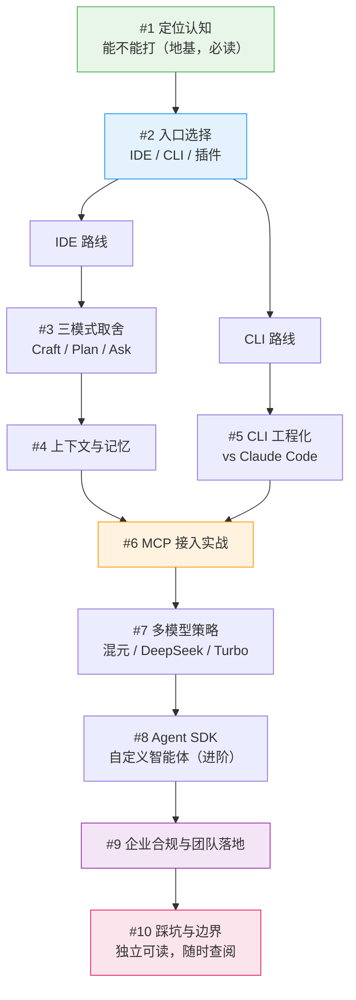

# 腾讯 CodeBuddy 工程化实战系列

> 工程实践参考，不是功能清单。
> 10 篇文章覆盖从产品定位、入口选择、三模式取舍、上下文与记忆、CLI 工程化、MCP 扩展、多模型策略、Agent SDK 到企业合规与踩坑边界的完整路径。

本系列面向在真实项目中使用腾讯 CodeBuddy 的工程师和技术负责人。目标读者已经具备基本的编程经验，需要解决的核心问题是：国产 AI 编程工具到底能不能打、怎么在真实项目里用起来、跟 Claude Code / Cursor 这些海外工具差在哪、团队敢不敢上。

截至 2026-07，CodeBuddy 已经形成 IDE（AI 代码编辑器）、CLI（CodeBuddy Code）、插件三种形态，底层支持混元代码大模型、DeepSeek R1/V3、HunYuan-Turbo S 多模型切换，并提供 Agent SDK 与 MCP 支持。本系列围绕这些能力展开，回答"程序员怎么真正用它开发"。

## 系列定位

CodeBuddy 工程化的核心命题不是"让国产 AI 更会写代码"，而是"在国产、多模型、多形态的现实约束下，让 AI 在真实代码库里受控且高效地工作"。这涉及四组相互关联的工程问题：

**定位认知**——CodeBuddy 是什么、不是什么、对标谁。市面上全是软文式功能介绍，程序员最关心的"它到底行不行"没人诚实回答。不先把这层讲清楚，后续所有讨论都建立在错误期待上。

**入口与模式取舍**——IDE / CLI / 插件三种形态该装哪个；IDE 里的 Craft / Plan / Ask 三种模式怎么选。这是 CodeBuddy 最核心、最让人困惑的概念，官方只说"是什么"，没人讲"什么时候用哪个"。

**上下文与工程化**——AI 怎么真正读懂项目、CLI 能不能平替 Claude Code、MCP 接哪些真有用、多模型怎么切。这是从"会点按钮"到"工程化用起来"的分水岭。

**团队与边界**——企业敢不敢用（合规、私有化、数据安全）、踩过哪些坑、哪些场景不该用。全是好评的生态不健康，诚实的边界反而让工具更可信。

本系列按"定位 → 入口 → 模式 → 上下文 → CLI → 扩展 → 模型 → SDK → 合规 → 边界"的顺序组织，每篇聚焦一个核心概念，有递进关系但也可独立查阅。

## 阅读路径

如果只想快速落地，建议按这条路径读：

1. 先读 #1，建立"不吹不黑"的产品定位认知。
2. 再读 #2，决定自己该用哪种形态（IDE / CLI / 插件）。
3. 按形态分叉：IDE 路线读 #3-#4，CLI 路线读 #5。
4. 进阶读 #6-#8（MCP、多模型、Agent SDK），可按需跳读。
5. 技术负责人读 #9；任何人想避坑读 #10。

## 系列目录

### 开篇：先建立正确定位

| # | 标题 | 核心议题 |
|---|------|----------|
| 01 | [CodeBuddy 到底能不能打？一个程序员的国产 AI 编程工具清醒指南](./01-can-codebuddy-compete.md) | 三形态定位、多模型底层、能打与还差一截的场景，确立不吹不黑基调 |

### 第一模块：入口与模式

选对形态和模式，是 CodeBuddy 用起来 vs 用得糟的分水岭。

| # | 标题 | 核心议题 |
|---|------|----------|
| 02 | [IDE 插件还是 CLI？CodeBuddy 三形态该装哪个](./02-ide-plugin-or-cli.md) | 三形态真实适用场景、选择决策框架、安装与首次配置的坑 |
| 03 | [Craft、Plan、Ask 三种模式怎么选？别再用错了](./03-craft-plan-ask-modes.md) | 三模式能力边界、最常踩的坑、Plan→Craft→Ask 最佳实践 |

### 第二模块：上下文与 CLI 工程化

让 AI 真正读懂项目、用 CLI 干工程活，是从"会点按钮"到"工程化"的跨越。

| # | 标题 | 核心议题 |
|---|------|----------|
| 04 | [让 CodeBuddy 真正理解你的项目：上下文与记忆怎么做](./04-context-and-project-memory.md) | 项目理解能力边界、约定文件写法、大项目喂上下文技巧 |
| 05 | [CodeBuddy CLI 工程化实战：它真的能平替 Claude Code 吗](./05-cli-vs-claude-code.md) | CLI 命令体系、与 Claude Code 映射、同一任务横向对比 |

### 第三模块：扩展、模型与定制

| # | 标题 | 核心议题 |
|---|------|----------|
| 06 | [给 CodeBuddy 装上真本事：MCP 接入实战与取舍](./06-mcp-integration.md) | MCP 两种配置方式、值得装的 MCP 清单、自定义 Server 最小写法 |
| 07 | [混元、DeepSeek、Turbo：CodeBuddy 多模型怎么切才聪明](./07-multi-model-strategy.md) | 三个模型真实强项、任务→模型映射、成本与质量权衡 |
| 08 | [用 Agent SDK 造你自己的编程智能体](./08-agent-sdk-custom-tools.md) | SDK 心智模型、自定义工具写法、代码审查 Agent 实战案例 |

### 第四模块：团队落地与边界

| # | 标题 | 核心议题 |
|---|------|----------|
| 09 | [团队敢用 CodeBuddy 吗？企业落地、合规与私有化实话实说](./09-enterprise-compliance.md) | 数据安全真实情况、私有化与合规优势、团队规范与使用红线 |
| 10 | [踩过的坑和不会再用它的场景](./10-pitfalls-and-boundaries.md) | 多文件改写失败模式、CLI 稳定性问题、明确的不适用场景 |

## 系列结构图

## 取舍说明

- **精简为 10 篇**：不追求覆盖每个功能点，只保留每篇都有明确信息增量的选题。能合并进别的篇的功能介绍，不单开。
- **对标但不排名**：CLI 与 Claude Code 的对比放在 #5 一篇里，用同一任务硬刚，不做泛泛的工具排名。
- **诚实优先**：#10 专讲踩坑与不适用场景。正确的边界认知比虚假的好评对读者更有价值。
- **聚焦程序员真实使用**：不写"功能罗列 + 安装截图"的浅层入门，每篇都落到"怎么判断、怎么取舍、怎么避坑"。

## 延伸阅读

- [CodeBuddy 官网](https://www.codebuddy.cn/)——产品入口与下载
- [CodeBuddy 官方文档](https://www.codebuddy.ai/docs/zh/)——IDE、CLI、MCP、SDK 官方说明
- [Craft 的使用](https://cloud.tencent.com/document/product/1749/117044)——腾讯云官方 Craft 模式文档
- [CodeBuddy CLI 概述](https://www.codebuddy.cn/docs/cli/overview)——CLI 官方文档
- [Claude Code 工程化实战系列](../claude-code-engineering/README.md)——同体系的 Claude Code 工程化参考
- [OpenAI Codex 工程化实战系列](../codex-engineering/README.md)——同体系的 Codex 工程化参考
