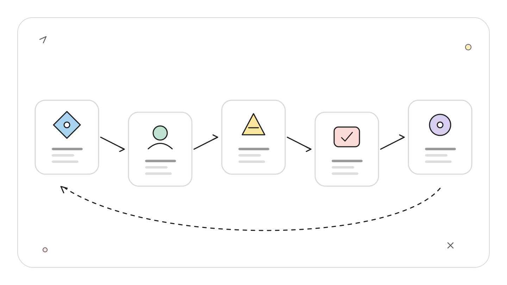
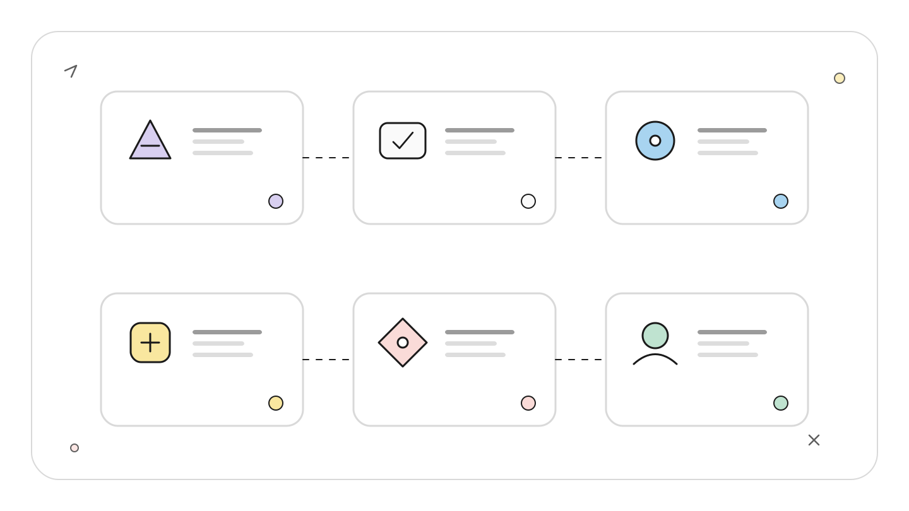
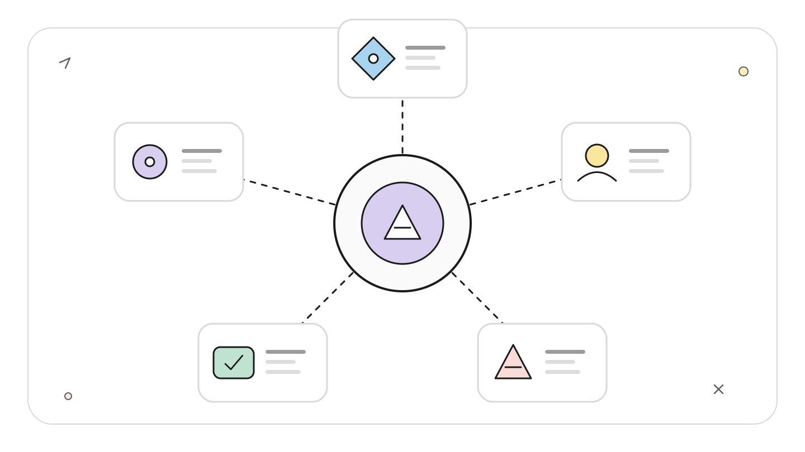
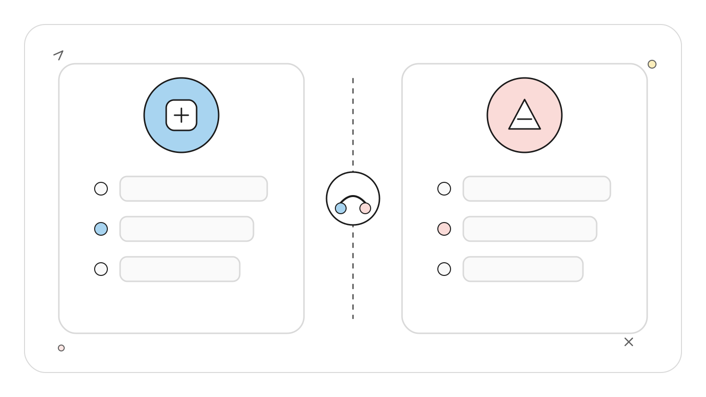
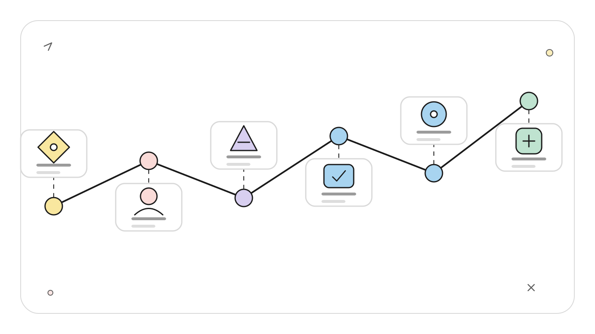
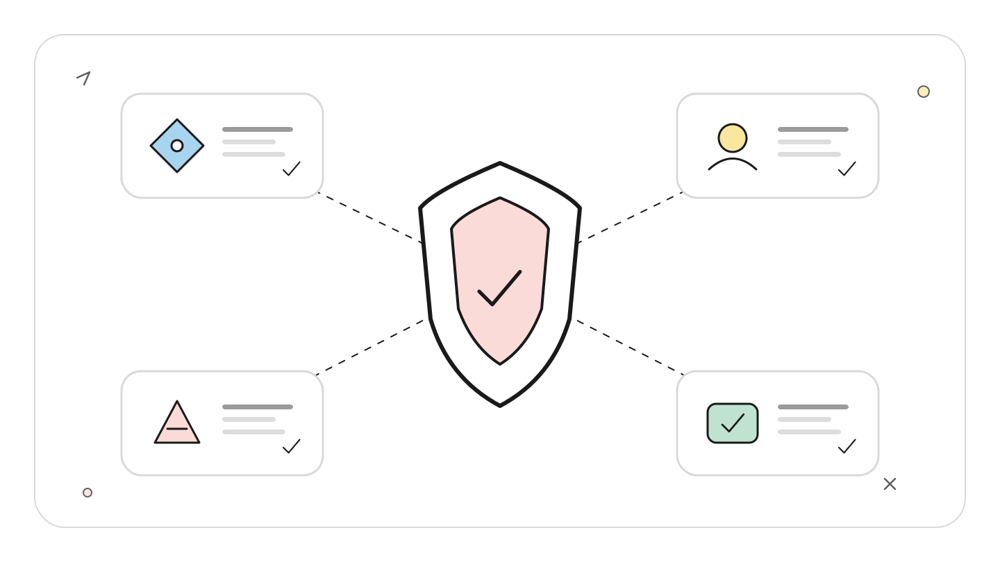

# Codex Multi-agent V2 架构：角色、模型、并发与导航怎么分层

## TL;DR

Multi-agent V2 不是现行 Subagents 的同义词。Codex 0.145.0 已把 `multi_agent_v2` 标为 stable，但仍默认关闭；现行 Subagents 默认启用，支持自定义角色、每代理模型、推理强度、并发上限和 `/agent` 导航。

<!-- wos:illustration codex-engineering/40-multi-agent-v2/01-flowchart-operating-flow.svg -->

<!-- /wos:illustration -->

生产工作流仍应先基于稳定 Subagents 设计。需要 V2 时，应固定在 0.145.0 或更新版本中显式启用，再用真实仓库回归角色恢复、模型覆盖、并发和导航。stable 表示官方认为它可用，不表示自动开启，也不消除多代理的成本与共享状态风险。

## 读者定位与证据边界

本文面向已经会用 Codex 读仓库、实现功能或审查 PR 的中级开发者，重点是多代理架构设计。你应熟悉 TOML、沙箱和模型成本。

资料基线：2026-07-22。本机检查使用 `codex-cli 0.144.5`，该旧版仍显示 under development；最新状态以 2026-07-21 发布的 0.145.0 官方 release 为准。本文没有把 V2 用在真实项目写入任务中。

## 一张角色拓扑比「多开几个 Agent」更有用

多代理任务像一间有负责人和专业调查员的工程室。负责人保存目标、约束和最终决定。调查员分别查代码路径、测试风险或外部文档，然后把压缩后的证据交回来。

<!-- wos:illustration codex-engineering/40-multi-agent-v2/02-infographic-concept-map.svg -->

<!-- /wos:illustration -->

```text
                         main agent
                    目标、分工、裁决、验收
                    /        |         \
             explorer     reviewer     docs_researcher
             快速取证      风险判断       官方资料核验
             只读沙箱      只读沙箱       限定 MCP
                    \        |         /
                     合并冲突与验证缺口
```

这个拓扑里没有「三个同样聪明的代理投票」。子代理负责缩小问题，主代理负责判断。官方文档也把编排定义为生成子代理、路由跟进指令、等待结果和关闭线程，最终响应由主线程汇总。

适合并行的任务有独立边界，例如把 PR 审查拆成调用链映射、正确性检查、官方 API 核验。一个线性 bug 调试不适合硬拆，前一步的运行结果会改变后一步方向。多个代理同时写同一个模块也很差，冲突处理可能比串行修改更慢。

## 稳定层：用自定义 Agent 表达角色

个人角色文件放在 `~/.codex/agents/`，项目角色文件放在 `.codex/agents/`。每个文件至少包含 `name`、`description` 和 `developer_instructions`。模型、推理强度、沙箱、MCP 与 Skills 可以覆盖父线程设置。

<!-- wos:illustration codex-engineering/40-multi-agent-v2/03-framework-system-framework.svg -->

<!-- /wos:illustration -->

这组项目配置把探索和审查分开，避免两个代理争写文件。

`.codex/config.toml`：

```toml
[agents]
max_concurrent_threads_per_session = 4
max_depth = 1
```

`.codex/agents/code-explorer.toml`：

```toml
name = "code_explorer"
description = "只读追踪调用链、状态变化和相关测试。"
model = "gpt-5.6-terra"
model_reasoning_effort = "medium"
sandbox_mode = "read-only"
developer_instructions = """
先用搜索定位入口，再读取最少的相关文件。
返回文件路径、符号、调用关系和无法确认项。
不要修改文件，不要给没有证据的修复建议。
"""
```

`.codex/agents/risk-reviewer.toml`：

```toml
name = "risk_reviewer"
description = "检查正确性、安全、行为回归和测试缺口。"
model = "gpt-5.6"
model_reasoning_effort = "high"
sandbox_mode = "read-only"
developer_instructions = """
按影响排序真实发现。
每个发现必须带文件证据和可执行的验证路径。
忽略不影响行为的样式偏好。
"""
```

`gpt-5.6-terra` 适合速度优先的读取与扫描，`gpt-5.6` 更适合多步推理和高风险判断。官方文档说明，更高的 `model_reasoning_effort` 会增加响应时间和 token 消耗。不要因为角色名叫 reviewer 就一律使用最高强度；先按任务风险分配。

## 并发控制不是越大越快

0.145.0 把共享并发设置统一为 `[agents].max_concurrent_threads_per_session`，旧的 `max_threads` 仍作为别名保留。`max_depth` 默认是 1，根线程可以创建直接子代理，子代理不能继续递归展开。这个默认值对多数团队合理。

<!-- wos:illustration codex-engineering/40-multi-agent-v2/04-comparison-boundary-comparison.svg -->

<!-- /wos:illustration -->

四个并发槽位不代表四个子代理都能满速运行。它们可能争用 CPU、磁盘、测试数据库、浏览器、API 限额和同一组工作区文件。并发上限控制的是打开的 agent thread 数，不会自动隔离外部资源。

任务设计时先写资源边界：

- 取证代理只读，不启动会改数据库的集成测试。
- 浏览器代理独占一个测试账号或独立 profile。
- 实现代理在调查结果合并后再写，避免同时碰公共文件。
- 所有代理返回相同字段：范围、证据、发现、未确认项。

`agents.max_depth` 提高到 2 以后，子代理也能继续生成代理。官方文档警告，这会放大 fan-out，增加 token、延迟和本机资源消耗。没有明确递归分片模型时，保留 1。

## Multi-agent V2 到底改变了什么

本机 0.144.5 的 `codex features list` 结果是：

<!-- wos:illustration codex-engineering/40-multi-agent-v2/05-timeline-lifecycle-timeline.svg -->

<!-- /wos:illustration -->

```text
multi_agent          stable             true
multi_agent_v2       under development  false
```

这只说明旧版状态。0.145.0 release 已明确写明 V2 稳定，并在官方 PR `#34383` 中说明它仍默认关闭。升级后可用下面的配置显式启用：

```toml
[features]
multi_agent_v2 = true

[agents]
max_concurrent_threads_per_session = 4
```

一次性试用也可以运行 `codex --enable multi_agent_v2`。用 `codex features list` 确认当前安装实际报告的成熟度与开关状态，不要把 0.144.5 的输出外推到 0.145.0。

0.145.0 同时把 V2 的并发上限归入共享 `[agents]` 配置。官方 schema 仍允许在 `features.multi_agent_v2` 中配置等待超时、工具命名空间和是否暴露 spawn 时模型覆盖等 V2 专属字段。共享并发放在 `[agents]`，协议实验参数留在 feature 对象，配置责任更清楚。

公开 issue `#20077` 记录过 V2 的 full-history fork 与角色、模型、推理强度覆盖冲突。报告中的错误说明，完整历史分叉会继承父代理类型、模型和 reasoning；同时传入覆盖值会被拒绝。后续评论还报告过显式 `fork_turns: "none"` 才能让某些工作代理正常完成。它是版本相关的公开报告，不是本文复现结果，但足以说明 V2 不应进入默认开发链路。

## 导航：主线程要看得到代理在做什么

在交互式 CLI 中输入 `/agent`，可以检查并切换正在运行的 agent thread。桌面应用会展示各子代理线程及返回主线程的摘要；IDE 在 background-agent UI 可用时，会在 composer 上方显示活动代理。

<!-- wos:illustration codex-engineering/40-multi-agent-v2/06-infographic-verification-guardrails.svg -->

<!-- /wos:illustration -->

导航还用来核对子代理是否跑偏、是否卡在审批或工具失败、是否返回足够证据，以及是否与其他代理争用同一资源。发现边界错误时应及时停止或转向，不要等所有 token 消耗完才读最终摘要。

给主代理的指令要写明等待规则和汇总责任：

```text
使用 code_explorer 追踪受影响调用链，使用 risk_reviewer 检查真实回归风险。
两个代理都保持只读。等待两者完成后，合并重复发现，解释冲突，
再给出最小修改方案和验证命令。不要让子代理直接修改文件。
```

这种写法把并行用于取证，把写入留给单一责任人。若两个代理结论冲突，主代理引用证据裁决；无法裁决就标为未确认，并给出下一条验证命令。

## 什么时候该收回单线程

一个代理已经定位到确定文件并开始修改时，继续扩张代理通常没有收益。实现阶段需要连贯地处理 diff、测试失败和小范围回退，单线程更容易保持因果链。

涉及同一数据库、同一浏览器会话、同一生成文件或同一工作树时，也应减少并发。即使文件不冲突，外部状态仍可能互相污染。

多代理会增加 token。每个子代理都有独立模型和工具工作，重复读取大文件会把成本近似按代理数量放大。先限制范围，再增加代理数，比先开六个代理再要求它们别重复更有效。

## 权衡与局限

稳定 Subagents 已能覆盖大部分角色分工。它的弱点是协调仍以主代理为中心，子代理之间没有可以依赖的共享消息总线；公开 issue `#21027` 正是在请求这种能力。主代理摘要过度压缩时，关键证据仍可能丢失。

每代理模型提高了成本控制精度，也增加配置维护。模型名称、支持的 reasoning 档位和预览状态会变化，团队要按官方 Models 页面定期校准。

V2 已在 0.145.0 达到 stable，采用仍应从小范围开始。固定客户端版本，记录 feature 输出和失败日志，先验证只读调查与角色恢复，再允许写入型代理进入主流程。仍停留在 0.144.5 的团队应按旧版状态处理，升级前不要把新配置当成已支持能力。

## 延伸阅读

- [OpenAI：Subagents](https://learn.chatgpt.com/docs/agent-configuration/subagents)
- [OpenAI：Feature Maturity](https://learn.chatgpt.com/docs/feature-maturity)
- [OpenAI Codex 0.145.0 release](https://github.com/openai/codex/releases/tag/rust-v0.145.0)
- [OpenAI Codex 配置 schema](https://github.com/openai/codex/blob/main/codex-rs/core/config.schema.json)
- [OpenAI Codex issue #20077：V2 full-history fork 覆盖冲突](https://github.com/openai/codex/issues/20077)
