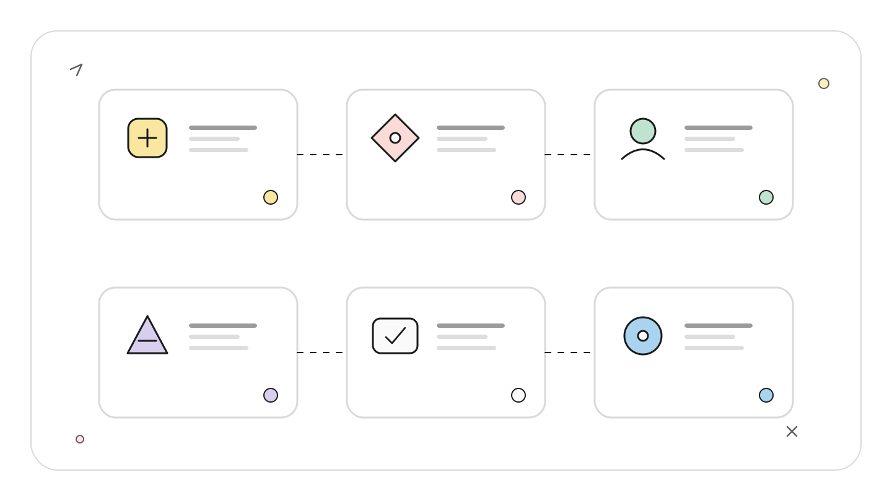
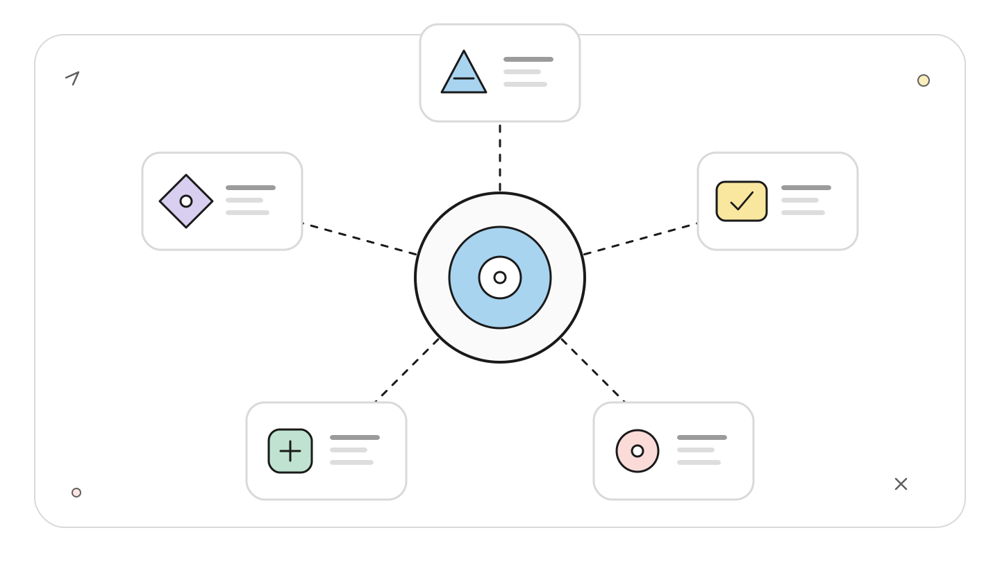
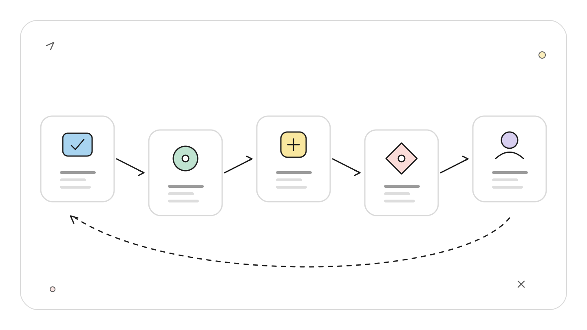
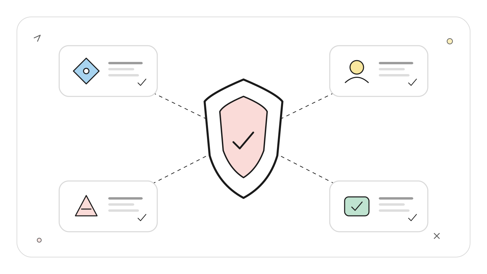
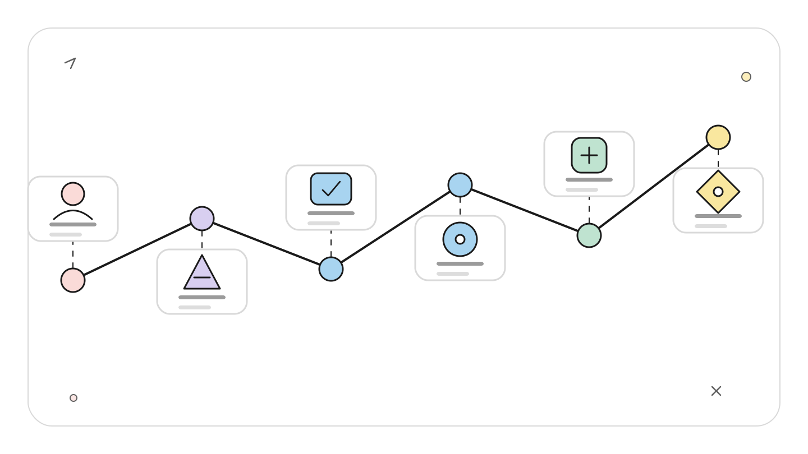
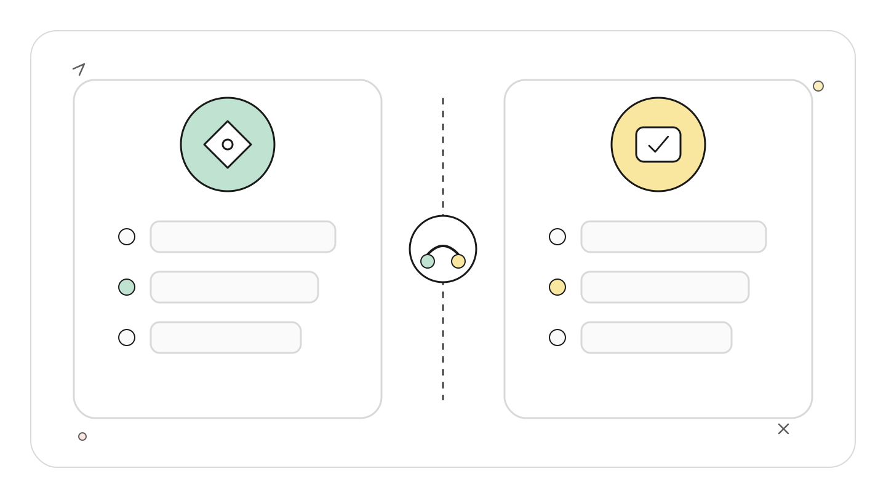

# Codex Goal 模式：让长期任务持续推进，又不丢掉控制权

## TL;DR

Goal 模式把一个可持久化目标绑定到线程，让 Codex 围绕完成条件持续选择工作。它支持暂停、恢复、编辑和清除，也会在需要审批、外部决策、额度或预算不足时停下。它不是后台守护进程，更不会绕过沙箱。

一个可用的 Goal 要写结果、约束和验证标准。长任务恢复时不能只依赖聊天摘要，应重新核对仓库状态、上次观察到的验证结果和当前阻塞项。

## 读者定位

本文面向用 Codex 执行迁移、测试修复、文档重构或大型审查的中级开发者。你已经能控制工作区权限，并愿意把「完成」写成可检查条件。

资料基线：2026-07-22。Goal 模式自 2026-05-21 起不再是实验性功能，官方文档说明它可用于 ChatGPT 桌面应用、Codex CLI 和 IDE 扩展。本文的协议细节来自 OpenAI 官方 App Server README；长线程压缩问题来自公开 issue，未在本文环境中复现。

## Goal 保存的是什么

普通 prompt 像一张任务便签，模型回答完就结束。Goal 更像挂在工位上的验收卡：目标仍未完成时，Codex 可以继续选择动作；遇到阻塞时，卡片保留，执行状态改变。

<!-- wos:illustration codex-engineering/41-goal-mode-long-running/01-infographic-concept-map.svg -->

<!-- /wos:illustration -->

App Server 的数据模型显示，一个线程只有一个持久 Goal。核心字段包括 objective、status、可选 token budget、已用 token 和已用时间。`thread/goal/set` 创建或更新目标，`thread/goal/get` 读取，`thread/goal/clear` 删除。目标状态可以表达 active、complete、blocked、budgetLimited 和 usageLimited 等停止原因。

这组状态比「还在跑」更有用。blocked 表示缺少外部输入，usageLimited 表示当前用量不足，budgetLimited 表示任务达到设定预算。它们都不是完成。把这些状态折叠成一个红色失败图标，会让长期任务失去可恢复性。

## 启动前先把完成条件写硬

在桌面应用、交互式 CLI 或 IDE composer 中输入 `/goal`。目标文本既是第一条 prompt，也是完成标准。

```text
/goal 将当前仓库的 JavaScript 源码迁移到 TypeScript。
保持现有行为，启用 strict，不新增显式 any，
让类型检查、单元测试和文档链接检查全部通过。
只修改迁移必需文件，不提交、不推送。
```

这个目标包含结果和限制，也给出可验证出口。相反，「继续优化这个项目」没有终止条件，Codex 只能猜何时停止。

目标还不清楚时先用 `/plan`，让 Codex 询问边界并生成候选验收标准。计划确认后再创建 Goal。规划阶段可以讨论方案，Goal 阶段负责持续执行，两者不必塞进同一个含糊指令。

工程上，完成定义应覆盖四类事实：

- 产物是什么，例如迁移后的源码或完成审查的风险报告。
- 哪些边界不能跨，例如不改数据库 schema、不部署、不推送。
- 验证怎样运行，例如指定测试、lint、构建或人工检查点。
- 什么情况必须停，例如生产凭据缺失、需求冲突或破坏性迁移。

四类信息不一定都很长。关键是让 Codex 能判断「继续工作」「需要人决定」和「已经完成」的差别。

## 运行中的控制面

桌面应用的 Goal progress row 提供 pause、resume、edit 和 clear。CLI 与 IDE 中可以在原会话继续发送消息，补充上下文或调整约束。

<!-- wos:illustration codex-engineering/41-goal-mode-long-running/02-framework-system-framework.svg -->

<!-- /wos:illustration -->

准备断网或合盖时先暂停，避免执行结果与连接状态错位。任务即将进入高风险动作时也该暂停，先审查 diff、迁移计划或权限请求。发现完成条件写错后，暂停并编辑，不要靠连续多条补丁式 prompt 叠加互相冲突的规则。

恢复前做一次短检查：

```bash
git status --short
git branch --show-current
git rev-parse HEAD
```

然后要求 Codex 报告当前 Goal、已完成产物、最后一个实际观察到的命令结果、阻塞原因和将要执行的动作。这里强调「实际观察到」，因为命令尚未启动、仍在运行、成功完成和失败退出是四种不同状态。

Side chat 适合问进度或解释，不打断主 Goal。不要在 side chat 悄悄改变验收条件，再期待主线程自动采用。改变目标应回到主线程或直接编辑 Goal。

## 暂停与恢复不是进程快照

Goal 会持久化，不代表 shell 进程、浏览器页面、数据库事务和远程连接都被快照。恢复后的第一步是重建可验证状态。

<!-- wos:illustration codex-engineering/41-goal-mode-long-running/03-flowchart-operating-flow.svg -->

<!-- /wos:illustration -->

例如测试命令暂停时仍在后台运行，恢复后不能根据旧进度条猜结果。先检查进程或重新运行可重复的测试。浏览器登录可能过期，SSH host 可能重启，本地依赖也可能被其他任务修改。这些都属于运行环境，不属于 Goal 文本。

官方长任务文档要求 IDE 的 workspace 在 Goal 运行时保持可用。桌面任务也依赖宿主机、网络和所需工具。Goal 提供持续决策，不提供独立计算环境。

## 权限不会随持续时间增长

官方文档明确说明，创建 Goal 不会扩大访问范围。它继续使用原线程的 sandbox 和 approval policy，并在需要决定时暂停。

<!-- wos:illustration codex-engineering/41-goal-mode-long-running/04-infographic-verification-guardrails.svg -->

<!-- /wos:illustration -->

这个边界很重要。持续数小时的任务会遇到更多命令、网站和凭据请求，风险面比一次短 prompt 大。不要为了减少夜间等待，把整个 Goal 改成 Full access。更稳的做法是让低风险步骤自动推进，高风险动作形成明确审批点。

可把任务拆成这样的节奏：先只读盘点和计划，再允许 workspace-write 实现，最后由人决定是否提交、推送或部署。Goal 可以跨越多个阶段，权限不必一次开到最大。

如果任务需要第三方账号、付款、生产变更或不可逆数据操作，把「必须人工确认」写进目标约束。Codex 到达该点后应报告 blocked，而不是把等待误判为任务失败。

## 长线程会遇到物理上限

持续推进会积累对话、工具输出、diff 和测试日志。系统可以压缩上下文，但压缩不是无限存储。公开 issue `#24230` 报告过 Codex Desktop 26.519 与 CLI 0.133.0-alpha.1 的远程压缩请求本身超过模型上下文，受影响线程难以继续。报告者还观察到 UI 已显示 Goal 控件，而对应 App Server goal 方法不可用的版本错位。

这是一份特定环境的 issue，不应推导为当前版本必然失败。它揭示的工程限制仍成立：长任务要周期性产出外部状态，而不是把唯一事实留在聊天里。

适合外部化的内容包括迁移清单、测试状态、已确认决策、剩余风险和恢复命令。把它们写进仓库文档、issue 或任务系统时，注意不要提交密钥和临时机器路径。

## 一个可恢复的长期任务协议

启动时记录目标文本、仓库路径、分支和验证命令。每完成一个可独立验证的阶段，要求 Codex 更新任务文件或现有 issue，不另造隐蔽状态。

<!-- wos:illustration codex-engineering/41-goal-mode-long-running/05-timeline-lifecycle-timeline.svg -->

<!-- /wos:illustration -->

暂停前让 Codex 停止启动新工作，等待当前可安全结束的命令返回，并输出恢复点。恢复点至少写明已完成、未完成、当前 diff、最后验证、待决策和首个恢复动作。

恢复后以工作区为准重新核对。旧摘要说测试通过，但 HEAD 已变化，就重新跑测试。旧摘要说某文件未修改，而 `git status` 显示有改动，就先读 diff。Goal 负责方向，验证器负责事实。

达到完成标准后再标记 complete。测试未运行、人工验收未完成或生产状态无法确认时，不要因为 token 快用完就提前完成。额度不足应进入 usageLimited 或 budgetLimited，等待资源恢复后继续。

## 权衡与限制

Goal 减少开发者反复催促「继续」的次数，也让模型拥有更长的自主行动链。目标写得越宽，偏离范围的机会越多。解决办法是缩小产物、列出禁区并绑定验证，继续增加形容词没有帮助。

<!-- wos:illustration codex-engineering/41-goal-mode-long-running/06-comparison-boundary-comparison.svg -->

<!-- /wos:illustration -->

暂停保留目标，但不能保证外部环境原样存在。恢复协议会增加几分钟检查成本，却能避免在错误分支、过期凭据或未完成进程上继续。

长任务仍受上下文、用量、网络、宿主机和审批约束。Goal 适合可以分阶段验证的工程工作，不适合无人监管的生产发布，也不适合完成标准只能靠主观感觉判断的开放式研究。

把一个真实任务改写成带完成标准的 `/goal`，先运行到第一个可验证阶段，再主动暂停并恢复一次。只有恢复后的状态核验也成立，这套长期任务设计才算可用。

## 延伸阅读

- [OpenAI：Long-running work](https://learn.chatgpt.com/docs/long-running-work)
- [OpenAI Codex Changelog](https://learn.chatgpt.com/docs/changelog)
- [OpenAI Codex App Server Goal 协议](https://github.com/openai/codex/blob/main/codex-rs/app-server/README.md)
- [OpenAI Codex issue #24230：长线程压缩失败报告](https://github.com/openai/codex/issues/24230)
