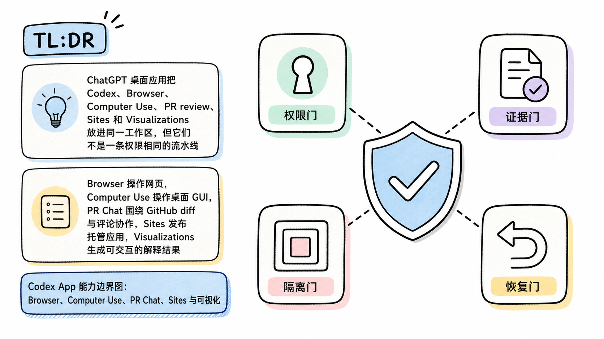
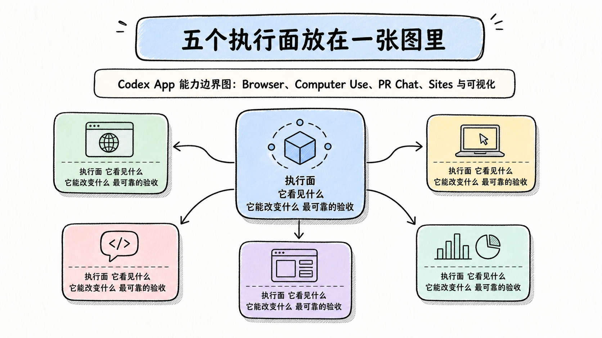
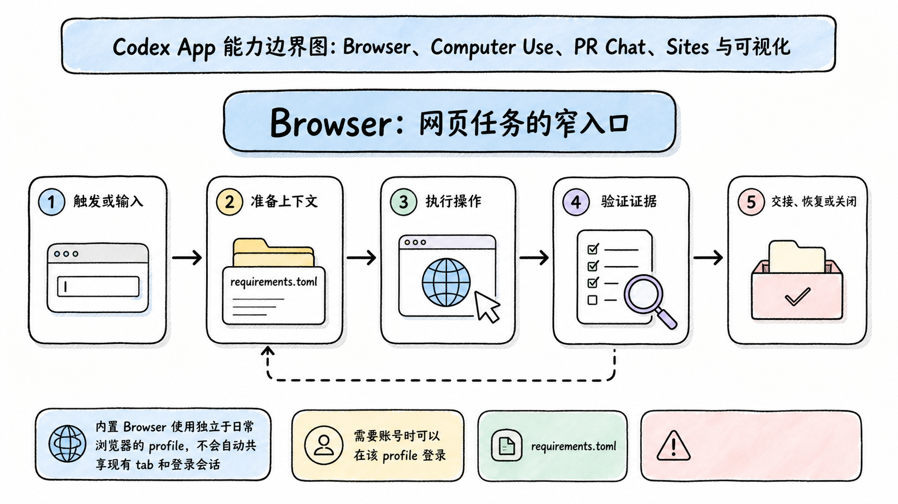
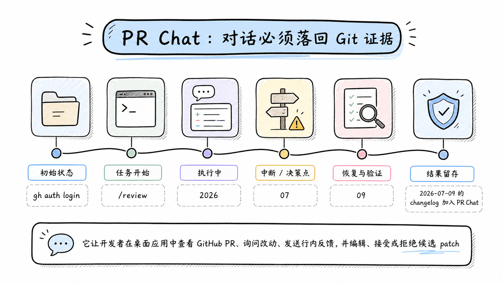
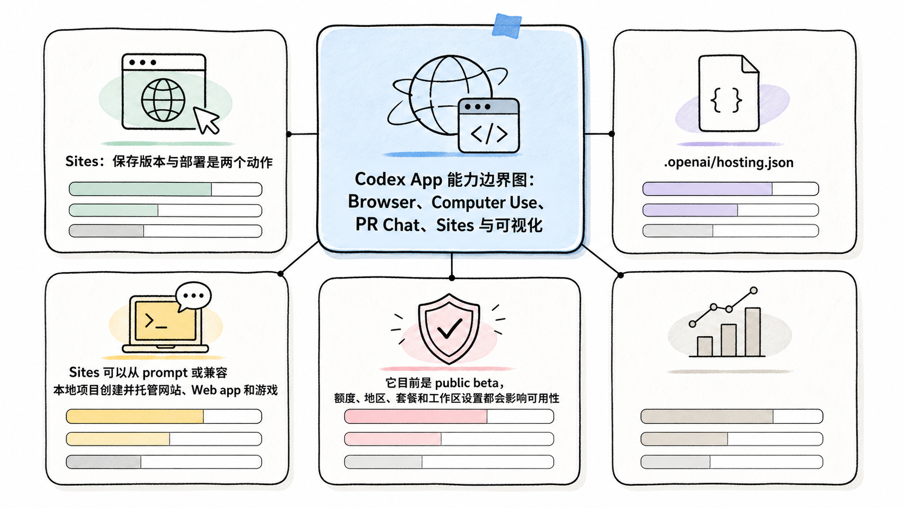
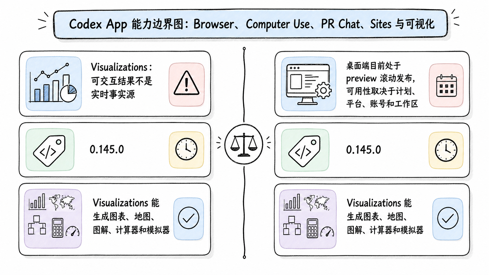

# Codex App 能力边界图：Browser、Computer Use、PR Chat、Sites 与可视化

## TL;DR

ChatGPT 桌面应用把 Codex、Browser、Computer Use、PR review、Sites 和 Visualizations 放进同一工作区，但它们不是一条权限相同的流水线。Browser 操作网页，Computer Use 操作桌面 GUI，PR Chat 围绕 GitHub diff 与评论协作，Sites 发布托管应用，Visualizations 生成可交互的解释结果。

<!-- wos:illustration codex-engineering/42-app-browser-review-visualization/01-infographic-verification-guardrails.png -->

<!-- /wos:illustration -->

选错执行面会增加风险。能用 Git diff 核验的改动不要只看 GUI，能用 Browser 完成的网页任务不要扩大到整台桌面，Sites 的每个部署 URL 都是生产部署，Visualization 通常只是生成时刻的数据快照。

## 读者定位与资料范围

本文面向使用 Codex 开发网页、处理 GitHub PR 或生成交互结果的中级开发者。你需要理解 Git、浏览器会话和最小权限。

资料基线：2026-07-22。功能状态以 OpenAI 官方文档、changelog 与 Codex 0.145.0 release 为准。Sites 是 public beta，Visualizations 在桌面端仍处于滚动发布的 preview。本文没有执行真实网站发布、登录账号操作或 PR 写入，因此涉及这些动作的描述均限定为官方文档边界。

## 五个执行面放在一张图里

| 执行面 | 它看见什么 | 它能改变什么 | 最可靠的验收 |
|---|---|---|---|
| Browser | 独立浏览器 profile 中的网页和本地页面 | 页面输入、导航、下载、网站动作 | 页面状态、网络与控制台证据 |
| Computer Use | macOS 或 Windows 的可见 GUI | 窗口、菜单、键盘输入、剪贴板和应用状态 | 屏幕结果加落盘文件或应用内记录 |
| PR Chat 与 review | GitHub PR 上下文、评论、Git diff | 反馈、候选 patch、暂存与 Git 操作 | diff、测试、评论状态和分支 |
| Sites | 兼容项目与托管环境 | 保存版本、部署、访问范围、环境变量 | 已批准版本、生产 URL、访问测试 |
| Visualizations | 聊天中的数据和说明 | 生成图表、地图、计算器或交互解释 | 数据、单位、交互和可访问性检查 |

<!-- wos:illustration codex-engineering/42-app-browser-review-visualization/02-framework-system-framework.png -->

<!-- /wos:illustration -->

桌面应用是控制台，不是统一事务。一次任务跨越多个执行面时，不会自动获得端到端回滚。Browser 已提交表单、Computer Use 已改应用设置、Git 工作树却回退成功，外部状态仍然存在。

## Browser：网页任务的窄入口

内置 Browser 使用独立于日常浏览器的 profile，不会自动共享现有 tab 和登录会话。需要账号时可以在该 profile 登录。若任务必须使用你已经登录的 Chrome 页面，应使用 Chrome extension，而不是假设内置 Browser 能看到它。

<!-- wos:illustration codex-engineering/42-app-browser-review-visualization/03-flowchart-operating-flow.png -->

<!-- /wos:illustration -->

Browser 适合检查本地页面、复现前端问题、收集公开资料和完成范围清楚的网站流程。官方文档建议给出 URL、关注状态和具体元素，并在 Codex 完成后重新检查页面。

Developer mode 通过受控 Chrome DevTools Protocol 访问网络、控制台、DOM、样式和性能 trace。Full CDP 能暴露敏感浏览器内部信息，每次使用前会请求明确批准。组织管理员还能在 `requirements.toml` 中禁用：

```toml
[features]
browser_use_full_cdp_access = false
```

这个开关适合不允许 Agent 读取完整网络流量或页面内部状态的团队。关闭后仍可保留普通 Browser 工作流。

网页内容应视为不可信输入。页面可以包含诱导 Agent 泄露数据或执行错误动作的文字。站点访问许可也不等于所有操作获批，提交表单、付款或账号变更仍可能触发独立确认。

## Computer Use：只有 GUI 才能到达时再用

Computer Use 能看见并操作 macOS 或 Windows 桌面应用。它适合复现 GUI 特有 bug、调整没有 API 的应用设置，或从没有 plugin 的数据源读取信息。

它的权限面大于 Browser。macOS 需要 Screen Recording 与 Accessibility，Windows 需要目标应用位于活动桌面。官方文档把终端应用、ChatGPT 自身、系统安全与隐私审批、管理员身份认证排除在可操作范围外。

macOS 的 locked use 可在屏幕锁定后继续受信任的 Computer Use turn。它使用短时授权，覆盖所有显示器，检测到本地键盘或鼠标输入后会重新锁定。这个能力不是通用远程解锁。

把任务写成「打开某应用，检查某设置，停在保存前」比「帮我把电脑配置好」安全。账号、安全、付款、凭据和网络设置需要人在场。GUI 中发生的修改可能不会立刻出现在 Codex review pane，只有保存到磁盘且被 Git 跟踪的内容才有标准 diff。

## PR Chat：对话必须落回 Git 证据

2026-07-09 的 changelog 加入 PR Chat。它让开发者在桌面应用中查看 GitHub PR、询问改动、发送行内反馈，并编辑、接受或拒绝候选 patch。

<!-- wos:illustration codex-engineering/42-app-browser-review-visualization/04-timeline-lifecycle-timeline.png -->

<!-- /wos:illustration -->

当前官方 Code review 文档给出更具体的依赖：项目必须是 Git 仓库；若要加载 PR 上下文、评论和 changed files，需要安装并认证 GitHub CLI。

```bash
gh auth status
git status --short
git branch --show-current
```

若尚未认证，使用 `gh auth login` 完成 GitHub CLI 授权。授权范围应按仓库和任务需要控制。

Review pane 展示的是仓库状态，不只包含 Codex 产生的修改。它可以切换 Unstaged、Staged、Commit、Branch 和 Last turn。`/review` 默认只读 diff 并返回按优先级排列的发现；让 Codex 应用修复时，仍遵守当前 sandbox 与 approval 设置。

PR Chat 的结束条件不是对话里出现「已修复」。检查目标评论是否处理、diff 是否只含预期文件、测试是否通过、提交是否位于正确分支。候选 patch 可以拒绝，行内评论也只是指导，不会自动证明行为正确。

## Sites：保存版本与部署是两个动作

Sites 可以从 prompt 或兼容本地项目创建并托管网站、Web app 和游戏。它目前是 public beta，额度、地区、套餐和工作区设置都会影响可用性。Codex CLI 和 IDE 扩展没有独立 Sites 管理界面，发布管理要在 ChatGPT Web 或桌面应用完成。

<!-- wos:illustration codex-engineering/42-app-browser-review-visualization/05-infographic-concept-map.png -->

<!-- /wos:illustration -->

最容易误判的细节是：每个 Sites deployment URL 都是生产部署。想先审查时，应保存版本但不部署。官方文档把流程拆成 Save a version 和 Deploy a version，前者生成可审查候选，后者才发布并返回生产 URL。

托管环境变量和 secret 在 Site settings 中管理，不要写入 prompt、附件、站点内容或 `.openai/hosting.json`。访问范围与站点自身登录是两套控制。公开 Site 不要求访问者加入 ChatGPT workspace，所以发布前要用目标访问者视角测试。

Sites 适合原型、内部工具和范围明确的小型托管体验。需要自定义基础设施、严格变更审批、复杂网络拓扑或既有 CI/CD 的生产系统，继续使用原部署链路更可控。

## Visualizations：可交互结果不是实时事实源

Visualizations 能生成图表、地图、图解、计算器和模拟器。桌面端目前处于 preview 滚动发布，可用性取决于计划、平台、账号和工作区。Codex 0.145.0 为终端 UI 加入安全的可点击链接，把生成的 HTML 放进受限查看器并交给浏览器打开；这是一条终端降级路径，不代表 TUI 原生嵌入了交互组件。IDE 扩展仍应按官方文档声明的支持面判断。

<!-- wos:illustration codex-engineering/42-app-browser-review-visualization/06-comparison-boundary-comparison.png -->

<!-- /wos:illustration -->

Visualization 适合让读者调整输入或观察关系。它不适合承担唯一审计记录。官方文档说明，这类结果通常是创建时信息的快照，不会持续与连接的数据源同步。后续 prompt 也可能生成替代版本，而不是原地修改旧结果。

发布前检查原始数据、单位、标签、假设和交互。复杂结果还要补文本摘要与数据表，验证键盘操作、焦点、对比度和不依赖颜色的编码。空白或失败时先等响应完成并刷新一次，再减少数据量或简化控件。

## 一次跨执行面任务怎样收口

假设任务是「修复前端空状态并发布演示」。Browser 负责复现并留下元素级反馈，Codex 在仓库中改代码，review pane 检查 diff，测试命令验证行为。若需要 PR 协作，再进入 PR Chat 处理评论。Sites 只在保存版本审查通过后部署。Visualization 只在确实需要交互解释数据时加入，不是默认产物。

每跨一个执行面，都记录输入、权限、外部副作用和验收证据。这样任务失败时能知道应该回退 Git、撤销网站动作、恢复应用设置，还是下线一个 Sites 版本。

## 权衡与适用边界

统一桌面工作区减少复制粘贴，却容易制造「都在一个 App 里，所以状态天然一致」的错觉。Git 有 diff 与分支，网站提交和桌面设置未必有同等回滚能力。

Browser 的独立 profile 隔离了日常浏览数据，也增加重新登录成本。Computer Use 覆盖更多 GUI，却要求更高系统权限。PR Chat 缩短评论到修复的路径，仍不能替代测试和代码 owner。Sites 降低部署门槛，每次 Deploy 都应按生产变更审查。Visualizations 提升解释力，但快照可能过期。

选择执行面时先问能否得到可验证结果。答案是 Git diff、测试报告或可重复页面状态时，优先使用窄工具。只有结构化接口到不了目标时，才扩大到 Computer Use。

## 延伸阅读

- [OpenAI：Browser](https://learn.chatgpt.com/docs/browser)
- [OpenAI：Computer Use](https://learn.chatgpt.com/docs/computer-use)
- [OpenAI：Code review 与 PR 工作流](https://learn.chatgpt.com/docs/code-review)
- [OpenAI：Sites](https://learn.chatgpt.com/docs/sites)
- [OpenAI：Visualizations](https://learn.chatgpt.com/docs/visualizations)
