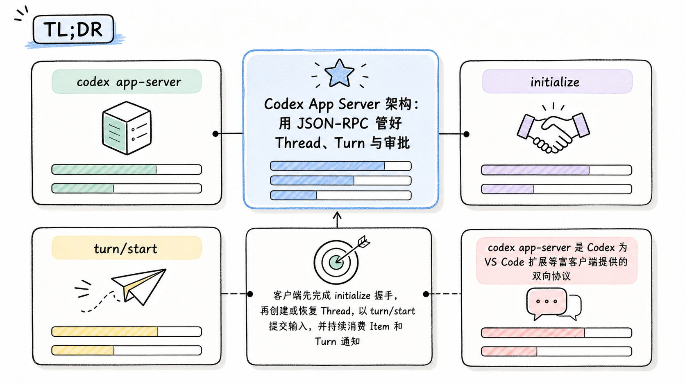
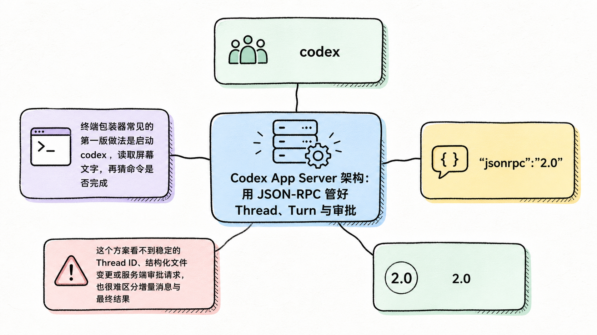
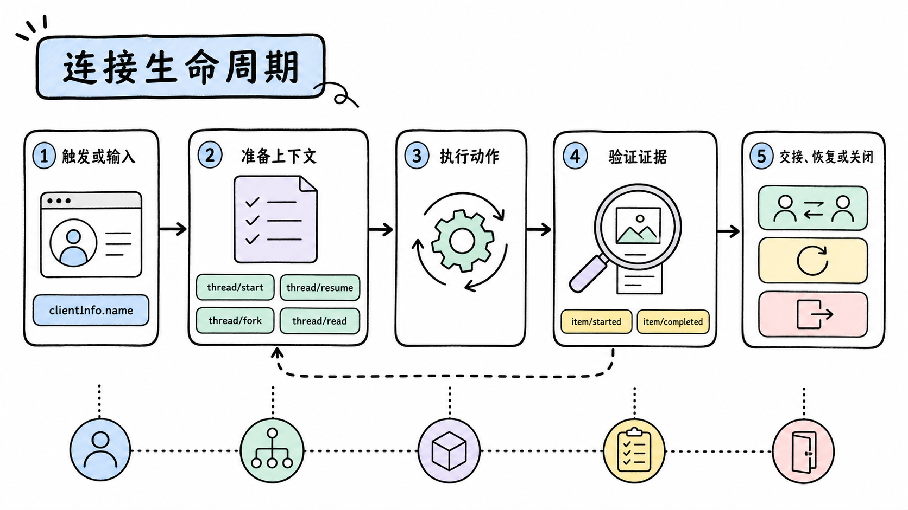
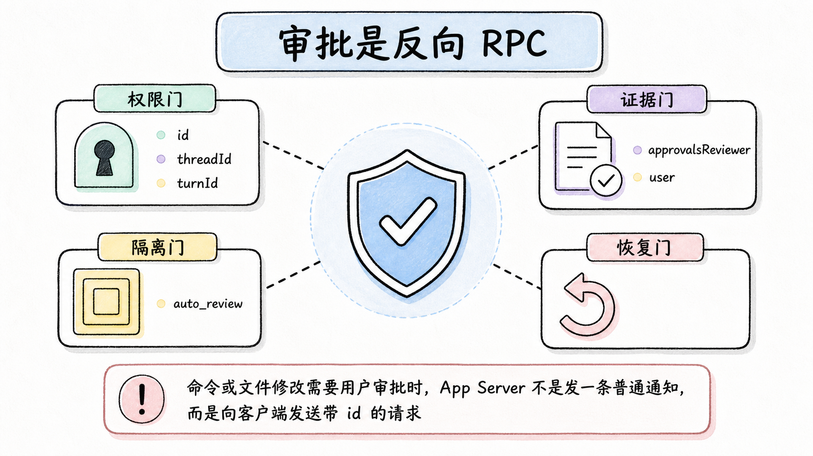
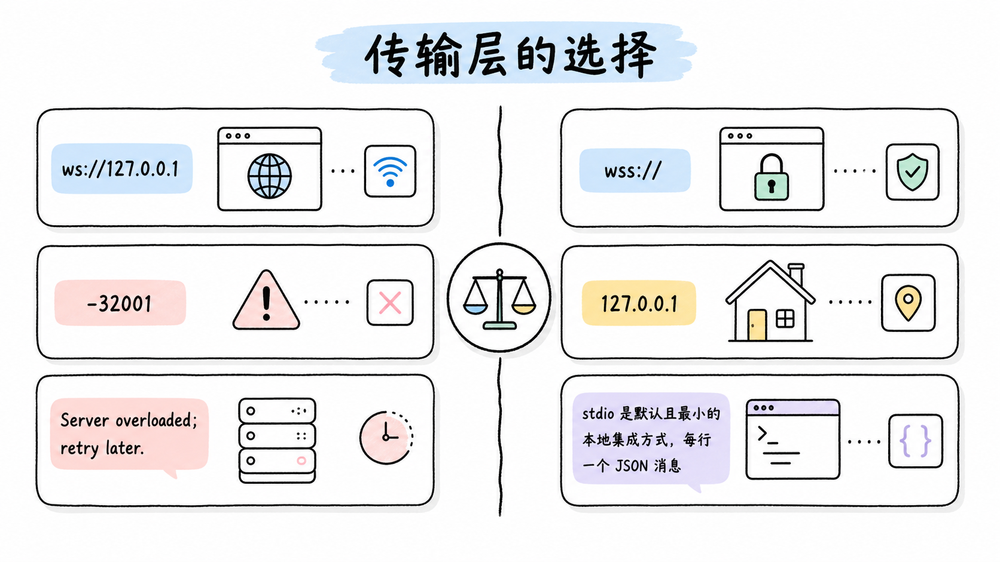
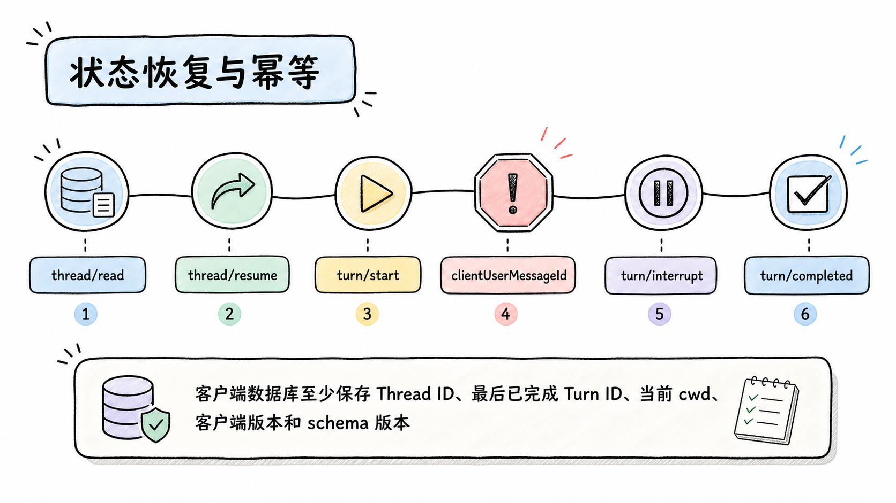

# Codex App Server 架构：用 JSON-RPC 管好 Thread、Turn 与审批

## TL;DR

`codex app-server` 是 Codex 为 VS Code 扩展等富客户端提供的双向协议。客户端先完成 `initialize` 握手，再创建或恢复 Thread，以 `turn/start` 提交输入，并持续消费 Item 和 Turn 通知；命令审批则反向由服务器向客户端发请求。

<!-- wos:illustration codex-engineering/46-app-server-json-rpc/01-infographic-concept-map.png -->

<!-- /wos:illustration -->

自定义客户端应生成与本机 Codex 版本匹配的 schema，持久保存 Thread ID，并把通知流当作状态来源。WebSocket 传输目前是实验性且不受支持，远程暴露时必须加认证与 TLS；只做 CI 自动化时，Codex SDK 比 App Server 更合适。

## 谁需要这层接口

本文面向要把 Codex 嵌入 IDE、桌面工具或内部工程台的中级开发者，采用系统设计视角。读者应熟悉子进程、JSONL 和异步事件。

资料基线：2026-07-22。本机安装为 `codex-cli 0.144.5`，该版本的 `--help` 仍把 `app-server` 命令组标为实验性。协议字段来自 OpenAI App Server 文档、`openai/codex` 仓库的 App Server README 与 v2 协议定义。本文对示例做静态语法检查，没有发起真实模型 Turn，也没有验证登录、额度和远程传输。自定义客户端应锁定版本，不能把当前字段当作长期兼容承诺。

## App Server 不是把 CLI 输出换成 JSON

终端包装器常见的第一版做法是启动 `codex`，读取屏幕文字，再猜命令是否完成。这个方案看不到稳定的 Thread ID、结构化文件变更或服务端审批请求，也很难区分增量消息与最终结果。

<!-- wos:illustration codex-engineering/46-app-server-json-rpc/02-framework-system-framework.png -->

<!-- /wos:illustration -->

App Server 暴露的是 Codex 状态机：

```text
┌─────────────────────┐        JSONL / WebSocket / Unix socket
│ 自定义客户端         │ <──────────────────────────────────────> ┌──────────────┐
│                     │                                          │ app-server   │
│ UI 状态              │  initialize, thread/start, turn/start    │              │
│ Thread 索引          │  item/*, turn/*, approval requests       │ Codex core   │
│ 审批界面              │                                          │ sandbox      │
└─────────────────────┘                                          └──────────────┘
          |                                                               |
          └── 持久化 Thread ID、客户端状态和审计关联 ────────────────────────┘
```

JSON-RPC 只负责消息关联。Thread、Turn、Item 才是业务模型：

- Thread 是一段可恢复的对话，包含多个 Turn。
- Turn 从一次用户输入开始，包含代理工作和多个 Item。
- Item 是用户消息、代理消息、命令、文件变更或工具调用等最小事件单元。

协议与 JSON-RPC 2.0 相似，但线上消息省略 `"jsonrpc":"2.0"` 字段。照搬通用 JSON-RPC 客户端并强制该字段，可能会增加无效兼容逻辑。

## 连接生命周期

每条连接只初始化一次。正确顺序是：

<!-- wos:illustration codex-engineering/46-app-server-json-rpc/03-flowchart-operating-flow.png -->

<!-- /wos:illustration -->

```text
client                         app-server
  |                                |
  | initialize(id=0)               |
  |------------------------------->|
  | result(id=0)                   |
  |<-------------------------------|
  | initialized notification       |
  |------------------------------->|
  | thread/start(id=1)             |
  |------------------------------->|
  | result(thread)                 |
  |<-------------------------------|
  | thread/started                 |
  |<-------------------------------|
  | turn/start(id=2)               |
  |------------------------------->|
  | result(turn)                   |
  |<-------------------------------|
  | item/started, delta, completed |
  |<-------------------------------|
  | turn/completed                 |
  |<-------------------------------|
```

握手前发送其他请求会被拒绝。`clientInfo.name` 不是装饰字段，企业合规日志会用它标识客户端。计划面向企业发布的新集成应申请已知客户端标识。

Thread 有不同入口。`thread/start` 创建新会话，`thread/resume` 恢复并继续原会话，`thread/fork` 复制历史并返回新 ID，`thread/read` 只读持久记录。恢复按钮不能偷偷调用 `thread/start`，否则用户看到的是外观相似的新会话，原 Thread 的上下文和审计关联都会断开。

一个 Turn 的 Item 生命周期固定为 `item/started`、零个或多个增量、`item/completed`。Turn 最终以 `turn/completed` 结束，状态可能是 completed、interrupted 或 failed。不要把一次 `agentMessage` 的 completed 当作整个 Turn 已结束，后面仍可能有工具或文件事件。

## 一个最小 stdio 客户端

下面的 Node.js 22 示例只读取仓库，不实现交互审批。它使用 `readOnly` 与 `never`，适合验证握手、Thread 和 Turn 事件，不适合作为完整产品客户端。

保存为 `client.mjs`：

```javascript
import { spawn } from "node:child_process";
import readline from "node:readline";

const codex = spawn("codex", ["app-server"], {
  stdio: ["pipe", "pipe", "inherit"],
});

const lines = readline.createInterface({ input: codex.stdout });
const pending = new Map();
let nextId = 1;
let finishTurn;
const turnFinished = new Promise((resolve) => {
  finishTurn = resolve;
});

function send(message) {
  codex.stdin.write(`${JSON.stringify(message)}\n`);
}

function request(method, params = {}) {
  const id = nextId++;
  send({ method, id, params });
  return new Promise((resolve, reject) => {
    pending.set(id, { resolve, reject });
  });
}

function notify(method, params = {}) {
  send({ method, params });
}

lines.on("line", (line) => {
  const message = JSON.parse(line);

  if (message.method && message.id !== undefined) {
    send({
      id: message.id,
      error: { code: -32601, message: "Client request handler not implemented" },
    });
    return;
  }

  if (message.id !== undefined && pending.has(message.id)) {
    const waiter = pending.get(message.id);
    pending.delete(message.id);
    if (message.error) waiter.reject(new Error(message.error.message));
    else waiter.resolve(message.result);
    return;
  }

  console.log(JSON.stringify(message));
  if (message.method === "turn/completed") finishTurn(message.params);
});

try {
  await request("initialize", {
    clientInfo: {
      name: "repo_reader_demo",
      title: "Repository Reader Demo",
      version: "0.1.0",
    },
  });
  notify("initialized");

  const { thread } = await request("thread/start", {
    cwd: process.cwd(),
    approvalPolicy: "never",
    sandbox: "readOnly",
  });

  await request("turn/start", {
    threadId: thread.id,
    input: [{ type: "text", text: "Read README.md and summarize its purpose." }],
  });

  await turnFinished;
} finally {
  lines.close();
  codex.kill("SIGTERM");
}
```

运行前先检查语法和版本：

```bash
node --check client.mjs
codex --version
node client.mjs
```

成功连接后，标准输出会出现 `thread/started`、`turn/started`、`item/*` 与 `turn/completed` 通知。具体 Item、模型文本和 token 用量取决于当前仓库、账号和模型，本文不提供伪造的固定输出。

这个示例遇到服务端主动请求会返回 `-32601`。生产客户端必须处理命令执行、文件变更和 MCP 等审批请求，把命令、工作目录、风险说明与 diff 呈现给用户，再返回明确 decision。

## Schema 应跟着 Codex 二进制走

App Server 能从当前二进制生成 TypeScript 类型或 JSON Schema：

```bash
codex app-server generate-ts --out ./schemas
codex app-server generate-json-schema --out ./schemas
```

生成物与运行命令的 Codex 版本匹配。升级二进制时重新生成 schema，再让 CI 比较差异，可以在发布客户端前发现字段、枚举或实验接口变化。把网上某个 README 的类型复制进代码后长期不更新，会让协议漂移在运行时才暴露。

实验字段需要在 `initialize.params.capabilities.experimentalApi` 显式 opt in。未声明能力却调用实验方法时，服务器会拒绝请求。动态工具、分页 Thread 历史、后台终端和部分进程接口都可能受这个门控；客户端应把实验能力集中在一个 feature adapter 中，避免散落在 UI 组件。

## 审批是反向 RPC

命令或文件修改需要用户审批时，App Server 不是发一条普通通知，而是向客户端发送带 `id` 的请求。客户端必须回复同一个 `id`。通知没有 `id`，请求有 `id`，这一区别应在消息分发器第一层处理。

<!-- wos:illustration codex-engineering/46-app-server-json-rpc/04-infographic-verification-guardrails.png -->

<!-- /wos:illustration -->

审批 UI 至少保留 `threadId` 和 `turnId`，防止多个活动 Thread 的请求串线。命令审批还可能支持本次接受、会话接受、带 exec policy 修订接受、网络策略修订、拒绝或取消。客户端不要把所有 positive decision 压成一个布尔值，否则会丢失策略作用域。

`approvalsReviewer` 也会改变路由。值为 `user` 时，符合条件的请求发给客户端；值为 `auto_review` 时，自动审查代理可能在 Codex 内部处理。只看到“没有收到审批 RPC”不能立即断定 App Server 丢消息，先读取 Thread 的有效 reviewer 配置。

## 传输层的选择

stdio 是默认且最小的本地集成方式，每行一个 JSON 消息。进程生命周期与客户端绑定，身份边界也最清楚。

<!-- wos:illustration codex-engineering/46-app-server-json-rpc/05-comparison-boundary-comparison.png -->

<!-- /wos:illustration -->

Unix socket 适合同机多进程连接，使用 WebSocket Upgrade。要设置 socket 文件权限，并处理旧 socket 清理。

WebSocket 监听是实验性且不受支持。`ws://127.0.0.1` 可用于 localhost 或 SSH 端口转发；非 loopback 监听在功能推出阶段可能默认接受未认证连接，不能直接暴露到局域网或公网。远程连接使用 `wss://`、TLS 和 App Server 的 WebSocket 认证参数，token 放入文件或环境变量，不放在进程命令行。

WebSocket 入站队列满时，服务器返回 `-32001` 和 `Server overloaded; retry later.`。客户端应指数退避并加入 jitter，不能立即无限重试。事件消费也要有界，UI 渲染慢时把原始流落入队列或持久日志，避免阻塞读取管道。

## 状态恢复与幂等

客户端数据库至少保存 Thread ID、最后已完成 Turn ID、当前 cwd、客户端版本和 schema 版本。重连后先用 `thread/read` 检查持久状态，需要继续才调用 `thread/resume`。

<!-- wos:illustration codex-engineering/46-app-server-json-rpc/06-timeline-lifecycle-timeline.png -->

<!-- /wos:illustration -->

`turn/start` 已接受但连接在响应前断开时，盲目重试可能生成第二个 Turn。协议支持 `clientUserMessageId` 时，应给用户提交生成稳定 ID，并在恢复后检查对应 userMessage Item。客户端自己的发送队列也要区分“尚未写入管道”和“已写入但结果未知”。

中断使用 `turn/interrupt`，成功响应是空对象，最终仍以 `turn/completed` 且状态 interrupted 收口。按钮点击成功不是 Turn 已停止，UI 要等终态事件。

## 权衡与局限

App Server 给了富客户端所需的历史、流式事件与审批能力，也把协议兼容、断线恢复、背压和 UI 安全责任交给客户端团队。它比解析 CLI 文本可靠，工程量也明显更大。

协议包含稳定面和实验面。只使用 `initialize`、核心 Thread、Turn 与 Item 流，可以把升级风险压低。启用实验 API 后，要锁定 Codex 版本、生成 schema 并做协议回归。

App Server 适合人机交互产品。无界面批处理、CI 或一次性自动化不需要承担完整双向状态机，优先使用 Codex SDK 或 `codex exec --json`。选错接口会让一个简单任务多出长期连接和审批 UI。

## 延伸阅读

- [OpenAI：Codex App Server](https://learn.chatgpt.com/docs/app-server)
- [OpenAI Codex：App Server README](https://github.com/openai/codex/blob/main/codex-rs/app-server/README.md)
- [OpenAI Codex：v2 protocol types](https://github.com/openai/codex/blob/main/codex-rs/app-server-protocol/src/protocol/v2.rs)
- [OpenAI Codex：Configuration Reference](https://learn.chatgpt.com/docs/config-file/config-reference)
- [OpenAI Codex issue #21982：审批路由排查案例](https://github.com/openai/codex/issues/21982)
