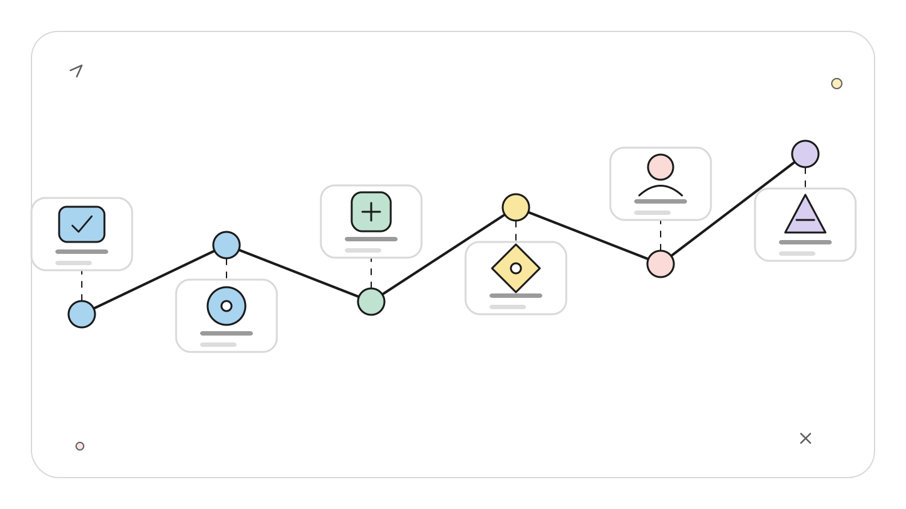
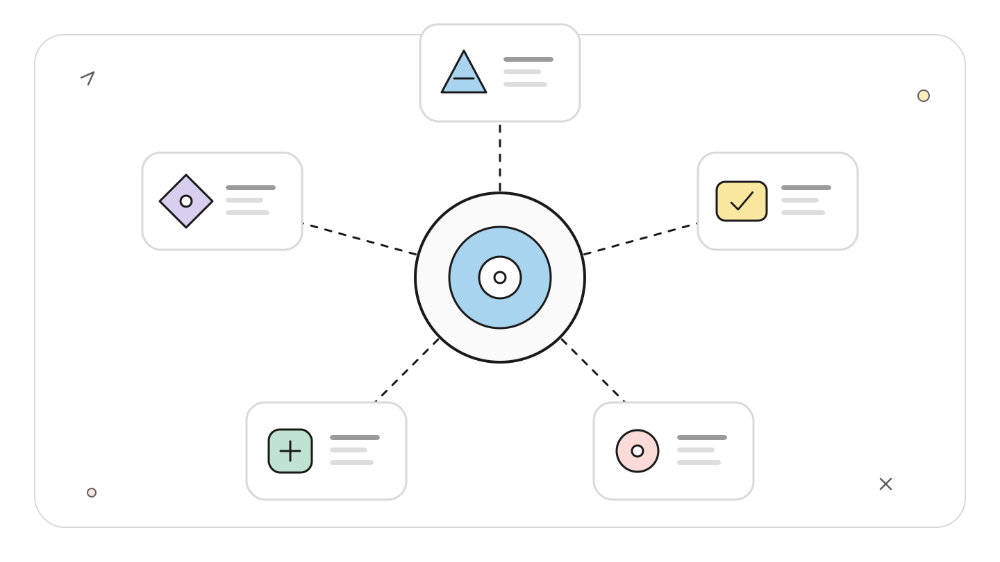
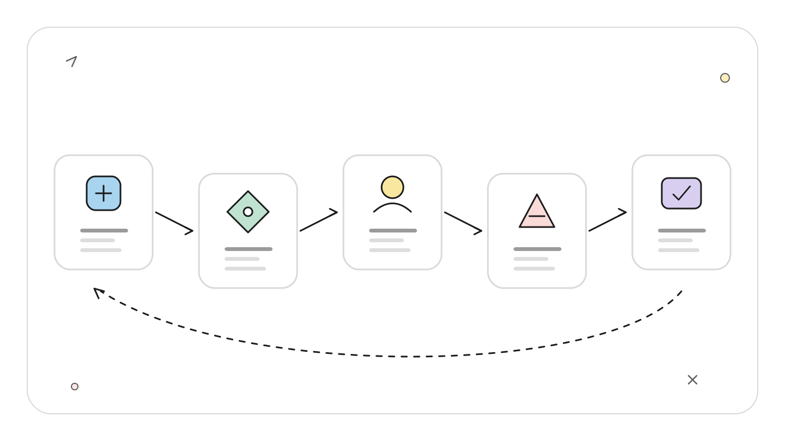
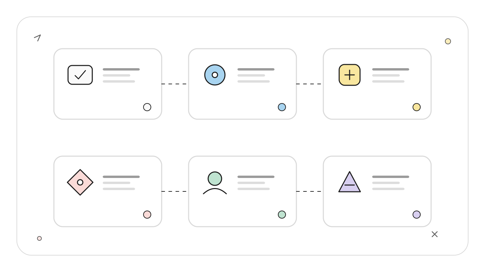
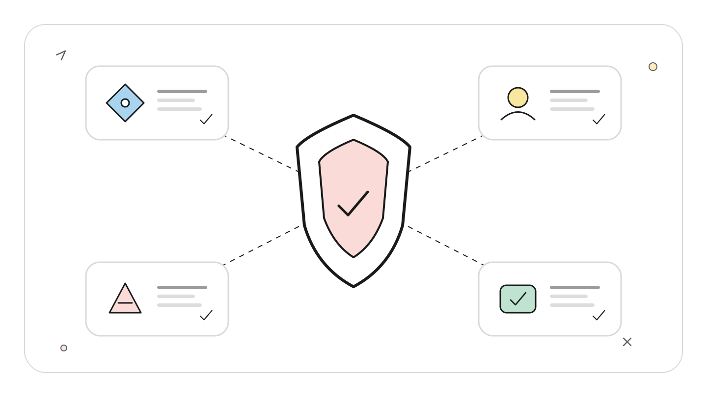
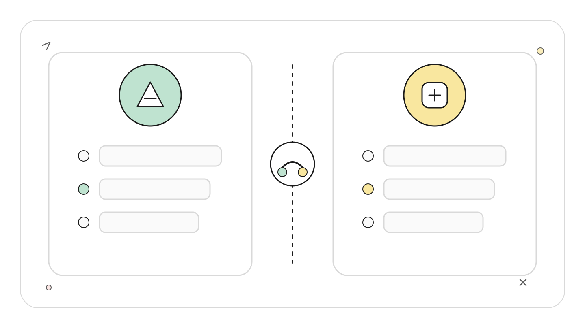

# Codex MCP Server 与 OpenAI Agents SDK：最小组合和责任边界

## TL;DR

`codex mcp-server` 把 Codex 暴露为 MCP 工具，OpenAI Agents SDK 负责调用这些工具、组织 handoff 和记录 trace。Codex 仍负责代码理解、工作目录、Thread、沙箱和命令审批；MCP 不会把这些责任转移给 SDK。

<!-- wos:illustration codex-engineering/47-mcp-server-agents-sdk/01-timeline-lifecycle-timeline.svg -->

<!-- /wos:illustration -->

最小实现是用 `MCPServerStdio` 启动 `codex mcp-server`，把它挂到一个 Agent 上，并给 Codex 工具传入受限 cwd、`workspace-write` 与明确审批策略。生产化还要处理进程生命周期、工具过滤、双层审批、超时和 Thread ID。

## 读者与验证边界

本文面向会写 Python 异步程序、正在设计多 Agent 开发工作流的中级开发者，采用架构设计视角。

资料基线：2026-07-22。包索引当日显示 `openai-agents 0.18.3`，本机 Codex 为 `0.144.5`。接口来自 OpenAI Codex MCP Server 文档、Codex 仓库 MCP 接口说明和 OpenAI Agents SDK MCP 文档。本文只检查示例语法与依赖版本，没有用真实 API key 执行模型调用，也没有声称生成过代码改动。

## 组合后的系统里有四个责任人

MCP 经常被说成“模型的 USB 接口”，这个比喻对传输层有用，对安全边界不够。把 Codex 接入 Agents SDK 后，至少有四层：

<!-- wos:illustration codex-engineering/47-mcp-server-agents-sdk/02-framework-system-framework.svg -->

<!-- /wos:illustration -->

```text
业务程序
  |
  | 任务、预算、重试、最终验收
  v
OpenAI Agents SDK
  |
  | Agent、handoff、guardrail、trace、MCP client lifecycle
  v
MCP stdio transport
  |
  | tools/list、tools/call、结构化结果
  v
codex mcp-server
  |
  | Codex Thread、代码 Agent、cwd、sandbox、approval
  v
工作区与外部工具
```

Agents SDK 决定哪个 Agent 接任务、何时调用工具、怎样交接和追踪。MCP 负责工具发现与调用封包。Codex 决定如何完成代码任务，并在自己的执行边界内读写文件、运行命令。业务程序最终判断结果能否进入仓库或发布链。

任何一层都不能替其他层背书。SDK trace 显示工具调用成功，不代表代码正确；Codex 沙箱没有报错，不代表业务允许部署；MCP schema 合法，也不代表参数安全。

## 当前公开工具面

启动命令是：

```bash
codex mcp-server
```

可以先用 MCP Inspector 查看工具：

```bash
npx @modelcontextprotocol/inspector codex mcp-server
```

官方面向 Agents SDK 的文档描述了两个工具：

- `codex`：用 prompt 和配置覆盖创建 Codex 会话。
- `codex-reply`：用 `threadId` 和新 prompt 继续原会话。

`codex` 可接收 `cwd`、`model`、`sandbox`、`approval-policy`、`developer-instructions`、`base-instructions` 和单项 config 覆盖。返回的 `structuredContent.threadId` 是后续 `codex-reply` 的身份。`conversationId` 只是兼容别名，新的集成使用 `threadId`。

Codex 仓库还记录了基于 Thread 和 Turn v2 API 的实验性 MCP 接口。实验面会变化，常规 Agents SDK 集成先使用公开的两工具模型；需要富客户端事件、Item 流和审批 UI 时，App Server 更合适。

## 可运行的最小 Python 结构

创建隔离环境并锁定依赖：

<!-- wos:illustration codex-engineering/47-mcp-server-agents-sdk/03-flowchart-operating-flow.svg -->

<!-- /wos:illustration -->

```bash
python3 -m venv .venv
source .venv/bin/activate
python -m pip install "openai-agents==0.18.3"
```

运行时要求环境中已有 `OPENAI_API_KEY`，并且 `codex` 命令可用。不要把 key 写进代码或提交到 `.env`。

保存为 `codex_agent.py`：

```python
import asyncio
import os

from agents import Agent, Runner
from agents.mcp import MCPServerStdio

async def main() -> None:
    if not os.environ.get("OPENAI_API_KEY"):
        raise RuntimeError("OPENAI_API_KEY is required")

    async with MCPServerStdio(
        name="Codex CLI",
        params={
            "command": "codex",
            "args": ["mcp-server"],
        },
        client_session_timeout_seconds=3600,
    ) as codex_server:
        coordinator = Agent(
            name="Repository coordinator",
            instructions=(
                "Use the Codex MCP tool for repository inspection. "
                "Pass the current working directory as cwd. "
                "Use sandbox read-only and approval-policy never. "
                "Ask Codex to read only and return evidence with file paths."
            ),
            mcp_servers=[codex_server],
        )

        result = await Runner.run(
            coordinator,
            "Inspect this repository and summarize its documented validation commands.",
        )
        print(result.final_output)

if __name__ == "__main__":
    asyncio.run(main())
```

检查和运行：

```bash
python -m py_compile codex_agent.py
python codex_agent.py
```

示例要求 Codex 使用 `read-only`，并把审批设为 `never`。这种组合的含义是：Codex 可以读取允许范围，写入或其他越界动作不会弹窗，会直接被拒绝。示例没有固定输出，结果取决于仓库内容和模型。

模型仍可能不调用 MCP 工具，或参数与指令不一致。生产代码应读取 trace 和 MCP 调用事件，验证实际工具、cwd、sandbox 与审批策略，而不是只看最终自然语言。

## Thread 连续性要由调用方保存

第一次调用 `codex` 后，把响应中的 `structuredContent.threadId` 与业务任务 ID 关联保存。后续细化同一任务时调用 `codex-reply`。如果每一步都重新调用 `codex`，Codex 会创建多个孤立 Thread，前一轮代码发现和约束不会自动进入下一轮。

<!-- wos:illustration codex-engineering/47-mcp-server-agents-sdk/04-infographic-concept-map.svg -->

<!-- /wos:illustration -->

不要把 Thread ID 当授权凭据。它是会话身份，不应该出现在公开日志或跨租户索引。服务端仍要按租户、仓库和任务检查 Thread 的归属。

连续会话也有成本。旧 Thread 可能积累失效假设和大段工具输出。阶段目标已经变化，或工作区切到另一分支时，创建新 Thread 并显式传入经过核验的上下文通常更稳。

## 双层审批怎样避免互相打架

Agents SDK 的 MCP 支持工具过滤和审批。Codex 工具内部又有 `approval-policy`、沙箱、规则与可能的 Auto-review。它们控制不同边界：

<!-- wos:illustration codex-engineering/47-mcp-server-agents-sdk/05-infographic-verification-guardrails.svg -->

<!-- /wos:illustration -->

1. SDK 层决定模型能否调用 `codex` 或 `codex-reply`，以及调用前是否需要业务审批。
2. Codex 层决定代码 Agent 的命令、文件写入和网络越界能否执行。

SDK 允许调用 Codex，不代表 Codex 内部 shell 可以全权运行。Codex 内部设为 `danger-full-access`，也不会让 SDK 自动批准第一次 MCP 工具调用。

一个保守的服务配置是：SDK allowlist 只暴露 `codex` 与 `codex-reply`；Codex 使用明确 cwd、`workspace-write` 和 `on-request`；无人在场的 worker 使用 `never`，让越界失败并回到业务队列。不要在没有审批 UI 的后台任务里使用 `on-request`，它可能一直等待。

多个 MCP Server 可能暴露同名工具。Agents SDK 可开启 server-prefixed tool names，把本地工具显示为带服务器前缀的确定名称。工具集合大时还应使用 filter，只给当前 Agent 暴露需要的函数，减少误调用和提示上下文。

## 进程、超时和缓存

`MCPServerStdio` 会启动本地子进程，并在异步上下文退出时关闭。把它创建在每个短函数内部会反复启动 Codex，增加延迟并丢失进程级缓存。服务程序应由一个生命周期管理器持有连接，在 shutdown 中显式关闭。

工具发现通常会调用 `list_tools()`。Agents SDK 支持 `cache_tools_list`，但只有工具集合稳定时才开启。Codex 升级或 feature 切换后，旧缓存可能隐藏新增或删除的工具，需要主动失效。

超时要分层记录。MCP client timeout、Agent run timeout、Codex 内部命令 timeout 和外部 CI timeout不是同一个错误。把它们都报成“Agent 失败”会让重试策略失真。至少保留层级、Thread ID、工具名和最后已确认状态。

## 什么时候不用这套组合

只有一个进程调用 Codex 完成一次任务时，Codex SDK 更直接。它少一层 MCP 工具选择，也更容易拿到结构化事件。

要开发 IDE、远程终端或审批界面时，App Server 提供完整 Thread、Turn、Item 与双向审批协议。把 MCP 两工具接口扩成富 UI 后端，会自行重建 App Server 已有的大量能力。

Agents SDK 的价值出现在编排：多个角色、handoff、guardrail、trace 或 Codex 与其他工具共同参与。只有一个 Agent 加一个 Codex 工具，且没有复用计划时，MCP 层可能只是额外进程。

## 权衡与局限

MCP 让 Codex 能接入不同 Agent 框架，代价是错误边界变多。一次失败可能来自 SDK 模型、MCP transport、Codex 认证、Thread 状态、沙箱或工作区命令。

<!-- wos:illustration codex-engineering/47-mcp-server-agents-sdk/06-comparison-boundary-comparison.svg -->

<!-- /wos:illustration -->

Agents SDK trace 提供编排可观测性，但不会自动捕获所有 Codex 内部细节。需要更细证据时保存 Codex structured content 和必要事件，同时控制日志中的源码、命令输出与密钥。

官方文档中的多 Agent 游戏示例展示了 handoff 和 Codex 写文件路径，它不是生产权限模板。真实系统要缩小 cwd、锁定依赖、限制工具，并把生成 diff 交给测试和人类审查。

## 延伸阅读

- [OpenAI：Use Codex with the Agents SDK](https://learn.chatgpt.com/docs/mcp-server)
- [OpenAI Agents SDK Python：MCP](https://openai.github.io/openai-agents-python/mcp/)
- [OpenAI Agents SDK JavaScript：MCP](https://openai.github.io/openai-agents-js/guides/mcp/)
- [OpenAI Codex：MCP interface](https://github.com/openai/codex/blob/main/codex-rs/docs/codex_mcp_interface.md)
- [OpenAI Agents SDK Python repository](https://github.com/openai/openai-agents-python)
