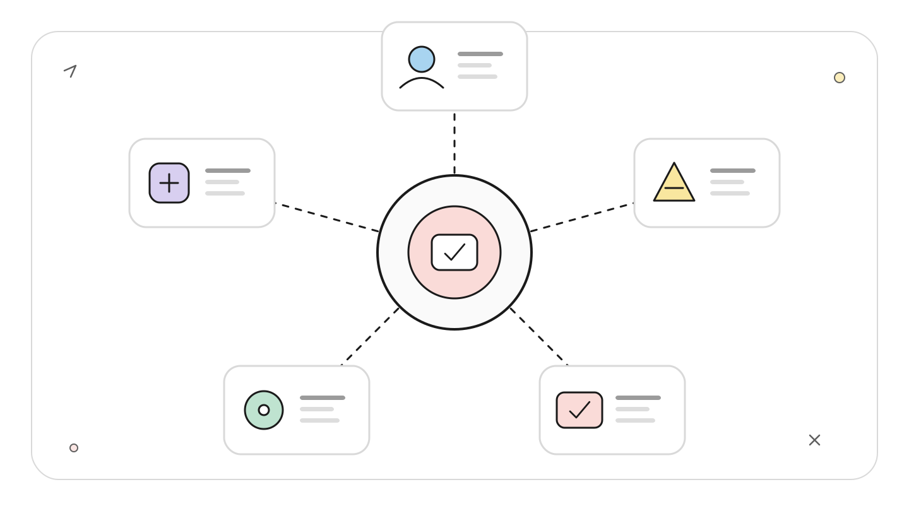
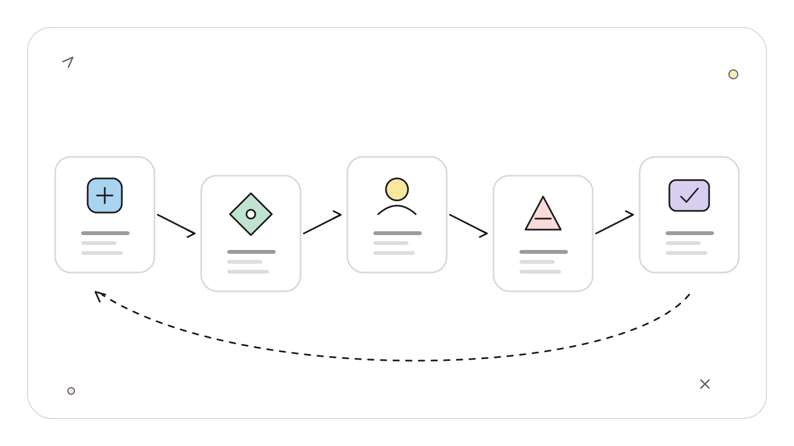
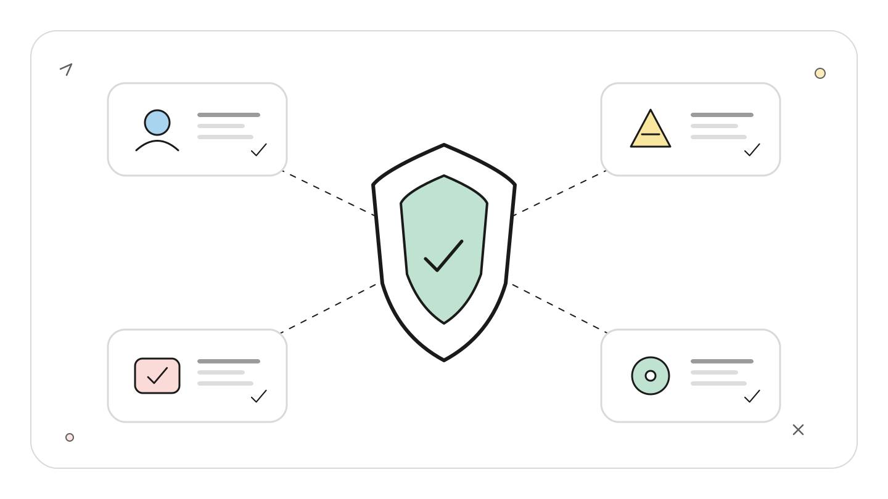
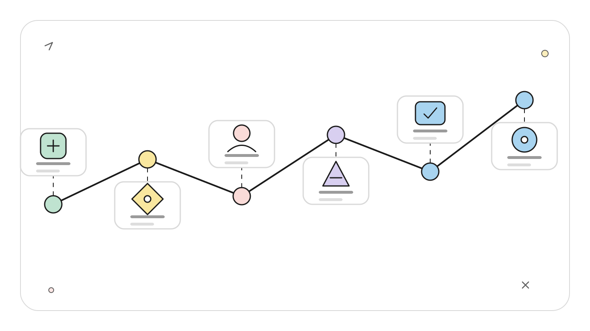
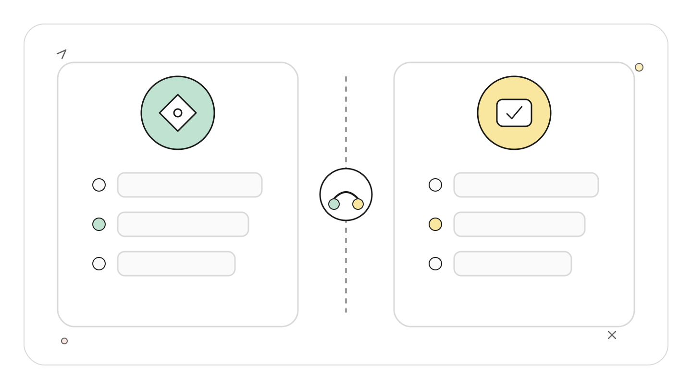
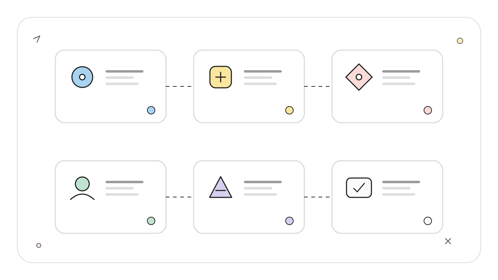

# Codex Auto-review 与审批链：自动审查到人类合并的责任分层

> 资料基线：2026-07-22。本文依据 OpenAI 官方文档与 Codex 官方仓库整理。文中的配置与命令未在真实生产仓库中执行，读者应先在隔离仓库验证策略效果。

## TL;DR

Auto-review 改变的是“谁来处理权限升级请求”，不会扩大沙箱权限，也不会替代代码审查、CI 或最终合并责任。可靠的审批链至少要拆成五层：沙箱限制动作范围，审批策略决定何时申请，自动审查器判断单次请求，`/review` 检查代码风险，维护者决定是否合并和发布。

<!-- wos:illustration codex-engineering/48-auto-review-approval-chain/01-framework-system-framework.svg -->

<!-- /wos:illustration -->

## 读者定位

本文面向已经使用 Codex 修改代码，希望减少频繁确认，又不愿把高风险操作交给模型自行决定的中级开发者。重点是审批链的控制面，不讨论模型评测或通用代码审查方法论。

## 先纠正一个容易混淆的判断

假设 Codex 在 `workspace-write` 沙箱中准备执行一个需要联网的命令。开启 Auto-review 后，流程不是“模型获得网络权限”，而是：

<!-- wos:illustration codex-engineering/48-auto-review-approval-chain/02-flowchart-operating-flow.svg -->

<!-- /wos:illustration -->

```text
动作被沙箱或策略拦住
        |
        v
生成权限升级请求
        |
        v
Auto-review 审查请求与紧凑上下文
        |
        +--> 允许：仍按获批的精确范围执行
        |
        +--> 拒绝：动作不执行，主代理收到更强约束
```

OpenAI 将 Auto-review 定义为审批者替换。它只在 `on-request` 或 granular approval policy 下工作。`never` 表示不允许发起审批，不代表“全部自动通过”。沙箱依旧是技术边界，审批者只是决定某次越界请求能否通过。

## 一条完整审批链包含什么

| 层级 | 回答的问题 | 典型控制点 | 不能替代什么 |
| --- | --- | --- | --- |
| 沙箱 | 进程当前能做什么 | `sandbox_mode`、可写根、网络开关 | 业务风险判断 |
| 审批策略 | 哪些动作必须申请 | `approval_policy` | 对申请内容作判断 |
| Auto-review | 这一次申请是否合理 | `approvals_reviewer`、审查策略 | 完整 diff 审查 |
| 代码审查 | 改动是否正确、安全、可维护 | `/review`、CI、静态检查 | 发布授权 |
| 人类责任 | 是否接受残余风险 | 合并、发布、回滚决策 | 无法转移的组织责任 |

<!-- wos:illustration codex-engineering/48-auto-review-approval-chain/03-infographic-verification-guardrails.svg -->

<!-- /wos:illustration -->

自动化的价值在于压缩低风险请求的等待时间。最终责任没有随自动化转移。

## 最小配置与现场验证

下面的用户配置启用可写工作区、按需审批和自动审查：

<!-- wos:illustration codex-engineering/48-auto-review-approval-chain/04-timeline-lifecycle-timeline.svg -->

<!-- /wos:illustration -->

```toml
approval_policy = "on-request"
approvals_reviewer = "auto_review"
sandbox_mode = "workspace-write"
```

也可以只为一次会话启用：

```sh
codex --sandbox workspace-write \
  --ask-for-approval on-request \
  -c approvals_reviewer=auto_review
```

进入 TUI 后，可用这些命令核对当前状态和审批历史：

```text
/status
/approve
/review
```

`/approve` 最多显示最近 10 次 Auto-review 拒绝。选择某一项后，Codex 只会按原参数重试一次，不会把该选择升级成永久放行规则。若配置没有生效，应先看 `/status`，再检查仓库级 `.codex/config.toml`、用户配置和企业托管策略的覆盖关系。

## Auto-review 实际会看到什么

自动审查器接收的是紧凑会话记录和精确的权限请求，例如待执行命令、目标目录或网络访问原因。它看不到主代理的隐藏推理。审查决策应建立在可见证据上，而不是假设主代理“心里知道风险”。

官方策略关注的高风险信号包括：

- 凭据探测、敏感数据外传或可疑网络请求。
- 广泛、持久地削弱安全边界。
- 破坏性命令、不可恢复的数据修改。
- 与用户目标无关的权限扩张。

连续 3 次拒绝，或最近 50 次审批中累计 10 次拒绝，会触发熔断并把控制交还给用户。这个机制用于阻止代理反复改写理由尝试绕过拒绝，不是风险评分器。

Auto-review 的结果具有模型非确定性。相同请求在上下文变化后可能得到不同结论，因此不能把一次获批写进安全证明。

## `/review` 与 Auto-review 不是一回事

`/review` 会启动一个专门的审查代理读取 diff，并报告正确性、安全性和可维护性问题。审查过程本身不修改工作区。用户可以选择当前工作树、某个提交或与基线分支的差异。

<!-- wos:illustration codex-engineering/48-auto-review-approval-chain/05-comparison-boundary-comparison.svg -->

<!-- /wos:illustration -->

当主代理根据审查结果修复代码时，新动作仍受原沙箱和审批策略约束。这形成了两个相互独立的闭环：

```text
权限闭环：请求动作 -> 审批 -> 执行或拒绝
质量闭环：生成改动 -> /review -> 修复 -> 测试
```

把两者混成一个步骤会产生盲区。一个命令获得执行许可，不代表生成的代码正确；一份 diff 没有高优先级缺陷，也不代表可以直接访问生产系统。

## 风险分级怎样落到审批链

可以按动作后果，而不是命令名称分级：

<!-- wos:illustration codex-engineering/48-auto-review-approval-chain/06-infographic-concept-map.svg -->

<!-- /wos:illustration -->

1. 可逆且局限在工作区，例如读取文件、运行本地测试。让沙箱直接处理，保留日志即可。
2. 需要额外能力但后果可控，例如下载公开依赖。交给 Auto-review，并限制域名、目录和命令参数。
3. 会改变远端共享状态，例如推送分支、创建发布、修改云资源。即使自动审查认为理由充分，也应保留明确的人类确认。
4. 可能导致数据丢失、凭据泄露或权限体系变化。停止自动链路，要求人工核对目标、备份和恢复路径。

分级对象应是“动作加目标加上下文”。`git push` 到个人临时分支与强推受保护分支不是同一风险；只按可执行文件名做白名单会丢掉这个差异。

## App 与 Computer Use 的例外

官方文档说明，Computer Use 场景中的高影响 App 操作会直接向用户请求确认，不经过 Auto-review。原因是这类操作往往改变外部系统状态，且界面上下文不一定能被紧凑审批记录完整表达。

自定义客户端若通过 Codex App Server 接入，也必须实现服务端发起的审批请求。客户端忽略请求、只消费通知，会让会话在需要批准时停住。生产客户端还应记录请求参数、决定者、时间与结果，便于事后审计。

## 权衡与局限

- Auto-review 能减少低风险等待，但会增加模型调用、延迟和非确定性。
- 自定义审查策略可以贴合组织规则，也可能因遗漏默认条款而放宽边界。官方建议从完整默认策略复制后逐步修改。
- 熔断能限制重复请求，不能识别所有提示注入或供应链攻击。
- `/review` 能发现 diff 中的问题，无法证明需求正确，也无法替代运行时观测和回滚准备。
- CI 通过只说明已配置检查通过。维护者仍要确认测试覆盖、部署范围和外部副作用。

一条可接受的自动化审批链，不是“尽量少打断人”，而是把低风险判断自动化，把不可逆决策留在明确的人类责任点。

## 官方延伸阅读

- [Auto-review](https://learn.chatgpt.com/docs/sandboxing/auto-review)
- [Agent approvals and security](https://learn.chatgpt.com/docs/agent-approvals-security)
- [Code review](https://learn.chatgpt.com/docs/code-review)
- [Codex Auto-review 默认策略](https://github.com/openai/codex/blob/main/codex-rs/core/src/guardian/policy.md)
- [Codex App Server 协议](https://github.com/openai/codex/blob/main/codex-rs/app-server/README.md)
