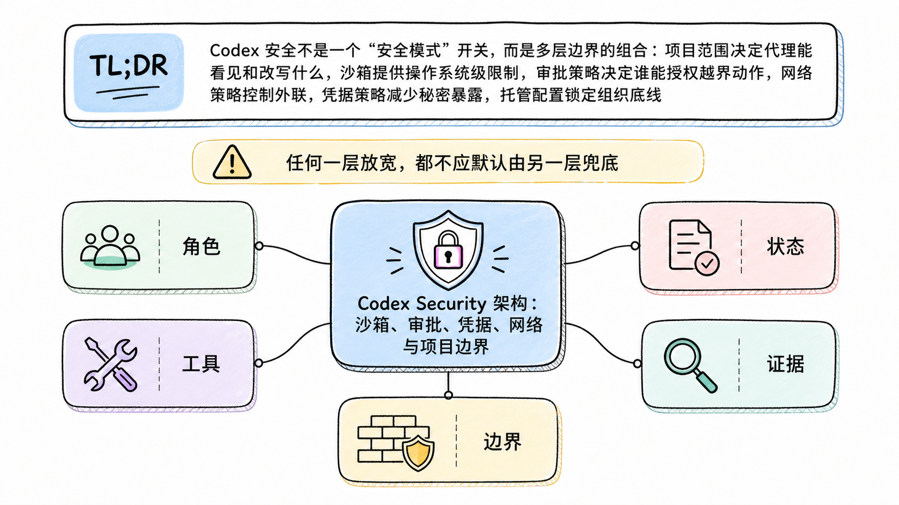
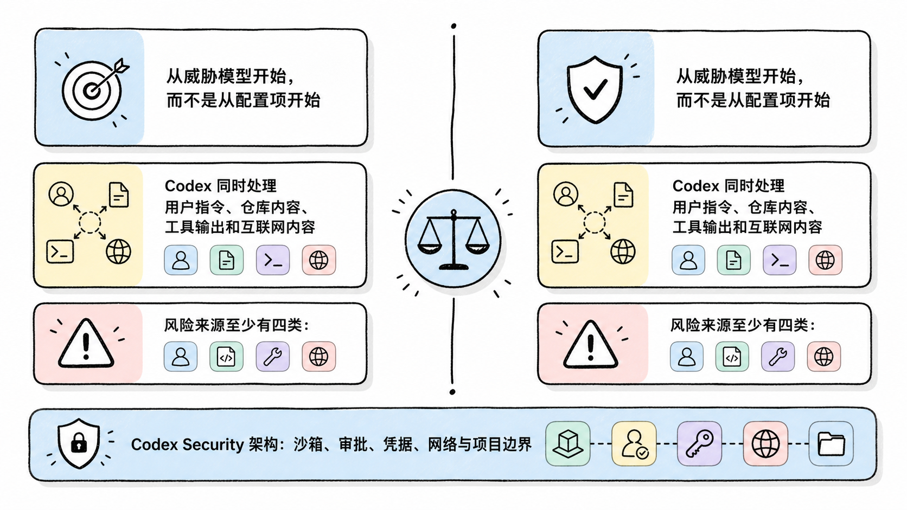
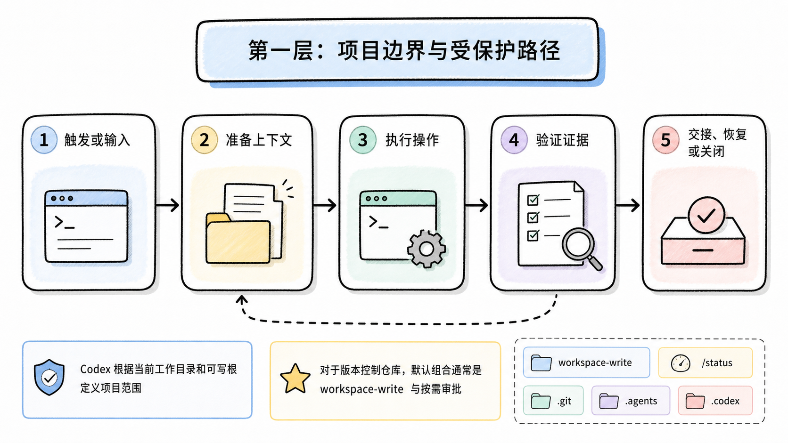
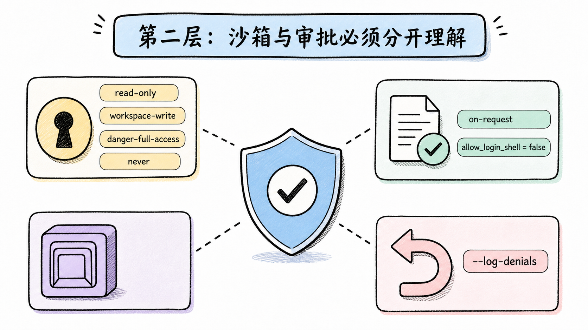
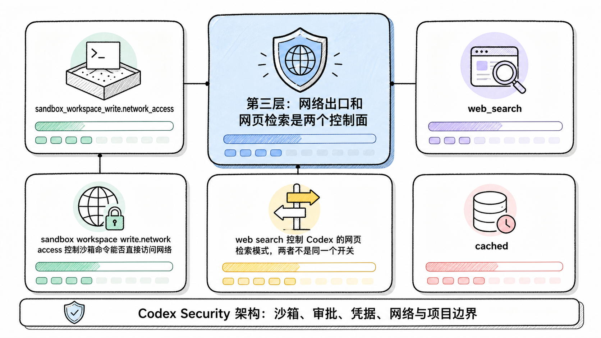
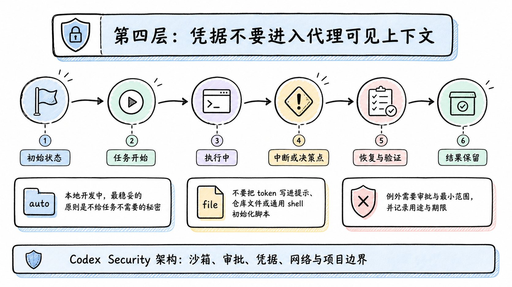

# Codex Security 架构：沙箱、审批、凭据、网络与项目边界

> 资料基线：2026-07-22。本文以 OpenAI 官方安全文档、配置文档和 Codex 官方仓库为依据。配置示例未连接真实企业环境，也未进行攻击性复现，只说明官方公开的控制面与验证方法。

## TL;DR

Codex 安全不是一个“安全模式”开关，而是多层边界的组合：项目范围决定代理能看见和改写什么，沙箱提供操作系统级限制，审批策略决定谁能授权越界动作，网络策略控制外联，凭据策略减少秘密暴露，托管配置锁定组织底线。任何一层放宽，都不应默认由另一层兜底。

<!-- wos:illustration codex-engineering/49-codex-security/01-framework-system-framework.png -->

<!-- /wos:illustration -->

## 这篇文章适合谁

如果你已经让 Codex 在本地仓库运行命令、安装依赖或连接 MCP 服务，并开始考虑团队推广，这篇文章提供一套可检查的安全架构。读者需要理解基本的文件权限、环境变量和 Git 工作区概念。

## 从威胁模型开始，而不是从配置项开始

Codex 同时处理用户指令、仓库内容、工具输出和互联网内容。风险来源至少有四类：

<!-- wos:illustration codex-engineering/49-codex-security/02-comparison-boundary-comparison.png -->

<!-- /wos:illustration -->

- 用户或代理误判，执行了范围过大的命令。
- 仓库中的恶意指令、脚本或依赖触发供应链风险。
- 网页、issue、文档中的提示注入诱导外联或泄密。
- MCP 服务、App 或自定义 Hook 把数据发送到新的信任域。

这意味着安全边界要围绕能力流动来设计：

```text
输入内容
   |
   v
项目边界 -> 沙箱能力 -> 审批决定 -> 网络出口
   |             |           |          |
   +-------------+-----------+----------+
                    |
                    v
              凭据与审计记录
```

只限制文件写入，不能阻止已经可见的秘密被网络发送。只关闭网络，也不能阻止误删工作区文件。每一层解决的是不同问题。

## 第一层：项目边界与受保护路径

Codex 根据当前工作目录和可写根定义项目范围。对于版本控制仓库，默认组合通常是 `workspace-write` 与按需审批；非版本控制目录会采用更保守的只读策略。实际值可能被用户配置、仓库配置或企业托管策略覆盖，应以 `/status` 为准。

<!-- wos:illustration codex-engineering/49-codex-security/03-flowchart-operating-flow.png -->

<!-- /wos:illustration -->

即使在可写工作区中，Codex 仍保护仓库的 `.git` 元数据，以及 `.agents`、`.codex` 等控制目录。Git worktree 的 `.git` 可能是一个指向主仓库的文件，Codex 会解析实际 gitdir，而不是只保护表面路径。这个细节避免工作树获得间接改写仓库控制数据的能力。

先用保守会话确认项目识别结果：

```sh
cd /path/to/repository
codex --sandbox read-only --ask-for-approval on-request
```

进入 TUI 后运行：

```text
/status
```

要核对的是当前目录、可写根、沙箱模式、审批策略和网络状态。目录识别错误时，应先退出并从正确的仓库根重新启动，而不是临时放宽为全盘写入。

## 第二层：沙箱与审批必须分开理解

沙箱回答“进程在操作系统层面能做什么”，审批策略回答“遇到受限动作时由谁决定”。常见组合可以这样理解：

<!-- wos:illustration codex-engineering/49-codex-security/04-infographic-verification-guardrails.png -->

<!-- /wos:illustration -->

| 沙箱模式 | 当前能力 | 合适场景 | 主要风险 |
| --- | --- | --- | --- |
| `read-only` | 读取允许范围，不能改写工作区 | 分析、审查、不可信仓库初检 | 无法完成需要落盘的任务 |
| `workspace-write` | 可修改工作区，默认无网络 | 日常开发和测试 | 仓库内文件仍可能被误改 |
| `danger-full-access` | 接近宿主进程权限 | 已隔离容器或明确受控环境 | 本机边界显著缩小 |

审批策略中的 `never` 是“禁止请求额外权限”，不是“无需确认即可越权”。`on-request` 允许代理在受限动作前提出申请。审批者可以是用户或 Auto-review，但获批范围仍应尽量精确。

一个适合本地开发的基础配置是：

```toml
approval_policy = "on-request"
approvals_reviewer = "user"
sandbox_mode = "workspace-write"
allow_login_shell = false
web_search = "cached"

[sandbox_workspace_write]
network_access = false
```

`allow_login_shell = false` 可以减少登录 shell 自动加载用户初始化脚本和秘密环境变量的机会。它不是凭据隔离方案，仍要检查任务实际需要的环境变量。

macOS 和 Linux 可用 Codex 的沙箱调试入口验证简单命令是否按预期运行。`--log-denials` 是 macOS 专用诊断选项：

```sh
codex sandbox --log-denials /usr/bin/true  # macOS
codex sandbox /usr/bin/true                # Linux
```

macOS 使用 Seatbelt。Linux 使用 bubblewrap 与 seccomp，若用户命名空间不可用会退回 Landlock 与 seccomp。Windows 可使用原生 sandbox，或把工作区放在 WSL2 中获得 Linux 沙箱语义。上面的命令用于检查机制，不等同于完成安全测试。

## 第三层：网络出口和网页检索是两个控制面

`sandbox_workspace_write.network_access` 控制沙箱命令能否直接访问网络。`web_search` 控制 Codex 的网页检索模式，两者不是同一个开关。把 `web_search` 设为 `cached` 可以减少直接访问任意网页的暴露面，但搜索结果仍是不可信输入。

<!-- wos:illustration codex-engineering/49-codex-security/05-infographic-concept-map.png -->

<!-- /wos:illustration -->

需要联网安装依赖时，可以通过实验性的网络代理限制域名。该功能截至资料基线默认关闭，配置应先在目标客户端版本上验证：

```toml
sandbox_mode = "workspace-write"

[sandbox_workspace_write]
network_access = true

[features.network_proxy]
enabled = true

[features.network_proxy.domains]
"registry.npmjs.org" = "allow"
"pypi.org" = "allow"
"files.pythonhosted.org" = "allow"
```

官方文档给出两个容易配置错的边界：网络关闭时，代理域名列表不会让网络自动可用；网络开启而代理未启用时，命令可能直接外联，域名列表不会提供限制。团队策略应同时约束网络能力和代理规则。

允许访问依赖源也不代表依赖可信。锁文件、校验和、来源审查和最小版本升级仍是供应链控制的一部分。

## 第四层：凭据不要进入代理可见上下文

本地开发中，最稳妥的原则是不给任务不需要的秘密。不要把 token 写进提示、仓库文件或通用 shell 初始化脚本。MCP OAuth 凭据可以配置为系统 keyring 存储：

<!-- wos:illustration codex-engineering/49-codex-security/06-timeline-lifecycle-timeline.png -->

<!-- /wos:illustration -->

```toml
mcp_oauth_credentials_store = "keyring"
```

官方配置还提供 `auto` 和 `file`。`file` 会把凭据落到 Codex 主目录中的凭据文件，适合性取决于设备加密、文件权限和备份策略；高敏感环境应优先使用系统密钥环或短生命周期凭据。

Codex Cloud 的秘密只在 setup 阶段提供，进入 agent 阶段前会被移除。这个隔离减少模型直接读取部署秘密的机会，但 setup 脚本生成的文件、缓存和日志仍可能成为旁路，应在 setup 结束前清理。

如果任务必须调用生产系统，使用范围最小、短期有效、可撤销的凭据，并让生产写操作保留独立的人类确认。不要用一个长期管理员 token 同时覆盖代码读取、CI 和发布。

## 第五层：企业托管策略锁住底线

个人配置用于表达偏好，企业 `requirements.toml` 用于声明不可突破的约束。托管要求可以限制允许的沙箱模式、审批策略、MCP 服务、Skills、Plugins、Hooks 和网络规则。托管默认值与强制要求也应区分：默认值可以被项目覆盖，要求不能。

Codex 0.138.0 及以上版本支持命名 permission profiles，管理员可以发布受控能力包，并用文件规则拒绝敏感路径。落地时应验证所有开发者实际运行的客户端版本，因为旧版本可能无法识别新策略键。

官方还提供 `experimental_network` 托管配置。它属于实验性能力，不应在未验证客户端兼容性、代理日志和故障回退前作为唯一网络边界。

组织级控制至少要能回答这些问题：

1. 哪些仓库允许写入，哪些只能审查？
2. 哪些域名和 MCP 服务属于受信任出口？
3. 谁能批准推送、发布、数据库写入和权限变更？
4. 审批、命令、网络和外部工具调用保留多久？
5. 凭据泄露或误操作后，如何吊销、回滚和复盘？

答不出这些问题时，先缩小能力范围比增加更多自动审查规则更有效。

## 一次最小安全验收

上线团队配置前，可以在无秘密的隔离仓库做四项验证：

```text
1. 尝试改写工作区外文件，确认被拒绝或触发审批。
2. 尝试访问未允许域名，确认网络策略生效。
3. 检查代理进程环境与日志，确认没有无关凭据。
4. 模拟一次审批拒绝，确认动作没有执行且记录可追溯。
```

这只是配置验收，不是渗透测试。本文没有亲自复现不同操作系统内核、企业托管分发或恶意 MCP 服务下的绕过路径，相关结论限于官方公开机制。

## 权衡与局限

- 更严格的只读和网络限制会增加审批频率，也可能阻断依赖安装、测试和调试。
- `workspace-write` 把损害面限制在项目附近，却不能保证仓库内每个文件都可恢复。
- 系统沙箱降低进程能力，不能判断业务语义，也不能识别所有合法命令中的恶意参数。
- 域名白名单控制目的地，不验证远端内容本身，仍需防范依赖投毒和提示注入。
- 托管策略减少个人误配，无法替代版本治理、设备安全、最小权限账号和事件响应。

安全配置的目标不是消除所有风险，而是让越权动作难以发生、不可逆动作必须显式授权、事故发生后有证据和恢复路径。

## 官方延伸阅读

- [Agent approvals and security](https://learn.chatgpt.com/docs/agent-approvals-security)
- [Codex sandboxing](https://learn.chatgpt.com/docs/sandboxing)
- [Managed configuration](https://learn.chatgpt.com/docs/enterprise/managed-configuration)
- [Codex configuration reference](https://learn.chatgpt.com/docs/config-file/config-reference)
- [Codex Security Policy](https://github.com/openai/codex/security)
