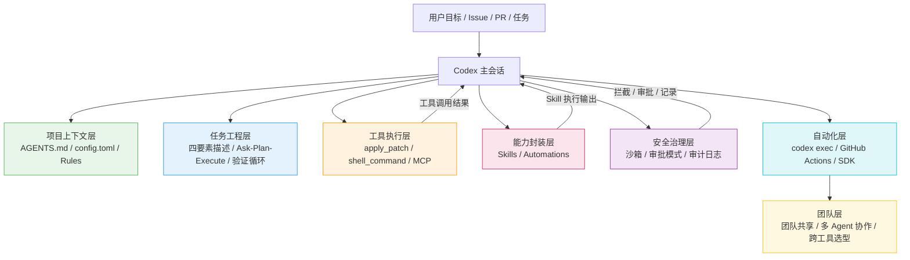

# OpenAI Codex 工程化实战系列

> 工程实践参考，不是教程。
> 35 篇文章覆盖从安装配置到团队治理的完整路径。

本系列面向在真实项目中使用 OpenAI Codex 的工程师和技术负责人。目标读者已经具备基本的 Codex 使用经验，需要解决的核心问题是：如何把一次性的 prompt 交互变成可复用、可验证、可治理的工程系统。

---

## 系列定位

Codex 工程化的核心命题不是"让 AI 更会写代码"，而是"让 AI 在真实代码库里受控地工作"。这涉及三组相互关联的工程问题：

**指令工程**——Codex 的能力上限由模型决定，但实际表现取决于你给的指令质量。一条好指令包含目标、上下文、约束和完成条件四个要素。指令写得不好，模型再强也会偏航；写得太多，又会挤占上下文窗口。工程化的做法是通过 AGENTS.md 沉淀常驻规则，通过 Skills 封装可复用流程，通过 Plan 模式先规划再执行。

**环境配置**——Codex 运行在本地终端、IDE、Cloud 和 App 四种形态里，每种形态有不同的安全模型、网络策略和执行边界。不理解的配置就是不受控的风险。工程化要求掌握 config.toml 配置体系、沙箱隔离机制、Profile 预设切换和 Rules 命令策略，让 Codex 在明确的安全边界内高效工作。

**安全治理**——一个能读代码、改文件、跑命令、连网络的 agent，如果缺少权限边界和审计机制，就是安全事故的隐患。Codex 提供了内核级沙箱、三级审批模式、命令策略引擎和审计日志四层安全防线。工程化要求从 read-only 开始逐步放开权限，在高风险操作上加拦截，在所有行为上留审计记录。

本系列按"单人可用 → 任务工程化 → 工具精通 → 配置掌控 → 外部连接 → 能力封装 → API 深度控制 → CI/CD 自动化 → 团队治理"的顺序组织，每篇文章聚焦一个具体机制，包含问题分析、核心机制解释、配置示例和权衡讨论。文章之间有递进关系，但也可按需独立查阅。

---

## 系列目录

### 开篇：先建立正确认知

建立从"工具使用"到"系统设计"的视角转换。Codex 工程化的第一步不是学功能，而是理解自己到底要解决什么问题。

| # | 标题 | 核心议题 |
|---|------|----------|
| 00 | [Codex 不是代码补全，而是工程代理工作台](./00-codex-as-engineering-workbench.md) | CLI/IDE/Cloud/App 四形态定位；Agent Loop 架构；从"更强的 ChatGPT"到"受控执行系统" |
| 01 | [你真正要解决的是指令工程、环境配置和安全治理](./01-instruction-environment-security.md) | 工程化三组核心问题的识别和拆解 |

### 第一模块：单人可用

让一个工程师在单个真实仓库里高效使用 Codex。核心是把项目知识写成 AGENTS.md，建立基本的审批意识，掌握常用工作流的指令模板。

| # | 标题 | 核心议题 |
|---|------|----------|
| 02 | [安装、认证和审批模式：从第一次运行到安全基线](./02-setup-auth-approval-modes.md) | 安装方式、ChatGPT 登录 vs API Key、三种审批模式选择 |
| 03 | [AGENTS.md：把项目知识写成机器可消费的上下文](./03-agents-md-project-context.md) | AGENTS.md 模板结构；四要素写法；"内容目录"而非"百科全书"原则 |
| 04 | [AGENTS.md 分层机制：全局、仓库和子目录的上下文继承](./04-agents-md-layered-inheritance.md) | 五级加载顺序、override 机制、fallback 文件名和大小限制 |
| 05 | [指令工程核心原则：行动优先、批量读取和正确性导向](./05-prompt-engineering-core.md) | 四要素任务描述法、先搜索后新增、正确性优先于速度 |
| 06 | [常用工作流模板：理解代码、重构迁移、补测试和性能优化](./06-common-workflow-templates.md) | 六类基础任务的 prompt 模板和验证方法 |

### 第二模块：任务工程化

当任务从"一行描述"变成"一个工程需求"，需要结构化的任务描述、渐进的执行策略和闭环的验证机制。

| # | 标题 | 核心议题 |
|---|------|----------|
| 07 | [任务结构化：目标、上下文、约束和完成条件四要素](./07-task-structuring-four-elements.md) | GitHub Issue 式任务描述；Done-when 验收标准；范围与非范围声明 |
| 08 | [Ask 与 Plan 模式：从探索到执行的渐进策略](./08-ask-plan-progressive-strategy.md) | Ask 模式先调研、Plan 模式先规划、执行模式最后动手的阶梯 |
| 09 | [验证循环：从任务定义到结果确认的闭环](./09-verification-loop.md) | 代码生成后的自动验证链：lint → typecheck → test → review |
| 10 | [Best-of-N 与任务队列：多试选优和批量工作流](./10-best-of-n-task-queue.md) | 让模型多试几次选最佳；任务队列作为 AI 可消费的工作流 |

### 第三模块：工具与执行机制

Codex 的工具体系决定了它能做什么、不能做什么。理解每个工具的格式、限制和最佳用法，是从"能用"到"用好"的关键。

| # | 标题 | 核心议题 |
|---|------|----------|
| 11 | [Codex 工具体系总览：apply_patch、shell_command 和并行调用](./11-tool-system-overview.md) | 内置工具清单、Token 成本特征、一次典型任务的调用链分析 |
| 12 | [apply_patch 深度解析：diff 格式、CFG 语法和常见失败](./12-apply-patch-deep-dive.md) | 模型训练的编辑格式、CFG 文法规则、上下文行数与匹配失败排查 |
| 13 | [shell_command 与工具响应截断：执行模式和上下文管理](./13-shell-command-response-truncation.md) | 字符串 vs 数组模式、10k token 截断策略、头部尾部保留中间压缩 |
| 14 | [并行工具调用与 Metaprompting：提升效率和自我改进](./14-parallel-calls-metaprompting.md) | parallel_tool_calls 批量操作；让模型审视和改进自己的指令 |

### 第四模块：配置系统

Codex 的行为由配置驱动。掌握 config.toml、沙箱、Profile 和 Rules 四大配置面，才能精确控制 Codex 的安全边界和执行策略。

| # | 标题 | 核心议题 |
|---|------|----------|
| 15 | [config.toml：Codex 的项目级配置中心](./15-config-toml.md) | 分层配置加载顺序、已知配置键、团队共享配置和 admin 约束 |
| 16 | [沙箱机制：内核级隔离与三种信任模式](./16-sandbox-kernel-isolation.md) | macOS Seatbelt / Linux Landlock+seccomp；read-only / workspace-write / full-access |
| 17 | [Profile 配置与 Rules 系统：命名预设和命令策略](./17-profile-rules-system.md) | --profile 切换预设；Starlark 语言的命令匹配规则引擎 |
| 18 | [Web Search 与网络控制：搜索模式和安全边界](./18-websearch-network-control.md) | cached / live / disabled 三种模式；网络访问白名单和 localhost 控制 |

### 第五模块：连接外部世界

Codex 默认只能操作本地文件和命令。MCP 让它安全地连接 GitHub、文档系统、设计工具等外部系统。MCP 提供能力，Skill 教流程，两者组合才能让工具按团队 SOP 被正确使用。

| # | 标题 | 核心议题 |
|---|------|----------|
| 19 | [MCP 心智模型：外部系统是工具接口不是复制粘贴](./19-mcp-mental-model.md) | MCP 的定位和边界；config.toml 中的 MCP 配置方式 |
| 20 | [GitHub MCP 与文档 MCP：Issue、PR 和实时文档检索](./20-github-docs-mcp.md) | GitHub MCP 配置、Context7 文档检索、Figma 设计系统集成 |
| 21 | [MCP + Skills：让工具按团队 SOP 被正确使用](./21-mcp-plus-skills.md) | 工具能力与流程知识的组合策略；MCP 工具的 Skill 封装 |
| 22 | [MCP 风险：Token、越权、工具投毒和提示注入](./22-mcp-risks.md) | MCP 安全清单；工具描述注入；权限最小化 |

### 第六模块：能力封装

当同一个流程反复出现，应该从"每次重新描述"升级为"一次定义、反复调用"。Skills 处理可复用的工作流，Automations 处理定时执行的任务。

| # | 标题 | 核心议题 |
|---|------|----------|
| 23 | [Skills 入门：什么时候该创建可复用技能](./23-skills-introduction.md) | 从 prompt 到 AGENTS.md 到 Skill 的升级信号；何时投资封装 |
| 24 | [Skill 文件结构：触发描述、条件匹配和资源组织](./24-skill-file-structure.md) | SKILL.md frontmatter 设计；when.file_pattern 条件触发；资源包组织 |
| 25 | [Automations：定时执行稳定技能的工程实践](./25-automations-scheduled-skills.md) | 从 Skill 到 Automation 的演进；"技能定义怎么做，自动化定义什么时候做" |
| 26 | [Skill 评测：欠触发、误触发和执行失败怎么修](./26-skill-evaluation-debugging.md) | 触发精度调优；执行失败的诊断和迭代方法 |

### 第七模块：API 深度控制

理解 Codex 的 Agent Loop 内部机制，掌握 Compaction、Phase、Preamble 和 Reasoning Effort 等高级控制参数，从"用默认配置"升级为"精确调控行为"。

| # | 标题 | 核心议题 |
|---|------|----------|
| 27 | [Agent Loop 架构：执行流、Prompt 构造和 Responses API](./27-agent-loop-architecture.md) | SSE 流式推理、Prompt 层次结构、ZDR 无数据留存模式 |
| 28 | [Compaction 与 Phase：长会话压缩和推理阶段控制](./28-compaction-phase.md) | /compact 端点机制；null / commentary / final_answer 三阶段输出 |
| 29 | [Preamble 与 Personality：中间输出和行为模式设计](./29-preamble-personality.md) | Preamble 节奏控制；Friendly vs Pragmatic 人格模式 |
| 30 | [Reasoning Effort 与模型选择：推理深度和模型权衡](./30-reasoning-effort-model-selection.md) | medium / high / xhigh 权衡；GPT-5.x 模型族选择策略 |

### 第八模块：CI/CD 与自动化

当本地工作流稳定后，可以把 Codex 放进脚本和 CI 流水线，实现 PR 自动审查、Issue 自动分类和低风险自动修复。

| # | 标题 | 核心议题 |
|---|------|----------|
| 31 | [codex exec：非交互式批处理和脚本集成](./31-codex-exec-batch-mode.md) | exec 模式参数；输出格式控制；与 shell 脚本和管道的组合 |
| 32 | [GitHub Actions 集成：PR Review 和自动修复](./32-github-actions-integration.md) | codex-action 配置；PR 触发策略；review 与 fix 的权限隔离 |
| 33 | [codex-action 安全边界：Secrets、外部 PR 和权限控制](./33-codex-action-security.md) | CI 环境沙箱、Secret 注入、外部贡献者隔离、审批机制 |
| 34 | [Codex SDK：把 Codex 能力嵌入内部平台](./34-codex-sdk-platform.md) | SDK 架构、Thread 管理、平台化场景和设计决策 |

### 第九模块：团队与治理

当多个团队需要复用同一套 Codex 能力时，需要从个人工具升级为组织级系统。这涉及采纳策略、成本管理、多 Agent 协作和跨工具选型。

| # | 标题 | 核心议题 |
|---|------|----------|
| 35 | [团队采纳策略：从个人探索到组织级推广](./35-team-adoption-strategy.md) | 采纳阶梯、评测基准建设、AGENTS.md 团队共享 |
| 36 | [成本管理与多 Agent 协作：Token 经济和并行策略](./36-cost-management-multi-agent.md) | Credits 预算控制、subagents 并行拆分、worktree 隔离 |
| 37 | [Codex vs Claude Code 选型：决策框架和双 Agent 工作流](./37-codex-vs-claude-code.md) | 各自擅长的场景、双 Agent 审查模式、中国开发者特殊考量 |

---

## 架构图

Codex 工程化的分层架构。每一层解决不同维度的问题，层与层之间通过明确的接口协作。



各层职责说明：

- **项目上下文层**：解决"Codex 不知道项目常识"的问题。`AGENTS.md` 放每次都应该知道的规则，`config.toml` 放模型、搜索和网络配置，`Rules` 放命令级别的精细策略。
- **任务工程层**：解决"任务描述不清导致执行偏航"的问题。四要素描述法确保任务有明确边界，Ask-Plan-Execute 阶梯降低一次性出错的概率，验证闭环确保结果可确认。
- **工具执行层**：解决"Codex 只能输出文本"的问题。apply_patch 和 shell_command 提供本地文件和命令操作能力，MCP 连接外部系统和 API。
- **能力封装层**：解决"每次都要重新描述流程"的问题。Skills 封装可复用工作流，Automations 封装定时执行的任务。
- **安全治理层**：解决"Codex 行为不可控"的问题。内核级沙箱隔离执行环境，三级审批模式控制操作权限，审计日志记录所有行为。
- **自动化层**：解决"Codex 只能在终端里用"的问题。exec 模式支持脚本化运行，GitHub Actions 接入 CI 流水线，SDK 嵌入内部平台。
- **团队层**：解决"能力无法跨人复用"的问题。共享 AGENTS.md 和 config.toml 统一团队规范，多 Agent 并行提升效率，跨工具选型匹配不同场景。

---

## 机制速查

不同机制解决不同问题，混用或错用会增加系统复杂度而不增加价值。以下速查表帮助快速判断应该使用哪个机制。

### 决策矩阵

| 机制 | 解决什么问题 | 不适合什么 | 引入时机 |
|------|-------------|-----------|---------|
| `AGENTS.md` | 项目常识、构建命令、编码规范、安全边界 | 大量流程细节、临时任务、带脚本的操作 | 第一个仓库接入时 |
| `config.toml` | 模型选择、搜索模式、MCP 配置、沙箱策略 | 单次任务的特殊需求 | 需要团队统一配置时 |
| Prompt 四要素 | 单次任务的精确描述（目标、上下文、约束、完成条件） | 长期有效的规则和可复用流程 | 每次任务 |
| Plan 模式 | 复杂任务的分步规划 | 简单一行指令就能完成的任务 | 任务超过 3 步时 |
| Skills | 可复用 SOP、带脚本和资源的操作流程 | 永远都要加载的短规则；一次性临时任务 | 同一流程出现第 3 次时 |
| Automations | 定时执行的稳定任务（如每日代码审查、定期文档更新） | 不稳定的流程、需要人工判断的任务 | Skill 执行稳定后 |
| MCP | 访问外部系统（GitHub、数据库、设计工具等） | 替代业务权限系统；替代已有的 CI/CD | 需要减少手动复制粘贴时 |
| 沙箱 | 隔离 Codex 执行环境，防止越权操作 | 替代代码审查和人工审批 | 所有场景都应启用 |
| Rules (Starlark) | 命令级别的精细策略（白名单/黑名单/审批） | 模糊的业务判断 | 需要控制特定命令时 |
| codex exec | 脚本化运行、批处理、CI/CD 集成 | 高风险无人审批的生产变更 | 本地工作流稳定后 |
| codex-action | GitHub PR review、自动修复建议 | 无权限边界的自动合并 | 有 CI 流水线的项目 |
| Codex SDK | 把 Codex 能力嵌入内部平台和自定义应用 | 单仓库个人使用 | 多团队需要复用能力时 |
| subagents | 并行探索、多视角审查、独立研究任务 | 需要共享完整上下文的连续编辑 | 单会话上下文不够时 |

### 组合模式速查

| 场景 | 推荐组合 | 说明 |
|------|---------|------|
| PR 自动审查 | codex-action + AGENTS.md + GitHub MCP | CI 触发，只读审查 PR diff，输出结构化 findings |
| 项目 onboarding | AGENTS.md + 3 个 Skills | 基础规则 + 常用操作技能 |
| 安全审计 | read-only 沙箱 + GitHub MCP + 自定义 Rules | 严格只读，阻断任何修改尝试 |
| 重复部署流程 | Skill (部署 SOP) + MCP (目标环境) + Rules (审批检查) | 流程标准化 + 工具连接 + 审批门禁 |
| 批量迁移 | codex exec + subagents (并行) + MCP (源系统) | 并行处理 + 外部系统访问 |
| 双 Agent 审查 | Codex 实现 → Claude Code review（或反之） | 一个 Agent 写代码，另一个只读审查 |

---

## 最小可落地路线

团队在一周内可以完成的最小可行 Codex 工程化配置。不要从 MCP 和 Automations 开始——先把单仓库协作的基础跑通。

### 第一步：安装并选择审批模式

```bash
# 安装
npm i -g @openai/codex

# 登录（二选一）
codex --login          # ChatGPT 订阅登录
# 或设置环境变量
export OPENAI_API_KEY=sk-...

# 首次运行：使用默认 auto 模式
codex "阅读 README.md 并告诉我这个项目的架构"
```

### 第二步：写 AGENTS.md

在仓库根目录创建 `AGENTS.md`，控制在 100 行以内：

```markdown
# AGENTS.md

## Project Context
- Primary language/framework: TypeScript / Node.js
- Main entry points: src/index.ts
- Important directories: src/, tests/, migrations/

## Commands
- Install: pnpm install
- Lint: pnpm lint
- Type check: pnpm typecheck
- Test: pnpm test
- Build: pnpm build

## Working Rules
- Keep changes scoped to the requested task.
- Prefer existing patterns before adding new abstractions.
- Update tests when public behavior changes.

## Safety Boundaries
- Do not touch .env* files.
- Ask before changing migrations.
- Never run deployment commands without explicit request.
- Never commit directly to main.
```

### 第三步：掌握三类基础工作流

用 Ask 模式先调研，再用 Plan 模式规划，最后执行：

```bash
# Ask 模式：只调研不动手
codex --ask "分析 auth/ 目录下的认证流程，找出潜在的安全问题"

# Plan 模式：先规划再动手
codex --plan "给 auth/ 模块补充单元测试"

# 执行模式：动手改代码
codex "修复 auth/login.ts 中的 token 过期处理逻辑"
```

### 第四步：配一个 MCP

优先接入 GitHub MCP，让 Codex 能直接查看 Issue 和 PR：

```toml
# .codex/config.toml
[mcp_servers.github]
command = "npx"
args = ["-y", "@modelcontextprotocol/server-github"]
```

### 第五步：建 20 条评测任务

从真实工作中收集 20 个典型任务作为评测基准，覆盖以下类别：

| 类别 | 数量 | 示例 |
|------|------|------|
| Bug 修复 | 5 | "修复登录页面在 Safari 上的布局问题" |
| 测试补全 | 5 | "给 utils/validator.ts 补充边界值测试" |
| 文档更新 | 3 | "根据 API 变更更新接口文档" |
| PR Review | 3 | "审查 PR #42 的 diff，输出结构化 findings" |
| 重构 | 2 | "把 callback 风格的数据库操作改为 async/await" |
| 配置 | 2 | "给新模块添加 ESLint 规则和 CI 配置" |

---

## 度量维度

工程化需要量化反馈。以下六个维度覆盖 Codex 使用效果的核心指标。

### 任务完成维度

| 指标 | 采集方式 | 判断标准 |
|------|---------|---------|
| 任务完成率 | 成功完成数 / 总任务数 | 低于 70% 说明上下文或指令有问题 |
| 人工返工次数 | 每次任务后人工修改次数 | 单任务超过 3 次说明任务定义或验证不足 |
| 失败原因分类 | 上下文不足 / 权限不足 / 工具缺失 / 理解错误 | 同类原因重复出现说明系统有结构性缺陷 |

### 修改质量维度

| 指标 | 采集方式 | 判断标准 |
|------|---------|---------|
| 测试通过率 | AI 修改后测试通过比例 | 低于 90% 需要检查验证流程 |
| Review comment 数量 | 人工 review AI 产出时的评论数 | 持续上升说明质量在退化 |
| 回滚次数 | git revert 或放弃 AI 修改的次数 | 单周超过 2 次需要审查配置 |

### 成本维度

| 指标 | 采集方式 | 判断标准 |
|------|---------|---------|
| 每类任务 Token 消耗 | 从会话日志提取 | 用于预算规划和任务定价 |
| 任务时长 | 从开始到结束的时钟时间 | 与人工完成时间对比 |
| 每类任务总成本 | Token + 审查 + 返工的总时间 | 用于 ROI 计算 |

---

## 延伸阅读

- [OpenAI Codex 资料与项目索引](../openai-codex.md)——官方文档、工程文章、生态项目和评测研究的完整索引
- [Claude Code 工程化实战系列](./../claude-code-engineering/README.md)——Claude Code 的工程化实践，可作为对比参考
- [Codex CLI 官方文档](https://developers.openai.com/codex/cli)——OpenAI 官方维护的 CLI 使用指南
- [AGENTS.md 官方指南](https://developers.openai.com/codex/guides/agents-md)——AGENTS.md 的官方最佳实践
- [Harness Engineering](https://openai.com/index/harness-engineering/)——OpenAI 内部团队用 Codex 构建产品的工程实践
- [Unrolling the Codex Agent Loop](https://openai.com/index/unrolling-the-codex-agent-loop/)——Agent Loop 架构的官方技术文章
