# 我用 Codex 重做了一套 AI Coding 规范：代码越来越便宜，工程判断反而更贵

> 作者：阿新聊 AI
>
> 这不是一篇“Codex 功能大全”。我想讲的是：当 AI 已经能读仓库、改文件、跑命令、操作浏览器、调工具，团队到底要怎样设计环境，才能让它持续交付可验证、可维护、可恢复的结果。

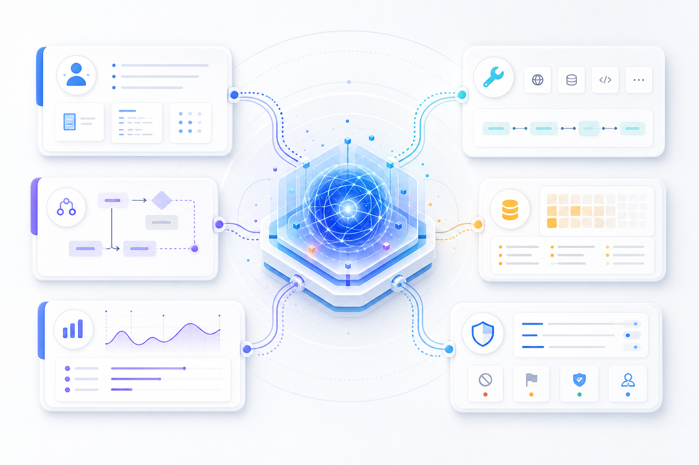

前两天，我读到腾讯技术工程发布的《驾驭 AI Coding：一份面向团队的 Harness Engineering 落地规范》。文章写得很完整，使用的主角是 CodeBuddy。

我看完后的第一个反应不是“把 CodeBuddy 换成 Codex，再发一遍”。

如果只换产品名，整篇文章会立刻露馅。因为不同工具的上下文入口、权限模型、技能机制、协作方式和验证闭环并不完全一样。更重要的是，Harness Engineering 讲的本来就不是某个按钮怎么点，而是**怎样把模型的能力装进一个可控的工程系统**。

于是我做了一个有点较真的决定：让 Codex 来完成这次重写，但同时把“这次重写任务”本身当成 Harness Engineering 的实战样本。

我给它的要求很硬：第一人称、微信公众号、正文不能比原文短、主体图片必须比原文多；事实不能猜，图不能凑数，最后还得跑仓库自己的文档校验。

结果第一步就撞墙了。

普通网页抓取打不开微信公众号链接。Codex 没有假装自己读过，也没有拿搜索摘要凑内容，而是换成页面源码读取，定位正文节点，统计出原文约有 **25,087 个非空字符、17 张主体内容图**。随后它把自己的验收线提高到 **至少 26,000 个非空字符、至少 24 张主体图或截图**。

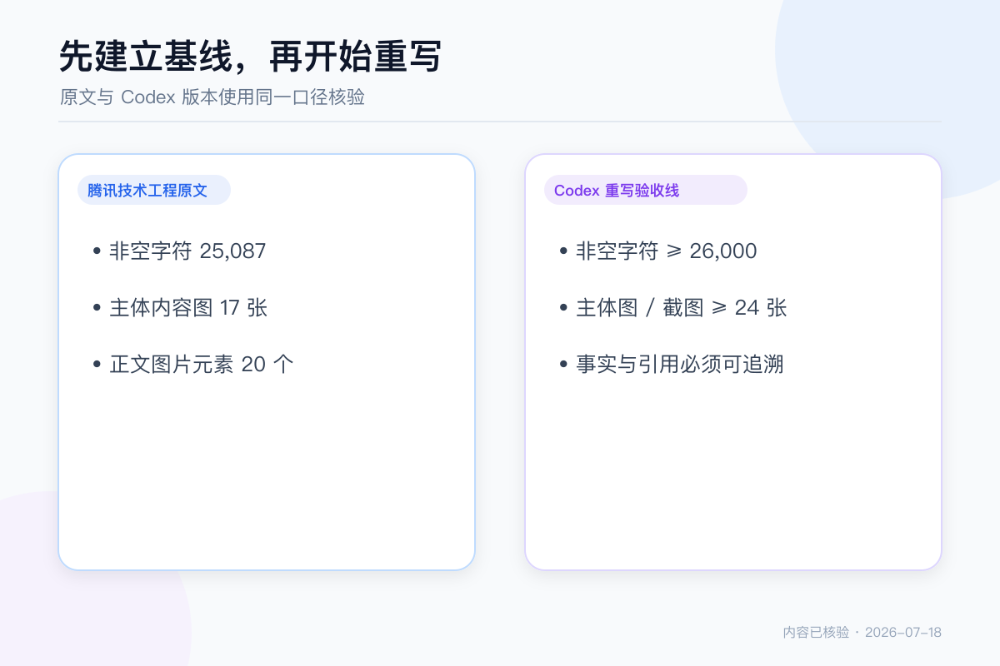

这个小插曲，恰好把 Harness 的价值讲明白了。

模型很强，不代表结果天然可靠。真正决定结果的，是模型外面有没有一套系统，逼着它先读规则、再找证据、遇到失败换路径、完成后拿指标验收。

我把这套系统拆成六根支柱：

- 上下文：Codex 此刻应该知道什么，不应该被什么淹没；
- 工具：它能访问哪些真实系统，怎样拿到一手证据；
- 编排：大任务怎样拆，哪些步骤可以并行，谁来复核；
- 状态与记忆：跨会话、跨任务，哪些信息必须沉淀；
- 评估与观测：怎样证明“完成了”，而不是听它说完成了；
- 约束与恢复：什么能自动做，什么必须停下来，失败后如何回滚或换路。

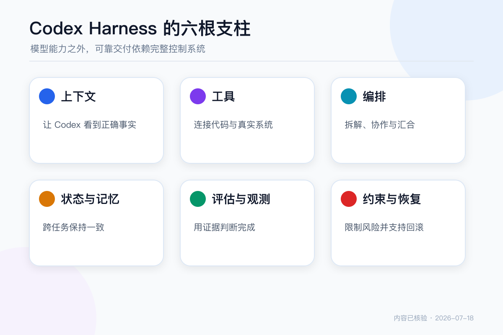

这篇文章分三部分。

第一部分讲清楚我怎样理解 Codex 时代的 Harness；第二部分给出一套可以直接放进团队仓库的落地方法；第三部分用这次真实重写任务做一次审计，看看规范有没有真的运行起来。

如果你只想找几个 Prompt，这篇可能太长。

如果你想让 Codex 不只是偶尔写出一段漂亮代码，而是成为一个能长期协作的工程成员，那我们从最容易被忽视的地方开始。

## 第一部分：先把问题说透

## 一、Harness 不是提示词技巧，而是 Agent 的工作环境

### 1.1 模型、Agent 与 Harness 到底是什么关系

很多人把 Codex 理解成“更会写代码的聊天框”。这个理解不能说错，但只覆盖了最表面的一层。

模型负责理解和生成。它看到输入，预测下一步应该输出什么。模型本身不会天然知道你的仓库结构，不会天然拥有终端，不会天然记住上周的架构决策，也不会天然知道哪条命令可能删库。

Agent 是模型加上循环：观察当前状态，选择动作，调用工具，读取结果，再决定下一步。

Harness 则是 Agent 能否稳定工作的全部外部条件：仓库规则、工具接口、权限边界、任务状态、评估标准、日志、恢复方式，以及人什么时候介入。

可以把它画成三层：

```text
应用层：Codex App / CLI / IDE / Cloud Task
          ↓
Harness：上下文、工具、编排、状态、评估、权限、恢复
          ↓
模型层：理解意图、推理、生成、决策
```

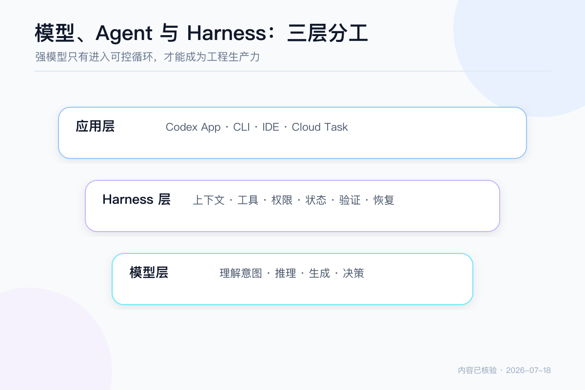

OpenAI 在 2026 年 2 月公开的 Harness Engineering 实验很有代表性：一个小团队用 Codex 在五个月内构建了约百万行代码、合并约 1,500 个 PR，并估计只用了手写方式约十分之一的时间。真正值得注意的不是行数，而是他们后来总结出的工作变化：**人类负责指引，Agent 负责执行。**

这句话听起来很轻松，实际要求很高。

当人不再逐行写代码，人就必须把“什么叫正确”“怎样验证”“哪里不能碰”“失败后怎么办”表达得足够清楚。以前这些判断藏在资深工程师脑子里，现在必须变成 Codex 能读、能执行、能检查的系统资产。

所以，Harness 不是给 AI 套一根缰绳那么简单。

它更像一整套交通系统：道路决定它能去哪里，导航告诉它怎样走，红绿灯阻止危险动作，仪表盘暴露当前状态，护栏降低失控代价，事故处理机制让它能恢复。

### 1.2 为什么“直接让 Codex 写”迟早会失控

我早期用 AI 编程时，也喜欢一句话开工。

“帮我做一个登录页。”

“把这个接口改成异步。”

“修一下页面打不开的问题。”

小任务经常很惊艳。文件不多、边界清楚、上下文新鲜时，模型可以迅速产出一个看起来完整的答案。这种即时反馈很容易让人误判：既然它这么强，复杂任务也多说几句就行。

真正的问题通常在第三天、第三个模块、第三位协作者出现。

第一类问题是**局部正确，整体漂移**。

Codex 会根据眼前代码延续模式。如果仓库里同时存在三种写法，它可能在第四个地方创造第四种。单看每个文件都说得通，放到系统里却越来越难维护。

第二类问题是**聊天知道，仓库不知道**。

你在某次对话里解释了“订单金额必须用整数分保存”，这次它记住了。换一个任务、换一个线程、换一位同事，这个决定就消失了。只存在于聊天记录里的知识，不是工程资产。

第三类问题是**完成声明代替验证证据**。

AI 很容易说“已经修复”“测试通过”“页面正常”。如果 Harness 没要求它实际跑测试、打开页面、检查日志、展示差异，人会把语言流畅误当成事实可靠。

第四类问题是**工具越多，风险越大**。

给 Codex 接 GitHub、数据库、部署平台、浏览器和企业文档之后，它的价值会迅速上升，爆炸半径也会同步上升。一个模糊指令，可能从“帮我看下问题”滑到修改配置、发送消息甚至触发部署。

第五类问题是**速度放大了熵**。

人一天写一百行坏代码，团队还有机会在 Review 时拦住。Agent 一天能改几十个文件，同一种坏模式可以在几分钟内复制到整个仓库。AI 不会消灭技术债，它会同时加快创造技术债和清理技术债的速度。

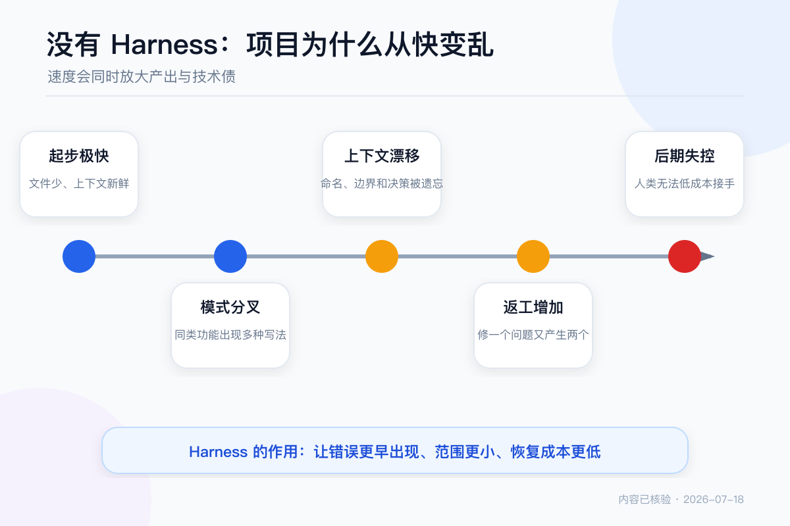

所以我现在判断一个团队有没有真正用好 Codex，不看“生成了多少代码”，而看四件事：

1. 关键知识有没有进入仓库或稳定的数据源；
2. 任务有没有明确的完成标准；
3. Codex 能不能自己取得验证证据；
4. 错误能不能在低成本范围内被发现和恢复。

### 1.3 六根支柱怎样映射到 Codex

第一根是**上下文架构**。

Codex 会读取仓库里的 `AGENTS.md`。这份文件不应该是一本百科全书，而应该像新员工入职地图：项目是什么、目录怎样分、常用命令是什么、哪些规则不能违反、详细文档去哪里找。

OpenAI 自己试过巨型 `AGENTS.md`，后来明确总结为失败。原因很朴素：上下文有限；当所有规则都写成最高优先级，等于没有优先级；巨型文档还会快速腐烂。

我更喜欢下面的结构：

```text
AGENTS.md                 # 入口地图，短、稳定、可执行
ARCHITECTURE.md           # 架构边界与依赖方向
docs/
├── product/              # 产品事实与用户流程
├── design/               # 设计原则与视觉规范
├── plans/active/         # 正在执行的复杂计划
├── plans/completed/      # 已完成计划与决策记录
├── runbooks/             # 发布、排障、恢复手册
└── references/           # 外部库与内部系统参考
```

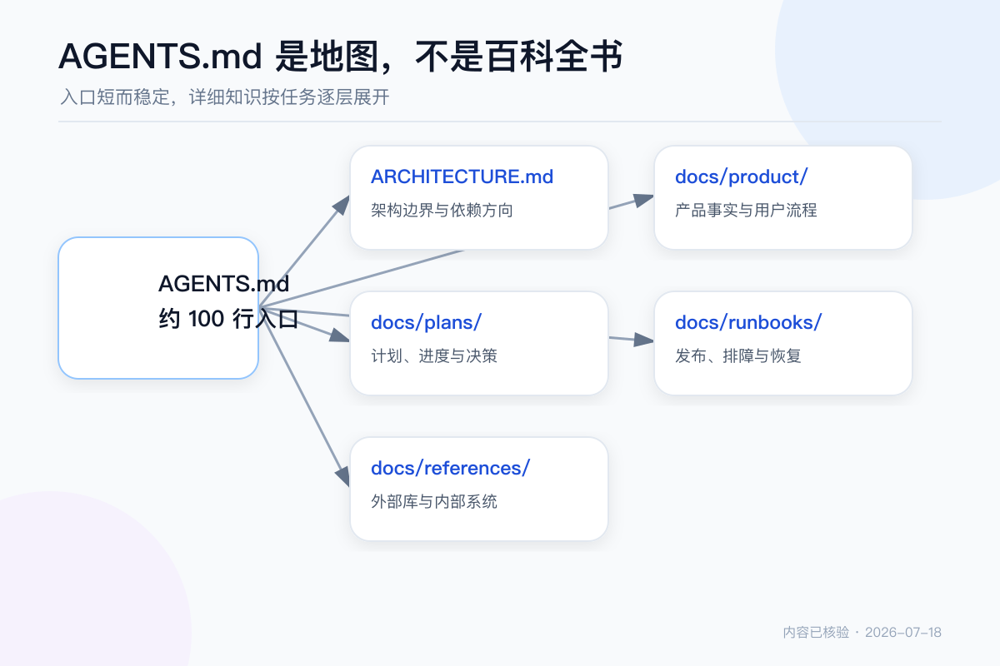

第二根是**工具系统**。

Codex 自带文件和终端能力，还可以通过 MCP、连接器、浏览器、图像生成等工具进入外部世界。这里最重要的不是数量，而是“增量价值”。

如果 Codex 已经能读本地文件，再接一个只提供相同能力的文件系统 MCP，价值很小，却会增加配置和权限面。反过来，数据库 Schema、线上日志、GitHub PR、设计稿、真实浏览器页面这些本地仓库拿不到的信息，才值得接入。

我把工具分为四类：

| 工具层 | 解决的问题 | 典型能力 | 默认风险 |
|---|---|---|---|
| 本地工具 | 代码与构建 | 文件、终端、Git、测试 | 误改文件、危险命令 |
| 知识工具 | 获取事实 | 文档、搜索、代码索引 | 过时信息、来源混杂 |
| 协作工具 | 进入团队流程 | GitHub、Linear、Slack、飞书 | 误发消息、误改外部状态 |
| 运行工具 | 接触真实系统 | 浏览器、数据库、云平台、监控 | 数据与生产影响 |

第三根是**执行编排**。

Codex 不只是一个会话。复杂任务可以有计划、子任务、并行探索、代码实现、独立 Review 和最终验证。是否使用多个 Agent，不应该取决于“看起来高级”，而应该取决于任务能否被清晰分割、各部分是否能独立验证、并行是否真的节省时间。

一个改文案的小任务，单 Agent 最快。

一个涉及前端、后端、数据库迁移和安全边界的任务，如果接口已经定义清楚，可以拆成多个互不覆盖的责任区。但如果需求本身还没稳定，过早并行只会制造四份互相冲突的假设。

第四根是**状态与记忆**。

当前对话是短期状态；计划文件和任务状态是中期状态；进入 Git 的规范、决策记录、测试和运行手册是长期记忆。真正可靠的“记住”，不是让模型模糊回忆，而是让它下次能重新找到同一份权威事实。

第五根是**评估与观测**。

Codex 需要看到命令输出、测试报告、浏览器状态、截图、日志、指标和 Git diff。一个没有观测面的系统，只能靠猜。一个没有评估标准的任务，只能靠感觉结束。

第六根是**约束与恢复**。

沙箱、审批、文件范围、只读工具、分支、工作树、最小权限、备份、可逆操作、失败重试和人工升级，都属于这一层。

很多团队把权限理解成“安全部门要求”。我更愿意把它理解成速度基础设施。边界越清楚，低风险动作越能自动化；边界越模糊，每一步都得人盯着。

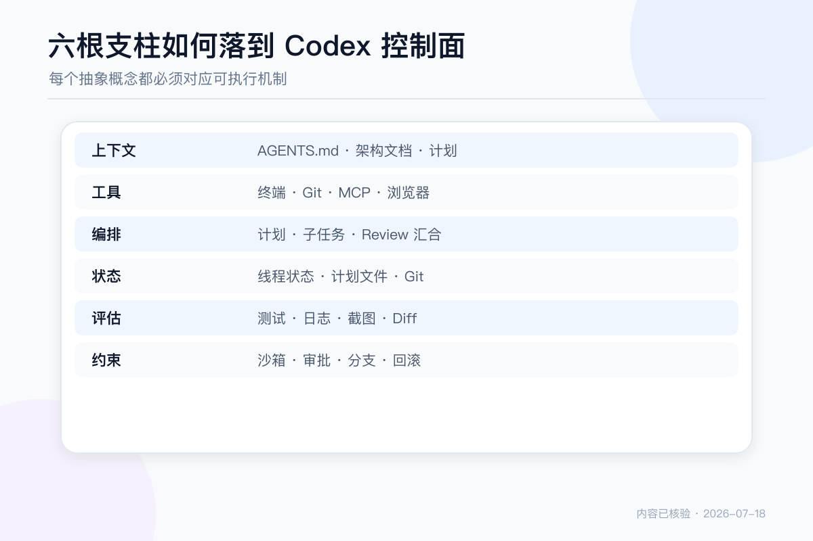

## 二、一套真正能跑起来的 Codex 一体化架构

### 2.1 不要从工具清单开始，从闭环开始

团队搭 AI Coding 平台时，最容易从采购和安装开始：选哪个模型，装哪些插件，接多少 MCP，有没有知识库。

我现在会先画闭环：

```text
需求或问题
  ↓
获取当前事实
  ↓
形成可审查计划
  ↓
在边界内执行
  ↓
运行自动验证
  ↓
检查真实用户路径
  ↓
审查差异与风险
  ↓
合并、发布或回滚
  ↓
把新知识写回系统
```

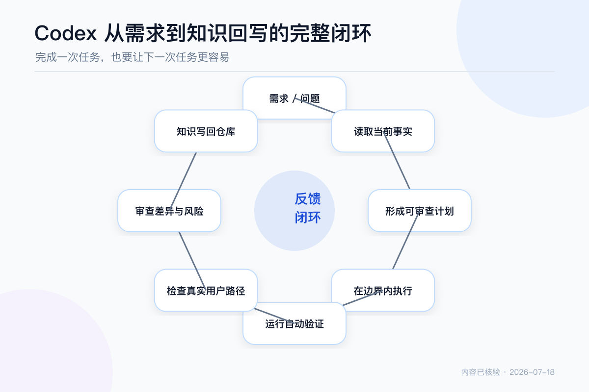

这条链路里，每一环都要回答三个问题：输入是什么，产出是什么，怎样判断合格。

例如“实现用户操作日志”不是可执行规范。它缺少边界：记录哪些操作，谁能查询，保留多久，失败是否阻塞主流程，敏感字段怎样脱敏，数据量上来之后怎样索引。

把它改成执行契约，才适合交给 Codex：

```text
输入：现有用户服务、鉴权方式、数据库 Schema、日志合规要求
产出：迁移文件、写入服务、查询 API、定时清理、单元与集成测试
约束：不记录密码与令牌；写入失败不影响主交易；查询仅管理员可用
验收：指定正常路径与异常路径测试通过；迁移可回滚；文档与 API 示例更新
```

有了闭环，再决定每一环使用什么能力。

| 环节 | Codex 能力 | 团队必须提供的东西 |
|---|---|---|
| 读懂任务 | 仓库搜索、文档、MCP | 权威来源和清晰入口 |
| 形成方案 | 计划、分析、追问 | 业务边界和取舍原则 |
| 执行修改 | 文件、终端、子任务 | 可运行环境和最小权限 |
| 验证结果 | 测试、浏览器、日志 | 可执行验收标准 |
| 交付协作 | Git、PR、评论 | 分支与 Review 规则 |
| 沉淀经验 | 文档、Skill、测试 | 归档位置和维护责任 |

### 2.2 仓库必须成为系统记录

我越来越认同一个判断：**对正在运行的 Codex 来说，访问不到的知识就等于不存在。**

架构原则如果只在某位老员工脑子里，不存在。

产品边界如果只在三个月前的群聊里，不存在。

数据库字段如果只有线上实例里才看得到，而 Codex 没有只读查询通道，也不存在。

这不是要求所有信息都复制进 Git。真正的原则是：每类事实都必须有一个权威源，而且 Codex 能在需要时抵达那里。

稳定、适合版本化的知识放仓库：架构、规范、运行手册、验收标准、关键决策。

实时变化的数据留在原系统，通过只读接口或 MCP 获取：Issue 状态、数据库 Schema、监控指标、发布状态。

敏感信息既不进入 Prompt，也不进入仓库。Codex 只应该拿到完成任务所需的最小权限，凭据通过环境或受控工具注入。

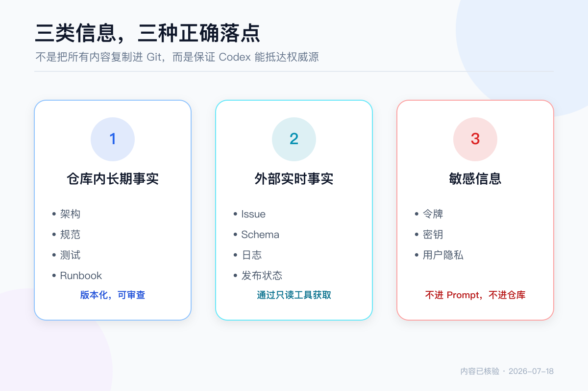

### 2.3 “人类在环”不是每一步都手点确认

有人听到 Agent 自主执行，会担心失控；有人听到人类在环，又觉得自动化失去意义。

这两种理解都把“人类在环”想成了同一种按钮。

人真正应该介入的是判断密度高、后果大、难以自动验证的位置：需求取舍、架构方向、数据删除、权限变化、生产发布、对外沟通。

而格式化、静态检查、单元测试、链接检查、生成预览、收集日志这些确定性动作，应该让 Harness 自动完成。

我常用四级权限：

| 等级 | 动作 | 默认策略 |
|---|---|---|
| L0 读取 | 搜索、查看文件、读取日志 | 自动执行并保留来源 |
| L1 本地可逆 | 改工作区文件、跑测试、生成报告 | 自动执行，展示 diff |
| L2 外部可逆 | 创建草稿 PR、写评论草稿、建预览 | 明确授权后执行 |
| L3 高影响 | 生产发布、删除数据、改权限、发送外部消息 | 精确确认目标与影响 |

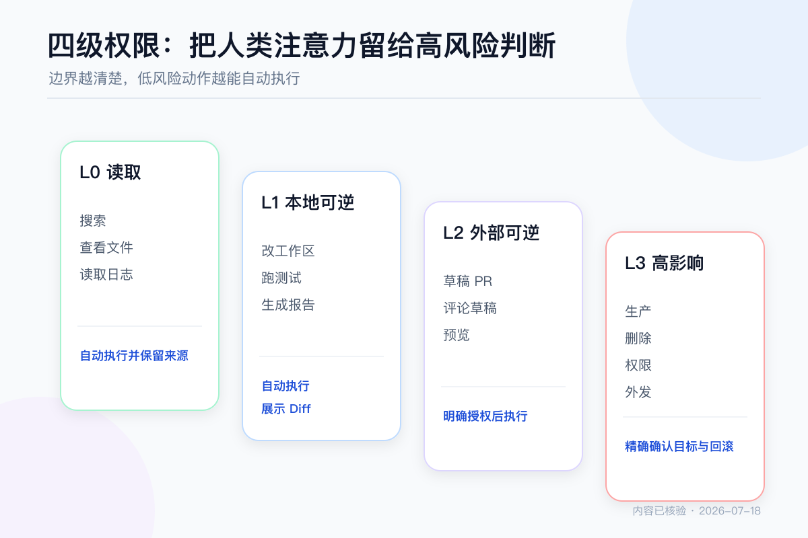

这套分级的目的不是保守，而是让低风险工作跑得更快，让人的注意力留给真正贵的判断。

## 第二部分：把 Harness 放进仓库

## 三、三阶段实施路线：先能验证，再扩工具，最后提高自治

我不建议团队第一天就建一个庞大的 Agent 平台。

先问最基本的问题：现在的项目能不能被一条命令启动？能不能被一条命令检查？失败时有没有清晰输出？如果这些都没有，接十个 MCP 也只会让 AI 更快地撞墙。

### 阶段一：基础可读、可跑、可验

目标是让 Codex 像一个刚加入团队的工程师，在不依赖口头传授的情况下完成一个小改动。

这一阶段只做五件事：

1. 写一个短 `AGENTS.md`；
2. 把常用检查收敛到稳定命令；
3. 明确目录、架构和禁止事项；
4. 准备一个可独立运行的开发环境；
5. 选一个小任务跑通“读—改—验—审”的闭环。

验收不是“Codex 能生成代码”，而是另一位成员开新任务后，只读仓库就能重复完成。

### 阶段二：接入高价值事实与技能

基础闭环稳定后，再补 Codex 目前看不到的关键事实。

数据库相关错误多，就接只读 Schema；Issue 上下文经常复制粘贴，就接 GitHub 或项目管理工具；前端回归靠人肉，就让浏览器和截图进入验证；重复出现的领域流程，就沉淀为 Skill。

每接一个工具，都要写清楚：谁能用、能读什么、能写什么、输出多大、失败怎样处理、凭据在哪里管理。

### 阶段三：多 Agent、自动 Review 与持续清理

当任务边界、工具和验证都稳定后，才适合提高自治。

复杂功能可以拆成规划、实现、测试、安全 Review、文档更新等角色。后台任务可以定期做依赖审计、文档除草、死代码扫描和质量评分。

但自治不是“取消人”。它是把人的判断写成可复用的规则、测试、工具和升级条件。

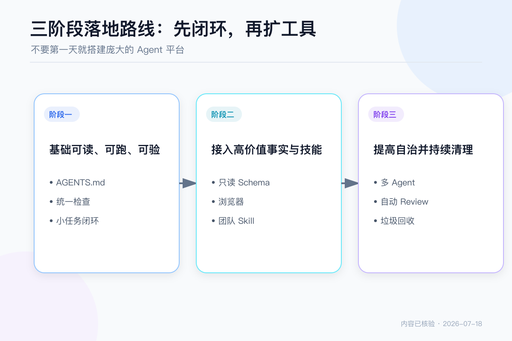

## 四、第一阶段：一小时建立最小 Harness

### 4.1 先写一个不超过一屏的 AGENTS.md

这次任务所在的 `91ai` 仓库已经有 `AGENTS.md`。Codex 开工前必须读取它，其中最关键的不是愿景，而是可执行约束：文档放在哪里、图片怎样命名、修改后必须运行哪个检查、不得伪造数据、路径使用什么格式。

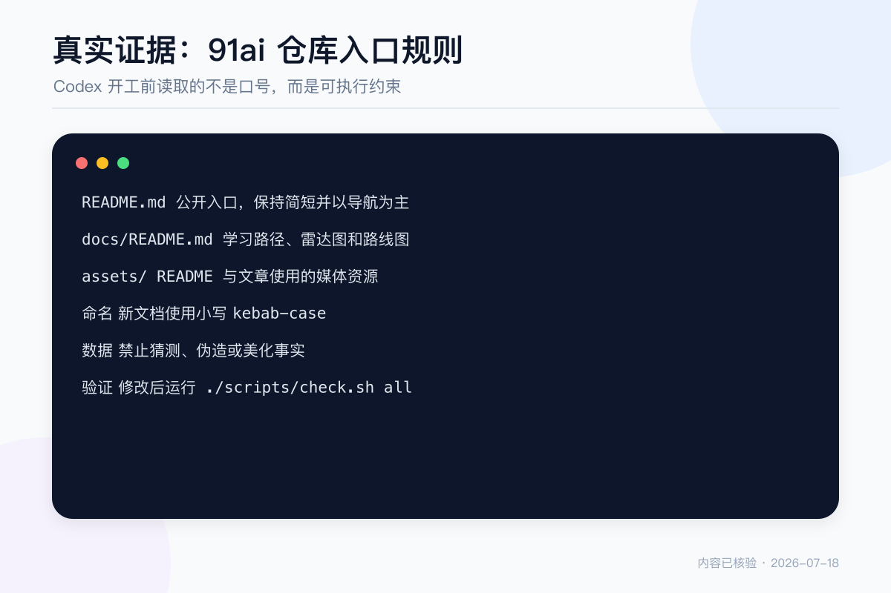

一个最小版本可以这样写：

```markdown
# Repository guide

## Purpose
This repository contains the product and its engineering documentation.

## Map
- `src/`: application code
- `tests/`: automated tests
- `docs/`: architecture, plans, and runbooks

## Commands
- `pnpm lint`: static checks
- `pnpm test`: relevant tests
- `pnpm build`: production build

## Boundaries
- Keep changes scoped to the requested task.
- Do not add dependencies without explaining the need.
- Never commit secrets or production credentials.
- After code changes, run lint, relevant tests, and build.

## Sources of truth
- Architecture: `docs/ARCHITECTURE.md`
- Active plans: `docs/plans/active/`
- Release runbook: `docs/runbooks/release.md`
```

重点有三个。

第一，只写当前有效的规则。不要把公司所有制度复制进来。

第二，规则尽量可验证。“保持高质量”无法检查；“修改后运行 `pnpm test`”可以检查。

第三，用链接做渐进式披露。入口告诉 Codex 去哪里找，不在入口里塞完整答案。

### 4.2 把十几条命令收敛成一个检查入口

这个仓库没有应用构建系统，但有统一的文档检查脚本：

```bash
./scripts/check.sh lint
./scripts/check.sh links
./scripts/check.sh badges
./scripts/check.sh all
```

这比在 `AGENTS.md` 里写“注意标题层级、空行、内部链接和 badge 数量”强得多。文字会被忽略，脚本会给出退出码。

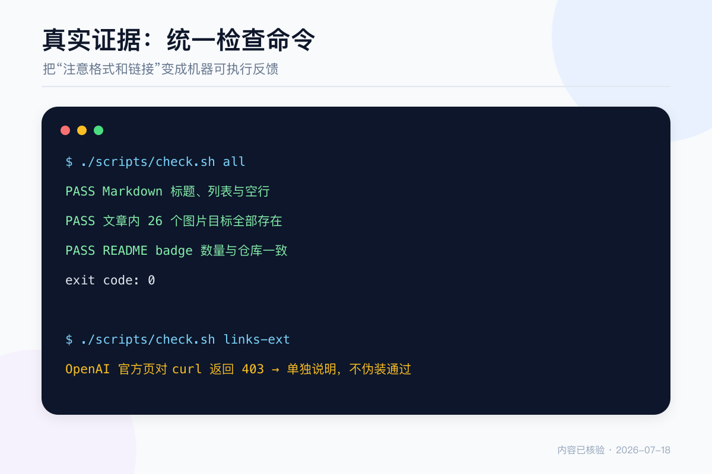

一个好的检查入口需要满足：本地能跑，CI 也能跑；成功返回 0，失败返回非 0；输出指出具体文件与原因；默认检查足够快，完整外链检查可以单独运行。

如果项目需要先记住十二条命令才能验证，Codex 和新人都会漏。Harness 的思路不是提醒大家更细心，而是把正确路径做成最短路径。

### 4.3 用任务契约替代一句模糊需求

我现在给 Codex 的复杂任务通常包含六块：目标、范围、非目标、约束、验收、证据。

以这篇文章为例：

```text
目标：把指定 CodeBuddy 文章改写成第一人称 Codex 实战文章。
范围：公众号 Markdown 正文、新增配图资产、来源说明。
非目标：不发布公众号，不修改现有 Claude Code 系列。
约束：不得伪造实测；正文非空字符不少于原文；主体图不少于原文。
验收：字数统计、图片引用统计、文件存在检查、仓库文档检查全部通过。
证据：命令输出、生成文件路径、来源链接、失败项说明。
```

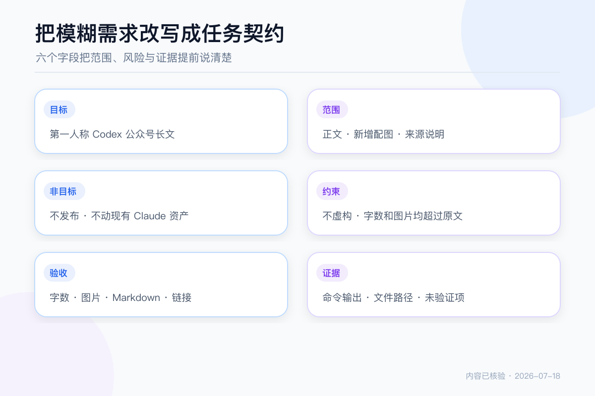

这种写法看起来比一句 Prompt 慢，但它会显著减少返工。最贵的不是多写一百字需求，而是让 Agent 高速跑向错误方向之后再整片推倒。

## 五、第二阶段：让 Codex 拿到真正有用的工具

### 5.1 MCP 的判断标准：没有它，Codex 缺哪条关键事实

MCP 很容易让人上头。看到一个 Server 就想装，最后配置里塞了十几个入口，每次对话先加载一大堆工具描述，真正需要的只有两个。

我现在会先写“缺口”，再选工具。

如果问题是 Codex 不知道线上表结构，缺口是实时 Schema，而不是“缺一个数据库 MCP”。解决办法可能是只读 MCP，也可能是 CI 定期生成 `db-schema.md`。后者更简单、更稳定，就没有必要为了 MCP 而 MCP。

如果问题是 Codex 看不到 PR 评论，缺口是 Review 反馈闭环。GitHub CLI 已经能稳定读取和回复，未必还要增加一套服务。

如果问题是页面改完没人验证，缺口不是“浏览器自动化”四个字，而是可重复的真实用户路径：打开哪个地址，使用什么测试数据，看到什么才算通过，失败时保存哪些截图和控制台信息。

我会给每个候选工具做一张小卡片：

| 问题 | 必答内容 |
|---|---|
| 增量事实 | 它提供了 Codex 原本拿不到的什么？ |
| 最小权限 | 只读是否足够？写权限能否拆开？ |
| 输出预算 | 一次响应会不会塞入几万行日志？ |
| 失败语义 | 超时、无权限、空结果分别怎样表示？ |
| 凭据 | 谁保管、怎样轮换、会不会进入日志？ |
| 替代方案 | CLI、生成文件、API 是否更简单？ |
| 验证 | 怎样证明工具返回的是当前真实数据？ |

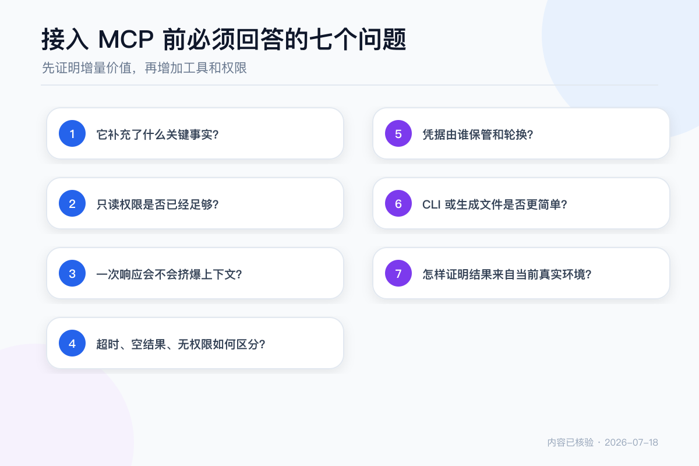

一个常见错误是让查询工具直接拥有写权限。例如，团队只是想让 Codex 看数据库字段，却给了能更新业务数据的账号。正确做法是把读取和写入拆成不同工具、不同凭据，写操作再附加精确审批。

另一个常见错误是让工具返回未经裁剪的内容。一次日志查询吐回二十万行，不只是浪费上下文，还会把真正异常淹没。工具层应该支持时间范围、关键字、行数上限和聚合，让 Codex 先看摘要，再按需下钻。

### 5.2 Skills 不是 Prompt 收藏夹，而是可执行的团队经验

这次重写任务中，用户明确指定了 `wos-content-rewrite` Skill。Codex 不能只看名字猜用法，而是必须先完整读取 `SKILL.md`。这个 Skill 规定了两个前置问题：使用第一人称还是第三人称，目标平台是什么。

我确认“第一人称、微信公众号”之后，流程才继续。随后它又读取公众号风格参考：从场景开头、短段落、故事节奏、避免新闻通稿腔、结尾互动等规则，决定文章形态。

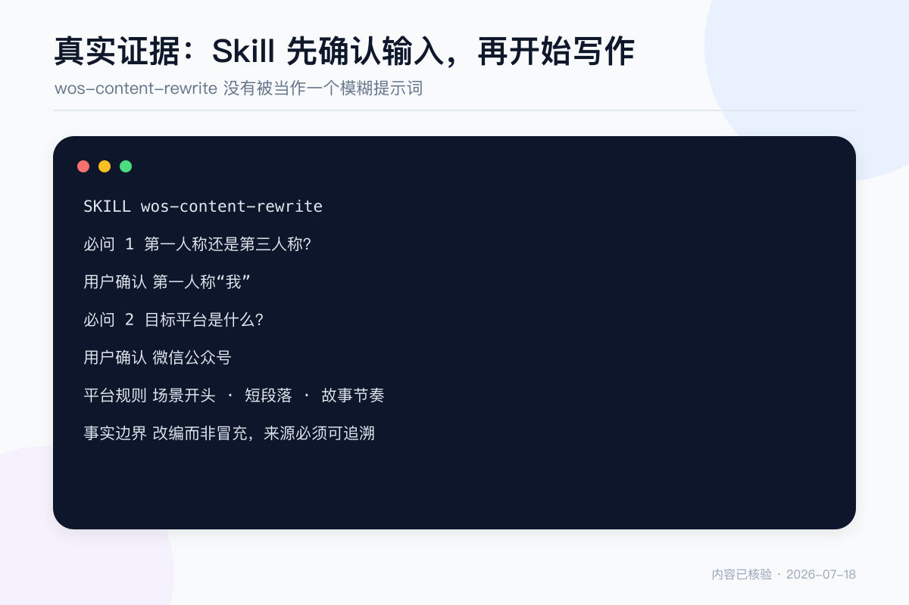

这就是 Skill 和普通 Prompt 的区别。

Prompt 通常解决当下这一次怎么说；Skill 定义一类任务怎样识别、需要哪些输入、按什么步骤执行、什么结果算合格。它可以跟仓库一起版本化，可以被所有成员复用，也可以通过测试不断改进。

一个够用的 Skill 至少包含：

```markdown
---
name: release-check
description: 在准备发布、生成发布说明或执行上线前检查时使用。
---

# Release Check

## Inputs
- target environment
- release version
- related issues or pull requests

## Workflow
1. Verify the working tree and target branch.
2. Run the release test suite.
3. Compare migrations and environment changes.
4. Produce a risk summary and rollback plan.
5. Stop before production deployment unless explicitly approved.

## Output
- verified commit
- check results
- known risks
- rollback command or runbook link
```

Skill 最容易犯五个错误。

第一，描述写得太宽。“处理所有开发任务”会让它在不该触发时触发。好的描述包含清楚的触发场景。

第二，步骤只写原则。“注意安全”“保证质量”不能执行。要落到检查对象、命令、退出条件和输出格式。

第三，把大量参考材料全部塞进主文件。主文件负责导航，详细模板、示例和脚本按需读取。

第四，默认工具一定成功。真实世界里会有权限不足、页面拒绝抓取、API 限流、测试环境缺失。Skill 要说明遇到这些情况如何恢复。

第五，从不评估。Skill 不是写完就永远正确。至少准备三个正常样例、两个边界样例和一个不应触发的反例，观察是否选对工具、是否漏步骤、是否给出足够证据。

### 5.3 工具、Skill 与 AGENTS.md 各自管什么

这三样经常被混在一起。

`AGENTS.md` 管仓库内长期有效的共同约束，例如目录、命令、架构边界和验收习惯。

Skill 管一类可复用任务的执行方法，例如发布检查、事故复盘、文章改写、数据库迁移。

工具负责真正读取或改变世界，例如读文件、跑测试、查询 GitHub、打开浏览器、生成图片。

可以用一句话记：**AGENTS.md 规定在这里工作要守什么规矩，Skill 告诉 Codex 这类工作怎样做，工具让它真的动手。**

如果一条信息只适用于当前需求，写进计划，不要污染长期规则。

如果一条规则应该被机器强制，写成脚本或测试，不要只留在 Markdown。

如果一份知识变化频繁，保留在权威系统，通过工具读取，不要每天复制进仓库。

### 5.4 浏览器与截图：让界面结果对 Agent 可见

前端任务最容易出现一种假完成：代码编译通过，页面实际上错位；组件测试通过，真实登录流程走不通；接口返回正常，空状态文案完全没有展示。

要让 Codex 验证 UI，至少要提供四样东西：可启动的环境、稳定测试账号或测试数据、明确用户路径、截图与控制台证据保存位置。

我会把关键路径写成可执行清单：

```text
场景：管理员查看操作日志
前置：本地服务启动；存在 20 条测试日志；管理员账号可用
步骤：登录 → 打开管理后台 → 进入操作日志 → 按用户筛选 → 翻页
通过：列表展示 20 条；筛选后数量正确；无控制台错误；移动端不横向溢出
证据：全页截图、筛选结果截图、控制台摘要、网络失败请求列表
```

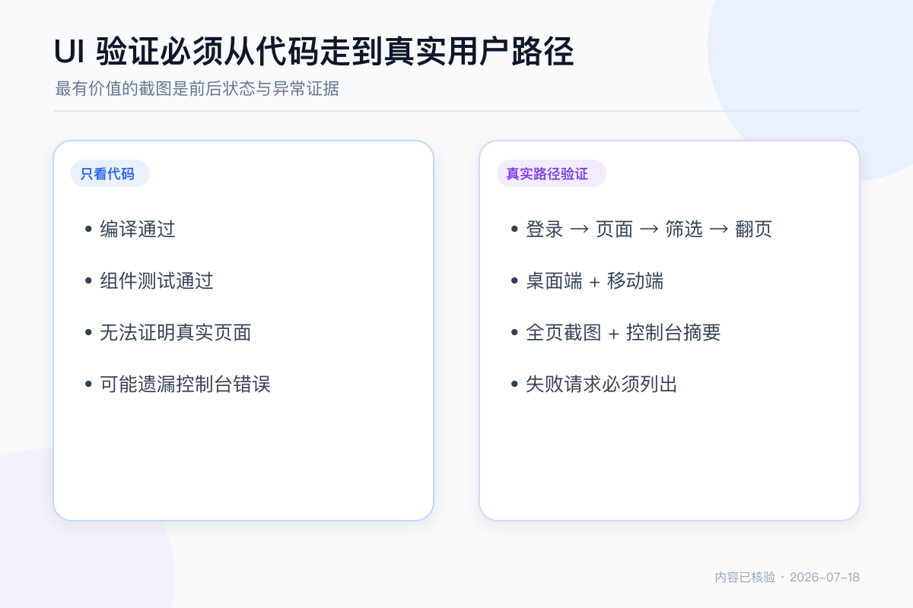

截图不是为了让报告显得丰富，而是为了记录状态变化。最有价值的通常是成对证据：修复前与修复后、桌面与移动端、正常态与异常态、浅色与深色。

这篇文章的图片也遵循同样原则。原文主体图是 17 张，我没有简单插 24 张装饰图，而是让每张图对应一个关键判断：基线、六支柱、上下文、工具决策、权限、任务契约、验证、审计。图片数量增加，但信息密度不能下降。

### 5.5 多 Agent：只有责任边界清楚时才并行

Codex 可以把独立子任务交给不同 Agent。并行适合代码库探索、互不覆盖的模块实现、独立安全审查、测试补充和文档核验。

不适合并行的情况也很明确：需求仍然模糊；多个任务要修改同一批核心文件；接口还没定；每个子任务都依赖前一个结果；或者任务小到协调成本比执行成本还高。

我会在分派时写清楚四件事：责任、文件范围、输入输出、禁止事项。

```text
Agent A：负责 API 与服务层，仅修改 src/api 和 src/services。
Agent B：负责数据库迁移与仓储层，仅修改 migrations 和 src/repositories。
Agent C：只读审查安全边界，不修改代码，输出按严重度排序的问题。

共同接口：docs/plans/active/operation-log-contract.md
禁止：不得回退其他 Agent 的改动；发现接口冲突先报告，不自行改约定。
```

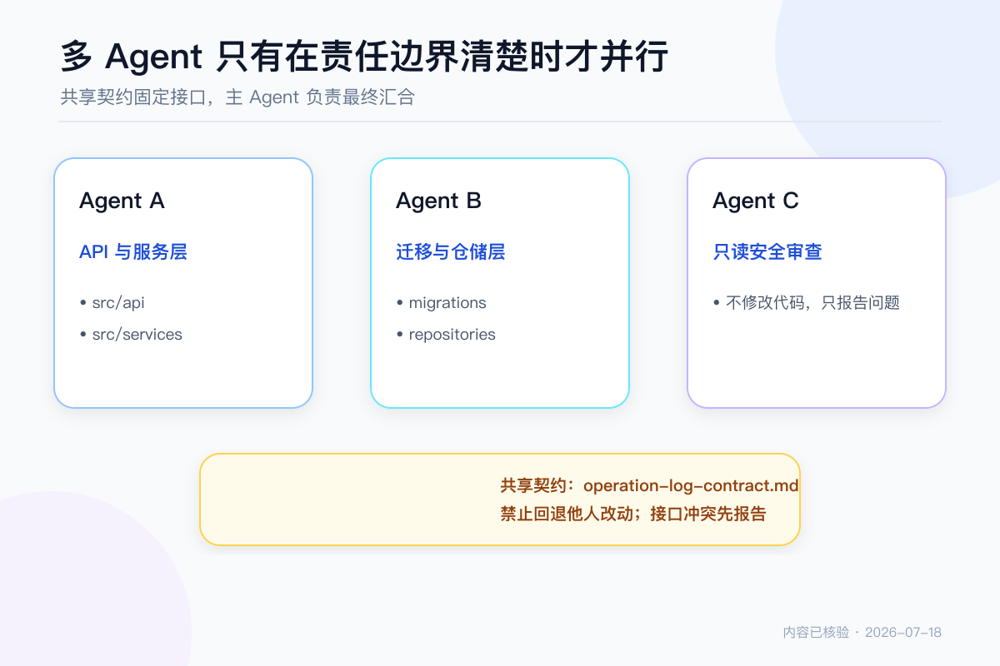

并行之后必须有汇合点。主 Agent 负责检查接口是否一致、是否有遗漏、测试是否覆盖整条链路。把任务分出去不等于把责任分出去。

## 六、用计划把“想法”变成可审查的执行状态

### 6.1 什么时候必须先计划

并不是所有任务都需要长计划。改一个错别字，先写两页方案只会制造仪式感。

我通常在这些情况先计划：会修改多个模块；需求存在多种合理解释；涉及数据迁移、权限或外部接口；需要多 Agent 协作；验收路径不明显；失败代价比较高。

计划的价值不是预测所有细节，而是在动手前暴露分歧。

一个可执行计划至少包含：当前事实、目标状态、关键决策、步骤顺序、每步验证、风险与恢复。

```markdown
## Current state
- 操作日志目前只写入文本日志，没有结构化存储。
- 管理后台没有查询入口。

## Decisions
- 使用独立表，保留 90 天。
- 写入异步执行，失败只告警，不阻塞主流程。
- 仅管理员角色可以查询。

## Steps
1. 增加迁移与模型 → 验证迁移前进和回滚。
2. 增加写入服务 → 验证敏感字段过滤与失败降级。
3. 增加查询 API → 验证权限、筛选和分页。
4. 增加后台页面 → 验证桌面与移动端真实路径。
5. 更新文档 → 验证链接与示例。
```

### 6.2 每一步都要有“证据接口”

很多计划只有动作，没有验证。

“完成数据库迁移”“实现接口”“修复页面”都不是可观察状态。计划应该提前规定证据从哪里来。

数据库迁移的证据是前进和回滚都成功，并检查目标 Schema；接口的证据是正常、未授权、非法参数和空结果测试；页面的证据是用户路径截图、控制台和网络请求；文档的证据是 lint 与链接检查。

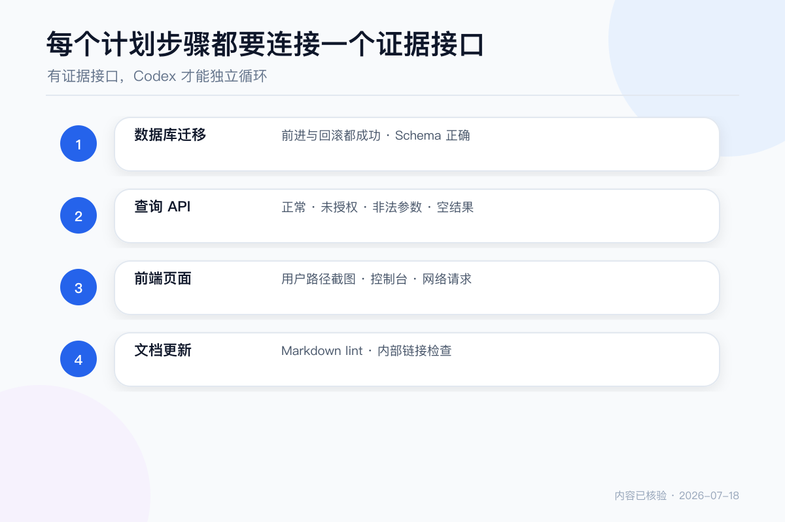

当证据接口明确，Codex 才能独立循环。如果只写“完成后让我看看”，每完成一点都得人接管，Agent 的自治自然上不去。

### 6.3 状态不要只留在脑子和对话里

复杂任务会跨越多个会话，甚至跨越几天。只靠聊天历史，一旦上下文压缩、线程切换或成员更换，进度就会变得模糊。

我会把状态分成四类：

| 状态 | 保存位置 | 示例 |
|---|---|---|
| 当前执行 | 任务计划或线程状态 | 正在实现查询 API |
| 已验证事实 | 计划记录或报告 | 迁移回滚测试通过 |
| 未解决风险 | 风险清单 | 大表清理可能锁表 |
| 长期决策 | 架构决策记录 | 日志写入不得阻塞交易 |

每次恢复任务，Codex 先读取状态源，再看工作区 diff 和测试结果。不能因为上一次对话说“快好了”，就假设文件仍然是那个状态。

## 七、日常开发 SOP：让正确动作变成默认路径

### 7.1 SOP-A：新功能开发

第一步，不写代码，先恢复事实。

Codex 读取 `AGENTS.md`、相关架构文档、已有实现和测试，确认工作区是否有其他人的未提交改动。发现脏工作区不代表必须停止，但必须区分哪些改动属于当前任务，哪些必须保留。

第二步，把需求翻译成验收标准。

每条验收标准要能被测试或观察。用“当……时，系统应……”描述，比“支持……功能”更清楚。

第三步，找最接近的现有模式。

如果仓库已有三个资源模块，新模块优先沿用同样的分层、命名、错误处理和测试方式。不要凭空设计一套更“优雅”的抽象。

第四步，小步修改并验证。

先让最小垂直切片跑通，再补边界。每完成一个阶段就运行相关测试，不要等改完二十个文件才第一次编译。

第五步，做真实路径检查。

后端看接口与日志，前端走浏览器，数据变更做迁移回滚，外部集成检查失败和限流。

第六步，审查 diff。

检查是否有范围外修改、调试日志、无用依赖、秘密信息、过度抽象和未更新文档。

第七步，交付证据。

最终说明改了什么、为什么、哪些检查通过、哪些不能验证、仍有哪些风险。不要只说“已完成”。

### 7.2 SOP-B：Bug 修复

Bug 修复最重要的不是尽快改代码，而是先证明自己理解了问题。

我要求先构造复现：失败测试、最小脚本、浏览器步骤或日志查询。没有复现就直接改，很容易修到症状而不是根因。

标准流程是：

```text
收集现象 → 建立可重复复现 → 缩小原因范围 → 写失败测试
→ 做最小修复 → 运行目标测试 → 运行回归检查 → 重走真实路径
```

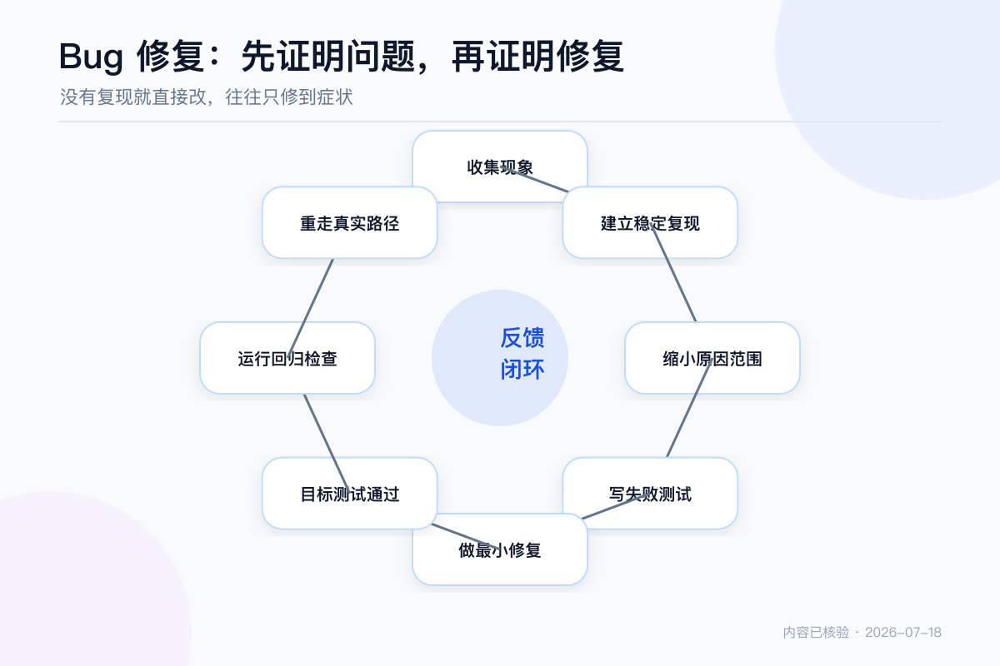

这里有三条红线。

一是不要顺手重构邻近代码。Bug PR 越大，越难证明修复和副作用之间的关系。

二是不要删除失败测试来让 CI 变绿。测试如果错了，要说明它为什么错，并用新的正确断言替代。

三是不要把“本地没复现”当成问题不存在。比较环境、数据、并发、时区、浏览器、依赖版本和权限差异。

### 7.3 SOP-C：Code Review

AI Review 最适合做系统性、重复性检查，但不能只给一句“帮我 Review”。

先限定范围：当前 diff、指定 PR 或指定文件。再指定重点：正确性、数据安全、授权、并发、性能、测试缺口。最后规定输出：只报告可操作问题，标出文件和行号，解释触发条件与影响，不要用风格偏好淹没真正风险。

我常用的审查顺序：

1. 需求是否被正确实现，有没有漏掉非目标；
2. 信任边界是否正确，认证和授权有没有混淆；
3. 数据写入是否可恢复，迁移是否可回滚；
4. 并发、重试和幂等是否会制造重复副作用；
5. 错误是否被吞掉，日志是否泄露敏感内容；
6. 测试是否真的覆盖失败模式；
7. 修改是否遵循现有架构和最小范围。

如果 Review 找不到问题，也应该明确说检查了什么，而不是为了显得有产出硬凑三条建议。

### 7.4 SOP-D：文档与内容任务

内容任务同样需要 Harness。

这次重写先确认视角与平台，再读取源文，建立字数和图片基线，随后核对官方 Codex 资料，最后把文章写入仓库新文件并运行 Markdown、链接和图片存在检查。

事实分三类处理：

- 原文事实：注明来自腾讯技术工程文章，不擅自改数字；
- 官方产品事实：优先引用 OpenAI 官方页面，并写明核对日期；
- 第一人称经历：只写本次任务和我真实使用过的流程，不把别人的案例冒充自己的项目。

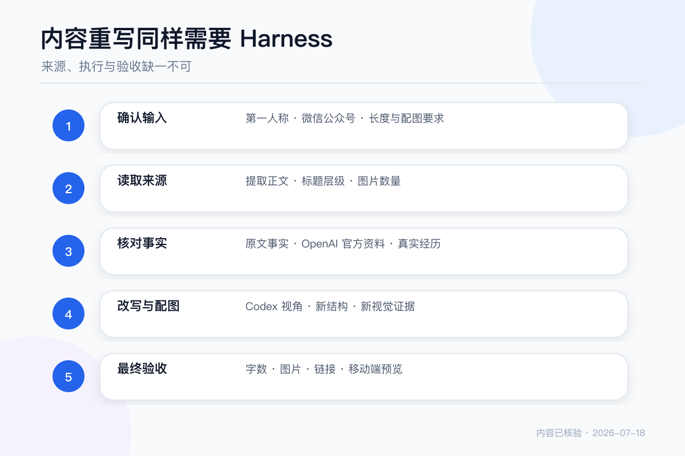

这套流程看起来比直接“洗稿”慢，但它保护了最重要的东西：可信度。

## 八、团队协作的十条红线

第一，**没有权威来源的数字不写。** 截图看不清就说看不清，工具没返回就说没返回。

第二，**生产写操作不从模糊指令推断。** “看一下线上问题”不等于允许改配置或重启服务。

第三，**秘密信息不进入仓库、Prompt、截图和报告。** 测试凭据也要按凭据管理。

第四，**不覆盖他人的未提交改动。** 共享工作区里，先识别所有权，再做最小修改。

第五，**不把聊天记录当长期文档。** 重要决策进入计划、ADR、测试或运行手册。

第六，**不以生成行数衡量价值。** 删除不必要代码、复用现有能力，通常比多写更好。

第七，**不把工具成功当业务成功。** 命令返回 0，不代表用户流程正确；API 200，不代表权限逻辑正确。

第八，**不让一个 Skill 承包所有事情。** Skill 保持原子化，组合由工作流负责。

第九，**不在无法恢复的动作上试错。** 删除、迁移、权限和生产操作先准备备份、回滚与精确目标。

第十，**不隐瞒未验证项。** 完成报告必须区分已验证、推断和未能验证。

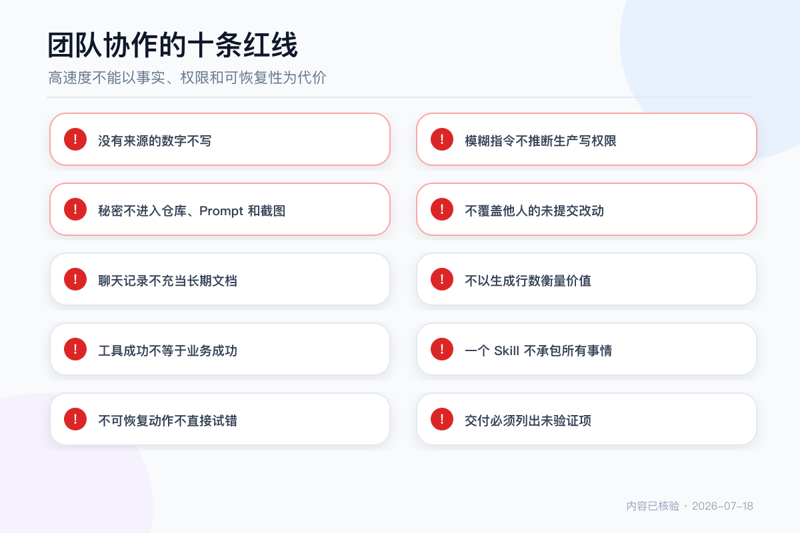

## 九、常见反模式：看起来在用 Agent，其实还在手工作坊

### 9.1 巨型 Prompt：把所有要求一次塞进去

表面上，Prompt 越长越完整。实际上一份没有层级、没有来源、没有优先级的万字指令，只会让 Codex 在大量相互竞争的信息里猜重点。

正确做法不是把 Prompt 写得更长，而是把信息放回它应该存在的位置：长期规则进 `AGENTS.md`，架构事实进架构文档，当前决策进计划，重复流程进 Skill，实时状态通过工具读取。

### 9.2 文档仓库与代码仓库各说各话

很多团队建了一个漂亮的知识库，却没有人负责更新。半年后，文档还说使用旧接口，代码早已换了三版。对 Codex 来说，过时但写得很正式的文档比没有文档更危险。

解决办法是给文档加所有权、更新时间和机械检查。关键架构文档可以在 CI 中检查链接、索引和必需章节；生成型事实，例如数据库 Schema 和 API 定义，尽量自动生成；定期让 Agent 做“文档除草”，但最终以代码、测试和真实系统为准。

### 9.3 把所有失败都归因于模型不够强

Codex 没写对，有时确实是模型能力问题，但更多时候是环境不可读。

它不知道内部函数怎样用，因为没有示例；不知道页面是否正常，因为环境启动不起来；不知道线上异常，因为日志工具只返回一团文本；不知道业务边界，因为决策只在群聊里。

OpenAI 的 Harness 实验里有一个很实用的提问：当 Agent 卡住时，不是先说“再努力一点”，而是问**它缺少什么能力，怎样让这项能力既可见又可执行**。

这个问题会把抱怨模型，转化成改造系统。

### 9.4 只做生成，不做垃圾回收

Agent 会学习仓库里的已有模式，包括坏模式。一个重复工具函数会诱发更多重复；一个模糊错误处理会被复制到更多模块；一个过大的组件会成为新的模板。

因此团队需要持续垃圾回收：重复代码扫描、依赖升级、失效文档清理、架构越界检查、测试脆弱性修复、质量分数跟踪。

这不是一次大扫除。技术债像高息贷款，适合持续小额偿还。与其每半年停工两周，不如每天让后台任务找一个可以快速审查的小问题。

### 9.5 用评分代替判断

成熟度评分能帮助比较和发现短板，但不能成为 KPI。

一旦分数和绩效绑定，团队会开始为了得分创建空目录、模板文档和无意义测试。Harness 的目标是减少失败、提高交付质量，不是让项目看起来配置齐全。

所以任何评分报告都必须附带证据、风险和改进优先级。一个没有 MCP 的简单静态站点，完全可能比接了十个 MCP 的业务系统更健康。分数必须服从场景。

## 十、我用 Codex 对这次任务做了一次 Harness 审计

文章写到这里，最容易出现的问题是：道理讲了一大堆，自己交付时有没有做到？

我让 Codex 按同一套标准回头审计这次重写。

### 10.1 项目与任务基线

项目是一个 AI 指南与评估知识库，没有应用源码和测试套件，主要资产是 Markdown 文档与图片。仓库已经提供 `./scripts/check.sh`，用于标题、列表、空行、内部链接和 badge 检查。

工作区在任务开始前并不干净，已有大量与 Claude Code 图片和公众号发布目录有关的未提交改动。Codex 没有清理、回退或“顺手整理”这些文件，而是把本次产出放到两个全新路径：

```text
docs/ai-coding/codex-harness-engineering-wechat.md
assets/codex-harness-engineering/
```

这点很重要。在共享工作区里，“先让状态变干净”可能意味着删除别人的工作。最安全的不是追求漂亮的 `git status`，而是知道哪些变化属于谁。

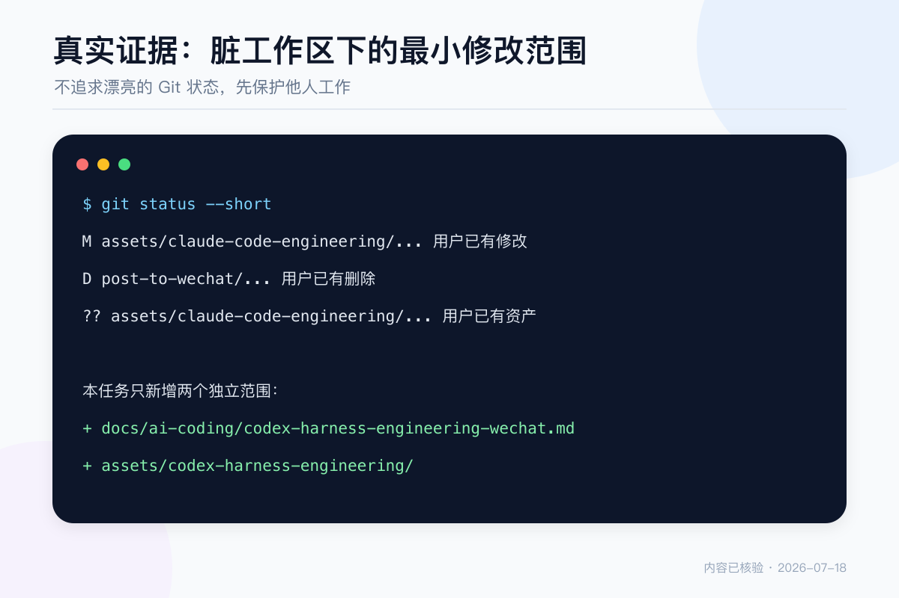

### 10.2 七个审计维度

我把审计拆成七项，每一项都必须能指向文件或命令输出。

| 维度 | 权重 | 本次检查 |
|---|---:|---|
| 上下文 | 15 | 是否读取项目规则、重写 Skill 和公众号参考 |
| 来源 | 15 | 是否真正读取原文，是否核对官方 Codex 资料 |
| 任务契约 | 10 | 人称、平台、字数、图片和非目标是否明确 |
| 工具与恢复 | 10 | 普通抓取失败后是否安全换路，是否保留原始来源 |
| 内容质量 | 20 | 是否为 Codex 真实视角，是否避免机械替换和虚构经历 |
| 视觉证据 | 15 | 图片是否多于原文，是否对应关键判断 |
| 验证 | 15 | 字数、图片、链接、Markdown 和文件是否实际检查 |

这份评分不是为了凑一个“优秀”。任何一项没有证据，就不能给满分。

### 10.3 已验证亮点

第一，来源读取不是凭印象。

普通网页工具打不开微信文章后，Codex 使用页面源码定位 `js_content`，提取标题、标题层级和图片元素。最终记录原文约 25,087 个非空字符，正文里 20 个图片元素，其中 17 张属于主体内容，其余是公众号装饰和尾图。

第二，写作前置条件被严格执行。

Skill 要求先确认人称和平台。用户回复“是”以后才进入写作，没有默认为第一人称，也没有把微信链接自动等同于明确发布平台。

第三，事实边界被保留。

文章没有声称“我用 Codex 写了百万行代码”。这个数字属于 OpenAI 官方 Harness 实验，并在正文中明确归属。我的第一人称经历只覆盖这次真实任务和日常工作方法。

第四，图片不是从原文搬运。

所有引用都进入新的 Codex 视觉目录，主题覆盖从来源基线到最终审计。原文 17 张主体图，本稿目标不少于 24 张，并额外提供封面和检查结果图。

第五，修改范围隔离。

面对已有脏工作区，Codex 没有动现有 `assets/claude-code-engineering/` 和 `post-to-wechat/` 变化。这符合“每一行改动都能追溯到用户请求”的原则。

### 10.4 暴露出来的问题

审计也发现三个不能回避的问题。

第一，公众号原文发布时间显示为 2026 年 7 月，工具能力变化很快。文章中的 Codex 功能事实必须以写作当日的官方页面为准，未来发布或转载时要重新核对。

第二，本文使用本地生成的视觉证据和流程图，并不是 OpenAI 产品宣传截图。这样做可以避免展示账号信息和工作区敏感内容，但发布时仍建议补两到四张脱敏后的真实 Codex App 截图，例如任务计划、文件 diff、测试结果和浏览器验证。

第三，仓库检查只能验证 Markdown 结构、链接和图片引用，不能自动判断中文是否自然、故事是否好读。最后仍需要人工通读，尤其检查长文节奏、重复表达和公众号移动端阅读体验。

### 10.5 审计报告应该怎样呈现

我不喜欢只给一个总分。更有效的报告分四层：结论、证据、风险、下一步。

```text
结论：文章达到发布前技术验收，但仍需人工通读和公众号预览。

证据：
- 正文非空字符：以最终统计命令为准
- 主体图片引用：以最终统计命令为准
- Markdown 与内部链接：./scripts/check.sh all
- 新增范围：两个全新路径

风险：
- Codex 产品能力具有时效性
- 微信编辑器可能改变表格和代码块排版
- 真实产品截图仍需发布者确认是否脱敏

下一步：
- 在微信编辑器预览桌面与手机排版
- 抽查全部图片顺序与清晰度
- 发布前再次核对官方链接与日期
```

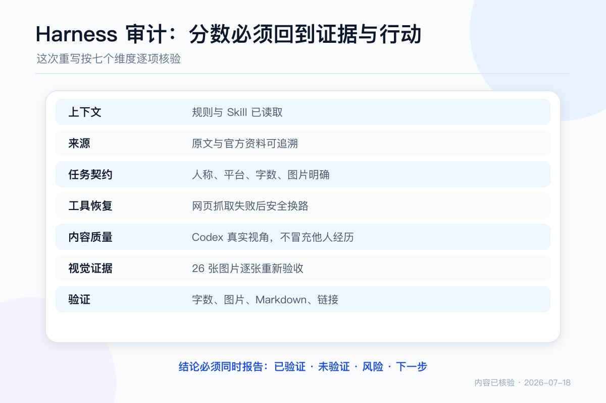

### 10.6 推荐的审计节奏

新项目第一次接入 Codex 时做一次基线审计，重点不是得分，而是找出最阻塞 Agent 的三个缺口。

重要功能合并前做任务级审计，检查验收、权限、数据和恢复。

每月做一次知识与工具审计，清理过时规则、失效 Skill、闲置 MCP 和过大的输出。

每季度做一次系统级复盘：哪些失败重复发生，哪些人工判断可以编码为测试或工具，哪些自动化带来的维护成本已经超过收益。

审计最终要推动系统改变。报告如果只是躺在目录里，它本身也会变成新的技术债。

## 十一、从“人盯着 AI”到“系统约束 AI”

最初使用 Codex 时，我的工作方式很像带一个需要全程看护的实习生。

我描述一步，它做一步；我检查每个文件；它说测试通过，我再手动跑一遍；它忘记某条规则，我下一次继续提醒。

这种方式确实能提高一点效率，但人仍然是流程的内存、调度器和测试框架。任务一多，人就成为瓶颈。

Harness 的转变，是把这些重复提醒逐步移出人的脑子。

“先看项目规范”变成 `AGENTS.md` 自动加载。

“这个模块不能反向依赖”变成架构测试。

“改完要跑哪些检查”变成一个统一脚本。

“发布前要检查什么”变成 Skill。

“线上只允许查看日志”变成只读工具与权限策略。

“页面到底修没修”变成浏览器路径和前后截图。

“失败怎么办”变成回滚手册和升级条件。

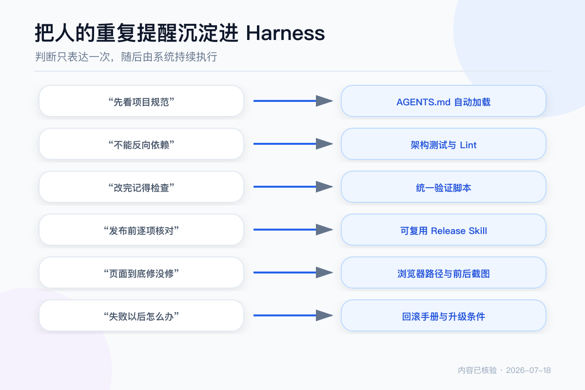

当这些东西积累起来，人不再需要盯住每个动作，而是设计目标、边界和反馈回路。Codex 也不再只是一个代码生成器，而是一个能在工程系统里工作的执行者。

这里有一个反直觉的地方：约束增加之后，速度反而可能更快。

因为 Codex 不必每次猜目录，不必等人告诉它测试命令，不必在十种写法里犹豫，不必做完之后才发现权限不对。清晰边界减少了搜索空间，也减少了返工。

但 Harness 不会一劳永逸。

项目变化、工具升级、人员更替、业务扩张，都会让原来的规则逐渐失真。熵永远存在。每多一条规则、一个 Skill、一个 MCP，也多一份维护责任。

所以真正成熟的系统不仅会增加能力，也会删除能力。

没人用的工具移除，重复的 Skill 合并，过时的规则删掉，能由测试强制的文字提醒降级，无法证明价值的自动化停止运行。

这也是我理解的 Harness Engineering：不是堆更多零件，而是持续寻找最小、清晰、可验证的控制系统。

## 十二、给团队直接照着做的 30 天计划

### 第 1 周：只解决“看不懂、跑不起来、验不了”

第 1 天，选一个真实但低风险的小项目，不要从核心支付或生产基础设施开始。

第 2 天，写最小 `AGENTS.md`，只包括项目地图、三到五条命令、关键边界和深入文档入口。

第 3 天，把格式、静态检查、测试和构建收敛成稳定入口，确保新环境能复现。

第 4 天，选一个小 Bug，让 Codex 完成复现、修复、测试和 diff 审查。

第 5 天，复盘它卡在哪里。不要先改 Prompt，先补缺失的脚本、示例、文档或测试数据。

第 1 周验收：另一位成员开新任务，不接受口头指导，只靠仓库完成同类改动。

### 第 2 周：建立任务契约和证据标准

为新功能、Bug 修复、Review 和文档任务各写一个简短模板。

定义常用证据：测试报告放哪里，截图怎样命名，日志查询怎样限制范围，未验证项怎样报告。

选择三个历史任务重新演练，看验收标准是否真的能区分成功和失败。

第 2 周验收：Codex 的最终回复不再只有“完成”，而是稳定包含改动、检查、证据、风险。

### 第 3 周：只接两个最高价值工具

统计前两周人工复制粘贴最多的信息。通常会落在 Issue、Schema、日志、浏览器和内部文档里。

只选择两个收益最高的入口。默认只读，限制输出，记录失败语义，写清凭据责任。

为每个工具准备正常、空结果、无权限和超时测试。工具不可用时，Codex 必须能清楚报告，而不是编造返回。

第 3 周验收：至少一个原来需要人来回切系统的任务，现在能在同一闭环中取得事实并验证。

### 第 4 周：把重复经验变成 Skill

从前三周挑一个出现三次以上、步骤稳定、结果可检查的流程，做成第一个团队 Skill。

不要从“全能开发 Skill”开始。选发布前检查、数据库迁移、故障摘要或文档发布这种边界清楚的任务。

准备触发样例和反例，观察 Codex 什么时候使用、是否漏步骤、输出是否一致。把失败变成 Skill 的下一次迭代，而不是口头抱怨。

第 4 周验收：不同成员用不同表达提出同类任务，Codex 都能进入同一流程，并给出相同结构的证据。

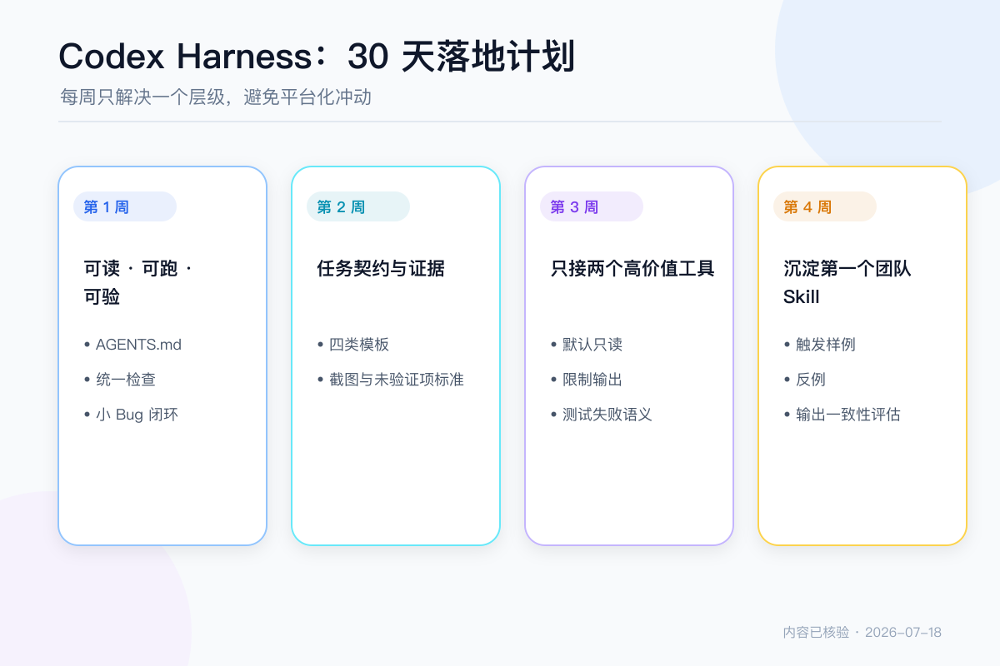

## 十三、可以直接复制的团队检查清单

### 开工前

- 当前目标是否只有一种合理解释？如果不是，是否已确认？
- 是否读取了作用域内的 `AGENTS.md` 和相关规则？
- 工作区是否有他人改动？本次文件所有权是否清楚？
- 事实来源在哪里？哪些是实时信息，哪些可能过时？
- 是否定义了非目标，防止顺手扩张？
- 是否知道完成后跑什么检查？
- 是否涉及生产、数据删除、权限或对外发送？

### 实现中

- 是否先找了现有相似实现？
- 是否保持最小改动，没有重构无关代码？
- 是否在每个小阶段运行相关验证？
- 新增依赖是否真的必要？
- 工具输出是否来自当前真实环境？
- 是否把秘密、用户数据或内部地址写入文件与日志？
- 遇到失败时是否记录原因，而不是悄悄换成未经验证的假设？

### 交付前

- 目标验收是否逐条有证据？
- 测试是否覆盖正常路径和关键失败路径？
- 构建、静态检查和仓库专用检查是否通过？
- UI 是否经过真实用户路径而不只是看代码？
- 数据变更是否测试回滚？
- Git diff 是否只有任务相关变化？
- 文档、示例和运行手册是否同步？
- 是否明确列出未验证项和剩余风险？

### 团队每月清理

- 哪些 `AGENTS.md` 规则已经过时或重复？
- 哪些文档与当前代码行为冲突？
- 哪些 Skill 从未触发或触发过宽？
- 哪些 MCP 没有增量价值或权限过大？
- 哪些工具经常返回超大内容？
- 哪些失败在一个月内重复三次以上？
- 哪些人工 Review 意见可以写成测试或 lint？
- 哪些后台自动化产生的噪音比价值更多？

## 十四、最后：代码成本下降，标准不能一起下降

写完这篇文章，我更确定一件事。

AI Coding 真正改变的，不只是写代码的速度，而是工程工作的重心。

以前，工程师的大量时间花在把明确方案翻译成代码。现在，这部分成本正在快速下降。于是那些过去被手工编码掩盖的问题全都浮上来：需求到底清不清楚，架构边界有没有写明，系统是否可观察，测试能不能证明结果，失败有没有恢复路径，团队知识能不能被复用。

Codex 越强，这些问题越重要。

一个没有 Harness 的强 Agent，像一辆马力越来越大的车，却没有稳定道路、仪表盘和刹车。它当然能跑得很快，也能更快地跑错。

一个好的 Harness 不会要求人预测所有错误。它做的是把高频、可验证、可恢复的部分系统化，让错误尽量早出现、影响尽量小、证据尽量清楚。

我不认为未来工程师会完全离开代码，也不认为所有 Review 都应该交给 Agent。哪些判断该由人保留，哪些经验值得编码进系统，本身就是长期演化的问题。

但有一个方向已经很清楚：人的价值正在从“亲手完成每一步”，转向“设计一个能让正确结果反复出现的环境”。

工具会换，模型会升级，今天的 Codex 也一定会继续变化。

真正能留下来的，是团队把判断沉淀成上下文、工具、状态、评估和边界的能力。

所以，如果你准备在团队里推广 Codex，先别急着问“它一天能写多少行”。

先问：

它能不能找到正确事实？

它知不知道哪里不能碰？

它做完之后能不能自己证明？

它失败以后能不能安全恢复？

这四个问题答得越清楚，Codex 才越像生产力，而不是一次漂亮演示。

**人负责方向与判断，Agent 负责执行，Harness 负责让正确经验不断复利。**

这才是我真正想驾驭的 AI Coding。

## 附录：四份可以直接放进仓库的模板

长文最后，我把最容易落地的四份模板留下来。不要原样照搬所有字段，先删掉与你项目无关的部分，再补真正存在的约束。

### 模板一：复杂任务执行计划

```markdown
# Execution Plan: <task name>

## Goal
一句话说明用户最终能得到什么结果。

## Current facts
- 已从代码、文档或工具确认的事实；
- 每条事实尽量指向文件、链接或命令输出；
- 无法确认的内容单独列出，不混入事实。

## Scope
- 本次会修改的模块和文件范围；
- 允许新增的资产；
- 需要兼容的现有行为。

## Non-goals
- 明确不做的功能；
- 不进行的重构；
- 不触发的外部动作。

## Decisions
- 关键方案及理由；
- 被放弃的备选方案与代价；
- 需要人工判断的节点。

## Steps
1. 动作 → 验证方法 → 失败恢复；
2. 动作 → 验证方法 → 失败恢复；
3. 动作 → 验证方法 → 失败恢复。

## Acceptance criteria
- [ ] 正常用户路径；
- [ ] 关键异常路径；
- [ ] 权限与数据边界；
- [ ] 构建、测试和文档；
- [ ] 可观察证据。

## Delivery
- 改动摘要；
- 已运行检查；
- 证据位置；
- 未验证项；
- 剩余风险。
```

这份计划有两个使用原则。

其一，计划必须跟着事实更新。实现中发现原假设错误，直接记录新事实和决策，不要为了显得计划准确而继续走旧路。

其二，完成步骤不等于完成目标。即使所有任务框都打勾，只要验收标准没满足，任务就没有完成。

### 模板二：Bug 修复契约

```markdown
# Bug Contract: <issue>

## Observed behavior
- 环境、版本、账号或数据前提；
- 用户实际看到什么；
- 日志、截图、错误码或失败测试。

## Expected behavior
- 正确结果；
- 哪些现有行为必须保持不变。

## Reproduction
1. 明确、可重复的步骤；
2. 最小测试数据；
3. 失败证据的保存位置。

## Root cause
- 直接原因；
- 为什么现有测试没有拦住；
- 是否存在同类位置。

## Fix boundary
- 允许修改的文件；
- 明确不做的邻近重构；
- 可能影响的接口与数据。

## Regression evidence
- 修复前测试失败；
- 修复后目标测试通过；
- 相关回归测试通过；
- 真实用户路径通过。
```

这里最值钱的一行是“为什么现有测试没有拦住”。如果每次只补代码、不补防线，同一类错误还会换一个位置回来。

### 模板三：高影响动作确认单

当任务涉及生产、权限、删除、批量写入或外部发送时，不要用一句“确认吗”应付。

```text
动作：将 v2.4.1 部署到生产环境
精确目标：production / api-service / ap-shanghai
将改变：应用镜像与两个环境变量
不会改变：数据库 Schema、对象存储、用户权限
影响窗口：预计 5 分钟滚动更新
前置证据：预发布测试通过；镜像摘要已记录；当前告警为 0
回滚方式：恢复上一镜像 v2.4.0，预计 3 分钟
停止条件：错误率超过 1%；健康实例低于 80%；出现数据写入异常
需要确认：是否按以上目标执行生产部署
```

这种确认把动作、目标、影响和恢复都摆在同一处。用户确认的是一件精确事情，而不是给 Agent 一张含糊的无限授权书。

### 模板四：最终交付报告

```markdown
## Outcome
用两三句话说明用户现在得到了什么。

## Changed
- 文件或外部对象；
- 行为变化；
- 重要设计选择。

## Verified
- `command`：结果；
- 用户路径：结果；
- 数据或日志证据：位置。

## Not verified
- 因权限、环境或缺少输入无法确认的事项。

## Risks
- 仍然存在的真实风险，不写泛泛提醒。

## Next action
- 只有确实需要用户继续做的事情才列出。
```

交付报告不要复述所有过程。用户最关心的是结果、证据和剩余风险。过程细节应该已经留在计划、日志或 Git 历史里。

## 附录：场景与 Harness 控制面的对应表

最后再给一张排查表。当 Codex 表现不好时，可以先看缺的是哪一层，而不是立即换模型。

| 现象 | 更可能缺失的控制面 | 优先动作 |
|---|---|---|
| 每次生成的目录结构不同 | 上下文与架构约束 | 写目录地图，增加结构测试 |
| 经常调用不存在的字段 | 实时事实工具 | 提供只读 Schema 或自动生成文档 |
| 任务做到一半忘记目标 | 计划与状态 | 将验收、进度和决策写入计划文件 |
| 总说测试通过却无法复现 | 评估与证据 | 统一检查命令，保存原始输出 |
| 页面代码正确但视觉错位 | 浏览器可见性 | 提供可启动环境、路径和截图标准 |
| 同一种坏模式到处复制 | 约束与垃圾回收 | 架构 lint、黄金原则、周期扫描 |
| 工具一多上下文就爆 | 工具输出预算 | 按需加载、限制响应、先摘要后下钻 |
| 每一步都需要人批准 | 权限分级不清 | 自动化只读和本地可逆动作 |
| Agent 擅自扩大修改范围 | 任务边界 | 写 Scope、Non-goals 和文件所有权 |
| 不同成员得到不同流程 | 团队 Skill | 固化触发条件、步骤、输出与评估 |
| 恢复任务时重复调查 | 状态与长期记忆 | 记录已验证事实、风险和下一步 |
| 线上问题只能靠人切系统 | 观测工具 | 暴露受限日志、指标、追踪查询 |
| Review 全是风格意见 | 评估标准 | 指定正确性、安全和触发条件 |
| 自动化运行很多却没人看 | 价值观测 | 统计采纳率、噪音和维护成本 |

如果一个问题横跨多层，先修最底部的事实和可运行性。Codex 连项目都启动不了时，增加一套复杂多 Agent 编排没有意义；Schema 都不准确时，优化 Prompt 只是在优化猜测。

## 附录：如何判断 Harness 投入有没有回报

最后一个问题很现实：做这些事情需要时间，怎样知道不是又建了一套没人用的平台？

我不会只看代码行数、Token 数或 Agent 调用次数。这些是活动，不是价值。

更值得跟踪的是：从需求确认到首个可审查版本的时间；一次 Review 通过率；因遗漏上下文造成的返工次数；Bug 从报告到稳定复现的时间；任务中人工复制粘贴次数；失败后恢复耗时；同类问题是否重复出现；新成员完成第一个真实任务的时间。

还要记录负指标：工具维护时间、误触发次数、无效 Review 数、过大上下文比例、自动化噪音、权限审批等待、因错误写操作造成的恢复成本。

一个工具即使每周节省两小时，如果每周需要三小时维护，就应该删除或简化。一个严格检查即使拦住很多提交，如果大部分都是误报，也会被团队绕过。

我建议每项 Harness 投入都写一个最小假设：

```text
假设：提供只读数据库 Schema 后，Codex 生成错误字段的次数会下降。
观察窗口：四周。
基线：最近 20 个数据库任务中有 6 个字段错误。
成功标准：错误降至 2 个以内，且工具维护低于每周 30 分钟。
停止条件：没有改善，或权限与维护成本超过收益。
```

Harness 也需要接受选择。有效的保留，无效的删除，模糊的继续小范围试验。没有任何配置因为“已经花了很多时间”就值得永久存在。

这套衡量方式最终保护的，仍然是稀缺的人类注意力。

## 附录：公众号发布前的最后一次人工检查

技术校验通过以后，我还会在微信编辑器里做一次人工预览。因为 Markdown 合法，不等于手机阅读舒服。

先看标题。标题要准确表达“我用 Codex 重做团队规范”，不能把 OpenAI 官方实验写成我的个人成绩，也不能为了点击率暗示 Codex 可以无人值守地解决所有工程问题。

再看开头。读者在前三屏内应该知道三个事实：我为什么重写、原文与本文的关系、本文提供什么增量。如果前三屏仍然在解释抽象概念，就要继续删。

然后看段落。手机屏幕上一段超过六七行会显得很重。表格如果被压得无法阅读，就改成分点或拆成图片。代码块要检查横向滚动，重要结论不能只藏在代码块里。

图片按顺序逐张检查：是否真的加载、是否清晰、说明是否和正文一致、前后两张是否重复表达、有没有账号、路径、令牌、内部地址和私人对话。截图中即使只有一小块敏感信息，也应该重新裁剪或用脱敏环境重拍，不能用模糊马赛克掩盖侥幸。

外部链接逐个打开。官方资料优先链接原始页面；产品能力、日期和数字重新核对；无法稳定访问的链接，在正文中保留足够的来源名称，避免链接失效后完全失去出处。

最后用读者视角快速滑一遍，观察节奏：故事、解释、表格、图片、清单是否交替出现；有没有连续几个章节都在重复“不要盲信 AI”；有没有为了超过原文字数而留下可以删除的同义句。

字数要求是本次任务的硬约束，但“更多”不应该等于注水。超过原文的部分必须提供新的 Codex 控制面、真实执行过程、可复制模板或更完整的风险边界。否则宁愿补案例和证据，也不增加空洞形容词。

发布前我会留下这份确认记录：

```text
标题与摘要：已人工确认
第一人称事实：已与真实经历对照
官方数字与日期：已重新打开来源核对
正文与图片数量：已运行统计
所有本地图片：已检查存在和尺寸
微信手机预览：已检查段落、表格和代码块
敏感信息：已逐图检查
外部链接：已抽查或全量检查
未验证项：已在文末说明
```

Harness 能把大量确定性检查自动化，但发布按钮前的最后判断仍然属于作者。系统负责让证据集中、风险可见；作者负责决定这些内容是否值得用自己的名字发出去。

---

## 资料与说明

- 原始启发文章：[腾讯技术工程：《驾驭 AI Coding：一份面向团队的 Harness Engineering 落地规范》](https://mp.weixin.qq.com/s/g4nTfxm7ebzRwkAVIGdIbg)。本文不是逐段替换产品名，而是结合 Codex 工作方式重新组织、扩写并加入本次任务的真实验证过程。
- 核心案例来源：[OpenAI：Harness engineering: leveraging Codex in an agent-first world](https://openai.com/index/harness-engineering/)。文中的团队规模、周期、代码量、PR 数和效率判断均按官方文章表述。
- Codex 场景参考：[OpenAI Developers：Codex use cases](https://developers.openai.com/codex/use-cases)。
- 产品能力与页面会持续变化。本文基于 2026 年 7 月 18 日可核对的官方资料与本地 Codex 工作流；未来转载或执行配置前，请再次查阅官方文档。
- 本文所有第一人称操作均指向本次真实写作流程或作者实际采用的方法。未把腾讯原文中的 CodeBuddy/Knot 项目经历冒充为 Codex 实测。
