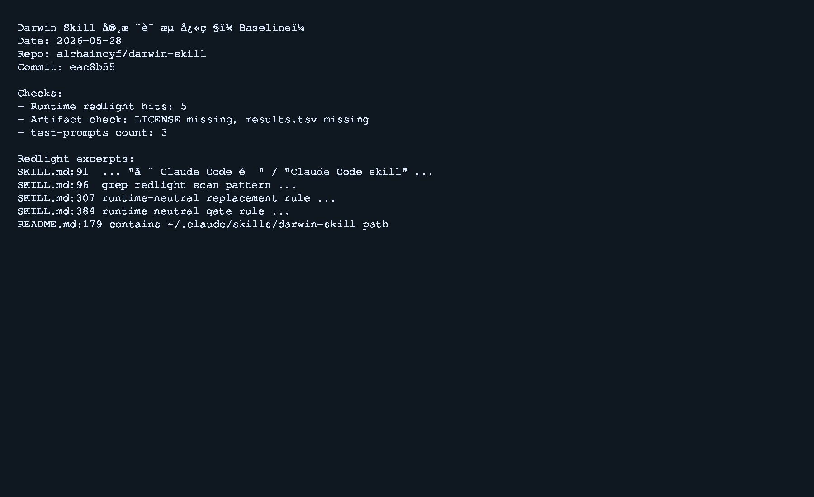
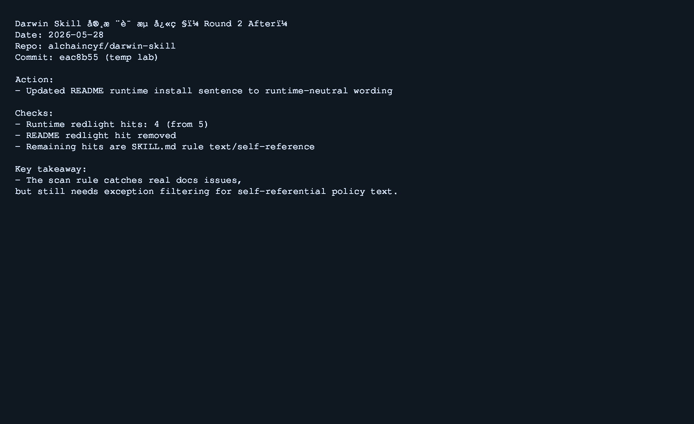
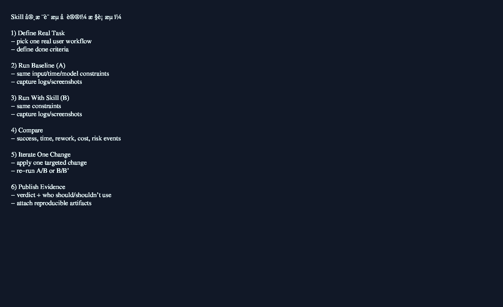

# Skill 实战评测协议（先实战、后结论）

这份协议的目标是避免“只看 README 就下结论”。
方法是先跑真实任务，再基于证据输出评测结论。

## 本次实战样例（2026-05-28）

| 项目 | 值 |
| --- | --- |
| 被测 skill | `alchaincyf/darwin-skill` |
| 实验目录 | `/tmp/skill-eval-lab-darwin` |
| 基线提交 | `eac8b55` |
| 实战目标 | 验证 runtime-neutral 规则是否能识别真实问题，并做一轮可量化优化 |

### 实战步骤与结果

1. 拉取仓库并执行红灯扫描（项目内置规则）：

```bash
grep -nE "(在 Claude Code|Claude Code skill|Claude Code 用户|Cursor only|Codex 中|^\[!\[Claude Code|~/\.claude/skills/[a-z]|/plugin install\b)" SKILL.md README.md 2>/dev/null
```

基线结果：`5` 条命中。
其中 `README.md` 有 1 条真实问题：安装说明写死到 `~/.claude/skills/...`。

2. 执行一轮单点优化（只改 runtime-neutral 文案，不改其他维度）：

- 把 README 中安装文案改为：
  - `把 SKILL.md 放到你正在使用的 skills 目录即可`

3. 复测同一命令：

- 命中条数：`5 -> 4`
- 下降的 1 条来自 README 真实问题修复。
- 剩余 4 条都在 `SKILL.md` 内部说明文本，属于“规则自引用”命中。

4. 额外基线检查：

- `test-prompts.json` 数量：`3`（满足 2-3 条常见场景要求）
- 证据文件：`references/skilllens-evidence.md`、`references/runtime-neutrality.md` 存在
- 缺失：`LICENSE`、`results.tsv`

### 实战截图（日志快照）





## 复用协议（你后续每个 skill 都按这个跑）

### Step 0: 锁定任务

- 只选真实会做的任务，不选 demo 题。
- 明确完成标准（done definition）。

### Step 1: 固定约束

- 固定输入、模型、时间预算、运行次数、环境版本。
- 不允许在 A/B 组之间切换条件。

### Step 2: 跑基线（A 组）

- A 组 = 不用该 skill（或旧版 skill）。
- 记录完整证据：命令、输出、耗时、失败点、返工点。

### Step 3: 跑目标组（B 组）

- B 组 = 使用该 skill（或新版 skill）。
- 与 A 组保持完全同约束。

### Step 4: 对比结论

至少输出这 6 项：

1. 成功率（任务是否完成）
2. 总耗时（端到端）
3. 返工次数（修正次数）
4. 稳定性（同条件重复差异）
5. 成本（token/调用/人工介入）
6. 风险事件（越权、误删、错误回滚）

### Step 5: 单点改进 + 复测

- 每轮只改一个维度，便于归因。
- 复测同一任务，确认是否有量化提升。
- 无提升则回滚，不堆冗余改动。

### Step 6: 发布评测卡

结论必须包含：

- 适合谁
- 不适合谁
- 明显收益场景
- 高风险场景
- 是否值得长期使用

## 标准输出模板

```md
## Verdict
- 结论：Pass / Conditional Pass / Fail
- 时间范围：测试日期 + 工具版本

## Evidence
- 任务：...
- 约束：...
- A 组结果：...
- B 组结果：...
- 关键日志/截图：...

## Decision
- 适合人群：...
- 不适合人群：...
- 建议上线范围：...
- 下轮优化点：...
```
