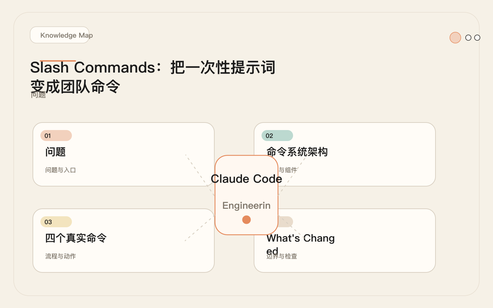
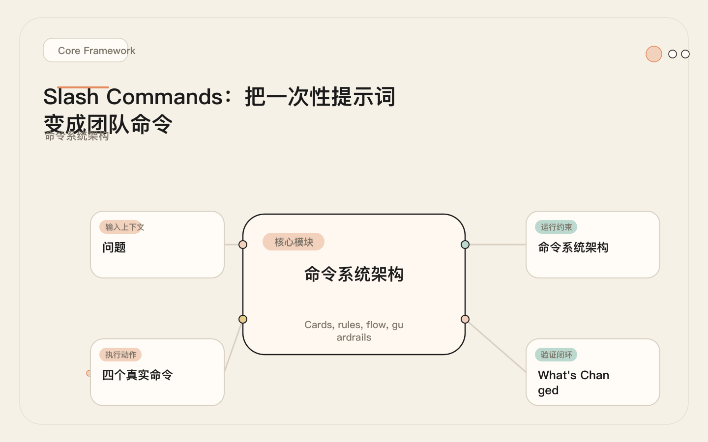
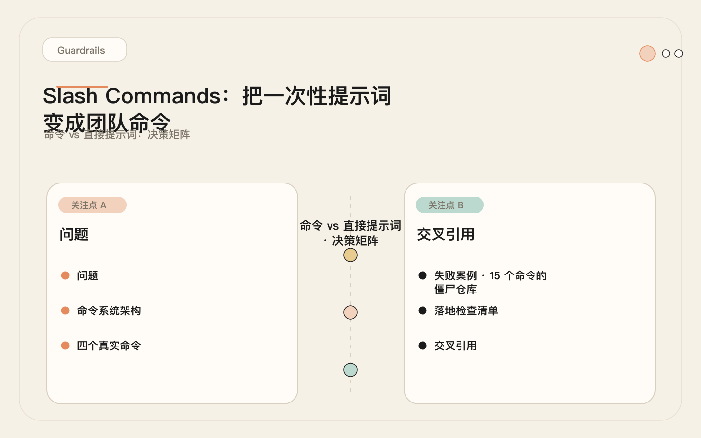
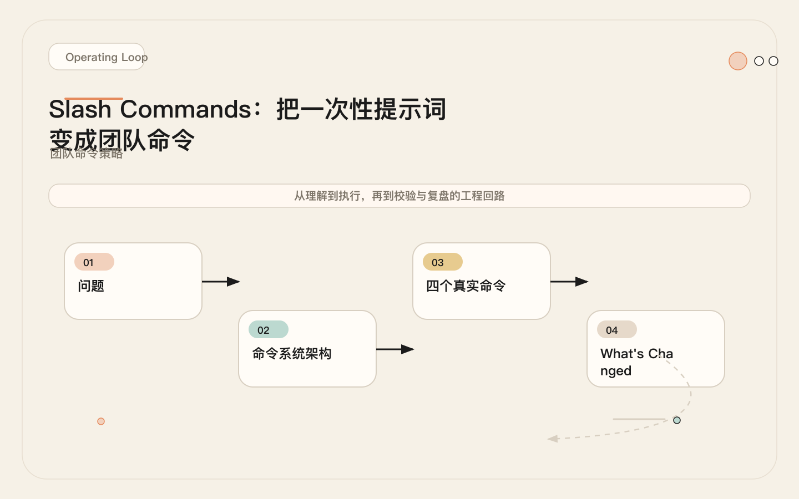

# Slash Commands：把一次性提示词变成团队命令

<!-- codex:cover ../../../assets/claude-code-engineering/07-slash-commands-cover.svg -->

<!-- /codex:cover -->

**TL;DR：** Slash Commands 是 `.claude/commands/` 里的 Markdown 文件，按需加载，用 `$ARGUMENTS` 参数化。它解决的是"第三次重复写同一段提示词"的问题——把高频、短流程的任务固化成版本化文件，消除提示词漂移，统一团队输出标准。

## 问题

同一个团队里，每个人都手写"帮我 review 一下代码"。A 写的 prompt 关注安全，B 关注性能，C 啥都关注但写了两千字。结果同一种任务，Claude Code 每次拿到的上下文和判断标准都不一样。

<!-- codex:illustration 07-slash-commands/01-overview-knowledge-map.svg -->

<!-- /codex:illustration -->

这不是风格问题，是工程问题。没有标准化的任务定义，就没有可度量的输出质量。更糟糕的是，当有人离职或者换项目时，他写的那段"好用"的提示词也跟着消失了——知识没有被沉淀，只是暂时停留在某个人的终端历史里。

Slash Command 的本质：**把散落在每个人脑子里的任务模板，变成仓库里的版本化文件。** 它和 CLAUDE.md 的区别是加载时机——CLAUDE.md 每次会话全量加载，Command 只在调用时加载。这意味着 Command 里写再长的提示词也不会拖慢日常会话。

这带来一个关键推论：**命令的长度不会惩罚不使用它的人。** 一个 80 行的 `/review` 命令，只有调 `/review` 的那个会话才承担这 80 行的 Token 成本。其余 99% 的会话完全不受影响。这个属性让命令成为"安全的长提示词容器"——审查标准写多详细都行，不会像 CLAUDE.md 那样挤占全局上下文。

## 命令系统架构

### 文件结构

<!-- codex:illustration 07-slash-commands/02-framework-core-structure.svg -->

<!-- /codex:illustration -->

```
.claude/commands/
├── review.md          → /review
├── fix-test.md        → /fix-test
├── release-notes.md   → /release-notes
└── commit.md          → /commit
```

命令就是 Markdown 文件。文件名即命令名，去掉 `.md` 后缀就是调用方式。例如 `fix-test.md` 对应 `/fix-test`。命令文件支持子目录组织：`.claude/commands/db/migrate.md` 对应 `/db:migrate`。子目录用冒号分隔，这为大型项目提供了命名空间。

### Frontmatter

文件顶部可以用 YAML frontmatter 声明元数据：

```yaml
---
name: review
description: "Review current diff for correctness, security, and test coverage."
---
```

`name` 字段覆盖文件名作为命令标识。`description` 在命令列表中展示，帮助团队成员发现和选择命令。如果省略 frontmatter，文件名就是命令名，第一行会被当作描述。

一个常见的错误是在 `description` 里写技术实现细节。`description` 的读者是团队里不太熟悉命令的人——它应该回答"这个命令干什么"，而不是"这个命令怎么实现"。好的描述："Review current diff for correctness, security, and test coverage."。坏的描述："Runs git diff and applies a structured review template with severity classification."。前者是用途，后者是机制。

### $ARGUMENTS 占位符

`$ARGUMENTS` 是命令体内的动态参数。用户输入 `/review src/auth/` 时，`src/auth/` 会替换命令体里所有 `$ARGUMENTS` 出现的位置。

```
Review the diff in $ARGUMENTS.
```

如果用户不传参数，`$ARGUMENTS` 被替换为空字符串。命令设计需要处理这个场景——要么在提示词里给默认值，要么明确要求用户提供参数。这是命令设计中最容易被忽略的细节，也是导致"命令有时候不好用"的头号原因。

举例：`/review src/auth/` 展开后变成 "Review the current git diff src/auth/"——审查范围限定在 auth 目录。`/review` 不带参数展开后变成 "Review the current git diff"——审查整个 diff。两种情况都能工作，因为提示词里的 `$ARGUMENTS` 位置设计成了"可选后缀"。

### 加载机制

```
CLAUDE.md：每次会话启动 → 全量注入上下文 → 持续消耗 Token
Rules：匹配路径时 → 按需注入 → 匹配即消耗
Command：用户调用时 → 一次性注入 → 仅该轮消耗
Skill：触发任务时 → 按步骤注入 → 任务期间消耗
```

Command 的 Token 成本是"用多少付多少"。不调用就是零成本。这个特性决定了它的适用范围——适合高频但不连续的任务。

对比一下加载行为的差异：假设你的团队有 5 个命令，每个平均 400 tokens。一天 10 次会话，其中 3 次调用了命令。用 Command 方案，命令相关的 Token 消耗是 3 x 400 = 1200 tokens。如果把这些内容全塞进 CLAUDE.md（2000 tokens），10 次会话的总消耗是 10 x 2000 = 20000 tokens。前者是后者的 6%。这就是按需加载的经济意义。

## 四个真实命令

### /review：代码审查

```markdown
---
name: review
description: "Review current diff for correctness, security, and missing tests."
---

Review the current git diff$ARGUMENTS.

Produce a structured review with three sections:

## Findings
For each finding, provide:
- **Location**: file:line
- **Severity**: CRITICAL / HIGH / MEDIUM / LOW
- **Category**: bug | security | performance | maintainability | style
- **Description**: What is wrong and why it matters
- **Suggestion**: Concrete fix (code snippet preferred)

## Summary
- Total findings by severity
- Overall risk assessment for this change

## Verification Gaps
- Which behavior changes lack test coverage?
- Which edge cases are untested?

Rules:
1. Report findings first, summary last. Do not open with praise.
2. Prioritize correctness and security over style.
3. Cross-reference project rules in CLAUDE.md.
4. If the diff is empty, check staged changes: `git diff --cached`.
```

关键设计点：要求"findings first, summary last"——防止模型用一段总结稀释关键发现。Severity 用固定枚举值（CRITICAL / HIGH / MEDIUM / LOW），让下游工具（CI 流水线、Slack 通知）可以解析。Category 也用固定值，方便后续按类别统计审查发现的分布。

一个容易忽略的细节是第四条规则："If the diff is empty, check staged changes"。用户经常在 `git add` 之后调 `/review`，此时 `git diff` 输出为空。没有这条规则，模型会报告"没有变更可审查"。有了这条规则，它会自动检查 `git diff --cached`。这是从真实使用中反馈回来的改进——第三次遇到空 diff 之后就把它加进了命令。

### /fix-test：测试修复流程

```markdown
---
name: fix-test
description: "Diagnose and fix failing tests with structured diagnostic steps."
---

Fix the failing test(s): $ARGUMENTS

Follow this diagnostic workflow:

## Step 1: Reproduce
- Run the failing test command exactly as the project defines it.
- Capture the full error output.

## Step 2: Diagnose
- Read the test file and the source file under test.
- Identify the root cause. Classify it:
  - **Assertion mismatch**: Test expectation is wrong.
  - **Implementation bug**: Source code has a defect.
  - **Environment issue**: Missing fixture, wrong config, race condition.
  - **API change**: Interface changed but test was not updated.

## Step 3: Fix
- If assertion mismatch: Update the test. Explain why the old assertion was wrong.
- If implementation bug: Fix the source. Show the minimal diff.
- If environment issue: Fix the setup. Do not modify test logic to work around it.
- If API change: Update the test to match new interface. Flag if this is a breaking change.

## Step 4: Verify
- Re-run the failing test in isolation.
- Run the full test suite for the affected module.
- Report: test name, root cause classification, files changed, verification result.

Rules:
- Do not skip or comment out failing tests.
- Do not add .skip() or xit without explicit justification.
- If the fix is unclear, stop and report the diagnosis. Do not guess.
```

关键设计点：诊断分类（Assertion mismatch / Implementation bug / Environment issue / API change）让修复路径明确，防止模型用"可能是缓存问题"这种模糊解释跳过诊断。每个分类对应不同的修复策略——实现 bug 修源码，断言不匹配修测试，环境问题修配置。这比"帮我修一下这个失败的测试"的通用 prompt 效果好得多，因为模型不需要猜测修复方向。

"Do not skip or comment out failing tests"这条规则看起来多余，但实际上是必须的。模型在没有明确指导时，倾向选择阻力最小的路径——跳过失败测试确实能让测试套件通过，但那不是修复。

### /release-notes：变更日志生成

````markdown
---
name: release-notes
description: "Generate release notes from commit history between two refs."
---

Generate release notes for the range: $ARGUMENTS

If no range is provided, use the range from the last tag to HEAD:
`git log $(git describe --tags --abbrev=0)..HEAD --oneline`

Steps:
1. Collect all commits in the range.
2. Classify each commit by type:
   - **feat**: New features
   - **fix**: Bug fixes
   - **breaking**: Breaking changes (contains "BREAKING CHANGE" or "!" after type)
   - **refactor**: Internal changes with no user-facing impact
   - **docs**: Documentation only
   - **chore**: Build, CI, tooling changes
3. Group by type. Within each group, order by impact (user-facing first).
4. For each feat/fix/breaking entry, write one sentence describing the change from the user's perspective. Do not copy-paste commit messages.

Output format:

```
## What's Changed

### Breaking Changes
- **scope**: description (commit abc1234)

### New Features
- **scope**: description (commit abc1234)

### Bug Fixes
- **scope**: description (commit abc1234)

### Internal
- refactor and chore entries, summarized in one paragraph

## Contributors
List unique commit authors.
```

Rules:
- Do not invent changes not present in the commit log.
- Do not evaluate or praise the changes. State facts only.
- If a commit message is unclear, use `git show` to read the diff before summarizing.
````

关键设计点：要求从用户视角重写，而不是复制粘贴 commit message。这个要求在提示词里明确写出来，是因为模型默认行为就是复制粘贴 commit message。"Do not evaluate or praise the changes"也是针对真实问题的——模型在没有这条规则时会生成"this exciting new feature"或"this important bug fix"之类的营销语言。

嵌套的代码块（输出格式模板）是另一个设计细节。命令体内同时有 Markdown 代码块作为输出模板，需要用不同层级的反引号区分。如果出现渲染问题，可以用缩进替代三反引号来标记输出模板。

### /commit：规范化提交

```markdown
---
name: commit
description: "Generate a conventional commit message from current changes."
---

Generate a commit message for the current staged changes.

Steps:
1. Run `git diff --cached` to see what will be committed.
2. If nothing is staged, run `git diff` to show unstaged changes and ask whether to stage them.
3. Analyze the changes:
   - What files were modified/added/deleted?
   - What is the primary purpose of this change?
   - What is the correct conventional commit type?
4. Generate the commit message using this format:

```
<type>(<scope>): <description>

[optional body with 2-4 lines of context]

Co-Authored-By: Claude <noreply@anthropic.com>
```

Type must be one of: feat, fix, refactor, test, docs, chore, ci, perf, build, revert.

Rules:
- Description line: imperative mood, lowercase, no period, ≤72 characters.
- Do not include "Co-Authored-By" if the user did not use Claude Code.
- If the change touches multiple unrelated concerns, suggest splitting into multiple commits.
- Do not stage or commit automatically. Output the message and let the user confirm.
```

关键设计点：最后一条规则"Do not stage or commit automatically"是安全边界。命令只生成消息，不执行提交。把决策权留在人手里。这个设计反映了一个原则：**命令应该是一个强助手，不是一个自动代理。** 它提供建议、执行分析、生成内容，但不做不可逆操作。涉及文件修改和 git 操作的决策权永远在人手里。

Conventional commit type 枚举值是故意固定的。不写 "etc" 或 "and so on"，因为模型会在模糊的枚举里自己发明类型。固定的类型列表让输出可预测，也能被下游工具（CHANGELOG 生成器、语义版本工具）正确解析。

## 命令 vs 直接提示词：决策矩阵

不是所有任务都需要做成命令。以下矩阵帮助判断。

<!-- codex:illustration 07-slash-commands/04-compare-guardrails.svg -->

<!-- /codex:illustration -->

| 判断维度 | 用 Command | 用直接提示词 |
|---------|-----------|-------------|
| **使用频率** | ≥ 3 次/周 | 偶尔一次 |
| **团队复用** | 多人需要相同标准 | 仅个人使用 |
| **输出格式** | 需要一致的固定结构 | 灵活格式即可 |
| **步骤复杂度** | ≥ 3 步诊断/分析流程 | 一两句话能说清 |
| **迭代历史** | 已经改过提示词 ≥ 2 次 | 第一次用，还没验证 |
| **参数化需求** | 需要传入文件路径、范围等 | 不需要 |
| **Token 成本** | 按需加载，不浪费日常 Token | 写在 CLAUDE.md 会持续消耗 |

**决策流程**：

```
任务出现频率 ≥ 3 次/周？
├── 否 → 直接提示词即可
└── 是 → 需要团队统一标准？
    ├── 否 → 个人 CLAUDE.md 或 auto memory
    └── 是 → 输出需要固定格式？
        ├── 否 → 直接提示词 + 复制粘贴
        └── 是 → 封装为 Command
```

举例说明：

- `/review`：代码审查频率高（每次 PR），团队需要统一标准（severity、category），输出格式固定（findings + summary + gaps）→ **Command**。
- `/fix-test`：测试修复频率高，诊断步骤固定（reproduce → diagnose → fix → verify），需要结构化输出 → **Command**。
- "解释一下这个模块的职责"：频率低，不需要固定格式，不需要参数 → **直接提示词**。
- "用 Tailwind 重构这个组件"：频率中，但每次目标不同，不需要团队统一标准 → **直接提示词**。

## 团队命令策略

### 发现值得提取的命令

<!-- codex:illustration 07-slash-commands/03-flow-operating-loop.svg -->

<!-- /codex:illustration -->

命令不是设计出来的，是从重复行为中提取出来的。以下方法帮助识别：

1. **搜索终端历史**：过去两周里，你给 Claude Code 写了哪些超过 100 字的提示词？出现 ≥ 3 次的就是候选。
2. **收集团队抱怨**："每次 review 质量都不一样""测试修复太慢了"——这些抱怨背后是需要标准化的流程。
3. **审查 CLAUDE.md**：如果 CLAUDE.md 里有超过 30 行的流程描述（部署步骤、发布检查清单），它应该在 Command 里，不该在 CLAUDE.md 里。

### 命名规范

```
动词-名词 格式：
/review        → 审查当前 diff
/fix-test      → 修复失败测试
/release-notes → 生成发布说明
/commit        → 生成提交消息
/update-deps   → 更新依赖
/migrate-db    → 执行数据库迁移
```

规则：
- 用动词开头：review、fix、generate、update、migrate、explain。
- 用连字符分隔：`fix-test` 而不是 `fixTest` 或 `fix_test`。
- 一个命令一个任务：不要做 `/review-and-fix`，拆成 `/review` 和 `/fix`。

### 参数设计

`$ARGUMENTS` 的设计需要考虑默认值和可选性：

```
# 好的设计：有明确默认值
Review the current git diff$ARGUMENTS.
# 不传参数 → 审查整个 diff
# 传参数 → 审查指定路径，如 /review src/auth/

# 坏的设计：参数是必须的但没有说明
Fix $ARGUMENTS
# 不传参数 → "$ARGUMENTS" 被替换为空字符串，模型不知道修什么
```

推荐模式：

```
# 模式 A：可选路径过滤
Review the diff$ARGUMENTS (leave empty for full diff).

# 模式 B：必须参数 + 错误提示
Fix the failing test: $ARGUMENTS
If no test path is provided, list all failing tests and ask which one to fix.

# 模式 C：结构化参数
Generate release notes for: $ARGUMENTS
Acceptable formats: "v1.2.0..HEAD", "main..feature-branch", or leave empty for last-tag..HEAD.
```

### 维护生命周期

命令不是写了就完。它有自己的生命周期：

```
1. 发现期 → 发现重复提示词，手动写 prompt ≥ 3 次
2. 提取期 → 把 prompt 固化为 .md 文件，提交到仓库
3. 验证期 → 在 3-5 个真实任务上试用，收集误判和漏判
4. 稳定期 → 命令文本基本不再变动，团队广泛使用
5. 淘汰或升级期 → 要么废弃，要么升级为 Skill
```

**淘汰信号**：
- 连续 2 周没人调用 → 删除或归档。
- 命令文件超过 50 行 → 评估是否升级为 Skill（见第 08 篇）。
- 命令内容和 CLAUDE.md 重复 → 删除命令，保留 CLAUDE.md 里的规则。

## Token 成本分析

Command 的核心经济优势是按需加载。以下用真实数据对比。

**场景**：一个 8 人团队，仓库有 120 行的 CLAUDE.md（约 1800 tokens），3 个命令（平均每个约 400 tokens）。

### 不用命令：所有规则塞 CLAUDE.md

```
每次会话 Token 开销（Claude Sonnet 200K 上下文）：
├── 系统提示词            ~3,000 tokens
├── CLAUDE.md（膨胀版）   ~4,200 tokens  ← review 规则 + fix-test 流程 + commit 规范全在里面
├── Rules 文件            ~400 tokens
├── 用户消息              ~1,000 tokens
├── 工具调用 + 结果       ~15,000 tokens（中等复杂任务）
└── 历史对话              ~20,000 tokens
    ─────────────────────────────────
    合计                  ~43,600 tokens
    剩余推理空间          ~156,400 tokens

问题：一个"改按钮颜色"的任务，加载了 review 规则、test-fix 流程和 commit 规范，
但这些内容只在特定场景才需要。2400 tokens 的无效加载。
```

### 用命令：CLAUDE.md 精简 + 按需调用

```
日常会话（无命令调用）：
├── 系统提示词            ~3,000 tokens
├── CLAUDE.md（精简版）   ~1,800 tokens
├── Rules 文件            ~400 tokens
├── 用户消息              ~1,000 tokens
├── 工具调用 + 结果       ~15,000 tokens
└── 历史对话              ~20,000 tokens
    ─────────────────────────────────
    合计                  ~41,200 tokens
    节省                   ~2,400 tokens（5.5%）

调用 /review 时：
├── 基础开销             ~41,200 tokens
├── /review 命令注入      ~400 tokens
├── diff 内容             ~8,000 tokens
└── review 输出           ~2,000 tokens
    ─────────────────────────────────
    合计                  ~51,600 tokens
    命令边际成本           ~10,400 tokens（仅本次会话）

调用 /commit 时：
├── 基础开销             ~41,200 tokens
├── /commit 命令注入      ~350 tokens
├── staged diff           ~1,200 tokens
└── commit 消息输出       ~200 tokens
    ─────────────────────────────────
    合计                  ~42,950 tokens
    命令边际成本           ~1,750 tokens（仅本次会话）
```

**年度成本估算**（基于 200 个工作日，每天 3 次会话）：

| 策略 | 每日 Token 成本 | 年度 Token 成本 | 浪费比例 |
|------|---------------|----------------|---------|
| 全塞 CLAUDE.md | ~130,800 | ~26.2M | ~15% 无效加载 |
| Command 按需 | ~125,200 + 按需 | ~25.0M + ~0.5M | ~2% 无效加载 |

差距不大是因为单个命令的 token 量小。但当命令数量增加到 10+ 或命令内容变长（>800 tokens each），按需加载的优势会放大。

更实际的场景：假设团队有 8 个命令，每个平均 500 tokens，分布在 review、test-fix、deploy、migration 等不同领域。一个典型的工作日，每个开发者大概调用其中 2-3 个。如果这些全塞进 CLAUDE.md，每天每个会话多消耗 4000 tokens（8 x 500）。一个 10 人的团队，200 个工作日下来，就是 10 x 3 x 200 x 4000 = 2400 万 tokens 的无效加载。按 Claude Sonnet 的定价（约 $3/M input tokens），这就是约 72 美元/年的纯浪费。金额不大，但它挤占的是模型的有效推理空间——每个会话少了 4000 tokens 的思考余地。

**核心洞察**：Command 的主要价值不是省 Token，而是**标准化输出和消除提示词漂移**。Token 节省是副产品。真正的收益是：每个团队成员调 `/review` 得到的都是同一种格式的输出，不需要每次重新教 Claude Code 审查标准。

## 失败案例：15 个命令的僵尸仓库

一个 12 人的后端团队在 monorepo 里创建了 15 个 Slash Commands。三个月后，只有 `/review` 和 `/commit` 被持续使用，其余 13 个要么从未被调用，要么调用结果不如直接写 prompt。这个案例的教训不是"不要创建命令"，而是"没有纪律的命令创建比没有命令更糟糕"——因为 15 个命令的维护成本（保持描述准确、同步业务变更）分散了团队注意力，却没有带来对应的价值。

### 命令清单（名称已脱敏）

```
.claude/commands/
├── review.md           → 高频使用 ✅
├── commit.md           → 高频使用 ✅
├── fix-test.md         → 偶尔使用 ⚠️
├── release-notes.md    → 偶尔使用 ⚠️
├── explain-api.md      → 从未使用 ❌
├── generate-mock.md    → 从未使用 ❌
├── update-deps.md      → 调用过但效果差 ❌
├── migrate-user.md     → 单项目特用，不该做命令 ❌
├── seed-data.md        → 单项目特用，不该做命令 ❌
├── deploy-staging.md   → 内容和部署文档重复 ❌
├── deploy-prod.md      → 内容和部署文档重复 ❌
├── lint-fix.md         → 一句话能说清，直接写就行 ❌
├── format-code.md      → 一句话能说清，直接写就行 ❌
├── check-types.md      → 一句话能说清，直接写就行 ❌
└── onboard.md          → 应该是 Skill，不是 Command ❌
```

### 根因分析

三类失败模式：

**模式 A：边界不清——Command、CLAUDE.md、Skill 混淆**

`deploy-staging.md` 和 `deploy-prod.md` 的内容是从部署文档里复制过来的流程步骤。这些步骤应该写在部署文档里，需要时通过 Skill 加载（见第 08 篇）。做成 Command 的结果是：部署流程更新了，命令文件没同步更新，团队不信命令输出的内容。

`onboard.md` 更是典型——它包含 80 行的项目介绍、架构说明和开发环境搭建步骤。这显然是 Skill 的职责（需要步骤、需要资源、需要长期维护），但被塞进了 Command 格式。

`explain-api.md` 的内容本质上是"读 src/routes/ 目录，解释每个端点的职责"。这个任务不需要标准化输出，每次执行的关注点不同，直接写 prompt 更灵活。

**模式 B：过度具体——单项目特用命令**

`migrate-user.md` 是为用户表迁移写的专用命令。`seed-data.md` 是为开发数据库种子数据写的专用命令。这些命令只在一个项目的一个特定阶段有用。做成命令的理由是"以后可能复用"，但"以后"从未到来。

教训：**不要为假设的复用创建命令。只有真实发生 ≥ 3 次的重复才值得提取。**

**模式 C：过于简单——一句话就是提示词**

`lint-fix.md` 的全部内容是 `Run the linter and fix all auto-fixable issues.`。`format-code.md` 是 `Run the code formatter on all changed files.`。`check-types.md` 是 `Run the type checker and report errors.`。

这些命令的提示词短到没有必要做文件。直接写 `pnpm lint --fix` 的效果一样，甚至更可控。更关键的是，这类操作应该自动化，不应该依赖人记得去调用命令。格式化和类型检查是 PostToolUse Hook 的职责——每次文件修改后自动执行，不需要人工触发。把自动化操作包装成"人工命令"，本质上是把工具的问题转嫁给了人的记忆力。

### 修复方案

```
修改前：15 个命令，2 个高频使用，13 个闲置

修改后：
├── review.md        → 保留，高频使用
├── commit.md        → 保留，高频使用
├── fix-test.md      → 保留，中等频率
├── release-notes.md → 保留，中等频率
├── [其余 11 个删除]
│
├── explain-api      → 不需要命令，直接 prompt 更灵活
├── generate-mock    → 不需要命令，直接 prompt 更灵活
├── update-deps      → 迁移为 CLAUDE.md 规则："更新依赖后运行 pnpm test"
├── migrate-user     → 一次性脚本，不是命令
├── seed-data        → 一次性脚本，不是命令
├── deploy-staging   → 迁移为 Skill（见第 08 篇）
├── deploy-prod      → 合并到 deploy Skill
├── lint-fix         → 迁移为 CLAUDE.md 规则："lint --fix after changes"
├── format-code      → 迁移为 Hook（PostToolUse 自动格式化）
├── check-types      → 迁移为 Hook（PostToolUse 类型检查）
└── onboard          → 迁移为 Skill（需要步骤、资源和长期维护）
```

**Command vs CLAUDE.md vs Skill 边界规则**：

| 内容类型 | 正确位置 | 原因 |
|---------|---------|------|
| 高频多步任务，需要固定输出格式 | Command | 按需加载，不浪费日常 Token |
| 一句话就能说清的规则 | CLAUDE.md | 不值得单独文件 |
| 每次都应该自动执行的操作 | Hook | 确定性 > 提示词 |
| 需要步骤、资源、脚本的复杂流程 | Skill | Command 装不下 |
| 偶尔用一次的灵活任务 | 直接 prompt | 不需要标准化 |

## 落地检查清单

按顺序执行：

- [ ] 仓库里有 `.claude/commands/` 目录
- [ ] 命令数量 ≤ 5 个（初期）。超过 5 个时，用上面的决策矩阵审查每个命令的必要性
- [ ] 每个命令有 frontmatter（至少 `description` 字段），团队成员能在命令列表中理解用途
- [ ] 每个命令用 `$ARGUMENTS` 参数化关键输入，并处理了参数为空的场景
- [ ] `/review` 命令要求 findings first、severity 枚举、verification gaps
- [ ] `/commit` 命令不自动执行提交，只输出消息让用户确认
- [ ] 没有单项目特用的命令——那些是一次性脚本
- [ ] 没有一句话就能说清的命令——那些应该放 CLAUDE.md
- [ ] 没有超过 50 行的命令——超过 50 行考虑升级为 Skill
- [ ] 每个命令在 3 个真实任务上验证过，误判和漏判已反馈进命令文本
- [ ] 团队成员知道命令存在：在 README 或 CLAUDE.md 里列出可用命令

## 交叉引用

- **第 04 篇**（CLAUDE.md）：命令里"一句话就能说清的规则"应该放在 CLAUDE.md，不要单独做命令。Command 和 CLAUDE.md 的 Token 成本差异是分工的基础。
- **第 08 篇**（Command → Skill 升级）：当命令文件超过 50 行、需要资源文件或脚本、或者需要长期迭代时，应该升级为 Skill。本文的失败案例展示了延迟升级的后果。
- **第 09 篇**（SKILL.md 结构）：Skill 的 `Use When` / `Do Not Use When` 设计解决了命令的误触发问题。如果命令经常被错误调用，它更适合 Skill 的触发模式。


