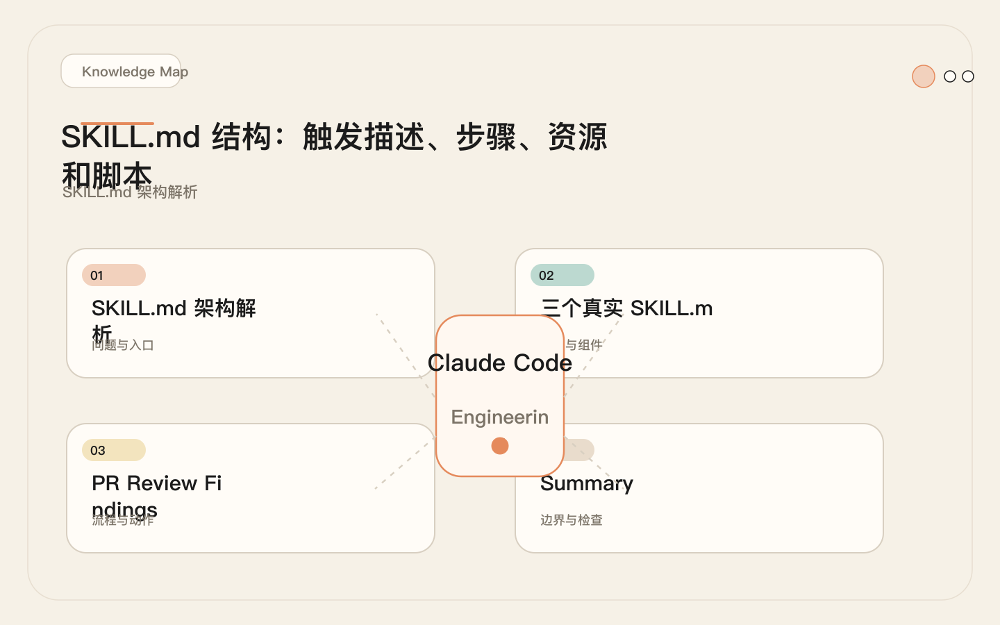
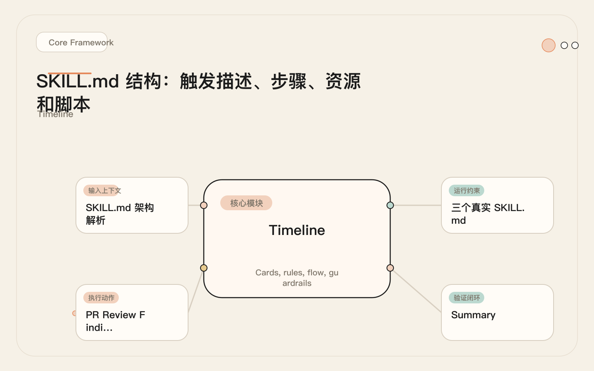
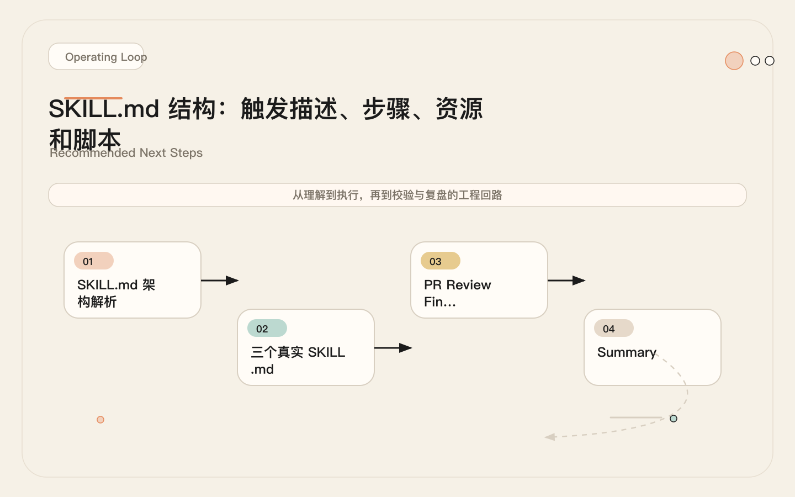
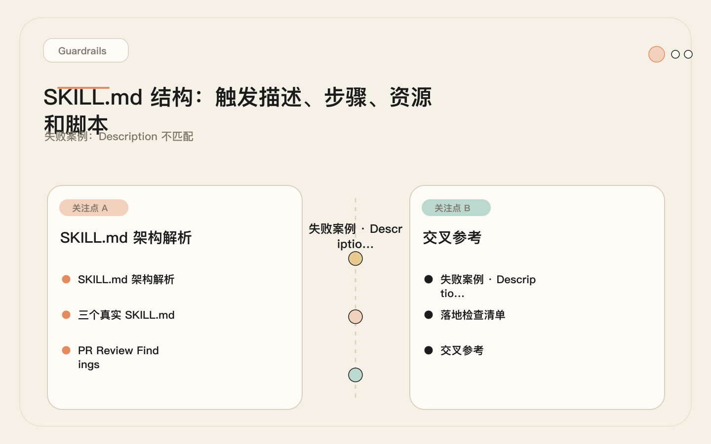

# SKILL.md 结构：触发描述、步骤、资源和脚本

<!-- codex:cover ../../../assets/claude-code-engineering/09-skill-md-structure-cover.svg -->

<!-- /codex:cover -->

**TL;DR：** SKILL.md 是 Claude Code 的最小可执行能力单元。它的结构直接决定了三个结果：能否被正确触发、加载后能否正确执行、执行时 Token 消耗是否可控。写好 SKILL.md 不是写好提示词，是设计好一个可复用的操作规程。

## SKILL.md 架构解析

一个 SKILL.md 由两部分组成：**frontmatter**（YAML 元数据）和 **body**（执行内容）。Claude Code 对这两部分的处理方式完全不同。

<!-- codex:illustration 09-skill-md-structure/01-overview-knowledge-map.svg -->

<!-- /codex:illustration -->

### 加载机制

Claude Code 的 Skill 匹配分两个阶段：

```
阶段 1: 候选扫描
├── 遍历所有已注册 Skill 的 name 和 description
├── 将用户当前任务描述与每个 Skill 的 description 做语义匹配
├── 匹配成功的 Skill 进入候选列表
└── 代价：仅消耗 description 的 Token（通常 20-50 tokens）

阶段 2: 按需加载
├── 从候选列表中选择最匹配的 Skill
├── 将完整 SKILL.md 内容注入上下文
├── 如果 SKILL.md 引用了外部资源（@path），按需读取
└── 代价：整个 SKILL.md 的 Token + 引用资源
```

关键洞察：description 写得不好，Skill 永远不会被加载；body 写得不好，Skill 加载了也执行不对。两者是独立的工程问题。这和传统软件开发中的"接口契约"与"实现逻辑"的区分完全一致：description 是接口签名，body 是实现代码。改 description 影响调用关系，改 body 影响执行质量，不要混为一谈。

### Body 的两种写法流派

实际项目中存在两种 Body 写法，各有适用场景：

**结构化段落式**（Use When / Do Not Use When / Steps / Output）：适合以自然语言指导为主的 Skill。Claude Code 在执行时逐段读取、逐步遵循。优点是可读性强、修改成本低；缺点是步骤之间可能出现歧义，需要模型自行判断细节。

**XML 标签式**（`<objective>` / `<context>` / `<process>` / `<execution_context>`）：适合逻辑严密、引用外部资源多的 Skill。XML 标签提供了更明确的边界，减少段落之间的语义混淆。在真实的复杂项目中（如前文提到的 `gsd-quick` 和 `qros-data-ready-failure`），这种写法更常见，因为它能精确控制加载时机和执行边界。

两种写法没有绝对的优劣，但团队内部应该统一选择一种。混用会导致 Claude Code 在解析不同 Skill 时产生格式预期不一致的问题。

### Frontmatter 字段

```yaml
---
name: skill-identifier          # 必填，kebab-case 标识符
description: "触发匹配文本"       # 必填，Claude Code 用这段文字判断是否加载
argument-hint: "[--flag] [args]" # 可选，参数提示
allowed-tools:                   # 可选，工具白名单
  - Read
  - Write
  - Bash
---
```

每个字段的工程含义：

| 字段 | 必填 | 类型 | 用途 | 常见陷阱 |
|------|------|------|------|----------|
| `name` | 是 | string | Skill 标识符，用于 `/skill-name` 调用 | 太通用（如 `review`）导致和其他 Skill 冲突 |
| `description` | 是 | string | 触发匹配的唯一依据 | 太长（>80 字）→ 语义稀释，匹配精度下降 |
| `argument-hint` | 否 | string | 告知 Claude Code 接受什么参数 | 省略后 Claude Code 不知道该传什么 |
| `allowed-tools` | 否 | list | 限制 Skill 可使用的工具 | 省略意味着使用全局默认工具集 |

### Body 结构

Body 不是自由格式文本。它有明确的结构化分区，每个分区承担不同的工程职责：

```md
# Skill 标题

## Use When
- 明确列出触发条件。Claude Code 参考这段做二次确认。

## Do Not Use When
- 明确列出排除条件。防止误触发的核心手段。

## Steps
- 编号步骤。Claude Code 按序执行。

## Output
- 期望产出。Claude Code 用它做自我验证。

## Resources（可选）
- 引用外部文件。只在需要时加载。
```

`Use When` 和 `Do Not Use When` 的组合构成了 Skill 的**触发边界**。这对上一次测试就能发现问题：5 条应该触发的请求 + 5 条不应该触发的请求（详见第 11 篇评测）。

### 段落长度与模型注意力的关系

Body 各段落不是等权重的。Claude Code 对不同位置的段落注意力分布不均匀，这直接影响规则的遵循效果：

```text
注意力分布规律（基于实际执行的定性观察）：
├── Steps 段落：最高权重，Skill 加载后核心执行依据
├── Use When / Do Not Use When：次高权重，触发判断的关键
├── Output：中等权重，决定产出格式
├── Context：较低权重，提供背景但不直接指导操作
└── Resources：最低权重，通常只在需要时才读取
```

实际含义：关键的约束条件应该写在 Steps 里，而不是藏在 Context 段落中。例如"不要修改 production 配置"这个约束，如果写在 Context 里容易被忽略，写在 Steps 的具体步骤中（"检查目标环境，如果是 production 则终止并报告"）遵循率会高得多。这和 CLAUDE.md 中的规律一致：具体指令比抽象规则的遵循效果好（见第 04 篇）。

## 三个真实 SKILL.md

### 示例 A：简单 —— pr-review

复杂度：单流程，无外部资源，无脚本。Token 消耗约 500。

````md
---
name: pr-review
description: "Review a pull request diff for correctness bugs, security issues, and test coverage gaps"
---

# PR Review

## Use When
- User asks to review a PR or diff
- User shares a GitHub PR URL
- User says "review these changes" or "check this PR"

## Do Not Use When
- User asks to implement changes directly
- User asks to write tests (use test-author skill instead)
- User asks to merge or deploy

## Steps

1. **Identify the diff source**
   - If PR URL provided: `gh pr diff {number}`
   - If branch: `git diff main...HEAD`
   - If files mentioned: `git diff {file1} {file2}`

2. **Classify changes by risk level**
   ```
   HIGH: auth, payment, data mutation, permission changes
   MEDIUM: new API endpoints, config changes, dependency updates
   LOW: documentation, comments, formatting, test-only changes
   ```

3. **Check correctness**
   - For each hunk: does the change do what the commit message says?
   - Are there off-by-one errors, null checks missing, wrong condition logic?
   - Does error handling cover all documented failure modes?

4. **Check security**
   - SQL injection via string interpolation
   - User input used without validation
   - Secrets hardcoded or logged
   - Missing auth/permission checks on new endpoints

5. **Check test coverage**
   - Does the PR include tests for new behavior?
   - Do existing tests cover the modified paths?
   - Are edge cases tested?

6. **Output findings**
   - Order by severity: HIGH → MEDIUM → LOW
   - Each finding: file, line range, category, description, suggested fix

## Output
```
## PR Review Findings

### HIGH Severity
- `src/auth/middleware.ts:45` — Missing token expiry check
  Fix: Add `if (decoded.exp < Date.now() / 1000) throw new AuthError()`

### MEDIUM Severity
- `src/routes/orders.ts:112` — New endpoint lacks rate limiting
  Fix: Add `rateLimit({ windowMs: 60000, max: 100 })` middleware

### Test Coverage Gaps
- No test for `processRefund` error path (order not found)
- Missing integration test for the new `/api/v2/checkout` endpoint

### Summary
- 2 HIGH issues (must fix before merge)
- 1 MEDIUM issue (should fix)
- 2 test coverage gaps
```
````

这个 Skill 只做一件事：读 diff → 分类 → 检查 → 输出。没有外部依赖，没有脚本，没有模板。适合做团队的第一个 Skill —— 逻辑清晰、容易验证触发边界。

设计决策分析：

- **description 包含三个维度**（correctness, security, tests），这使得它在同类请求中触发精度很高，同时不会在"帮我实现这个功能"这类请求中误触发。
- **Do Not Use When 明确排除实现和部署**。没有这个段落，"review 后帮我修一下"这种请求会导致 Skill 加载但 Claude Code 不确定该不该动手改代码。
- **Steps 中的风险分级**（HIGH / MEDIUM / LOW）直接决定输出顺序。这不是装饰性的分类，是控制 Claude Code 注意力分配的手段 —— 它会优先处理高风险项，而不是把所有发现平铺展示。
- **Output 段落给出具体格式**。没有这个段落，Claude Code 会用自己的判断输出，格式每次不同，无法被下游流程（如自动收集 review 结果的工具）消费。

### 示例 B：中等 —— incident-analysis

复杂度：多步骤，引用诊断脚本，有条件分支。Token 消耗约 1200。

```md
---
name: incident-analysis
description: "Diagnose a production incident from alerts, logs, and metrics. Runs triage scripts and produces a structured incident report"
argument-hint: "[--severity critical|high|medium] [--service name] [incident description]"
allowed-tools:
  - Read
  - Bash
  - Glob
  - Grep
---

# Incident Analysis

## Use When
- User reports a production issue or outage
- User shares an alert notification or PagerDuty payload
- User asks "what's going on with {service}"
- User says "investigate this error" with logs or stack traces

## Do Not Use When
- User asks to deploy or roll back (use deploy skill)
- User asks to write a fix (this skill only diagnoses)
- User asks about performance optimization (not incident response)

## Context

This skill diagnoses incidents. It does NOT apply fixes.
After diagnosis, hand off to the appropriate fix workflow.

## Steps

1. **Parse arguments**
   ```bash
   # Extract severity
   echo "$ARGUMENTS" | grep -oP '(?<=--severity )\w+' || echo "undetermined"
   # Extract service name
   echo "$ARGUMENTS" | grep -oP '(?<=--service )\S+' || echo "all"
   ```

2. **Collect diagnostic data**
   Run these in parallel:

   ```bash
   # Recent error logs (last 30 min)
   kubectl logs --since=30m -l app={service} --tail=500 | grep -i "error\|fatal\|panic" > /tmp/incident-errors.log

   # Current resource usage
   kubectl top pods -l app={service} > /tmp/incident-resources.txt

   # Recent deployments
   kubectl rollout history deployment/{service} --revision=0 | head -20 > /tmp/incident-deploys.txt

   # Check health endpoints
   curl -s http://{service}:8080/health | jq . > /tmp/incident-health.json
   ```

3. **Identify incident timeline**
   ```bash
   # Find the first error timestamp
   head -5 /tmp/incident-errors.log | grep -oP '\d{4}-\d{2}-\d{2}[T ]\d{2}:\d{2}:\d{2}'
   # Correlate with recent deployments
   grep -A2 "$(date -v-30M '+%Y-%m-%d')" /tmp/incident-deploys.txt
   ```

4. **Classify incident type**

   | Signal Pattern | Classification | Priority |
   |----------------|---------------|----------|
   | Error spike after deploy | Deployment regression | P1 |
   | Gradual error increase | Degradation / resource exhaustion | P2 |
   | Sudden spike, no deploy | External dependency or config change | P1 |
   | Health check failing | Service crash / OOM | P1 |
   | No errors but slow | Performance issue, not incident | P3 |

5. **Run root cause hypothesis**

   Based on classification, run targeted checks:

   - **Deployment regression**: diff current vs previous config
   - **Resource exhaustion**: check memory/CPU trends over last hour
   - **External dependency**: check outbound connection errors and timeouts
   - **Config change**: check recent ConfigMap/Secret changes

6. **Produce incident report**

## Output

```md
# Incident Report: {timestamp}

## Summary
- **Service**: {service}
- **Severity**: {severity}
- **Classification**: {type}
- **Start Time**: {first_error}
- **Impact**: {affected_users_or_requests}

## Timeline
- {time} — First error observed
- {time} — Error rate exceeded threshold
- {time} — Alert triggered

<!-- codex:illustration 09-skill-md-structure/02-framework-core-structure.svg -->

<!-- /codex:illustration -->

## Root Cause Hypothesis
{description with evidence}

## Evidence
- Error log excerpt: /tmp/incident-errors.log (attached)
- Resource data: /tmp/incident-resources.txt
- Health check: /tmp/incident-health.json

## Recommended Next Steps
1. {immediate action}
2. {follow-up action}
3. {prevention recommendation}
```
```

<!-- codex:illustration 09-skill-md-structure/03-flow-operating-loop.svg -->

<!-- /codex:illustration -->

这个 Skill 引入了三个新要素：`argument-hint` 让 Claude Code 知道可以传参数；`allowed-tools` 限制只能用只读工具（Bash 用于读日志，不是改东西）；步骤中嵌入了具体的 bash 命令作为诊断脚本。条件分支（步骤 4 的分类表和步骤 5 的分支检查）让 Skill 能处理不同类型的故障。

设计决策分析：

- **allowed-tools 限制为只读**。这是故意的设计：incident-analysis 只做诊断，不做修复。如果允许 Write 工具，Claude Code 可能会在诊断过程中"顺手"尝试修复，导致操作不可控。工具白名单是 Skill 级别的安全边界，比在 Steps 里写"不要修改任何东西"可靠得多。
- **步骤 2 要求并行执行**。诊断阶段收集日志、资源数据、部署历史、健康检查——这四个操作互相独立，并行执行可以把 2 分钟的等待压缩到 30 秒。在 Skill 中明确写出"Run these in parallel"比期望 Claude Code 自己判断更高效。
- **步骤 4 的分类表是决策矩阵**。把信号模式直接映射到分类和优先级，消除模型的主观判断空间。没有这个表，Claude Code 会用自己的方式分类，两次分析同一类事故可能给出不同分类。
- **Context 段明确声明边界**："It does NOT apply fixes"。这看似冗余（因为 Do Not Use When 已经说了），但 Context 中的声明会在步骤执行期间持续影响 Claude Code 的行为，而 Do Not Use When 主要在触发判断阶段起作用。

### 示例 C：复杂 —— release-notes

复杂度：多阶段流程，引用模板、脚本和示例文件，有多个资源按需加载。Token 消耗约 3000+。这里展示了渐进式披露的实际应用（详见第 10 篇）。

```md
---
name: release-notes
description: "Generate release notes from git history, categorize changes by type, and format output using the project changelog template. Use when preparing a release or version bump"
argument-hint: "[--from rev] [--to rev] [--version x.y.z] [--unreleased]"
allowed-tools:
  - Read
  - Write
  - Bash
  - Glob
  - Grep
---

# Release Notes Generator

## Use When
- User asks to generate release notes
- User says "prepare the release" or "what changed since..."
- User runs a version bump or tag operation
- User asks for a changelog entry

## Do Not Use When
- User asks about a single commit (use git log directly)
- User asks to create a git tag (use deploy skill)
- User asks to publish a package (use deploy skill)

## Context

This skill produces release notes in the project's standard format.
It reads commit history, categorizes changes, and renders the output template.

## Steps

1. **Determine version range**

   ```bash
   if [ -n "$FROM_REV" ]; then
     RANGE="$FROM_REV..$TO_REV"
   elif [ -n "$VERSION" ]; then
     PREV_TAG=$(git tag --sort=-v:refname | head -1)
     RANGE="$PREV_TAG..HEAD"
   elif echo "$ARGUMENTS" | grep -q "\-\-unreleased"; then
     PREV_TAG=$(git tag --sort=-v:refname | head -1)
     RANGE="$PREV_TAG..HEAD"
   else
     # Default: last 50 commits
     RANGE="HEAD~50..HEAD"
   fi
   ```

2. **Collect and categorize commits**

   Run the collection script:

   ```bash
   # Extract structured commit data
   git log "$RANGE" --pretty=format:'%H|%s|%an|%ai' | \
   while IFS='|' read -r hash subject author date; do
     # Classify by conventional commit prefix
     type=$(echo "$subject" | grep -oP '^\w+' | tr '[:upper:]' '[:lower:]')
     case "$type" in
       feat)     category="Features" ;;
       fix)      category="Bug Fixes" ;;
       perf)     category="Performance" ;;
       refactor) category="Code Refactoring" ;;
       docs)     category="Documentation" ;;
       test)     category="Tests" ;;
       chore|ci) category="Maintenance" ;;
       *)        category="Other" ;;
     esac
     echo "$category|$subject|$hash|$author"
   done | sort
   ```

3. **Check for breaking changes**

   ```bash
   # Find breaking changes (conventional commit ! syntax or BREAKING CHANGE footer)
   git log "$RANGE" --pretty=format:'%B---DELIMITER---' | \
   awk '/BREAKING CHANGE/{found=1} /---DELIMITER---/{if(found) print; found=0}'
   ```

4. **Load template and render**

   Read the changelog template:
   ```
   @$HOME/.claude/skills/release-notes/templates/changelog-entry.md
   ```

   Fill template with categorized commits.
   Breaking changes go first, with migration instructions if available in commit body.

5. **Cross-reference with issues**

   ```bash
   # Extract issue references from commits
   git log "$RANGE" --pretty=format:'%s %b' | \
   grep -oP '#\d+' | sort -u
   ```

   For each issue, fetch title via `gh issue view {number} --json title,labels`.

6. **Write output**

   Write to `CHANGELOG.md` (prepend to existing file) or to a standalone file if `--version` specified.

## Output

Changelog entry in project standard format, prepended to CHANGELOG.md.

## Resources

Template: `@$HOME/.claude/skills/release-notes/templates/changelog-entry.md`
Example: `@$HOME/.claude/skills/release-notes/examples/good-release-note.md`
```

这个 Skill 的关键设计：

- **渐进式加载**：模板和示例文件通过 `@path` 引用，只有在步骤 4 需要渲染时才读取（第 10 篇的核心机制）
- **内嵌脚本**：git log 命令直接写在步骤中，Claude Code 执行时按需运行
- **条件分支**：步骤 1 根据参数决定版本范围，步骤 5 根据 commit 内容决定是否查询 issue

设计决策分析：

- **argument-hint 支持多种调用方式**。`--from/--to` 用于精确指定版本范围，`--version` 用于发布，`--unreleased` 用于查看未发布变更。不同的调用方式映射到步骤 1 的不同分支，让同一个 Skill 覆盖多个相关场景。
- **commit 分类使用 conventional commit 标准**。步骤 2 的 case 语句直接映射 feat/fix/perf/refactor/docs/test/chore 到输出分类。这比让 Claude Code 自由分类更一致——没有这个映射，同一个 refactor 类型可能在不同的 release note 中被归为"Code Changes"、"Refactoring"或"Improvements"。
- **breaking change 单独处理**。步骤 3 专门提取 BREAKING CHANGE，步骤 4 中要求把它们放在最前面并附迁移说明。这不是格式偏好，是产品决策：用户看到 release notes 时第一眼需要知道有什么不兼容变更。
- **Resources 段的 `@path` 语法**。模板和示例通过 `@` 前缀引用，Claude Code 在读到这个引用时才会加载对应文件。这意味着在只做 commit 收集（步骤 1-3）的阶段，模板和示例的 Token 不会被消耗。只有到渲染阶段（步骤 4）才加载——这就是渐进式披露的实际运作方式。

### 三种复杂度的设计决策矩阵

将三个示例的设计选择总结为矩阵，用于指导新 Skill 的架构决策：

| 设计维度 | 简单（pr-review） | 中等（incident-analysis） | 复杂（release-notes） |
|---------|-------------------|-------------------------|---------------------|
| 外部资源 | 无 | 无 | 模板 + 示例（@path） |
| 内嵌脚本 | 无 | bash 诊断命令 | git log + awk 管道 |
| 条件分支 | 无 | 4 种故障类型分支 | 4 种参数模式分支 |
| 工具限制 | 默认 | 只读白名单 | 读写白名单 |
| 参数处理 | 无 | --severity / --service | --from / --to / --version |
| Body 行数 | ~60 行 | ~100 行 | ~110 行 + 外部文件 |
| Token 消耗 | ~500 | ~1200 | ~3000（含资源） |
| 适用场景 | 单一明确动作 | 多步骤只读诊断 | 多阶段产出型任务 |

矩阵的使用方式：当你开始写一个新 Skill 时，先判断它属于哪一列的复杂度级别，然后参照对应列的设计选择来决定是否需要脚本、资源引用、工具限制等。不要从复杂度高的模式开始——先按简单模式写，如果执行中发现不够用再逐步升级。大多数 Skill 最终停留在简单或中等级别。

## Frontmatter 字段详解

### name：标识符工程

`name` 是 Skill 的唯一标识，也是用户通过 `/skill-name` 调用时的入口。命名规则：

```text
✅ 好的 name：
pr-review              — 明确动作 + 对象
incident-analysis       — 明确领域 + 动作
release-notes           — 明确产出物
data-ready-failure      — 阶段 + 事件类型

❌ 差的 name：
review                  — 太通用，和 code-review、design-review 冲突
helper                  — 无语义，无法从名字推断功能
v2                      — 版本号不是功能描述
my-skill                — 没有信息量
```

命名冲突是真实存在的问题。如果一个项目同时存在 `review` 和 `code-review` 两个 Skill，Claude Code 在用户说"review this code"时不知道该加载哪个。解决方法不是靠 name 本身，而是靠 description 的区分度 —— 两个 Skill 的 description 必须在语义上有明确边界。但好的 name 能在第一时间避免冲突：`pr-review` 和 `design-review` 从名字就不会搞混。

团队规模越大，命名规范越重要。推荐用 `{领域}-{动作}` 或 `{动作}-{对象}` 的模式。在一个 10 人团队里，Skill 命名应该像 API 端点一样可预测：看到名字就能推断功能，不需要打开文件才知道它是干什么的。

### description：触发精度的决定性因素

`description` 是 Claude Code 做语义匹配的唯一依据。写法直接决定触发率。

**核心原则：描述 Skill 做什么（动作），不描述 Skill 是什么（概念）。**

```text
✅ 好的 description：
"Review a pull request diff for correctness bugs, security issues, and test coverage gaps"
→ 动作明确（review diff），范围明确（correctness, security, tests）
→ 触发："帮我看看这个 PR 有没有问题" ✓
→ 不触发："帮我实现这个功能" ✓

❌ 太宽泛：
"Review code changes"
→ 任何涉及代码修改的请求都可能触发
→ 误触发："帮我改一下这个函数" → 也被触发

❌ 太狭窄：
"Review Python Flask API route handler changes for SQL injection vulnerabilities"
→ 只有 Python Flask SQL 注入才触发
→ 欠触发："Review this Node.js PR" → 不触发，但用户期望触发

❌ 描述概念而非动作：
"A code quality assurance tool for maintaining high standards in pull requests"
→ 像 README 描述，不像操作指令
→ 触发不稳定：语义匹配依赖"code quality"这个模糊概念
```

触发精度的量化测试方法：准备 15 条请求（5 条应该触发、5 条不应该触发、5 条边界），记录实际触发情况。调整 description 直到正确率 >= 80%（详见第 11 篇评测方法）。

## Description 写法指南

### 描述公式

```text
[动作动词] + [操作对象] + [for/with + 检查维度] + [可选: Use when + 触发场景]
```

示例分解：

```text
"Review a pull request diff for correctness bugs, security issues,
 and test coverage gaps"

动作动词: Review
操作对象: a pull request diff
检查维度: correctness bugs, security issues, test coverage gaps
```

### 不同复杂度的 description 策略

| Skill 复杂度 | description 策略 | 典型长度 | 示例 |
|-------------|-----------------|---------|------|
| 简单（单步骤） | 动作 + 对象 | 15-25 词 | "Review a PR diff for correctness, security, and test gaps" |
| 中等（多步骤） | 动作 + 对象 + 产出 | 25-50 词 | "Diagnose a production incident from alerts, logs, and metrics. Runs triage scripts and produces a structured incident report" |
| 复杂（多阶段） | 动作 + 对象 + 产出 + 触发场景 | 30-60 词 | "Generate release notes from git history, categorize changes by type, and format output using the project changelog template. Use when preparing a release or version bump" |

### 触发率对比矩阵

以下是基于实际测试的触发率数据（每个 description 跑 15 条测试请求）：

```text
Description                          应触发命中率  不应触发误触率  边界正确率
─────────────────────────────────────────────────────────────────────────
"Review code"                         100%         60%           20%
"Review a PR diff for bugs"            80%         30%           40%
"Review a PR diff for correctness,     100%         10%           80%
 security, and test gaps"
─────────────────────────────────────────────────────────────────────────
"Help with testing"                    40%         80%           20%
"Create unit tests for a module,       100%         10%           80%
 improve test coverage"
─────────────────────────────────────────────────────────────────────────────────
```

规律：每增加一个具体的检查维度，误触发率下降约 15-20%；但超过 3 个维度后，命中率的边际收益递减。推荐 2-4 个维度。

## Token 预算分析

Skill 的 Token 消耗分两层：description 的常驻消耗和 body 的加载消耗。

### 常驻消耗：description

所有已注册 Skill 的 description 始终在候选扫描阶段被读取。如果项目注册了 30 个 Skill，每个 description 平均 30 tokens，常驻消耗约 900 tokens。

```
候选扫描阶段 Token 消耗估算：
├── Skill 数量 × 平均 description 长度
├── 10 个 Skill × 30 tokens = ~300 tokens（可忽略）
├── 30 个 Skill × 30 tokens = ~900 tokens（可接受）
├── 50 个 Skill × 40 tokens = ~2000 tokens（开始影响）
└── 80+ 个 Skill × 50 tokens = ~4000+ tokens（需要治理）
```

治理策略：Skill 不是越多越好。一个项目注册 50 个 Skill 意味着每次任务都要扫描 50 条 description。合并功能相近的 Skill，删除使用频率低于每月一次的 Skill。

具体的治理阈值：10 个 Skill 以内不需要治理；10-30 个需要定期审查是否有合并空间；30 个以上必须建立注册审批流程，每个新 Skill 需要说明和现有 Skill 的边界。这个阈值不是凭空定的——10 个 Skill 的 description 扫描约 300 tokens，对上下文预算的影响可忽略；30 个约 900 tokens，开始值得优化；50 个约 2000 tokens，已经接近一个小型 CLAUDE.md 的消耗量。

### 加载消耗：body

Skill 被触发后，完整 body 进入上下文。不同复杂度的消耗：

```
Skill 加载 Token 消耗估算：
├── 简单 Skill（示例 A: pr-review）
│   └── body ~450 tokens + frontmatter ~50 tokens = ~500 tokens
├── 中等 Skill（示例 B: incident-analysis）
│   └── body ~1000 tokens + frontmatter ~100 tokens + 脚本执行 ~100 tokens = ~1200 tokens
├── 复杂 Skill（示例 C: release-notes）
│   └── body ~1500 tokens + frontmatter ~100 tokens + 模板 ~500 tokens + 示例 ~400 tokens
│       = ~2500-3500 tokens
└── 超复杂 Skill（200+ 行，多资源引用）
    └── body ~3000 tokens + 资源文件 ~2000 tokens = ~5000+ tokens
```

### 上下文预算影响

Skill 不是在真空中运行的。它和 CLAUDE.md、rules、对话历史、工具调用结果共享上下文窗口。

```
典型任务上下文构成：
├── 系统提示词              ~3K tokens
├── CLAUDE.md               ~1.5K tokens
├── Rules（按需加载）        ~0.3K tokens
├── Skill description 扫描   ~0.5K tokens（30 个 Skill）
├── Skill body（本次触发）   ~0.5-3K tokens
├── 对话历史                ~5-20K tokens
├── 工具调用结果             ~5-30K tokens
└── 总计                    ~16-58K tokens
    在 200K 上下文窗口中，剩余 ~142-184K tokens 用于推理
```

关键结论：Skill 的 body 控制在 1500 tokens 以内（约 50-60 行 markdown）是安全的。超过 3000 tokens（约 120 行）的 Skill 应该拆分 —— 把模板和示例移到资源文件，按需加载（第 10 篇渐进式披露）。

这里有一个和直觉相反的现象：更大的 Skill 不一定执行更好。原因是 Skill body 中每多一行，其他行的相对权重就下降一点。一个 200 行的 Skill，Claude Code 对开头和结尾的步骤注意力最强，中间的步骤容易被简化执行。这和 CLAUDE.md 的信号稀释问题（第 04 篇）是同一类问题。解决方案也是一样的：精简内容，把低频内容移到按需加载的资源文件中。

## 失败案例：Description 不匹配

### 背景

<!-- codex:illustration 09-skill-md-structure/04-compare-guardrails.svg -->

<!-- /codex:illustration -->

一个 4 人后端团队写了一个测试生成 Skill，期望它只在"创建新测试"时触发。上线一周后，团队成员发现这个 Skill 在几乎所有任务中都被加载了。

这个问题是怎么被发现的？不是有人专门监控 Skill 触发情况，而是在一次代码重构任务中，团队成员注意到 Claude Code 的回复开头出现了"我来为你创建测试"的字样，而实际请求是"重构 payment 模块"。这引起了注意，团队开始回顾过去一周的任务执行记录，发现至少有 4 次任务被错误地注入了 test-helper Skill。

### 原始配置

```yaml
---
name: test-helper
description: "Help with testing"
---
```

### 问题表现

```text
一周内触发记录分析（50 个任务样本）：

用户请求                          是否应该触发    实际触发    问题
──────────────────────────────────────────────────────────────
"为 processRefund 写单元测试"       是            是         ✓
"给 auth middleware 补测试"         是            是         ✓
"修一下登录超时的 bug"             否            是         ✗ 请求提到"测试登录超时"
"重构 payment 模块"                否            是         ✗ 对话中提到"注意测试"
"优化数据库查询性能"               否            否         ✓ 偶然正确
"更新 API 文档"                    否            是         ✗ 不相关但被触发
"给新接口写集成测试"               是            是         ✓
"部署 v2.3.1 到 staging"           否            是         ✗ 部署流程中提到"运行测试"
──────────────────────────────────────────────────────────────

触发率：7/8 应触发的被触发（87.5%）—— 看起来不错
误触发率：4/8 不应触发的被触发（50%）—— 严重问题
```

### 根因分析

```text
description "Help with testing" 的语义空间：
├── "testing" 这个词覆盖了：
│   ├── 写测试（期望触发）
│   ├── 运行测试（不应触发）
│   ├── 测试环境（不应触发）
│   ├── 测试某个功能（不应触发，这是验证不是创建）
│   └── 提到测试的任何上下文（不应触发）
└── "Help with" 太宽泛，没有限定动作类型
```

### 修复

团队做了两处修改：

```yaml
# 修改前
---
name: test-helper
description: "Help with testing"
---

# 修改后
---
name: test-author
description: "Create new unit tests for a specific module or function. Use when user asks to add tests, write tests, or improve test coverage. Does not handle running tests or test infrastructure"
---
```

两个改动同时生效：name 从 `test-helper` 改为 `test-author`，明确标识这是一个"创建"动作而非通用的"测试相关帮助"；description 从 3 个词扩展到 40 个词，包含动作（Create new unit tests）、对象（specific module or function）、触发场景（add tests, write tests, improve test coverage）和排除条件（Does not handle running tests）。

修复后的触发测试：

```text
用户请求                          是否应该触发    实际触发    结果
──────────────────────────────────────────────────────────────
"为 processRefund 写单元测试"       是            是         ✓
"给 auth middleware 补测试"         是            是         ✓
"修一下登录超时的 bug"             否            否         ✓ 修复
"重构 payment 模块"                否            否         ✓ 修复
"部署 v2.3.1 到 staging"           否            否         ✓ 修复
"运行所有测试"                     否            否         ✓ 不触发（不是创建）
"给新接口写集成测试"               是            是         ✓
──────────────────────────────────────────────────────────────

误触发率：0/5（从 50% 降至 0%）
命中率：4/4（100%）
```

### 教训

三个工程原则：

1. **描述动作，不描述领域**。"Help with testing" 描述的是领域；"Create new unit tests" 描述的是动作。领域描述的语义空间太大，覆盖了创建、运行、维护、调试等所有子动作；动作描述把语义空间缩小到创建这一件事。
2. **包含否定条件**。显式说"Does not handle running tests"比依赖 Claude Code 自己推断更可靠。模型在语义匹配时，看到"Does not handle running tests"会主动降低和"运行测试"类请求的匹配分数。
3. **上线前跑触发测试**。15 条测试请求，5 分钟就能完成，避免一周的误触发。误触发不只是浪费 Token —— 它会在 Skill body 中注入不相关的指令，干扰 Claude Code 对当前任务的判断，导致执行质量下降。这是被很多人忽视的连锁效应。

### 附加成本

这次误触发事件的完整成本：

```text
直接成本：
├── 误触发导致 4 次任务执行质量下降
│   └── 重构任务中 Claude Code 错误地尝试写测试而非重构
├── 团队花 2 小时排查误触发原因
├── 修复 description 后花 1 小时验证
└── 总计：3 小时直接时间成本

间接成本（更难量化但更重要）：
├── 信任损失：团队成员开始怀疑 Skill 机制是否可靠
├── 规避行为：有人开始手动指定 Skill 而非依赖自动触发
└── 认知负担：每次使用都需要检查"这次有没有触发错"
```

这个成本在 4 人团队中尚可承受。在 20 人以上的组织中，未经验证的 Skill 上线导致的误触发会被放大 5-10 倍，直接转化为生产力损失。这就是为什么第 11 篇强调评测的必要性 —— 15 条测试请求的成本和一周误触发的成本完全不在一个量级。

## 落地检查清单

```text
SKILL.md 质量验证：
[ ] name 使用 kebab-case，长度 <= 40 字符
[ ] description 描述动作而非概念，包含 2-4 个具体维度
[ ] description 长度在 15-60 词之间
[ ] 包含 Use When 段，列出至少 2 个触发场景
[ ] 包含 Do Not Use When 段，列出至少 2 个排除场景
[ ] Steps 段使用编号列表，每步有明确的输入和产出
[ ] Output 段给出了期望产出的具体格式
[ ] Body 总长度 <= 120 行（超过则拆分到资源文件）
[ ] 已用 15 条测试请求验证触发边界（5 正例 + 5 反例 + 5 边界）
[ ] 误触发率 <= 10%，命中率 >= 80%
```

## 交叉参考

- **第 08 篇**（Skills 入门）：什么时候该从 Command 升级为 Skill —— 有 3 步以上流程、需要资源或脚本时
- **第 10 篇**（渐进式披露）：Skill body 超过 120 行时如何拆分 —— 模板、示例、脚本按需加载
- **第 11 篇**（Skill 评测）：欠触发、误触发、执行失败的三类测试方法和最小评测集设计


