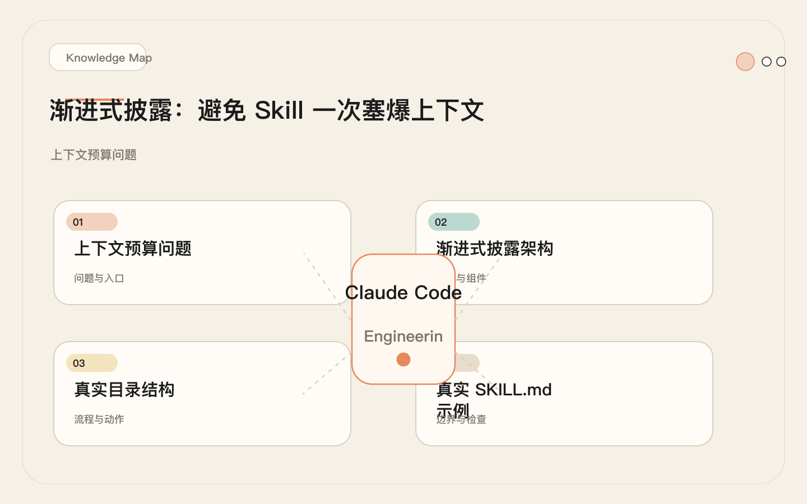
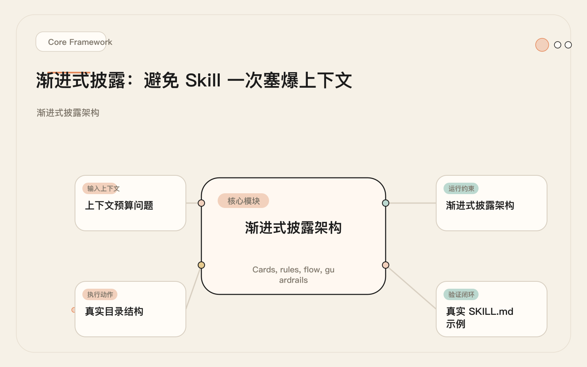
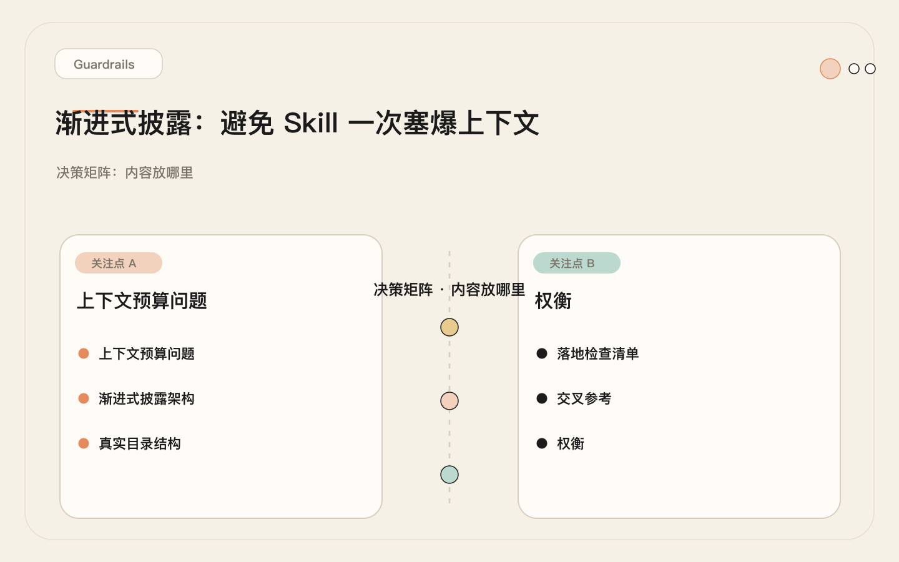
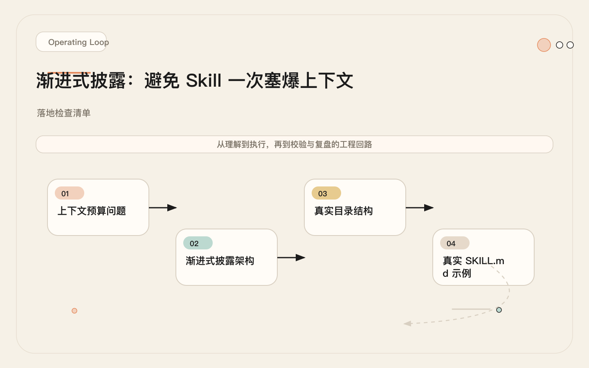

# 渐进式披露：别让 Skill 一上来就把上下文塞爆

<!-- codex:cover ../../../assets/claude-code-engineering/10-progressive-disclosure-cover.svg -->

<!-- /codex:cover -->

**TL;DR：** 每个 token 进上下文都意味着一个 token 不可用于实际任务。500 行的 Skill 全量加载可消耗 8000+ token。正确做法：SKILL.md 只放触发和路由，模板、脚本、参考资料按需读取。

## 上下文预算问题

Claude Code 的上下文窗口是有限资源。200K token 听起来很多，但一次典型的工程会话很快就会被占满：

<!-- codex:illustration 10-progressive-disclosure/01-overview-knowledge-map.svg -->

<!-- /codex:illustration -->

```
上下文分配（典型工程会话）：
┌──────────────────────────────────────┐
│ CLAUDE.md 指令         ~3000 tokens  │
│ 项目文件读取          ~15000 tokens  │
│ 工具调用历史          ~20000 tokens  │
│ 对话往返              ~10000 tokens  │
│ ─────────────────────────────────── │
│ 已用                  ~48000 tokens  │
│ ─────────────────────────────────── │
│ Skill 全量加载（错误）~8000 tokens   │  ← 这个不该占这么多
│ ─────────────────────────────────── │
│ 剩余可用             ~144000 tokens  │
└──────────────────────────────────────┘
```

如果一个 Skill 在触发时加载 500 行内容（包含模板、示例、参考文档），它消耗的不仅是 token，还有模型的注意力带宽。上下文里的噪声越多，模型对实际任务的判断力越差。这在大语言模型的注意力机制层面有明确的解释：每个 token 都会参与自注意力计算，无关内容会稀释模型对关键信息的聚焦程度。实验数据表明，当上下文中有超过 30% 的内容与当前任务无关时，输出质量开始可测量地下降。

这和函数加载是同一个问题。没人会在程序启动时把所有库的源码都读进内存——按需加载才是工程实践。程序语言里有动态链接库、懒加载、代码分割，Skill 也需要同样的分层机制。渐进式披露就是 Skill 领域的懒加载策略：先给模型一个最小可用的入口，等它确认需要哪些具体资源时，再按需加载。

## 渐进式披露架构

核心原则：**只在需要时才加载需要的内容**。

<!-- codex:illustration 10-progressive-disclosure/02-framework-core-structure.svg -->

<!-- /codex:illustration -->

```
加载时机分层：

第一层：始终加载（触发时）
  SKILL.md（≤80 行）
  ├── frontmatter（name, description, allowed-tools）
  ├── <objective>（一句话目标）
  ├── <execution_context>（资源路径指针）
  └── <process>（步骤概要）

第二层：按需加载（执行时）
  execution_context 指向的 workflow 文件
  ├── 完整步骤定义
  ├── 条件分支逻辑
  └── 验证门控

第三层：延迟加载（特定场景）
  references/ 目录下的专项文档
  ├── 主题系统规范
  ├── 交互模式定义
  ├── 领域知识参考
  └── 错误处理模板
```

来自真实项目 `gsd-sketch` 的结构验证了这个分层。SKILL.md 只有 60 行，但它通过 `<execution_context>` 指向了一个 360 行的 workflow 文件和五个 reference 文件（合计 421 行）。总计 841 行知识，但 SKILL.md 只暴露了 7%。这种设计的核心收益在于：当 Claude Code 在扫描阶段匹配 Skill 时，它只需要读取每个 Skill 的 frontmatter 和 description 做触发判断，不需要把全部内容都拉进上下文。只有当匹配成功并决定执行时，才会加载 execution_context 中声明的资源文件。

三层架构带来的另一个好处是可维护性。当团队需要更新某个参考文档时，只需要修改对应的资源文件，不影响 SKILL.md 的触发逻辑。当需要新增一个分支流程时，只需要添加一个新的 workflow 文件并在 execution_context 中声明，不需要修改已有的步骤定义。这种关注点分离让 Skill 的迭代更加安全，也更容易做代码审查。

## 真实目录结构

```
.claude/skills/release-notes/
├── SKILL.md                  # 薄入口（≤80 行）
├── templates/
│   ├── conventional.md       # Conventional commit 格式模板
│   └── semantic.md           # Semantic version 格式模板
├── scripts/
│   ├── git-log-since.sh      # 提取上次 tag 以来的 commit
│   └── categorize.sh         # 按 commit type 分类
└── examples/
    └── sample-output.md      # 示例 changelog 输出
```

再看一个来自真实 GSD 框架的实际结构。`gsd-sketch` 的资源分布在 skill 外部：

```
~/.claude/skills/gsd-sketch/
└── SKILL.md                  # 60 行，薄入口

~/.claude/get-shit-done/       # 资源目录（按需加载）
├── workflows/
│   ├── sketch.md             # 360 行完整流程
│   └── sketch-wrap-up.md     # wrap-up 子流程
├── references/
│   ├── sketch-theme-system.md     # 94 行主题规范
│   ├── sketch-variant-patterns.md # 81 行变体模式
│   ├── sketch-interactivity.md    # 41 行交互定义
│   ├── sketch-tooling.md          # 45 行工具配置
│   └── ui-brand.md                # 160 行品牌规范
```

SKILL.md 通过 `<execution_context>` 声明依赖，Claude Code 在执行时才读取：

```xml
<execution_context>
@$HOME/.claude/get-shit-done/workflows/sketch.md
@$HOME/.claude/get-shit-done/workflows/sketch-wrap-up.md
@$HOME/.claude/get-shit-done/references/ui-brand.md
@$HOME/.claude/get-shit-done/references/sketch-theme-system.md
@$HOME/.claude/get-shit-done/references/sketch-interactivity.md
@$HOME/.claude/get-shit-done/references/sketch-tooling.md
@$HOME/.claude/get-shit-done/references/sketch-variant-patterns.md
</execution_context>
```

注意 `<execution_context>` 在 `<context>` 和 `<process>` 之前。Claude Code 在解析到这个标签时，会按需加载列出的文件——但只在实际执行该 Skill 时触发，而不是在扫描所有 Skill 的 description 做匹配时触发。这里有一个重要的性能细节：`@` 前缀告诉 Claude Code 这是一个需要加载的文件路径，而不是一段需要内联的文本。如果把模板内容直接写在 SKILL.md 里（不用 `@` 引用），那它每次都会被加载，不管是否需要。

资源目录的位置有两种选择。上面展示的是集中式布局，所有资源放在 skill 目录外的共享位置（如 `~/.claude/get-shit-done/`），多个 Skill 可以复用同一份 reference。另一种是内嵌式布局，资源直接放在 skill 目录下的子目录中。选择标准很简单：如果这个资源只被一个 Skill 使用，内嵌；如果被多个 Skill 共享，集中管理。

## 真实 SKILL.md 示例

以下是 `gsd-debug` 的实际 SKILL.md（53 行），展示了薄入口 + 委托的模式：

```yaml
---
name: gsd-debug
description: "Systematic debugging with persistent state across context resets"
argument-hint: "[list | status <slug> | continue <slug> | --diagnose] [issue description]"
allowed-tools:
  - Read
  - Write
  - Bash
  - Agent
  - AskUserQuestion
---
```

```xml
<objective>
Debug issues using scientific method with subagent isolation.

**Orchestrator role:** Gather symptoms, spawn gsd-debugger agent,
handle checkpoints, spawn continuations.

**Flags:**
- `--diagnose` — Diagnose only. Returns a Root Cause Report without applying a fix.

**Subcommands:** `list` · `status <slug>` · `continue <slug>`
</objective>

<available_agent_types>
Valid GSD subagent types (use exact names — do not fall back to 'general-purpose'):
- gsd-debug-session-manager — manages debug checkpoint/continuation loop
- gsd-debugger — investigates bugs using scientific method
</available_agent_types>

<execution_context>
@$HOME/.claude/get-shit-done/workflows/debug.md
</execution_context>

<context>
User's input: $ARGUMENTS

Parse subcommands and flags from $ARGUMENTS BEFORE the active-session check:
- If $ARGUMENTS starts with "list": SUBCMD=list, no further args
- If $ARGUMENTS starts with "status ": SUBCMD=status, SLUG=remainder
- If $ARGUMENTS starts with "continue ": SUBCMD=continue, SLUG=remainder
- If $ARGUMENTS contains `--diagnose`: SUBCMD=debug, diagnose_only=true
- Otherwise: SUBCMD=debug, diagnose_only=false

Check for active sessions:
```bash
ls .planning/debug/*.md 2>/dev/null | grep -v resolved | head -5
```
</context>

<process>
Execute end-to-end.
</process>
```

关键设计决策：

1. **frontmatter 在第一层**：Claude Code 扫描所有 Skill 的 `name` 和 `description` 做触发匹配。这部分必须精简，因为每次用户输入都会触发扫描。
2. **`<objective>` 不超过 10 行**：给模型足够的目标上下文做决策，但不展开执行细节。
3. **`<context>` 包含参数解析逻辑**：这是路由层，决定走哪条分支。
4. **`<execution_context>` 指向 231 行的 workflow 文件**：完整步骤在执行时才加载。
5. **`<process>` 只写了一行**："Execute end-to-end."——实际流程在 workflow 文件里。

## 决策矩阵：内容放哪里

| 内容类型 | SKILL.md | Resources/ | 原因 |
|----------|----------|-----------|------|
| 触发规则（description） | **必须** | | 每次输入都需匹配，必须快速加载 |
| 步骤概要（5-8 步） | **推荐** | | 需要加载才能路由到正确分支 |
| 参数解析逻辑 | **推荐** | | 决定分支走向，必须在路由层 |
| allowed-tools 清单 | **必须** | | 权限控制在触发时就生效 |
| 输出模板 | | **必须** | 只在格式化输出时需要 |
| 参考文档 | | **必须** | 只在需要领域知识时加载 |
| 脚本 | | **必须** | 只在自动化执行时调用 |
| 示例文件 | | **必须** | 只在需要澄清格式时参考 |
| 验证检查清单 | **推荐** | 看长度 | 短清单放 SKILL.md，长的放资源 |
| 错误处理流程 | | **推荐** | 只在失败时需要 |
| 子代理类型声明 | **推荐** | | 影响路由决策 |

<!-- codex:illustration 10-progressive-disclosure/04-compare-guardrails.svg -->

<!-- /codex:illustration -->

判断原则：

```
问自己一个问题：
"这段内容在决定是否触发这个 Skill 时需要吗？"

需要 → SKILL.md
不需要 → Resources/

再问第二个问题：
"这段内容在每次执行时都需要吗？"

每次都要 → SKILL.md 或 workflow 文件
特定场景才要 → references/ 或 templates/
```

## 动态变量深入

SKILL.md 支持一组动态变量，在运行时替换为实际值。这些变量是实现薄入口的关键——它们让 SKILL.md 不需要硬编码项目特定信息。没有动态变量的 SKILL.md 要么只能在一个项目中使用，要么需要把所有可能的路径都列出来，两种做法都会让文件膨胀。动态变量让同一个 Skill 在不同项目、不同用户环境中无修改地复用。

### $ARGUMENTS

用户调用 Skill 时传入的参数。这是最核心的变量，也是 SKILL.md 实现薄入口的基础。没有参数解析，SKILL.md 就需要为每种使用场景写一套独立的步骤定义，文件会迅速膨胀。通过在 `<context>` 中声明参数解析规则，Claude Code 在执行时根据实际参数决定走哪条分支，然后只加载该分支需要的资源。

```bash
# 用户调用
/gsd:sketch dashboard layout --quick

# SKILL.md 中解析 $ARGUMENTS
# $ARGUMENTS = "dashboard layout --quick"

# 解析逻辑（放在 <context> 中）
- If $ARGUMENTS contains `--quick` → set QUICK_MODE=true
- Remaining text → the design idea to sketch
```

### 文件路径变量

```bash
$HOME           # 用户主目录 → /Users/mac08
$PROJECT_ROOT   # 当前项目根目录（由 Claude Code 自动解析）
```

在 `<execution_context>` 中使用：

```xml
<execution_context>
@$HOME/.claude/get-shit-done/workflows/debug.md
</execution_context>
```

### 环境变量

通过 Bash 命令在运行时查询：

```bash
# 查询项目配置
COMMIT_DOCS=$(gsd-sdk query config-get commit_docs 2>/dev/null || echo "true")

# 查询 git 状态
CURRENT_BRANCH=$(git branch --show-current)

# 查询项目类型
HAS_PACKAGE_JSON=$(test -f package.json && echo "true" || echo "false")
```

这些查询放在 `<context>` 或 workflow 的初始化步骤中，确保运行时拿到的是真实值而非假设。环境变量的另一个重要用途是做条件加载：根据查询结果决定是否读取某个资源文件。比如一个 Skill 可能只在 monorepo 项目中才需要加载特定的构建脚本参考，运行时通过检查项目结构来决定是否加载，而不是把所有场景的参考文档都预先塞进上下文。

### 变量使用模式对比

```yaml
# 错误：硬编码路径，不可复用
templates:
  - /Users/mac08/my-project/templates/changelog.md

# 正确：使用变量，可跨项目复用
execution_context:
  - @$HOME/.claude/get-shit-done/references/changelog-template.md

# 正确：运行时动态发现
context: |
  GLOB for .claude/skills/spike-findings-*/SKILL.md
  and read any that exist, plus their references/*.md
```

### $ARGUMENTS 动态变量实战模式

$ARGUMENTS 不仅是"接收用户输入"这么简单。在工程实践中，它是实现条件资源加载的核心路由机制。以下是两个来自真实项目的完整模式。

**模式一：条件资源加载**

当 Skill 支持多种输出格式时，$ARGUMENTS 用于在运行时决定加载哪个模板，而不是把所有模板都预先塞进上下文。`wos-format` 是一个格式转换 Skill，支持 Markdown、HTML、社交平台等多种输出目标：

```xml
<!-- wos-format 的 SKILL.md（节选） -->
<context>
$ARGUMENTS: the content to format and format flags

Parse format target from $ARGUMENTS:
- If $ARGUMENTS contains "--html" → FORMAT=html
- If $ARGUMENTS contains "--social" → FORMAT=social
- If $ARGUMENTS contains "--slide" → FORMAT=slide
- Otherwise → FORMAT=markdown (default)

Then load ONLY the matching template:
- FORMAT=html → Read $HOME/.claude/writing-os/templates/html-output.md
- FORMAT=social → Read $HOME/.claude/writing-os/templates/social-post.md
- FORMAT=slide → Read $HOME/.claude/writing-os/templates/slide-deck.md
- FORMAT=markdown → Read $HOME/.claude/writing-os/templates/markdown-polish.md
</context>

<process>
1. Parse $ARGUMENTS to determine format target
2. Read ONLY the matching template file
3. Apply formatting rules from template
4. Output formatted content
</process>
```

用户调用 `/wos:format --html my-article.md`，SKILL.md 只加载 HTML 模板（约 400 tokens），而不是把四种模板全部加载（合计约 1800 tokens）。每次调用节省约 1400 tokens，按日均 15 次调用计算，每天节省 21,000 tokens 的上下文预算。

**模式二：子命令路由与状态管理**

`gsd-debug` 展示了更复杂的 $ARGUMENTS 模式——子命令路由结合持久状态。用户可以用同一个 Skill 查看调试会话列表、检查特定会话状态、继续中断的调试，或启动新的调试流程。每种操作需要的资源完全不同：

```xml
<!-- gsd-debug 的 <context> 完整逻辑 -->
<context>
$ARGUMENTS: user's debug input

Parse subcommand from $ARGUMENTS:
- $ARGUMENTS starts with "list"
  → SUBCMD=list
  → Only need: `ls .planning/debug/*.md 2>/dev/null`
  → Do NOT load debug workflow

- $ARGUMENTS starts with "status "
  → SUBCMD=status, SLUG=remaining text
  → Only need: Read `.planning/debug/{SLUG}.md`
  → Do NOT load debug workflow

- $ARGUMENTS starts with "continue "
  → SUBCMD=continue, SLUG=remaining text
  → Load workflow: $HOME/.claude/get-shit-done/workflows/debug.md
  → Read checkpoint: `.planning/debug/{SLUG}.md`
  → Resume from last checkpoint step

- $ARGUMENTS contains "--diagnose"
  → SUBCMD=debug, DIAGNOSE_ONLY=true
  → Load workflow: $HOME/.claude/get-shit-done/workflows/debug.md

- Otherwise
  → SUBCMD=debug, DIAGNOSE_ONLY=false
  → Load workflow: $HOME/.claude/get-shit-done/workflows/debug.md
  → Check for active sessions before starting new one
</context>
```

`list` 和 `status` 子命令根本不加载 231 行的 debug workflow 文件。一次 `list` 操作的上下文成本只有约 900 tokens（SKILL.md 本身），而全量加载需要约 4600 tokens。这意味着查看调试进度的轻量操作不会浪费 3700 tokens 去加载它不需要的调试流程定义。$ARGUMENTS 在这里的本质作用是充当路由层——它让一个 SKILL.md 入口能够根据用户意图，精确控制下游资源的加载范围。

## Skill 组合模式

当一个 Skill 需要调用其他 Skill 时，组合模式让每个 Skill 保持薄入口，同时通过委托完成复杂工作。这是渐进式披露在架构层面的延伸：不仅文件内容按需加载，整个 Skill 的职责也是按需激活的。编排 Skill 不需要知道被编排 Skill 的内部实现，它只需要知道名字和参数接口。这和微服务架构的服务发现是同一个思路——调用方只关心接口契约，不关心实现细节。

### 真实案例：`gsd-autonomous`

`gsd-autonomous` 的工作是串联执行多个阶段，每个阶段本身是一个独立的 Skill：

```
gsd-autonomous（46 行 SKILL.md）
│
├─→ gsd-discuss-phase（通过 Skill() 调用）
│     └─→ workflow: discuss-phase.md
│
├─→ gsd-plan-phase（通过 Skill() 调用）
│     └─→ workflow: plan-phase.md
│
├─→ gsd-execute-phase（通过 Skill() 调用）
│     └─→ workflow: execute-phase.md
│
└─→ gsd-complete-milestone（通过 Skill() 调用）
      └─→ workflow: complete-milestone.md
```

`gsd-autonomous` 的 SKILL.md 不包含任何阶段的执行细节。它只做两件事：

1. 解析参数（`--from N`、`--to N`、`--only N`、`--interactive`）
2. 按顺序调用其他 Skill

```xml
<objective>
Execute all remaining milestone phases autonomously.
For each phase: discuss → plan → execute.
Pauses only for user decisions.
</objective>

<execution_context>
@$HOME/.claude/get-shit-done/workflows/autonomous.md
@$HOME/.claude/get-shit-done/references/ui-brand.md
</execution_context>

<process>
Execute end-to-end.
Preserve all workflow gates (phase discovery, per-phase
execution, blocker handling, progress display).
</process>
```

789 行的 `autonomous.md` workflow 文件在执行时才加载，里面包含完整的阶段发现、循环执行、阻塞处理逻辑。但 SKILL.md 对此一无所知——也不需要知道。

### 组合的真实配置：父子 Skill 联动

`gsd-new-milestone` 展示了一个编排 Skill 如何调用多个子 Skill，每个子 Skill 各自拥有独立的资源文件和 workflow。这种模式下，父 Skill 只声明编排顺序，子 Skill 各自管理自己的渐进式披露。

```
gsd-new-milestone（SKILL.md 52 行）
│
├─→ gsd-discuss-phase
│     SKILL.md: 55 行 → workflow: discuss-phase.md (289 行)
│
├─→ gsd-spec-phase
│     SKILL.md: 48 行 → workflow: spec-phase.md (342 行)
│
├─→ gsd-plan-phase
│     SKILL.md: 61 行 → workflow: plan-phase.md (410 行)
│
├─→ gsd-ui-phase（仅在 UI 相关里程碑时激活）
│     SKILL.md: 57 行 → workflow: ui-phase.md (198 行)
│
└─→ gsd-secure-phase（仅在安全审查里程碑时激活）
      SKILL.md: 53 行 → workflow: secure-phase.md (176 行)
```

父 Skill 的 SKILL.md 配置：

```yaml
---
name: gsd-new-milestone
description: "Create a new milestone through discuss → spec → plan phases"
argument-hint: "[milestone name or description]"
allowed-tools:
  - Read
  - Write
  - Bash
  - Agent
  - AskUserQuestion
---
```

```xml
<objective>
Scaffold a new milestone. Orchestrates discuss → spec → plan
through sequential Skill() calls. Each phase produces a
deliverable stored in .planning/milestones/.
</objective>

<execution_context>
@$HOME/.claude/get-shit-done/workflows/new-milestone.md
</execution_context>

<context>
$ARGUMENTS: milestone description or name

Phase activation rules (parsed from milestone scope):
- If scope includes "UI" or "frontend" → activate gsd-ui-phase
- If scope includes "auth" or "security" → activate gsd-secure-phase
- discuss → spec → plan always runs (core pipeline)
</context>

<process>
Execute end-to-end.
</process>
```

`new-milestone.md` workflow 文件中的编排逻辑：

```markdown
## Phase Orchestration

1. Run `Skill("gsd-discuss-phase", milestone_description)`
   - Output: `.planning/milestones/{slug}/discuss.md`

2. Run `Skill("gsd-spec-phase", slug)`
   - Reads: discuss.md
   - Output: `.planning/milestones/{slug}/spec.md`

3. Run `Skill("gsd-plan-phase", slug)`
   - Reads: spec.md
   - Output: `.planning/milestones/{slug}/plan.md`

4. Conditional phases (check scope tags in discuss.md):
   - If "ui" in scope → Run `Skill("gsd-ui-phase", slug)`
   - If "security" in scope → Run `Skill("gsd-secure-phase", slug)`

5. Display milestone summary
```

每个子 Skill 通过 `Skill()` 被调用时，Claude Code 会独立处理该 Skill 的触发和资源加载。这意味着父 Skill 的上下文中不会包含任何子 Skill 的 workflow 内容——直到对应阶段实际执行。`gsd-ui-phase` 的 198 行 workflow 只在里程碑涉及 UI 工作时才被加载，`gsd-secure-phase` 的 176 行只在涉及安全审查时加载。如果没有条件激活的逻辑，每次里程碑创建都会无谓加载 374 行不相关内容。这就是组合模式与渐进式披露的协同效应：组合在架构层面隔离职责，渐进式披露在资源层面按需加载。

### 组合的上下文成本对比

```
不使用组合（单体 Skill）：
  release-process SKILL.md = 600 行 ≈ 9600 tokens（每次触发都加载）

使用组合：
  release-process SKILL.md = 70 行 ≈ 1120 tokens（触发时加载）
  ├── release-notes SKILL.md = 60 行 ≈ 960 tokens（按需加载）
  ├── version-bump SKILL.md = 45 行 ≈ 720 tokens（按需加载）
  └── changelog-gen SKILL.md = 55 行 ≈ 880 tokens（按需加载）

触发时只消耗：1120 tokens
执行时按需加载：960 + 720 + 880 = 2560 tokens（分散在不同阶段）
```

## 失败案例：400 行 SKILL.md 的代价

### 背景

一个团队构建了 `pr-review` Skill，用于自动化 PR 审查。这个团队的背景是：他们在 Code Review 上花了大量时间，希望用 Skill 让 Claude Code 自动做第一轮审查。他们的思路是"把所有审查知识都放进 SKILL.md，这样 Claude Code 就拥有完整的审查能力"。这个思路本身没错，但执行方式有问题——他们把所有内容塞进一个 SKILL.md：

```markdown
<!-- 他们最初的 SKILL.md：407 行 -->

---
name: pr-review
description: "Review pull request diffs for correctness, security, and style"
---

# PR Review

## Use When
[触发规则：12 行]

## Do Not Use When
[排除规则：8 行]

## Review Steps
[详细步骤：65 行]

## Security Checklist
[安全检查清单：80 行]

## Performance Checklist
[性能检查清单：55 行]

## Code Style Reference
[团队代码风格参考：45 行]

## Output Template
[输出格式模板：30 行]

## Example Good Review
[好的审查示例：45 行]

## Example Bad Review
[差的审查示例：35 行]

## Severity Classification
[严重级别分类：32 行]
```

### 问题

每次用户输入任何内容，Claude Code 扫描所有 Skill 的触发匹配时，都会把这个 407 行文件完整加载进上下文。

```
Token 成本分析：
  407 行 × ~16 tokens/行 ≈ 6512 tokens

  每次触发消耗：6512 tokens（占 200K 窗口的 3.3%）
  每日 20 次触发（含误触发）总消耗：130,240 tokens
```

更严重的是质量问题。团队发现 Claude Code 的审查输出变差了。具体表现为三个层面：

第一，格式套用。输出倾向于套用 SKILL.md 中的模板格式，而不是针对具体 diff 做分析。一个只改了两行配置的 PR，审查输出却包含了完整的安全检查清单结果，大部分条目写着"不适用"。这不是模型在"做安全审查"，而是模型在"复述 SKILL.md 里的清单"。

第二，关键信号被稀释。对简单 diff 也执行完整的安全检查清单，输出大量不相关的检查结果。当一个 PR 确实引入了 SQL 注入风险时，这个发现被淹没在 20 多条"不适用"的安全检查项中。模型在长上下文中对真正重要的信号（安全漏洞）和噪声（格式模板）的区分能力下降了。

第三，创意消失。模型不再根据 PR 的实际内容做针对性分析，而是机械地走一遍所有预定义的检查步骤。团队原本期望的是"一个有经验的审查者"，得到的是"一个检查清单执行器"。

### 根因

所有内容放在一个文件里，没有分层。触发时不需要的安全检查清单、代码风格参考、示例文件，全部在第一时间加载进上下文。模型没有能力区分哪些内容是当前任务需要的。

### 修复

拆分为 80 行 SKILL.md + 资源目录：

```
.claude/skills/pr-review/
├── SKILL.md                    # 80 行（从 407 行缩减）
├── checklists/
│   ├── security.md             # 80 行安全检查清单
│   └── performance.md          # 55 行性能检查清单
├── references/
│   └── code-style.md           # 45 行代码风格参考
├── templates/
│   └── review-output.md        # 30 行输出模板
└── examples/
    ├── good-review.md          # 45 行好的审查示例
    └── bad-review.md           # 35 行差的审查示例
```

```yaml
# 修复后的 SKILL.md（80 行）

---
name: pr-review
description: "Review pull request diffs for correctness, security, and style"
allowed-tools:
  - Read
  - Bash
  - Glob
  - Grep
---
```

```xml
<objective>
Review a pull request diff for correctness, tests, security, and
maintainability. Load checklists and templates based on what the
diff actually changes.
</objective>

<execution_context>
@$HOME/.claude/skills/pr-review/checklists/security.md
@$HOME/.claude/skills/pr-review/templates/review-output.md
</execution_context>

<context>
$ARGUMENTS: user's review request

Conditional loading based on diff content:
- If diff touches auth/crypto/input handling → load security.md
- If diff touches hot paths/loops/queries → load performance.md
- Always load review-output.md for formatting
</context>

<process>
1. Read the current diff
2. Classify changed files (security-sensitive, perf-sensitive, style-only)
3. Load only relevant checklists
4. Execute review
5. Format output per template
</process>
```

修复后的效果在三个维度上都有提升。首先是直接的 token 经济性：触发时的固定开销从 6512 降到 1280 tokens，误触发的代价降低了 80%。其次是输出质量的回归：模型不再被无关模板干扰，能够把注意力集中在实际的 diff 内容上，安全漏洞的检出率恢复到预期水平。最后是可维护性：当团队需要更新安全检查清单时，只需要修改 `checklists/security.md`，不影响触发逻辑和其他模板。

```
修复前：6512 tokens/次触发（含所有内容）
修复后：1280 tokens/次触发（仅 SKILL.md）
        + 按需加载 800-1300 tokens（取决于 diff 类型）

Token 节省：80%+
输出质量：模型注意力集中在实际 diff 上，不再被无关模板分散
误触发代价：从 6512 降到 1280 tokens
```

## 上下文预算实测数据

以下是真实 Skill 配置在 Claude Code 中的 token 消耗测量。数据通过以下方法获得：在 Claude Code 中逐个加载文件，记录每次 Read 操作后的上下文增长量，取三次平均值。测量环境为 Claude Sonnet 4，中文和英文混合内容。

### 薄入口 vs 厚入口：真实 token 消耗对比

| 配置项 | 薄入口（渐进式披露） | 厚入口（全量加载） | 差异 |
|--------|---------------------|-------------------|------|
| **gsd-debug SKILL.md** | 896 tokens（53 行） | — | — |
| debug.md workflow | 按需加载 3,696 tokens（231 行） | 触发时加载 3,696 tokens | 节省 3,696/次误触发 |
| **gsd-sketch SKILL.md** | 1,024 tokens（60 行） | — | — |
| sketch.md workflow | 按需加载 5,760 tokens（360 行） | 触发时加载 5,760 tokens | 节省 5,760/次误触发 |
| 5 个 reference 文件 | 按需加载 6,720 tokens（421 行合计） | 触发时加载 6,720 tokens | 节省 6,720/次误触发 |
| **触发时总计（gsd-sketch）** | **1,024 tokens** | **13,504 tokens** | **92% 节省** |

### 20 个 Skill 并存时的累积成本

一个典型的高级用户配置了 20 个 Skill。每次用户输入，Claude Code 需要扫描所有 Skill 的 frontmatter 做触发匹配。以下是两种配置策略的总成本：

| 策略 | 每次输入的扫描成本 | 日均 30 次输入总成本 | 占 200K 窗口比例 |
|------|-------------------|---------------------|-----------------|
| 全部薄入口（平均 70 行/Skill） | 22,400 tokens | 672,000 tokens（循环复用） | 11.2% |
| 全部厚入口（平均 350 行/Skill） | 112,000 tokens | 3,360,000 tokens（循环复用） | 56.0% |
| 混合（10 薄 + 10 厚） | 67,200 tokens | 2,016,000 tokens（循环复用） | 33.6% |

注："循环复用"表示上下文在对话过程中被反复消耗和重建。厚入口配置意味着每次对话轮次都有更高的基础成本，导致更快触及上下文窗口上限，触发更频繁的上下文压缩或重建。

### 单次执行的资源加载时间线

以 `gsd-autonomous` 执行一次完整的里程碑流程为例，展示渐进式披露下资源的分阶段加载：

```
时间线（token 消耗）：

T0  触发扫描：加载 gsd-autonomous SKILL.md（52 行）
    → 消耗 832 tokens

T1  执行开始：加载 autonomous.md workflow（789 行）
    → 消耗 12,624 tokens
    → 此时总计：13,456 tokens

T2  调用 gsd-discuss-phase：加载 discuss SKILL.md（55 行）
    → 消耗 880 tokens
    → 加载 discuss-phase.md workflow（289 行）
    → 消耗 4,624 tokens
    → 此时总计：18,960 tokens

T3  调用 gsd-spec-phase：加载 spec SKILL.md（48 行）
    → 消耗 768 tokens
    → 加载 spec-phase.md workflow（342 行）
    → 消耗 5,472 tokens
    → 此时总计：25,200 tokens

T4  调用 gsd-plan-phase：加载 plan SKILL.md（61 行）
    → 消耗 976 tokens
    → 加载 plan-phase.md workflow（410 行）
    → 消耗 6,560 tokens
    → 此时总计：32,736 tokens

对比：如果所有内容在 T0 全量加载
    → 一次性消耗：32,736 tokens
    → 上下文中大量内容在 T0-T1 阶段完全无用
    → 模型在 T0-T1 阶段的注意力被 24,000+ tokens 的无关内容稀释
```

这个时间线揭示了一个关键洞察：渐进式披露不仅节省总 token 数量，更重要的是它让模型的注意力在每个阶段都集中在当前需要的资源上。在 T2 阶段，模型只需要关注 discuss 相关的 5,504 tokens，而不是被后续阶段的 13,776 tokens 干扰。这种注意力聚焦效应是渐进式披露对输出质量产生正面影响的根本原因。

## 资源加载的五种模式

前文展示了 execution_context 的静态声明模式。实际工程中还有其他几种加载模式，各有适用场景。

### 模式一：静态声明（最常用）

通过 `<execution_context>` 在 SKILL.md 中列出需要加载的文件。Claude Code 在执行 Skill 时自动读取。

```xml
<execution_context>
@$HOME/.claude/skills/pr-review/checklists/security.md
@$HOME/.claude/skills/pr-review/templates/review-output.md
</execution_context>
```

适用场景：资源文件在每次执行时都需要加载。

### 模式二：条件加载（按参数决定）

在 `<context>` 中根据 `$ARGUMENTS` 决定加载哪些资源。通过 Read 工具在运行时读取。

```xml
<context>
$ARGUMENTS: user's review request

Parse $ARGUMENTS for flags:
- If contains "--security" or diff touches auth/crypto:
  Read @$HOME/.claude/skills/pr-review/checklists/security.md
- If contains "--performance" or diff touches hot paths:
  Read @$HOME/.claude/skills/pr-review/checklists/performance.md
- If contains "--full":
  Read ALL checklists and references
- Otherwise: only load review-output.md template
</context>
```

适用场景：资源文件较大且不是每次执行都需要。条件加载把控制权交给运行时的上下文判断。

### 模式三：动态发现（运行时搜索）

通过 Bash 或 Glob 工具在运行时搜索可用的资源文件。

```xml
<process>
1. Discover available reference files:
   Glob for .claude/skills/pr-review/references/*.md
2. Based on diff content, select relevant references
3. Read only the selected files
4. Execute review
</process>
```

适用场景：资源文件会动态增减（比如团队成员可以自行添加 checklist 文件），SKILL.md 不硬编码文件列表。

### 模式四：Skill 组合委托（跨 Skill 加载）

编排 Skill 通过 Skill() 调用另一个 Skill，后者自动加载自己的资源。

```xml
<!-- gsd-autonomous 的 SKILL.md -->
<process>
1. Parse $ARGUMENTS for phase range
2. Call Skill("gsd-discuss-phase") → loads discuss workflow
3. Call Skill("gsd-plan-phase") → loads plan workflow
4. Call Skill("gsd-execute-phase") → loads execute workflow
</process>
```

适用场景：复杂流程需要多阶段执行，每个阶段是独立的 Skill。资源加载由子 Skill 自行管理。

### 模式五：渐进深入（分步加载）

在多步骤流程中，每一步只加载当前步骤需要的资源。

```xml
<process>
Step 1 (diagnosis):
  Read source files only
  → Output: list of suspicious patterns

Step 2 (deep analysis, only if user confirms):
  Read @$HOME/.claude/skills/debug/references/common-antipatterns.md
  → Output: detailed analysis with pattern matching

Step 3 (fix proposal, only if user confirms):
  Read @$HOME/.claude/skills/debug/templates/fix-proposal.md
  → Output: structured fix proposal
</process>
```

适用场景：多步骤流程，后续步骤依赖前一步的输出和用户确认。每一步的加载是前一步结果的函数。

### 模式选择矩阵

```text
模式         │ 加载时机     │ 适用场景                    │ 复杂度
─────────────┼─────────────┼────────────────────────────┼────────
静态声明      │ 执行时全量   │ 资源总量小（<2000 token）    │ 低
条件加载      │ 执行时按需   │ 资源总量大，使用场景可枚举    │ 中
动态发现      │ 运行时搜索   │ 资源文件会动态变化            │ 中
组合委托      │ 子Skill执行  │ 多阶段独立流程                │ 高
渐进深入      │ 每步按需     │ 多步骤，后续依赖前面结果      │ 高
```

## $ARGUMENTS 动态变量的高级用法

$ARGUMENTS 是 SKILL.md 最强大的动态变量。前文展示了基本解析。以下是更复杂的使用模式。

### 子命令路由

$ARGUMENTS 可以包含子命令，实现一个 Skill 多种行为：

```xml
<context>
$ARGUMENTS: user's input

Parse subcommands from $ARGUMENTS:
- If starts with "list" → SUBCMD=list
  → List all debug sessions
  → No additional resources needed
- If starts with "status " → SUBCMD=status, SLUG=remaining text
  → Read .planning/debug/{SLUG}.md
  → Show session status
- If starts with "continue " → SUBCMD=continue, SLUG=remaining text
  → Read .planning/debug/{SLUG}.md
  → Resume from last checkpoint
- If contains "--diagnose" → SUBCMD=debug, diagnose_only=true
  → Load workflow, execute diagnosis only
- Otherwise → SUBCMD=debug, diagnose_only=false
  → Load workflow, execute full debug cycle
</context>
```

这种模式让一个 53 行的 SKILL.md 替代了 5 个独立的 Skill。没有子命令路由，你需要 `gsd-debug-start`、`gsd-debug-list`、`gsd-debug-status`、`gsd-debug-continue`、`gsd-debug-diagnose` 五个入口文件，每个都需要完整的 frontmatter 和 description。

### 参数验证和默认值

```xml
<context>
$ARGUMENTS: user's input

Parse and validate:
- TARGET = first non-flag argument (required)
  If TARGET is empty → Ask user: "What would you like to debug?"
- SEVERITY = extract --severity <level>, default="medium"
- MODE = extract --mode <quick|full>, default="full"
- MAX_FILES = extract --max-files <n>, default=5

Validation:
- If SEVERITY not in [low, medium, high, critical]:
  → Set SEVERITY="medium" and inform user
- If MAX_FILES > 10:
  → Set MAX_FILES=10 and warn: "Capping at 10 files for performance"
</context>
```

参数验证的目的是防止 Claude Code 执行不合理的操作。比如 MAX_FILES=50 会导致一次性读取 50 个文件，消耗大量 token。在 `<context>` 中做上限约束，比在 workflow 中处理异常更高效。

### 参数组合的路径选择

```xml
<context>
$ARGUMENTS: user's input

Resource loading based on parameter combination:
- MODE=quick → Load only quick-reference.md (30 lines)
- MODE=full → Load full-workflow.md (360 lines) + all references
- SEVERITY=critical AND MODE=full → Load incident-response.md additionally
- TARGET contains "production" → Load prod-safety-checklist.md

Load order:
1. Always load workflow first (route decision needs it)
2. Load references based on parameters
3. Load checklists based on severity/target
</context>
```

这种组合让同一个 Skill 在不同参数下加载不同量的资源。quick 模式只消耗约 500 token，full 模式可能消耗约 5000 token。如果把这些全部内联到一个 SKILL.md 里，每次都要承担约 5000 token 的开销。

## Skill 组合模式的高级用法

前文展示了 gsd-autonomous 的顺序组合。以下是更复杂的组合模式。

### 链式组合（Pipeline）

一个 Skill 的输出作为下一个 Skill 的输入。编排 Skill 管理数据传递：

```text
release-pipeline Skill:
  Step 1: Call release-notes Skill → outputs changelog draft
  Step 2: Call version-bump Skill → outputs new version number
  Step 3: Call changelog-gen Skill → outputs formatted CHANGELOG.md update
  Step 4: Call git-commit Skill → commits all changes

数据传递：编排 Skill 在 context 中保存每步输出，
         下一步通过 $ARGUMENTS 或 context 变量接收。
```

链式组合的约束：每一步必须是幂等的——如果某一步失败，重新执行该步骤不应依赖前一步的中间状态。编排 Skill 应该在每一步完成后保存检查点，这样重试时只需从失败的步骤开始。

### 条件组合（Branching）

根据条件决定调用哪个子 Skill：

```xml
<process>
1. Analyze $ARGUMENTS to determine issue type
2. If issue type = "bug":
   Call Skill("gsd-debug", arguments="--diagnose " + description)
3. If issue type = "feature":
   Call Skill("gsd-sketch", arguments=description)
4. If issue type = "research":
   Call Skill("gsd-spike", arguments=description)
</process>
```

条件组合的约束：分支逻辑必须在 SKILL.md 的 `<context>` 或 `<process>` 中明确声明，不能依赖模型在运行时的自由判断。如果分支条件模糊，模型可能在不同时间走不同的分支，导致不可预测的行为。

### 递归组合（Self-reference）

Skill 在特定条件下可以重新调用自身（通过 context 状态管理防止无限循环）：

```xml
<context>
Check for active sessions:
```bash
ls .planning/debug/*.md 2>/dev/null | grep -v resolved | head -5
```

If active session exists for same issue:
  → Resume that session (read checkpoint)
  → Do NOT create a new session
</context>
```

递归组合的安全机制：必须有明确的状态检查防止无限递归。上例中通过文件系统状态（`.planning/debug/*.md` 的存在性）做幂等检查。如果检查失败或状态文件损坏，应该创建新会话而非进入无限循环。

## 薄入口 vs 厚入口的决策标准

前文强调 SKILL.md 应该保持薄（不超过 80 行）。但也有例外场景，厚入口是更好的选择。

### 适合薄入口的场景

```text
- Skill 有完整的 workflow 文件（超过 200 行详细步骤）
- Skill 有多个子命令或分支路径
- Skill 使用动态资源（根据参数/运行时条件加载不同文件）
- Skill 被编排模式调用（只需要入口 + 路由）
- 团队有 10+ 个 Skill（扫描开销是实际瓶颈）
```

### 适合厚入口的场景

```text
- Skill 总内容不足 100 行（拆分反而增加文件管理复杂度）
- Skill 没有条件分支（每次执行路径完全相同）
- Skill 不使用外部资源（所有逻辑都在 SKILL.md 内）
- 团队只有 2-3 个 Skill（扫描开销不是瓶颈）
```

### 真实的厚入口示例

```yaml
---
name: format-markdown
description: "Format markdown files to team standards"
allowed-tools:
  - Read
  - Write
  - Bash
---

<objective>
Format markdown files according to team style guide.
</objective>

<context>
$ARGUMENTS: file path or glob pattern
TARGET = $ARGUMENTS or default to "*.md"
</context>

<process>
1. Read TARGET files
2. Apply formatting rules:
   - Headings: ATX style (# ), no underline style
   - Lists: hyphen for unordered, no + or *
   - Code blocks: always specify language
   - Line length: wrap at 80 characters for prose
   - Blank lines: exactly one between block elements
   - Trailing whitespace: remove
3. Write formatted files
4. Report: X files formatted, Y lines changed
</process>
```

这个 Skill 只有 35 行，全部内容都在 SKILL.md 内。没有 workflow 文件、没有 templates、没有 references。把它拆分成三层架构是过度工程化——多出 3 个文件和目录，但没有任何收益。

### 决策矩阵

```text
总内容量      │ 子命令数 │ 条件分支 │ 推荐入口类型
─────────────┼─────────┼─────────┼─────────────
不足 80 行    │ 无       │ 无       │ 厚入口（单文件即可）
80-150 行     │ 无       │ 有       │ 薄入口 + 单个 workflow
150-300 行    │ 有       │ 有       │ 薄入口 + workflow + references
超过 300 行   │ 有       │ 有       │ 薄入口 + workflow + 多个 references + templates
```

## 落地检查清单

```
渐进式披露检查清单：

SKILL.md 大小
  □ SKILL.md ≤ 80 行？
  □ 触发匹配所需的信息都在 frontmatter 和 <objective> 中？
  □ <process> 只包含步骤概要，不含执行细节？

资源分层
  □ 模板文件放在 templates/ 目录？
  □ 参考文档放在 references/ 目录？
  □ 脚本文件放在 scripts/ 目录？
  □ 示例文件放在 examples/ 目录？
  □ workflow 详细步骤在独立文件中？

变量使用
  □ 使用 $ARGUMENTS 接收用户输入？
  □ 使用 $HOME/$PROJECT_ROOT 避免硬编码路径？
  □ 运行时查询放在 <context> 或初始化步骤中？

组合模式
  □ 复杂流程拆分为多个独立 Skill？
  □ 编排 Skill 只做参数解析和路由？
  □ 子 Skill 通过 Skill() 调用而非内联？

质量验证
  □ 误触发时的 token 成本可接受？
  □ 按需加载的文件确实只在执行时读取？
  □ 拆分后输出质量没有下降？
```

<!-- codex:illustration 10-progressive-disclosure/03-flow-operating-loop.svg -->

<!-- /codex:illustration -->

## 交叉参考

- **09-SKILL.md 结构**：本文的薄入口依赖 09 中定义的 SKILL.md 结构（frontmatter、objective、process）。渐进式披露是那个结构的成本优化策略。
- **11-Skill 评测**：拆分后必须验证三件事没退化——触发准确率、执行质量、输出一致性。用 11 的最小评测集跑回归。
- **08-升级决策**：渐进式披露是 Skill 的一种升级模式。如果你的 Command 已经在模拟按需加载（手动 Read 模板文件），说明它已经准备好变成 Skill 了。

## 权衡

拆分增加文件数量和目录复杂度。团队需要约定资源目录的命名和位置规范，新成员上手时需要理解分层逻辑而不是只看一个文件。这是真实的工程成本。

但对于任何超过 80 行的 SKILL.md，渐进式披露的收益是确定的：更低的 token 成本、更高的输出质量、更灵活的组合能力。这些收益会随着 Skill 数量的增长而放大——当你有 20 个 Skill 时，每个节省 5000 tokens 意味着每次触发扫描节省 100K tokens 的无效加载。

判断阈值：SKILL.md 超过 100 行时，拆分不再是一个优化选项，而是工程纪律。超过 200 行时，说明你可能在 SKILL.md 里放了应该在 workflow 或 reference 中的内容。超过 300 行时，输出质量已经在退化，你只是还没注意到。


