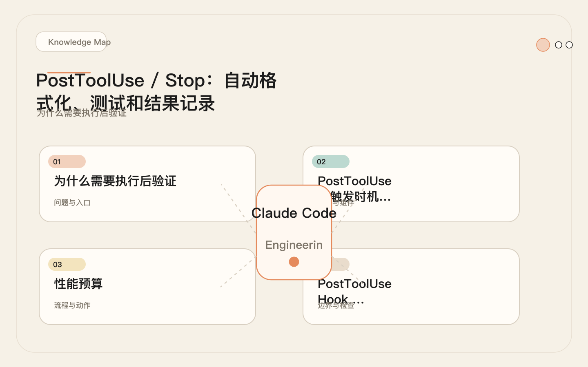
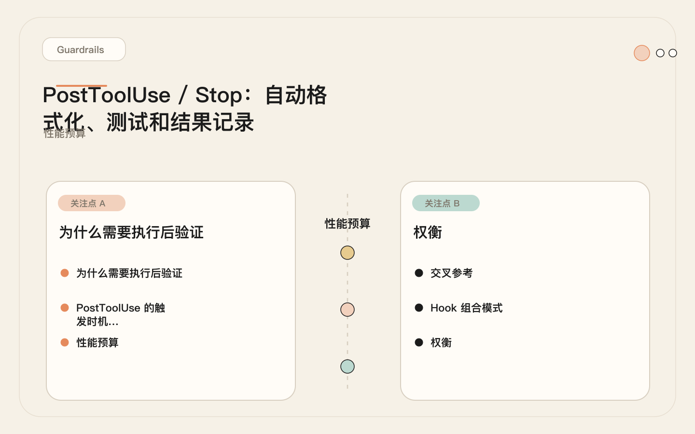
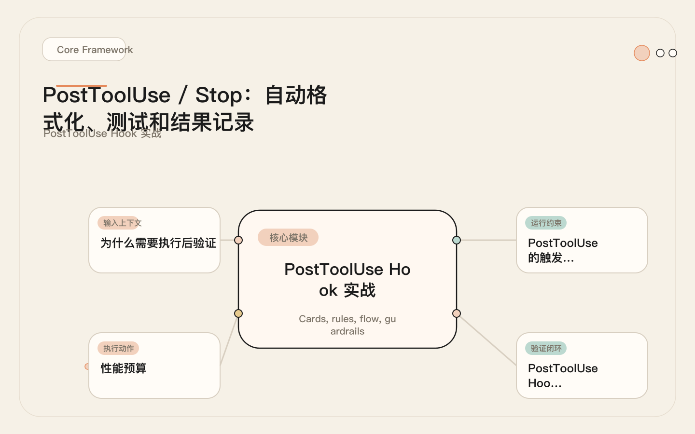
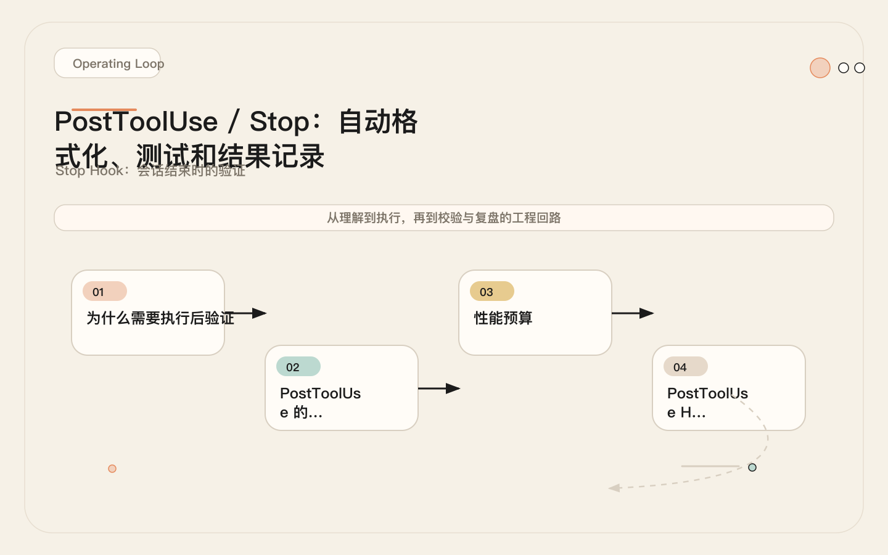

# PostToolUse 与 Stop：让 AI 每次改完代码，自动验证、自动留痕

<!-- codex:cover ../../../assets/claude-code-engineering/24-posttooluse-stop-verification-cover.svg -->

<!-- /codex:cover -->

**TL;DR：** 修改完成后的验证比修改本身更重要。`PostToolUse` 在工具执行后做增量验证，`Stop` 在会话结束时做全局验证。两者配合形成完整的验证闭环。

## 为什么需要执行后验证

Claude Code 修改文件后，默认行为是向用户展示修改结果并继续下一步操作。它不会自动运行测试、检查格式、或验证修改是否引入了新问题。模型的注意力在"完成用户指令"上，不在"验证自己的输出"上。

<!-- codex:illustration 24-posttooluse-stop-verification/01-overview-knowledge-map.svg -->

<!-- /codex:illustration -->

这和人类开发的习惯类似：写完代码不会自动跑测试。但 AI 的修改速度更快、范围更广，"忘记验证"的后果也更严重——一次会话可能修改 20 个文件，覆盖 3 个模块，如果没有验证，错误会在后续修改中被层层叠加。一个类型错误可能在第 3 次修改时引入，到第 15 次修改时才暴露为运行时异常，中间的 12 次修改都建立在这个错误的基础上。

具体来说，没有执行后验证时常见的问题模式：

| 问题类型 | 没有验证时的后果 | PostToolUse 的预防作用 |
|----------|----------------|----------------------|
| 格式不一致 | 提交后 CI 因 lint 失败，浪费 CI 资源 | 修改后自动格式化，确保每次保存都合规 |
| 遗漏测试 | 新功能没有对应测试，回归问题在上线后才发现 | 提醒运行或编写关联测试 |
| 隐性错误 | 修改 A 引入了 B 的问题，但 A 的逻辑看起来正确 | 运行关联测试，立即捕获副作用 |
| 变更不可追溯 | 会话结束后无法复盘 Claude Code 做了什么 | 变更日志记录每次工具调用的目标 |

PostToolUse 和 Stop 解决的就是这个问题：

- **PostToolUse**：每次工具调用后做增量验证。提醒测试、自动格式化、记录变更。单次验证粒度小、速度快。
- **Stop**：会话结束时做全局验证。汇总修改、检查遗漏、生成验证报告。全局视角，检查单次验证无法发现的累积问题。

## PostToolUse 的触发时机和输入

PostToolUse 在工具成功执行后触发。它接收的 stdin 数据包含工具调用结果：

```json
{
  "tool_name": "Edit",
  "tool_input": {
    "file_path": "/src/auth.ts",
    "old_string": "const token = req.headers.authorization;",
    "new_string": "const token = req.headers.authorization?.split(' ')[1];"
  },
  "result": "Successfully replaced text in /src/auth.ts"
}
```

与 PreToolUse 的关键区别：PostToolUse 不能阻断。工具已经执行完了，Hook 只能记录、提醒和做后续处理。

## 性能预算

PostToolUse Hook 在每次工具调用后执行。如果 Hook 执行时间过长，会直接影响 Claude Code 的响应速度。以下是各类 Hook 的性能预算参考：

<!-- codex:illustration 24-posttooluse-stop-verification/04-compare-guardrails.svg -->

<!-- /codex:illustration -->

| Hook 类型 | 最大执行时间 | 原因 |
|-----------|------------|------|
| PreToolUse | ≤ 2s | 阻断型检查必须快速返回，否则阻塞所有工具调用 |
| PostToolUse - 格式化 | ≤ 3s | 大多数格式化工具对单文件在此时间内完成 |
| PostToolUse - 测试提醒 | ≤ 0.5s | 只做路径推断和文本输出，不执行测试 |
| PostToolUse - 变更日志 | ≤ 0.5s | 只做文件追加写入 |
| PostToolUseFailure | ≤ 1s | 错误记录和简单分析，不做复杂处理 |
| Stop | ≤ 10s | 会话结束执行一次，可容忍稍长的汇总操作 |
| Notification | ≤ 0.5s | 高频触发，必须轻量 |

超出预算的 Hook 会造成累积延迟。一次会话可能触发 20-40 次 PostToolUse，每次多 2 秒意味着 40-80 秒的额外等待。

## PostToolUse Hook 实战

### Hook 1：文件修改后自动格式化

<!-- codex:illustration 24-posttooluse-stop-verification/02-framework-core-structure.svg -->

<!-- /codex:illustration -->

```bash
#!/bin/bash
# .claude/hooks/auto-format.sh
#
# PostToolUse Hook: 文件修改后自动运行格式化
# Matcher: Edit|Write

set -euo pipefail

INPUT=$(cat)
FILE_PATH=$(echo "$INPUT" | jq -r '.tool_input.file_path // empty')

# 没有文件路径，跳过
[[ -z "$FILE_PATH" ]] && exit 0

# 文件不存在（可能是新建但尚未写入），跳过
[[ ! -f "$FILE_PATH" ]] && exit 0

# 根据文件扩展名选择格式化工具
case "$FILE_PATH" in
  *.ts|*.tsx|*.js|*.jsx)
    # 优先使用项目本地 prettier，避免全局版本不一致
    if [[ -f "node_modules/.bin/prettier" ]]; then
      npx prettier --write "$FILE_PATH" 2>/dev/null && \
        echo "INFO: 已对 $FILE_PATH 运行 prettier 格式化。" || true
    elif command -v prettier &>/dev/null; then
      prettier --write "$FILE_PATH" 2>/dev/null && \
        echo "INFO: 已对 $FILE_PATH 运行全局 prettier。" || true
    fi
    ;;
  *.py)
    if command -v black &>/dev/null; then
      black "$FILE_PATH" 2>/dev/null && \
        echo "INFO: 已对 $FILE_PATH 运行 black 格式化。" || true
    fi
    ;;
  *.go)
    if command -v gofmt &>/dev/null; then
      gofmt -w "$FILE_PATH" 2>/dev/null && \
        echo "INFO: 已对 $FILE_PATH 运行 gofmt 格式化。" || true
    fi
    ;;
  *.rs)
    if command -v rustfmt &>/dev/null; then
      rustfmt "$FILE_PATH" 2>/dev/null && \
        echo "INFO: 已对 $FILE_PATH 运行 rustfmt 格式化。" || true
    fi
    ;;
  *)
    # 其他文件类型不格式化
    ;;
esac

exit 0
```

设计要点：

1. **格式化失败不阻断**。`|| true` 确保 prettier/black 报错时 Hook 仍然 exit 0。
2. **只处理已知文件类型**。不认识的后缀直接跳过，不做任何操作。
3. **优先使用项目本地工具**。`node_modules/.bin/prettier` 优先于全局 `prettier`，避免版本不一致。
4. **检查文件是否存在**。Edit 操作的文件路径可能在新建场景下尚未落盘。
5. **输出提示信息**。通过 stdout 输出格式化结果，让 Claude 知道文件已被格式化。

### Hook 2：代码修改后提醒测试

```bash
#!/bin/bash
# .claude/hooks/remind-test.sh
#
# PostToolUse Hook: 代码修改后提醒运行测试
# Matcher: Edit|Write

set -euo pipefail

INPUT=$(cat)
FILE_PATH=$(echo "$INPUT" | jq -r '.tool_input.file_path // empty')

[[ -z "$FILE_PATH" ]] && exit 0

# 只对源代码文件提醒（排除配置、文档、样式等）
case "$FILE_PATH" in
  *.ts|*.tsx|*.js|*.jsx|*.py|*.go|*.rs|*.java)
    ;;
  *)
    exit 0
    ;;
esac

# 排除测试文件自身（修改测试文件不需要提醒测试）
case "$FILE_PATH" in
  *.test.*|*.spec.*|*_test.*|test_*|*Test.*)
    exit 0
    ;;
esac

# 推断测试文件路径
TEST_FILE=""
BASENAME=$(basename "$FILE_PATH" | sed 's/\.[^.]*$//')
DIRNAME=$(dirname "$FILE_PATH")

# 按常见项目结构推断
for candidate in \
  "${DIRNAME}/${BASENAME}.test.ts" \
  "${DIRNAME}/${BASENAME}.test.tsx" \
  "${DIRNAME}/${BASENAME}.spec.ts" \
  "${DIRNAME}/__tests__/${BASENAME}.test.ts" \
  "tests/${BASENAME}.test.ts" \
  "tests/${DIRNAME}/${BASENAME}.test.ts" \
  "test_${BASENAME}.py" \
  "tests/test_${BASENAME}.py"; do
  if [[ -f "$candidate" ]]; then
    TEST_FILE="$candidate"
    break
  fi
done

# 检测修改是否涉及高风险区域
HIGH_RISK=false
TOOL_INPUT=$(echo "$INPUT" | jq -r '.tool_input.new_string // .tool_input.content // empty')

case "$TOOL_INPUT" in
  *"password"*|*"secret"*|*"token"*|*"auth"*|*"encrypt"*|*"decrypt"*)
    HIGH_RISK=true
    ;;
esac

if [[ -n "$TEST_FILE" ]]; then
  echo "REMIND: 修改了 $FILE_PATH，关联测试文件: $TEST_FILE。"
  if [[ "$HIGH_RISK" == true ]]; then
    echo "WARNING: 检测到安全敏感代码修改，强烈建议运行相关测试。"
  fi
else
  echo "REMIND: 修改了 $FILE_PATH，未找到关联测试文件。"
  if [[ "$HIGH_RISK" == true ]]; then
    echo "WARNING: 安全敏感代码修改但无测试覆盖，建议新增测试。"
  fi
fi

exit 0
```

设计要点：

1. **排除测试文件自身**。修改测试文件时不需要提醒测试，避免循环提示。
2. **推断测试文件路径**。覆盖常见项目结构（colocated、`__tests__`、`tests/`、`test_` 前缀）。
3. **高风险区域检测**。修改涉及 auth/token/password 等敏感关键词时升级提醒级别。
4. **提醒不是命令**。输出的是建议信息，Claude 可以选择忽略。

### Hook 3：变更日志记录

```bash
#!/bin/bash
# .claude/hooks/log-changes.sh
#
# PostToolUse Hook: 记录文件变更到审计日志
# Matcher: Edit|Write|Bash

set -euo pipefail

INPUT=$(cat)
TOOL_NAME=$(echo "$INPUT" | jq -r '.tool_name')
TIMESTAMP=$(date -Iseconds)
LOG_FILE=".claude/session-logs/$(date +%Y-%m-%d).txt"

# 确保日志目录存在
mkdir -p "$(dirname "$LOG_FILE")"

case "$TOOL_NAME" in
  "Edit")
    FILE_PATH=$(echo "$INPUT" | jq -r '.tool_input.file_path // empty')
    OLD=$(echo "$INPUT" | jq -r '.tool_input.old_string // empty' | head -c 80)
    NEW=$(echo "$INPUT" | jq -r '.tool_input.new_string // empty' | head -c 80)
    echo "[$TIMESTAMP] EDIT: $FILE_PATH | -\"${OLD}\" +\"${NEW}\"" >> "$LOG_FILE"
    ;;
  "Write")
    FILE_PATH=$(echo "$INPUT" | jq -r '.tool_input.file_path // empty')
    LINES=$(echo "$INPUT" | jq -r '.tool_input.content // empty' | wc -l | tr -d ' ')
    echo "[$TIMESTAMP] WRITE: $FILE_PATH (${LINES} lines)" >> "$LOG_FILE"
    ;;
  "Bash")
    COMMAND=$(echo "$INPUT" | jq -r '.tool_input.command // empty')
    # 截断过长的命令，保留前 200 字符
    SHORT_CMD=$(echo "$COMMAND" | head -c 200)
    echo "[$TIMESTAMP] BASH: $SHORT_CMD" >> "$LOG_FILE"
    ;;
  *)
    echo "[$TIMESTAMP] $TOOL_NAME" >> "$LOG_FILE"
    ;;
esac

exit 0
```

与基础版本的区别：按日期分割日志文件（避免单文件过大），记录 Edit 的变更摘要（old/new 前 80 字符），记录 Write 的行数。这些信息在事后审计时帮助快速定位修改范围。

## PostToolUseFailure：错误后处理

PostToolUseFailure 在工具执行失败后触发。它的输入包含错误信息：

```json
{
  "tool_name": "Bash",
  "tool_input": {
    "command": "npm test",
    "description": "Run tests"
  },
  "error": "Command failed with exit code 1"
}
```

### 错误日志 Hook

```bash
#!/bin/bash
# .claude/hooks/log-failures.sh
#
# PostToolUseFailure Hook: 记录失败的工具调用并分类

set -euo pipefail

INPUT=$(cat)
TOOL_NAME=$(echo "$INPUT" | jq -r '.tool_name')
ERROR=$(echo "$INPUT" | jq -r '.error // empty')
TIMESTAMP=$(date -Iseconds)
FAILURE_LOG=".claude/session-logs/$(date +%Y-%m-%d)-failures.txt"

mkdir -p "$(dirname "$FAILURE_LOG")"

# 错误分类
CATEGORY="unknown"
case "$ERROR" in
  *"not found"*|*"command not found"*)
    CATEGORY="dependency_missing"
    ;;
  *"permission denied"*|*"EACCES"*)
    CATEGORY="permission"
    ;;
  *"old_string not found"*|*"No matches"*)
    CATEGORY="edit_mismatch"
    ;;
  *"exit code 1"*|*"failed"*)
    CATEGORY="execution_failure"
    ;;
  *"timeout"*|*"ETIMEDOUT"*)
    CATEGORY="timeout"
    ;;
esac

# 记录详细信息
echo "[$TIMESTAMP] [$CATEGORY] $TOOL_NAME: $ERROR" >> "$FAILURE_LOG"

# 针对特定错误类型输出建议
case "$CATEGORY" in
  "dependency_missing")
    echo "HOOK_HINT: 工具调用因缺少依赖失败。检查项目依赖是否完整安装。"
    ;;
  "edit_mismatch")
    echo "HOOK_HINT: Edit 的 old_string 未匹配。文件内容可能已变更，建议重新读取文件确认当前内容。"
    ;;
  "permission")
    echo "HOOK_HINT: 权限不足。检查文件权限或 Claude Code 的工具授权配置。"
    ;;
esac

exit 0
```

失败日志的分析价值：

| 错误模式 | 高频含义 | 建议动作 |
|----------|---------|---------|
| `edit_mismatch` 占比 > 40% | Claude Code 对文件内容的理解不准确 | 检查 CLAUDE.md 中的项目结构描述 |
| `dependency_missing` 频繁出现 | 项目环境未正确初始化 | 在 PreToolUse 中检查 node_modules |
| `timeout` 在特定工具上集中 | 某类操作耗时不稳定 | 考虑拆分操作或增加超时设置 |
| `execution_failure` 集中在测试 | 测试本身不稳定或有环境依赖 | 检查测试是否需要 mock 或外部服务 |

## Stop Hook：会话结束时的验证

Stop Hook 在主会话结束时触发。它是做全局验证的最佳时机——所有修改都已完成，可以汇总检查。

<!-- codex:illustration 24-posttooluse-stop-verification/03-flow-operating-loop.svg -->

<!-- /codex:illustration -->

### 会话总结脚本

```bash
#!/bin/bash
# .claude/hooks/session-summary.sh
#
# Stop Hook: 生成会话验证报告

set -euo pipefail

TODAY=$(date +%Y-%m-%d)
CHANGE_LOG=".claude/session-logs/${TODAY}.txt"
FAILURE_LOG=".claude/session-logs/${TODAY}-failures.txt"
REPORT=".claude/session-logs/${TODAY}-report.md"

cat > "$REPORT" << HEADER
## 会话验证报告

生成时间: $(date -Iseconds)

HEADER

# 统计文件修改
FILE_COUNT=0
BASH_COUNT=0
EDIT_COUNT=0
WRITE_COUNT=0

if [[ -f "$CHANGE_LOG" ]]; then
  EDIT_COUNT=$(grep -cE "^\[.*\] EDIT:" "$CHANGE_LOG" 2>/dev/null || echo "0")
  WRITE_COUNT=$(grep -cE "^\[.*\] WRITE:" "$CHANGE_LOG" 2>/dev/null || echo "0")
  BASH_COUNT=$(grep -cE "^\[.*\] BASH:" "$CHANGE_LOG" 2>/dev/null || echo "0")
  FILE_COUNT=$((EDIT_COUNT + WRITE_COUNT))

  echo "### 工具调用统计" >> "$REPORT"
  echo "| 操作类型 | 次数 |" >> "$REPORT"
  echo "|----------|------|" >> "$REPORT"
  echo "| Edit | ${EDIT_COUNT} |" >> "$REPORT"
  echo "| Write | ${WRITE_COUNT} |" >> "$REPORT"
  echo "| Bash | ${BASH_COUNT} |" >> "$REPORT"
  echo "" >> "$REPORT"

  # 列出修改的文件（去重）
  echo "### 修改文件列表" >> "$REPORT"
  grep -E "^\[.*\] (EDIT|WRITE):" "$CHANGE_LOG" | \
    sed -E 's/^\[.*\] (EDIT|WRITE): ([^ ]+).*/\2/' | \
    sort -u >> "$REPORT"
  echo "" >> "$REPORT"
fi

# 统计失败
FAILURE_COUNT=0
if [[ -f "$FAILURE_LOG" ]]; then
  FAILURE_COUNT=$(wc -l < "$FAILURE_LOG" | tr -d ' ')
  echo "### 失败调用 (${FAILURE_COUNT} 次)" >> "$REPORT"
  echo '```' >> "$REPORT"
  cat "$FAILURE_LOG" >> "$REPORT"
  echo '```' >> "$REPORT"
  echo "" >> "$REPORT"

  # 错误分类统计
  echo "### 错误分类" >> "$REPORT"
  echo "| 分类 | 次数 |" >> "$REPORT"
  echo "|------|------|" >> "$REPORT"
  for cat in dependency_missing permission edit_mismatch execution_failure timeout unknown; do
    count=$(grep -c "\[${cat}\]" "$FAILURE_LOG" 2>/dev/null || echo "0")
    [[ "$count" -gt 0 ]] && echo "| ${cat} | ${count} |" >> "$REPORT"
  done
  echo "" >> "$REPORT"
fi

# Git 状态检查
if command -v git &>/dev/null && git rev-parse --is-inside-work-tree &>/dev/null; then
  echo "### Git 状态" >> "$REPORT"
  echo '```' >> "$REPORT"
  git status --short >> "$REPORT" 2>/dev/null || true
  echo '```' >> "$REPORT"

  # 检查是否有敏感文件被修改
  SENSITIVE=$(git diff --name-only 2>/dev/null | grep -iE '\.(env|key|pem|p12)$' || true)
  if [[ -n "$SENSITIVE" ]]; then
    echo "" >> "$REPORT"
    echo "WARNING: 检测到敏感文件修改:" >> "$REPORT"
    echo "$SENSITIVE" >> "$REPORT"
  fi
  echo "" >> "$REPORT"
fi

# 验证检查清单
echo "### 待验证项" >> "$REPORT"
echo "- [ ] 所有修改文件是否有对应的测试" >> "$REPORT"
echo "- [ ] 运行项目测试套件确认无回归" >> "$REPORT"
echo "- [ ] 检查是否有未提交的敏感文件" >> "$REPORT"
echo "- [ ] 确认 TypeScript / 类型检查通过" >> "$REPORT"
echo "- [ ] 检查是否有残留的 console.log / debug 语句" >> "$REPORT"

# 输出总结到 stdout（Claude 可见）
echo "SESSION_SUMMARY: 本轮修改了 ${FILE_COUNT} 个文件（Edit ${EDIT_COUNT}, Write ${WRITE_COUNT}），执行了 ${BASH_COUNT} 个命令，${FAILURE_COUNT} 次调用失败。报告: $REPORT"

exit 0
```

Stop Hook 的输出通过 stdout 传递给 Claude。这允许 Claude 在会话结束前看到总结信息，并可能做最后的补充说明。

## 完整 settings.json 配置

以下是一个包含多层 PostToolUse 和 Stop Hook 的完整配置：

```json
{
  "hooks": {
    "PostToolUse": [
      {
        "matcher": "Edit|Write",
        "hooks": [
          {
            "type": "command",
            "command": "bash .claude/hooks/auto-format.sh"
          },
          {
            "type": "command",
            "command": "bash .claude/hooks/remind-test.sh"
          },
          {
            "type": "command",
            "command": "bash .claude/hooks/log-changes.sh"
          }
        ]
      },
      {
        "matcher": "Bash",
        "hooks": [
          {
            "type": "command",
            "command": "bash .claude/hooks/log-changes.sh"
          }
        ]
      }
    ],
    "PostToolUseFailure": [
      {
        "matcher": "",
        "hooks": [
          {
            "type": "command",
            "command": "bash .claude/hooks/log-failures.sh"
          }
        ]
      }
    ],
    "Stop": [
      {
        "hooks": [
          {
            "type": "command",
            "command": "bash .claude/hooks/session-summary.sh"
          }
        ]
      }
    ]
  }
}
```

配置要点：

1. **PostToolUse 按 matcher 分组**。`Edit|Write` 触发格式化 + 测试提醒 + 日志，`Bash` 只触发日志。
2. **PostToolUseFailure 空 matcher**。空字符串匹配所有工具失败，无需过滤。
3. **Stop 无 matcher**。Stop 事件不支持 matcher，它在会话结束时无条件触发。
4. **Hook 执行顺序**。同一 matcher 下的 Hook 按数组顺序执行。格式化应在日志之前，确保日志记录的是格式化后的文件状态。

## 验证覆盖率度量

验证完整性可以用一个指标度量：**修改-验证覆盖率**。

```text
修改-验证覆盖率 = 已验证的修改文件数 / 总修改文件数

示例：
修改了 8 个源文件
其中 5 个有对应测试文件且测试已运行
覆盖率 = 5/8 = 62.5%
```

在 Stop Hook 中可以自动计算覆盖率：

```bash
#!/bin/bash
# .claude/hooks/coverage-metrics.sh
#
# Stop Hook 的补充脚本：计算验证覆盖率

set -euo pipefail

TODAY=$(date +%Y-%m-%d)
CHANGE_LOG=".claude/session-logs/${TODAY}.txt"
METRICS_FILE=".claude/session-logs/coverage-history.csv"

[[ ! -f "$CHANGE_LOG" ]] && exit 0

# 提取所有修改的源代码文件
SOURCE_FILES=$(grep -E "^\[.*\] (EDIT|WRITE):" "$CHANGE_LOG" | \
  sed -E 's/^\[.*\] (EDIT|WRITE): ([^ ]+).*/\2/' | \
  grep -E '\.(ts|tsx|js|jsx|py|go|rs|java)$' | \
  sort -u)

TOTAL=0
VERIFIED=0

for file in $SOURCE_FILES; do
  TOTAL=$((TOTAL + 1))
  BASENAME=$(basename "$file" | sed 's/\.[^.]*$//')
  # 检查是否存在测试文件
  for candidate in \
    "$(dirname "$file")/${BASENAME}.test.*" \
    "$(dirname "$file")/__tests__/${BASENAME}.test.*" \
    "tests/${BASENAME}.test.*" \
    "tests/test_${BASENAME}.py"; do
    if ls $candidate 2>/dev/null | head -1 | grep -q .; then
      VERIFIED=$((VERIFIED + 1))
      break
    fi
  done
done

# 计算覆盖率
if [[ "$TOTAL" -gt 0 ]]; then
  RATIO=$(echo "scale=1; $VERIFIED * 100 / $TOTAL" | bc 2>/dev/null || echo "N/A")
  echo "COVERAGE: ${VERIFIED}/${TOTAL} 文件有测试覆盖 (${RATIO}%)"

  # 追加到历史记录
  mkdir -p "$(dirname "$METRICS_FILE")"
  [[ ! -f "$METRICS_FILE" ]] && echo "date,total,verified,ratio" > "$METRICS_FILE"
  echo "${TODAY},${TOTAL},${VERIFIED},${RATIO}" >> "$METRICS_FILE"
fi

exit 0
```

长期积累的 `coverage-history.csv` 可以绘制趋势图：

```text
date,total,verified,ratio
2025-05-20,6,4,66.6
2025-05-21,8,5,62.5
2025-05-22,12,10,83.3
2025-05-23,4,4,100.0
```

覆盖率目标参考：

| 模块类型 | 最低覆盖率 | 说明 |
|----------|-----------|------|
| 核心业务逻辑 | ≥ 95% | auth、payment、data pipeline |
| API 端点 | ≥ 80% | 每个 endpoint 至少有 happy path 测试 |
| 工具函数 | ≥ 70% | 纯函数，测试成本低 |
| 配置/脚本 | 无硬性要求 | 变更频率低，手动验证可接受 |

度量不是目的，目的是让"忘记测试"变成一个可见的缺陷而不是无声的遗漏。

## 失败案例：全量测试拖垮开发体验

### 经过

团队配置了一个 PostToolUse Hook，在每次文件修改后自动运行项目的全量测试套件：

```bash
#!/bin/bash
# .claude/hooks/auto-test.sh (有问题的版本)
INPUT=$(cat)
FILE_PATH=$(echo "$INPUT" | jq -r '.tool_input.file_path // empty')

if [[ "$FILE_PATH" == *.ts ]]; then
  npm test  # 运行全量测试套件
fi
```

项目的测试套件包含 350 个测试用例，运行时间约 45 秒。

在一次重构会话中，Claude Code 修改了 22 个 TypeScript 文件。每次修改后 Hook 都触发全量测试。22 * 45s = **16.5 分钟的额外等待时间**。原本 10 分钟能完成的重构，实际花了 26.5 分钟。

更严重的是，中间有几个测试因为其他未完成的修改而失败。Claude Code 看到 Hook 输出的测试失败信息后，试图修复这些失败——但这些失败只是暂时状态（修改尚未完成），不需要修复。这导致了额外的无效修改和更多的 Hook 触发，形成恶性循环。

### 根因分析

| 根因 | 具体表现 | 严重度 |
|------|---------|--------|
| 测试范围远超修改范围 | 改 1 个文件，跑 350 个测试 | 致命 |
| 不区分修改阶段 | 重构进行中的临时失败被当作真实错误 | 严重 |
| Hook 输出被当作待处理问题 | Claude 尝试修复中间状态的测试失败 | 严重 |
| 无执行时间上限 | 45s 的 Hook 在 22 次修改中累积 16.5min | 致命 |

### 修复

分两层修复：

**第一层：只运行相关测试**

```bash
#!/bin/bash
# .claude/hooks/auto-test.sh (修复版本)
INPUT=$(cat)
FILE_PATH=$(echo "$INPUT" | jq -r '.tool_input.file_path // empty')

[[ -z "$FILE_PATH" ]] && exit 0

# 只对 src 目录下的源代码文件运行测试
[[ "$FILE_PATH" == src/* ]] || exit 0
[[ "$FILE_PATH" == *.test.* ]] && exit 0

# 推断测试文件并只运行相关测试
BASENAME=$(basename "$FILE_PATH" | sed 's/\.[^.]*$//')

# 设置超时：单个测试文件最多 5 秒
timeout 5 npx jest --testPathPattern="$BASENAME" \
  --passWithNoTests --no-coverage 2>/dev/null || true
```

**第二层：全量测试移到 Stop Hook**

```bash
#!/bin/bash
# .claude/hooks/final-test-reminder.sh (Stop Hook)
echo "SESSION_END: 会话结束。建议运行全量测试确认所有修改正常工作。"
echo "运行命令: npm test"
echo "如果测试失败，检查是否是本次修改引入的回归。"
```

改动后的效果：

| 指标 | 修复前 | 修复后 |
|------|--------|--------|
| 每次修改后 Hook 耗时 | 45s | 2-3s |
| 22 次修改总额外等待 | 16.5min | ~66s |
| 无效修复尝试 | 5 次 | 0 次 |
| 会话总耗时 | 26.5min | ~11min |

### 教训

1. **PostToolUse Hook 绝不能运行耗时操作**。它会在每次工具调用后触发，频率极高。
2. **测试范围应与修改范围匹配**。修改一个文件就测一个文件，不要测全部。
3. **全量验证放在 Stop Hook 或 CI**。会话结束时做一次全量检查，比每次修改后做全量检查更合理。
4. **设置超时**。`timeout 5` 防止意外情况下 Hook 卡死。
5. **中间状态不应触发自动修复**。Hook 输出应明确标注为信息性提示，不要让 Claude 误以为是需要立即处理的问题。

## 验证报告模板

以下是一个工程化的验证报告格式，团队可以根据项目调整字段：

```markdown
## Verification Report

### Commands Run
| Command | Result | Duration |
|---------|--------|----------|
| npx jest src/auth.test.ts | PASS | 2.3s |
| npx tsc --noEmit | FAIL (2 errors) | 4.1s |
| npx eslint src/auth.ts | PASS | 0.8s |

### Files Modified
| File | Type | Tests Exist | Tests Run | Result |
|------|------|-------------|-----------|--------|
| src/auth.ts | source | yes | yes | PASS |
| src/utils.ts | source | no | N/A | N/A |
| package.json | config | N/A | N/A | N/A |
| src/types.ts | source | yes | no | PENDING |

### Test Results
- Passed: 12
- Failed: 0
- Skipped: 2
- Not run: 3 (no associated changes)

### Residual Risk
- [ ] src/utils.ts has no test coverage
- [ ] TypeScript compilation has 2 errors in src/types.ts
- [ ] Integration tests not run (require running database)
- [ ] src/types.ts modified but tests not executed
```

这个模板的核心价值：它迫使每次会话结束前都做一次完整性检查。不是"我觉得改完了"，而是"这是改了什么、测了什么、还差什么"。

报告中的关键字段说明：

- **Tests Run 列**：标记为 `PENDING` 的文件表示有测试但未运行，属于高风险项。
- **Residual Risk 区块**：未完成验证的项目清单，应作为下一轮会话的输入。
- **Duration 列**：帮助识别异常耗时的验证步骤，可能暗示性能退化。

## PostToolUse 的 Prompt Hook

除了 Command Hook，PostToolUse 也可以使用 Prompt Hook。Prompt Hook 的优势是零执行时间，劣势是无法做条件判断。

```json
{
  "hooks": {
    "PostToolUse": [
      {
        "matcher": "Edit|Write",
        "hooks": [
          {
            "type": "prompt",
            "prompt": "每次修改源代码文件后，检查是否需要运行相关测试。如果修改涉及 API 端点、数据库查询或认证逻辑，必须提醒运行测试。不要自动运行测试，只提醒。"
          }
        ]
      },
      {
        "matcher": "Bash",
        "hooks": [
          {
            "type": "prompt",
            "prompt": "如果 Bash 命令执行成功且输出包含 error 或 warning，在继续下一步前指出这些信息。"
          }
        ]
      }
    ]
  }
}
```

Prompt Hook 适合注入静态提醒。它的效果取决于模型的遵守程度——不是确定性的，但成本为零。适合与 Command Hook 配合使用：Command Hook 做确定性操作（格式化、日志），Prompt Hook 做非确定性提醒（测试建议、安全警告）。

## 与 PreToolUse 的配合

PostToolUse 和 PreToolUse 形成闭环：

```text
修改前: PreToolUse 检查 "该不该改"
    ↓
修改执行
    ↓
修改后: PostToolUse 检查 "改得对不对"
    ↓
会话结束: Stop 检查 "整体完不完整"
```

三层验证的分工：

| 层级 | 问题 | 典型操作 | 执行频率 |
|------|------|---------|---------|
| PreToolUse | 这次操作安全吗？ | 修改 `.env` → 阻断 | 每次工具调用前 |
| PostToolUse | 这次修改正确吗？ | 格式化、提醒测试、记录变更 | 每次工具调用后 |
| Stop | 本轮工作完整吗？ | 检查未测试的修改、汇总报告 | 每次会话结束时 |

三层各司其职，不重复。PostToolUse 不应该再做 PreToolUse 的工作（检查文件是否安全），PreToolUse 也不应该做 PostToolUse 的工作（验证修改结果）。

## Notification Hook

Notification 事件在 Claude Code 需要用户权限确认或空闲时触发。它的用途主要是审计和通知转发。

```bash
#!/bin/bash
# .claude/hooks/log-notifications.sh
#
# Notification Hook: 记录权限请求和空闲事件

set -euo pipefail

INPUT=$(cat)
TIMESTAMP=$(date -Iseconds)
MESSAGE=$(echo "$INPUT" | jq -r '.message // empty')

echo "[$TIMESTAMP] NOTIFICATION: $MESSAGE" >> .claude/session-logs/$(date +%Y-%m-%d)-notifications.txt

exit 0
```

Notification Hook 的分析价值：如果某个工具频繁触发权限请求，可能需要在 `settings.json` 中预授权（添加到 `allowedTools`），减少交互中断。

## 交叉参考

- [22 Hooks 入门](./22-hooks-introduction.md)：Hook 系统架构、事件列表和执行流程
- [23 PreToolUse 防护](./23-pretooluse-guardrails.md)：工具执行前的安全门禁
- [25 Subagent Hooks](./25-subagent-hooks.md)：子代理生命周期中的 Hook 应用
- [26 Hook 设计原则](./26-hook-design-principles.md)：小、确定、可解释、可回滚
- [06 常见工作流](./06-common-workflows.md)：Claude Code 的典型工作流和验证时机

## Hook 组合模式

实际项目中，多种 Hook 组合使用才能覆盖完整的验证场景。以下是三种常见的组合模式及其适用项目类型。

### 模式 A：最小验证（个人项目/脚本）

只保留格式化和基本日志，零测试提醒。适合修改频率低、测试要求不严格的项目。

```json
{
  "hooks": {
    "PostToolUse": [
      {
        "matcher": "Edit|Write",
        "hooks": [
          {
            "type": "command",
            "command": "bash .claude/hooks/auto-format.sh"
          }
        ]
      }
    ],
    "Stop": [
      {
        "hooks": [
          {
            "type": "prompt",
            "prompt": "会话结束前，简要总结本轮修改的文件和目的。"
          }
        ]
      }
    ]
  }
}
```

### 模式 B：标准验证（团队项目）

格式化 + 测试提醒 + 变更日志 + 失败记录 + 会话报告。覆盖大部分团队协作场景。

```json
{
  "hooks": {
    "PostToolUse": [
      {
        "matcher": "Edit|Write",
        "hooks": [
          {
            "type": "command",
            "command": "bash .claude/hooks/auto-format.sh"
          },
          {
            "type": "command",
            "command": "bash .claude/hooks/remind-test.sh"
          },
          {
            "type": "command",
            "command": "bash .claude/hooks/log-changes.sh"
          }
        ]
      }
    ],
    "PostToolUseFailure": [
      {
        "matcher": "",
        "hooks": [
          {
            "type": "command",
            "command": "bash .claude/hooks/log-failures.sh"
          }
        ]
      }
    ],
    "Stop": [
      {
        "hooks": [
          {
            "type": "command",
            "command": "bash .claude/hooks/session-summary.sh"
          },
          {
            "type": "prompt",
            "prompt": "检查是否有未完成的 TODO 或临时调试代码。如果有，列出这些文件和行号。"
          }
        ]
      }
    ]
  }
}
```

### 模式 C：严格验证（生产系统/金融项目）

在模式 B 基础上增加覆盖率检查、敏感文件检测、Git 状态验证。适合对质量和安全有严格要求的场景。

在模式 B 的 Stop hooks 中追加：

```json
{
  "type": "command",
  "command": "bash .claude/hooks/coverage-metrics.sh"
},
{
  "type": "command",
  "command": "bash .claude/hooks/check-sensitive-changes.sh"
}
```

其中 `check-sensitive-changes.sh` 在 Stop 时检查 Git diff 是否包含敏感内容：

```bash
#!/bin/bash
# .claude/hooks/check-sensitive-changes.sh
#
# Stop Hook: 检查是否有敏感内容被修改

set -euo pipefail

if ! git rev-parse --is-inside-work-tree &>/dev/null; then
  exit 0
fi

DIFF=$(git diff --cached --name-only 2>/dev/null || git diff --name-only 2>/dev/null || true)

SENSITIVE_FILES=$(echo "$DIFF" | grep -iE '\.(env|key|pem|p12|jks)$' || true)
SENSITIVE_CONTENT=$(git diff 2>/dev/null | grep -iE '^\+.*(password|secret|api_key|token)\s*=' || true)

if [[ -n "$SENSITIVE_FILES" ]]; then
  echo "WARNING: 检测到敏感文件被修改:"
  echo "$SENSITIVE_FILES"
fi

if [[ -n "$SENSITIVE_CONTENT" ]]; then
  echo "WARNING: 检测到可能包含密钥的代码被添加:"
  echo "$SENSITIVE_CONTENT" | head -5
fi

exit 0
```

三种模式的 Hook 数量和性能开销对比：

| 模式 | Hook 数量 | 每次修改额外耗时 | 会话结束额外耗时 | 适用场景 |
|------|----------|----------------|----------------|---------|
| A - 最小 | 1 Command + 1 Prompt | ~1s | ~0s | 个人项目、脚本 |
| B - 标准 | 4 Command + 1 Prompt | ~2s | ~3s | 团队项目 |
| C - 严格 | 6 Command + 1 Prompt | ~2s | ~5s | 生产系统 |

## 权衡

PostToolUse 的提醒和验证能力取决于它不阻断、不强制。模型可能忽略提示型 Hook 的输出，开发者可能不看验证报告。PostToolUse 是"辅助"，不是"保证"。

这个局限性有三个层面：

1. **Prompt Hook 的非确定性**。模型可能在长上下文压力下忽略提示。重要验证应使用 Command Hook（确定性），Prompt Hook 只做锦上添花的提醒。
2. **Command Hook 的输出不保证被处理**。Claude 看到 Hook 输出后可以选择忽略。测试提醒不能替代 CI 管线中的强制测试。
3. **Stop Hook 的时机局限**。Stop 在会话结束时触发，如果用户中途关闭终端，Stop Hook 可能不会执行。关键验证不应只依赖 Stop Hook。

不要让 Hook 自动跑全量测试。大仓库全量测试很慢，容易导致体验崩。先提醒最小相关测试，全量验证留给 CI 和 Stop Hook。最终的验证防线永远是 CI/CD 管线，Hook 只是在开发阶段提前暴露问题的辅助手段。


